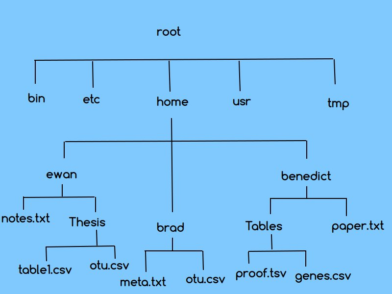
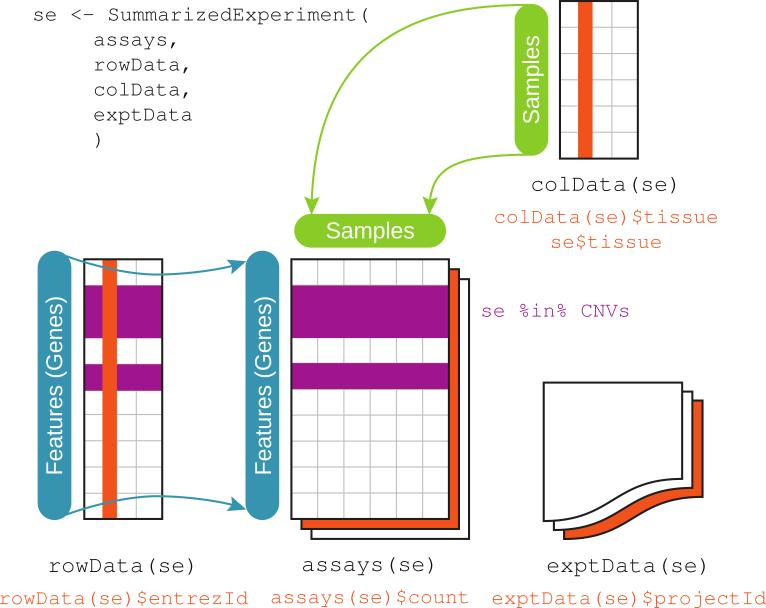

***


{width=400px} 


</br>

##A quick intro to the intro to R Lesson Series

</br>

This 'Intro to R Lesson Series' is brought to you by the Centre for the Analysis of Genome Evolution & Function's (CAGEF) bioinformatics training initiative. This course was developed based on feedback on the needs and interests of the Department of Cell & Systems Biology and the Department of Ecology and Evolutionary Biology. 


This lesson is the first in a 6-part series. The idea is that at the end of the series, you will be able to import and manipulate your data, make exploratory plots, perform some basic statistical tests, test a regression model, and make some even prettier plots and documents to share your results. 


</br>

How do we get there? Today we are going to be learning about the basic data structures in R, get cozy with the R environment, and learn how to get help when you are stuck. Because everyone gets stuck. A lot. Then you will learn how to get your data in and out of R. Next week we will learn how to tidy our data, subset and merge data and generate descriptive statistics. The next lesson will be data cleaning and string manipulation; this is really the battleground of coding - getting your data into the format where you can analyse it. After that, we will make all sorts of plots - from simple data exploration to interactive plots - this is always a fun lesson. And then lastly, we will learn to write some functions, which really can save you time and help scale up your analyses.


</br>

The structure of the class is a code-along style. It is hands on. The lecture AND code we are going through are available on GitHub for download at <https://github.com/eacton/CAGEF> __(Note: repo is private until approved)__, so you can spend the time coding and not taking notes. As we go along, there will be some challenge questions and multiple choice questions on Socrative. At the end of the class if you could please fill out a post-lesson survey (<https://www.surveymonkey.com/r/GD3KJB9>), it will help me further develop this course and would be greatly appreciated. 

</br>

***

####Data Files Used in This Lesson

-ENV_pitlatrine.csv     
-books_alpha.xlsx     
-adult_income.tsv     

These files can be downloaded at <https://github.com/eacton/CAGEF/tree/master/Lesson_1/data>. Right-click on the filename and select 'Save Link As...' to save the file locally. The files should be saved in the same folder you plan on using for your R script for this lesson.


***
####Highlighting

`grey background` - a package, function, code, command or directory      
*italics* - an important term or concept or an individual file or folder     
**bold** - heading or a term that is being defined      
<span style="color:blue">blue text</span> - named or unnamed hyperlink     

***


__Objective:__ At the end of this session you will be familiar with the R environment, setting your working directory, know about basic data structures in R and how to create them. You will be able to import data into R (tsv, csv, xls(x), googlesheets) and export your data again.

***

##Installing R and RStudio

Installing R:      
  Windows:      
    - Go to <http://cran.utstat.utoronto.ca/>      
    - Click on 'Download R for Windows'     
    - Click on 'install R for the first time'     
    - Click on 'Download R 3.4.4 for Windows' (if there is a newer version that is a-okay)     
    - Double-click on the .exe file once it has downloaded (in your Downloads folder if you haven't specified elsewhere) and follow the instructions.
  
  (Mac) OS X:     
    - Go to <http://cran.utstat.utoronto.ca/>      
    - Click on 'Download R for (Mac) OS X'     
    - Click on R-3.4.4.pkg (if there is a newer version that is a-okay)     
    - Open the .pkg file once it has downloaded (in your Downloads folder if you haven't specified elsewhere) and follow the instructions.
  
  Linux:     
    - sudo apt-get update     
    - sudo apt-get install r-base     
    - sudo apt-get install r-base-dev (so you can compile packages from source)

Installing RStudio:      
  Windows:     
    - Go to <https://www.rstudio.com/products/rstudio/download/#download>     
    - Click on 'RStudio 1.1.442 - Windows Vista/7/8/10' to download the installer (if there is a newer version that is a-okay)     
    - Double-click on the .exe file once it has downloaded (in your Downloads folder if you haven't specified elsewhere) and follow the instructions.
    
  (Mac) OS X:     
    - Go to <https://www.rstudio.com/products/rstudio/download/#download>     
    - Click on 'RStudio 1.1.442 - Mac OS X 10.6+ (64-bit)' to download the installer (if there is a newer version that is a-okay)     
    - Double-click on the .dmg file once it has downloaded (in your Downloads folder if you haven't specified elsewhere) and follow the instructions.     
    
   Linux:     
    - Go to <https://www.rstudio.com/products/rstudio/download/#download>     
    - Click on the installer that describes your system ie. 'RStudio 1.1.442 - Ubuntu 16.04+/Debian 9+ (64-bit)' (if there is a newer version that is a-okay)     
    - Double-click on the .deb file once it has downloaded and follow the instructions.     
    - If double-clicking on your .deb file did not open the software manager open the terminal (this can be found by searching for Terminal) and type sudo dpkg -i Downloads/rstudio-xenial-1.1.442-amd64.deb      
     _Note: You have 3 things that could change in this last command._     
     1. This assumes you have just opened the terminal and are in your home directory. (If not, you have to modify your path. You can get to your home directory by typing cd ~.)     
     2. This assumes you have downloaded the .deb file to Downloads. (If you downloaded the file somewhere else, you have to change the path to the file, or download the .deb file to Downloads).      
     3. This assumes your filename for .deb is the same as above. (Put the name matching the .deb file you downloaded).
    
If you have a problem with installing R or RStudio, please come 15 minutes before the lesson starts and I will help you troubleshoot your installation. You can also try to solve the problem yourself by Googling any error messages you get.    
    
##A quick intro to  the R environment

The "Comprehensive R Archive Network" (CRAN) is a collection of sites that have the same R and related R material (ie. new and previous versions of R software, documentation, packages and collections of R packages to download that might be useful in a particular field (CRAN Task Views), links to the R journal and R search sites, bug reports and fixes). Different sites (for example, we used http://cran.utstat.utoronto.ca/), are called a _mirrors_ because they reflect the content from the master site in Austria. There are mirrors worldwide to reduce the burden on the network. CRAN will be referred to here as a main repository for obtaining R packages.

To paraphrase the CRAN gurus:     
<https://cran.r-project.org/doc/manuals/r-release/R-intro.pdf>


R is an __environment__ because it has the tools and software for the storage, manipulation, statistical analysis, and graphical display for of data.  It comes with about 25 built-in 'packages' and uses a simple programming language ("S"). Users have been encouraged to make there own packages... there are now over 12,000 packages on CRAN and about 1,500 on Bioconductor.

{width=600px}
</br>

Bioconductor is another repository for R packages (<https://www.bioconductor.org/>), but it specializes in tools for high-throughput genomics data. One nice thing about Bioconductor is that it has decent vignettes; a __vignette__ is the set of documentation for a package explaining its functions and usages in a tutorial-like format. 

So...what are in these packages? A __package__ is a collection of functions, sometimes data, and compiled code. __Functions__ are the basic workhorses of R; they are the tools we use to analyze our data. Each function can be thought of as a unit that has a specific task. A function takes an input, evaluates an expression (ie. a calucation, plot, merge, etc.), and returns a value. (We will have an entire separate lesson to explore functions.)

RStudio is an IDE (Integrated Development Environment) for R that provides a more user-friendly experience than using R in a terminal setting. It has 4 main areas or panes, which you can customize to some extent under `Tools > Global Options > Pane Layout`:

1. __Source__ - The code you are annotating and keeping in your script.
2. __Console__ - Where your code is executed.
3. __Environment__ - What global objects you have created and functions you have written/sourced.     
   History -  A record of all the code you have executed in the console.     
   Connections - Which data sources you are connecting to. (Not being used in this course.)
4. __Files, Plots, Packages, Help, Viewer__ - self-explanatoryish if you click on their tabs.

All of the panes can be minimized or maximized using the large and small box outlines in the top right of each pane.

###Source

The __Source__ is where you are keeping the code and annotation that you want to be saved as your script. The tab at the top left of the pane has your script name (ie. 'Untitled.R'), and you can switch between scripts by toggling the tabs. You can save, search or publish your source code using the buttons along the pane header. Code in the Source pane is _run_ or _executed_ automatically. 

To run your current line of code or a highlighted segment of code from the Source pane you can:      
     a) click the button `'Run' -> 'Run Selected Line(s)'`,      
     b) click `'Code' -> 'Run Selected Line(s)'` from the menu bar,      
     c) use the keyboard shortcut `CTRL + ENTER` (recommended),      
     d) copy and paste your code into the Console and hit `Enter` (not recommended).
     
There are always many ways to do things in R, but the fastest way will always be the option that keeps your hands on the keyboard.

###Console

You can also type and execute your code (by hitting `ENTER`) in the __Console__ when the `>` prompt is visible. If you enter code and you see a `+` instead of a prompt, R doesn't think you are finished entering code (ie. you might be missing a bracket). If this isn't immediately fixable, you can hit `Esc` twice to get back to your prompt. Using the up and down arrow keys, you can find previous commands in the Console if you want to rerun code or fix an error resulting from a typo.

On the Console tab in the top left of that pane is your current working directory. Pressing the arrow next to your working directory will open your current folder in the Files pane. If you find your Console is getting too cluttered, selecting the broom icon in that pane will clear it for you. The Console also shows information: upon startup about R (such as version number), during the installation of packages, when there are warnings, and when there are errors. 

###Environment

In the __Global Environment__ you can see all of the stored objects you have created or sourced (imported from another script). The Global Environment can become cluttered, so it also has a broom button to clear its workspace.

__Objects__ are made by using the assignment operator `<-`. On the left side of the arrow, you have the name of your object. On the right side you have what you are assigning to that object. In this sense, you can think of an object as a container. The container holds the values given as well as information about 'class' and 'methods' (which we will come back to).

Type `x <- c(2,4)` in the Console followed by `Enter`. 1D objects' data types can be seen immediately as well as their first few values. Now type `y <- data.frame(numbers = c(1,2,3), letters = c("a","b","c"))` in the Console followed by `Enter`. You can immediately see the dimension of 2D objects, and you can check the structure of data frames and lists (more later) by clicking on the object's arrow. Clicking on the object name will open the object to view in a new tab. Custom functions created in session or sourced will also appear in this pane. 

The Environment pane dropdown displays all of the currently loaded packages in addition to the Global Environment. _Loaded_ means that all of the tools/functions in the package are available for use. R comes with a number of packages pre-loaded (ie. base, grDevices).  

In the History tab are all of the commands you have executed in the Console during your session. You can select a line of code and send it to the Source or Console. 

The Connections tab is to connect to data sources such as Spark and will not be used in this lesson.

###Files, Plots, Packages, Help, Viewer

The Files tab allows you to search through directories; you can go to or set your working directory by making the appropriate selection under the `More` (blue gear) drop-down menu. The `...` to the top left of the pane allows you to search for a folder in a more traditional manner. 

The Plots tab is where plots you make in a .R script will appear (notebooks and markdown plots will be shown in the Source pane). There is the option to Export and save these plots manually. 

The Packages tab has all of the packages that are installed and their versions, and buttons to Install or Update packages. A checkmark in the box next to the package means that the package is loaded. You can load a package by adding a checkmark next to a package, however it is good practice to instead load the package in your script to aid in reproducibility. 

The Help menu has the documentation for all packages and functions. For each function you will find a description of what the function does, the arguments it takes, what the function does to the inputs (details), what it outputs, and an example. Some of the help documentation is difficult to read or less than comprehensive, in which case googling the function is a good idea. 

The Viewer will display vignettes, or local web content such as a Shiny app, interactive graphs, or a rendered html document.

###Global Options

I suggest you take a look at `Tools -> Global Options` to customize your experience. 

For example, under `Code -> Editing` I have selected `Soft-wrap R source files` followed by `Apply` so that my text will wrap by itself when I am typing and not create a long line of text. 

You may also want to change the `Appearance` of your code. I like the `RStudio theme: Modern` and `Editor font: Ubuntu Mono`, but pick whatever you like! Again, you need to hit `Apply` to make changes.

That whirlwind tour isn't everything the IDE can do, but it is enough to get started.

##A quick note on directory structure

This is an image of a possible directory. 

{width=500px}

</br>

In this hierarchy we will pretend to be _benedict_, and we are hanging out in our _Tables_ folder. R looks to read in your files from your __working directory__, which in this case would be _Tables_, so at this moment, R would have access to _proof.tsv_ and _genes.csv_. If I tried to open _paper.txt_ under _benedict_, R would tell me there is no such file in my current working directory.

To get your working directory in R you would type in your Source pane: 

```
getwd()
```
You would then press `Enter` to execute the code in the Console. Technically, there is no reason to save this code and it could be typed and executed in the Console. However, to save some mental effort choosing which code to save or not (especially when starting out), let's type everything in the Source. You can always go back and choose what to delete, and harder to recreate what you didn't save.

The output in your Console would be:

```
[1] "/home/benedict/Tables"
```

R will always tell you your __absolute directory__. An absolute directory is a _path_ starting from your root `"/"`. The absolute directory can vary from computer to computer. My home directory and your home directory are not the same; our names differ in the path.


To move directories, it is good to know a couple shortcuts. `'.'` is your current directory. `'..'` is up one directory level. `'~'` is your home directory (a shortcut for `"home/benedict"`). Therefore, our current location could also be denoted as `"~/Tables"`.

To move to the directory _ewan_ we use a function that will set the working directory:

```
setwd("/home/ewan")
#or 
setwd("~/ewan")
#or 
setwd("../ewan")

```
A _relative directory_ is a path starting from whereever your currently are (your working directory). This path could be the same on your computer and my computer if and only if we have the same directory structure. 

If I wanted to move back to _Tables_ using the _absolute path_, I would set a new working directory:

```
setwd("/home/benedict/Tables")
#or
setwd("~/benedict/Tables")
```

And the _relative path_ would be:

```
setwd("../benedict/Tables")
```

There is some talk over setting working directories within scripts. Obviously, not everyone has the same absolute path, so if must set a directory in your script, _it is best to have a relative path starting from the folder your script is in_. Keep in mind that others you share your script with might not have the same directory structure if you refer to subfolders. 

You can set your working directory by:

1. `setwd()`     
2. `Session -> Set Working Directory` (3 Options)     
3. `Files Window -> More (Gear Symbol) -> Set As Working Directory`     


***
__Challenge__ 

<div style="float:left;margin:0 10px 10px 0" markdown="1">
{width=100px}
</div>

</br>

Assume you are in the _Tables_ folder. Which is NOT a valid way to get to the _Thesis_ folder?

- `setwd("../../ewan/Thesis")`
- `setwd("~/ewan/Thesis")`
- `setwd("../brad/../ewan/Thesis")`
- `setwd("./../../ewan/Thesis")`
- `setwd("/home/ewan/Thesis")`
- They are all valid, stop messing with me.

Follow-up: Which are the absolute paths?

</br>

***


##Making Life Easier

###Annotate your code

Why???

-Can you rerun this analysis and but change X parameter? (said every PI ever)     
-Can you make this plot, but with dashed lines, a different axis, with error bars? (said every PI ever)     
-Can I borrow your code? (a collaborator or officemate)     
-Your worst collaborator is actually you in 6-months. Do you remember what you had for breakfast last Tuesday? 


<div style="float:left;margin:0 10px 10px 0" markdown="1">

</div>
 

{width=300px}     
</br>


You can annotate your code for selfish reasons, or altruistic reasons, but annotate your code. 

How do I start?

- A hash-tag `#` will comment your text. A hash-tag in front of code means that code will not be evaluated.
- Put a description of what you are doing near your code (I prefer above) - at every process, decision point, or non-default argument in a function. For example, why you selected k=6, or the Spearman over Pearson option for your correlation matrix, or quantile over median normalization, or why you made the decision to filter out certain samples. 
- Break your code into sections to make it readable.
- Give your objects informative object names __that are not the same as function names__. 

_Keyboard shortcuts:_

Comment/Uncomment lines `CTRL + SHIFT + C`     
Reflow Comment (Wrap comments) `CTRL + SHIFT + /`


###Best Practices for Writing Scripts

    Start each script with a description of what it does.

    Then load all required packages.

    Consider what working directory you are in when sourcing a script.

    Use comments to mark off sections of code.

    Put function definitions at the top of your file, or in a separate file if there are many.

    Name and style code consistently. 

    Break code into small, discrete pieces.

    Factor out common operations rather than repeating them.

    Keep all of the source files for a project in one directory and use relative paths to access them.

    Keep track of the memory used by your program.

    Always start with a clean environment instead of saving the workspace.

    Keep track of session information in your project folder.

    Have someone else review your code.

    Use version control.

<https://swcarpentry.github.io/r-novice-inflammation/06-best-practices-R/>


###Trouble-shooting basics

- _file does not exist_ - working directory errors  - use `getwd()` to check where you are working, the Files window to check that your file exists there, and `setwd()` to change your directory
                         - work inside an _R project_ with your files in the same folder - your working directory will be set automatically when you open the project (this can be done by using `File -> New Project` and following prompts)
- _typos_ - R is case sensitive, check that you've spelled everything right
            - use _tab-completion_ when possible
- _open quotes, parentheses, brackets_
            - R Studio highlights matching brackets, and gives an 'x' on your left sidebar if your final bracket is not closed
- _data type_ - you can't perform a calculation on those 1, and 0's because they are actually characters and not numeric
- _unexpected answers_ - access the _help menu_ by typing `help("function")` or `?function` or `help(package = "package")` in the Source or Console to double-check how the function works and its output. The result will be in the lower-right pane under the Help tab (which is also searchable). 
- _function is not found_ - make sure the package is installed AND loaded
- _weird error_ you are not sure the meaning of - find answers online (see below)
- sometimes weird things happen - clear your environment and restart your R session
- _the R bomb_!! - congrats, you have completed an R rite of passage.

***

__Beginner Advice__ 

<div style="float:left;margin:0 10px 10px 0" markdown="1">
{width=100px}
</div>

Try to solve a problem yourself, but set a 30 minute cutoff on being stuck. At this level, many people have had and solved your problem. Beginners get frustrated because they get stuck and take hours to solve a problem themselves. Set your limit, stay within it, then go online and get help.
</br>
</br>

***

</br>

_Finding answers online_     

- 99% of the time, someone has already asked your question     
- Google, Stackoverflow, SEQanswers, quora, researchgate, RSeek, twitter, even reddit     
- Including the program, version, error, package and function helps, be specific     
- <http://stat545.com/help-general.html>      
  
  
_Asking a question_

- Summarize your question in the title.
- Introduce your question, how you ran into the problem, __and how you tried to solve it yourself__. If you haven't done the bolded thing, do the bolded thing.
- Show enough of your code to reproduce the problem.
- Add tags that match your problem.
- Respond to the feedback. People put in their free time to answer you.
- <https://stackoverflow.com/help/how-to-ask>     
- <https://www.r-project.org/posting-guide.html>

</br>


</br>

_Remember_ - everyone looks for help online ALL THE TIME. It is completely normal. Also, with programming there are multiple ways to come up with an answer. There are different packages that let you do the same thing, but with shortcuts. There are different levels of 'efficiency' and 'redundancy' in coding. You will work on refining these aspects of your code as you go along in this course, and in your coding career.

Last but not least, to make life easier: under Help there is a _Cheatsheet of Keyboard Shortcuts_.


##A quick intro to R data structures


There are 5 types of data structures in R.

1. vectors - 1D - holds one type of data
2. lists - 1D - holds multiple data types
3. matrices - 2D - holds one type of data 
4. data frames - 2D - holds multiple data types
5. arrays - nD - holds one type of data

What do I mean by 'type of data'?     

- character - a#c$E 
- numeric - 7.5
- integer - 1
- logical - TRUE, FALSE

Let's make some data!! 

The assignment operator `"<-"` assigns a value to an object. The equals sign `'='` is also an assignment operator. However, since equals signs are used in logical statements (==, >=, <=, !=) with a different meaning, I prefer to use `<-`. You will see both outside this course.

```
object_name <- value
#or equivalently
object_name = value
```
(This is for illustrative purposes only and is not code.)

###A quick word on functions.

We are going to use a simple function to create a vector. Functions take arguments. To find out which arguments they take, we can look at the help menu. The help menus in R can be intimidating and hard to read. Don't think it is just because you are new. If you really don't understand the help menu, you are probably not the only one, so look online and there will likely be a simpler explanation.

Let's look up the function `c()`, which combines values into a vector or list. It takes in the argument `'...'`, which is defined as the objects to be concatenated. In the description it says 'all arguments are coerced to a common type, which is the type of the returned value' and in the details it tells you the hierarchy of coercion: _NULL < raw < logical < integer < double < complex < character < list < expression_. It also says 'factors are treated only via their internal integer codes'. Now we don't know what all this means yet, but we come back to this as we go along. The output of the function is 'NULL or an expression or a vector'. At the bottom of the help menu, there are usually examples of how to use the function, which are sometimes easier to understand than the documentation. 


###Vectors

Here are what vectors of each data 'type' would look like. Note that character items must be in quotations. 'L' is placed next to a number to specify an integer. 


```r
vec_char <- c("bacteria", "virus", "archaea")
#this is equivalent to
vec_char <- c('bacteria', 'virus', 'archaea')
vec_char
```

```
## [1] "bacteria" "virus"    "archaea"
```

```r
vec_num <- c(1:10)
vec_num
```

```
##  [1]  1  2  3  4  5  6  7  8  9 10
```

```r
vec_log <- c(TRUE, FALSE, TRUE)
vec_log
```

```
## [1]  TRUE FALSE  TRUE
```

```r
vec_int <- c(1L, 8L)
vec_int
```

```
## [1] 1 8
```

What happens if we try to include more than one type of data?


```r
vec_mixed <- c("bacteria", 1, TRUE)
vec_mixed
```

```
## [1] "bacteria" "1"        "TRUE"
```


R will _coerce_ your vector to be of one data type, in this case the type that is most inclusive is a character vector. 
What do you think will happen if 'bacteria' is removed from the vector? Will it be coerced to the same type?


```r
vec_mixed <- c(1, TRUE)
vec_mixed
```

```
## [1] 1 1
```

R has forced the vector to be numeric. TRUE and FALSE may be represented by 1 and 0, respectively.


```r
vec_test <- as.numeric(vec_log)
vec_test
```

```
## [1] 1 0 1
```


Does it work to change it back into TRUE and FALSE?


```r
vec_log <- as.logical(vec_test)
vec_log
```

```
## [1]  TRUE FALSE  TRUE
```

What about for our mixed vector?


```r
vec_mixed <- as.logical(vec_mixed)
vec_mixed
```

```
## [1] TRUE TRUE
```

I am highlighting this for a couple of reasons. Keep your data types in mind. It is good practice to look at your object or the global environment to make sure the object that you just made is what you think it is. Secondly, it can be useful for data analysis to be able to switch from TRUE/FALSE to 1/0, and it is pretty easy, as we have just seen.

You can name the contents of your vectors or specify them upon vector creation.


```r
names(vec_log) <- c("male", "elderly", "heart attack")
#is equivalent to 
vec_log <- c("male" = TRUE, "elderly" = FALSE, "heart attack" = TRUE)
vec_log
```

```
##         male      elderly heart attack 
##         TRUE        FALSE         TRUE
```

The number of elements in a vector is its length.


```r
length(vec_char)
```

```
## [1] 3
```

```r
length(vec_num)
```

```
## [1] 10
```

```r
length(vec_log)
```

```
## [1] 3
```


You can grab a specific element by its index, or by its name. 


```r
vec_char[3]
```

```
## [1] "archaea"
```

```r
vec_char[2:3] 
```

```
## [1] "virus"   "archaea"
```

```r
#second and third element in the vector inclusive 
#(this is not the same for all programming languages)

vec_log["male"]
```

```
## male 
## TRUE
```


###Lists

Lists can hold mixed data types of different lengths.


```r
list_mix <- list(character = c('bacteria', 'virus', 'archaea'), 
                 num = c(1:10), 
                 log = c(TRUE, FALSE, TRUE))

#formatting - equivalent, but less reader friendly for longer lists
list_mix = list(character = c('bacteria', 'virus', 'archaea'), num = c(1:10), log = c(TRUE, FALSE, TRUE))
list_mix
```

```
## $character
## [1] "bacteria" "virus"    "archaea" 
## 
## $num
##  [1]  1  2  3  4  5  6  7  8  9 10
## 
## $log
## [1]  TRUE FALSE  TRUE
```

Lists can get complicated. If you forget what is in your list, use the `str()` function to check out its structure. It will tell you the number of items in your list and their data types. You can (and should) call `str()` on any R object. You can also try it on one of our vectors.


```r
str(list_mix)
```

```
## List of 3
##  $ character: chr [1:3] "bacteria" "virus" "archaea"
##  $ num      : int [1:10] 1 2 3 4 5 6 7 8 9 10
##  $ log      : logi [1:3] TRUE FALSE TRUE
```

```r
str(vec_mixed)
```

```
##  logi [1:2] TRUE TRUE
```


To subset for 'virus', I first have to subset for the character element of the list. Kind of like a Russian nested doll or a present, where you have to open the outer layer to get to the next.


```r
list_mix[[1]]
```

```
## [1] "bacteria" "virus"    "archaea"
```

```r
list_mix[[1]][2]
```

```
## [1] "virus"
```


###Matrices

Create a demo matrix.  


```r
mat <- matrix(c(rep(0, 10), rep(1,10)), nrow = 5, ncol = 5)
mat
```

```
##      [,1] [,2] [,3] [,4] [,5]
## [1,]    0    0    1    1    0
## [2,]    0    0    1    1    0
## [3,]    0    0    1    1    0
## [4,]    0    0    1    1    0
## [5,]    0    0    1    1    0
```

***

<div style="float:left;margin:0 10px 10px 0" markdown="1">
{width=100px}

</div>
What has happened here? Look up the `rep()` function. Why has R not thrown an error? How would I make this same matrix without vector recycling? Can you think of 2 ways?          
</br>     


***
__Challenge__ 

<div style="float:left;margin:0 10px 10px 0" markdown="1">
{width=100px}
</div>
Make a 4 x 4 matrix that looks like this, using the `seq()` function at least once. 

<pre>
2   4   6   8
10  12  3   6
9   12  0   1
0   1   0   1
</pre>

***


A matrix is a 2D object. We can now check out a couple more properties - like the number of rows and columns.


```r
str(mat)
```

```
##  num [1:5, 1:5] 0 0 0 0 0 0 0 0 0 0 ...
```

```r
nrow(mat)
```

```
## [1] 5
```

```r
ncol(mat)
```

```
## [1] 5
```

```r
dim(mat)
```

```
## [1] 5 5
```

```r
length(mat)
```

```
## [1] 25
```

To access a specific row or column we can still use indexing.


```r
mat[3:5,]
```

```
##      [,1] [,2] [,3] [,4] [,5]
## [1,]    0    0    1    1    0
## [2,]    0    0    1    1    0
## [3,]    0    0    1    1    0
```

```r
mat[, 4]
```

```
## [1] 1 1 1 1 1
```

Note that when we are subsetting a single row or column, we end up with a vector.


```r
is.vector(mat[,4])
```

```
## [1] TRUE
```

It is common to transform matrices. Note that the set of ones will now be in rows rather than columns.


```r
t(mat)
```

```
##      [,1] [,2] [,3] [,4] [,5]
## [1,]    0    0    0    0    0
## [2,]    0    0    0    0    0
## [3,]    1    1    1    1    1
## [4,]    1    1    1    1    1
## [5,]    0    0    0    0    0
```


***

<div style="float:left;margin:0 10px 10px 0" markdown="1">
{width=100px}
</div>

Now that we have had the opportunity to create a few different objects, let's talk about what an object _class_ is. An object class can be thought of as how an object will behave in a function. Because of this data frames, lists and matrices have their own classes, while vectors inherit from their data type (vectors of characters behave like characters, vectors of numbers behave like numbers).


```r
class(vec_char)
```

```
## [1] "character"
```

```r
class(vec_num)
```

```
## [1] "integer"
```

```r
class(mat)
```

```
## [1] "matrix"
```

```r
class(list_mix)
```

```
## [1] "list"
```

Some package creaters will have created their own data classes and will require your data to be in the format required of that class. For example in Bioconducter there is an _ExpressionSet_ class. 



</br>

This class contains your metadata (information about your samples), your assay data (experiment results), and your feature data (information about genes, probes, whatnot) in different slots. Functions in a package using this class may not work unless your data is in the ExpressionSet class format. This isn't something we will be dealing with a lot in this class, but it is good to be aware of from a trouble-shooting perspective.     

***

###Data Frames

Data frames are lists to the extent that they can hold different types of data. However, they must be of equal length.


```r
dat <- data.frame(character = c('bacteria', 'virus', 'archaea'), 
                 num = c(1:10), 
                 log = c(TRUE, FALSE, TRUE))
```

```
## Error in data.frame(character = c("bacteria", "virus", "archaea"), num = c(1:10), : arguments imply differing number of rows: 3, 10
```

```r
dat <- data.frame(character = c('bacteria', 'virus', 'archaea'), 
                 num = c(1:3), 
                 log = c(TRUE, FALSE, TRUE))
dat
```

```
##   character num   log
## 1  bacteria   1  TRUE
## 2     virus   2 FALSE
## 3   archaea   3  TRUE
```

Many R packages have been made to work with data in data frames, and this is the class of object where we will spend most of our time. 

Let's use some of the functions we have learned for finding out about the structure of our data frame.


```r
str(dat)
```

```
## 'data.frame':	3 obs. of  3 variables:
##  $ character: Factor w/ 3 levels "archaea","bacteria",..: 2 3 1
##  $ num      : int  1 2 3
##  $ log      : logi  TRUE FALSE TRUE
```

***

<div style="float:left;margin:0 10px 10px 0" markdown="1">
{width=100px}

</div>

What is a _factor_?

A factor is a _class_ of object used to encode a character vector into categories. This will become clear with a bit more data, so lets make our data frame larger by adding rows. We can only do this if the data we want to add has the same number of columns. How many rows and columns does this new data frame have?


```r
dat_large <-  rbind(dat, dat, dat)

nrow(dat_large)
```

```
## [1] 9
```

```r
ncol(dat_large)
```

```
## [1] 3
```

```r
dim(dat_large)
```

```
## [1] 9 3
```

If we look at the structure again, we still have 3 levels. This is because each unique character element has been encoded as a number.
(Note that a column can be subset by index or by its name using the `'$'` operator.)


```r
dat_large$character
```

```
## [1] bacteria virus    archaea  bacteria virus    archaea  bacteria virus   
## [9] archaea 
## Levels: archaea bacteria virus
```

```r
#equivalent to
dat_large[ ,1]
```

```
## [1] bacteria virus    archaea  bacteria virus    archaea  bacteria virus   
## [9] archaea 
## Levels: archaea bacteria virus
```

```r
levels(dat_large$character)
```

```
## [1] "archaea"  "bacteria" "virus"
```

Note that the first character object in the data frame is 'bacteria', however, the first factor level is archaea. R by default puts factor levels in _alphabetical order_. This can cause problems if we aren't aware of it. Always check to make sure your factor levels are what you expect. With factors, we can deal with our character levels directly, or their numeric equivalents. Factors are extremely useful for performing group calculations as we will see later in the course.


```r
as.numeric(dat_large$character)
```

```
## [1] 2 3 1 2 3 1 2 3 1
```

***
__Challenge__ 

<div style="float:left;margin:0 10px 10px 0" markdown="1">
{width=100px}
</div>

Look up the factor function. Use it to make 'bacteria' the first level, 'virus' the second level, and 'archaea' the third level for the data frame 'dat'. Bonus if you can make the level numbers match (1,2,3 instead of 2,3,1). Use functions from the lesson to make sure your answer is correct. 

</br>     
</br>     

***


We can also convert between data types if they are similar enough. For example, I can convert my matrix into a data frame. Since a data frame can hold any type of data, it can hold all of the numeric data in a matrix.


```r
new_dat <- as.data.frame(mat)
new_dat
```

```
##   V1 V2 V3 V4 V5
## 1  0  0  1  1  0
## 2  0  0  1  1  0
## 3  0  0  1  1  0
## 4  0  0  1  1  0
## 5  0  0  1  1  0
```

Note that R just made up column names for us. We can provide our own vector of column names.


```r
colnames(new_dat) <- c("col1", "col2", "col3", "col4", "col5")
#equivalent to
colnames(new_dat) <- c(paste0(rep("col",5), 1:5))
new_dat
```

```
##   col1 col2 col3 col4 col5
## 1    0    0    1    1    0
## 2    0    0    1    1    0
## 3    0    0    1    1    0
## 4    0    0    1    1    0
## 5    0    0    1    1    0
```

In contrast, our data frame with multiple data types can not be converted into a matrix, as a matrix can only hold one data type. We could however, transform our new_dat back into a matrix. The matrix will retain our column heading.


```r
new_mat <- as.matrix(new_dat)
new_mat
```

```
##      col1 col2 col3 col4 col5
## [1,]    0    0    1    1    0
## [2,]    0    0    1    1    0
## [3,]    0    0    1    1    0
## [4,]    0    0    1    1    0
## [5,]    0    0    1    1    0
```


###Arrays

Arrays are n dimensional objects that hold numeric data. To create an array, we give a vector of data to fill the array, and then the dimensions of the array. This code will recycle the vector 1:10 and fill 5 arrays that have 2 x 3 dimensions. To visualize the array, we will print it afterwards.


```r
arr <- array(data = 1:10, dim = c(2,3,5))
arr
```

```
## , , 1
## 
##      [,1] [,2] [,3]
## [1,]    1    3    5
## [2,]    2    4    6
## 
## , , 2
## 
##      [,1] [,2] [,3]
## [1,]    7    9    1
## [2,]    8   10    2
## 
## , , 3
## 
##      [,1] [,2] [,3]
## [1,]    3    5    7
## [2,]    4    6    8
## 
## , , 4
## 
##      [,1] [,2] [,3]
## [1,]    9    1    3
## [2,]   10    2    4
## 
## , , 5
## 
##      [,1] [,2] [,3]
## [1,]    5    7    9
## [2,]    6    8   10
```
This arrangement makes it more clear how we would subset the number 7 out of array 5.


```r
arr[1, 2, 5]
```

```
## [1] 7
```
A 2D array is just a matrix. Unless you specify a 3rd dimension.


```r
mat_arr <- array(data = 1:10, dim = c(2,3))
mat_arr
```

```
##      [,1] [,2] [,3]
## [1,]    1    3    5
## [2,]    2    4    6
```

```r
#equivalent to
arr_mat <- array(data = 1:10, dim = c(2,3,1))
arr_mat
```

```
## , , 1
## 
##      [,1] [,2] [,3]
## [1,]    1    3    5
## [2,]    2    4    6
```

```r
all.equal(mat_arr, arr_mat)
```

```
## [1] "Attributes: < Component \"dim\": Numeric: lengths (2, 3) differ >"
## [2] "target is matrix, current is array"
```

```r
class(mat_arr)
```

```
## [1] "matrix"
```

```r
class(arr_mat)
```

```
## [1] "array"
```
Personally, I don't use arrays in my daily genomics life, so if you find this confusing, I wouldn't worry about it too much.

</br>

####Using R for a Calculator

So you can do math...

Addition

```r
3 + 4
```

```
## [1] 7
```
Subtraction

```r
3 - 4
```

```
## [1] -1
```

Multiplication

```r
3 * 4
```

```
## [1] 12
```

Division

```r
3 / 4
```

```
## [1] 0.75
```

Exponents

```r
3^4
```

```
## [1] 81
```

A logic test ensues.


```r
x <- 7
y <- x +3
y
```

```
## [1] 10
```

If x gets updated, what happens to y? This is something you need to be aware of when running code - variables dependent on other variables and where in your program they are created and updated.


```r
x <- 8
y 
```

```
## [1] 10
```

```r
y <- x +3
y
```

```
## [1] 11
```


So you can do math... on a vector.


```r
vec_num * 4
```

```
##  [1]  4  8 12 16 20 24 28 32 36 40
```
So you can do math... on a vector.


```r
vec_log * 4 #uh oh - that is probably not what you want... 
```

```
##         male      elderly heart attack 
##            4            0            4
```

So you can do math... on a list.


```r
list_mix * 4 
```

```
## Error in list_mix * 4: non-numeric argument to binary operator
```

```r
list_mix[[2]] * 4
```

```
##  [1]  4  8 12 16 20 24 28 32 36 40
```

```r
list_mix[[2]][2:4] * 4
```

```
## [1]  8 12 16
```

So you can do math... on a matrix.


```r
mat * 4
```

```
##      [,1] [,2] [,3] [,4] [,5]
## [1,]    0    0    4    4    0
## [2,]    0    0    4    4    0
## [3,]    0    0    4    4    0
## [4,]    0    0    4    4    0
## [5,]    0    0    4    4    0
```

So you can do math... on a data frame.


```r
dat * 4
```

```
## Warning in Ops.ordered(left, right): '*' is not meaningful for ordered
## factors
```

```
##   character num log
## 1        NA   4   4
## 2        NA   8   0
## 3        NA  12   4
```

```r
dat$num * 4
```

```
## [1]  4  8 12
```

```r
dat[ , 2] * 4
```

```
## [1]  4  8 12
```

So you can do math... on an array.


```r
arr * 4
```

```
## , , 1
## 
##      [,1] [,2] [,3]
## [1,]    4   12   20
## [2,]    8   16   24
## 
## , , 2
## 
##      [,1] [,2] [,3]
## [1,]   28   36    4
## [2,]   32   40    8
## 
## , , 3
## 
##      [,1] [,2] [,3]
## [1,]   12   20   28
## [2,]   16   24   32
## 
## , , 4
## 
##      [,1] [,2] [,3]
## [1,]   36    4   12
## [2,]   40    8   16
## 
## , , 5
## 
##      [,1] [,2] [,3]
## [1,]   20   28   36
## [2,]   24   32   40
```

```r
arr[1, 2, 5] * 4 
```

```
## [1] 28
```

These are illustrative examples to see how our different data structures behave. In reality, you will want to do calculations across rows and columns, and not on your entire matrix or data frame. For example, we might have a count table where rows are genes, columns are samples, and we want to know the sum of all the counts for a gene. To do this, we can use the `apply()` function. `apply()` takes an array, matrix (or something that can be coerced to such, like a numeric data frame), and applies a function over row (`MARGIN = 1`) or columns (`MARGIN = 2`). Here we can invoke the `sum` function. 


```r
counts <- data.frame(Site1 = c(geneA = 2, geneB = 4, geneC = 12, geneD = 8),
                     Site2 = c(geneA = 15, geneB = 18, geneC = 27, geneD = 28),
                     Site3 = c(geneA = 10, geneB = 7, geneC = 13, geneD = 15))
                     
counts
```

```
##       Site1 Site2 Site3
## geneA     2    15    10
## geneB     4    18     7
## geneC    12    27    13
## geneD     8    28    15
```

```r
apply(counts, MARGIN = 1, sum)
```

```
## geneA geneB geneC geneD 
##    27    29    52    51
```

```r
str(apply(counts, MARGIN = 1, sum))
```

```
##  Named num [1:4] 27 29 52 51
##  - attr(*, "names")= chr [1:4] "geneA" "geneB" "geneC" "geneD"
```

```r
class(apply(counts, MARGIN = 1, sum))
```

```
## [1] "numeric"
```

Note that the output is no longer a data frame. Since the resulting sums would have the dimensions of a 1x4 matrix, the results are instead coerced to a named numeric vector. The apply function will recognize basic functions.


```r
apply(counts, MARGIN = 1, mean)
```

```
##     geneA     geneB     geneC     geneD 
##  9.000000  9.666667 17.333333 17.000000
```

```r
apply(counts, MARGIN = 1, sd)
```

```
##     geneA     geneB     geneC     geneD 
##  6.557439  7.371115  8.386497 10.148892
```

```r
apply(counts, MARGIN = 1, median)
```

```
## geneA geneB geneC geneD 
##    10     7    13    15
```

```r
apply(counts, MARGIN = 1, quantile)
```

```
##      geneA geneB geneC geneD
## 0%     2.0   4.0  12.0   8.0
## 25%    6.0   5.5  12.5  11.5
## 50%   10.0   7.0  13.0  15.0
## 75%   12.5  12.5  20.0  21.5
## 100%  15.0  18.0  27.0  28.0
```

Public service announcement. Know what logarithm you are using. 


```r
#this is base exp(1)
apply(counts, MARGIN = 1, log) 
```

```
##           geneA    geneB    geneC    geneD
## Site1 0.6931472 1.386294 2.484907 2.079442
## Site2 2.7080502 2.890372 3.295837 3.332205
## Site3 2.3025851 1.945910 2.564949 2.708050
```

```r
str(apply(counts, MARGIN = 1, log))
```

```
##  num [1:3, 1:4] 0.693 2.708 2.303 1.386 2.89 ...
##  - attr(*, "dimnames")=List of 2
##   ..$ : chr [1:3] "Site1" "Site2" "Site3"
##   ..$ : chr [1:4] "geneA" "geneB" "geneC" "geneD"
```

```r
class(apply(counts, MARGIN = 1, log))
```

```
## [1] "matrix"
```

```r
apply(counts, MARGIN = 1, log2)
```

```
##          geneA    geneB    geneC    geneD
## Site1 1.000000 2.000000 3.584963 3.000000
## Site2 3.906891 4.169925 4.754888 4.807355
## Site3 3.321928 2.807355 3.700440 3.906891
```

```r
apply(counts, MARGIN = 1, log10)
```

```
##          geneA    geneB    geneC    geneD
## Site1 0.301030 0.602060 1.079181 0.903090
## Site2 1.176091 1.255273 1.431364 1.447158
## Site3 1.000000 0.845098 1.113943 1.176091
```

When all data values are transformed, the output is a numeric matrix.

What if I want to know something else? We can create a function. The sum function we called before can also be written as a function taking in x (in this case the vector of values from our coerced data frame row by row) and summing them. Other functions can be passed to `apply()` in this way.


```r
apply(counts, MARGIN = 1, sum)
```

```
## geneA geneB geneC geneD 
##    27    29    52    51
```

```r
#equivalent to
apply(counts, MARGIN = 1, function(x) sum(x))
```

```
## geneA geneB geneC geneD 
##    27    29    52    51
```

***
__Challenge__ 

<div style="float:left;margin:0 10px 10px 0" markdown="1">
{width=100px}
</div>

Create a function to get the counts to multiply all for each gene by 3.

</br>
</br>     

***


</br>

#A primer on missing data

Sometimes there is missing data in a dataset. For an example, I am going to take the earlier counts table and add a few NAs. If I now try to calculate the mean number of counts, I will get NA as an answer for the rows that had NAs.


```r
counts <- data.frame(Site1 = c(geneA = 2, geneB = 4, geneC = 12, geneD = 8),
                     Site2 = c(geneA = 15, geneB = NA, geneC = 27, geneD = 28),
                     Site3 = c(geneA = 10, geneB = 7, geneC = 13, geneD = NA))

counts
```

```
##       Site1 Site2 Site3
## geneA     2    15    10
## geneB     4    NA     7
## geneC    12    27    13
## geneD     8    28    NA
```

```r
apply(counts, MARGIN = 1, mean)
```

```
##    geneA    geneB    geneC    geneD 
##  9.00000       NA 17.33333       NA
```
How do we find out ahead of time that we are missing data? Knowing is half the battle.
With a vector we can easily see how some basic functions work.


```r
na_vec <- c(5, 6, NA, 7, 7, NA)

is.na(na_vec)
```

```
## [1] FALSE FALSE  TRUE FALSE FALSE  TRUE
```
We are returned a logical vector of whether or not a value was NA. We can get the positional index and remove the NAs.


```r
which(is.na(na_vec))
```

```
## [1] 3 6
```

```r
remove_na_vec <- na_vec[c(-3,-6)]
#equivalentish to 
remove_na_vec <- na.omit(na_vec)
remove_na_vec
```

```
## [1] 5 6 7 7
## attr(,"na.action")
## [1] 3 6
## attr(,"class")
## [1] "omit"
```

With a large data frame, it may be hard to look at every cell to tell if there are NAs. The function `complete.cases()` looks by row to see whether any row contains an NA. You can then subset out the rows with the NAs.

```r
is.na(counts)
```

```
##       Site1 Site2 Site3
## geneA FALSE FALSE FALSE
## geneB FALSE  TRUE FALSE
## geneC FALSE FALSE FALSE
## geneD FALSE FALSE  TRUE
```

```r
any(is.na(counts))
```

```
## [1] TRUE
```

```r
complete.cases(counts)
```

```
## [1]  TRUE FALSE  TRUE FALSE
```

```r
counts[complete.cases(counts),]
```

```
##       Site1 Site2 Site3
## geneA     2    15    10
## geneC    12    27    13
```
If you want to keep all of the observations in your data frame and do your calculations anyways, now that you are aware of what is going on in your dataset, some functions specifically allow for this. Let's look up the documentation for the `mean()` function.


```r
apply(counts, MARGIN = 1, mean, na.rm = TRUE)
```

```
##    geneA    geneB    geneC    geneD 
##  9.00000  5.50000 17.33333 18.00000
```

Most of the functions used above have this parameter. Although some do not.


```r
apply(counts, MARGIN = 1, log, na.rm = TRUE)
```

```
## Error in FUN(newX[, i], ...): unused argument (na.rm = TRUE)
```
In this case na.omit can be useful. 


```r
apply(counts, MARGIN = 1, na.omit(log))
```

```
##           geneA    geneB    geneC    geneD
## Site1 0.6931472 1.386294 2.484907 2.079442
## Site2 2.7080502       NA 3.295837 3.332205
## Site3 2.3025851 1.945910 2.564949       NA
```
You can similarly deal with NaNs in R. NaNs (not a number) are NAs (not available), but NAs are not NaNs. NaNs appear for imaginary or complex numbers or unusual numeric values. Some packages may output NAs, NaNs, or Inf/-Inf (can be found with `is.finite()` ). 


```r
na_vec <- c(5, 6, NA, 7, 7, NA)
nan_vec <- c(5, 6, NaN, 7, 7, 0/0)

is.na(na_vec)
```

```
## [1] FALSE FALSE  TRUE FALSE FALSE  TRUE
```

```r
is.na(nan_vec)
```

```
## [1] FALSE FALSE  TRUE FALSE FALSE  TRUE
```

```r
is.nan(na_vec)
```

```
## [1] FALSE FALSE FALSE FALSE FALSE FALSE
```

```r
is.nan(nan_vec)
```

```
## [1] FALSE FALSE  TRUE FALSE FALSE  TRUE
```

Basically, if you come across NaNs, you can use the same functions such as `complete.cases()` that you use with NAs.

Depending on your purpose, you may replace NAs with a sample average, or the mode of the data, or a value that is below a threshold.


```r
counts[is.na(counts)] <- 0 

counts
```

```
##       Site1 Site2 Site3
## geneA     2    15    10
## geneB     4     0     7
## geneC    12    27    13
## geneD     8    28     0
```

</br>

#Installing and importing libraries

There are a few different places you can install packages from R. Listed in order of decreasing sketchiness:

- Bioconductor (Bioinformatics/Genomics focus)
    + Guidelines for submission, reviewed, and must have a vignette.
- CRAN (The Comprehensive R Archive Network)
    + Guidelines for submission, reviewed. Where the majority of packages are.
- GitHub
    + No formal review process, but peers can opens issues to highlight problems or suggest fixes.
    + The is an increasing number of publibacteriaion-related packages.
- Joe's website
    + No review process. Not sure I trust that guy. 
    
</br>

`devtools` is a package that is used for making R packages, but it also helps us to install packages from Github. It is downloaded from CRAN.


```r
install.packages('devtools') 
```

R may give you package installation warnings. Don't panic. In general, your package will either be installed and R will test if the installed package can be loaded, or R will give you a _non-zero exit status_ - which means your package did not install. If you read the entire error message, it will give you a hint as to why the package did not install.

Some packages _depend_ on previously developed packages and can only be installed after another package is installed in your library. Similarly, that previous package may depend on another package... here is the solution to install the package and all of the prior packages it relies on.


```r
install.packages('devtools', dependencies = TRUE)
```

You can install more than one package at once.


```r
install.packages(c('dplyr', 'devtools', 'readxl'), dependencies = TRUE)
```

A package only has to be installed once. It is now in your _library_. To use a package, you must _load_ the package into memory. Unless this is one of the packages R loads automatically, you choose which packages to load every session. 


```r
library(devtools) 
# or library('devtools')
```

Likewise, you can load many packages at once:


```r
library(c('dplyr', 'readxl'))
```

To install from Bioconductor you can either always use source to use biocLite...


```r
source("https://bioconductor.org/biocLite.R")
biocLite("BiocInstaller")
```

Or you can use the BiocInstaller package to install other packages instead of typing in that url every time.


```r
library(BiocInstaller)
biocLite('limma')
```


As forementioned `devtools` is required to install from GitHub. We don't actually need to load the entire package for `devtools` if we are only going to use one function. We select a function using this syntax `package::function()`.


```r
devtools::install_github("jennybc/googlesheets")
```

All packages are loaded the same regardless of their origin, using `library()`.


```r
library(googlesheets)
```


***
__Challenge__ 

<div style="float:left;margin:0 10px 10px 0" markdown="1">
{width=100px}
</div>

Install and load the package `DESeq2`.

</br>

</br>


***


</br>

#Reading in data & writing data

###Dataset: Pyrosequencing of the V3-V5 hypervariable regions of the 16S rRNA gene

16S rRNA pyrosequencing of 30 latrines from Tanzania and Vietnam at different depths (multiples of 20cm). Microbial abundance is represented in Operational Taxonomic Units (OTUs). Operational Taxonomic Units (OTUs) are groups of organisms defined by a specified level of DNA sequence similarity at a marker gene (e.g. 97% similarity at the V4 hypervariable region of the 16S rRNA gene). Intrinsic environmental factors such as pH, temperature, organic matter composition were also recorded.

We have 2 csv files:

1. A metadata file (Naming conventions: [Country_LatrineNo_Depth]) with sample names and environmental variables.     
2. OTU abundance table.

B Torondel, JHJ Ensink, O Gunvirusdu, UZ Ijaz, J Parkhill, F Abdelahi, V-A Nguyen, S Sudgen, W Gibson, AW Walker, and C Quince.
Assessment of the influence of intrinsic environmental and geographical factors on the bacterial ecology of pit latrines
Microbial Biotechnology, 9(2):209-223, 2016. DOI:10.1111/1751-7915.12334

***

##tsv/csv files (utils and readr) 

Let's read our metadata file into R. While we do these exercises, we are going to become friends with the Help menu. Let's start by using the `read.table()` function which takes in the path to our file.


```r
meta <- read.table(file = "data/ENV_pitlatrine.csv")
```

To see the result, we can look at 'meta' in the Environment pane and see that there are 82 observations of one variable. If we click on the arrow next to 'meta' we can now see that we have a column 'V1' and the variable type is a factor. We can also hover the mouse over the column name for this information. 

We can click on 'meta' in the Environment pane or type `View(meta)` in the Console to open a spreadsheet-like view of 'meta' in a new tab. `head()` will show us the first 10 rows of our data frame. `tail()` would show the last 10 rows.


```r
head(meta)
```

```
##                                                              V1
## 1 Samples,pH,Temp,TS,VS,VFA,CODt,CODs,perCODsbyt,NH4,Prot,Carbo
## 2         T_2_1,7.82,25.1,14.53,71.33,71,874,311,36,3.3,35.4,22
## 3            T_2_10,9.08,24.2,37.76,31.52,2,102,9,9,1.2,18.4,43
## 4                T_2_12,8.84,25.1,71.11,5.94,1,35,4,10,0.5,0,17
## 5        T_2_2,6.49,29.6,13.91,64.93,3.7,389,180,46,6.2,29.3,25
## 6        T_2_3,6.46,27.9,29.45,26.85,27.5,161,35,22,2.4,19.4,31
```

This is pretty ugly looking. Why?
In the help file the default `sep` or what is separating columns is expected to be a space. We need to use specify a comma instead.  


```r
meta <- read.table(file = "data/ENV_pitlatrine.csv", sep = ",")
head(meta)
```

```
##        V1   V2   V3    V4    V5   V6   V7   V8         V9 V10  V11   V12
## 1 Samples   pH Temp    TS    VS  VFA CODt CODs perCODsbyt NH4 Prot Carbo
## 2   T_2_1 7.82 25.1 14.53 71.33   71  874  311         36 3.3 35.4    22
## 3  T_2_10 9.08 24.2 37.76 31.52    2  102    9          9 1.2 18.4    43
## 4  T_2_12 8.84 25.1 71.11  5.94    1   35    4         10 0.5    0    17
## 5   T_2_2 6.49 29.6 13.91 64.93  3.7  389  180         46 6.2 29.3    25
## 6   T_2_3 6.46 27.9 29.45 26.85 27.5  161   35         22 2.4 19.4    31
```

Better. Looking in the Environment pane 'meta' now has 82 rows and 12 columns, meaning our columns are separated appropriately, but what about our column titles? We want the names in the 1st row to be our column headings.


```r
meta <- read.table(file = "data/ENV_pitlatrine.csv", sep = ",", header = TRUE)
head(meta)
```

```
##   Samples   pH Temp    TS    VS  VFA CODt CODs perCODsbyt NH4 Prot Carbo
## 1   T_2_1 7.82 25.1 14.53 71.33 71.0  874  311         36 3.3 35.4    22
## 2  T_2_10 9.08 24.2 37.76 31.52  2.0  102    9          9 1.2 18.4    43
## 3  T_2_12 8.84 25.1 71.11  5.94  1.0   35    4         10 0.5  0.0    17
## 4   T_2_2 6.49 29.6 13.91 64.93  3.7  389  180         46 6.2 29.3    25
## 5   T_2_3 6.46 27.9 29.45 26.85 27.5  161   35         22 2.4 19.4    31
## 6   T_2_6 7.69 28.7 65.52  7.03  1.5   57    3          6 0.8  0.0    14
```

We use `header=TRUE` to specify that the first row we read in will be the column headers. We now have 81 rows and 12 columns. 

These samples are not replicates. Each represents a combination of a different country, latrine, and depth. In this case, we might prefer to have Samples as character data, not a factor. (Note: TRUE and FALSE can be abbreviated as T and F)


```r
meta <- read.table(file = "data/ENV_pitlatrine.csv", sep = ",", header = T, stringsAsFactors = F)
str(meta)
```

```
## 'data.frame':	81 obs. of  12 variables:
##  $ Samples   : chr  "T_2_1" "T_2_10" "T_2_12" "T_2_2" ...
##  $ pH        : num  7.82 9.08 8.84 6.49 6.46 7.69 7.48 7.6 7.55 7.68 ...
##  $ Temp      : num  25.1 24.2 25.1 29.6 27.9 28.7 29.8 25 28.8 28.9 ...
##  $ TS        : num  14.5 37.8 71.1 13.9 29.4 ...
##  $ VS        : num  71.33 31.52 5.94 64.93 26.85 ...
##  $ VFA       : num  71 2 1 3.7 27.5 1.5 1.1 1.1 30.9 24.2 ...
##  $ CODt      : int  874 102 35 389 161 57 107 62 384 372 ...
##  $ CODs      : int  311 9 4 180 35 3 9 8 57 57 ...
##  $ perCODsbyt: int  36 9 10 46 22 6 8 13 15 15 ...
##  $ NH4       : num  3.3 1.2 0.5 6.2 2.4 0.8 0.7 0.9 21.6 20.4 ...
##  $ Prot      : num  35.4 18.4 0 29.3 19.4 0 14.1 7.6 33.1 44.5 ...
##  $ Carbo     : num  22 43 17 25 31 14 28 28 47 48 ...
```

Don't forget! `str()` is still the best way to look at your data structure without taking your hands off the keyboard.

***
__Challenge__ 


<div style="float:left;margin:0 10px 10px 0" markdown="1">
{width=100px}
</div>

Use a parameter in `read.table()` to read in metadata such that all columns will be of character data type, and the first column is a factor.

</br>

</br>


***

__Challenge__ 

<div style="float:left;margin:0 10px 10px 0" markdown="1">
{width=100px}
</div>

Read our metadata table into R using any previously unused function under Usage in the `read.table()` Help menu. Save your result in a variable called 'dat'.

</br>
</br>


***

Hopefully this exercise forced you to look at the differences in the default values of the parameters in these different functions. I suggest that you keep these in mind as we look at some functions that were aimed to make a few typing shortcuts. Let's load the `readr` library.


```r
library(readr)
```

Use `read_csv()` to read in your metadata file. What is different from `read.csv()`?


```r
meta <- read_csv("data/ENV_pitlatrine.csv")
```

```
## Parsed with column specification:
## cols(
##   Samples = col_character(),
##   pH = col_double(),
##   Temp = col_double(),
##   TS = col_double(),
##   VS = col_double(),
##   VFA = col_double(),
##   CODt = col_integer(),
##   CODs = col_integer(),
##   perCODsbyt = col_integer(),
##   NH4 = col_double(),
##   Prot = col_double(),
##   Carbo = col_double()
## )
```

```r
head(meta)
```

```
## # A tibble: 6 x 12
##   Samples    pH  Temp    TS    VS   VFA  CODt  CODs perCODsbyt   NH4  Prot
##   <chr>   <dbl> <dbl> <dbl> <dbl> <dbl> <int> <int>      <int> <dbl> <dbl>
## 1 T_2_1    7.82  25.1  14.5 71.3   71     874   311         36   3.3  35.4
## 2 T_2_10   9.08  24.2  37.8 31.5    2     102     9          9   1.2  18.4
## 3 T_2_12   8.84  25.1  71.1  5.94   1      35     4         10   0.5   0  
## 4 T_2_2    6.49  29.6  13.9 64.9    3.7   389   180         46   6.2  29.3
## 5 T_2_3    6.46  27.9  29.4 26.8   27.5   161    35         22   2.4  19.4
## 6 T_2_6    7.69  28.7  65.5  7.03   1.5    57     3          6   0.8   0  
## # ... with 1 more variable: Carbo <dbl>
```

Note that `readr` tells you exactly how it parsed your file, and how each column is encoded. It also saves us from typing `stringsAsFactors = FALSE`. Every. Time. The syntax is a bit different - for example, `col_names = TRUE` instead of `header = TRUE`, `col_types = 'c'` instead of `colClasses = 'character'`. It is a matter of personal preference what you want to use. If you have a csv file you are really struggling with, I would try `read_csv` as it has some pretty sensible defaults.     

##Excel spreadsheets

But what happens if we have a good, old-fashioned excel file? The `readxl` package will recognize both xls and xlsx files. It expects tabular data.


```r
library(readxl)

head(read_excel("data/books_alpha.xlsx"))
```

```
## # A tibble: 6 x 16
##   `UK's most borro… `Desert Island D… `Pulitzer Prize … `Askmetafilter.co…
##   <chr>             <chr>             <chr>             <chr>             
## 1 July 2009-June 2… (Feb 2008-Feb 20… (1918-2010)       http://ask.metafi…
## 2 206 bones         Anna Karenina     A Bell for Adano  1984.0            
## 3 7th heaven        Blake             A Confederacy of… Aesop's Fables    
## 4 7th heaven        Breakfast of Cha… A Death in the F… Against the Grain 
## 5 8th confession    Decline and Fall  A Fable           Alice's Adventure…
## 6 A darker domain   His Dark Materia… A Good Scent fro… An Explanation of…
## # ... with 12 more variables: `LibraryThing.com (top 50)` <chr>, `World
## #   Book Day Poll (top 100)` <chr>, `Telegraph 100 Novels Everyone Should
## #   Read` <chr>, `Goodreads.com Books That Everyone Should Read At Least
## #   Once (top 100)` <chr>, `Bspcn.com 30 Books Everyone Should Read Before
## #   They're 30` <chr>, `Guardian 1000 Novels Everyone Must Read` <chr>,
## #   `Bighow.com 100 Greatest Books of All Time Everyone Must Read` <chr>,
## #   `The Best 100 Lists Top 100 Novels of All Time` <chr>, `Man Booker
## #   Prize winners` <chr>, `Oprah's Book Club List` <chr>, `1001 Books You
## #   Should Read Before You Die (Cassell, 2005)` <chr>, `Author's own top
## #   five...` <lgl>
```

This doesn't look like a workbook. Why not? The `read_excel()` function defaults to reading in the first worksheet. You can specify which sheet you want to read in by position or name. Let's see what the name of our sheets are.


```r
excel_sheets("data/books_alpha.xlsx")
```

```
## [1] "Lists"            "All alphabetised" "Top titles"      
## [4] "dropoff"
```

Note that the argument to both of these functions was the path to our data sheet. We can save this path into a variable to save ourselves some typing.


```r
path <- "data/books_alpha.xlsx"
```


It is possible to subset from a sheet by specifying cell numbers or ranges. Here we are grabbing sheet 1, and subsetting cells over 2 columns - C1:D9.


```r
read_excel(path, sheet = 1, range = "C1:D9")
```

```
## # A tibble: 8 x 2
##   `Pulitzer Prize winners (Ficti… `Askmetafilter.com Books Everyone Shoul…
##   <chr>                           <chr>                                   
## 1 (1918-2010)                     http://ask.metafilter.com/42616/A-book-…
## 2 A Bell for Adano                1984.0                                  
## 3 A Confederacy of Dunces         Aesop's Fables                          
## 4 A Death in the Family           Against the Grain                       
## 5 A Fable                         Alice's Adventures in Wonderland        
## 6 A Good Scent from a Strange Mo… An Explanation of the Birds             
## 7 A Summons to Memphis            Animal Farm                             
## 8 A Thousand Acres                Atlas Shrugged
```

We could alternatively specify the sheet by name. This is how you would simply grab rows.


```r
read_excel(path, sheet = "Top titles", range = cell_rows(1:9))
```

```
## # A tibble: 8 x 2
##   Title                                `No of mentions`
##   <chr>                                           <dbl>
## 1 To Kill a Mockingbird                              11
## 2 1984.0                                              9
## 3 Catch-22                                            9
## 4 Crime and Punishment                                9
## 5 One Hundred Years of Solitude                       9
## 6 The Catcher in the Rye                              9
## 7 The Great Gatsby                                    9
## 8 The Hitchhiker's Guide to the Galaxy                9
```

And likewise, how you would subset just columns from the same sheet.


```r
read_excel(path, sheet = 1, range = cell_cols("B:D"))
```

```
## # A tibble: 113 x 3
##    `Desert Island Discs book choices` `Pulitzer Prize w… `Askmetafilter.c…
##    <chr>                              <chr>              <chr>            
##  1 (Feb 2008-Feb 2011)                (1918-2010)        http://ask.metaf…
##  2 Anna Karenina                      A Bell for Adano   1984.0           
##  3 Blake                              A Confederacy of … Aesop's Fables   
##  4 Breakfast of Champions             A Death in the Fa… Against the Grain
##  5 Decline and Fall                   A Fable            Alice's Adventur…
##  6 His Dark Materials                 A Good Scent from… An Explanation o…
##  7 Jonathan Strange and Mr Norrell    A Summons to Memp… Animal Farm      
##  8 Legacy                             A Thousand Acres   Atlas Shrugged   
##  9 Les Misérables                     Advise and Consent Aunt Julia and t…
## 10 Letters to a Young Poet            Alice Adams        Blindness        
## # ... with 103 more rows
```


You can also use a list version of the apply function `lapply()` to read in all sheets at once. Each sheet will be stored as a data frame inside of a list object. If you remember, `apply()` took in a matrix, a row/column specification (MARGIN), and a function. `lapply()` takes in a list (which does not have rows and columns) and a function. 

While so far we are used to functions finding our variables globally (in the global environment), `lapply()` is looking locally (within the function) and so we need to explicitly provide our path. We will get more into local vs global variables in our functions lesson. For now, I just want you to be able to read in all worksheets from an excel workbook.


```r
ex <- lapply(excel_sheets(path), read_excel, path = path)

str(ex)
```

```
## List of 4
##  $ :Classes 'tbl_df', 'tbl' and 'data.frame':	999 obs. of  16 variables:
##   ..$ UK's most borrowed library books                                     : chr [1:999] "July 2009-June 2010" "206 bones" "7th heaven" "7th heaven" ...
##   ..$ Desert Island Discs book choices                                     : chr [1:999] "(Feb 2008-Feb 2011)" "Anna Karenina" "Blake" "Breakfast of Champions" ...
##   ..$ Pulitzer Prize winners (Fiction 1948-, Novel pre-1948)               : chr [1:999] "(1918-2010)" "A Bell for Adano" "A Confederacy of Dunces" "A Death in the Family" ...
##   ..$ Askmetafilter.com Books Everyone Should Read                         : chr [1:999] "http://ask.metafilter.com/42616/A-book-everyone-should-read [accessed 23 Feb 2011]" "1984.0" "Aesop's Fables" "Against the Grain" ...
##   ..$ LibraryThing.com (top 50)                                            : chr [1:999] "http://www.librarything.com/z_books.php [accessed 23 Feb 2011]" "1984.0" "American Gods" "Angels and Demons" ...
##   ..$ World Book Day Poll (top 100)                                        : chr [1:999] "Latest relevant poll year is 2007: http://www.guardian.co.uk/books/2007/mar/01/news (Books you can't live witho"| __truncated__ "1984.0" "A Christmas Carol" "A Confederacy of Dunces" ...
##   ..$ Telegraph 100 Novels Everyone Should Read                            : chr [1:999] "(2009) http://www.telegraph.co.uk/culture/books/4248401/100-novels-everyone-should-read.html [accessed 24 Feb 2011]" "1984.0" "A Bend in the River" "A Dance to the Music of Time" ...
##   ..$ Goodreads.com Books That Everyone Should Read At Least Once (top 100): chr [1:999] "(Created July 11, 2008, ongoing) http://www.goodreads.com/list/show/264.Books_that_everyone_should_read_at_leas"| __truncated__ "1984.0" "A Christmas Carol" "A Clockwork Orange" ...
##   ..$ Bspcn.com 30 Books Everyone Should Read Before They're 30            : chr [1:999] "(2010) http://www.bspcn.com/2010/08/03/30-books-everyone-should-read-before-they’re-thirty/ [accessed 24 Feb 2011]" "1984.0" "A Clockwork Orange" "Catch-22" ...
##   ..$ Guardian 1000 Novels Everyone Must Read                              : chr [1:999] "(2009) http://www.guardian.co.uk/books/2009/jan/23/bestbooks-fiction [accessed 24 Feb 2011]" "1974.0" "1977.0" "1984.0" ...
##   ..$ Bighow.com 100 Greatest Books of All Time Everyone Must Read         : chr [1:999] "(2010) http://bighow.com/news/the-100-greatest-books-of-all-time-everyone-must-read [accessed 24 Feb 2011]" "1984.0" "A Clockwork Orange" "A Confederacy of Dunces" ...
##   ..$ The Best 100 Lists Top 100 Novels of All Time                        : chr [1:999] "http://www.thebest100lists.com/best100novels/ [accessed 24 Feb 2011, last updated 2 Feb 2011]" "1984.0" "A Clockwork Orange" "A Confederacy of Dunces" ...
##   ..$ Man Booker Prize winners                                             : chr [1:999] "(1969-2010)" "Amsterdam" "Disgrace" "G." ...
##   ..$ Oprah's Book Club List                                               : chr [1:999] "http://www.oprah.com/oprahsbookclub/Complete-List-of-Oprahs-Book-Club-Books [updated Sept 17 2010, accessed 24 Feb 2011]" "A Million Little Pieces" "A New Earth" "Anna Karenina" ...
##   ..$ 1001 Books You Should Read Before You Die (Cassell, 2005)            : chr [1:999] "we didn't include this" NA NA NA ...
##   ..$ Author's own top five...                                             : logi [1:999] NA NA NA NA NA NA ...
##  $ :Classes 'tbl_df', 'tbl' and 'data.frame':	2003 obs. of  2 variables:
##   ..$ Title         : chr [1:2003] "1974.0" "1977.0" "1984.0" "1984.0" ...
##   ..$ No of mentions: num [1:2003] NA NA NA NA NA NA NA NA NA NA ...
##  $ :Classes 'tbl_df', 'tbl' and 'data.frame':	246 obs. of  2 variables:
##   ..$ Title         : chr [1:246] "To Kill a Mockingbird" "1984.0" "Catch-22" "Crime and Punishment" ...
##   ..$ No of mentions: num [1:246] 11 9 9 9 9 9 9 9 8 8 ...
##  $ :Classes 'tbl_df', 'tbl' and 'data.frame':	0 obs. of  1 variable:
##   ..$ add to Books Everyone Should Read http://www.brainpickings.org/index.php/2012/01/30/writers-top-ten-favorite-books/?fb_action_ids=10203689181294105&fb_action_types=og.likes: logi(0)
```
We now have a list object with each worksheet being one item in the list. 


You can subset the sheet you would like to work with using the syntax 'list[[x]]' and store it as a variable using `data.frame()` (or work with all sheets at once - see the `purrr` package for working with list objects).


```r
str(ex[[3]])
```

```
## Classes 'tbl_df', 'tbl' and 'data.frame':	246 obs. of  2 variables:
##  $ Title         : chr  "To Kill a Mockingbird" "1984.0" "Catch-22" "Crime and Punishment" ...
##  $ No of mentions: num  11 9 9 9 9 9 9 9 8 8 ...
```

```r
excel2 <- data.frame(ex[[2]])
```

At this point, you will be able to use your excel worksheet as a normal data frame in R.

##Googlesheets

Googlesheets have a similar structure to excel workbooks, the only tricky thing is getting the name of your googlesheet to input.

I have a googlesheet to share from my Google Drive: <https://docs.google.com/spreadsheets/d/1JTy5sCtQz8PmlpDrgvOnwZ1tB2pxOndxoNMTHQR_PrQ/edit?usp=sharing>. 

Add the sheet to your own Google Drive. Then load googlesheets.


```r
library(googlesheets)
```


If you load googlesheets and ask it to list the googlesheets you have, googlesheets will open a new window and ask if it can have access to your googlesheets. If you say yes, you can return to R and breathe a sigh of relief. Your import of your googlesheets worked.


```r
gs_ls()
```

```
## # A tibble: 52 x 10
##    sheet_title  author perm  version updated             sheet_key ws_feed
##    <chr>        <chr>  <chr> <chr>   <dttm>              <chr>     <chr>  
##  1 CAGEF Time … "    … r     new     2018-05-24 18:03:18 1SdrZhSp… https:…
##  2 "          … "  ac… rw    new     2018-05-24 18:02:25 1eiM1CJh… https:…
##  3 "          … "  ac… rw    new     2018-05-24 17:53:51 1ctyHaqo… https:…
##  4 "          … "  ac… rw    new     2018-05-24 17:47:11 1KChnoyH… https:…
##  5 "          … "  ac… rw    new     2018-05-24 17:46:42 1y-Tf6Vn… https:…
##  6 "          … "  ac… rw    new     2018-05-24 17:45:48 1k0qlncj… https:…
##  7 "          … "  ac… rw    new     2018-05-24 17:42:41 1Votk4h1… https:…
##  8 "          … "  ac… rw    new     2018-05-24 17:23:22 1t2TpXLg… https:…
##  9 "          … "  ac… rw    new     2018-05-24 16:39:26 1iRB__yR… https:…
## 10 "          … "  ac… rw    new     2018-05-24 16:38:19 1hXxP3RT… https:…
## # ... with 42 more rows, and 3 more variables: alternate <chr>,
## #   self <chr>, alt_key <chr>
```

```r
#if you have many googlesheets like I do you may need to search for your sheet
#tail(gs_ls())
```

_Register_ the sheet you are going to use (gather information on the sheet from the API) with the sheet title using `gs_title()`.


```r
books <- gs_title('Books Everyone Should Read')
```

```
## Sheet successfully identified: "Books Everyone Should Read"
```

If this did not work for some reason, download [books_alpha.xlsx](https://github.com/eacton/CAGEF/blob/master/Lesson_1/data/books_alpha.xlsx) and save it to your current working directory. Upload the file to Google Drive using `gs_upload()`.


```r
books <- gs_upload(file = "data/books_alpha.xlsx")
```

```
## File uploaded to Google Drive:
## data/books_alpha.xlsx
## As the Google Sheet named:
## books_alpha
```


The structure of the googlesheet is a list.


```r
str(books)
```

```
## List of 17
##  $ sheet_key  : chr "1fuDa_-crl01Ms9tiGZWEQXqOSvE1rZ78zc7vDr5Z6i4"
##  $ sheet_title: chr "books_alpha"
##  $ n_ws       : int 4
##  $ ws_feed    : chr "https://spreadsheets.google.com/feeds/worksheets/1fuDa_-crl01Ms9tiGZWEQXqOSvE1rZ78zc7vDr5Z6i4/private/full"
##  $ browser_url: chr "https://docs.google.com/spreadsheets/d/1fuDa_-crl01Ms9tiGZWEQXqOSvE1rZ78zc7vDr5Z6i4/"
##  $ updated    : POSIXct[1:1], format: "2018-05-24 18:12:01"
##  $ reg_date   : POSIXct[1:1], format: "2018-05-24 18:12:03"
##  $ visibility : chr "private"
##  $ lookup     : logi TRUE
##  $ is_public  : logi FALSE
##  $ author     : chr "acton.erica"
##  $ email      : chr "acton.erica@gmail.com"
##  $ perm       : chr "rw"
##  $ version    : chr "new"
##  $ links      :Classes 'tbl_df', 'tbl' and 'data.frame':	4 obs. of  3 variables:
##   ..$ rel : chr [1:4] "alternate" "http://schemas.google.com/g/2005#feed" "http://schemas.google.com/g/2005#post" "self"
##   ..$ type: chr [1:4] "application/atom+xml" "application/atom+xml" "application/atom+xml" "application/atom+xml"
##   ..$ href: chr [1:4] "https://docs.google.com/spreadsheets/d/1fuDa_-crl01Ms9tiGZWEQXqOSvE1rZ78zc7vDr5Z6i4/edit" "https://spreadsheets.google.com/feeds/worksheets/1fuDa_-crl01Ms9tiGZWEQXqOSvE1rZ78zc7vDr5Z6i4/private/full" "https://spreadsheets.google.com/feeds/worksheets/1fuDa_-crl01Ms9tiGZWEQXqOSvE1rZ78zc7vDr5Z6i4/private/full" "https://spreadsheets.google.com/feeds/worksheets/1fuDa_-crl01Ms9tiGZWEQXqOSvE1rZ78zc7vDr5Z6i4/private/full"
##  $ ws         :Classes 'tbl_df', 'tbl' and 'data.frame':	4 obs. of  12 variables:
##   ..$ ws_id           : chr [1:4] "https://spreadsheets.google.com/feeds/worksheets/1fuDa_-crl01Ms9tiGZWEQXqOSvE1rZ78zc7vDr5Z6i4/private/full/ov230kd" "https://spreadsheets.google.com/feeds/worksheets/1fuDa_-crl01Ms9tiGZWEQXqOSvE1rZ78zc7vDr5Z6i4/private/full/ovi65it" "https://spreadsheets.google.com/feeds/worksheets/1fuDa_-crl01Ms9tiGZWEQXqOSvE1rZ78zc7vDr5Z6i4/private/full/oo6wqj2" "https://spreadsheets.google.com/feeds/worksheets/1fuDa_-crl01Ms9tiGZWEQXqOSvE1rZ78zc7vDr5Z6i4/private/full/olsyzkx"
##   ..$ ws_key          : chr [1:4] "ov230kd" "ovi65it" "oo6wqj2" "olsyzkx"
##   ..$ ws_title        : chr [1:4] "Lists" "All alphabetised" "Top titles" "dropoff"
##   ..$ row_extent      : int [1:4] 1000 2004 1000 1000
##   ..$ col_extent      : int [1:4] 26 26 26 26
##   ..$ gid             : chr [1:4] "1877951047" "1904971439" "1462793620" "1318451579"
##   ..$ listfeed        : chr [1:4] "https://spreadsheets.google.com/feeds/list/1fuDa_-crl01Ms9tiGZWEQXqOSvE1rZ78zc7vDr5Z6i4/ov230kd/private/full" "https://spreadsheets.google.com/feeds/list/1fuDa_-crl01Ms9tiGZWEQXqOSvE1rZ78zc7vDr5Z6i4/ovi65it/private/full" "https://spreadsheets.google.com/feeds/list/1fuDa_-crl01Ms9tiGZWEQXqOSvE1rZ78zc7vDr5Z6i4/oo6wqj2/private/full" "https://spreadsheets.google.com/feeds/list/1fuDa_-crl01Ms9tiGZWEQXqOSvE1rZ78zc7vDr5Z6i4/olsyzkx/private/full"
##   ..$ cellsfeed       : chr [1:4] "https://spreadsheets.google.com/feeds/cells/1fuDa_-crl01Ms9tiGZWEQXqOSvE1rZ78zc7vDr5Z6i4/ov230kd/private/full" "https://spreadsheets.google.com/feeds/cells/1fuDa_-crl01Ms9tiGZWEQXqOSvE1rZ78zc7vDr5Z6i4/ovi65it/private/full" "https://spreadsheets.google.com/feeds/cells/1fuDa_-crl01Ms9tiGZWEQXqOSvE1rZ78zc7vDr5Z6i4/oo6wqj2/private/full" "https://spreadsheets.google.com/feeds/cells/1fuDa_-crl01Ms9tiGZWEQXqOSvE1rZ78zc7vDr5Z6i4/olsyzkx/private/full"
##   ..$ visualizationApi: chr [1:4] "https://docs.google.com/spreadsheets/d/1fuDa_-crl01Ms9tiGZWEQXqOSvE1rZ78zc7vDr5Z6i4/gviz/tq?gid=1877951047" "https://docs.google.com/spreadsheets/d/1fuDa_-crl01Ms9tiGZWEQXqOSvE1rZ78zc7vDr5Z6i4/gviz/tq?gid=1904971439" "https://docs.google.com/spreadsheets/d/1fuDa_-crl01Ms9tiGZWEQXqOSvE1rZ78zc7vDr5Z6i4/gviz/tq?gid=1462793620" "https://docs.google.com/spreadsheets/d/1fuDa_-crl01Ms9tiGZWEQXqOSvE1rZ78zc7vDr5Z6i4/gviz/tq?gid=1318451579"
##   ..$ exportcsv       : chr [1:4] "https://docs.google.com/spreadsheets/d/1fuDa_-crl01Ms9tiGZWEQXqOSvE1rZ78zc7vDr5Z6i4/export?gid=1877951047&format=csv" "https://docs.google.com/spreadsheets/d/1fuDa_-crl01Ms9tiGZWEQXqOSvE1rZ78zc7vDr5Z6i4/export?gid=1904971439&format=csv" "https://docs.google.com/spreadsheets/d/1fuDa_-crl01Ms9tiGZWEQXqOSvE1rZ78zc7vDr5Z6i4/export?gid=1462793620&format=csv" "https://docs.google.com/spreadsheets/d/1fuDa_-crl01Ms9tiGZWEQXqOSvE1rZ78zc7vDr5Z6i4/export?gid=1318451579&format=csv"
##   ..$ self            : chr [1:4] "https://spreadsheets.google.com/feeds/worksheets/1fuDa_-crl01Ms9tiGZWEQXqOSvE1rZ78zc7vDr5Z6i4/private/full/ov230kd" "https://spreadsheets.google.com/feeds/worksheets/1fuDa_-crl01Ms9tiGZWEQXqOSvE1rZ78zc7vDr5Z6i4/private/full/ovi65it" "https://spreadsheets.google.com/feeds/worksheets/1fuDa_-crl01Ms9tiGZWEQXqOSvE1rZ78zc7vDr5Z6i4/private/full/oo6wqj2" "https://spreadsheets.google.com/feeds/worksheets/1fuDa_-crl01Ms9tiGZWEQXqOSvE1rZ78zc7vDr5Z6i4/private/full/olsyzkx"
##   ..$ edit            : chr [1:4] "https://spreadsheets.google.com/feeds/worksheets/1fuDa_-crl01Ms9tiGZWEQXqOSvE1rZ78zc7vDr5Z6i4/private/full/ov230kd/17puu5" "https://spreadsheets.google.com/feeds/worksheets/1fuDa_-crl01Ms9tiGZWEQXqOSvE1rZ78zc7vDr5Z6i4/private/full/ovi65it/upb972" "https://spreadsheets.google.com/feeds/worksheets/1fuDa_-crl01Ms9tiGZWEQXqOSvE1rZ78zc7vDr5Z6i4/private/full/oo6wqj2/ld5d1q" "https://spreadsheets.google.com/feeds/worksheets/1fuDa_-crl01Ms9tiGZWEQXqOSvE1rZ78zc7vDr5Z6i4/private/full/olsyzkx/vuj6yw"
##  $ alt_key    : chr NA
##  - attr(*, "class")= chr [1:2] "googlesheet" "list"
```


How many worksheets are in this spreadsheet and what are their names? To find the number of worksheets, I subset from the list `n_ws`. To get the names of the worksheets, I grab the worksheets `ws` (itself a data frame) and subset the column `ws_title` for their titles. 


```r
books$n_ws
```

```
## [1] 4
```

```r
books$ws$ws_title
```

```
## [1] "Lists"            "All alphabetised" "Top titles"      
## [4] "dropoff"
```


Read in the worksheet you want to access using `gs_read()`. You can do this by specifying the worksheet number or title.


```r
book_sheet1 <- gs_read(books, ws = 1)
```

```
## Accessing worksheet titled 'Lists'.
```

```
## Parsed with column specification:
## cols(
##   `UK's most borrowed library books` = col_character(),
##   `Desert Island Discs book choices` = col_character(),
##   `Pulitzer Prize winners (Fiction 1948-, Novel pre-1948)` = col_character(),
##   `Askmetafilter.com Books Everyone Should Read` = col_character(),
##   `LibraryThing.com (top 50)` = col_character(),
##   `World Book Day Poll (top 100)` = col_character(),
##   `Telegraph 100 Novels Everyone Should Read` = col_character(),
##   `Goodreads.com Books That Everyone Should Read At Least Once (top 100)` = col_character(),
##   `Bspcn.com 30 Books Everyone Should Read Before They're 30` = col_character(),
##   `Guardian 1000 Novels Everyone Must Read` = col_character(),
##   `Bighow.com 100 Greatest Books of All Time Everyone Must Read` = col_character(),
##   `The Best 100 Lists Top 100 Novels of All Time` = col_character(),
##   `Man Booker Prize winners` = col_character(),
##   `Oprah's Book Club List` = col_character(),
##   `1001 Books You Should Read Before You Die (Cassell, 2005)` = col_character(),
##   `Author's own top five...` = col_character()
## )
```

The last 2 columns don't hold much information. You can specify a subset of this sheet similarly to the excel sheets using `range`. You can do this by selecting the cell columns with `cell_cols`, or by using the cell range.


```r
booksfilt <- gs_read(books, ws = 1, range = cell_cols(1:14))
#or
booksfilt <- gs_read(books, ws = 1, range = "A1:N1000")
```

Here we specify the worksheet by name, and sort by rows using `cell_rows`. Here are the top recommendations for what to read, when you are no longer in academia.


```r
books_alpha <- gs_read(books, ws = "Top titles", range = cell_rows(1:10)) 
```


One nice thing about the `googlesheets` package is that all of the functions begin with `gs_` which is great for finding functions and tab completion.


You can use `gs_download` to save this file to your computer as an excel workbook by giving the title of the googlesheet and the name for the output file. You can overwrite an existing file by selecting `overwrite = TRUE`.


```r
gs_download(gs_title("Books Everyone Should Read"), to = "books_alpha.xlsx", overwrite = TRUE)
```

You can upload sheets you've made to googlesheets. This file is now in your google account online.


```r
books <- gs_upload("books_alpha.xlsx")
```


***
__Challenge__ 

<div style="float:left;margin:0 10px 10px 0" markdown="1">
{width=100px}
</div>

Read in the 'adult_income.tsv' dataset. How many rows and columns in the dataset? Can you delete the last column? What flavour of variables are there? Change a column name. Write the data to a csv file. 

</br>


</br>

__Bonus:__ 
<div style="float:left;margin:0 10px 10px 0" markdown="1">
{width=100px}
</div>

Try reading in one of your own datasets. Write it to a different file format. 

</br>
</br>

***

  
#Resources
<http://archive.ics.uci.edu/ml/datasets/Adult>     
<https://github.com/patrickwalls/R-examples/blob/master/LinearAlgebraInR.Rmd>     
<http://stat545.com/block002_hello-r-workspace-wd-project.html>  
<http://stat545.com/block026_file-out-in.html>     
<http://sisbid.github.io/Module1/>     
<https://github.com/tidyverse/readxl>     
<https://cran.r-project.org/doc/manuals/r-release/R-intro.pdf>     
<https://swcarpentry.github.io/r-novice-inflammation/06-best-practices-R/>     
<http://stat545.com/help-general.html>     
<https://stackoverflow.com/help/how-to-ask>     
<https://www.r-project.org/posting-guide.html>     
<https://github.com/jennybc/googlesheets>     
<http://www.quantide.com/ramarro-chapter-07/>


#Post-Lesson Assessment
***

Your feedback is essential to help the next cohort of trainees. Please take a minute to complete the following short survey:
<https://www.surveymonkey.com/r/GD3KJB9>

</br>

***

</br>

Thanks for coming!!!

{width=300px}
