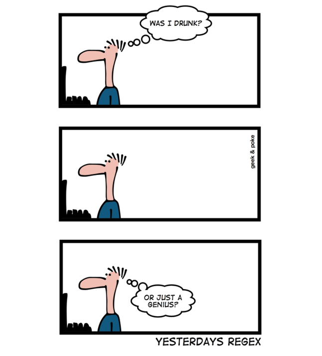

***
{width=400px} 

</br>

##A quick intro to the intro to R Lesson Series

</br>

This 'Intro to R Lesson Series' is brought to you by the Centre for the Analysis of Genome Evolution & Function's (CAGEF) bioinformatics training initiative. This course was developed based on feedback on the needs and interests of the Department of Cell & Systems Biology and the Department of Ecology and Evolutionary Biology. 


This lesson is the fourth in a 6-part series. The idea is that at the end of the series, you will be able to import and manipulate your data, make exploratory plots, perform some basic statistical tests, and test a regression model. 


</br>

How do we get there? Today we are going to be learning data cleaning and string manipulation; this is really the battleground of coding - getting your data into the format where you can analyse it. In the next lesson we will learn how to do t-tests and perform regression and modeling in R. 


</br>

The structure of the class is a code-along style. It is hands on. The lecture AND code we are going through are available on GitHub for download at https://github.com/eacton/CAGEF, so you can spend the time coding and not taking notes. As we go along, there will be some challenge questions and multiple choice questions on Socrative. At the end of the class if you could please fill out a post-lesson survey (https://www.surveymonkey.com/r/PVHDKDB), it will help me further develop this course and would be greatly appreciated. 

***

####Packages Used in This Lesson

The following packages are used in this lesson:

`tidyverse` (`ggplot2`, `tidyr`, `dplyr`)     
(`twitteR`)\*     
(`httr`)\*     
`tidytext`     
`viridis`     
`wordcloud`     

*Used to generate the tweet tables used in this lesson. It is not necessary for you to install this - you can work from the tables. If you want to create these files - the code is here  - [twitter scrape](https://github.com/eacton/CAGEF/blob/master/Lesson_4/twitter_scrape.R).    

Please install and load these packages for the lesson. In this document I will load each package separately, but I will not be reminding you to install the package. Remember: these packages may be from CRAN OR Bioconductor. 


***
####Highlighting

`grey background` - a package, function, code or command      
*italics* - an important term or concept     
**bold** - heading or 'grammar of graphics' term      
<span style="color:blue">blue text</span> - named or unnamed hyperlink     

***
__Objective:__ At the end of this session you will be able to use regular expressions to 'clean' your data. 

***

####Load libraries

Since we are moving along in the world, we are now going to start loading our libraries at the start of our script. This is a 'best practice' and makes it much easier for someone to reproduce your work efficiently by knowing exactly what packages they need to run your code. 


```r
library("tidyverse")
library("tidytext")
library("viridis")
library("knitr")
library("kableExtra")
library("wordcloud")
```

***

##Data Cleaning or Data Munging or Data Wrangling

Why do we need to do this?

'Raw' data is seldom (never) in a useable format. Data in tutorials or demos has already been meticulously filtered, transformed and readied to showcase that specific analysis. How many people have done a tutorial only to find they can't get their own data in the format to use the tool they have just spend an hour learning about???

Data cleaning requires us to:

- get rid of inconsistencies in our data. 
- have labels that make sense. 
- check for invalid character/numeric values.
- check for incomplete data.
- remove data we do not need.
- get our data in a proper format to be analyzed by the tools we are using. 
- flag/remove data that does not make sense.

Some definitions might take this a bit farther and include normalizing data and removing outliers, but I consider data cleaning as getting data into a format where we can start actively doing 'the maths or the graphs' - whether it be statistical calculations, normalization or exploratory plots. 

Today we are going to mostly be focusing on the **data cleaning of text**. This step is crucial to taking control of your dataset and your metadata. I have included the functions I find most useful for these tasks but I encourage you to take a look at the [Strings Chapter](http://r4ds.had.co.nz/strings.html) in *R for Data Science* for an exhaustive list of functions. We have learned how to transform data into a tidy format in Lesson 2, but the prelude to transforming data is doing the grunt work of data cleaning. So let's get to it!

<div style="float:center;margin: 10px 0 10px 0" markdown="1">
{width=300px}
</div>

</br>

</br>


##Intro to regular expressions


**Regular expressions**

"A God-awful and powerful language for expressing patterns to match in text or for search-and-replace. Frequently described as 'write only', because regular expressions are easier to write than to read/understand. And they are not particularly easy to write."  - Jenny Bryan

</br>


</br>

So why do regular expressions or 'regex' get so much flak if it is so powerful for text matching?

Scary example: how to get an email in different programming languages <http://emailregex.com/>. 

Regex is definitely one of those times when it is important to annotate your code. There are many jokes related to people coming back to their code the next day and having no idea what their code means.

<div style="left;margin:0 20px 20px 0" markdown="1">
{width=400px} 
</div>

There are sites available to help you make up your regular expressions and validate them against text. These are usually not R specific, but they will get you close and the expression will only need a slight modification for R (like an extra backslash - described below).

Regex testers:

<https://regex101.com/>     
<https://regexr.com/>


__What does the language look like?__ 

The language is based on _meta-characters_ which have a special meaning rather than their literal meaning. For example, '$' is used to match the end of a string, and this use supercedes its use as a character in a string (ie 'Joe paid \$2.99 for chips.'). 


###Matching by position

Where is the character in the string?

<table class="table" style="width: auto !important; margin-left: auto; margin-right: auto;">
 <thead>
  <tr>
   <th style="text-align:left;"> Expression </th>
   <th style="text-align:left;"> Meaning </th>
  </tr>
 </thead>
<tbody>
  <tr>
   <td style="text-align:left;border-right:1px solid;"> ^ </td>
   <td style="text-align:left;width: 40em; font-style: italic;"> start of string </td>
  </tr>
  <tr>
   <td style="text-align:left;border-right:1px solid;"> $ </td>
   <td style="text-align:left;width: 40em; font-style: italic;"> end of string </td>
  </tr>
  <tr>
   <td style="text-align:left;border-right:1px solid;"> \\b </td>
   <td style="text-align:left;width: 40em; font-style: italic;"> empty string at either edge of a word </td>
  </tr>
  <tr>
   <td style="text-align:left;border-right:1px solid;"> \\B </td>
   <td style="text-align:left;width: 40em; font-style: italic;"> empty string that is NOT at the edge of a word </td>
  </tr>
</tbody>
</table>


###Quantifiers

How many times will a character appear?

<table class="table" style="width: auto !important; margin-left: auto; margin-right: auto;">
 <thead>
  <tr>
   <th style="text-align:left;"> Expression </th>
   <th style="text-align:left;"> Meaning </th>
  </tr>
 </thead>
<tbody>
  <tr>
   <td style="text-align:left;border-right:1px solid;"> ? </td>
   <td style="text-align:left;width: 40em; font-style: italic;"> 0 or 1 </td>
  </tr>
  <tr>
   <td style="text-align:left;border-right:1px solid;"> \* </td>
   <td style="text-align:left;width: 40em; font-style: italic;"> 0 or more </td>
  </tr>
  <tr>
   <td style="text-align:left;border-right:1px solid;"> \+ </td>
   <td style="text-align:left;width: 40em; font-style: italic;"> 1 or more </td>
  </tr>
  <tr>
   <td style="text-align:left;border-right:1px solid;"> {n} </td>
   <td style="text-align:left;width: 40em; font-style: italic;"> exactly n </td>
  </tr>
  <tr>
   <td style="text-align:left;border-right:1px solid;"> {n,} </td>
   <td style="text-align:left;width: 40em; font-style: italic;"> at least n </td>
  </tr>
  <tr>
   <td style="text-align:left;border-right:1px solid;"> {,n} </td>
   <td style="text-align:left;width: 40em; font-style: italic;"> at most n </td>
  </tr>
  <tr>
   <td style="text-align:left;border-right:1px solid;"> {n,m} </td>
   <td style="text-align:left;width: 40em; font-style: italic;"> between n and m (inclusive) </td>
  </tr>
</tbody>
</table>


###Classes

What kind of character is it?

<table class="table" style="width: auto !important; margin-left: auto; margin-right: auto;">
 <thead>
  <tr>
   <th style="text-align:left;"> Expression </th>
   <th style="text-align:left;"> Meaning </th>
  </tr>
 </thead>
<tbody>
  <tr>
   <td style="text-align:left;border-right:1px solid;"> \\w, [A-z0-9], [[:alnum:]] </td>
   <td style="text-align:left;width: 40em; font-style: italic;"> word characters (letters + digits) </td>
  </tr>
  <tr>
   <td style="text-align:left;border-right:1px solid;"> \\d, [0-9], [[:digit:]] </td>
   <td style="text-align:left;width: 40em; font-style: italic;"> digits </td>
  </tr>
  <tr>
   <td style="text-align:left;border-right:1px solid;"> [A-z], [:alpha:] </td>
   <td style="text-align:left;width: 40em; font-style: italic;"> alphabetical characters </td>
  </tr>
  <tr>
   <td style="text-align:left;border-right:1px solid;"> \\s, [[:space:]] </td>
   <td style="text-align:left;width: 40em; font-style: italic;"> space </td>
  </tr>
  <tr>
   <td style="text-align:left;border-right:1px solid;"> [[:punct:]] </td>
   <td style="text-align:left;width: 40em; font-style: italic;"> punctuation </td>
  </tr>
  <tr>
   <td style="text-align:left;border-right:1px solid;"> [[:lower:]] </td>
   <td style="text-align:left;width: 40em; font-style: italic;"> lowercase </td>
  </tr>
  <tr>
   <td style="text-align:left;border-right:1px solid;"> [[:upper:]] </td>
   <td style="text-align:left;width: 40em; font-style: italic;"> uppercase </td>
  </tr>
  <tr>
   <td style="text-align:left;border-right:1px solid;"> \\W, [^A-z0-9] </td>
   <td style="text-align:left;width: 40em; font-style: italic;"> not word characters </td>
  </tr>
  <tr>
   <td style="text-align:left;border-right:1px solid;"> \\S </td>
   <td style="text-align:left;width: 40em; font-style: italic;"> not space </td>
  </tr>
  <tr>
   <td style="text-align:left;border-right:1px solid;"> \\D, [^0-9] </td>
   <td style="text-align:left;width: 40em; font-style: italic;"> not digits </td>
  </tr>
</tbody>
</table>


###Operators

Helper actions to match your characters.

<table class="table" style="width: auto !important; margin-left: auto; margin-right: auto;">
 <thead>
  <tr>
   <th style="text-align:left;"> Expression </th>
   <th style="text-align:left;"> Meaning </th>
  </tr>
 </thead>
<tbody>
  <tr>
   <td style="text-align:left;border-right:1px solid;"> | </td>
   <td style="text-align:left;width: 40em; font-style: italic;"> or </td>
  </tr>
  <tr>
   <td style="text-align:left;border-right:1px solid;"> . </td>
   <td style="text-align:left;width: 40em; font-style: italic;"> matches any single character </td>
  </tr>
  <tr>
   <td style="text-align:left;border-right:1px solid;"> [  ] </td>
   <td style="text-align:left;width: 40em; font-style: italic;"> matches ANY of the characters inside the brackets </td>
  </tr>
  <tr>
   <td style="text-align:left;border-right:1px solid;"> [ - ] </td>
   <td style="text-align:left;width: 40em; font-style: italic;"> matches a RANGE of characters inside the brackets </td>
  </tr>
  <tr>
   <td style="text-align:left;border-right:1px solid;"> [^ ] </td>
   <td style="text-align:left;width: 40em; font-style: italic;"> matches any character EXCEPT those inside the bracket </td>
  </tr>
  <tr>
   <td style="text-align:left;border-right:1px solid;"> ( ) </td>
   <td style="text-align:left;width: 40em; font-style: italic;"> grouping - used for [backreferencing](https://www.regular-expressions.info/backref.html) </td>
  </tr>
</tbody>
</table>

###Escape characters

Sometimes a meta-character is just a character. _Escaping_ allows you to use a character 'as is' rather than its special function. In R, regex gets evaluated as a string before a regular expression, and a backslash is used to escape the string - so you really need 2 backslashes to escape, say, a '$' sign (`"\\\$"`). 

<table class="table" style="width: auto !important; margin-left: auto; margin-right: auto;">
 <thead>
  <tr>
   <th style="text-align:left;"> Expression </th>
   <th style="text-align:left;"> Meaning </th>
  </tr>
 </thead>
<tbody>
  <tr>
   <td style="text-align:left;border-right:1px solid;"> \\ </td>
   <td style="text-align:left;width: 40em; font-style: italic;"> escape for meta-characters to be used as characters (*, $, ^, ., ?, |, \\, [, ], {, }, (, )). 
              Note: the backslash is also a meta-character. </td>
  </tr>
</tbody>
</table>

Trouble-shooting with escaping meta-characters means adding backslashes until something works. 


While you can always refer back to this lesson for making your regular expressions, you can also use this [regex cheatsheet](https://www.rstudio.com/wp-content/uploads/2016/09/RegExCheatsheet.pdf).

</br>
</br>

<div style="float:left;margin:0 10px 10px 0" markdown="1">
{width=350px} 
</div>

<div style="float:right;margin:0 10px 10px 0" markdown="1">
{width=350px} 
</div>

</br>

</br>

</br>

</br>
</br>

</br>
</br>


</br>

</br>

</br>
</br>

</br>
</br>

</br>

</br>

</br>
</br>

</br>
</br>

What I would like to get across it that it is okay to google and use resources early on for regex, and that even experts still use these resources.  

***

##Intro to string manipulation with stringr

Common uses of string manipulation are: searching, replacing or removing (making substitutions), and splitting and combining substrings.

As an example, we are going to play with a string of DNA. 


```r
dino <-">DinoDNA from Crichton JURASSIC PARK  p. 103 nt 1-1200 GCGTTGCTGGCGTTTTTCCATAGGCTCCGCCCCCCTGACGAGCATCACAAAAATCGACGCGGTGGCGAAACCCGACAGGACTATAAAGATACCAGGCGTTTCCCCCTGGAAGCTCCCTCGTGTTCCGACCCTGCCGCTTACCGGATACCTGTCCGCCTTTCTCCCTTCGGGAAGCGTGGCTGCTCACGCTGTACCTATCTCAGTTCGGTGTAGGTCGTTCGCTCCAAGCTGGGCTGTGTGCCGTTCAGCCCGACCGCTGCGCCTTATCCGGTAACTATCGTCTTGAGTCCAACCCGGTAAAGTAGGACAGGTGCCGGCAGCGCTCTGGGTCATTTTCGGCGAGGACCGCTTTCGCTGGAGATCGGCCTGTCGCTTGCGGTATTCGGAATCTTGCACGCCCTCGCTCAAGCCTTCGTCACTCCAAACGTTTCGGCGAGAAGCAGGCCATTATCGCCGGCATGGCGGCCGACGCGCTGGGCTGGCGTTCGCGACGCGAGGCTGGATGGCCTTCCCCATTATGATTCTTCTCGCTTCCGGCGGCCCGCGTTGCAGGCCATGCTGTCCAGGCAGGTAGATGACGACCATCAGGGACAGCTTCAACGGCTCTTACCAGCCTAACTTCGATCACTGGACCGCTGATCGTCACGGCGATTTATGCCGCACATGGACGCGTTGCTGGCGTTTTTCCATAGGCTCCGCCCCCCTGACGAGCATCACAAACAAGTCAGAGGTGGCGAAACCCGACAGGACTATAAAGATACCAGGCGTTTCCCCCTGGAAGCGCTCTCCTGTTCCGACCCTGCCGCTTACCGGATACCTGTCCGCCTTTCTCCCTTCGGGCTTTCTCAATGCTCACGCTGTAGGTATCTCAGTTCGGTGTAGGTCGTTCGCTCCAAGCTGACGAACCCCCCGTTCAGCCCGACCGCTGCGCCTTATCCGGTAACTATCGTCTTGAGTCCAACACGACTTAACGGGTTGGCATGGATTGTAGGCGCCGCCCTATACCTTGTCTGCCTCCCCGCGGTGCATGGAGCCGGGCCACCTCGACCTGAATGGAAGCCGGCGGCACCTCGCTAACGGCCAAGAATTGGAGCCAATCAATTCTTGCGGAGAACTGTGAATGCGCAAACCAACCCTTGGCCATCGCGTCCGCCATCTCCAGCAGCCGCACGCGGCGCATCTCGGGCAGCGTTGGGTCCT"
```


This piece of DNA is from the book Jurassic park, and was supposed to be dinosaur DNA, but is actually just a cloning vector. Bummer.

</br>

<div style="float:left;margin:0 10px 10px 0" markdown="1">
{width=450px} 
</div>

<div style="float:right;margin:0 10px 10px 0" markdown="1">
{width=300px} 
</div>
</br>

</br>

</br>
</br>

</br>
</br>

</br>

</br>

</br>
</br>

</br>
</br>


__Removing:__

This string is in FASTA format, but we don't need the header - we just want to deal with the DNA sequence. The header begins with '>' and ends with a number, '1200', with a space between the header and the sequence. Let's practice capturing each of these parts of a string, and then we'll make a regular expression to remove the entire header. 

All `stringr` functions take in as arguments the __string__ you are manipulating and the __pattern__ you are capturing. `str_remove` replaces the matched pattern with an empty character string "". In our first search we remove '>' from our string, dino.


```r
str_remove(string = dino, pattern = ">") 
```

```
## [1] "DinoDNA from Crichton JURASSIC PARK  p. 103 nt 1-1200 GCGTTGCTGGCGTTTTTCCATAGGCTCCGCCCCCCTGACGAGCATCACAAAAATCGACGCGGTGGCGAAACCCGACAGGACTATAAAGATACCAGGCGTTTCCCCCTGGAAGCTCCCTCGTGTTCCGACCCTGCCGCTTACCGGATACCTGTCCGCCTTTCTCCCTTCGGGAAGCGTGGCTGCTCACGCTGTACCTATCTCAGTTCGGTGTAGGTCGTTCGCTCCAAGCTGGGCTGTGTGCCGTTCAGCCCGACCGCTGCGCCTTATCCGGTAACTATCGTCTTGAGTCCAACCCGGTAAAGTAGGACAGGTGCCGGCAGCGCTCTGGGTCATTTTCGGCGAGGACCGCTTTCGCTGGAGATCGGCCTGTCGCTTGCGGTATTCGGAATCTTGCACGCCCTCGCTCAAGCCTTCGTCACTCCAAACGTTTCGGCGAGAAGCAGGCCATTATCGCCGGCATGGCGGCCGACGCGCTGGGCTGGCGTTCGCGACGCGAGGCTGGATGGCCTTCCCCATTATGATTCTTCTCGCTTCCGGCGGCCCGCGTTGCAGGCCATGCTGTCCAGGCAGGTAGATGACGACCATCAGGGACAGCTTCAACGGCTCTTACCAGCCTAACTTCGATCACTGGACCGCTGATCGTCACGGCGATTTATGCCGCACATGGACGCGTTGCTGGCGTTTTTCCATAGGCTCCGCCCCCCTGACGAGCATCACAAACAAGTCAGAGGTGGCGAAACCCGACAGGACTATAAAGATACCAGGCGTTTCCCCCTGGAAGCGCTCTCCTGTTCCGACCCTGCCGCTTACCGGATACCTGTCCGCCTTTCTCCCTTCGGGCTTTCTCAATGCTCACGCTGTAGGTATCTCAGTTCGGTGTAGGTCGTTCGCTCCAAGCTGACGAACCCCCCGTTCAGCCCGACCGCTGCGCCTTATCCGGTAACTATCGTCTTGAGTCCAACACGACTTAACGGGTTGGCATGGATTGTAGGCGCCGCCCTATACCTTGTCTGCCTCCCCGCGGTGCATGGAGCCGGGCCACCTCGACCTGAATGGAAGCCGGCGGCACCTCGCTAACGGCCAAGAATTGGAGCCAATCAATTCTTGCGGAGAACTGTGAATGCGCAAACCAACCCTTGGCCATCGCGTCCGCCATCTCCAGCAGCCGCACGCGGCGCATCTCGGGCAGCGTTGGGTCCT"
```
Next we can search for numbers. The expression '[0-9]' is looking for any number. Always make sure to check that the pattern you are using gives you the output you expect.


```r
str_remove(string = dino, pattern = "[0-9]") 
```

```
## [1] ">DinoDNA from Crichton JURASSIC PARK  p. 03 nt 1-1200 GCGTTGCTGGCGTTTTTCCATAGGCTCCGCCCCCCTGACGAGCATCACAAAAATCGACGCGGTGGCGAAACCCGACAGGACTATAAAGATACCAGGCGTTTCCCCCTGGAAGCTCCCTCGTGTTCCGACCCTGCCGCTTACCGGATACCTGTCCGCCTTTCTCCCTTCGGGAAGCGTGGCTGCTCACGCTGTACCTATCTCAGTTCGGTGTAGGTCGTTCGCTCCAAGCTGGGCTGTGTGCCGTTCAGCCCGACCGCTGCGCCTTATCCGGTAACTATCGTCTTGAGTCCAACCCGGTAAAGTAGGACAGGTGCCGGCAGCGCTCTGGGTCATTTTCGGCGAGGACCGCTTTCGCTGGAGATCGGCCTGTCGCTTGCGGTATTCGGAATCTTGCACGCCCTCGCTCAAGCCTTCGTCACTCCAAACGTTTCGGCGAGAAGCAGGCCATTATCGCCGGCATGGCGGCCGACGCGCTGGGCTGGCGTTCGCGACGCGAGGCTGGATGGCCTTCCCCATTATGATTCTTCTCGCTTCCGGCGGCCCGCGTTGCAGGCCATGCTGTCCAGGCAGGTAGATGACGACCATCAGGGACAGCTTCAACGGCTCTTACCAGCCTAACTTCGATCACTGGACCGCTGATCGTCACGGCGATTTATGCCGCACATGGACGCGTTGCTGGCGTTTTTCCATAGGCTCCGCCCCCCTGACGAGCATCACAAACAAGTCAGAGGTGGCGAAACCCGACAGGACTATAAAGATACCAGGCGTTTCCCCCTGGAAGCGCTCTCCTGTTCCGACCCTGCCGCTTACCGGATACCTGTCCGCCTTTCTCCCTTCGGGCTTTCTCAATGCTCACGCTGTAGGTATCTCAGTTCGGTGTAGGTCGTTCGCTCCAAGCTGACGAACCCCCCGTTCAGCCCGACCGCTGCGCCTTATCCGGTAACTATCGTCTTGAGTCCAACACGACTTAACGGGTTGGCATGGATTGTAGGCGCCGCCCTATACCTTGTCTGCCTCCCCGCGGTGCATGGAGCCGGGCCACCTCGACCTGAATGGAAGCCGGCGGCACCTCGCTAACGGCCAAGAATTGGAGCCAATCAATTCTTGCGGAGAACTGTGAATGCGCAAACCAACCCTTGGCCATCGCGTCCGCCATCTCCAGCAGCCGCACGCGGCGCATCTCGGGCAGCGTTGGGTCCT"
```

Why aren't all of the numbers replaced? `str_remove` only replaces the first match in a character string. Switching to `str_remove_all` replaces all instances of numbers in the character string.


```r
str_remove_all(string = dino, pattern = "[0-9]") 
```

```
## [1] ">DinoDNA from Crichton JURASSIC PARK  p.  nt - GCGTTGCTGGCGTTTTTCCATAGGCTCCGCCCCCCTGACGAGCATCACAAAAATCGACGCGGTGGCGAAACCCGACAGGACTATAAAGATACCAGGCGTTTCCCCCTGGAAGCTCCCTCGTGTTCCGACCCTGCCGCTTACCGGATACCTGTCCGCCTTTCTCCCTTCGGGAAGCGTGGCTGCTCACGCTGTACCTATCTCAGTTCGGTGTAGGTCGTTCGCTCCAAGCTGGGCTGTGTGCCGTTCAGCCCGACCGCTGCGCCTTATCCGGTAACTATCGTCTTGAGTCCAACCCGGTAAAGTAGGACAGGTGCCGGCAGCGCTCTGGGTCATTTTCGGCGAGGACCGCTTTCGCTGGAGATCGGCCTGTCGCTTGCGGTATTCGGAATCTTGCACGCCCTCGCTCAAGCCTTCGTCACTCCAAACGTTTCGGCGAGAAGCAGGCCATTATCGCCGGCATGGCGGCCGACGCGCTGGGCTGGCGTTCGCGACGCGAGGCTGGATGGCCTTCCCCATTATGATTCTTCTCGCTTCCGGCGGCCCGCGTTGCAGGCCATGCTGTCCAGGCAGGTAGATGACGACCATCAGGGACAGCTTCAACGGCTCTTACCAGCCTAACTTCGATCACTGGACCGCTGATCGTCACGGCGATTTATGCCGCACATGGACGCGTTGCTGGCGTTTTTCCATAGGCTCCGCCCCCCTGACGAGCATCACAAACAAGTCAGAGGTGGCGAAACCCGACAGGACTATAAAGATACCAGGCGTTTCCCCCTGGAAGCGCTCTCCTGTTCCGACCCTGCCGCTTACCGGATACCTGTCCGCCTTTCTCCCTTCGGGCTTTCTCAATGCTCACGCTGTAGGTATCTCAGTTCGGTGTAGGTCGTTCGCTCCAAGCTGACGAACCCCCCGTTCAGCCCGACCGCTGCGCCTTATCCGGTAACTATCGTCTTGAGTCCAACACGACTTAACGGGTTGGCATGGATTGTAGGCGCCGCCCTATACCTTGTCTGCCTCCCCGCGGTGCATGGAGCCGGGCCACCTCGACCTGAATGGAAGCCGGCGGCACCTCGCTAACGGCCAAGAATTGGAGCCAATCAATTCTTGCGGAGAACTGTGAATGCGCAAACCAACCCTTGGCCATCGCGTCCGCCATCTCCAGCAGCCGCACGCGGCGCATCTCGGGCAGCGTTGGGTCCT"
```

How do we capture spaces? The pattern '\\s' replaces a space. However, for the backslash to not be used as an escape character (its special function), we need to add another backslash, making our pattern '\\\\s'.


```r
str_remove_all(string = dino, pattern = "\\s") 
```

```
## [1] ">DinoDNAfromCrichtonJURASSICPARKp.103nt1-1200GCGTTGCTGGCGTTTTTCCATAGGCTCCGCCCCCCTGACGAGCATCACAAAAATCGACGCGGTGGCGAAACCCGACAGGACTATAAAGATACCAGGCGTTTCCCCCTGGAAGCTCCCTCGTGTTCCGACCCTGCCGCTTACCGGATACCTGTCCGCCTTTCTCCCTTCGGGAAGCGTGGCTGCTCACGCTGTACCTATCTCAGTTCGGTGTAGGTCGTTCGCTCCAAGCTGGGCTGTGTGCCGTTCAGCCCGACCGCTGCGCCTTATCCGGTAACTATCGTCTTGAGTCCAACCCGGTAAAGTAGGACAGGTGCCGGCAGCGCTCTGGGTCATTTTCGGCGAGGACCGCTTTCGCTGGAGATCGGCCTGTCGCTTGCGGTATTCGGAATCTTGCACGCCCTCGCTCAAGCCTTCGTCACTCCAAACGTTTCGGCGAGAAGCAGGCCATTATCGCCGGCATGGCGGCCGACGCGCTGGGCTGGCGTTCGCGACGCGAGGCTGGATGGCCTTCCCCATTATGATTCTTCTCGCTTCCGGCGGCCCGCGTTGCAGGCCATGCTGTCCAGGCAGGTAGATGACGACCATCAGGGACAGCTTCAACGGCTCTTACCAGCCTAACTTCGATCACTGGACCGCTGATCGTCACGGCGATTTATGCCGCACATGGACGCGTTGCTGGCGTTTTTCCATAGGCTCCGCCCCCCTGACGAGCATCACAAACAAGTCAGAGGTGGCGAAACCCGACAGGACTATAAAGATACCAGGCGTTTCCCCCTGGAAGCGCTCTCCTGTTCCGACCCTGCCGCTTACCGGATACCTGTCCGCCTTTCTCCCTTCGGGCTTTCTCAATGCTCACGCTGTAGGTATCTCAGTTCGGTGTAGGTCGTTCGCTCCAAGCTGACGAACCCCCCGTTCAGCCCGACCGCTGCGCCTTATCCGGTAACTATCGTCTTGAGTCCAACACGACTTAACGGGTTGGCATGGATTGTAGGCGCCGCCCTATACCTTGTCTGCCTCCCCGCGGTGCATGGAGCCGGGCCACCTCGACCTGAATGGAAGCCGGCGGCACCTCGCTAACGGCCAAGAATTGGAGCCAATCAATTCTTGCGGAGAACTGTGAATGCGCAAACCAACCCTTGGCCATCGCGTCCGCCATCTCCAGCAGCCGCACGCGGCGCATCTCGGGCAGCGTTGGGTCCT"
```

To remove the entire header, we need to combine these patterns. The header is everything in between '>' and the number '1200' followed by a space. The operator `.` captures any single character and the quantifier `*` is any number of times (including zero). 


```r
str_remove(string = dino, pattern = ">.*[0-9]\\s")
```

```
## [1] "GCGTTGCTGGCGTTTTTCCATAGGCTCCGCCCCCCTGACGAGCATCACAAAAATCGACGCGGTGGCGAAACCCGACAGGACTATAAAGATACCAGGCGTTTCCCCCTGGAAGCTCCCTCGTGTTCCGACCCTGCCGCTTACCGGATACCTGTCCGCCTTTCTCCCTTCGGGAAGCGTGGCTGCTCACGCTGTACCTATCTCAGTTCGGTGTAGGTCGTTCGCTCCAAGCTGGGCTGTGTGCCGTTCAGCCCGACCGCTGCGCCTTATCCGGTAACTATCGTCTTGAGTCCAACCCGGTAAAGTAGGACAGGTGCCGGCAGCGCTCTGGGTCATTTTCGGCGAGGACCGCTTTCGCTGGAGATCGGCCTGTCGCTTGCGGTATTCGGAATCTTGCACGCCCTCGCTCAAGCCTTCGTCACTCCAAACGTTTCGGCGAGAAGCAGGCCATTATCGCCGGCATGGCGGCCGACGCGCTGGGCTGGCGTTCGCGACGCGAGGCTGGATGGCCTTCCCCATTATGATTCTTCTCGCTTCCGGCGGCCCGCGTTGCAGGCCATGCTGTCCAGGCAGGTAGATGACGACCATCAGGGACAGCTTCAACGGCTCTTACCAGCCTAACTTCGATCACTGGACCGCTGATCGTCACGGCGATTTATGCCGCACATGGACGCGTTGCTGGCGTTTTTCCATAGGCTCCGCCCCCCTGACGAGCATCACAAACAAGTCAGAGGTGGCGAAACCCGACAGGACTATAAAGATACCAGGCGTTTCCCCCTGGAAGCGCTCTCCTGTTCCGACCCTGCCGCTTACCGGATACCTGTCCGCCTTTCTCCCTTCGGGCTTTCTCAATGCTCACGCTGTAGGTATCTCAGTTCGGTGTAGGTCGTTCGCTCCAAGCTGACGAACCCCCCGTTCAGCCCGACCGCTGCGCCTTATCCGGTAACTATCGTCTTGAGTCCAACACGACTTAACGGGTTGGCATGGATTGTAGGCGCCGCCCTATACCTTGTCTGCCTCCCCGCGGTGCATGGAGCCGGGCCACCTCGACCTGAATGGAAGCCGGCGGCACCTCGCTAACGGCCAAGAATTGGAGCCAATCAATTCTTGCGGAGAACTGTGAATGCGCAAACCAACCCTTGGCCATCGCGTCCGCCATCTCCAGCAGCCGCACGCGGCGCATCTCGGGCAGCGTTGGGTCCT"
```

You may have noticed that we also have a number followed by a space earlier in the header, '103 '. Why didn't the replacement end at that first match? The first instance is an example of _greedy_ matching - it will take the longest possible string. To curtail this behaviour and use _lazy_ matching - the shortest possible string - you can add the `?` quantifier.


```r
str_remove(string = dino, pattern = ">.*?[0-9]\\s")
```

```
## [1] "nt 1-1200 GCGTTGCTGGCGTTTTTCCATAGGCTCCGCCCCCCTGACGAGCATCACAAAAATCGACGCGGTGGCGAAACCCGACAGGACTATAAAGATACCAGGCGTTTCCCCCTGGAAGCTCCCTCGTGTTCCGACCCTGCCGCTTACCGGATACCTGTCCGCCTTTCTCCCTTCGGGAAGCGTGGCTGCTCACGCTGTACCTATCTCAGTTCGGTGTAGGTCGTTCGCTCCAAGCTGGGCTGTGTGCCGTTCAGCCCGACCGCTGCGCCTTATCCGGTAACTATCGTCTTGAGTCCAACCCGGTAAAGTAGGACAGGTGCCGGCAGCGCTCTGGGTCATTTTCGGCGAGGACCGCTTTCGCTGGAGATCGGCCTGTCGCTTGCGGTATTCGGAATCTTGCACGCCCTCGCTCAAGCCTTCGTCACTCCAAACGTTTCGGCGAGAAGCAGGCCATTATCGCCGGCATGGCGGCCGACGCGCTGGGCTGGCGTTCGCGACGCGAGGCTGGATGGCCTTCCCCATTATGATTCTTCTCGCTTCCGGCGGCCCGCGTTGCAGGCCATGCTGTCCAGGCAGGTAGATGACGACCATCAGGGACAGCTTCAACGGCTCTTACCAGCCTAACTTCGATCACTGGACCGCTGATCGTCACGGCGATTTATGCCGCACATGGACGCGTTGCTGGCGTTTTTCCATAGGCTCCGCCCCCCTGACGAGCATCACAAACAAGTCAGAGGTGGCGAAACCCGACAGGACTATAAAGATACCAGGCGTTTCCCCCTGGAAGCGCTCTCCTGTTCCGACCCTGCCGCTTACCGGATACCTGTCCGCCTTTCTCCCTTCGGGCTTTCTCAATGCTCACGCTGTAGGTATCTCAGTTCGGTGTAGGTCGTTCGCTCCAAGCTGACGAACCCCCCGTTCAGCCCGACCGCTGCGCCTTATCCGGTAACTATCGTCTTGAGTCCAACACGACTTAACGGGTTGGCATGGATTGTAGGCGCCGCCCTATACCTTGTCTGCCTCCCCGCGGTGCATGGAGCCGGGCCACCTCGACCTGAATGGAAGCCGGCGGCACCTCGCTAACGGCCAAGAATTGGAGCCAATCAATTCTTGCGGAGAACTGTGAATGCGCAAACCAACCCTTGGCCATCGCGTCCGCCATCTCCAGCAGCCGCACGCGGCGCATCTCGGGCAGCGTTGGGTCCT"
```
In this case, we want the greedy matching to replace the entire header. Let's save the dna into its own object.


```r
dna <- str_remove(string = dino, pattern = ">.*[0-9]\\s")
```

__Extracting:__

We may also want to retain our header in a separate string. `str_extract` will retain the string that matches our pattern instead of removing it. We can save this in an object called header (I removed the final space from our expresssion).


```r
header <- str_extract(string = dino, pattern = ">.*[0-9]")
header
```

```
## [1] ">DinoDNA from Crichton JURASSIC PARK  p. 103 nt 1-1200"
```


__Searching:__

Now we can look for patterns in our (dino) DNA!

Does this DNA have balanced GC content? We can use `str_extract_all` to capture every character that is either a G or a C.


```r
str_extract_all(dino, pattern = "G|C")
```

```
## [[1]]
##   [1] "C" "C" "G" "C" "G" "G" "C" "G" "G" "C" "G" "C" "C" "G" "G" "C" "C"
##  [18] "C" "G" "C" "C" "C" "C" "C" "C" "G" "C" "G" "G" "C" "C" "C" "C" "G"
##  [35] "C" "G" "C" "G" "G" "G" "G" "C" "G" "C" "C" "C" "G" "C" "G" "G" "C"
##  [52] "G" "C" "C" "G" "G" "C" "G" "C" "C" "C" "C" "C" "G" "G" "G" "C" "C"
##  [69] "C" "C" "C" "G" "G" "C" "C" "G" "C" "C" "C" "G" "C" "C" "G" "C" "C"
##  [86] "C" "G" "G" "C" "C" "G" "C" "C" "G" "C" "C" "C" "C" "C" "C" "C" "G"
## [103] "G" "G" "G" "C" "G" "G" "G" "C" "G" "C" "C" "C" "G" "C" "G" "C" "C"
## [120] "C" "C" "G" "C" "G" "G" "G" "G" "G" "C" "G" "C" "G" "C" "C" "C" "G"
## [137] "C" "G" "G" "G" "C" "G" "G" "G" "C" "C" "G" "C" "G" "C" "C" "C" "G"
## [154] "C" "C" "G" "C" "G" "C" "G" "C" "C" "C" "C" "G" "G" "C" "C" "G" "C"
## [171] "G" "G" "C" "C" "C" "C" "C" "G" "G" "G" "G" "G" "C" "G" "G" "G" "C"
## [188] "C" "G" "G" "C" "G" "C" "G" "C" "C" "G" "G" "G" "C" "C" "G" "G" "C"
## [205] "G" "G" "G" "C" "C" "G" "C" "C" "G" "C" "G" "G" "G" "C" "G" "G" "C"
## [222] "C" "G" "C" "G" "C" "G" "C" "G" "G" "C" "G" "G" "C" "G" "C" "C" "G"
## [239] "C" "C" "C" "C" "G" "C" "C" "G" "C" "C" "C" "G" "C" "C" "C" "C" "C"
## [256] "G" "C" "G" "G" "C" "G" "G" "G" "C" "G" "G" "C" "C" "C" "G" "C" "C"
## [273] "G" "G" "C" "G" "G" "C" "G" "G" "C" "C" "G" "C" "G" "C" "G" "C" "G"
## [290] "G" "G" "C" "G" "G" "C" "G" "C" "G" "C" "G" "C" "G" "C" "G" "G" "G"
## [307] "C" "G" "G" "G" "G" "C" "C" "C" "C" "C" "C" "G" "C" "C" "C" "G" "C"
## [324] "C" "C" "G" "G" "C" "G" "G" "C" "C" "C" "G" "C" "G" "G" "C" "G" "G"
## [341] "C" "C" "G" "C" "G" "C" "C" "G" "G" "C" "G" "G" "G" "G" "C" "G" "C"
## [358] "C" "C" "G" "G" "G" "C" "G" "C" "C" "C" "G" "G" "C" "C" "C" "C" "G"
## [375] "C" "C" "C" "C" "G" "C" "C" "G" "G" "C" "C" "G" "C" "G" "C" "G" "C"
## [392] "C" "G" "G" "C" "G" "G" "C" "C" "G" "C" "C" "G" "G" "C" "G" "C" "G"
## [409] "G" "C" "G" "G" "C" "G" "C" "C" "G" "G" "C" "C" "C" "G" "C" "C" "C"
## [426] "C" "C" "C" "G" "C" "G" "G" "C" "C" "C" "C" "G" "C" "G" "G" "G" "G"
## [443] "G" "C" "G" "C" "C" "C" "G" "C" "G" "G" "C" "G" "C" "C" "G" "G" "C"
## [460] "G" "C" "C" "C" "C" "C" "G" "G" "G" "C" "G" "C" "C" "C" "C" "G" "C"
## [477] "C" "G" "C" "C" "C" "G" "C" "C" "G" "C" "C" "C" "G" "G" "C" "C" "G"
## [494] "C" "C" "G" "C" "C" "C" "C" "C" "C" "C" "G" "G" "G" "C" "C" "C" "G"
## [511] "C" "C" "C" "G" "C" "G" "G" "G" "C" "C" "G" "C" "G" "G" "G" "G" "G"
## [528] "C" "G" "C" "G" "C" "C" "C" "G" "C" "G" "C" "G" "C" "C" "C" "C" "C"
## [545] "C" "G" "C" "G" "C" "C" "C" "G" "C" "C" "G" "C" "G" "C" "G" "C" "C"
## [562] "C" "C" "G" "G" "C" "C" "G" "C" "G" "G" "C" "C" "C" "C" "G" "C" "C"
## [579] "G" "G" "G" "G" "G" "C" "G" "G" "G" "G" "G" "C" "G" "C" "C" "G" "C"
## [596] "C" "C" "C" "C" "G" "C" "G" "C" "C" "C" "C" "C" "C" "G" "C" "G" "G"
## [613] "G" "C" "G" "G" "G" "C" "C" "G" "G" "G" "C" "C" "C" "C" "C" "G" "C"
## [630] "C" "G" "G" "G" "G" "C" "C" "G" "G" "C" "G" "G" "C" "C" "C" "C" "G"
## [647] "C" "C" "G" "G" "C" "C" "G" "G" "G" "G" "C" "C" "C" "C" "G" "C" "G"
## [664] "G" "G" "C" "G" "G" "G" "C" "G" "C" "C" "C" "C" "C" "C" "G" "G" "C"
## [681] "C" "C" "G" "C" "G" "C" "C" "G" "C" "C" "C" "C" "C" "G" "C" "G" "C"
## [698] "C" "G" "C" "C" "G" "C" "G" "G" "C" "G" "C" "C" "C" "G" "G" "G" "C"
## [715] "G" "C" "G" "G" "G" "G" "C" "C"
```

The output is a list object in which is stored an entry for each G or C extracted. We count the number of these entries and divide by the total number of characters in our string to get the %GC content. 


```r
length(str_extract_all(dna, pattern = "G|C")[[1]])/nchar(dna) * 100
```

```
## [1] 60
```


Let's translate this into mRNA! 

__Replacement:__

To replace multiple patterns at once, a character vector is supplied to `str_replace_all` of patterns and their matched replacements. This allows us to perform multiple replacements multiple times.


```r
mrna <- str_replace_all(dna, c("G" = "C", "C" = "G", "A" = "U", "T" = "A"))
```


__More Searching:__

Is there even a start codon in this thing? `str_detect` can be used to get a local (TRUE or FALSE) answer to whether or not a match is found.


```r
str_detect(mrna, "AUG")
```

```
## [1] TRUE
```

To get the position of a possible start codon we can use `str_locate` which will return the indices of where the start and end of our substring occurs (`str_locate_all` can be used to find the all possible locations).


```r
str_locate(mrna, "AUG")
```

```
##      start end
## [1,]    21  23
```


__Splitting:__

Let's split this string into substrings of codons, starting at the position of our start codon. We have the position of our start codon from `str_locate`. We can use `str_sub` to subset the string by position (we will just go to the end of the string for now).


```r
str_sub(mrna, 21, 1200)
```

```
## [1] "AUGGGAGGGGGGGGGAGUGGUGGUAGUGUUUUUAGGUGGGGGAGGGGUUUGGGGUGUGGUGAUAUUUGUAUGGUGGGGAAAGGGGGAGGUUGGAGGGAGGAGAAGGGUGGGAGGGGGAAUGGGGUAUGGAGAGGGGGAAAGAGGGAAGGGGUUGGGAGGGAGGAGUGGGAGAUGGAUAGAGUGAAGGGAGAUGGAGGAAGGGAGGUUGGAGGGGAGAGAGGGGAAGUGGGGGUGGGGAGGGGGAAUAGGGGAUUGAUAGGAGAAGUGAGGUUGGGGGAUUUGAUGGUGUGGAGGGGGGUGGGGAGAGGGAGUAAAAGGGGGUGGUGGGGAAAGGGAGGUGUAGGGGGAGAGGGAAGGGGAUAAGGGUUAGAAGGUGGGGGAGGGAGUUGGGAAGGAGUGAGGUUUGGAAAGGGGGUGUUGGUGGGGUAAUAGGGGGGGUAGGGGGGGGUGGGGGAGGGGAGGGGAAGGGGUGGGGUGGGAGGUAGGGGAAGGGGUAAUAGUAAGAAGAGGGAAGGGGGGGGGGGGGAAGGUGGGGUAGGAGAGGUGGGUGGAUGUAGUGGUGGUAGUGGGUGUGGAAGUUGGGGAGAAUGGUGGGAUUGAAGGUAGUGAGGUGGGGAGUAGGAGUGGGGGUAAAUAGGGGGUGUAGGUGGGGAAGGAGGGGAAAAAGGUAUGGGAGGGGGGGGGAGUGGUGGUAGUGUUUGUUGAGUGUGGAGGGGUUUGGGGUGUGGUGAUAUUUGUAUGGUGGGGAAAGGGGGAGGUUGGGGAGAGGAGAAGGGUGGGAGGGGGAAUGGGGUAUGGAGAGGGGGAAAGAGGGAAGGGGGAAAGAGUUAGGAGUGGGAGAUGGAUAGAGUGAAGGGAGAUGGAGGAAGGGAGGUUGGAGUGGUUGGGGGGGAAGUGGGGGUGGGGAGGGGGAAUAGGGGAUUGAUAGGAGAAGUGAGGUUGUGGUGAAUUGGGGAAGGGUAGGUAAGAUGGGGGGGGGGAUAUGGAAGAGAGGGAGGGGGGGGAGGUAGGUGGGGGGGGUGGAGGUGGAGUUAGGUUGGGGGGGGGUGGAGGGAUUGGGGGUUGUUAAGGUGGGUUAGUUAAGAAGGGGUGUUGAGAGUUAGGGGUUUGGUUGGGAAGGGGUAGGGGAGGGGGUAGAGGUGGUGGGGGUGGGGGGGGUAGAGGGGGUGGGAAGGGAGGA"
```

```r
#is equivalent to
mrna <- str_sub(mrna, str_locate(mrna, "AUG")[1])
```

We can get codons by extracting groups of (any) 3 nucleotides/characters in our reading frame.


```r
str_extract_all(mrna, "...")
```

```
## [[1]]
##   [1] "AUG" "GGA" "GGG" "GGG" "GGG" "AGU" "GGU" "GGU" "AGU" "GUU" "UUU"
##  [12] "AGG" "UGG" "GGG" "AGG" "GGU" "UUG" "GGG" "UGU" "GGU" "GAU" "AUU"
##  [23] "UGU" "AUG" "GUG" "GGG" "AAA" "GGG" "GGA" "GGU" "UGG" "AGG" "GAG"
##  [34] "GAG" "AAG" "GGU" "GGG" "AGG" "GGG" "AAU" "GGG" "GUA" "UGG" "AGA"
##  [45] "GGG" "GGA" "AAG" "AGG" "GAA" "GGG" "GUU" "GGG" "AGG" "GAG" "GAG"
##  [56] "UGG" "GAG" "AUG" "GAU" "AGA" "GUG" "AAG" "GGA" "GAU" "GGA" "GGA"
##  [67] "AGG" "GAG" "GUU" "GGA" "GGG" "GAG" "AGA" "GGG" "GAA" "GUG" "GGG"
##  [78] "GUG" "GGG" "AGG" "GGG" "AAU" "AGG" "GGA" "UUG" "AUA" "GGA" "GAA"
##  [89] "GUG" "AGG" "UUG" "GGG" "GAU" "UUG" "AUG" "GUG" "UGG" "AGG" "GGG"
## [100] "GUG" "GGG" "AGA" "GGG" "AGU" "AAA" "AGG" "GGG" "UGG" "UGG" "GGA"
## [111] "AAG" "GGA" "GGU" "GUA" "GGG" "GGA" "GAG" "GGA" "AGG" "GGA" "UAA"
## [122] "GGG" "UUA" "GAA" "GGU" "GGG" "GGA" "GGG" "AGU" "UGG" "GAA" "GGA"
## [133] "GUG" "AGG" "UUU" "GGA" "AAG" "GGG" "GUG" "UUG" "GUG" "GGG" "UAA"
## [144] "UAG" "GGG" "GGG" "UAG" "GGG" "GGG" "GUG" "GGG" "GAG" "GGG" "AGG"
## [155] "GGA" "AGG" "GGU" "GGG" "GUG" "GGA" "GGU" "AGG" "GGA" "AGG" "GGU"
## [166] "AAU" "AGU" "AAG" "AAG" "AGG" "GAA" "GGG" "GGG" "GGG" "GGG" "GAA"
## [177] "GGU" "GGG" "GUA" "GGA" "GAG" "GUG" "GGU" "GGA" "UGU" "AGU" "GGU"
## [188] "GGU" "AGU" "GGG" "UGU" "GGA" "AGU" "UGG" "GGA" "GAA" "UGG" "UGG"
## [199] "GAU" "UGA" "AGG" "UAG" "UGA" "GGU" "GGG" "GAG" "UAG" "GAG" "UGG"
## [210] "GGG" "UAA" "AUA" "GGG" "GGU" "GUA" "GGU" "GGG" "GAA" "GGA" "GGG"
## [221] "GAA" "AAA" "GGU" "AUG" "GGA" "GGG" "GGG" "GGG" "AGU" "GGU" "GGU"
## [232] "AGU" "GUU" "UGU" "UGA" "GUG" "UGG" "AGG" "GGU" "UUG" "GGG" "UGU"
## [243] "GGU" "GAU" "AUU" "UGU" "AUG" "GUG" "GGG" "AAA" "GGG" "GGA" "GGU"
## [254] "UGG" "GGA" "GAG" "GAG" "AAG" "GGU" "GGG" "AGG" "GGG" "AAU" "GGG"
## [265] "GUA" "UGG" "AGA" "GGG" "GGA" "AAG" "AGG" "GAA" "GGG" "GGA" "AAG"
## [276] "AGU" "UAG" "GAG" "UGG" "GAG" "AUG" "GAU" "AGA" "GUG" "AAG" "GGA"
## [287] "GAU" "GGA" "GGA" "AGG" "GAG" "GUU" "GGA" "GUG" "GUU" "GGG" "GGG"
## [298] "GAA" "GUG" "GGG" "GUG" "GGG" "AGG" "GGG" "AAU" "AGG" "GGA" "UUG"
## [309] "AUA" "GGA" "GAA" "GUG" "AGG" "UUG" "UGG" "UGA" "AUU" "GGG" "GAA"
## [320] "GGG" "UAG" "GUA" "AGA" "UGG" "GGG" "GGG" "GGA" "UAU" "GGA" "AGA"
## [331] "GAG" "GGA" "GGG" "GGG" "GGA" "GGU" "AGG" "UGG" "GGG" "GGG" "UGG"
## [342] "AGG" "UGG" "AGU" "UAG" "GUU" "GGG" "GGG" "GGG" "UGG" "AGG" "GAU"
## [353] "UGG" "GGG" "UUG" "UUA" "AGG" "UGG" "GUU" "AGU" "UAA" "GAA" "GGG"
## [364] "GUG" "UUG" "AGA" "GUU" "AGG" "GGU" "UUG" "GUU" "GGG" "AAG" "GGG"
## [375] "UAG" "GGG" "AGG" "GGG" "UAG" "AGG" "UGG" "UGG" "GGG" "UGG" "GGG"
## [386] "GGG" "UAG" "AGG" "GGG" "UGG" "GAA" "GGG" "AGG"
```
The codons are extracted into a list, but we can get our character substrings using `unlist`. 


```r
codons <- unlist(str_extract_all(mrna, "..."))
```

We now have a vector with 393 codons.

Do we have a stop codon in our reading frame? Let's check with `str_detect`. We can use round brackets `( )` to separately group the different stop codons.


```r
str_detect(codons, "(UAG)|(UGA)|(UAA)")
```

```
##   [1] FALSE FALSE FALSE FALSE FALSE FALSE FALSE FALSE FALSE FALSE FALSE
##  [12] FALSE FALSE FALSE FALSE FALSE FALSE FALSE FALSE FALSE FALSE FALSE
##  [23] FALSE FALSE FALSE FALSE FALSE FALSE FALSE FALSE FALSE FALSE FALSE
##  [34] FALSE FALSE FALSE FALSE FALSE FALSE FALSE FALSE FALSE FALSE FALSE
##  [45] FALSE FALSE FALSE FALSE FALSE FALSE FALSE FALSE FALSE FALSE FALSE
##  [56] FALSE FALSE FALSE FALSE FALSE FALSE FALSE FALSE FALSE FALSE FALSE
##  [67] FALSE FALSE FALSE FALSE FALSE FALSE FALSE FALSE FALSE FALSE FALSE
##  [78] FALSE FALSE FALSE FALSE FALSE FALSE FALSE FALSE FALSE FALSE FALSE
##  [89] FALSE FALSE FALSE FALSE FALSE FALSE FALSE FALSE FALSE FALSE FALSE
## [100] FALSE FALSE FALSE FALSE FALSE FALSE FALSE FALSE FALSE FALSE FALSE
## [111] FALSE FALSE FALSE FALSE FALSE FALSE FALSE FALSE FALSE FALSE  TRUE
## [122] FALSE FALSE FALSE FALSE FALSE FALSE FALSE FALSE FALSE FALSE FALSE
## [133] FALSE FALSE FALSE FALSE FALSE FALSE FALSE FALSE FALSE FALSE  TRUE
## [144]  TRUE FALSE FALSE  TRUE FALSE FALSE FALSE FALSE FALSE FALSE FALSE
## [155] FALSE FALSE FALSE FALSE FALSE FALSE FALSE FALSE FALSE FALSE FALSE
## [166] FALSE FALSE FALSE FALSE FALSE FALSE FALSE FALSE FALSE FALSE FALSE
## [177] FALSE FALSE FALSE FALSE FALSE FALSE FALSE FALSE FALSE FALSE FALSE
## [188] FALSE FALSE FALSE FALSE FALSE FALSE FALSE FALSE FALSE FALSE FALSE
## [199] FALSE  TRUE FALSE  TRUE  TRUE FALSE FALSE FALSE  TRUE FALSE FALSE
## [210] FALSE  TRUE FALSE FALSE FALSE FALSE FALSE FALSE FALSE FALSE FALSE
## [221] FALSE FALSE FALSE FALSE FALSE FALSE FALSE FALSE FALSE FALSE FALSE
## [232] FALSE FALSE FALSE  TRUE FALSE FALSE FALSE FALSE FALSE FALSE FALSE
## [243] FALSE FALSE FALSE FALSE FALSE FALSE FALSE FALSE FALSE FALSE FALSE
## [254] FALSE FALSE FALSE FALSE FALSE FALSE FALSE FALSE FALSE FALSE FALSE
## [265] FALSE FALSE FALSE FALSE FALSE FALSE FALSE FALSE FALSE FALSE FALSE
## [276] FALSE  TRUE FALSE FALSE FALSE FALSE FALSE FALSE FALSE FALSE FALSE
## [287] FALSE FALSE FALSE FALSE FALSE FALSE FALSE FALSE FALSE FALSE FALSE
## [298] FALSE FALSE FALSE FALSE FALSE FALSE FALSE FALSE FALSE FALSE FALSE
## [309] FALSE FALSE FALSE FALSE FALSE FALSE FALSE  TRUE FALSE FALSE FALSE
## [320] FALSE  TRUE FALSE FALSE FALSE FALSE FALSE FALSE FALSE FALSE FALSE
## [331] FALSE FALSE FALSE FALSE FALSE FALSE FALSE FALSE FALSE FALSE FALSE
## [342] FALSE FALSE FALSE  TRUE FALSE FALSE FALSE FALSE FALSE FALSE FALSE
## [353] FALSE FALSE FALSE FALSE FALSE FALSE FALSE FALSE  TRUE FALSE FALSE
## [364] FALSE FALSE FALSE FALSE FALSE FALSE FALSE FALSE FALSE FALSE FALSE
## [375]  TRUE FALSE FALSE FALSE  TRUE FALSE FALSE FALSE FALSE FALSE FALSE
## [386] FALSE  TRUE FALSE FALSE FALSE FALSE FALSE FALSE
```
Looks like we have many matches. We can subset the codons using `str_detect` (instances where the presence of a stop codon is equal to TRUE) to see which stop codons are represented. We can use the `which` function to find the which indices the stop codons are positioned at.


```r
which(str_detect(codons, "(UAG)|(UGA)|(UAA)") == TRUE)
```

```
##  [1] 121 143 144 147 200 202 203 207 211 235 277 316 321 345 361 375 379
## [18] 387
```

Let's subset our codon strings to end at the first stop codon. 


```r
translation <- codons[1:121]

#equivalent to 
translation <- codons[1:which(str_detect(codons, "(UAG)|(UGA)|(UAA)") == TRUE)[1]]
```


__More Replacing:__

After finding our unique codons, we can translate codons into their respective proteins by using `str_replace_all` using multiple patterns and replacements as before.


```r
unique(translation)
```

```
##  [1] "AUG" "GGA" "GGG" "AGU" "GGU" "GUU" "UUU" "AGG" "UGG" "UUG" "UGU"
## [12] "GAU" "AUU" "GUG" "AAA" "GAG" "AAG" "AAU" "GUA" "AGA" "GAA" "AUA"
## [23] "UAA"
```

```r
translation <- str_replace_all(translation, c("AUG"="M", "GGA" = "G",  "GGG" = "G",  "AGU" = "S",  "GGU" = "G",  "GUU" = "V",  "UUU" = "F", "AGG" = "R", "UGG" = "W",  "UUG" = "L", "UGU" = "C",  "GAU" = "D", "AUU" = "I",  "GUG" = "V", "AAA"="K",  "GAG" = "E",  "AAG" = "K",  "AAU" = "N",  "GUA" = "V", "AGA" = "R", "GAA" = "E", "AUA" = "M", "UAA" = ""))

translation
```

```
##   [1] "M" "G" "G" "G" "G" "S" "G" "G" "S" "V" "F" "R" "W" "G" "R" "G" "L"
##  [18] "G" "C" "G" "D" "I" "C" "M" "V" "G" "K" "G" "G" "G" "W" "R" "E" "E"
##  [35] "K" "G" "G" "R" "G" "N" "G" "V" "W" "R" "G" "G" "K" "R" "E" "G" "V"
##  [52] "G" "R" "E" "E" "W" "E" "M" "D" "R" "V" "K" "G" "D" "G" "G" "R" "E"
##  [69] "V" "G" "G" "E" "R" "G" "E" "V" "G" "V" "G" "R" "G" "N" "R" "G" "L"
##  [86] "M" "G" "E" "V" "R" "L" "G" "D" "L" "M" "V" "W" "R" "G" "V" "G" "R"
## [103] "G" "S" "K" "R" "G" "W" "W" "G" "K" "G" "G" "V" "G" "G" "E" "G" "R"
## [120] "G" ""
```


__Combining:__

What is our final protein string? `str_flatten` allows us to collapse our individual protein strings into one long string.


```r
translation <- str_flatten(translation)
translation
```

```
## [1] "MGGGGSGGSVFRWGRGLGCGDICMVGKGGGWREEKGGRGNGVWRGGKREGVGREEWEMDRVKGDGGREVGGERGEVGVGRGNRGLMGEVRLGDLMVWRGVGRGSKRGWWGKGGVGGEGRG"
```

We can add our header back using `str_c`, which allows us to combine strings. We can use a space to separate our original strings.


```r
str_c(header, translation, sep = " ")
```

```
## [1] ">DinoDNA from Crichton JURASSIC PARK  p. 103 nt 1-1200 MGGGGSGGSVFRWGRGLGCGDICMVGKGGGWREEKGGRGNGVWRGGKREGVGREEWEMDRVKGDGGREVGGERGEVGVGRGNRGLMGEVRLGDLMVWRGVGRGSKRGWWGKGGVGGEGRG"
```


***

##Data Cleaning with stringr (AKA What is Elon Musk up to anyways?)

Let's take this cacaphony of characters we've just learned about and perform some basic data cleaning tasks with an actual messy data set. I have scraped Elon Musk's latest tweets from Twitter. The code to do this is in the Lesson 4 file [twitter_scrape.R](https://github.com/eacton/CAGEF/blob/master/Lesson_4/twitter_scrape.R) if you are curious or want to creep someone on Twitter.

Let's read in the set of tweets, take a look at the structure of the data.


```r
elon_tweets_df <- read.delim("data/elon_tweets_df.txt", sep = "\t", stringsAsFactors = F)
```

```
## Warning in scan(file = file, what = what, sep = sep, quote = quote, dec =
## dec, : EOF within quoted string
```

The warning with EOF (end of file) within quoted string is possibly due to the fact that there are special characters (emojis, arrows, etc.) inside the cells. Let's take a look at how the file was parsed.


```r
str(elon_tweets_df)
```

```
## 'data.frame':	348 obs. of  16 variables:
##  $ text         : chr  "@Complex This is false" "https://t.co/UWJK1LwgKf" "@rosechehrazi Oh, it’s on …" "Most people don’t know there’s a whole box of Easter eggs with every Tesla. Just tap logo on center screen &amp; wait.… https:/ ...
##  $ favorited    : logi  FALSE FALSE FALSE FALSE FALSE FALSE ...
##  $ favoriteCount: int  18526 10579 3583 26710 2975 2132 11397 25003 2590 3625 ...
##  $ replyToSN    : chr  "Complex" "elonmusk" "rosechehrazi" NA ...
##  $ created      : chr  "2018-04-04 22:25:31" "2018-04-04 17:24:48" "2018-04-04 17:16:57" "2018-04-04 17:16:13" ...
##  $ truncated    : logi  FALSE FALSE FALSE TRUE FALSE TRUE ...
##  $ replyToSID   : num  9.82e+17 9.82e+17 9.82e+17 NA 9.81e+17 ...
##  $ id           : num  9.82e+17 9.82e+17 9.82e+17 9.82e+17 9.81e+17 ...
##  $ replyToUID   : num  1.30e+07 4.42e+07 2.39e+09 NA 1.15e+08 ...
##  $ statusSource : chr  "<a href=\\http://twitter.com/download/iphone\\ rel=\\nofollow\\>Twitter for iPhone</a>" "<a href=\\http://twitter.com/download/iphone\\ rel=\\nofollow\\>Twitter for iPhone</a>" "<a href=\\http://twitter.com/download/iphone\\ rel=\\nofollow\\>Twitter for iPhone</a>" "<a href=\\http://twitter.com/download/iphone\\ rel=\\nofollow\\>Twitter for iPhone</a>" ...
##  $ screenName   : chr  "elonmusk" "elonmusk" "elonmusk" "elonmusk" ...
##  $ retweetCount : int  2830 738 172 2103 325 186 634 2216 89 79 ...
##  $ isRetweet    : logi  FALSE FALSE FALSE FALSE FALSE FALSE ...
##  $ retweeted    : logi  FALSE FALSE FALSE FALSE FALSE FALSE ...
##  $ longitude    : logi  NA NA NA NA NA NA ...
##  $ latitude     : logi  NA NA NA NA NA NA ...
```

Our end goal is going to be to look at the top 50 words in Elon Musk's tweets and make a wordcloud. I don't want urls, hastags, or other tags. I also don't want punctuation or spaces. I just want to extract the words from tweets. It might be fun to look at the top favorite tweets while we are data cleaning, so let's use `tidyverse` functions to keep the text tweets and order them by the favorited counts.


```r
elon_tweets_df <- elon_tweets_df %>% 
  select(text, favoriteCount) %>%
  arrange(desc(favoriteCount))

elon_tweets_df$text[1:5]
```

```
## [1] "0 to 100 km/h in 1.9 sec https://t.co/xTOTDGuwQj"                                                                                            
## [2] "Apparently, some customs agencies are saying they won’t allow shipment of anything called a “Flamethrower”. To solv… https://t.co/OCtjvdXo95"
## [3] "The rumor that I’m secretly creating a zombie apocalypse to generate demand for flamethrowers is completely false"                           
## [4] "Nuclear alien UFO from North Korea https://t.co/GUIHpKkkp5"                                                                                  
## [5] "Ok, who leaked my selfie!? https://t.co/fYKXbix8jw"
```

The `stringr` functions are the tidyverse solution to regular expressions. Functions can be found using `str_` + `Tab`. The order of arguments are switched in `stringr` relative to the base functions. The first argument will be the character string we are searching, and the second argument will be the pattern we are matching.

First, I want to remove the tags from the beginning of words. I am going to save my regex expression into an object - so we can use them again later.

What this expression says is that I want to find matches for a hastag OR an asperand ('at' symbol) followed by at least one word character. `str_extract` will return the index of the match, as well as the match. Note that the match is extracted rather than the entire string. It is a good idea to do a visual inspection of your result to make sure your matches or substitutions are working the way you expected.


```r
tags <- "#|@\\w+"

str_extract(string = elon_tweets_df$text, pattern = tags) %>% head(100)
```

```
##   [1] NA                 NA                 NA                
##   [4] NA                 NA                 NA                
##   [7] NA                 NA                 NA                
##  [10] NA                 NA                 NA                
##  [13] NA                 NA                 NA                
##  [16] NA                 NA                 NA                
##  [19] NA                 NA                 NA                
##  [22] NA                 NA                 NA                
##  [25] NA                 NA                 "@FortuneTech"    
##  [28] NA                 NA                 NA                
##  [31] NA                 NA                 NA                
##  [34] "#"                NA                 NA                
##  [37] NA                 NA                 NA                
##  [40] NA                 NA                 NA                
##  [43] NA                 NA                 "@angilly"        
##  [46] NA                 NA                 NA                
##  [49] "#"                NA                 NA                
##  [52] NA                 NA                 NA                
##  [55] NA                 "@brianacton"      "@VentureBeat"    
##  [58] "@TheOnion"        NA                 NA                
##  [61] NA                 NA                 NA                
##  [64] NA                 NA                 NA                
##  [67] NA                 NA                 NA                
##  [70] "@humantransit"    NA                 NA                
##  [73] "@SpaceX"          "@WSJ"             NA                
##  [76] NA                 NA                 NA                
##  [79] NA                 NA                 "#"               
##  [82] "@CristatoLive"    NA                 NA                
##  [85] NA                 NA                 "@SpaceX"         
##  [88] NA                 "@TeslaMotorsClub" NA                
##  [91] NA                 NA                 "@Lori_Garver"    
##  [94] NA                 NA                 NA                
##  [97] NA                 "@TheOnion"        NA                
## [100] NA
```

`str_detect` returns TRUE or FALSE if a match is or isn't found, respectively.


```r
str_detect(elon_tweets_df$text, tags) %>% head(100)
```

```
##   [1] FALSE FALSE FALSE FALSE FALSE FALSE FALSE FALSE FALSE FALSE FALSE
##  [12] FALSE FALSE FALSE FALSE FALSE FALSE FALSE FALSE FALSE FALSE FALSE
##  [23] FALSE FALSE FALSE FALSE  TRUE FALSE FALSE FALSE FALSE FALSE FALSE
##  [34]  TRUE FALSE FALSE FALSE FALSE FALSE FALSE FALSE FALSE FALSE FALSE
##  [45]  TRUE FALSE FALSE FALSE  TRUE FALSE FALSE FALSE FALSE FALSE FALSE
##  [56]  TRUE  TRUE  TRUE FALSE FALSE FALSE FALSE FALSE FALSE FALSE FALSE
##  [67] FALSE FALSE FALSE  TRUE FALSE FALSE  TRUE  TRUE FALSE FALSE FALSE
##  [78] FALSE FALSE FALSE  TRUE  TRUE FALSE FALSE FALSE FALSE  TRUE FALSE
##  [89]  TRUE FALSE FALSE FALSE  TRUE FALSE FALSE FALSE FALSE  TRUE FALSE
## [100] FALSE
```
You could use this to subset, for example, all tweets that refer to @SpaceX.


```r
elon_tweets_df %>% filter(str_detect(.$text, "@SpaceX")) %>% select(text) %>% head()
```

```
##                                                                                                                                           text
## 1                                                                                                     @SpaceX Now that’s a real flamethrower …
## 2                                                                                               @CristatoLive @SpaceX It was definitely aliens
## 3 @SpaceX Very proud of the SpaceX team! Can’t believe it’s been fifty Falcon 9 launches already. Just ten years ago,… https://t.co/Ri6hWnrGpY
## 4                                                                               @JeffBezos @SpaceX @blueorigin Thanks \xed\xa0\xbd\xed\xb8\x98
## 5                                                                              @jiveDurkey @SpaceX @facebook Literally never seen it even once
## 6                                                                                          @planet4589 @CristatoLive @SpaceX Isn’t it obvious?
```


With the `str_replace` function we can specify our pattern and replacement. To show how this function works, we are going to replace upper or lowercase 'a's with a dash. We can see in the result that the tags have been replaced.


```r
str_replace(elon_tweets_df$text[1:10], pattern = "[Aa]", replacement = "-")
```

```
##  [1] "0 to 100 km/h in 1.9 sec https://t.co/xTOTDGuwQj"                                                                                            
##  [2] "-pparently, some customs agencies are saying they won’t allow shipment of anything called a “Flamethrower”. To solv… https://t.co/OCtjvdXo95"
##  [3] "The rumor th-t I’m secretly creating a zombie apocalypse to generate demand for flamethrowers is completely false"                           
##  [4] "Nucle-r alien UFO from North Korea https://t.co/GUIHpKkkp5"                                                                                  
##  [5] "Ok, who le-ked my selfie!? https://t.co/fYKXbix8jw"                                                                                          
##  [6] "\\If one d-y, my words are against science, choose science.\\\nMustafa Kemal Atatürk"                                                        
##  [7] "I love Twitter"                                                                                                                              
##  [8] "https://t.co/pNElNTmcKf"                                                                                                                     
##  [9] "Fl-methrowers sold out"                                                                                                                      
## [10] "I just re-lized there is a jazz hands emoji ������"
```
You'll notice that only the first instance of an 'a' (or 'A') is replaced for each string. This isn't the fault of the regex pattern we input (add a '*' outside the square brackets if you want to convince yourself). You can use `str_replace_all()` to perform multiple replacements of the same pattern.


```r
str_replace_all(elon_tweets_df$text[1:10], pattern = "[Aa]", replacement = "-")
```

```
##  [1] "0 to 100 km/h in 1.9 sec https://t.co/xTOTDGuwQj"                                                                                            
##  [2] "-pp-rently, some customs -gencies -re s-ying they won’t -llow shipment of -nything c-lled - “Fl-methrower”. To solv… https://t.co/OCtjvdXo95"
##  [3] "The rumor th-t I’m secretly cre-ting - zombie -poc-lypse to gener-te dem-nd for fl-methrowers is completely f-lse"                           
##  [4] "Nucle-r -lien UFO from North Kore- https://t.co/GUIHpKkkp5"                                                                                  
##  [5] "Ok, who le-ked my selfie!? https://t.co/fYKXbix8jw"                                                                                          
##  [6] "\\If one d-y, my words -re -g-inst science, choose science.\\\nMust-f- Kem-l -t-türk"                                                        
##  [7] "I love Twitter"                                                                                                                              
##  [8] "https://t.co/pNElNTmcKf"                                                                                                                     
##  [9] "Fl-methrowers sold out"                                                                                                                      
## [10] "I just re-lized there is - j-zz h-nds emoji ������"
```
You can use `str_replace_all()` to perform multiple replacements of different patterns in the form `pattern = replacement`.


```r
str_replace_all(elon_tweets_df$text[1:10], c("a"= "-", "e" = "*"))
```

```
##  [1] "0 to 100 km/h in 1.9 s*c https://t.co/xTOTDGuwQj"                                                                                            
##  [2] "App-r*ntly, som* customs -g*nci*s -r* s-ying th*y won’t -llow shipm*nt of -nything c-ll*d - “Fl-m*throw*r”. To solv… https://t.co/OCtjvdXo95"
##  [3] "Th* rumor th-t I’m s*cr*tly cr*-ting - zombi* -poc-lyps* to g*n*r-t* d*m-nd for fl-m*throw*rs is compl*t*ly f-ls*"                           
##  [4] "Nucl*-r -li*n UFO from North Kor*- https://t.co/GUIHpKkkp5"                                                                                  
##  [5] "Ok, who l*-k*d my s*lfi*!? https://t.co/fYKXbix8jw"                                                                                          
##  [6] "\\If on* d-y, my words -r* -g-inst sci*nc*, choos* sci*nc*.\\\nMust-f- K*m-l At-türk"                                                        
##  [7] "I lov* Twitt*r"                                                                                                                              
##  [8] "https://t.co/pNElNTmcKf"                                                                                                                     
##  [9] "Fl-m*throw*rs sold out"                                                                                                                      
## [10] "I just r*-liz*d th*r* is - j-zz h-nds *moji ������"
```
Okay! We are ready to replace all instances of the tags with an empty character string.


```r
elon_tweets_df$text <- str_replace_all(elon_tweets_df$text, pattern = tags, replacement = "")
elon_tweets_df$text[1:30]
```

```
##  [1] "0 to 100 km/h in 1.9 sec https://t.co/xTOTDGuwQj"                                                                                                
##  [2] "Apparently, some customs agencies are saying they won’t allow shipment of anything called a “Flamethrower”. To solv… https://t.co/OCtjvdXo95"    
##  [3] "The rumor that I’m secretly creating a zombie apocalypse to generate demand for flamethrowers is completely false"                               
##  [4] "Nuclear alien UFO from North Korea https://t.co/GUIHpKkkp5"                                                                                      
##  [5] "Ok, who leaked my selfie!? https://t.co/fYKXbix8jw"                                                                                              
##  [6] "\\If one day, my words are against science, choose science.\\\nMustafa Kemal Atatürk"                                                            
##  [7] "I love Twitter"                                                                                                                                  
##  [8] "https://t.co/pNElNTmcKf"                                                                                                                         
##  [9] "Flamethrowers sold out"                                                                                                                          
## [10] "I just realized there is a jazz hands emoji ������"                                                                                              
## [11] "When the zombie apocalypse happens, you’ll be glad you bought a flamethrower. Works against hordes of the undead or your money back!"            
## [12] "Falcon Heavy at the Cape https://t.co/hizfDVsU7X"                                                                                                
## [13] "Tesla Goes Bankrupt\nPalo Alto, California, April 1, 2018 -- Despite intense efforts to raise money, including a las… https://t.co/tXEEdimumA"   
## [14] "If you liked tonight’s launch, you will really like Falcon Heavy next month: 3 rocket cores &amp; 3X thrust. 2 cores re… https://t.co/BqJsoWKflF"
## [15] "All flamethrowers will ship with a complimentary boring fire extinguisher"                                                                       
## [16] "Tesla Semi https://t.co/7VLz7F46Ji"                                                                                                              
## [17] "Tesla Semi Truck unveil to be webcast live on Thursday at 8pm! This will blow your mind clear out of your skull and… https://t.co/3yKRDpCUqZ"    
## [18] "You’d need millions of zombies for a so-called “apocalypse” anyway. Where would I even get a factory big enough to make so many!?"               
## [19] "Having a sinking feeling that most people actually do think it was aliens …"                                                                     
## [20] "Obviously, a flamethrower is a super terrible idea. Definitely don’t buy one."                                                                   
## [21] "Atatürk Anıtkabir https://t.co/al3wt0njr6"                                                                                                       
## [22] "But wait, there’s more: the flamethrower is sentient, its safe word is “cryptocurrency” and it comes with a free blockchain"                     
## [23] "Better video coming soon, but it would look a bit like this: https://t.co/C0iJPi8b4U"                                                            
## [24] "Elon was found passed out against a Tesla Model 3, surrounded by \\Teslaquilla\\ bottles, the tracks of dried tears s… https://t.co/qywhwwMHju"  
## [25] "Or maybe “Temperature Enhancement Device”"                                                                                                       
## [26] "Turns out joking about being a “rock” star because of digging tunnels (through, uh, rock — hello??) is deeply underappreciated"                  
## [27] " Do it"                                                                                                                                          
## [28] "Unless you like fun"                                                                                                                             
## [29] "Customs problem solved! https://t.co/6D0Fbm8NFI"                                                                                                 
## [30] "Adjusting The Boring Company plan: all tunnels &amp; Hyperloop will prioritize pedestrians &amp; cyclists over cars"
```


It looks like there are a bunch of shared urls in these tweets we need to remove. This is a bit tricky. We could be looking for http:// or https:// followed by we don't know what (some combination of letters, numbers and forward slashes). 

`str_remove` is similar to `str_replace`, but it has the default replacement set to an empty character string. You can similarly use `str_replace_all` to replace multiple instances of your pattern. Check to see if your regular expression is optimized on a large portion of your data before saving your cleaned output. 


```r
url <- "http[s]?://[[:alnum:].\\/]+"

str_remove_all(elon_tweets_df$text, pattern = url) %>% head(30)
```

```
##  [1] "0 to 100 km/h in 1.9 sec "                                                                                                           
##  [2] "Apparently, some customs agencies are saying they won’t allow shipment of anything called a “Flamethrower”. To solv… "               
##  [3] "The rumor that I’m secretly creating a zombie apocalypse to generate demand for flamethrowers is completely false"                   
##  [4] "Nuclear alien UFO from North Korea "                                                                                                 
##  [5] "Ok, who leaked my selfie!? "                                                                                                         
##  [6] "\\If one day, my words are against science, choose science.\\\nMustafa Kemal Atatürk"                                                
##  [7] "I love Twitter"                                                                                                                      
##  [8] ""                                                                                                                                    
##  [9] "Flamethrowers sold out"                                                                                                              
## [10] "I just realized there is a jazz hands emoji ������"                                                                                  
## [11] "When the zombie apocalypse happens, you’ll be glad you bought a flamethrower. Works against hordes of the undead or your money back!"
## [12] "Falcon Heavy at the Cape "                                                                                                           
## [13] "Tesla Goes Bankrupt\nPalo Alto, California, April 1, 2018 -- Despite intense efforts to raise money, including a las… "              
## [14] "If you liked tonight’s launch, you will really like Falcon Heavy next month: 3 rocket cores &amp; 3X thrust. 2 cores re… "           
## [15] "All flamethrowers will ship with a complimentary boring fire extinguisher"                                                           
## [16] "Tesla Semi "                                                                                                                         
## [17] "Tesla Semi Truck unveil to be webcast live on Thursday at 8pm! This will blow your mind clear out of your skull and… "               
## [18] "You’d need millions of zombies for a so-called “apocalypse” anyway. Where would I even get a factory big enough to make so many!?"   
## [19] "Having a sinking feeling that most people actually do think it was aliens …"                                                         
## [20] "Obviously, a flamethrower is a super terrible idea. Definitely don’t buy one."                                                       
## [21] "Atatürk Anıtkabir "                                                                                                                  
## [22] "But wait, there’s more: the flamethrower is sentient, its safe word is “cryptocurrency” and it comes with a free blockchain"         
## [23] "Better video coming soon, but it would look a bit like this: "                                                                       
## [24] "Elon was found passed out against a Tesla Model 3, surrounded by \\Teslaquilla\\ bottles, the tracks of dried tears s… "             
## [25] "Or maybe “Temperature Enhancement Device”"                                                                                           
## [26] "Turns out joking about being a “rock” star because of digging tunnels (through, uh, rock — hello??) is deeply underappreciated"      
## [27] " Do it"                                                                                                                              
## [28] "Unless you like fun"                                                                                                                 
## [29] "Customs problem solved! "                                                                                                            
## [30] "Adjusting The Boring Company plan: all tunnels &amp; Hyperloop will prioritize pedestrians &amp; cyclists over cars"
```

```r
elon_tweets_df$text <- str_remove_all(elon_tweets_df$text, pattern = url)
```

We are going to get rid of numbers and punctuation all at the same time. 

```r
trail <- "[[:punct:]=<>[0-9]]*"

str_remove_all(elon_tweets_df$text, trail) %>% head(10)
```

```
##  [1] " to  kmh in  sec "                                                                                               
##  [2] "Apparently some customs agencies are saying they wont allow shipment of anything called a Flamethrower To solv " 
##  [3] "The rumor that Im secretly creating a zombie apocalypse to generate demand for flamethrowers is completely false"
##  [4] "Nuclear alien UFO from North Korea "                                                                             
##  [5] "Ok who leaked my selfie "                                                                                        
##  [6] "If one day my words are against science choose science\nMustafa Kemal Atatürk"                                   
##  [7] "I love Twitter"                                                                                                  
##  [8] ""                                                                                                                
##  [9] "Flamethrowers sold out"                                                                                          
## [10] "I just realized there is a jazz hands emoji ������"
```

```r
elon_tweets_df$text <- str_remove_all(elon_tweets_df$text, trail)
```

Emojis are special characters. To get rid of emojis in unicode (the most extensive character set which attempts to be comprehensive for all languages and symbols), we use `\\p{So}` which gets rid of 'other symbols'. `\\p` represents a category of character and `{So}` represents symbols that are not math, currency or modifier symbols.


```r
str_remove_all(elon_tweets_df$text, '\\p{So}') %>% head(10)
```

```
##  [1] " to  kmh in  sec "                                                                                               
##  [2] "Apparently some customs agencies are saying they wont allow shipment of anything called a Flamethrower To solv " 
##  [3] "The rumor that Im secretly creating a zombie apocalypse to generate demand for flamethrowers is completely false"
##  [4] "Nuclear alien UFO from North Korea "                                                                             
##  [5] "Ok who leaked my selfie "                                                                                        
##  [6] "If one day my words are against science choose science\nMustafa Kemal Atatürk"                                   
##  [7] "I love Twitter"                                                                                                  
##  [8] ""                                                                                                                
##  [9] "Flamethrowers sold out"                                                                                          
## [10] "I just realized there is a jazz hands emoji "
```

```r
elon_tweets_df$text <- str_remove_all(elon_tweets_df$text, '\\p{So}')
```


We still have trailing spaces at the very end of our tweet string from removing the urls, as well as at the beginning of a tweet if it started with a handle or hashtag.

Whitespace characters include spaces, newline characters, and tabs. `stringr` has its own function for trimming whitespace, `str_trim`, which you can use to specify whether you want leading or trailing whitespace trimmed, or both.


```r
elon_tweets_df$text <- str_trim(elon_tweets_df$text, side = "both")

elon_tweets_df$text[1:10]
```

```
##  [1] "to  kmh in  sec"                                                                                                 
##  [2] "Apparently some customs agencies are saying they wont allow shipment of anything called a Flamethrower To solv"  
##  [3] "The rumor that Im secretly creating a zombie apocalypse to generate demand for flamethrowers is completely false"
##  [4] "Nuclear alien UFO from North Korea"                                                                              
##  [5] "Ok who leaked my selfie"                                                                                         
##  [6] "If one day my words are against science choose science\nMustafa Kemal Atatürk"                                   
##  [7] "I love Twitter"                                                                                                  
##  [8] ""                                                                                                                
##  [9] "Flamethrowers sold out"                                                                                          
## [10] "I just realized there is a jazz hands emoji"
```

See how we have a couple extra spaces in the middle of some of our first string? `str_squish` will take care of that for us, leaving only a single (white)space between words. 


```r
elon_tweets_df$text <- str_squish(elon_tweets_df$text)

elon_tweets_df$text[1:30]
```

```
##  [1] "to kmh in sec"                                                                                                                   
##  [2] "Apparently some customs agencies are saying they wont allow shipment of anything called a Flamethrower To solv"                  
##  [3] "The rumor that Im secretly creating a zombie apocalypse to generate demand for flamethrowers is completely false"                
##  [4] "Nuclear alien UFO from North Korea"                                                                                              
##  [5] "Ok who leaked my selfie"                                                                                                         
##  [6] "If one day my words are against science choose science Mustafa Kemal Atatürk"                                                    
##  [7] "I love Twitter"                                                                                                                  
##  [8] ""                                                                                                                                
##  [9] "Flamethrowers sold out"                                                                                                          
## [10] "I just realized there is a jazz hands emoji"                                                                                     
## [11] "When the zombie apocalypse happens youll be glad you bought a flamethrower Works against hordes of the undead or your money back"
## [12] "Falcon Heavy at the Cape"                                                                                                        
## [13] "Tesla Goes Bankrupt Palo Alto California April Despite intense efforts to raise money including a las"                           
## [14] "If you liked tonights launch you will really like Falcon Heavy next month rocket cores amp X thrust cores re"                    
## [15] "All flamethrowers will ship with a complimentary boring fire extinguisher"                                                       
## [16] "Tesla Semi"                                                                                                                      
## [17] "Tesla Semi Truck unveil to be webcast live on Thursday at pm This will blow your mind clear out of your skull and"               
## [18] "Youd need millions of zombies for a socalled apocalypse anyway Where would I even get a factory big enough to make so many"      
## [19] "Having a sinking feeling that most people actually do think it was aliens"                                                       
## [20] "Obviously a flamethrower is a super terrible idea Definitely dont buy one"                                                       
## [21] "Atatürk Anıtkabir"                                                                                                               
## [22] "But wait theres more the flamethrower is sentient its safe word is cryptocurrency and it comes with a free blockchain"           
## [23] "Better video coming soon but it would look a bit like this"                                                                      
## [24] "Elon was found passed out against a Tesla Model surrounded by Teslaquilla bottles the tracks of dried tears s"                   
## [25] "Or maybe Temperature Enhancement Device"                                                                                         
## [26] "Turns out joking about being a rock star because of digging tunnels through uh rock hello is deeply underappreciated"            
## [27] "Do it"                                                                                                                           
## [28] "Unless you like fun"                                                                                                             
## [29] "Customs problem solved"                                                                                                          
## [30] "Adjusting The Boring Company plan all tunnels amp Hyperloop will prioritize pedestrians amp cyclists over cars"
```

Lastly, let's convert all of our worder to lowercase with the `tolower()` function.


```r
elon_tweets_df$text <- tolower(elon_tweets_df$text)
```


***
__Challenge__ 


<div style="float:left;margin:0 10px 10px 0" markdown="1">
{width=200px}

</div>

Create a regex expression that would replace all tags, urls, punctuation and numbers at once. Read in the tweets data frame again and save under a different name. Test your expression. Did it work as you expected?


</br>
</br>
</br>
</br>

***


Onwards!! Let's break the tweets down into individual words, so we can see what the most common words used are. We can use the base R function `str_split` to do this; in this case we want to split our tweets into words using spaces. 


```r
str_split(elon_tweets_df$text, pattern = " ") %>% head()
```

```
## [[1]]
## [1] "to"  "kmh" "in"  "sec"
## 
## [[2]]
##  [1] "apparently"   "some"         "customs"      "agencies"    
##  [5] "are"          "saying"       "they"         "wont"        
##  [9] "allow"        "shipment"     "of"           "anything"    
## [13] "called"       "a"            "flamethrower" "to"          
## [17] "solv"        
## 
## [[3]]
##  [1] "the"           "rumor"         "that"          "im"           
##  [5] "secretly"      "creating"      "a"             "zombie"       
##  [9] "apocalypse"    "to"            "generate"      "demand"       
## [13] "for"           "flamethrowers" "is"            "completely"   
## [17] "false"        
## 
## [[4]]
## [1] "nuclear" "alien"   "ufo"     "from"    "north"   "korea"  
## 
## [[5]]
## [1] "ok"     "who"    "leaked" "my"     "selfie"
## 
## [[6]]
##  [1] "if"      "one"     "day"     "my"      "words"   "are"     "against"
##  [8] "science" "choose"  "science" "mustafa" "kemal"   "atatürk"
```
Note that the output of this function is some horrible nested list object. 

Luckily there is an `unlist` function which recursively will go through lists to simplify their elements into one giant vector. Let's try it and check the structure of our output. We will save this to an object called 'words'.


```r
unlist(str_split(elon_tweets_df$text, pattern = " ")) %>% head(20)
```

```
##  [1] "to"           "kmh"          "in"           "sec"         
##  [5] "apparently"   "some"         "customs"      "agencies"    
##  [9] "are"          "saying"       "they"         "wont"        
## [13] "allow"        "shipment"     "of"           "anything"    
## [17] "called"       "a"            "flamethrower" "to"
```

```r
words <- unlist(str_split(elon_tweets_df$text, pattern = " "))
```

Our output is now a long character vector. This will make it much easier to count words. 


```r
str(words)
```

```
##  chr [1:6398] "to" "kmh" "in" "sec" "apparently" "some" "customs" ...
```

Let's take a peek at the words.

```r
head(words, 50)
```

```
##  [1] "to"            "kmh"           "in"            "sec"          
##  [5] "apparently"    "some"          "customs"       "agencies"     
##  [9] "are"           "saying"        "they"          "wont"         
## [13] "allow"         "shipment"      "of"            "anything"     
## [17] "called"        "a"             "flamethrower"  "to"           
## [21] "solv"          "the"           "rumor"         "that"         
## [25] "im"            "secretly"      "creating"      "a"            
## [29] "zombie"        "apocalypse"    "to"            "generate"     
## [33] "demand"        "for"           "flamethrowers" "is"           
## [37] "completely"    "false"         "nuclear"       "alien"        
## [41] "ufo"           "from"          "north"         "korea"        
## [45] "ok"            "who"           "leaked"        "my"           
## [49] "selfie"        "if"
```

```r
tail(words, 50)
```

```
##  [1] "true"               "na"                 "na"                
##  [4] "a"                  "href"               "relnofollowtwitter"
##  [7] "for"                "iphonea"            "elonmusk"          
## [10] "false"              "false"              "na"                
## [13] "na"                 "several"            "tons"              
## [16] "of"                 "force"              "on"                
## [19] "each"               "fin"                "at"                
## [22] "high"               "angles"             "of"                
## [25] "attack"             "amp"                "peak"              
## [28] "heating"            "is"                 "the"               
## [31] "cube"               "of"                 "speed"             
## [34] "so"                 "a"                  "mach"              
## [37] "r"                  "false"              "viss"              
## [40] "true"               "a"                  "href"              
## [43] "relnofollowtwitter" "for"                "iphonea"           
## [46] "elonmusk"           "false"              "false"             
## [49] "na"                 "na"
```


There are still a few problems with words cutoff like 'solv', or 'flamethrower' and 'flamethrowers' being the same word, or 'north' and 'korea' belonging together for context. If we were serious about this dataset we would need to resolve these issues. We also have some html and twitter-specific tags that we will deal with shortly. 

Let's move ahead and count the number of occurences of each word and order them by frequency. We do this using our `dplyr` functions (Lesson 2).


```r
data.frame(words) %>% count(factor(words)) %>% arrange(desc(n))
```

```
## # A tibble: 1,784 x 2
##    `factor(words)`        n
##    <fct>              <int>
##  1 false                438
##  2 na                   321
##  3 a                    259
##  4 for                  170
##  5 the                  154
##  6 elonmusk             129
##  7 to                   115
##  8 href                 114
##  9 iphonea              108
## 10 relnofollowtwitter   108
## # ... with 1,774 more rows
```


Wow. We have discovered people use prepositions and conjunctions. There are also words unrelated to content but that are html jargon, or things like 'na' and 'false'. 

Luckily text mining is an area of data analytics in full force and there is a list of 'stop words' that can be used to get rid of words that are unlikely to contain useful information as part of the `tidytext` package. However, we will have to add to this list.

The data that comes with the package is called `stop_words`. We can save it as an object and take a look at its structure.

```r
stop_words <- stop_words
str(stop_words)
```

```
## Classes 'tbl_df', 'tbl' and 'data.frame':	1149 obs. of  2 variables:
##  $ word   : chr  "a" "a's" "able" "about" ...
##  $ lexicon: chr  "SMART" "SMART" "SMART" "SMART" ...
```

We can then add rows to this data frame with words our own stop words.  Remember that to `bind_rows` data frames together, the column names have to match. We can make a small data frame and call our lexicon 'custom'. Note that I have written 'custom' once - it will recycle as a character vector of length 1 to the length of the data frame.


```r
add_stop <- data.frame(word = c("na", "false", "href", "rel", "nofollow", "true", "amp", "twitter", "iphonea", "relnofollowtwitter", "relnofollowinstagrama"), 
                       lexicon = "custom", stringsAsFactors = FALSE)

stop_words <- bind_rows(stop_words, add_stop)
```


To remove these stop words from our list of words from tweets, we perform an anti-join. Joins will be covered in more advanced lesson - for now just be content that we are removing stop words from our list by taking only those words in our word vector that are not contained in the stop_words data frame.


```r
words <- anti_join(data.frame(words), stop_words, by=c("words" = "word"))
```

Let's look at our top words by count now, and save this order.


```r
words %>% count(words) %>% arrange(desc(n))
```

```
## # A tibble: 1,427 x 2
##    words        n
##    <fct>    <int>
##  1 elonmusk   129
##  2 boring      21
##  3 falcon      21
##  4 tesla       21
##  5 rocket      16
##  6 heavy       13
##  7 hat         12
##  8 time        12
##  9 coming      11
## 10 dont        11
## # ... with 1,417 more rows
```

```r
words <- words %>% count(words) %>% arrange(desc(n))
```

'boring', 'falcon', 'tesla', 'rocket', 'launch','flamethrower', 'cars', 'spacex', 'tunnels', and 'mars' and 'ai' are a bit further down the list. There are a few words that look like they should be added to the 'stop words' list (dont, doesnt, didnt, im), but we'll work with this for now.

We can make a word cloud out of the top 50 words, which will be sized according to their frequency. I am starting with the first word after Elon Musk's twitter handle. The default color is black, but we can use our `viridis` package (Lesson 3) to have a pleasing color palette. It is okay if this code gives you a warning that not all words can be fit on the page, this can be changed by adjusting the `scale` argument. I used the first 50 words after his twitter handle, 'elonmusk'.


```r
words[2:51,] %>%
    with(wordcloud(words, n, ordered.colors = TRUE, colors = viridis(50)))
```

<!-- -->

***
__Challenge__ 
$

<div style="float:left;margin:0 10px 10px 0" markdown="1">
{width=200px}

</div>

Pick one of the other tweet data sets: 

  
  [Trump](https://github.com/eacton/CAGEF/blob/master/Lesson_4/data/trump_tweets_df.txt), [Bill Nye](https://github.com/eacton/CAGEF/blob/master/Lesson_4/data/nye_tweets_df.txt), [Justin Trudeau](https://github.com/eacton/CAGEF/blob/master/Lesson_4/data/jt_tweets_df.txt), [The Daily Show](https://github.com/eacton/CAGEF/blob/master/Lesson_4/data/daily_tweets_df.txt), [Katy Perry](https://github.com/eacton/CAGEF/blob/master/Lesson_4/data/katy_tweets_df.txt), [Jimmy Fallon](https://github.com/eacton/CAGEF/blob/master/Lesson_4/data/jimmy_tweets_df.txt), [Stephen Colbert](https://github.com/eacton/CAGEF/blob/master/Lesson_4/data/colbert_tweets_df.txt).      


Clean it. Remove all of the stop words. Were there any other challenges compared to the previous datasets? Did you have to create new stop words or do extra regex? Make a wordcloud of the top 50 words.


</br>

***


It's interesting to note these little variations because no matter how much you try to automate your analysis there is always going to be something from your new dataset that didn't fit with your old dataset. This is why we need these data wrangling skills. Even though some packages may have been created to help us on our way, they can't possibly cover every case. 

<div style="float:left;margin:0 10px 10px 0" markdown="1">
{width=500px}


</div>

</br>
</br>     
</br>
</br>
</br>
</br>     
</br>
</br>
</br>

</br>
</br>
</br>
</br>     
</br>
</br>


***

##A Real Messy Dataset

I looked for a messy dataset for data cleaning and found it in a blog titled:     
["Biologists: this is why bioinformaticians hate you..."](http://www.opiniomics.org/biologists-this-is-why-bioinformaticians-hate-you/) 
     
     
__Challenge:__      

This is [Wellcome Trust APC dataset](https://github.com/eacton/CAGEF/blob/master/Lesson_4/data/University%20returns_for_figshare_FINAL.xlsx) on the costs of open access publishing by providing article processing charge (APC) data. 

https://figshare.com/articles/Wellcome_Trust_APC_spend_2012_13_data_file/963054     
     
     
The main and common issue with this dataset is that when data entry was done there was no _structured vocabulary_; people could type whatever they wanted into free text answer boxes instead of using dropdown menus with limited options, giving an error if something is formatted incorrectly, or stipulating some rules (ie. must be all lowercase, uppercase, no numbers, spacing, etc). 

I must admit I have been guilty of messing with people who have made databases without rules. For example, giving an emergency contact, there was a line to input 'Relationship', which could easily have been a dropdown menu: 'parent, partner, friend, other'. Instead I was allowed to write in a free text box 'lifelong kindred spirit, soulmate and doggy-daddy'. I don't think anyone here was trying to be a nuisance, this messy data is just a consequence of poor data collection. 

    

</br>


<div style="float:right;margin:0 10px 10px 0" markdown="1">
{width=200px}
</div>


What I want to know is: 

  1. List 3 problems with this dataset that require data cleaning.
  1. What is the mean cost of publishing for the top 3 most popular publishers? 
  1. What is the number of publications by PLOS One in dataset?                 
  1. Convert sterling to CAD. What is the median cost of publishing with Elsevier in CAD?
  1. Annotate your data cleaning efforts and answers to these questions in an .Rmd file. Knit your final answers to pdf.

The route I suggest to take in answering these question is:

* Inspect your dataset. Are the data types what you expect?
* Identify any immediate problems. (Answer Question #1)
* Clean up column names.
* Data clean the publisher column.
    - convert all entries to lowercase
    - correct typos
    - correct multiple names for a publisher to one name
    - remove newline characters and trailing whitespace
* Answer Questions #2-5


There is a [README](https://github.com/eacton/CAGEF/blob/master/Lesson_4/data/Readme_file.docx) file to go with this spreadsheet if you have questions about the data fields.  

</br>


The blogger's opinion of cleaning this dataset:

_'I now have no hair left; I’ve torn it all out.  My teeth are just stumps from excessive gnashing.  My faith in humanity has been destroyed!'_

Don't get to this point. The dataset doesn't need to be perfect. No datasets are 100% clean. Just do what you gotta do to answer these questions.  

We can talk about how this went at the beginnning of next week's lesson.

***


   
__Resources:__     
<http://stat545.com/block022_regular-expression.html>     
<http://stat545.com/block027_regular-expressions.html>     
<http://stat545.com/block028_character-data.html>     
<http://r4ds.had.co.nz/strings.html>
<http://www.gastonsanchez.com/Handling_and_Processing_Strings_in_R.pdf>     
<http://varianceexplained.org/r/trump-tweets/>     
<http://www.opiniomics.org/biologists-this-is-why-bioinformaticians-hate-you/>     
<https://figshare.com/articles/Wellcome_Trust_APC_spend_2012_13_data_file/963054>     >     
<http://emailregex.com/>     
<https://regex101.com/>     
<https://regexr.com/>     
<https://www.regular-expressions.info/backref.html>     
<https://www.regular-expressions.info/unicode.html>     
<https://www.rstudio.com/wp-content/uploads/2016/09/RegExCheatsheet.pdf>     
<https://raw.githubusercontent.com/today-is-a-good-day/Emoticons/master/emDict.csv>     
<http://r4ds.had.co.nz/strings.html>


#Post-Lesson Assessment
***

Your feedback is essential to help the next cohort of trainees. Please take a minute to complete the following short survey:
https://www.surveymonkey.com/r/PVHDKDB

</br>

***

</br>

Thanks for coming!!!

{width=300px}


