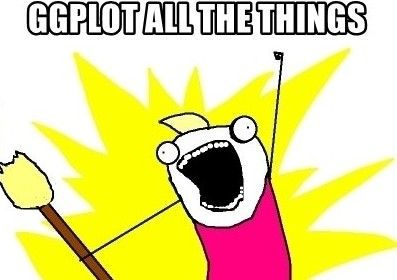

***
{width=400px} 

</br>

##A quick intro to the Introduction to R for Data Science

</br>

This 'Introduction to R for Data Science' is brought to you by the Centre for the Analysis of Genome Evolution & Function's (CAGEF) bioinformatics training initiative. This CSB1020 was developed based on feedback on the needs and interests of the Department of Cell & Systems Biology and the Department of Ecology and Evolutionary Biology. 


This lesson is the fifth in a 6-part series. The idea is that at the end of the series, you will be able to import and manipulate your data, make exploratory plots, perform some basic statistical tests, test a regression model, and make some even prettier plots to share your results. 


</br>

How do we get there? Today we are going to be learning how to make all sorts of plots - from simple data exploration to customized plots.The next lesson will be data cleaning and string manipulation; this is really the battleground of coding - getting your data into the format where you can analyse it. Then we will learn how to do t-tests and perform regression and modeling in R. 


</br>

The structure of the class is a code-along style. It is hands on. The lecture AND code we are going through are available on GitHub for download at <https://github.com/eacton/CAGEF>, so you can spend the time coding and not taking notes. As we go along, there will be some challenge questions and multiple choice questions on Socrative. At the end of the class if you could please fill out a post-lesson survey (<https://www.surveymonkey.com/r/H3PFQR3>), it will help me further develop this course and would be greatly appreciated. 

***

####Highlighting

`grey background` - a package, function, code, command or directory      
*italics* - an important term or concept or an individual file or folder     
**bold** - heading or a term that is being defined      
<span style="color:blue">blue text</span> - named or unnamed hyperlink  


***

####Packages Used in This Lesson

The following packages are used in this lesson:

`tidyverse` (`ggplot2`, `tidyr`, `dplyr`, `forcats`)     
`RColorBrewer`     
`viridis`     
`gridExtra`     
`ggrepel`     
`ggbeeswarm`     
`ggthemes`     
`ggpubr`     
`UpSetR`     

Please install and load these packages for the lesson. In this document I will load each package separately, but I will not be reminding you to install the package. Remember: these packages may be from CRAN OR Bioconductor. 

***


####Data Files Used in This Lesson

-split_ENV_pitlatrine.csv     
-long_SPE_pitlatrine.csv         
-SPE_pitlatrine.csv     

These files can be downloaded at <https://github.com/eacton/CAGEF/tree/master/Lesson_5/data>. Right-click on the filename and select 'Save Link As...' to save the file locally. The files should be saved in the same folder you plan on using for your R script for this lesson.

Or click on the blue hyperlink at the start of the README.md at <https://github.com/eacton/CAGEF/tree/master/Lesson_5> to download the entire folder at DownGit.

***

__Objective:__ At the end of this session you will be able to use `ggplot2` to make a ton of different types of plots with your data for both for data exploration and for publication-quality figures.  


***

##Intro to the Grammar of Graphics

 


**Grammar of graphics:** a language to be able to communicate about what we are plotting programatically

* The **aesthetics** are how the data is mapped visual properties. For example, the data being plotted or represented by a shape or colour. This data could be represented in multiple ways. A plot can have multiple layers (for example, a scatterplot with a regression line).

* Lines, bars, and points are examples of **geometric objects (geoms)** that could be used to present the data.

* The data units need to be converted to physical units in order to be displayed. This uses **scaling** and a coordinate system (position adjustment for where is our pixel going). Other **statistical transformations** can also occur, such as aggregating data, jittering, density estimates, a boxplot and binning. 

* **Facetting** allows us to plot subsets of the data.

This grammar allows very specific control over your plot and the ability to change features (easily). Plots can be scaled and made pretty enough for publication quality images.

`ggplot2` was made to interact well with tidy (long) datasets. I have found that if someone is spending lots of time figuring out how to make a scatterplot, his or her data is probably not in the correct format.


##The Grammar of Graphics in Action: Making Figures with ggplot2

####Dataset: Sequencing of the V3-V5 hypervariable regions of the 16S rRNA gene

16S rRNA sequencing of 30 latrines from Tanzania and Vietnam at different depths (multiples of 20cm). Microbial abundance is represented in Operational Taxonomic Units (OTUs). Operational Taxonomic Units (OTUs) are groups of organisms defined by a specified level of DNA sequence similarity at a marker gene (e.g. 97% similarity at the V4 hypervariable region of the 16S rRNA gene). Intrinsic environmental factors such as pH, temperature, organic matter composition were also recorded.

We have 2 csv files:

1. A metadata file (Naming conventions: [Country_LatrineNo_Depth]) with sample names and environmental variables.     
2. OTU abundance table.

B Torondel, JHJ Ensink, O Gunvirusdu, UZ Ijaz, J Parkhill, F Abdelahi, V-A Nguyen, S Sudgen, W Gibson, AW Walker, and C Quince.
Assessment of the influence of intrinsic environmental and geographical factors on the bacterial ecology of pit latrines
Microbial Biotechnology, 9(2):209-223, 2016. DOI:10.1111/1751-7915.12334

***

###Scatterplot

I have saved a version of the OTU table in tidy format (which we created in Lesson 3 - split_dat). As well as a modified version of the metadata table.

```{r include = FALSE, warning = FALSE}
#ndat <- read.csv("data/ENV_pitlatrine.csv", stringsAsFactors = F)
#ndat <- ndat %>% separate(Samples, c("Country", "Latrine_Number", "Depth"), sep = "_")
#ndat$Country <- gsub("T", "Tanzania", ndat$Country)
#ndat$Country <- gsub("V", "Vietnam", ndat$Country)

#write.csv(ndat, "data/split_ENV_pitlatrine.csv", row.names=FALSE)
```


Let's read our data tables in and also load `ggplot2`. We will be using a variety of packages today that are grouped in `tidyverse`, so let's load `tidyverse`. You can see in the package startup message that `ggplot2` is one of the attached packages. 


```{r, suppressPackageStartupMessages()}
library(tidyverse)

dat <- read_csv("data/long_SPE_pitlatrine.csv", col_types = 'ccici')
ndat <- read_csv("data/split_ENV_pitlatrine.csv", col_types = 'cccnnnn')
```

Let's build a plot by adding components one by one to see how the grammar of graphics is implemented in `ggplot2`. To start, we of course need to input our data. However, if that is all we input, what we get back is a blank graphic. We have not yet said what we want to plot and how we want to plot it. 

```{r}
ggplot(ndat)
```

We have, however, created a *ggplot object*. This is a list of 9 parameters: data, layers, scales, mapping, theme, coordinates, facet, plot environment, and labels. Luckily there are some defaults, so we don't have to specify everything, but you can start to see how ggplot objects are highly customizable. 

```{r}
str(ggplot(ndat))
```

The next step is to choose the data we are plotting **(aesthetics)**. At this point the data can be **scaled** and the axes appear. We have not yet specified how we want the data plot, just which data should be plotted. In practice, people usually omit 'mapping = ', but it is a good reminder that mapping is, in fact, what we are doing.

```{r}
ggplot(ndat, mapping = aes(x = TS, y = CODt))
```

We now have chosen the **geometric object (geom)** with which to plot our data, in this case a point. A geom could be a line, a bar, a boxplot - you can type geom_ and then `Tab` to see all of the available options. *Autocomplete* can also be helpful for remembering syntax.

```{r}
ggplot(ndat, aes(x=TS, y=CODt)) + geom_point() 
```

The data looks like there are two groupings. My guess would be that this is for the 2 different countries. We can easily test this by colouring our points by Country. Look at the structure of ndat in either the Global Environment or using `str()`. Note that Country is a factor. A colour will be chosen for each factor level. A legend will be automatically created for you. 

The **aesthetic** of colour which is mapped to Country can be specified when 'x' and 'y' (the data to be plotted) are specified using `aes()`. Colour can alternatively be specified using `geom_point(aes())` since it is a description of the points being plotted. I usually do the former, because it is more likely that I will change *how* I plot a figure (points, lines, bars) versus *what* I plot in a figure (TS, CODt, Country). There are minor implications for each of these choices.

```{r}
ggplot(ndat, aes(x=TS, y=CODt, colour = Country)) + geom_point() 
#is equivalent-ish to
ggplot(ndat, aes(x=TS, y=CODt)) + geom_point(aes(colour = Country)) 
```

Some of our data points seem to be crushed near the x-axis. We can **scale** the y-axis to fix this. When we start customizing our plot, our code starts to get a bit harder to read on one line. We can create each specification on a new line by ending each line with `+`. 


```{r}
ggplot(ndat, aes(x=TS, y=CODt, colour = Country)) + 
  geom_point() + 
  scale_y_log10()
```

Keep in mind that scaling does not change the data, but rather the representation of the data. The y-axis has been scaled. This is different than taking the log10 of the y data.

```{r}
ggplot(ndat, aes(x=TS, y=log10(CODt), colour = Country)) + 
  geom_point() 

```


The placement of the points looks the same, but the first graph is scaling the axis while the second graph has changed the data to a log10 scale.


####Faceting

**Faceting** allows us to split our data into groups. Note that I have removed the colour. It is good data visualization practice to only have one attribute (colour, shading, faceting, symbols) per grouping.

```{r}
ggplot(ndat, aes(x=TS, y=CODt)) + 
  geom_point() +
  scale_y_log10() +
  facet_grid(~Country)
```

I could now add information from another variable as a colour in this plot. Note that if a variable is continuous instead of discrete, the colour will be a gradient.

```{r}
ggplot(ndat, aes(x=TS, y=CODt, colour = Temp)) + 
  geom_point() +
  scale_y_log10() +
  facet_grid(~Country)
```

If we really wanted to we could add another variable to the plot by changing the shape attribute. Let's change Country to having 2 shapes and facet by the Depth of the latrine instead. Note that shape can only be used for discrete values. A quick reference key for shapes can be found in the 'Cookbook for R' (http://www.cookbook-r.com/Graphs/Shapes_and_line_types/). 

```{r}
ggplot(ndat, aes(x=TS, y=CODt, colour = Temp, shape = Country)) + 
  geom_point() +
  scale_y_log10() +
  facet_wrap(~Depth)

```

We can now note that only Tanzania had sampling greater than 4cm of depth. There are single latrines for 4 samples. There was no latrine at a depth of 11cm. Lack of replication and a bias towards Tanzania for the higher depths is something we should keep in mind while looking at this data. Depending on the question we are trying to answer, we may want to remove some of this data. 


One thing that is not necessary in this case - but good to know about - is the ability to allow each grid to have its own independent axis scale. In our example, wells of Depths from 1-4cm have up to 1000 CODt, while the other wells barely have values past 100 CODt. This can be changed, but keep in mind most people will assume all grids have the same scale, so take extra care to point that the scales are different when presenting or publishing. 

```{r}
ggplot(ndat, aes(x=TS, y=CODt, colour = Temp, shape = Country)) + 
  geom_point() +
  scale_y_log10() +
  facet_wrap(~Depth, scales = "free_y")

```

####Regression Lines
You can also add **statistical transformations** to your plots. Again, take a look at stat_ then `Tab` to see the list of options. In this case let's separately fit a linear regression line to CODt vs TS for each country. The grey area around the line is the confidence interval (default=0.95) and can be removed with the additional call to stat_smooth of `se = FALSE`.

```{r}
ggplot(ndat, aes(x=TS, y=CODt)) + 
  geom_point() +
  scale_y_log10() +
  facet_grid(~Country) +
  stat_smooth(method = lm)
```

A linear model is not always the best fit. The method of calculating the smoothing function can be changed to other provided functions (such as loess, used below) or can be a custom formula. Note that I changed the confidence interval by modifying `level=0.8`. geoms can be made more transparent with the alpha parameter, which is set to 0.3 in the following code so that the emphasis is on the regression line rather than the points.

```{r}
ggplot(ndat, aes(x=TS, y=CODt)) + 
  geom_point(alpha = 0.3) +
  scale_y_log10() +
  facet_grid(~Country) +
  stat_smooth(method = loess, level = 0.8)
```

##Exploring different types of plots

###Density Plots

We are making a density plot for OTUs by Country. I have set alpha (transparency) to 0.3 so that we can see both countries on our plot.

```{r}
ggplot(dat, aes(x=OTUs, fill=Country, alpha=0.3)) + 
	geom_density() 
```

The first thing to notice is that everything is clumped at 0. This is because we have not filtered our data frame to remove all observations where OTUs are zero. Here we filter to have at least 2 OTUs. The other thing to notice is that there is a long tail where there will only be a few observations. It will be necessary to change the x-axis to see our data. This is done by setting 'limits' (lower and upper boundaries) on the x-axis with `xlim()`. Note that R gives us a warning that we are not viewing 158 of our 4212 rows. We can add a rug geom to see each value.

```{r }
fdat <- dat %>% filter(OTUs >=2)

ggplot(fdat, aes(x=OTUs, fill=Country, alpha=0.3)) + 
	geom_density() +
  geom_rug() +
  xlim(0, 1000)

```

###Histograms

Histograms instead count the number of observations you have in each 'bin' that you specify. The default binwidth is 30, which means your data will be divided into a new bin every 30 units along your x-axis. THIS HAS NOTHING TO DO WITH YOUR DATA!! CHANGE IT!! R will even warn you to change your binwidth.

```{r}
ggplot(fdat, aes(x=OTUs, fill=Country, alpha=0.3)) + 
	geom_histogram() +
  xlim(0,1000)
```

Instead of having the countries information stacked, we may want to see the data side by side. This can be done with the parameter position set to 'dodge'. A rug geom can also be added to a histogram. Note that the binwidth has been changed and limits have also been set on the y-axis.

```{r warning = FALSE}
ggplot(fdat, aes(x=OTUs, fill=Country, alpha=0.3)) + 
	geom_histogram(binwidth = 50, position = "dodge") +
  xlim(0,1000) +
  ylim(0,150) +
  geom_rug()
```

***
__Challenge__ 


<div style="float:left;margin:0 10px 10px 0" markdown="1">
{width=150px}

</div>

Create a bar plot of OTUs per country and use the filled in colour to represent Taxa.


</br>
</br>
</br>

***


```{r include = FALSE, eval = FALSE}

ggplot(fdat, aes(x=Country, y=OTUs, fill=Taxa)) + 
	geom_bar(stat = "identity") 

#If do not use stat = "identity" get the error ##Error: stat_count() must not be used with a y aesthetic.
#This is a common error because the default for `geom_bar()` is to use the y-axis for a count. To use it for a variable instead, we have to specify `stat="identity"`.
```


####Controlling the order categorical variables in your legend

In the legend for the bar plot our factor levels for Taxa are in *alphabetical order*. However, an ordering that might be more useful would be an order that matches our data, for example, Taxa in descending order of OTUs. To do this, we can use the `forcats` package (included in `tidyverse` and already loaded). `fct_reorder2()` takes the factor we want ordered (Taxa) and orders it by the values given (Country, OTUs). 

We will talk about customizing plots later in this lesson, but the last line of code is one way to remove the legend title (by making the legend title 'blank').

```{r}
ggplot(fdat, aes(x=Country, y=OTUs, fill=fct_reorder2(Taxa, Country, OTUs))) + 
	geom_bar(stat = "identity") +
  theme(legend.title = element_blank())
 
```

Now our highest abundance Taxa is the first value in our legend, and this matches the order of the Taxa in our bar graph. The legend order now has meaning. The white line in the Vietnam bar graph is a Taxa for which there was an OTU value in Tanzania but no data in Vietnam (since anything <=2 was filtered out of the data set). 


You can alternate between 'stacked' or 'dodged' (as we did with the histogram) for whether your bars are on top of each other or next to each other when splitting by a factor or categorical variable.

```{r}
ggplot(fdat, aes(x=Country, y=OTUs, fill=fct_reorder2(Taxa, Country, OTUs))) + 
	geom_bar(stat = "identity", position = "dodge") +
  theme(legend.title = element_blank())
```

You can have your bars horizonal instead of vertical by using `coord_flip()`.

```{r}
ggplot(fdat, aes(x=Country, y=OTUs, fill=fct_reorder2(Taxa, Country, OTUs))) + 
	geom_bar(stat = "identity") +
  theme(legend.title = element_blank()) +
  coord_flip()
```


###Boxplots

Boxplots are a great way to visualize summary statistics for your data. As a reminder, the thick line in the center of the box is the median. The upper and lower ends of the box are the first and third quartiles (or 25th and 75th percentiles) of your data. The whiskers extend to the largest value no further than 1.5*IQR (inter-quartile range - the distance between the first and third quartiles). Data beyond these whiskers are considered outliers and plotted as individual points. This is a quick way to see how comparable your samples or variables are.

We are going to use boxplots to see the distribution of OTUs per Taxa across all samples.

```{r}
ggplot(dat, aes(x = Taxa, y = OTUs)) +
  geom_boxplot() 
```

While we are going to address customization and what theme elements are shortly, but I think showing you now how to rotate the x-axis labels is appropriate. Essentially we are taking the text on the x-axis and rotating it by 90 degrees.

```{r}
ggplot(dat, aes(x = Taxa, y = OTUs)) +
  geom_boxplot() +
  theme(axis.text.x = element_text(angle=90))
```

We then justify the labels such that they align with the x-axis. 

You may ask why this is a horizontal (hjust) justification, when it seems like moving the labels upwards towards the x-axis should be a vertical (vjust) justification. If you look in the help menu at `element_text()` you will see that the justification is carried out before the rotation. While we can specify the parameters of `element_text()` in any order, this does not change the order they are executed in the function.     

```{r}
ggplot(dat, aes(x = Taxa, y = OTUs)) +
  geom_boxplot() +
  theme(axis.text.x = element_text(angle=90, hjust = 1))
```
</br> 

While it is clear that Clostridia is the most represented taxa, it is difficult to tell whether some other taxa have no representation, or if they are lowly represented. Transforming to a log scale on the y-axis will sort this out for us.

```{r warning = FALSE}
ggplot(dat, aes(x = Taxa, y = OTUs)) +
  geom_boxplot() +
  theme(axis.text.x = element_text(angle=90, hjust=1)) +
  scale_y_log10()
```

For now, let's just keep the Taxa that are common to both countries and have greater than 1 OTU. To do this we can filter for rows with greater than or equal to 2 OTUs. We then group by Country and Taxa to get Country-specific information about Taxa, and count the number of entries, keeping only Taxa that are shown to appear in more than one sample. We then need to `ungroup()` to select our final list or we will end up with a grouped object. We use the `duplicated()` function to retain those Taxa that were found twice (ie. in both countries).

The `%in%` function returns a logical vector of whether there is a match or not for its first argument in its second argument. It is useful for subsetting.

We can facet our plot by Country to verify we have only commonly appearing OTUs.

```{r warning = FALSE}
keep <- fdat %>% 
  group_by(Country, Taxa) %>% 
  summarize(n = n()) %>% 
  filter(n > 1) %>%
  ungroup() %>%
  select(Taxa) %>%
  filter(duplicated(.))

subfdat <- fdat %>% filter(Taxa %in% keep$Taxa)

ggplot(subfdat , aes(x = Taxa, y = OTUs)) + 
  geom_boxplot() + 
  theme(axis.text.x = element_text(angle=90, hjust=1)) + 
  scale_y_log10() + 
  facet_grid(~Country)
```

We will be using this graph as a base for customization later in the lesson.

###Beeswarm Plots

Even though boxplots give us summary statistics on our data, it is useful to be able to see where our individual data points are. We can add the data as another layer using `geom_point()`to place dots on top of our boxplot, or use `geom_jitter()` to spread our points out a bit. However, a **beeswarm plot** places data points that are overlapping next to each other, so we can get a better picture of the distribution of our data.

I have subset the data to make a boxplot with 3 Taxa and 1 Country so that we can see the differences in geom options a bit better.

An option with `ggplot2` is to save your plot into a *ggplot object*. This works well if you know you are only changing one or two elements of your plot, and you do not want to keep retyping code. What we are going to vary here is how the data points are displayed.

```{r warning = FALSE}
subdat <- dat %>% filter((Taxa=="Clostridia" | Taxa == "Unknown" | Taxa == "Bacilli") & Country == "T")

b <- ggplot(subdat, aes(x = Taxa, y = OTUs)) + 
  geom_boxplot() +
  theme(axis.text.x = element_text(angle=90, hjust=1)) + 
  scale_y_log10()
```

We can simply overlay the points with `geom_beeswarm()`.

```{r warning = FALSE}
library(ggbeeswarm)

b + geom_beeswarm()
```


Increasing the spacing between data points (increasing 'cex') can make this distribution a bit clearer.

```{r warning = FALSE}

b + geom_beeswarm(cex = 2.2) 
```

Using `geom_quasirandom()` gives the empirical distribution of the stripplot to avoid overplotting.

```{r warning = FALSE}
b + geom_quasirandom(varwidth = TRUE) 

```


Other spacing and distribution options are available at https://github.com/eclarke/ggbeeswarm.


##Customization

</br>

{width=300px} 

</br>
</br>

###Attributes Related to Your Data

Plot elements relating to your data include things like axis labels, titles, colour or shapes that represent subsets of your data, scaling that is data-dependent, legends, and other data-driven parameters. 

For customizing your data it is possible to change:

- colour()
- fill()
- shape()
- size()
- alpha()

Titles and axis labels can be added using:

- ggtitle()
- xlab()
- ylab()

We have seen in the above examples that colour can be applied to discrete or continous variables. We can also use colour (shape, etc.) to represent outliers. In this data set outliers beyond the whiskers (above or below 1.5*IQR) can be coloured red.

I also want to add a title, modify the y-axis label to say that the data is log, and remove the x-axis label. Note that I remove the x-axis label by using 'NULL'.


```{r warning = FALSE}
ggplot(subfdat , aes(x = Taxa, y = OTUs, fill = Taxa)) + 
  geom_boxplot(outlier.colour = "red") + 
  scale_y_log10() + 
  facet_grid(~Country) +
  ggtitle("Abundance of Taxa by Country") +
  xlab(NULL) +
  ylab("log(OTUs)") + 
  guides(fill=FALSE) 

```

I also want to change my Country labels from a single letter to the country name. This can be done in a couple of ways. 

One way would be to change the values in the dataset. Since we haven't learned string manipulation yet, I will show you a second way, which is to use the `labeller()` function. I can make a vector of the names to replace 'T' and 'V' with. The data is split by Country in the `facet_grid()` and this is where we pass our labels to `labeller()`, which will output the names on the strip label.

I am now going to save this plot in a *ggplot object*, since we are going to use this as our base plot for the next section. (I am also going to rotate the x-axis text again. We will talk about theme elements soon, but in the meantime it won't drive me bonkers.)

```{r warning = FALSE}
labels <- c(T = "Tanzania", V = "Vietnam")

p <- ggplot(subfdat, aes(x = Taxa, y = OTUs, fill = Taxa)) + 
  geom_boxplot(outlier.colour = "red") + 
  scale_y_log10() + 
  facet_grid(~Country, labeller = labeller(Country = labels)) +
  ggtitle("Abundance of Taxa by Country") +
  xlab(NULL) +
  ylab("log(OTUs)") +
  guides(fill=FALSE) + 
  theme(axis.text.x = element_text(angle=90, hjust=1))

p
```

A common thing to want to do is to change colours from `ggplot2`'s rainbow color scheme. Let's create our own colour palette for Taxa.

###A Note on Colour Palettes

There are 3 main types of colour palettes.

1. *Sequential* - implies an order to your data -  ie. light to dark implies low values to high values.

```{r warning = FALSE}
library(RColorBrewer)

display.brewer.all(type = "seq")

```

2. *Diverging* - low and high values are extremes, and the middle values are important - still goes from light to dark, but 3 colours mainly used.

```{r}
display.brewer.all(type = "div")
```

3. *Qualitative* - there is no quantitative relationship between colours. This is usually used for categorical data.


```{r}
display.brewer.all(type = "qual")
```

Which of these types is `ggplot2`'s default color palette?

Let's test one of the `RColorBrewer` palettes out on our data.

```{r warning = FALSE}
p + scale_fill_brewer(palette = "Spectral")
```

Many colour palettes now exist. I'll showcase a couple that work nicely with `ggplot2`. These packages also have colorblind friendly options. `RColorBrewer` has options for these 3 types of palettes, which you can see with `display.brewer.all()`. With a smaller dataset, we could make a call in `ggplot` directly to `scale_fill_brewer()`, which just requires a choice of one of `RColorBrewer`'s palettes, such as "Spectral". However, we have 24 Taxa and these palettes have 8-12 colours, so we have to get creative.


I have simply taken the 2 qualitative palettes that each have a length of 12, put them into one palette, and made sure my values were unique. This can then be passed to `ggplot` via `scale_fill_manual()`. 


```{r warning = FALSE}
palette1 <- brewer.pal(12, "Paired")
palette2 <- brewer.pal(12, "Set3")

custom <- c(palette1, palette2)

length(unique(custom))

p + scale_fill_manual(values = custom)
```


You can always choose a vector of your own colors using this 'R color cheatsheet' (https://www.nceas.ucsb.edu/~frazier/RSpatialGuides/colorPaletteCheatsheet.pdf).

Names of colours as well as colour codes are accepted.

`scale_fill_manual(values=c("purple", "cornflowerblue", "grey", "yellow", "orange", "FF0000"))`


The `viridis` package also has some nice color palettes (https://cran.r-project.org/web/packages/viridis/vignettes/intro-to-viridis.html). I think they might all be diverging palettes (qualitative is best for our Taxa), but I will showcase a couple here.

```{r warning = FALSE, message = FALSE}
library(viridis)

p + scale_fill_viridis(discrete = TRUE)
p + scale_fill_viridis(discrete = TRUE, option = "plasma")
```


`RSkittleBrewer` is another option for funky colour palettes.
`ggsci` has a variety of color palettes inspired by different scientific journals as well as television shows (https://cran.r-project.org/web/packages/ggsci/vignettes/ggsci.html).


###Theme: Attributes Unrelated to Your Data

As mentioned earlier, it is possible to customize every single aspect of a `ggplot`. Most of this occurs with a call to `theme()`, which you can think of as modifying everything BUT your data. For example, my axis labels can be modified, but they (hopefully) have something to do with my data. However, changing the size of the text or the font of the labels is unrelated to my data, and the same structure (text font & size) could be carried over to other plots if I saved my own theme.

Things that you can change with `theme()` include the axis, legend, panels, gridlines, or background.

Each *element* of a theme inherits from one of: 

- element_text (text elements like font, colour, size, face (bold, italics), alignment), 
- element_line (grid lines, axis lines), 
- element_rect (panels and backgrounds - colour, size, fill), 
- element_blank (assigns nothing, usually when you are trying to get rid of something), 
- element_grob (making a grid grob).

`ggplot2` comes with some themes - I suggest starting with the one that is close to what you want, and start modifying from there.

Check out these *themes*:

- theme_minimal()
- theme_classic()
- theme_bw()
- theme_void()
- theme_dark()
- theme_gray()
- theme_light()

You can look at the default for each theme simply by typing it into the console.

```{r}
theme_bw
```

And this is what `theme_bw()` practically looks like:

```{r warning = FALSE}
p + theme_bw() 

```

Note that the last call to theme overrides my previous call to theme if there is a conflict (in this case the angle of the x-axis text). Here is an example of `theme_dark()`. I am going to override the default x-axis text angle of this theme by modifying it AFTER I call `theme_dark()`.

```{r warning = FALSE}
p + theme_dark() + 
  theme(axis.text.x = element_text(angle=90, hjust=1))
```

`ggthemes` is a package of themes. Some of these themes are based off of graphs seen in print or on websites (the economist, wall street journal, fivethirtyeight) or to match standard tools (excel, google docs). Information about these themes can be found at https://github.com/jrnold/ggthemes.

Here are 2 possible themes.

```{r warning = FALSE}
library(ggthemes)
p + theme_economist()
```


```{r warning = FALSE}
p + theme_stata()
```

You can also make your own custom theme as demoed here: http://joeystanley.com/blog/custom-themes-in-ggplot2


I am going to show you how to customize a plot, starting from `theme_minimal()` because I don't like the grey backgrounds or harsh axis lines.


```{r warning = FALSE}
p + theme_minimal()

```
</br>

Things I don't like about this plot and their solutions: 

```{r echo = FALSE, eval = TRUE, warning = FALSE}
library(knitr)
library(kableExtra)

text_table <- data.frame(
  Problem = c("x-axis labels overlap", "country labels are smaller than axis labels", "title is uncentered", "border to separate countries", "make y axis ticks"),
  Solution = c("rotate lables: axis.text.x = element_text(angle =90, hjust=1)", "change size and face: strip.text.x = element_text(face = 'bold', size = 16)", "adjust horizontally: plot.title = element_text(hjust=0.5, size = 18)", "create a border: panel.border = element_rect(fill = NA)", "create y axis ticks: axis.ticks.y = element_line()")
)

kable(text_table, "html") %>%
  kable_styling(full_width = F) %>%
  column_spec(1, italic = T, border_right = T) %>%
  column_spec(2, width = "40em")
```


It isn't necessary to remember all of this syntax, I frequently find myself back at the help page at http://ggplot2.tidyverse.org/reference/theme.html.

As mentioned the last call to `theme()` will override previous calls that conflict. Therefore, if we want to start with `theme_minimal()` as our base, it has to be in our code BEFORE the other modifications. 

```{r warning = FALSE}
p + 
  theme_minimal() +
  theme(axis.text.x = element_text(angle = 90, hjust = 1),
        panel.border = element_rect(fill=NA),
        strip.text.x = element_text(face = "bold", size = 16),
        plot.title = element_text(hjust=0.5, size = 18),
        axis.ticks.y = element_line())

```

***
__Challenge__ 


<div style="float:left;margin:0 10px 10px 0" markdown="1">
{width=150px}

</div>

Change the colour of the plot background. Add minor gridlines, and make the major gridlines black. 


</br>
</br>
</br>

```{r include = FALSE}
p+theme_minimal()+
  theme(axis.text.x = element_text(angle = 90, hjust = 1),
        panel.border = element_rect(fill = NA),
        strip.text.x = element_text(face = "bold", size = 16),
        plot.title = element_text(hjust=0.5, size = 18),
        axis.ticks.y = element_line(),
        panel.grid.major = element_line(),
        panel.grid.minor = element_line(), 
        plot.background = element_rect(fill = "cornflowerblue"))
```


###Saving your Figures

Up until now, we have taken for granted that our plots have been displayed using a *Graphic Device*. 

</br>

####Graphics Devices

    Plots must be created on a graphics device.

    The default graphics device is almost always the screen device, which is most useful for exploratory analysis.

    File devices are useful for creating plots that can be included in other documents or sent to other people.

    For file devices, there are vector (pdf, svg, postscript) and bitmap (png, jpeg, tiff) formats.

    Vector formats are good for line drawings and plots with solid colors using a modest number of points.

    Bitmap formats are good for plots with a large number of points, natural scenes or web-based plots.
    
(https://rdpeng.github.io/Biostat776/notes/pdf/grdevices.pdf)

`ggplot2` has its own function for saving its graphics: `ggsave()`. This allows us to skip the step of explicitly calling separate graphics devices and shutting them down afterwards (if you have saved plots in base R or `lattice`, this will sound familiar to you).

You can send the plot object to the screen device to preview your image, and then save that image by specifying the file device. If you do not specify the device type, `ggsave()` will guess it from your filename extension (pdf, jpeg, tiff, bmp, svg or png). Note that this will save whatever graphic was last on your screen device.

With `ggsave()` you can minimally input the filename you would like to have, and the path to your file.

```{r}
ggsave("crazy_blue_graph.png", path = "img")
```

However, in some cases you want to tailor your output. You can specify the width, height and units of your image, or you can apply a scaling factor (the 'eyeballing' approach). You can also specify the plot object you want to save instead of whatever was on your graphics device last using the 'plot' parameter. Note that this time I have combined the path with the filename, and called the file device type separately.

```{r}
saved_plot <- p+theme_minimal()+
  theme(axis.text.x = element_text(angle = 90, hjust = 1),
        panel.border = element_rect(fill = NA),
        strip.text.x = element_text(face = "bold", size = 16),
        plot.title = element_text(hjust=0.5, size = 18),
        axis.ticks.y = element_line(),
        panel.grid.major = element_line(),
        panel.grid.minor = element_line(), 
        plot.background = element_rect(fill = "cornflowerblue"))

ggsave("img/crazy_blue", plot = saved_plot, device = "pdf", scale = 2, width = 150, height = 110, units = "mm")
```

No image is sent to the screen device when a file is saved in this manner.

</br>

***
##Taking it up a notch

There are many fantastic R packages to analyze and visualize your data. As a group, we are likely working in a variety of specialized areas. The plots we have made so far today should be useful for data exploration for many different kinds of data. In the next section we are going to preview some more complex visualization types, but since these take more time to go through and not everyone may be interested in interactive graphics, network diagrams, time-series analysis, or geospatial data, we will not be plotting all of these together. We will, however learn how to arrange multiple plots per page, and also how to make an upset plot.  If you are interested in a tutorial on one of these other visualization types, please indicate that in the comments area of the lesson survey (https://www.surveymonkey.com/r/H3PFQR3). 


</br>


###Multiple plots on one page (ie. for publication images)

There are a variety of methods to mix multiple graphs on the same page, however `ggplot2` does not work well with all of them. I am going to work with a package based that uses `gridExtra`(which allows us to arrange plots) but works well with `ggplot2` called `ggpubr` (which allows us to align the axes of our plots). For a demonstration, we are going to take 3 plots that we made earlier (a boxplot, a histogram, and a dot plot), save them as objects, and then arrange and align them in the same figure. (http://www.sthda.com/english/rpkgs/ggpubr/)

`ggarrange()` is a function that takes your plots, their labels, and how you would like your plots arranged in rows and columns. To start, we want our boxplot and dot plot side by side. If you picture each plot as a square in a grid, we need two columns (one for each plot, `ncol = 2`) and one row (since they are side by side, `nrow = 1`). 

```{r warning = FALSE, message = FALSE}
library(ggpubr)

hist <- ggplot(fdat, aes(x=OTUs, fill=Country, alpha=0.3)) + 
	geom_histogram(binwidth = 50, position = "dodge") +
  xlim(0,1000) +
  ylim(0,150) +
  geom_rug() 

dot <- ggplot(ndat, aes(x=TS, y=CODt)) + 
  geom_point() +
  scale_y_log10() +
  facet_grid(~Country) +
  stat_smooth(method = lm)

ggarrange(dot, hist, 
          labels = c("A", "B"),
          ncol = 2, nrow = 1)


```

While our grid areas are the same size, our plot backgrounds are not. Let's adjust the legend so that it is in the top right corner of the plot, and remove the white background. We do not need the alpha legend. Do you remember how to get rid of it?


```{r warning = FALSE}
hist <- ggplot(fdat, aes(x=OTUs, fill=Country, alpha=0.3)) + 
	geom_histogram(binwidth = 50, position = "dodge") +
  xlim(0,1000) +
  ylim(0,150) +
  geom_rug() +
  guides(alpha = FALSE) +
  theme(legend.justification=c(1,1), legend.position=c(1,1), legend.background = element_blank())

ggarrange(dot, hist, 
          labels = c("A", "B"),
          ncol = 2, nrow = 1)
```

Next we will add in the boxplot. Imagine a square with 4 boxes. We are going to put our boxplot in the left top and bottom boxes, the histogram in the top right box, and the bubble plot in the bottom right box.  To do this, we are arranging 2 columns (one with the boxplot and one with the histogram + bubble plot, `ncol = 2`) and we are arranging 2 rows (one with the histogram and one with the bubble plot, `nrow = 2`).

```{r warning = FALSE}
box <- ggplot(subdat , aes(x = Taxa, y = OTUs)) + 
  geom_boxplot() + 
  geom_point() +
  theme(axis.text.x = element_text(angle=90, hjust=1)) + 
  scale_y_log10()

ggarrange(box, ggarrange(hist, dot, 
          labels = c("B", "C"),
          nrow = 2),
           ncol = 2, labels = "A")

```

If y-axis lines or x-axis lines are not aligned, but this can be fixed with a call to `align = "v"` or `align="h"`.

To make sure all axis titles are the same size (B and C look a little off to me), we can specify using `font()` which text we want changed and the size we want to change it to. I am also going to make the legend title size the same.Let's look at the `font()` function.

```{r warning = FALSE}

ggarrange(box + font("axis.title", size=9), ggarrange(hist + font("axis.title", size=9) + font("legend.title", size=9), dot + font("axis.title", size=9), 
          labels = c("B", "C"),
          nrow = 2, align = "v"),
           ncol = 2, labels = "A")
```

***
__Challenge__ 


<div style="float:left;margin:0 10px 10px 0" markdown="1">
{width=150px}

</div>

Using the code available here for a density plot we made earlier in the lesson, make a combined figure. Imagine a square with 4 boxes. We are going to put our density plot in the top right and left boxes, the histogram in the bottom left box, and the box plot in the bottom right box. Make sure the legend and axis titles are the same size. Change the legend text for the line graph to be smaller than the legend title. 

```
dens <- ggplot(fdat, aes(x=OTUs, fill=Country, alpha=0.3)) + 
	geom_density() +
  geom_rug() +
  xlim(0, 1000)
```

</br>
</br>
</br>

***

```{r include = FALSE, warning = FALSE, eval = FALSE}
dens <- ggplot(fdat, aes(x=OTUs, fill=Country, alpha=0.3)) + 
	geom_density() +
  geom_rug() +
  xlim(0, 1000)


ggarrange(dens+ font("axis.title", size=9) + font("legend.title", size=9) + font("legend.text", size = 6), ggarrange(hist + font("axis.title", size=9)+ font("legend.text", size = 6) + font("legend.title", size=9), box + font("axis.title", size=9), 
          labels = c("B", "C"),
          ncol = 2, align = "h"),
           nrow = 2, labels = "A")
```

###Upset Plots
**Packages**

UpSetR: https://github.com/hms-dbmi/UpSetR     

Upset plots are an alternative to venn diagrams that show the intersection of sets, as well as the size of the sets. Additionally, venn diagrams can be difficult to interpret for greater than 2 or 3 sets. This is a real life figure from BMC Bioinformatics. Sure it looks pretty, but what does the number 24 represent in this picture in terms of A, B, C, D, and E?    

{width=400px} 

</br>

Let's see how UpSet plots work practically. 

*Question: For 8 Taxa, how many sites are each Taxa present at and what is the overlap between sites with other Taxa?* 

I have picked 8 different Taxa, which would make a crazy venn diagram with a lot of zeros in it since a couple of these Taxa are rare.

```{r}
subtax <- read.csv("data/SPE_pitlatrine.csv", stringsAsFactors = FALSE)

eight <- c("Chloroflexi", "Acidobacteria_Gp16", "Acidobacteria_Gp5", "Cyanobacteria", "Lentisphaeria", "Deinococci", "Alphaproteobacteria", "Clostridia")

#subset for the 8 taxa
subtax <- subtax %>% filter(Taxa %in% eight)
```

The data that we have is an OTU table. For this purpose we simply want to know whether a given Taxa was present or absent in the sample, and then we can form intersections based on this information. So, for each OTU value that is *not* 0, we replace it with a 1 instead. 

```{r}
#this is a tidyr way of transposing our data frame so that Taxa are in columns and sites are in rows
#this format is for the upset plot only, we can do the value replacement in either format
subtax  <- subtax %>% 
   gather(sample, otus, -Taxa) %>% 
   spread(Taxa, otus) 

#if any OTUs are present, substitute the value with a 1 (exclude the first row which is character)
#don't worry about the function syntax, we will be writing functions in lesson 6
subtax[,-1] <- apply(subtax[,-1], 2, function(x) ifelse(x!=0, 1, 0))
```

Then to use the `upset()` plotting function, we enter our data set, the number of sets we are inputting, if we want to order the results (in this case by frequency), and how many intersections we want to show.  Here, I will show 15 intersections - we know the remaining intersections would be zero since this is ordered by frequency.

```{r warning = FALSE, message = FALSE}
library(UpSetR)

upset(subtax, nsets = 8, empty.intersections = TRUE, order.by = "freq", nintersects = 15, main.bar.color = "black", sets.bar.color = "#56B4E9" )

```

Let's look at our greatest Intersection Size (equal to 28). This means that 28 of our 81 samples have Clostridia, Alphaproteobacteria, and Deinococci present in the same sample WITHOUT Chloroflexi, both Acidobacteria, Cyanobacteria and Lentisphaeria. We can see from the Set Size that Clostridia and Alphaproteobacteria are present in almost all samples, and Deinococci is present in greater than 3/4 of the samples. You might expect this overlap to be higher, but remember that this is without all the other Taxa. Moving along our interesection sizes and dot matrix, we can see that other intersections include these bacteria. For example, the next bar to the right with an Intersection Size of 16, also includes Lentisphaeria. Some quick mental math shows that 63 samples have these top 3 Taxa present.  


###Interactive graphics 
**Packages**

Plotly: https://plot.ly/r/

ggvis: http://ggvis.rstudio.com/interactivity.html

Heatmaps: https://github.com/talgalili/heatmaply

Interactive time-series data: https://rstudio.github.io/dygraphs/


###Network diagrams 
**Packages**

visNetwork (based on igraph): https://datastorm-open.github.io/visNetwork/edges.html

###Circos Plots
**Packages**

Migest: https://gjabel.wordpress.com/category/r/migest/


###Geospatial Data
**Packages**

Static Maps:
- https://bhaskarvk.github.io/user2017.geodataviz/notebooks/02-Static-Maps.nb.html

Interactive Maps:
- https://bhaskarvk.github.io/user2017.geodataviz/notebooks/03-Interactive-Maps.nb.html
  
###Phylogenetics Data 
**Packages**

ggtree: 
- http://www.bioconductor.org/packages/3.7/bioc/vignettes/ggtree/inst/doc/treeAnnotation.html#annotate-clades

treeman: 
- https://bmcresnotes.biomedcentral.com/articles/10.1186/s13104-016-2340-8

metacoder: 
- https://github.com/grunwaldlab/metacoder

phyloseq:
- https://joey711.github.io/phyloseq/index.html

###Genomics Data 
**Packages**

ggbio: 
- http://www.bioconductor.org/packages/2.11/bioc/vignettes/ggbio/inst/doc/ggbio.pdf

GenVisR:
- https://bioconductor.org/packages/release/bioc/vignettes/GenVisR/inst/doc/Intro.html

GenomeGraphs:
- https://bmcbioinformatics.biomedcentral.com/articles/10.1186/1471-2105-10-2
   
***
__Challenge__ 


<div style="float:left;margin:0 10px 10px 0" markdown="1">
{width=150px}

</div>

Install and load the gapminder package. Save the gapminder data into an object using `dat <- gapminder`. Plot the following:

    1. a qualitative variable with a quantitative variable (at least 2 ways). 
      + Facet your plot by the qualitative variable.
    2. two quantitative variables (at least 2 ways). 
      + Add a regression line to your plot.

</br>
</br>
</br>

***


__Resources:__     

Wickham, Hadley. (2010). A Layered Grammar of Graphics. Journal of Computational and Statistical Graphics.     
Wilkinson, L. (2005), The Grammar of Graphics (2nd ed.). Statistics and Computing, New York: Springer. [14, 18]  
Tufte, Edward R. The Visual Display of Quantitative Information.

<http://www.cookbook-r.com/Graphs/>          
<https://github.com/jennybc/ggplot2-tutorial>          
<http://stcorp.nl/R_course/tutorial_ggplot2.html>          
<http://ggplot2.tidyverse.org/reference/theme.html>     
<http://joeystanley.com/blog/custom-themes-in-ggplot2>     
<https://github.com/jrnold/ggthemes>     
<https://www.nceas.ucsb.edu/~frazier/RSpatialGuides/colorPaletteCheatsheet.pdf>     
<https://cran.r-project.org/web/packages/ggrepel/vignettes/ggrepel.html>      
<http://www.cookbook-r.com/Graphs/Legends_(ggplot2)/>     
<https://github.com/eclarke/ggbeeswarm>     
<https://cran.r-project.org/web/packages/ggsci/vignettes/ggsci.html>     
<http://www.sthda.com/english/rpkgs/ggpubr/>      
<https://rpubs.com/drsong/9575>          
<http://elpub.bib.uni-wuppertal.de/edocs/dokumente/fbb/wirtschaftswissenschaft/sdp/sdp15/sdp15006.pdf>          
<http://www.sthda.com/english/articles/24-ggpubr-publication-ready-plots/81-ggplot2-easy-way-to-mix-multiple-graphs-on-the-same-page/>          
<https://rdpeng.github.io/Biostat776/notes/pdf/grdevices.pdf>          

#Post-Lesson Assessment
***

Your feedback is essential to help the next cohort of trainees. Please take a minute to complete the following short survey:
<https://www.surveymonkey.com/r/H3PFQR3>

</br>

***

</br>

Thanks for coming!!!

{width=300px}

#Appendix

###Circular Plots

In `ggplot2`, circular plots are related to bar graphs - they just have different *coordinate systems*. The default coordinate system is cartesian coordinates, and we need to switch to polar coordinates to make a circle. This is a Coxcomb plot - pH levels increase as you move up the outer rings, and depth increases as you move clockwise around the circle. Colour is still represented by country. 

```{r}
ggplot(ndat, aes(x=Depth, y=pH, fill = Country)) + 
	geom_bar(stat="identity", position = "dodge") +
  coord_polar()
```

To make your classic pie chart, use theta to specify what variable is going to be used to make up the angles (width of pie slices). To wrap to a full circle instead of having sections (as in the above Coxcomb plot), the width is set to one.

```{r}
ggplot(dat, aes(x="", y=Country, fill = Country)) + 
	geom_bar(stat = "identity", width = 1) +
  coord_polar(theta = "y")

```

###Lines 

To draw a line graph, we select `geom_line()`. 

```{r}
ggplot(ndat, aes(x=Temp, y=pH)) + geom_line() 
```

We can colour the lines for the different countries. Looking at our previous graph, what must have happened when these values were over the same range?

```{r}
ggplot(ndat, aes(x=Temp, y=pH, colour = Country)) + geom_line() 
```

####Error bars

To plot error bars, we need to give the geom, `geom_errorbar()`, and the interval over which we want to draw the bar. This interval is usually one standard deviation, one standard error or a confidence interval. 

Luckily, we have learned how to calculate the mean and standard deviation with `dplyr`. Once we have that, all we need to do is add or subtract the standard deviation from our data points to get the bounds of the error bar. 

`geom_errorbar()` takes these bounds passed to the parameters ymax and ymin. In this case, since there were no sample replicates the standard deviation is taken from the mean of all of the soil readings in a given country at a given depth.

```{r warning = FALSE}
errdat <- ndat %>% group_by(Country, Depth) %>% mutate(mean_pH = mean(pH)) %>% mutate(sd_pH= sd(pH))

ggplot(errdat, aes(x=Temp, y=pH, colour = Country)) + 
  geom_line() + 
  geom_errorbar(aes(ymin=pH-sd_pH, ymax = pH+sd_pH), width = 0.2, alpha = 0.4)
```

###Stripplots

The first plots we made we scatterplots with 2 continuous variables. With one discrete variable and one categorical variable, we can make a stripplot. We use the point geom for both of these types of plots.


```{r}
ggplot(dat, aes(x = Depth, y = OTUs)) + geom_point() 
```

Again, we have a lot of values crushed near the x-axis. If we add log scaling to the y-axis, we get an error that this transformation created infinite values. This is because we have zeros in our data set. 
```{r}
ggplot(dat, aes(x = Depth, y = OTUs)) +
  geom_point() +
  scale_y_log10() 
```

Knowing this, we could ignore the warning, or add +1 to each OTU (negligable on a log scale).

```{r}
ggplot(dat, aes(x = Depth, y = OTUs+1)) +
  geom_point() +
  scale_y_log10() 
```

In order to see the points a little better, we can 'jitter' them. Jittering spreads out our data points while keeping them in the same area of the plot so we can get an idea of density.

```{r}
ggplot(dat, aes(x = Depth, y = OTUs+1)) +
  geom_point(position = "jitter") +
  scale_y_log10() +
  facet_wrap(~Country)
```


###Bubble Plots

With bubble plots, we need to provide the size of our bubbles in a way that is proportional to our data, and provide a scale to map these to.

Let's group our OTUs by Country and Taxa and look at the Taxa for the top 30 OTUs. As a refresher, try to do this using `dplyr` functions.
 
We are going to make our bubbles (which can be thought of as large points) with `geom_jitter()` so that our bubbles don't overlap. Remember that we want to specify what we are plotting with **aesthetics**. We want the bubbles representing OTUs_per_Taxa, so we divide each value by pi when calling size.

```{r} 
bdat <- dat %>% 
  group_by(Taxa, Country) %>% 
  mutate(OTUs_per_Taxa = sum(OTUs)) %>% 
  arrange(desc(OTUs_per_Taxa)) %>%
  select(Taxa, Country, OTUs_per_Taxa) %>%
  unique() %>%
  .[1:30,]

ggplot(bdat, aes(x = Country, y = OTUs_per_Taxa, fill=Taxa)) +
  scale_y_log10() +
  geom_jitter(aes(size = OTUs_per_Taxa/pi), pch = 21, show.legend = TRUE)  +
  guides(fill = FALSE)
```

However, it is hard to tell proportionally how different these sizes are. Mapping values to a scale gives us more of an idea of their relative sizes. This is done by giving a range of values to `scale_size_continuous()`. This range is the size you want your plotting symbols (bubbles) to be after transformation. You can use trial and error to see what range you like; it is not changing your data, but rather your perception of the data.

```{r}
ggplot(bdat, aes(x = Country, y = OTUs_per_Taxa, fill=Taxa)) +
  scale_y_log10() +
  geom_jitter(aes(size = OTUs_per_Taxa/pi), pch = 21, show.legend = FALSE) + 
  scale_size_continuous(range=c(1,30)) +
  guides(fill=FALSE)
```

####Labelling Data Points

`ggplot2` provides 2 methods of labelling: `geom_label()` and `geom_text()`. Let's look at the help menu to find out what the difference between them is. 

We have to specify with **aesthetics** what we are plotting for our label. 

```{r}
ggplot(bdat, aes(x = Country, y = OTUs_per_Taxa, fill=Taxa)) +
  scale_y_log10() +
  geom_jitter(aes(size = OTUs_per_Taxa/pi), pch = 21, show.legend = FALSE) + 
  scale_size_continuous(range=c(1,30)) +
  geom_label(aes(label = Taxa), show.legend = FALSE)
```

This isn't fantastic because our labels are overlapping. What parameters might you be able to use to move the labels? Try using them to get the labels to not overlap.

The text geom has an option to check for overlap of labels. `geom_text()` does not provide a background for the label, and it may be harder to tell which label belongs to each data point.

```{r}
ggplot(bdat, aes(x = Country, y = OTUs_per_Taxa, fill=Taxa)) +
  scale_y_log10() +
  geom_jitter(aes(size = sqrt(OTUs_per_Taxa/pi)), pch = 21, show.legend = FALSE) + 
  scale_size_continuous(range=c(1,30)) +
  geom_text(aes(label = Taxa), check_overlap = TRUE, show.legend = FALSE)
```

What happened here? Why don't we have as many labels? Look in the help menu to explain this behaviour.

I don't like futzing with label positions, so I went looking for a package that would do this for me. `ggrepel` will 'repel' your labels away from each other without getting rid of them. Let's check it out with our bubble plot labels. Install and load `ggrepel`. The equivalent function we can use is `geom_label_repel()`. The force parameter allow you to modify how far you want your labels pushed away from each other. 

Here, the box colour is being used to map to our data points but `ggrepel` can instead connect a line to data points by altering the value of segment.size. Variations on use can be found here: https://cran.r-project.org/web/packages/ggrepel/vignettes/ggrepel.html.

```{r}
library(ggrepel)

ggplot(bdat, aes(x = Country, y = OTUs_per_Taxa, fill=Taxa)) +
  scale_y_log10() +
  geom_jitter(aes(size = sqrt(OTUs_per_Taxa/pi)), pch = 21, show.legend = FALSE) + 
  scale_size_continuous(range=c(1,30)) +
  geom_label_repel(aes(label = Taxa), force = 2, show.legend = FALSE, segment.size = 0)
```
