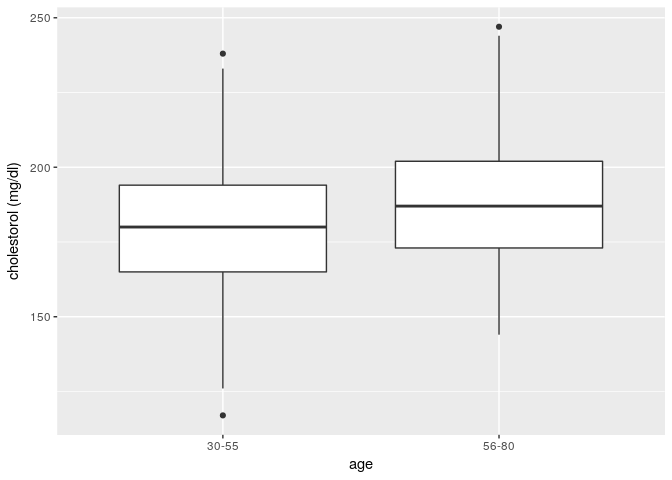
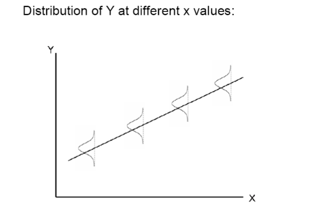
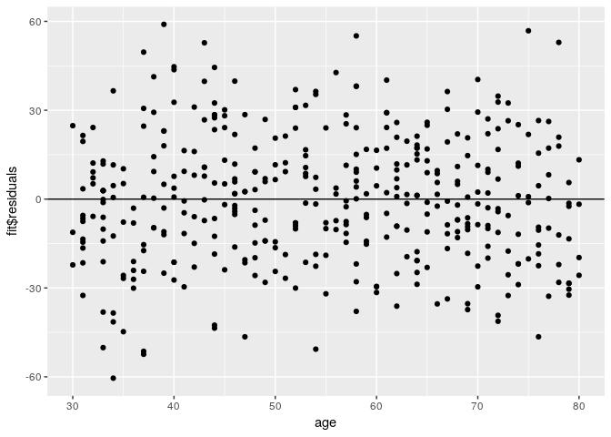
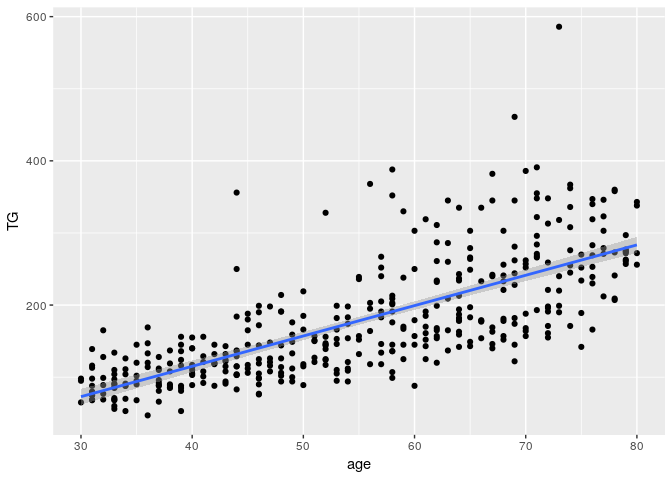
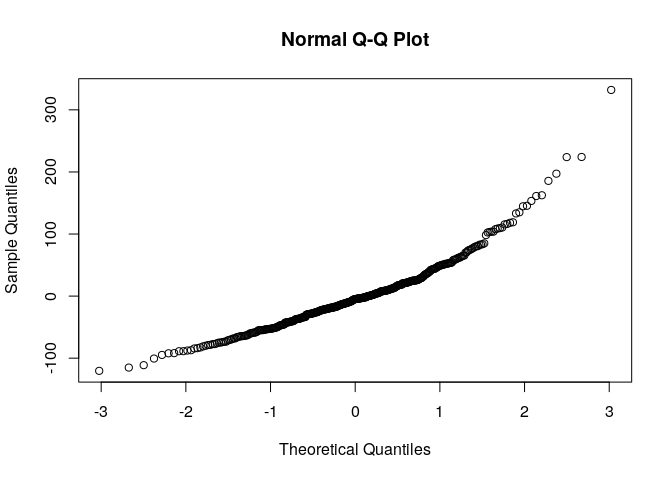
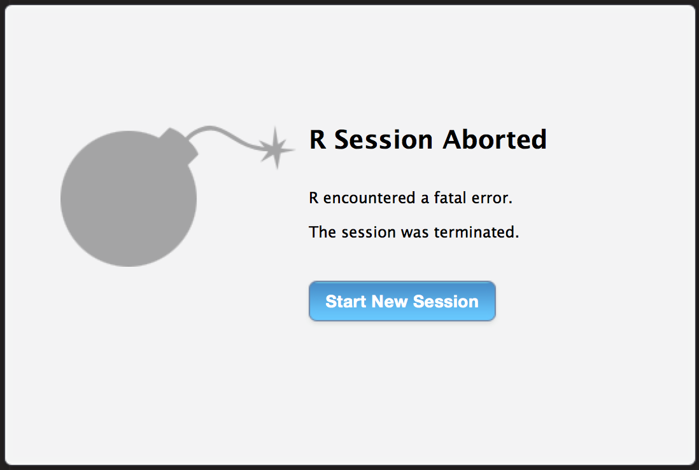

***


 

(AKA why is the solid line the best fit and not the dashed line?)

</br>

##A quick intro to the intro to R Lesson Series

</br>

This 'Intro to R Lesson Series' is brought to you by the Centre for the Analysis of Genome Evolution & Function's (CAGEF) bioinformatics training initiative. This course was developed based on feedback on the needs and interests of the Department of Cell & Systems Biology and the Department of Ecology and Evolutionary Biology. 


This lesson is the fifth in a 6-part series. The idea is that at the end of the series, you will be able to import and manipulate your data, make exploratory plots, perform some basic statistical tests, test a regression model, and make some even prettier plots and documents to share your results. 


</br>

How do we get there? Today we are going to be testing and interpreting the output of different regression models. We are also going to learn how to compare models and choose the best model that fits our data. For the last lesson, we will learn to write some functions, which really can save you time and help scale up your analyses.


</br>

The structure of the class is a code-along style. It is hands on. The lecture AND code we are going through are available on GitHub for download at https://github.com/eacton/CAGEF __(Note: repo is private until approved)__, so you can spend the time coding and not taking notes. As we go along, there will be some challenge questions and multiple choice questions on Socrative. At the end of the class if you could please fill out a post-lesson survey (https://www.surveymonkey.com/r/3RKC6MP), it will help me further develop this course and would be greatly appreciated. 

***

####Packages Used in This Lesson

The following packages are used in this lesson:

`tidyverse` (`ggplot2`, `tidyr`, `dplyr`)     
`limma`     
`gee`  
`multcomp`     
`broom`

Please install and load these packages for the lesson. In this document I will load each package separately, but I will not be reminding you to install the package. Remember: these packages may be from CRAN OR Bioconductor. 


***
####Highlighting

`grey background` - a package, function, code or command      
*italics* - an important term or concept     
**bold** - heading or a term that is being defined      
<span style="color:blue">blue text</span> - named or unnamed hyperlink     

***

###Homework

_Discussion: Taking up the Lesson 4 Challenge question_


***
__Objective:__ At the end of this session you will be able to perform simple and multiple linear regression, one- and multiway analysis of variance (ANOVA) and analysis of covariance (ANCOVA). You will be able to interpret the statistics that come out of this model, be cognizant of the assumptions the model makes, and use an F-test to select the best model for the job. 


##Answering questions with data


In order to work with our data we need to be able to answer some basic questions. 

- How do we describe our data?  
- How do we test our hypotheses (what model do we use)? 
- How do we test our assumptions about the model are using? 
- How do we compare models? 
- How do we make a prediction with new values? 

These are all really important questions that we might ignore as we try to dive in and get our answer. Today we are going to slow down a bit and think about our data and our models. 

Load the packages!


```r
library(tidyverse)
library(limma)
library(gee)
library(multcomp)
library(broom)
```


###Our Dataset

The dataset we will use for this lesson is from the Summer Institute in Statistical Genetics (SISG) at the University of Washington's course in Regression and Analysis of Variance by Lurdes Inoue. This lesson uses a lot of material from the [SISG 2016](https://www.biostat.washington.edu/suminst/archives/SISG2016/SM1604) course as well as conceptual material from [Ben Bolker](https://ms.mcmaster.ca/~bolker/). I like this dataset because it has a number of categorical and continuous variables, which allows us to use the same dataset for many models. Also, the variables are familiar (age, BMI, gender, cholesterol), which makes data interpretation easier while we are in the learning stage. 

Read the data in and take a look at the structure.


```r
cholesterol <- read.delim("data/SISG-Data-cholesterol.txt", sep = " ", header = TRUE)

str(cholesterol)
```

```
## 'data.frame':	400 obs. of  9 variables:
##  $ ID       : int  1 2 3 4 5 6 7 8 9 10 ...
##  $ sex      : int  1 1 0 0 1 1 0 0 0 0 ...
##  $ age      : int  74 51 64 34 52 39 79 38 52 58 ...
##  $ chol     : int  215 204 205 182 175 176 159 169 175 189 ...
##  $ BMI      : num  26.2 24.7 24.2 23.8 34.1 22.7 22.9 24.9 20.4 22 ...
##  $ TG       : int  367 150 213 111 328 53 274 137 125 209 ...
##  $ rs174548 : int  1 2 0 1 0 0 2 1 0 0 ...
##  $ rs4775401: int  2 1 1 1 0 2 1 1 1 1 ...
##  $ APOE     : int  4 4 4 1 1 4 1 1 4 5 ...
```
This dataset is looking at genetic variants (single nucleotide polymorphisms (SNPs)) and their relationship to cholesterol (chol) and triglycerides (TG) for 3 genes: rs174548 (FADS1 - an enzyme in fatty acid unsaturation), rs4775401 (a candidate SNP), and APOE (a major apolipoprotein important for Alzheimer's disease; variants can also affect cholestorol and triglycerides). 

Note that categorical variables have been encoded. Sex is 0 and 1 instead of 'Male' and 'Female'. rs174548 has 3 possible nucleotide combinations, "C/C", "C/G", and "G/G" which have been encoded as 0, 1, and 2. Similarly rs4775401 has 0, 1, and 2 representing SNPs. APOE has 6 variants labelled starting at 1 (1-6).


We are ultimately interested in the relationship between the above genetic variants and cholestorol, while controlling for factors such as age and sex. But let's get our feet wet by starting with the easier __question: is there an association between mean serum cholestorol and age?__

It is always, always, always, a good idea to plot your data and get an idea of what its distribution looks like. We can start with a simple scatterplot of age and cholesterol.


```r
ggplot(cholesterol, aes(age, chol)) + 
  geom_point()
```

<!-- -->


Let's add the mean cholesterol to our plot for reference. This is done by adding `geom_hline` and specifying the value for the 'yintercept'.


```r
ggplot(cholesterol, aes(age, chol)) + 
  geom_point() + 
  geom_hline(yintercept = mean(cholesterol$chol), color = "red")
```

<!-- -->

It looks like the mean might increase with age, but how do we test this?


##T-tests
    
T-tests are a simple statistical tool let us to compare the means between groups. We don't currenly have age groups, but we can make them. One way to do this is to use our `dplyr` skills to create a new column 'age_group'. The data can be split at 55 years-old (the midpoint of age in our data). 

We can use an if/else statement (the `ifelse` function) to test: is age greater than 55? If the answer is 'yes' the value is 1 and if the answer is 'no' the value is 0. We can take a quick look at our dataset to make sure this worked.


```r
cholesterol <- cholesterol %>% mutate(age_group = ifelse(test = cholesterol$age > 55, yes = 1, no = 0))
str(cholesterol)
```

```
## 'data.frame':	400 obs. of  10 variables:
##  $ ID       : int  1 2 3 4 5 6 7 8 9 10 ...
##  $ sex      : int  1 1 0 0 1 1 0 0 0 0 ...
##  $ age      : int  74 51 64 34 52 39 79 38 52 58 ...
##  $ chol     : int  215 204 205 182 175 176 159 169 175 189 ...
##  $ BMI      : num  26.2 24.7 24.2 23.8 34.1 22.7 22.9 24.9 20.4 22 ...
##  $ TG       : int  367 150 213 111 328 53 274 137 125 209 ...
##  $ rs174548 : int  1 2 0 1 0 0 2 1 0 0 ...
##  $ rs4775401: int  2 1 1 1 0 2 1 1 1 1 ...
##  $ APOE     : int  4 4 4 1 1 4 1 1 4 5 ...
##  $ age_group: num  1 0 1 0 0 0 1 0 0 1 ...
```


We can now use a boxplot to look at the distribution of cholestorol for our 2 groups. 

   
    Boxplots are a great way to visualize summary statistics for your data. As a reminder, the thick line in the center of the box is the median. The upper and lower ends of the box are the first and third quartiles (or 25th and 75th percentiles) of your data. The whiskers extend to the largest value no further than 1.5*IQR (inter-quartile range - the distance between the first and third quartiles). Data beyond these whiskers are considered outliers and plotted as individual points. This is a quick way to see how comparable your samples or variables are.
    


```r
ggplot(cholesterol, aes(factor(age_group),chol)) + geom_boxplot() +
  scale_x_discrete(labels = c("30-55", "56-80")) +
  xlab("age") +
  ylab("cholestorol (mg/dl)")
```

<!-- -->


There seems to be a lot of overlap in our cholesterol values. How do we tell if the means are truely different? 

Let's think about this a little more explicitly:

The __null hypothesis__ is that there is no difference in the sample means between our groups. 

An __alternative hypothesis__ is that there is a difference between the means (2-sided test), or that the difference in means is greater or lesser than zero (1-sided test). 


</br>

$\alpha$ is our p-value, and $\mu$ is the population mean, k is our sample mean. Remember that we are _estimating_ the true population mean using the sample that have. Our __p-value__ is the probability of finding our observed value by chance given that the null hypothesis is true.

We will use a simple student's t-test to test the alternative hypothesis that the true difference in means is not equal to 0.

The `t.test` function inputs the variables on which we are performing the test (in vector format), the type of t-test being performed, and the confidence interval. The __confidence interval__ is the interval that will cover the true parameter x% of the time. In the image above the confidence interval covers the pink area, (1-$\alpha$).

You can alternatively enter your variables in a `formula`, in this case `y ~ x`. The `~` in r language is used to separate the left and right sides of a formula. (You can run a 1-sided t-test by specifiying `alternative = 'greater'` or `alternative = 'less'`). In this case, `alternative = 'two-sided'` and `conf.level = 0.95` are the default parameters and only included for clarity. For now we are assuming that equal variance is true.


```r
t.test(x= cholesterol$age_group, y = cholesterol$chol, alternative  = "two.sided", conf.level = 0.95, var.equal = TRUE)
```

```r
#is equivalent to
t.test(formula = cholesterol$chol ~ cholesterol$age_group, var.equal = TRUE)
```

```
## 
## 	Two Sample t-test
## 
## data:  cholesterol$chol by cholesterol$age_group
## t = -3.6349, df = 398, p-value = 0.0003146
## alternative hypothesis: true difference in means is not equal to 0
## 95 percent confidence interval:
##  -12.202574  -3.636122
## sample estimates:
## mean in group 0 mean in group 1 
##        179.9751        187.8945
```


__Interpretation__

Our output tells us the mean cholesterol for those aged 30-55 is 180 mg/dl and the mean for those aged 56-80 is 188 mg/dl. The difference in means is significant at a p-value of 0.0003146. 

So we now know there is a positive relationship between cholesterol and age. However the t-test has limitations. What is the magnitude of this relationship during aging? Does it change by approximately the same amount per year? What if we don't want to break our data into groups? 


##How we Evaluate which Model to Use

Models have assumptions that, if violated, will give incorrect predictions. However, we might not know if these assumptions are true when selecting our model. Here are the assumptions of _linear models_ in general, the specific models we will be using today, and an example of each. We will trouble-shoot when asssumptions fail later in the lesson.

###Assumptions of general linear models
1. observed values are independent of each other (_independence_)
1. variation around expected values (residuals) are normally distributed (_normality_)
1. constant variance, homoscedastic (_equal variance_)
1. observed values (y) are related by linear functions of the parameters to x (_linearity_)


For __simple linear regression__ we are modelling a continuous outcome by a single continuous variable. Example: modelling cholesterol using BMI.

For __multiple linear regression__ we are modelling a continuous outcome by more than one continuous variable. Example: modelling cholestorol using BMI AND age. In this case, we must consider whether there is an _interaction_ between age and BMI on cholesterol (more on interactions to follow). 

For __one-way ANOVA__ we are modelling a continuous outcome by a single categorical variable. Example: modelling cholesterol by sex. It is important that categorical variables are explicitly input as factors to be interpreted properly in the model. For example, since we have encoded sex as 0 and 1 (instead of 'M' and 'F'), we need to specify that sex is to be treated as a categorical variable and not a number. Therefore we specify sex as a factor of 2 levels, 0 and 1.

For __multi-way ANOVA__ we are modelling a continous outcome by more than one categorical variable. Example: modelling sex and APOE genetic variants. Again, we need to consider any interaction between our categorical variables, and we need to specify our numeric values to be treated as categorical variables and not numbers. APOE will be a factor of 6 levels, one for each genetic variant.

Lastly, for __ANCOVA__ we are modelling a continuous variable by a combination of categorical AND continuous variables. This could be modelling cholesterol using the genetic variants of APOE and BMI. Again, our categorical variable must be input as a factor. ANCOVA allows for each group (each genetic variant of APOE in this example) to have a separate slope.


This is a summary table you might find helpful for choosing a model based on the data types you have and the asssumptions you are making. I hope to show that model selection is akin to going through mental checklist for your data, and not that scary.

<table class="table table-striped table-hover" style="width: auto !important; ">
 <thead>
  <tr>
   <th style="text-align:left;"> model </th>
   <th style="text-align:left;"> categorical </th>
   <th style="text-align:left;"> continuous </th>
   <th style="text-align:left;"> linearity </th>
   <th style="text-align:left;"> normality </th>
   <th style="text-align:left;"> independence </th>
  </tr>
 </thead>
<tbody>
  <tr>
   <td style="text-align:left;"> simple linear regression </td>
   <td style="text-align:left;"> X </td>
   <td style="text-align:left;"> $\checkmark$ </td>
   <td style="text-align:left;"> $\checkmark$ </td>
   <td style="text-align:left;"> $\checkmark$ </td>
   <td style="text-align:left;"> $\checkmark$ </td>
  </tr>
  <tr>
   <td style="text-align:left;"> multiple linear regression </td>
   <td style="text-align:left;"> X </td>
   <td style="text-align:left;"> $\checkmark$ $\checkmark$ </td>
   <td style="text-align:left;"> $\checkmark$ </td>
   <td style="text-align:left;"> $\checkmark$ </td>
   <td style="text-align:left;"> $\checkmark$ </td>
  </tr>
  <tr>
   <td style="text-align:left;"> one-way analysis of variance (ANOVA) </td>
   <td style="text-align:left;"> $\checkmark$ </td>
   <td style="text-align:left;"> X </td>
   <td style="text-align:left;"> $\checkmark$ </td>
   <td style="text-align:left;"> $\checkmark$ </td>
   <td style="text-align:left;"> $\checkmark$ </td>
  </tr>
  <tr>
   <td style="text-align:left;"> multi-way analysis of variance (ANOVA) </td>
   <td style="text-align:left;"> $\checkmark$ $\checkmark$ </td>
   <td style="text-align:left;"> X </td>
   <td style="text-align:left;"> $\checkmark$ </td>
   <td style="text-align:left;"> $\checkmark$ </td>
   <td style="text-align:left;"> $\checkmark$ </td>
  </tr>
  <tr>
   <td style="text-align:left;"> analysis of covariance (ANCOVA) </td>
   <td style="text-align:left;"> $\checkmark$ </td>
   <td style="text-align:left;"> $\checkmark$ </td>
   <td style="text-align:left;"> $\checkmark$ </td>
   <td style="text-align:left;"> $\checkmark$ </td>
   <td style="text-align:left;"> $\checkmark$ </td>
  </tr>
  <tr>
   <td style="text-align:left;"> nonlinear least squares </td>
   <td style="text-align:left;"> X </td>
   <td style="text-align:left;"> $\checkmark$ </td>
   <td style="text-align:left;"> X </td>
   <td style="text-align:left;"> $\checkmark$ </td>
   <td style="text-align:left;"> $\checkmark$ </td>
  </tr>
  <tr>
   <td style="text-align:left;"> nonlinear analysis of covariance (ANCOVA) </td>
   <td style="text-align:left;"> $\checkmark$ </td>
   <td style="text-align:left;"> $\checkmark$ </td>
   <td style="text-align:left;"> X </td>
   <td style="text-align:left;"> $\checkmark$ </td>
   <td style="text-align:left;"> $\checkmark$ </td>
  </tr>
  <tr>
   <td style="text-align:left;"> generalized linear models </td>
   <td style="text-align:left;"> $\checkmark$ </td>
   <td style="text-align:left;"> $\checkmark$ </td>
   <td style="text-align:left;"> X </td>
   <td style="text-align:left;"> X </td>
   <td style="text-align:left;"> $\checkmark$ </td>
  </tr>
</tbody>
</table>


</br>

Now, we will pick a model for the question we had answered with our t-test while considering the assumptions above.

__What is the relationship between cholestorol and age?__

If we evaluate our variables, they are both continuous, not categorical (ie. sex or APOE). We have a single continuous variable with which to make our prediction about our dependent variable. From the plot we made earlier (repeated here) it looks like if there is a relationship between age and cholestorol it would be linear, and points looked like they had equal-ish variance around the mean.    


```r
ggplot(cholesterol, aes(age, chol)) + 
  geom_point()
```

<!-- -->

Are values the residuals of y normally distributed?



I'm not really sure if the residuals are normally distributed or not. The values are independent (from separate unrelated subjects). So we will try using a simple linear regression to test the association of mean serum cholesterol with age.


##Simple linear regression

What I am looking for then, is the slope of the line relating cholesterol to age, which will tell me the magnitude and direction of the relationship between these variables. We can look at the slope for linear model that `ggplot` would fit for us.


```r
ggplot(cholesterol, aes(age, chol)) + geom_point() + stat_smooth(method = "lm")
```

<!-- -->

Just to make sure everyone is comfortable, we will briefly review the equation for a straight line.

_Expression:_ 

\begin{equation*}
Y \verb|~| Normal(a + bx, {\sigma^2})
\end{equation*}


\begin{equation*}
y = a + bx + \epsilon, \epsilon \verb|~| N\{0, \sigma^2\}
\end{equation*}


y is our dependent variable that we are attempting to model and x is our independent variable. Here a is the intercept, which is the value of x where y = 0 (where x crosses the y-axis), and b is the slope of the line, which is the change in y corresponding to a unit increase in x. A flat line would mean that there is no association between x and y. The above example has a positive association with a positive slope, meaning that y increases as values of x increase. With a negative association and negative slope, y decreases as values of x decrease. The interpretation in our example is that the slope is the difference in mean serum cholesterol associated with a one year increase in age.

With a straight line we are not, of course, plotting through all of our points, but rather the mean of an outcome in y as a function of x. For example, there are values of cholestorol for about six 50 year-olds, and our line will fall somewhere close to the mean of these values. Likewise, there is a distribution for values of y at a given x, and the assumption is that this distribution is normally distributed.


In this equation we also have some normally distributed variance - sampling error exists in our estimates, because different estimates give different means. 


Okay, but how do we actually find the best fitting line? We are using _least squares estimation_; we are minimizing the sum of squares of the vertical distances from the observed points to the least squares regression line.


 
 
 
Let's actually run this simple linear regression.

When we use code for this in R, the intercept and slope terms are implicit.

_R code:_ 

lm(y ~ x)


To force the intercept to zero: Y~ Normal(bx, sigma^2)

_R code:_ 

lm(y ~ x-1)

Our dependent variable (cholesterol) is a function (~) of our independent variable (age), which is entered as a formula, along with the dataset. 

```r
lm(chol~age, data = cholesterol)
```

```
## 
## Call:
## lm(formula = chol ~ age, data = cholesterol)
## 
## Coefficients:
## (Intercept)          age  
##    166.9017       0.3103
```

The model will output our formula, and our slope and intercept. However, if we save the model into an object, 'fit', we get a list object of the model, its input, and all associated statistics. We can look at a summary and get our residuals, errors, p-values and more in addition to our coefficients.


```r
fit <- lm(chol~age, data = cholesterol)

summary(fit)
```

```
## 
## Call:
## lm(formula = chol ~ age, data = cholesterol)
## 
## Residuals:
##     Min      1Q  Median      3Q     Max 
## -60.453 -14.643  -0.022  14.659  58.995 
## 
## Coefficients:
##              Estimate Std. Error t value Pr(>|t|)    
## (Intercept) 166.90168    4.26488  39.134  < 2e-16 ***
## age           0.31033    0.07524   4.125 4.52e-05 ***
## ---
## Signif. codes:  0 '***' 0.001 '**' 0.01 '*' 0.05 '.' 0.1 ' ' 1
## 
## Residual standard error: 21.69 on 398 degrees of freedom
## Multiple R-squared:  0.04099,	Adjusted R-squared:  0.03858 
## F-statistic: 17.01 on 1 and 398 DF,  p-value: 4.522e-05
```


__Interpretation__ 

<div style="float:left;margin:0 10px 10px 0" markdown="1">
{width=150px}

</div>

Let's look for the intercept and slope here. The Intercept is 166.9 and the slope is 0.31. What does that actually mean? It means a baby (age 0) would be expected to have 167 mg/dl average serum cholesterol. For every yearly increase in age, mean serum cholesterol is expected to increase by 0.31 mg/dl. These results are significant with a p-value < 0.001. We can say that the mean serum cholesterol is significantly higher in older individuals.

_Confidence intervals_ will cover the true parameter x% of the time.


```r
confint(fit)
```

```
##                   2.5 %      97.5 %
## (Intercept) 158.5171656 175.2861949
## age           0.1624211   0.4582481
```

We are 95% confident that the difference in mean cholesterol associated with a one year increase in age is between 0.16 and 0.46 mg/dl.


Predicting values assumes that your model is true. This might be fair within the range of your data. This is to be interpreted with caution outside the range of your data.


</br>


If you want to predict the mean at a particular point, for example, at age 47. 

```r
predict.lm(fit, newdata = data.frame(age=47), interval = "confidence")
```

```
##        fit      lwr      upr
## 1 181.4874 179.0619 183.9129
```


If you want to predict where a new observation at age 47 might be.


```r
predict.lm(fit, newdata = data.frame(age=47), interval = "prediction")
```

```
##        fit      lwr      upr
## 1 181.4874 138.7833 224.1915
```

Notice the difference in the upper and lower boundaries in these predictions. The first is the prediction for the mean serum cholestorol for individuals age 47 and the second is for a single new individual of age 47. The second prediction has to account for random variability around the mean, rather than just the precision of the estimate of the mean.


R^2 - correlation coefficient squared - ours (multiple R-squared) is 0.04. What does this tell us? 4% of the variability in cholestorol is explained by age.

Degrees of Freedom
Decomposition of sum of squares
mean squares = SS/df
F-Statistic = MSR/MSE

in simple linear regression F-stat = (t-stat for slope)^2 for the hypothesis that the slope is not zero (ie. 2-sided)


##Multiple linear regression

Multiple continuous variables are included to predict the outcome. Our question can now be: is there a statistically significant relationship between mean serum cholestorl and BMI after adjusting for other predictors (ie. age) in the model?

***

###Adding covariates that are powers of a variable (polynomial regression)

When we talk about 'linear' what we are interested in is the linear function of the _parameters_ and not the independent variables. In the example below, the parameters a, b1, and b2 are linear even though we have the independent variable has a quadratic component, x^2. 

_Expression:_ 

\begin{equation*}
Y \verb|~| Normal(a + b_1x + b_2x^2, {\sigma^2})
\end{equation*}

If we were to write this in R, again our intercept and coefficients are implicit. To write the quadratic term we us the function `I` which just means 'asis'. 

_R code:_ 

lm(y ~ x + I(x^2))

The following equation is non-linear with respect to the parameter b, and is not a model for linear regression.

\begin{equation*}
Y \verb|~|  Normal(ax^b, {\sigma^2}) 
\end{equation*}

***

###Adding extra variables to our model

How we are interested in multiple linear regression is to improve our model by adding extra variable we think might have an effect on our outcome values. In the example below, we are adding the independent variables x~1~, x~2~, x~3~, and each of these terms has their own linear parameter b~1~, b~2~, b~3~.

_Expression:_ 

\begin{equation*}
Y \verb|~| Normal(a + b_1x + b_2x_2 + b_3x_3, {\sigma^2})
\end{equation*}


b2 is the expected mean change in unit per change in x~2~ if x~1~ is held constant (controlling for x~1~). The null hypothesis is that all b~1~, b~2~, b~3~ = 0. The alternative hypothesis is that at least one of these parameters is not null. 

Again intercept and coefficients are implicit in the the `lm` function.

_R code:_ 

lm(y ~ x~1~ +x~2~ + x~3~)

We know that age has an effect on cholesterol. With our new model we want to test whether BMI has an association with cholestorol when controlling for age. Let's look graphically at these relationships to help us understand our model. First let's plot BMI vs cholestorol. We can add a linear fit to make sure we are expecting a positive slope.


```r
ggplot(cholesterol, aes(BMI, chol)) + geom_point() + stat_smooth(method = "lm")
```

<!-- -->

We should also take a look at the relationship between BMI and age.


```r
ggplot(cholesterol, aes(age, BMI)) + geom_point() + stat_smooth(method = "lm")
```

<!-- -->

Cholesterol increases with BMI. BMI increases with age. We will look at the association of age while holding BMI constant just so our model output is in the same order as previously. Switching the variables here will not change our slope or intercept.


```r
mfit <- lm(chol ~ age + BMI, data = cholesterol)

summary(mfit)
```

```
## 
## Call:
## lm(formula = chol ~ age + BMI, data = cholesterol)
## 
## Residuals:
##     Min      1Q  Median      3Q     Max 
## -58.994 -15.793   0.571  14.159  62.992 
## 
## Coefficients:
##             Estimate Std. Error t value Pr(>|t|)    
## (Intercept) 137.1612     9.0061  15.230  < 2e-16 ***
## age           0.2023     0.0795   2.544 0.011327 *  
## BMI           1.4266     0.3822   3.732 0.000217 ***
## ---
## Signif. codes:  0 '***' 0.001 '**' 0.01 '*' 0.05 '.' 0.1 ' ' 1
## 
## Residual standard error: 21.34 on 397 degrees of freedom
## Multiple R-squared:  0.07351,	Adjusted R-squared:  0.06884 
## F-statistic: 15.75 on 2 and 397 DF,  p-value: 2.62e-07
```

__Interpretation__

<div style="float:left;margin:0 10px 10px 0" markdown="1">
{width=150px}

</div>

So our equation would now look like y = 137 + 0.2age + 1.43BMI. Interpreting the 0.2 slope would be the estimated increase in mean serum cholestorol over after one year holding BMI constant (for 2 subjects with the same BMI). This is less than our previous value of 0.31. Why do the estimates differ?

Before, we were not controlling for BMI. Our estimates of the age association for the mean increase in cholestorol is now for subjects with the same BMI and not for subjects with all BMIs.

Here it looks like both age and BMI are significant. But we might want to verify - did adding BMI actually make our model better?

We can compare these models with the `anova` function. With _2 lm objects_, this function _tests the models_ against one another and prints these results in an analysis of variance table. (Given _1 lm object_, it will test whether model _terms_ are significant - we will be using the function in this format later.)


```r
anova(fit, mfit)
```

```
## Analysis of Variance Table
## 
## Model 1: chol ~ age
## Model 2: chol ~ age + BMI
##   Res.Df    RSS Df Sum of Sq      F    Pr(>F)    
## 1    398 187187                                  
## 2    397 180842  1    6345.8 13.931 0.0002174 ***
## ---
## Signif. codes:  0 '***' 0.001 '**' 0.01 '*' 0.05 '.' 0.1 ' ' 1
```

Our second model is a signifcant improvement.


###Interaction terms 

What is meant by an interaction? There is an __interaction__ if The slope with respect to one covariate changes linearly as a function of another covariate.

As we can see in the expression, the difference in means between x~1~ and x~2~ changes additionally by b~3~ for each unit difference in x~2~. b~3~ is the difference of differences. The slope of x~1~ changes with x~2~, because b~3~ is changing.


_Expression:_ 

\begin{equation*}
Y  \verb|~|  Normal(a + b_1x_1 + b_2x_2 + b_3x_1x_2, {\sigma^2})   
\end{equation*}


In this example of people who care if sea level rises 20 feet, it is apparent that there is an interaction between education and ideology. We can see, for example, that the slope for 'extremely liberal' changes with each education level. If there was no interaction with ideology, these lines would be parallel.  

{width=600px}

</br>

The association between the response and the predictor changes across the range of the new variable. This is different than a _confounding factor_, which is associated with the predictor and response, however the association between the response and predictor is constant across the range of the new variable.


When testing for an interaction between 2 input variables, the `lm` input uses an asterik '*' instead of a plus sign.

_R code:_ 


lm(y ~ x~1~*x~2~)


***
__Challenge__ 


<div style="float:left;margin:0 10px 10px 0" markdown="1">
{width=150px}

</div>

Test if there is an interaction between age and BMI in a model predicting cholesterol. Is the interaction significant? Is there a difference between this model and the model with age as the only variable? What about the BMI and age model without interaction?


</br>
</br>
</br>

***


##One-way analysis of variance (ANOVA)

In the analysis of variance (ANOVA) independent variables are categorical (factors) rather than continuous.

Does the genetic factor rs174548 have an effect on cholesterol levels?

_Expression:_ 

\begin{equation*}
Y \verb|~| Normal({\alpha_i}, {\sigma^2}) 
\end{equation*}

We still use the `lm` function, however we replace our continuous variable with f, a categorical variable (factor). If your data is character type, R will automatically make factors for you. However if your data is numeric, R will interpret it as continuous. In this case, you need to make your numeric data a factor first using `factor`.

_R code:_ 

lm(y ~ f)


R parameterizes the model in terms of the differences between the first group and subsequent groups rather than in terms of the mean of each group. This is similar to the interpretation of the previous linear models. (You can tell it to fit the means of each group using: lm(y ~ f-1)).


We can first plot the relationship between rs174548 and cholestorol. 


```r
ggplot(cholesterol, aes(as.factor(rs174548), chol)) + geom_boxplot()
```

<!-- -->
Our genetic factor has 3 groups, and we will be comparing the means for each of these groups. These groups have high variance, and there is a good deal of overlap between them.

To assess wherther the means are equal, the model compares:

- variation between the sample means (MSR)
- natural variation of the observations within the sample (MSE)

The larger the MSR compared to the MSE the more support there is for a difference between the population means.
The ratio of MSR/MSE is the F-statistic.

###Dummy Variables

We can encode our categorical variable as a _dummy variable_. 0 really means C/C, 1 is C/G and 2 is G/G. But instead we can create k-1 separate columns of 0's and 1's. The omitted category is the reference group. Otherwise 0 means it is not that SNP and 1 means it is that SNP. Each genetic factor has a unique encoding.

<table class="table" style="width: auto !important; margin-left: auto; margin-right: auto;">
 <thead>
  <tr>
   <th style="text-align:left;"> rs174548 </th>
   <th style="text-align:right;"> x_1 </th>
   <th style="text-align:right;"> x_2 </th>
  </tr>
 </thead>
<tbody>
  <tr>
   <td style="text-align:left;"> C/C </td>
   <td style="text-align:right;"> 0 </td>
   <td style="text-align:right;"> 0 </td>
  </tr>
  <tr>
   <td style="text-align:left;"> C/G </td>
   <td style="text-align:right;"> 1 </td>
   <td style="text-align:right;"> 0 </td>
  </tr>
  <tr>
   <td style="text-align:left;"> G/G </td>
   <td style="text-align:right;"> 0 </td>
   <td style="text-align:right;"> 1 </td>
  </tr>
</tbody>
</table>

__Interpretation__

<div style="float:left;margin:0 10px 10px 0" markdown="1">
{width=150px}

</div>

This makes the interpretation of the model a bit trickier.     

- $\beta_0$ - mean cholesterol when rs174548 is C/C
- $\beta_0$ + $\beta_1$ - mean cholestor when rs174548 is C/G
- $\beta_0$ +  $\beta_2$ - mean cholestorol when rs174548 is G/G

Alternatively

- b1 is the differnce in mean cholestorl levels between groups with rs174548 equal to C/G and C/C
- b2 is the difference in mean cholesterol levels between groups with rs174548 equal to G/G and C/C

So you can really just think of each of these groups having their own means. ie.u2 = beta0 + beta1. We are testing the hypothesis whether these means are equal or not.

R will create dummy variables in the background if you state you have a categorical variable.


```r
anfit1 <- lm(chol ~ as.factor(rs174548), data = cholesterol)

summary(anfit1)
```

```
## 
## Call:
## lm(formula = chol ~ as.factor(rs174548), data = cholesterol)
## 
## Residuals:
##     Min      1Q  Median      3Q     Max 
## -64.062 -15.913  -0.062  14.938  59.136 
## 
## Coefficients:
##                      Estimate Std. Error t value Pr(>|t|)    
## (Intercept)           181.062      1.455 124.411  < 2e-16 ***
## as.factor(rs174548)1    6.802      2.321   2.930  0.00358 ** 
## as.factor(rs174548)2    5.438      4.540   1.198  0.23167    
## ---
## Signif. codes:  0 '***' 0.001 '**' 0.01 '*' 0.05 '.' 0.1 ' ' 1
## 
## Residual standard error: 21.93 on 397 degrees of freedom
## Multiple R-squared:  0.0221,	Adjusted R-squared:  0.01718 
## F-statistic: 4.487 on 2 and 397 DF,  p-value: 0.01184
```


```r
anova(anfit1)
```

```
## Analysis of Variance Table
## 
## Response: chol
##                      Df Sum Sq Mean Sq F value  Pr(>F)  
## as.factor(rs174548)   2   4314 2157.10  4.4865 0.01184 *
## Residuals           397 190875  480.79                  
## ---
## Signif. codes:  0 '***' 0.001 '**' 0.01 '*' 0.05 '.' 0.1 ' ' 1
```
This tells us that there is a difference in means ie. rejects the null hypothesis that all means are the same, but doesn't tell us which means are different.

In order to look at this we need to look at multiple comparisons.  
$\mu_0$ = $\mu_1$, $\mu_0$ = $\mu_2$, $\mu_1$ = $\mu_2$ (pairwise)

###Multiple test correction

Multiple comparisons at the 5% levels makes the family-wise error rate - the probability of making a false rejection, increases. This is where corrections can come in such as the Bonferroni ($\alpha$/k or multiply pvalues by k). Simple and conservative.


```r
tfit <- lm(chol ~ -1 + as.factor(rs174548), data = cholesterol)

#generate a contrast matrix for multiple comparisons
M = contrMat(table(cholesterol$rs174548), type = "Tukey")
M
```

```
## 
## 	 Multiple Comparisons of Means: Tukey Contrasts
## 
##        0  1 2
## 1 - 0 -1  1 0
## 2 - 0 -1  0 1
## 2 - 1  0 -1 1
```

```r
#get estimates for multiple comparisons, 'general linear hypothesis testing'
mc = glht(tfit, linfct = M)

#adjust pvalues for mulitple comparisons
summary(mc, test = adjusted("none"))
```

```
## 
## 	 Simultaneous Tests for General Linear Hypotheses
## 
## Multiple Comparisons of Means: Tukey Contrasts
## 
## 
## Fit: lm(formula = chol ~ -1 + as.factor(rs174548), data = cholesterol)
## 
## Linear Hypotheses:
##            Estimate Std. Error t value Pr(>|t|)   
## 1 - 0 == 0    6.802      2.321   2.930  0.00358 **
## 2 - 0 == 0    5.438      4.540   1.198  0.23167   
## 2 - 1 == 0   -1.364      4.665  -0.292  0.77015   
## ---
## Signif. codes:  0 '***' 0.001 '**' 0.01 '*' 0.05 '.' 0.1 ' ' 1
## (Adjusted p values reported -- none method)
```

```r
summary(mc, test = adjusted("bonferroni"))
```

```
## 
## 	 Simultaneous Tests for General Linear Hypotheses
## 
## Multiple Comparisons of Means: Tukey Contrasts
## 
## 
## Fit: lm(formula = chol ~ -1 + as.factor(rs174548), data = cholesterol)
## 
## Linear Hypotheses:
##            Estimate Std. Error t value Pr(>|t|)  
## 1 - 0 == 0    6.802      2.321   2.930   0.0107 *
## 2 - 0 == 0    5.438      4.540   1.198   0.6950  
## 2 - 1 == 0   -1.364      4.665  -0.292   1.0000  
## ---
## Signif. codes:  0 '***' 0.001 '**' 0.01 '*' 0.05 '.' 0.1 ' ' 1
## (Adjusted p values reported -- bonferroni method)
```

```r
#other types
summary(mc, test = adjusted("BH"))
```

```
## 
## 	 Simultaneous Tests for General Linear Hypotheses
## 
## Multiple Comparisons of Means: Tukey Contrasts
## 
## 
## Fit: lm(formula = chol ~ -1 + as.factor(rs174548), data = cholesterol)
## 
## Linear Hypotheses:
##            Estimate Std. Error t value Pr(>|t|)  
## 1 - 0 == 0    6.802      2.321   2.930   0.0107 *
## 2 - 0 == 0    5.438      4.540   1.198   0.3475  
## 2 - 1 == 0   -1.364      4.665  -0.292   0.7702  
## ---
## Signif. codes:  0 '***' 0.001 '**' 0.01 '*' 0.05 '.' 0.1 ' ' 1
## (Adjusted p values reported -- BH method)
```

```r
summary(mc, test = adjusted("fdr"))
```

```
## 
## 	 Simultaneous Tests for General Linear Hypotheses
## 
## Multiple Comparisons of Means: Tukey Contrasts
## 
## 
## Fit: lm(formula = chol ~ -1 + as.factor(rs174548), data = cholesterol)
## 
## Linear Hypotheses:
##            Estimate Std. Error t value Pr(>|t|)  
## 1 - 0 == 0    6.802      2.321   2.930   0.0107 *
## 2 - 0 == 0    5.438      4.540   1.198   0.3475  
## 2 - 1 == 0   -1.364      4.665  -0.292   0.7702  
## ---
## Signif. codes:  0 '***' 0.001 '**' 0.01 '*' 0.05 '.' 0.1 ' ' 1
## (Adjusted p values reported -- fdr method)
```
It is possible we would want to do a nonpairwise comparison (test the mean for C/C against the grouped genotypes C/G and G/G.
... this may be beyond the scope of this lesson.


##Multi-way analysis of variance (ANOVA)

Two or more discrete/categorical variables (factors) are used to model our outcome.

Does the effect of the genetic factor rs174548 differ between males and females?
We need to test whether there is an effect of our factors and also if there is an interaction between them.

$\alpha$, $\beta$ and $\gamma$ are our categorical variables. _i_ is the level of the first group, and _j_ is the level of the second group.

_Expression:_ 

\begin{equation*}
Y \verb|~| Normal({\alpha_i} + {\beta_j} + {\gamma_{ij}}, {\sigma^2}) 
\end{equation*}

Our R code models our two categorical variables as factors.

_R code:_ 

lm(y~ f~1~ + f~2~), testing for main effects without interaction
lm(y~ f~1~*f~2~), testing for the main effects with interaction


The following diagram will help us visualize the differences in coefficients with and without interaction between 2 categorical variables.


In this first scenario, the difference in the means between groups defined by factor B does not depend on the level of factor A and vice versa. This means that there is no interaction, and the lines between the factor groups are parallel. In the second scenario the difference in the means between groups defined by factor B changes when A~2~ is present. There is an interaction and the lines are not parallel.


We can first run a two-way model without testing the interaction.


```r
twofit <-lm(chol ~ as.factor(sex) + as.factor(rs174548), data = cholesterol) 

summary(twofit)
```

```
## 
## Call:
## lm(formula = chol ~ as.factor(sex) + as.factor(rs174548), data = cholesterol)
## 
## Residuals:
##     Min      1Q  Median      3Q     Max 
## -66.653 -14.463  -0.601  15.445  57.635 
## 
## Coefficients:
##                      Estimate Std. Error t value Pr(>|t|)    
## (Intercept)           175.365      1.786  98.208  < 2e-16 ***
## as.factor(sex)1        11.053      2.126   5.199 3.22e-07 ***
## as.factor(rs174548)1    7.236      2.250   3.215  0.00141 ** 
## as.factor(rs174548)2    5.184      4.398   1.179  0.23928    
## ---
## Signif. codes:  0 '***' 0.001 '**' 0.01 '*' 0.05 '.' 0.1 ' ' 1
## 
## Residual standard error: 21.24 on 396 degrees of freedom
## Multiple R-squared:  0.08458,	Adjusted R-squared:  0.07764 
## F-statistic:  12.2 on 3 and 396 DF,  p-value: 1.196e-07
```
__Interpretation__

<div style="float:left;margin:0 10px 10px 0" markdown="1">
{width=150px}

</div>

- estimated mean cholesterol for males in C/C group is the intercept (175.36)
- estimated diff in mean cholesterol between females and males controlled for genotype (11.05)
- estimated diff in mean betweeen C/G and C/C groups controlled for gender (7.24)
- estimated diff in mean betweeen G/G and C/C groups controlled for gender (5.18)

There is evidence cholestorol is associated with gender (p<0.001).


How does this compare to the model with just gender?


```r
genfit <- lm(chol ~ as.factor(sex), data = cholesterol)
```

Worth it!

```r
anova(genfit, twofit)
```

```
## Analysis of Variance Table
## 
## Model 1: chol ~ as.factor(sex)
## Model 2: chol ~ as.factor(sex) + as.factor(rs174548)
##   Res.Df    RSS Df Sum of Sq     F   Pr(>F)   
## 1    398 183480                               
## 2    396 178681  2    4799.1 5.318 0.005259 **
## ---
## Signif. codes:  0 '***' 0.001 '**' 0.01 '*' 0.05 '.' 0.1 ' ' 1
```
There is evidence cholesterol is associated with genotype(p=0.005).


We can now check the two-way anova with the interaction.


```r
intfit2 <- lm(chol ~ as.factor(sex) * as.factor(rs174548), data = cholesterol)

summary(intfit2)
```

```
## 
## Call:
## lm(formula = chol ~ as.factor(sex) * as.factor(rs174548), data = cholesterol)
## 
## Residuals:
##     Min      1Q  Median      3Q     Max 
## -70.529 -13.604  -0.974  14.171  54.882 
## 
## Coefficients:
##                                      Estimate Std. Error t value Pr(>|t|)
## (Intercept)                          178.1182     2.0089  88.666  < 2e-16
## as.factor(sex)1                        5.7109     2.7982   2.041  0.04192
## as.factor(rs174548)1                   0.9597     3.1306   0.307  0.75933
## as.factor(rs174548)2                  -0.2015     6.4053  -0.031  0.97492
## as.factor(sex)1:as.factor(rs174548)1  12.7398     4.4650   2.853  0.00456
## as.factor(sex)1:as.factor(rs174548)2  10.2296     8.7482   1.169  0.24297
##                                         
## (Intercept)                          ***
## as.factor(sex)1                      *  
## as.factor(rs174548)1                    
## as.factor(rs174548)2                    
## as.factor(sex)1:as.factor(rs174548)1 ** 
## as.factor(sex)1:as.factor(rs174548)2    
## ---
## Signif. codes:  0 '***' 0.001 '**' 0.01 '*' 0.05 '.' 0.1 ' ' 1
## 
## Residual standard error: 21.07 on 394 degrees of freedom
## Multiple R-squared:  0.1039,	Adjusted R-squared:  0.09257 
## F-statistic:  9.14 on 5 and 394 DF,  p-value: 3.062e-08
```
__Interpretation__

<div style="float:left;margin:0 10px 10px 0" markdown="1">
{width=150px}

</div>

- the estimated mean cholesterol for males in the C/C group is 178.
- the estimated mean cholesterol for females in the C/C group is 178 + 5.7. 
- the estimated mean cholesterol for men in the C/G group 178 + 0.95.
- the estimated mean cholesterol for females in the C/G group is 178 + 5.7 + 0.95 + 12.7.


Let's compare the without interaction and with interaction model.


```r
anova(twofit,intfit2)
```

```
## Analysis of Variance Table
## 
## Model 1: chol ~ as.factor(sex) + as.factor(rs174548)
## Model 2: chol ~ as.factor(sex) * as.factor(rs174548)
##   Res.Df    RSS Df Sum of Sq      F  Pr(>F)  
## 1    396 178681                              
## 2    394 174902  2    3778.9 4.2564 0.01483 *
## ---
## Signif. codes:  0 '***' 0.001 '**' 0.01 '*' 0.05 '.' 0.1 ' ' 1
```

There is evidence for an interaction between genotype and sex (p = 0.015).


##Analysis of covariance (ANCOVA)

The analysis of covariance (ANCOVA) model allows for different intercepts and slopes with repect to a continuous variable in different categorical groups. ANCOVA, therefore, has a linear regression component.

Now we can ask if there the relationship between age and cholesterol is affected by gender?

_Expression:_ 

\begin{equation*}
Y \verb|~| Normal({\alpha_i} + {\beta_{ix}}, {\sigma^2}) 
\end{equation*}


R code:     

lm(y~f + x), for parallel slopes (no interaction)     
lm(y~f*x), for non-parallel slopes (interaction)     
lm(y~f) for zero slopes but different intercepts     
lm(y~x) a single slope     

Parameters are the intercept of the first factor level, the slope with respect to x for the first factor level, the differences in the intercepts for each factor level other than the first, and the differences in slopes for each factor level other than the first.

Now we are going to throw in a categorical variable and ask if the relationship between age and cholestorol is affected by gender.


```r
mfit2 <- lm(chol ~ age + sex, data = cholesterol)

summary(mfit2)
```

```
## 
## Call:
## lm(formula = chol ~ age + sex, data = cholesterol)
## 
## Residuals:
##     Min      1Q  Median      3Q     Max 
## -55.662 -14.482  -1.411  14.682  57.876 
## 
## Coefficients:
##              Estimate Std. Error t value Pr(>|t|)    
## (Intercept) 162.35445    4.24184  38.275  < 2e-16 ***
## age           0.29697    0.07313   4.061 5.89e-05 ***
## sex          10.50728    2.10794   4.985 9.29e-07 ***
## ---
## Signif. codes:  0 '***' 0.001 '**' 0.01 '*' 0.05 '.' 0.1 ' ' 1
## 
## Residual standard error: 21.06 on 397 degrees of freedom
## Multiple R-squared:  0.09748,	Adjusted R-squared:  0.09293 
## F-statistic: 21.44 on 2 and 397 DF,  p-value: 1.44e-09
```

__Interpretation__

<div style="float:left;margin:0 10px 10px 0" markdown="1">
{width=150px}

</div>

Okay, so our model would look like 162 + 0.3age + 10.5sex. Controlling for sex, mean average cholestorol increases by 0.3 for an additional year of age. This is close to the slope for our model of just cholesterol, 0.31. This does not necessarily mean that the age/cholesterol relationship is the same in males and females. We need to look at the interaction term.


```r
intfit <- lm(chol ~ age * sex, data = cholesterol)

summary(intfit)
```

```
## 
## Call:
## lm(formula = chol ~ age * sex, data = cholesterol)
## 
## Residuals:
##     Min      1Q  Median      3Q     Max 
## -56.474 -14.377  -1.215  14.764  58.301 
## 
## Coefficients:
##              Estimate Std. Error t value Pr(>|t|)    
## (Intercept) 160.31151    5.86268  27.344  < 2e-16 ***
## age           0.33460    0.10442   3.204  0.00146 ** 
## sex          14.56271    8.29802   1.755  0.08004 .  
## age:sex      -0.07399    0.14642  -0.505  0.61361    
## ---
## Signif. codes:  0 '***' 0.001 '**' 0.01 '*' 0.05 '.' 0.1 ' ' 1
## 
## Residual standard error: 21.08 on 396 degrees of freedom
## Multiple R-squared:  0.09806,	Adjusted R-squared:  0.09123 
## F-statistic: 14.35 on 3 and 396 DF,  p-value: 6.795e-09
```

__Interpretation__ 

<div style="float:left;margin:0 10px 10px 0" markdown="1">
{width=150px}

</div>

Males are coded as 0 and females are coded as 1 in this model. The intercept term is the mean serum cholestorol for MALES at age 0. The slope term for age is the difference in mean cholestorl associated with one year change in age for MALES. The slope for sex is the difference in mean cholestorol between males and females at age 0. The interaction term is the difference in the change in mean cholesterol associated with each one year change in age for females compared to males. Sex exerts a mall and not statistically significant effect on the age/cholestorol relationship.

Let's check this with anova (an F-test).


```r
anova(mfit2, intfit)
```

```
## Analysis of Variance Table
## 
## Model 1: chol ~ age + sex
## Model 2: chol ~ age * sex
##   Res.Df    RSS Df Sum of Sq      F Pr(>F)
## 1    397 176162                           
## 2    396 176049  1    113.52 0.2554 0.6136
```
Adding the interaction term did not improve the model significantly.


```r
anova(fit, mfit2)
```

```
## Analysis of Variance Table
## 
## Model 1: chol ~ age
## Model 2: chol ~ age + sex
##   Res.Df    RSS Df Sum of Sq      F    Pr(>F)    
## 1    398 187187                                  
## 2    397 176162  1     11025 24.846 9.291e-07 ***
## ---
## Signif. codes:  0 '***' 0.001 '**' 0.01 '*' 0.05 '.' 0.1 ' ' 1
```


```r
ggplot(cholesterol, aes(age, chol, color = factor(sex))) + geom_point() + stat_smooth(method = "lm")
```

<!-- -->
__Interpretation__

<div style="float:left;margin:0 10px 10px 0" markdown="1">
{width=150px}

</div>

So gender doesn't change the relationship between age and cholesterol, these lines are almost parallel (another way to put it is whether you are male or female you cholestorl will on average be increasing by 0.3 mg/dl a year), but there is a different mean serum cholestorol estimate for males vs females that differs by 14.6 dg/ml.


***
__Challenge__ 


<div style="float:left;margin:0 10px 10px 0" markdown="1">
{width=150px}

</div>

Does the effect of the genetic factor rs174548 differ depending on a subject's age? Make a plot of age versus cholesterol and color points by the genetic factor rs174548. Add a linear model to the plot. Are you expecting an interaction based on this plot? Test models for the association between cholesterol and age controlling for the genetic factor rs174548 with interaction and without interaction. Look at the summary statistics for each model fit. How would you interpret the results? Compare the two models with an analysis of variance table.    

</br>
</br>
</br>

***


##Review: Models we used today

Before we move on I want to take a step back and quickly review the models and code we've gone through today. Firstly, with our example dataset, and then more generally. I hope you can see that though conceptually different, getting a handle on the code isn't too bad.  

For all of these models we are trying to determine the effect of different variables on cholesterol. The differences are whether we are using continuous data, categorical data, a mixture of data types, and whether there is an interaction between our input variables.

We have started with models assuming normally distributed errors, and we will investigate models with non-normal errors in the next lesson.  


<table class="table table-striped table-hover" style="width: auto !important; ">
 <thead>
  <tr>
   <th style="text-align:left;"> model </th>
   <th style="text-align:left;"> categorical </th>
   <th style="text-align:left;"> continuous </th>
   <th style="text-align:left;"> R_code </th>
  </tr>
 </thead>
<tbody>
  <tr>
   <td style="text-align:left;"> simple linear regression </td>
   <td style="text-align:left;"> X </td>
   <td style="text-align:left;"> $\checkmark$ </td>
   <td style="text-align:left;"> lm(chol ~ BMI) </td>
  </tr>
  <tr>
   <td style="text-align:left;"> multiple linear regression </td>
   <td style="text-align:left;"> X </td>
   <td style="text-align:left;"> $\checkmark$ $\checkmark$ </td>
   <td style="text-align:left;"> lm(chol ~ BMI + age) </td>
  </tr>
  <tr>
   <td style="text-align:left;"> one-way analysis of variance (ANOVA) </td>
   <td style="text-align:left;"> $\checkmark$ </td>
   <td style="text-align:left;"> X </td>
   <td style="text-align:left;"> lm(chol ~ factor(sex)) </td>
  </tr>
  <tr>
   <td style="text-align:left;"> multi-way analysis of variance (ANOVA) </td>
   <td style="text-align:left;"> $\checkmark$ $\checkmark$ </td>
   <td style="text-align:left;"> X </td>
   <td style="text-align:left;"> lm(chol ~ factor(sex)*factor(APOE)) </td>
  </tr>
  <tr>
   <td style="text-align:left;"> analysis of covariance (ANCOVA) </td>
   <td style="text-align:left;"> $\checkmark$ </td>
   <td style="text-align:left;"> $\checkmark$ </td>
   <td style="text-align:left;"> lm(chol~factor(APOE)*BMI) </td>
  </tr>
</tbody>
</table>

In the table below, our R code for each of the models has been generalized. Here, y is our predictor variable, x is a continuous variable, and f is a categorical variable (factor). * denotes an interaction.

<table class="table table-striped table-hover" style="width: auto !important; ">
 <thead>
  <tr>
   <th style="text-align:left;"> model </th>
   <th style="text-align:left;"> R_code </th>
  </tr>
 </thead>
<tbody>
  <tr>
   <td style="text-align:left;"> simple linear regression </td>
   <td style="text-align:left;"> lm(y ~ x) </td>
  </tr>
  <tr>
   <td style="text-align:left;"> multiple linear regression </td>
   <td style="text-align:left;"> lm(y ~ x + I(x^2)) </td>
  </tr>
  <tr>
   <td style="text-align:left;"> one-way analysis of variance (ANOVA) </td>
   <td style="text-align:left;"> lm(y ~ f) </td>
  </tr>
  <tr>
   <td style="text-align:left;"> multi-way analysis of variance (ANOVA) </td>
   <td style="text-align:left;"> lm(y ~ f~1~*f~2~) </td>
  </tr>
  <tr>
   <td style="text-align:left;"> analysis of covariance (ANCOVA) </td>
   <td style="text-align:left;"> lm(y~f*x) </td>
  </tr>
</tbody>
</table>

You need not memorize any of these charts - you may just want to use them to orient yourself in the future. Much of the R code seems the same whether you are doing multiple linear regression, ANOVA or ANCOVA, so it is good to have a reference point.

#Prediction

Once you have your model you can make predictions for new values using your 'fit' object.


```r
predict(mfit, newdata = data.frame(BMI = 23, age = 60), interval = "confidence")
```

```
##        fit      lwr      upr
## 1 182.1088 179.2451 184.9726
```

```r
predict(mfit, newdata = data.frame(BMI = c(21,22,23), age = 60), interval = "prediction")
```

```
##        fit      lwr      upr
## 1 179.2557 137.1078 221.4036
## 2 180.6823 138.5866 222.7780
## 3 182.1088 140.0519 224.1657
```


##Assessing the performatnce of the model (feedback)


###Checking Residuals

_Residuals_ - the difference between the observed response and the predicted response, can be used to identify poorly fit data points, unequal variance (heteroscedasticity), nonlinear relationships, identify additional variables, and examine the normality assumption.

Look at the residuals vs x, residuals vs y, residual histogram or qqplot - are there any patterns? The residuals are taken from fit, which also contains the inputs of our model.


```r
str(fit)
```

```
## List of 12
##  $ coefficients : Named num [1:2] 166.9 0.31
##   ..- attr(*, "names")= chr [1:2] "(Intercept)" "age"
##  $ residuals    : Named num [1:400] 25.13 21.27 18.24 4.55 -8.04 ...
##   ..- attr(*, "names")= chr [1:400] "1" "2" "3" "4" ...
##  $ effects      : Named num [1:400] -3678.3 89.45 17.61 1.86 -9.49 ...
##   ..- attr(*, "names")= chr [1:400] "(Intercept)" "age" "" "" ...
##  $ rank         : int 2
##  $ fitted.values: Named num [1:400] 190 183 187 177 183 ...
##   ..- attr(*, "names")= chr [1:400] "1" "2" "3" "4" ...
##  $ assign       : int [1:2] 0 1
##  $ qr           :List of 5
##   ..$ qr   : num [1:400, 1:2] -20 0.05 0.05 0.05 0.05 0.05 0.05 0.05 0.05 0.05 ...
##   .. ..- attr(*, "dimnames")=List of 2
##   .. .. ..$ : chr [1:400] "1" "2" "3" "4" ...
##   .. .. ..$ : chr [1:2] "(Intercept)" "age"
##   .. ..- attr(*, "assign")= int [1:2] 0 1
##   ..$ qraux: num [1:2] 1.05 1.02
##   ..$ pivot: int [1:2] 1 2
##   ..$ tol  : num 1e-07
##   ..$ rank : int 2
##   ..- attr(*, "class")= chr "qr"
##  $ df.residual  : int 398
##  $ xlevels      : Named list()
##  $ call         : language lm(formula = chol ~ age, data = cholesterol)
##  $ terms        :Classes 'terms', 'formula'  language chol ~ age
##   .. ..- attr(*, "variables")= language list(chol, age)
##   .. ..- attr(*, "factors")= int [1:2, 1] 0 1
##   .. .. ..- attr(*, "dimnames")=List of 2
##   .. .. .. ..$ : chr [1:2] "chol" "age"
##   .. .. .. ..$ : chr "age"
##   .. ..- attr(*, "term.labels")= chr "age"
##   .. ..- attr(*, "order")= int 1
##   .. ..- attr(*, "intercept")= int 1
##   .. ..- attr(*, "response")= int 1
##   .. ..- attr(*, ".Environment")=<environment: R_GlobalEnv> 
##   .. ..- attr(*, "predvars")= language list(chol, age)
##   .. ..- attr(*, "dataClasses")= Named chr [1:2] "numeric" "numeric"
##   .. .. ..- attr(*, "names")= chr [1:2] "chol" "age"
##  $ model        :'data.frame':	400 obs. of  2 variables:
##   ..$ chol: int [1:400] 215 204 205 182 175 176 159 169 175 189 ...
##   ..$ age : int [1:400] 74 51 64 34 52 39 79 38 52 58 ...
##   ..- attr(*, "terms")=Classes 'terms', 'formula'  language chol ~ age
##   .. .. ..- attr(*, "variables")= language list(chol, age)
##   .. .. ..- attr(*, "factors")= int [1:2, 1] 0 1
##   .. .. .. ..- attr(*, "dimnames")=List of 2
##   .. .. .. .. ..$ : chr [1:2] "chol" "age"
##   .. .. .. .. ..$ : chr "age"
##   .. .. ..- attr(*, "term.labels")= chr "age"
##   .. .. ..- attr(*, "order")= int 1
##   .. .. ..- attr(*, "intercept")= int 1
##   .. .. ..- attr(*, "response")= int 1
##   .. .. ..- attr(*, ".Environment")=<environment: R_GlobalEnv> 
##   .. .. ..- attr(*, "predvars")= language list(chol, age)
##   .. .. ..- attr(*, "dataClasses")= Named chr [1:2] "numeric" "numeric"
##   .. .. .. ..- attr(*, "names")= chr [1:2] "chol" "age"
##  - attr(*, "class")= chr "lm"
```
For example, plotting residuals against x (age), should be unstructured and centered at 0.


```r
ggplot(cholesterol, aes(x=age, y=fit$residuals)) + geom_point() + geom_hline(yintercept=0, color="black")
```

<!-- -->

If the residuals look like they are grouped in one section of the plot, or follow a pattern (ie. looks quadratic - you would have a nonlinear association), then the model is not a good fit. If it looks like a sideways tornado, then errors are increasing with x, and this is non-constant variance.


The structure of the `lm` output is a list of 12, which is possible, though annoying to grab data from. Use the `broom()` package to get info out of linear models in a glorious dataframe format that we know and love. 


```r
datfit <- augment(fit)
```


```r
ggplot(datfit, aes(.fitted, .resid)) + geom_point()  + geom_hline(yintercept=0, color="black")
```

<!-- -->


Bartlett's test - test whether or not population variances are all the same

```r
bartlett.test(chol ~ as.factor(rs174548), data = cholesterol)
```

```
## 
## 	Bartlett test of homogeneity of variances
## 
## data:  chol by as.factor(rs174548)
## Bartlett's K-squared = 4.8291, df = 2, p-value = 0.08941
```
This is telling us that the variance is not statistically different between our populations. Our assumption of equal variance is  validated.


###QQ-plots

QQ(quantile-quantile)-plots: Does our data follow the (normal) distribution? The data is plotted against a theoretical distribution. Points should fall on the straight line. Anything not fitting are moving away from the distribution. 


```r
qqnorm(fit$residuals)
```

<!-- -->

This looks pretty straight. We have normality of errors.

Let's try a less perfect example and look at the relationship between age and triglycerides.


```r
ggplot(cholesterol, aes(age, TG)) + geom_point() + stat_smooth(method = "lm")
```

<!-- -->


```r
fitTG <- lm(TG ~ age, data = cholesterol)

datfitTG <- augment(fitTG)
```


```r
ggplot(datfitTG, aes(.fitted, .resid)) + geom_point()  + geom_hline(yintercept=0, color="black")
```

<!-- -->

Our residuals are now increasing with increasing values of y. 


```r
qqnorm(datfitTG$.resid)
```

<!-- -->

Our qqplot points are deviating from the line suggesting a poor fit for our model.

We have a case of _non-constant variance (heteroscedasticity)_. This means that there is a mean-variance relationship. We now need some different tools.

To account for this we can use:

1. Robust standard errors
1. Data transformation
1. Use a different model that does not assume constant variance (glm)

_Robust standard errors_ correctly estimate variability of parameter estimates even under non-constant variance. This does not affect point estimates, but corrects confidence intervals and p-values.

To do this, we use a package called 'gee'.


```r
geefit <- gee(TG ~ age, data = cholesterol, id = seq(1, length(age)))
```

```
## Beginning Cgee S-function, @(#) geeformula.q 4.13 98/01/27
```

```
## running glm to get initial regression estimate
```

```
## (Intercept)         age 
##  -53.305930    4.208964
```

```r
summary(geefit)
```

```
## 
##  GEE:  GENERALIZED LINEAR MODELS FOR DEPENDENT DATA
##  gee S-function, version 4.13 modified 98/01/27 (1998) 
## 
## Model:
##  Link:                      Identity 
##  Variance to Mean Relation: Gaussian 
##  Correlation Structure:     Independent 
## 
## Call:
## gee(formula = TG ~ age, id = seq(1, length(age)), data = cholesterol)
## 
## Summary of Residuals:
##         Min          1Q      Median          3Q         Max 
## -120.366372  -36.601382   -4.888487   24.529441  332.051556 
## 
## 
## Coefficients:
##               Estimate Naive S.E.   Naive z Robust S.E.  Robust z
## (Intercept) -53.305930 11.1339178 -4.787706   8.7387366 -6.099958
## age           4.208964  0.1964165 21.428771   0.1813358 23.210880
## 
## Estimated Scale Parameter:  3205.349
## Number of Iterations:  1
## 
## Working Correlation
##      [,1]
## [1,]    1
```

We have the same point estimates, but our error estimates have now changed.
(Note: residuals in geefit are the originals)


_Data transformation_ can solve some nonlinearity, unequal variance and non-normality problems when applied to the dependent variable, the independent variable, or both. However, interpreting the results of these transformations can be tricky.


```r
logfit <- lm(log(TG) ~ age, data = cholesterol)

logdat <- augment(logfit)
summary(logfit)
```

```
## 
## Call:
## lm(formula = log(TG) ~ age, data = cholesterol)
## 
## Residuals:
##      Min       1Q   Median       3Q      Max 
## -0.75656 -0.20390 -0.02207  0.17910  1.06931 
## 
## Coefficients:
##              Estimate Std. Error t value Pr(>|t|)    
## (Intercept) 3.7115803  0.0559237   66.37   <2e-16 ***
## age         0.0248646  0.0009866   25.20   <2e-16 ***
## ---
## Signif. codes:  0 '***' 0.001 '**' 0.01 '*' 0.05 '.' 0.1 ' ' 1
## 
## Residual standard error: 0.2844 on 398 degrees of freedom
## Multiple R-squared:  0.6148,	Adjusted R-squared:  0.6138 
## F-statistic: 635.2 on 1 and 398 DF,  p-value: < 2.2e-16
```


```r
ggplot(logdat, aes(.fitted, .resid)) + geom_point()  + geom_hline(yintercept=0, color="black")
```

<!-- -->

We corrected the non-constant variance issue, but it is harder to interpret our model. 


....Slide 97 from SISG_5_2 is impact of violations to model assumptions - think about whether something like this should be included.

T-test tells if you a single variable is statistically significant, and an F-test tells you if a group of variables are jointly significant.

F-statistic compares the joint effect of all variables together.

Is the variance between the means of 2 populations statistically significant.

F value = variance of group means (mean square between) /mean of the withing group variances (mean squared error)

F value used with pvalue. a large F value means something is significant. pvalue means all results ar esignificant.

F value in regression - test of null hypothesis that all of the regression coefficients are equal to zero.
***

__Challenge:__      

<div style="float:left;margin:0 10px 10px 0" markdown="1">
{width=150px}

</div>

Does the effect of the genetic factor APOE affect cholesterol levels? If so, does this interaction vary depending on a subject's age? Plot the relationship between APOE and cholesterol. Choose your model(s). Interpret your summary statistics. What model did you find 'best' for the job?

</br>
</br>
</br>

***


__Resources:__      

<https://github.com/ttimbers/lm_and_glm/blob/master/lm_and_glm.Rmd>          
<https://github.com/seananderson/glmm-course>          
<http://michael.hahsler.net/SMU/EMIS7331/R/regression.html>     
<https://ms.mcmaster.ca/~bolker/emdbook/book.pdf>
<http://www.differencebetween.net/science/mathematics-statistics/difference-between-ancova-and-regression/>
<https://stats.stackexchange.com/questions/77563/linear-model-fit-seems-off-in-r>     
<https://www.biostat.washington.edu/suminst/archives/SISG2016/SM1604>     
<https://ms.mcmaster.ca/~bolker/>         
<http://www.mathnstuff.com/math/spoken/here/2class/90/htest.htm>

#Post-Lesson Assessment
***

Your feedback is essential to help the next cohort of trainees. Please take a minute to complete the following short survey:
https://www.surveymonkey.com/r/3RKC6MP

</br>

***

</br>

Thanks for coming!!!

{width=300px}


##Notes
***
- Possibly split lesson 5 - definately - does that put lesson 6 as glms + functions or do we need another lesson?
- Do we want to include nonlinear models, parametric vs nonparametric in this lesson? It might be better to go slow with this so people don't get confused. 
