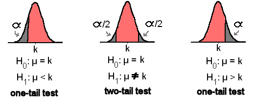
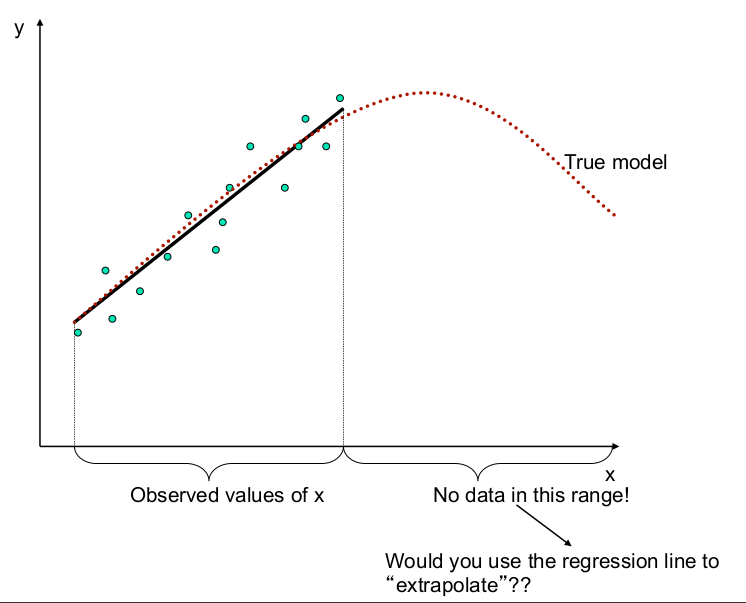

***


{width=500px}

(Why is the solid line the best fit and not the dashed line?)

</br>

##A quick intro to the intro to R Lesson Series

</br>

This 'Intro to R Lesson Series' is brought to you by the Centre for the Analysis of Genome Evolution & Function's (CAGEF) bioinformatics training initiative. This course was developed based on feedback on the needs and interests of the Department of Cell & Systems Biology and the Department of Ecology and Evolutionary Biology. 


This lesson is the last in a 6-part series. The idea is that at the end of the series, you will be able to import and manipulate your data, make exploratory plots, perform some basic statistical tests, test a regression model, and make some even prettier plots and documents to share your results. 


</br>

How do we get there? Today we are going to be testing and interpreting the output of different regression models. We are also going to learn how to compare models and choose the best model that fits our data. 


</br>

The structure of the class is a code-along style. It is hands on. The lecture AND code we are going through are available on GitHub for download at <https://github.com/eacton/CAGEF>, so you can spend the time coding and not taking notes. As we go along, there will be some challenge questions and multiple choice questions on Socrative. At the end of the class if you could please fill out a post-lesson survey (<https://www.surveymonkey.com/r/3RKC6MP>), it will help me further develop this course and would be greatly appreciated. 

***

####Packages Used in This Lesson

The following packages are used in this lesson:

`tidyverse` (`ggplot2`, `tidyr`, `dplyr`)     
`limma`     
`gee`  
`multcomp`     
`broom`

Please install and load these packages for the lesson. In this document I will load each package separately, but I will not be reminding you to install the package. Remember: these packages may be from CRAN OR Bioconductor. 


***
####Highlighting

`grey background` - a package, function, code or command      
*italics* - an important term or concept     
**bold** - heading or a term that is being defined      
<span style="color:blue">blue text</span> - named or unnamed hyperlink     


***
__Objective:__ At the end of this session you will be able to perform simple and multiple linear regression, one- and multiway analysis of variance (ANOVA) and analysis of covariance (ANCOVA). You will be able to interpret the statistics that come out of this model, be cognizant of the assumptions the model makes, and use an F-test to select the best model for the job. 


##Answering questions with data


In order to work with our data we need to be able to answer some basic questions. 

- How do we describe our data?  
- How do we test our hypotheses (what model do we use)? 
- How do we test our assumptions about the model are using? 
- How do we compare models? 
- How do we make a prediction with new values? 

These are all really important questions that we may or may not think about as we try to dive in and get our answer as quickly as possible. Today we are going to slow down a bit and think about our data and our models. 

Load the packages!

```{r message = FALSE, warning=FALSE, echo = c(1:5)}
library(tidyverse)
library(limma)
library(gee)
library(multcomp)
library(broom)
library(knitr)
library(kableExtra)
```


###Our Dataset

The dataset we will use for this lesson is from the Summer Institute in Statistical Genetics (SISG) at the University of Washington's course in Regression and Analysis of Variance by Lurdes Inoue. This lesson uses a lot of material from the [SISG 2016](https://www.biostat.washington.edu/suminst/archives/SISG2016/SM1604) course as well as conceptual material from [Ben Bolker](https://ms.mcmaster.ca/~bolker/). I like this dataset because it has a number of categorical and continuous variables, which allows us to use the same dataset for many models. Also, the variables are familiar (age, BMI, gender, cholesterol), which makes data interpretation easier while we are in the learning stage. 

Read the data in and take a look at the structure.

```{r}
cholesterol <- read.delim("data/SISG-Data-cholesterol.txt", sep = " ", header = TRUE)

str(cholesterol)
```
This dataset is looking at genetic variants (single nucleotide polymorphisms (SNPs)) and their relationship to cholesterol (chol) and triglycerides (TG) for 3 genes: rs174548 (FADS1 - an enzyme in fatty acid unsaturation), rs4775401 (a candidate SNP), and APOE (a major apolipoprotein important for Alzheimer's disease). 

Note that categorical variables have been encoded. Sex is 0 and 1 instead of 'Male' and 'Female'. rs174548 has 3 possible nucleotide combinations, "C/C", "C/G", and "G/G" which have been encoded as 0, 1, and 2. Similarly rs4775401 has 0, 1, and 2 representing SNPs. APOE has 6 variants labelled starting at 1 (1-6).


We are ultimately interested in the relationship between the above genetic variants and cholesterol, while controlling for factors such as age and sex. But let's get our feet wet by starting with the easier __question: is there an association between mean serum cholesterol and age?__

For this question cholesterol is the __dependent variable__, or the variable being measured. Age is the __independent variable__ that we are changing to determine the effect on cholesterol.

It is always, always, always, a good idea to make an 'exploratory' plot of your data and get an idea of what its distribution looks like. We can start with a simple scatterplot of age and cholesterol.

```{r}
ggplot(cholesterol, aes(age, chol)) + 
  geom_point()
```

We could also describe our data with some basic summary statistics such as the mean, median, mode, min, max, standard deviation, and variance. R does not have a mode function relating to statistics, but we can figure it out for ourselves.

```{r}
cholesterol %>% 
  summarize(mean = mean(chol), median = median(chol), min = min(chol), 
            max = max(chol), sd = sd(chol), variance = var(chol)) 

mode <- sort(table(cholesterol$chol), decreasing = TRUE)
mode[1]

```

Our mean, median and mode are not that different, and so our data is not skewed in either direction. We can also prove this to ourselves by making a quick density plot.

```{r}
ggplot(cholesterol, aes(chol)) + 
  geom_density() 
```

The `quantile()` function will also give us a good sense of the range and distribution of our data.

```{r}
quantile(cholesterol$chol)
```


Going back to our question of if age is related to cholesterol, let's add the mean cholesterol to our plot for reference. This is done by adding `geom_hline` and specifying the value for the 'yintercept'.

```{r}
ggplot(cholesterol, aes(age, chol)) + 
  geom_point() + 
  geom_hline(yintercept = mean(cholesterol$chol), color = "red")
```

It looks like the mean might increase with age, but how do we test this?


##T-tests
    
T-tests are a simple statistical tool let us to compare the means between groups. We don't currenly have age groups, but we can make them. One way to do this is to use our `dplyr` skills to create a new column 'age_group'. The data can be split at 55 years-old (the midpoint of age in our data). 

We can use an if/else statement (the `ifelse` function) to test: is age greater than 55? If the answer is 'yes' the value is 1 and if the answer is 'no' the value is 0. We can take a quick look at our dataset to make sure this worked.

```{r}
cholesterol <- cholesterol %>% mutate(age_group = ifelse(test = cholesterol$age > 55, yes = 1, no = 0))

str(cholesterol)
```


We can now use a boxplot to look at the distribution of cholesterol for our 2 groups. 

   
    Boxplots are a great way to visualize summary statistics for your data. As a reminder, the thick line in the center of the box is the median. The upper and lower ends of the box are the first and third quartiles (or 25th and 75th percentiles) of your data. The whiskers extend to the largest value no further than 1.5*IQR (inter-quartile range - the distance between the first and third quartiles). Data beyond these whiskers are considered outliers and plotted as individual points. This is a quick way to see how comparable your samples or variables are.
    

```{r}
ggplot(cholesterol, aes(factor(age_group),chol)) + 
  geom_boxplot() +
  scale_x_discrete(labels = c("30-55", "56-80")) +
  xlab("age") +
  ylab("cholesterol (mg/dl)")
  
```


There seems to be a lot of overlap in our cholesterol values. How do we tell if the means are truely different? 

Let's think about this a little more explicitly:

The __null hypothesis__ is that there is no difference in the sample means between our groups. 

An __alternative hypothesis__ is that there is a difference between the means (2-sided test), or that the difference in means is greater or lesser than zero (1-sided test). 



</br>

$\alpha$ is our p-value, and $\mu$ is the population mean, k is our sample mean. Remember that we are _estimating_ the true population mean using the sample that have. Our __p-value__ is the probability of finding our observed value by chance given that the null hypothesis is true.

We will use a simple student's t-test to test the alternative hypothesis that the true difference in means is not equal to 0.

The `t.test` function takes as input the variables on which we are performing the test (in vector format), the type of t-test being performed, and the confidence interval. The __confidence interval__ is the interval that will cover the true parameter x% of the time. In the image above the confidence interval covers the pink area, (1-$\alpha$).

You can alternatively enter your variables in a `formula`, in this case `y ~ x`. The `~` in r language is used to separate the left and right sides of a formula. (You can run a 1-sided t-test by specifiying `alternative = 'greater'` or `alternative = 'less'`). In this case, `alternative = 'two-sided'` and `conf.level = 0.95` are the default parameters and only included for clarity. For now we are assuming that equal variance is true.

```{r eval = FALSE}
t.test(x= cholesterol$age_group, y = cholesterol$chol, alternative  = "two.sided", conf.level = 0.95, var.equal = TRUE)
```
```{r }
#is equivalent to
t.test(formula = cholesterol$chol ~ cholesterol$age_group, var.equal = TRUE)
```


__Interpretation__

<div style="float:left;margin:0 10px 10px 0" markdown="1">
{width=150px}

</div>

Our output tells us the mean cholesterol for those aged 30-55 is 180 mg/dl and the mean for those aged 56-80 is 188 mg/dl. The difference in means is significant at a p-value of 0.0003146. 

So we now know there is a positive relationship between cholesterol and age. However the t-test has limitations. What is the magnitude of this relationship during aging? Does it change by approximately the same amount per year? What if we don't want to break our data into groups? 


##How we Evaluate which Model to Use


</br>

There are a ton of models (or families of models) out there for different statistical purposes and with different assumptions. These assumptions, if violated, will give incorrect predictions. However, we might not know if these assumptions are true when selecting our model. Today we are hanging out in the top left corner, and we are going to learn the assumptions of _linear models_ in general, the specific models we will be using today, and an example of each. We will trouble-shoot when asssumptions fail later in the lesson.


###Assumptions of general linear models
1. observed values are independent of each other (_independence_)     
   - The probability of an event occurring does not affect the probability of another event occurring.
2. variation around expected values (residuals) are normally distributed (_normality_)
    {width=400px}
3. constant variance, homoscedastic (_equal variance_)     
{width=400px}
  - For values of x, values of y show equal variance.

4. observed values (y) are related by linear functions of the parameters to x (_linearity_)     
   - Example: For $y = a + b_1x+b_2x^2$, the parameters a, b~1~, and b~2~ are linear even though the independent variable has a quadratic component, $x^2$. However, $y = ax^b$ is nonlinear with respect to the parameter b, and is not suitable for linear regression.

Assumptions 2 and 3 are often grouped together.
</br>

###The Linear Models

For __simple linear regression__ we are modelling a continuous outcome by a single continuous variable. Example: modelling cholesterol using BMI.

For __multiple linear regression__ we are modelling a continuous outcome by more than one continuous variable. Example: modelling cholesterol using BMI AND age. In this case, we must consider whether there is an _interaction_ between age and BMI on cholesterol (more on interactions to follow). 

For __one-way ANOVA__ we are modelling a continuous outcome by a single categorical variable. Example: modelling cholesterol by sex. It is important that categorical variables are explicitly input as factors to be interpreted properly in the model. For example, since we have encoded sex as 0 and 1 (instead of 'M' and 'F'), we need to specify that sex is to be treated as a categorical variable and not a number. Therefore we specify sex as a factor of 2 levels, 0 and 1.

For __multi-way ANOVA__ we are modelling a continous outcome by more than one categorical variable. Example: modelling sex and APOE genetic variants. Again, we need to consider any interaction between our categorical variables, and we need to specify our numeric values to be treated as categorical variables and not numbers. APOE will be a factor of 6 levels, one for each genetic variant.

Lastly, for __ANCOVA__ we are modelling a continuous variable by a combination of categorical AND continuous variables. This could be modelling cholesterol using the genetic variants of APOE and BMI. Again, our categorical variable must be input as a factor. ANCOVA allows for each group (each genetic variant of APOE in this example) to have a separate slope.


This is a summary table you might find helpful for choosing a model based on the data types you have and the asssumptions you are making. I hope to show that model selection is akin to going through mental checklist for your data, and not that scary. The independence assumption is required for all the models below, and is not included in the chart for spacing reasons.

```{r echo = FALSE}
dat <- data.frame(model = c("simple linear regression", "multiple linear regression", "one-way analysis of variance (ANOVA)", "multi-way analysis of variance (ANOVA)", "analysis of covariance (ANCOVA)", "nonlinear least squares", "nonlinear analysis of covariance (ANCOVA)", "generalized linear models"), categorical = c("X", "X", "$\\checkmark$", "$\\checkmark$ $\\checkmark$", "$\\checkmark$", "X", "$\\checkmark$", "$\\checkmark$"), continuous = c("$\\checkmark$", "$\\checkmark$ $\\checkmark$", "X", "X", "$\\checkmark$", "$\\checkmark$", "$\\checkmark$", "$\\checkmark$"), linearity = c("$\\checkmark$","$\\checkmark$","$\\checkmark$","$\\checkmark$", "$\\checkmark$", "X", "X", "X*"), normality = c("$\\checkmark$", "$\\checkmark$", "$\\checkmark$", "$\\checkmark$", "$\\checkmark$", "$\\checkmark$", "$\\checkmark$", "X"), equal_variance = c("$\\checkmark$","$\\checkmark$","$\\checkmark$","$\\checkmark$", "$\\checkmark$", "$\\checkmark$", "$\\checkmark$", "X"))

kable(dat, "html") %>%
  kable_styling(bootstrap_options = c("striped", "hover"), full_width = FALSE, position = "left")

```
*restricted cases

</br>

***

Revisiting our question:

__What is the relationship between cholesterol and age?__

Now, we can pick a model to answer our question instead of a t-test by considering the assumptions above.

If we evaluate our independent and dependent variables, age and cholesterol, they are both continuous, not categorical. We only have one independent variable. From the plot we made earlier (repeated here) it looks like if there is a relationship between age and cholesterol it would be linear. Data points have an even spread so the variance is likely equal and normally distributed. The values are independent (from separate blood draws).    

```{r}
ggplot(cholesterol, aes(age, chol)) + 
  geom_point() 
```

Based on the above criteria, we will try using a simple linear regression to test the association of mean serum cholesterol with age.


##Simple linear regression

What we are looking for then, is the slope of the line relating cholesterol to age, which will tell us the magnitude and direction of the relationship between these variables. We can look at the slope for the linear model that `ggplot` would fit for us for an idea of what our model will look like.

```{r}
ggplot(cholesterol, aes(age, chol)) +
  geom_point() +
  stat_smooth(method = "lm")
```

__Review:__ the equation for a straight line.

_Expression:_ 

\begin{equation*}
Y \verb|~| Normal(a + bx, {\sigma^2})
\end{equation*}


_Y_ is our dependent variable that we are attempting to model. 
_x_ is our independent variable.           
_a_ is the intercept (the value of y where x = 0; where x crosses the y-axis).     
_b_ is the slope of the line (the change in y corresponding to a unit increase in x).      
_Normal_ is telling us that our error is normally distributed.     
$\sigma^2$ is the variance (squared deviation of the variable x from its mean)

_Slopes_     
- A flat line (_b_ = 0) would mean that there is no association between x and y.      
- The above example has a positive slope, meaning that y increases as values of x increase.  
- With a negative slope, y decreases as values of x increase. 

The __interpretation__ in our example is that the slope is the difference in mean serum cholesterol associated with a one year increase in age.

With a straight line we are not, of course, plotting through all of our points, but rather close to the mean of an outcome in y as a function of x. For example, there are values of cholesterol for about six 50 year-olds, and our line will fall somewhere close to the mean of these values. Values of y have a distribution at a given x, which we have assumed is normally distributed.


Lastly, in this equation we also have some normally distributed error - sampling error exists in our estimates, because different estimates give different means. 


Okay, but how do we actually find the best fitting line? We use __least squares estimation__, which minimizes the sum of squares of the vertical distances from the observed points to the least squares regression line ($y -\hat{y}$) .

$y$ - observed value         
$\hat{y}$ - estimated value     
$\bar{y}$ - sample mean     

{width=600px}
 
 </br>
 
Let's run this simple linear regression. Using R, the intercept and slope terms are implicit.

_R code:_ 

lm(y ~ x)


    There are times when the intercept, the value of y at x = 0, doesn't make much intuitive sense to interpret our data. To force the intercept to zero (y = bx) to have relative comparisons instead use: lm(y ~ x-1).


As we are used to with writing equations, our dependent variable (cholesterol) is on the left side the `lm` formula and our independent variable (age) is on the right side; tilde `~` separates these sides. We also input the dataset to the `lm` function. 
```{r}
lm(chol ~ age, data = cholesterol)
```

The function will output our formula, the slope and the intercept. However, if we save the output of the function into an object, 'fit', we get a list object of the model, the input, and all associated statistics. We can look at a summary and get residuals, errors, p-values and more in addition to our coefficients.

```{r}
fit <- lm(chol ~ age, data = cholesterol)

summary(fit)
```


__Interpretation__ 

<div style="float:left;margin:0 10px 10px 0" markdown="1">
{width=150px}

</div>

The intercept is 166.9 and the slope is 0.31. What does that actually mean? It means a baby (age 0) would be expected to have on average a serum cholesterol of 166.9 mg/dl. For every yearly increase in age, mean serum cholesterol is expected to increase by 0.31 mg/dl. These results are significant with a p-value < 0.001. We can reject the null hypothesis and say that mean serum cholesterol is significantly higher in older individuals. The Multiple R-squared value tells us that about 4% of the variability in cholesterol is explained by age.

We can further get confidence intervals for these values to say that 95% of the time we expect the cholesterol of a baby to fall within 158.5-175.3 mg/dl, or that we are 95% confident that the difference in mean cholesterol associated with a one year increase in age is between 0.16 and 0.46 mg/dl.
```{r}
confint(fit)
```


##Multiple linear regression

In multiple linear regression we use multiple continuous dependent variables to predict outcome values. Additional terms can be added in 2 ways.

***

###Adding powers of a variable (polynomial regression)

It was mentioned before that the 'linear' part of linear regression is the linear function of the _parameters_ and not the independent variables. In the example below, the parameters $a$, $b_1$, and $b_2$ are linear even though we have the independent variable has a quadratic component, $x^2$. An example of this could be synthesizing a chemical, where with increasing temperature synthesis progresses with an increasing curve.

_Expression:_ 

\begin{equation*}
Y \verb|~| Normal(a + b_1x + b_2x^2, {\sigma^2})
\end{equation*}

If we were to write this in R, again our intercept and coefficients are implicit. To write the quadratic term we us the function `I` which just means 'asis'. 

_R code:_ 

lm(y ~ x + I(x^2))


***

###Adding extra variables to our model

We are interested in improving our model by adding extra variable we think might have an effect on our outcome values. In the example below, we are adding the independent variables x~1~, x~2~, and each of these terms has their own linear parameter b~1~ and b~2~, respectively.

_Expression:_ 

\begin{equation*}
Y \verb|~| Normal(a + b_1x_1 + b_2x_2, {\sigma^2})
\end{equation*}

This is the model we will be using next. To aid with interpretation let's think about a parameter. b2 is the expected mean change in unit per change in x~2~ if x~1~ is held constant (sometimes called controlling for x~1~). 

The null hypothesis in this case is that all b~1~, b~2~ = 0. The alternative hypothesis is that at least one of these parameters is not null. 

Again in R the intercept and coefficients are implicit in the the `lm` function.

_R code:_ 

lm(y ~ x~1~ +x~2~)


We know that age has an effect on cholesterol. With our new model we want to ask the question: __Is there a statistically significant relationship between mean serum cholesterol and age after controlling for BMI?__ Let's look graphically at these relationships to help us understand our model. First let's plot BMI vs cholesterol. We can add a linear fit to make sure we are expecting a positive slope.

```{r}
ggplot(cholesterol, aes(BMI, chol)) + 
  geom_point() + 
  stat_smooth(method = "lm")

```

We should also take a look at the relationship between BMI and age.

```{r}
ggplot(cholesterol, aes(age, BMI)) + 
  geom_point() + 
  stat_smooth(method = "lm")

```

Cholesterol increases with BMI. BMI increases with age. We will look at the association of age and cholesterol while holding BMI constant to see if the significance of our finding of the increase in cholesterol with age was affected by BMI.

```{r}
mfit <- lm(chol ~ age + BMI, data = cholesterol)

summary(mfit)
```

__Interpretation__

<div style="float:left;margin:0 10px 10px 0" markdown="1">
{width=150px}

</div>

Our equation would now look like $y = 137.16 + 0.20age + 1.43BMI$. 

The estimated increase in mean serum cholesterol over after one year holding BMI constant is 0.20 mg/dl. This increase is less than our previous value of 0.31 mg/dl. Why do the estimates differ?

Before, we were not controlling for BMI. Our estimates of the age associated increase in mean cholesterol is now for subjects with the _same_ BMI and not for subjects with _all_ BMIs.

It looks like both age and BMI are significant. But we might want to verify - did adding BMI actually make a difference to the model?

We can compare these models with the `anova` function. The output of our model, 'mfit', is an `lm` object. With 2 `lm` objects, the `anova` function tests the _models_ against one another to see if their coefficients are significantly different and prints these results in an analysis of variance table. (Given 1 `lm` object, it will test whether model _terms_ of a model are significant - we will be using the function in this format later.)

```{r}
anova(fit, mfit)
```

Our second model is a signifcantly different from our first model. What is this significance based on?

The significance is a probability based on an F-test. While the t-test tells if you a single variable is statistically significant, and an __F-test__ tells you if a group of variables is jointly significant. Since the F-test compares the joint effect of all variables together, a large F value means 'something' is significant. F-tests are not used alone because you still need to use a p-value to find out 'what' is significant. 


###Interaction terms 

What is meant by an interaction? There is an __interaction__ if the association between the response and the predictor variable changes across the range of the new variable. This can be seen in the expression below, where the difference in means between x~1~ and x~2~ changes additionally by b~3~ for each unit difference in x~2~ or x~1~, ie. the slope of x~1~ changes with x~2~, because b~3~ is changing.


_Expression:_ 

\begin{equation*}
Y  \verb|~|  Normal(a + b_1x_1 + b_2x_2 + b_3x_1x_2, {\sigma^2})   
\end{equation*}


In the graph below, there is an interaction between education and ideology. The slope indicating the probability that people will care if sea level rises 20 feet, changes with each education level and each shift in ideology. If there was no interaction with ideology and education, the slopes shown would be parallel. 

{width=600px}

</br>

When testing for an interaction between 2 input variables, the `lm` input takes an asterik '*' instead of a plus sign between the dependent variables.

_R code:_ 


lm(y ~ x~1~*x~2~)


An interaction is different than a __confounding factor__, for which the association between the response and predictor variable is constant across the range of the new variable. You can think of them as variables that have an effect on the outcome, but haven't been accounted for. For example, in our first model where the increase in cholesterol was ONLY due to an increase in age, BMI would be a confounding factor because weight contributes significantly to an increase in cholesterol, and age alone is not responsible for the increase in cholesterol.   


***
__Challenge__ 


<div style="float:left;margin:0 10px 10px 0" markdown="1">
{width=150px}

</div>

Test if there is an interaction between age and BMI in a model predicting mean serum cholesterol. Is the interaction significant? Is there a difference between this model and the model with age as the only variable? Is there a difference between this model and the model of BMI and age model with no interaction?


</br>
</br>
</br>

***


```{r include = FALSE}
ifit <- lm(chol ~ age * BMI, data = cholesterol)

summary(ifit)

anova(fit, ifit)
anova(mfit, ifit)
```


##One-way analysis of variance (ANOVA)

In the analysis of variance (ANOVA) independent variables are categorical (factors) rather than continuous. This allows us to ask the the question:

__Does the genetic factor rs174548 have an effect on cholesterol levels?__

Our categorical example is represented by $\alpha$. $i$ represents the levels of our factor.

_Expression:_ 

\begin{equation*}
Y \verb|~| Normal({\alpha_i}, {\sigma^2}) 
\end{equation*}

We still use the `lm` function, however we replace our continuous variable with f, a categorical variable (factor). If your data is character type, R will automatically make a factor for you. However if your data is numeric, R will interpret it as continuous. In this case, you need to make your numeric data a factor first using `factor`.

_R code:_ 

lm(y ~ f)


R parameterizes the model in terms of the differences between the first group and subsequent groups (ie. relative to the first group) rather than in terms of the mean of each group. This is similar to the interpretation of the previous linear models. (You can instead fit the means of each group using: lm(y ~ f-1)).


To begin to answer our question, we can first plot the relationship between rs174548 and cholesterol. 

```{r}
ggplot(cholesterol, aes(as.factor(rs174548), chol)) + geom_boxplot()

```

Our genetic factor has 3 groups, and we will be comparing the means for each of these groups. These groups have high variance, and there is a good deal of overlap between them.

To assess whether the means are equal, the model compares:

- variation between the sample means (MSR)
- natural variation of the observations within the sample (MSE)

The larger the MSR compared to the MSE the more support there is for a difference between the population means.
The ratio of MSR/MSE is our F-statistic.

###Dummy Variables

We can encode our categorical variable as a _dummy variable_. 0 in our data frame stands for the genotype C/C, 1 is C/G and 2 is G/G. But instead we can create a matrix with $k-1$ separate columns of 0's and 1's, where $k$ is the number of factor levels in our categorical variable. The omitted category is the reference group. Each genetic factor has a unique encoding where 0 means the SNP is not present and 1 means that SNP is present. 

```{r echo = FALSE}
dat3 <- data.frame(rs174548 = c("C/C", "C/G", "G/G"), x1 =c(0,1,0), x2 = c(0,0,1))

kable(dat3, "html") %>%
  kable_styling(full_width = FALSE, position = "center")
```

Now we can do regression with our dummy variables. The form of this equation should look more familiar.

_Expression:_ 

\begin{equation*}
Y \verb|~| Normal({\beta_0 + \beta_1x_1 + \beta_2x_2}, {\sigma^2}) 
\end{equation*}


__Interpretation__

<div style="float:left;margin:0 10px 10px 0" markdown="1">
{width=150px}

</div>

The interpretation of this model is a bit trickier.     

- $\beta_0$ - mean cholesterol when rs174548 is C/C
- $\beta_0$ + $\beta_1$ - mean cholesterol when rs174548 is C/G
- $\beta_0$ +  $\beta_2$ - mean cholesterol when rs174548 is G/G

Alternatively,

- $\beta_1$ is the difference in mean cholesterol levels between groups with rs174548 equal to C/G and C/C
- $\beta_2$ is the difference in mean cholesterol levels between groups with rs174548 equal to G/G and C/C

So you can think of each of these groups having their own means. ie. $\mu_0 = \beta_0$, $\mu_1 = \beta_0 + \beta_1$, $\mu_2 = \beta_0 + \beta_2$. We are testing the hypothesis whether these means are equal or not.

R will create dummy variables in the background if you state you have a categorical variable.

```{r}
anfit1 <- lm(chol ~ as.factor(rs174548), data = cholesterol)

summary(anfit1)
```

__Interpretation__

<div style="float:left;margin:0 10px 10px 0" markdown="1">
{width=150px}

</div>

- The intercept, 181.06 mg/dl is the mean cholesterol when rs174548 is C/C.
- 181.06 mg/dl + 6.80 mg/dl is the mean cholesterol when rs174548 is C/G.
- 181.06 mg/dl + 5.44 mg/dl is the mean cholesterol when rs174548 is G/G.

Alternatively,

- 6.80 mg/dl is the difference in mean cholesterol levels between groups with rs174548 equal to C/G and C/C
- 5.44 mg/dl is the difference in mean cholesterol levels between groups with rs174548 equal to G/G and C/C

The genetic factor rs174548 has an effect on cholesterol at a significance level of p < 0.05.

An analysis of variance table with one model as input test gives us the same p-value. Why?

```{r}
anova(anfit1)
```

This tells us that there is a difference in means (rejects the null hypothesis that all means are the same), but doesn't tell us which means are different.

In order to look at this we need to look at multiple pairwise comparisons.  
$\mu_0$ = $\mu_1$, $\mu_0$ = $\mu_2$, $\mu_1$ = $\mu_2$ 

###Multiple test correction

Multiple comparisons increase the __family-wise error rate (FWER)__ - the probability of making a false discovery (aka a false positive or Type I error). This is where multiple test corrections come in to control the error at a specific threshold (ie. $\alpha = 0.05$ or 5%). One of the simpliest and conservative is the Bonferroni correction ($\alpha/k$ or multiplying p-values by $k$). 

Previously, it was mentioned that you can fit the means for each group using lm(y ~ f-1). To run multiple tests to see if group means differ we can use this equation for __general linear hypotheis testing__, which takes in a model as well as a __contrast matrix__ for the comparisons you want to make. The simplist contrast matrix is a matrix of 0, 1, and -1's where the relationship -1 and 1 are the factor levels for which you want to test the differences.   


```{r}
tfit <- lm(chol ~ -1 + as.factor(rs174548), data = cholesterol)

M <- contrMat(table(cholesterol$rs174548), type = "Tukey")
M
```

This rownames of the contrast matrix tell us what is being compared ([1-0], [2-0], [2-1]). For example [1-0] is the difference between C/C (-1) and C/G (1). More complicated comparisons can be made. For example, the difference between C/C and the average of G/G and C/G could be specified by adding a row to the matrix of -2 1 1 (Note: rows of a contrast matrix must add to zero). 

To get estimates using general linear hypothesis testing we use the `glht` function; our linear hypotheses to be tested are specified by our contrast matrix. We will first look at a summary without adjusting/correcting our p-values.

```{r}
mc <- glht(tfit, linfct = M)

summary(mc, test = adjusted("none"))
```

__Interpretation__

<div style="float:left;margin:0 10px 10px 0" markdown="1">
{width=150px}

</div>


[1 - 0 == 0] The difference in means between C/C and C/G is 6.80 mg/dl and this difference is significant.     
[2 - 0 == 0] The difference in means between C/C and G/G is 5.44 mg/dl and this difference is not significant.     
[2 - 1 == 0] The difference in means between C/G and G/G is -1.36 mg/dl and this difference is not significant.     

We can see if multiple test correction affects these relationships.

```{r eval = 1}
summary(mc, test = adjusted("bonferroni"))
#other correction types
summary(mc, test = adjusted("BH"))
summary(mc, test = adjusted("fdr"))
```
The significant difference in mean cholesterol between C/C and C/G genotypes of rs174548 holds under different multiple test corrections.


##Multi-way analysis of variance (ANOVA)

Two or more categorical variables (factors) are used to model our outcome. We can now ask the question:

__Does the effect of the genetic factor rs174548 differ between males and females?__

We need to test whether there is an effect of our factors on cholesterol and also if there is an interaction between these factors.


_Expression:_ 

\begin{equation*}
Y \verb|~| Normal({\alpha_i} + {\beta_j}, {\sigma^2}) 
\end{equation*}

$\alpha$ and $\beta$ are our categorical variables. _i_ is the level of the first group, and _j_ is the level of the second group.

As with one-way ANOVA, R models our categorical variables as factors.

_R code:_ 

lm(y ~ f~1~ + f~2~), testing for main effects without interaction.     
lm(y ~ f~1~*f~2~), testing for the main effects with interaction.


The following diagram will help us visualize the differences in coefficients with and without interaction between 2 categorical variables.


In this first scenario, the difference in the means between groups defined by factor B does not depend on the level of factor A and vice versa. This means that there is no interaction, and the lines between the factor groups are parallel. In the second scenario the difference in the means between groups defined by factor B changes when A~2~ is present. There is an interaction and the lines are not parallel.


</br>
</br>


{width=500px}


We can first run a two-way model without testing for interaction.

```{r}
twofit <-lm(chol ~ as.factor(sex) + as.factor(rs174548), data = cholesterol) 

summary(twofit)
```
__Interpretation__

<div style="float:left;margin:0 10px 10px 0" markdown="1">
{width=150px}

</div>

-The estimated mean cholesterol for males in C/C group is the intercept, 175.36 mg/dl.     
-The estimated difference in mean cholesterol between females and males controlled for genotype is 11.05 mg/dl.     
-The estimated difference in mean between C/G and C/C groups controlled for gender is 7.24 mg/dl.     
-The estimated difference in mean between G/G and C/C groups controlled for gender is 5.18 mg/dl.     

There is evidence cholesterol is associated with gender (p<0.001).


How does this compare to the model with gender alone as a predictor?

```{r}
genfit <- lm(chol ~ as.factor(sex), data = cholesterol)

anova(genfit, twofit)
```
There is a difference between these 2 models (p=0.005).


We can now check the two-way anova with the interaction.

```{r}
intfit2 <- lm(chol ~ as.factor(sex) * as.factor(rs174548), data = cholesterol)

summary(intfit2)
```
__Interpretation__

<div style="float:left;margin:0 10px 10px 0" markdown="1">
{width=150px}

</div>

-The estimated mean cholesterol for males in the C/C group is 178.12 mg/dl.     
-The estimated mean cholesterol for females in the C/C group is (178.12 + 5.71) mg/dl.      
-The estimated mean cholesterol for men in the C/G group (178.12 + 0.96) mg/dl.     
-The estimated mean cholesterol for females in the C/G group is (178.12 + 5.71 + 0.96 + 12.74) mg/dl.     

There appears to be a significant interaction between being female and having the C/G genotype.

Let's compare the with interaction and without interaction model.

```{r}
anova(twofit,intfit2)
```

There is evidence that these two models are different (p = 0.015).


##Analysis of covariance (ANCOVA)

The analysis of covariance (ANCOVA) model allows for different intercepts and slopes with repect to a continuous variable in different categorical groups. ANCOVA, therefore, has a linear regression component. This allows us to ask the question:

__Is the relationship between age and cholesterol is affected by gender?__

_Expression:_ 

\begin{equation*}
Y \verb|~| Normal({\beta_i} + {\beta_{i}x}, {\sigma^2}) 
\end{equation*}

Parameters are the intercept of the first factor level, the slope with respect to x for the first factor level, the differences in the intercepts for each factor level other than the first, and the differences in slopes for each factor level other than the first.

R code:     

lm(y ~ f + x), testing for main effects without interaction.    
lm(y ~ f*x), testing for main effects with interaction.


To answer our question, let's first take a quick look at gender differences in cholesterol in our dataset, keeping in mind that males are encoded as 0 and females as 1. Based on sex information alone, we see that women have a higher mean serum cholesterol, but we don't know if this is significant. 

```{r}
ggplot(cholesterol, aes(as.factor(sex), chol)) + 
  geom_boxplot() 
```

Our model won't look that different from our other equations except that we have categorical and continuous predictor variables.
```{r}
mfit2 <- lm(chol ~ age + sex, data = cholesterol)

summary(mfit2)
```

__Interpretation__

<div style="float:left;margin:0 10px 10px 0" markdown="1">
{width=150px}

</div>

Controlling for sex, mean cholesterol increases by 0.30 mg/dl for an additional year of age. This is close to the slope for our model of cholesterol alone, 0.31 mg/dl. This does not necessarily mean that the age/cholesterol relationship is the same in males and females; we need to check out the interaction term. There appears to be an increase in mean serum cholesterol of 10.5 mg/dl in females over males. 


```{r}
intfit <- lm(chol ~ age * sex, data = cholesterol)

summary(intfit)
```

__Interpretation__ 

<div style="float:left;margin:0 10px 10px 0" markdown="1">
{width=150px}

</div>

Males are coded as 0 and females are coded as 1 in this model. The intercept term is the mean serum cholesterol for MALES at age 0. The slope term for age is the difference in mean cholesterol associated with a one year change in age for MALES. The slope for sex is the difference in mean cholesterol between males and females at age 0. The interaction term is the difference in the change in mean cholesterol associated with each one year change in age for females compared to males. Sex exerts a small and not statistically significant effect on the age/cholesterol relationship.

Let's compare our models with and without an interaction term with anova (an F-test).

```{r}
anova(mfit2, intfit)
```

Adding the interaction term did not change the model significantly.

Let's compare the model with age only to the model where sex is a taken into account without interaction.

```{r}
anova(fit, mfit2)
```

The addition of sex makes a statistically significant difference to the model. Take a look at the whole picture in graphical format.


```{r}
ggplot(cholesterol, aes(age, chol, color = factor(sex))) + 
  geom_point() + 
  stat_smooth(method = "lm")
```
__Interpretation__

<div style="float:left;margin:0 10px 10px 0" markdown="1">
{width=150px}

</div>

Gender doesn't change the relationship between age and cholesterol; these lines are almost parallel (another way to put it is whether you are male or female your cholesterol will on average be increasing by 0.30 mg/dl a year), but there is a different mean serum cholesterol estimate for males vs females that differs by 10.51 dg/ml.

</br>


##Review: Models we used today

Before we move on I want to take a step back and quickly review the models and code we've gone through today. Firstly, with our example dataset, and then more generally. I hope you can see that though conceptually different, getting a handle on the code isn't too bad.  

For all of these models we are trying to determine the effect of different variables on cholesterol. The differences are whether we are using continuous data, categorical data, a mixture of data types, and whether there is an interaction (`*`) between our input variables.

We have started with models that assume normally distributed errors, and we will investigate models with non-normal errors in a future lesson.  


```{r echo = FALSE}
dat2 <- data.frame(model = c("simple linear regression", "multiple linear regression", "one-way analysis of variance (ANOVA)", "multi-way analysis of variance (ANOVA)", "analysis of covariance (ANCOVA)"), categorical = c("X", "X", "$\\checkmark$", "$\\checkmark$ $\\checkmark$", "$\\checkmark$"), continuous = c("$\\checkmark$", "$\\checkmark$ $\\checkmark$", "X", "X", "$\\checkmark$"),R_code = c("lm(chol ~ age)", "lm(chol ~ age + BMI), lm(chol ~ age*BMI)", "lm(chol ~ factor(rs174548))", "lm(chol ~ factor(sex) + factor(rs174548)), lm(chol ~ factor(sex)*factor(rs174548))", "lm(chol ~ factor(sex) + age), lm(chol ~ factor(sex)*age) "))


kable(dat2, "html") %>%
  kable_styling(bootstrap_options = c("striped", "hover"), full_width = FALSE, position = "left")

```

In the table below, our R code for each of the models has been generalized. Here, y is our predictor variable, x is a continuous variable, and f is a categorical variable (factor). 

```{r echo = FALSE}
dat2 <- data.frame(model = c("simple linear regression", "multiple linear regression", "one-way analysis of variance (ANOVA)", "multi-way analysis of variance (ANOVA)", "analysis of covariance (ANCOVA)"), R_code = c("lm(y ~ x)", "lm(y ~ x + I(x^2)), lm(y ~ x~1~ + x~2~), lm(y ~ x~1~*x~2~)", "lm(y ~ f)", "lm(y ~ f~1~ + f~2~), lm(y ~ f~1~*f~2~)", "lm(y ~ f + x), lm(y ~ f*x)"))


kable(dat2, "html") %>%
  kable_styling(bootstrap_options = c("striped", "hover"), full_width = FALSE, position = "left")

```

You need not memorize any of these charts - you may just want to use them to orient yourself in the future. Much of the R code seems the same whether you are doing multiple linear regression, ANOVA or ANCOVA, so it is good to have a reference point.


***
__Challenge__ 


<div style="float:left;margin:0 10px 10px 0" markdown="1">
{width=150px}

</div>

Does the effect of the genetic factor rs174548 differ depending on a subject's age? Make a plot of age versus cholesterol and color points by genotype. Add a linear model to the plot. Are you expecting an interaction based on this plot? Test models for the association between cholesterol and age controlling for the genetic factor rs174548 with interaction and without interaction. Look at the summary statistics for each model fit. How would you interpret the results? Compare the two models with an analysis of variance table.    

</br>

***


```{r include = FALSE}
#challenge question plot
ggplot(cholesterol, aes(age, chol, color = as.factor(rs174548))) + 
  geom_point() + 
  stat_smooth(method = "lm")

#model without interaction
ancfit <- lm(chol ~ as.factor(rs174548) + age, data = cholesterol)
summary(ancfit)

#model with interaction
intfit3 <- lm(chol ~ as.factor(rs174548) * age, data = cholesterol)
summary(intfit3)

#compare models
anova(ancfit, intfit3)
```


##Prediction

When predicting values you are assuming that your model is true. This might be fair within the range of your data. This is to be interpreted with caution outside the range of your data. For example, polynomial data may look linear over a certain range.


{width=500px}
</br>

This is one of my favourite xkcd comics, probably just because I am getting married soon and this extrapolation is terrifying.


The `predict` function works with many different kinds of fits: not just linear models but nonlinear, polynomial, generalized linear models, etc. `predict` will try to guess the fit based on the object input, but this information can be specified using `predict.lm`. The help page for `predict.lm` is more useful as it is specific for the linear model fit. 

***
__Challenge__ 


<div style="float:left;margin:0 10px 10px 0" markdown="1">
{width=150px}

</div>

Use `predict.lm` to predict the mean cholesterol at age 47 from our model object 'fit'. ('fit' is our first model, lm(chol ~ age, data = cholesterol)).   

</br>

</br>

***


```{r include = FALSE}
predict.lm(fit, newdata = data.frame(age=47))
```

In addition to the linear model, the function needs the `newdata` that we want to predict. Note that `newdata` takes in a data frame. We can predict the mean cholesterol at age 47 within a confidence interval that can be specified using `level`. The output is the mean, as well as the upper and lower boundaries of the estimate.

```{r}
predict.lm(fit, newdata = data.frame(age=47), interval = "confidence")
```
We can also use the a 'prediction' interval.

```{r}
predict.lm(fit, newdata = data.frame(age=47), interval = "prediction")
```


Notice the difference in the upper and lower boundaries for these predictions. The first is the prediction for the mean serum cholesterol for _individuals_ of age 47 and the second is for a _single new individual_ of age 47. The second prediction has to account for random variability around the mean, rather than just the precision of the estimate of the mean. This may seem like a subtle difference, but as you can see it can change our boundaries quite a bit - we need to be clear on the question we are asking.


For our multiple linear regression model explaining cholesterol as a function of age and BMI ('mfit'), we could ask what cholesterol is predicted to be for a 60-year-old at a BMI of 21, a 60-year-old at a BMI of 26, and a 60-year-old at a BMI of 30. The standard error on the estimate of your means is obtained by setting `se.fit = TRUE`.

```{r}
predict(mfit, newdata = data.frame(BMI = c(21,26,30), age = 60), interval = "prediction", se.fit = TRUE)
```


##Assessing the performance of the model (feedback)


###Checking Residuals

__Residuals__ are the differences between the observed response and the predicted response, and can be used to identify poorly fit data points, unequal variance (heteroscedasticity), nonlinear relationships, and examine the normality assumption.


We can plot the residuals vs x, residuals vs y, or a histogram of the residuals to see if there are any patterns. For example, plotting residuals against x (age), should be unstructured and centered at 0. 


If the residuals look like they are grouped in one section of the plot, or follow a pattern, then the model is not a good fit (ie. looks quadratic - you would have a nonlinear association). If it looks like a sideways tornado, then errors are increasing with x, and this is non-constant variance.

The residuals are found in our  `lm` object, 'fit', which also contains the inputs of our model; it is a list of 12.


```{r}
str(fit)
```

We can use the `broom()` package to get information out of linear model objects into the glorious dataframe format that we know and love. This is done using the `augment` function. 

```{r}
datfit <- augment(fit)
str(datfit)
```
Now that we have a data frame we can plot our residuals (.resid) versus our fitted data (.fitted).


```{r}
ggplot(datfit, aes(.fitted, .resid)) + 
  geom_point()  + 
  geom_hline(yintercept=0, color="black")

```


You can plot the fitted and residual values with a categorical variable, but it is sometimes difficult to view patterns. For example, here is what plotting the residuals for our model of cholesterol as a function of genotype would look like.

```{r}
anfit1 <- augment(anfit1)

ggplot(anfit1, aes(.fitted, .resid, color = as.factor.rs174548.)) + 
  geom_point()  + 
  geom_hline(yintercept=0, color="black")
```

Instead, you can perform a statistical test of equal variance.

Bartlett's test can test whether or not population (group) variances are the same. We can see if variances are equal in our model of cholesterol as a function of sex by inputting the formula and dataset into the `bartlett.test` function.

```{r}
bartlett.test(chol ~ factor(rs174548), data = cholesterol)
```
The p-value is telling us that the variance is not statistically different between our populations. Our assumption of equal variance is valid.


###QQ-plots

__QQ-plots (quantile-quantile)__ are a tool to answer the question: Does our data plausibly come from the (normal) distribution? The data is plotted against a theoretical distribution. Points should fall on the straight line. Any data points not fitting are moving away from the distribution. 

The `stat_qq` geom from `ggplot2` allows us to plot our residuals along the y-axis in ascending order, and theoretical quantiles of a normal distribution along the x-axis. A straight line can be added to see where residuals fall with `stat_qq_line`.

```{r}
ggplot(datfit, aes(sample = .resid)) +
  stat_qq() + 
  stat_qq_line()

```

This looks pretty straight. We likely have normality of errors.

Let's try a less perfect example and look at the relationship between age and triglycerides (TG). Make a scatterplot of age and triglycerides with a linear fit to take a look at the data. 

```{r}
ggplot(cholesterol, aes(age, TG)) + 
  geom_point() + 
  stat_smooth(method = "lm")
```

Write a linear model for triglyceride levels as a function of age. Use `broom` to get the output of the `lm` object into data frame format.

```{r}
fitTG <- lm(TG ~ age, data = cholesterol)

datfitTG <- augment(fitTG)
```

Plot the residuals against the fitted values. Does the variance look equal across the residuals?


```{r}
ggplot(datfitTG, aes(.fitted, .resid)) +
  geom_point()  +
  geom_hline(yintercept=0, color="black")

```

Our residuals are increasing with increasing values of y. 

What do the residuals look like in a qq-plot?

```{r}
ggplot(datfitTG, aes(sample = .resid)) +
  stat_qq() + 
  stat_qq_line()
```

Our qqplot points are deviating from the line suggesting a poor fit for our model.


***

__Challenge:__      

<div style="float:left;margin:0 10px 10px 0" markdown="1">
{width=150px}

</div>

Does the genetic factor APOE have an effect on cholesterol levels? If so, does this interaction vary depending on a subject's age? Plot the relationship between APOE and cholesterol. Choose your model(s). Interpret your summary statistics. What model did you find 'best' for the job? Can you use any tools to assess whether the assumptions of your model are accurate? Perform multiple hypothesis testing for the relationship between choleterol and APOE variants. Which relationships are significant? Do these hold after multiple test correction?


</br>

```{r include = FALSE, echo = FALSE}

apofit <- lm(chol ~ as.factor(APOE), data = cholesterol)
summary(apofit)

ggplot(cholesterol, aes(x = as.factor(APOE), y = chol)) +
  geom_boxplot()

apoagefit <- lm(chol ~ as.factor(APOE) + age, data = cholesterol)
summary(apoagefit)

infit4 <-  lm(chol ~ as.factor(APOE) * age, data = cholesterol)
summary(infit4)


ggplot(cholesterol, aes(x = age, y = chol, color = factor(APOE))) +
  geom_point() +
  stat_smooth(method = "lm")

anova(apofit, apoagefit)
anova(apoagefit, infit4)

agefit <- lm(chol ~ age, data = cholesterol)
summary(agefit)

anova(agefit, apoagefit)


datapofit <- augment(apofit)

ggplot(datapofit, aes(.fitted, .resid)) +
  geom_point()  +
  geom_hline(yintercept=0, color="black")

bartlett.test(chol ~ factor(APOE), data = cholesterol)

datapoagefit <- augment(apoagefit)

ggplot(datapoagefit, aes(.fitted, .resid)) +
  geom_point()  +
  geom_hline(yintercept=0, color="black")


ggplot(datapoagefit, aes(sample = .resid)) +
  stat_qq() + 
  stat_qq_line()

#multiple test correction
mtfit <- lm(chol ~ -1 + as.factor(APOE), data = cholesterol)

Mt <- contrMat(table(cholesterol$APOE), type = "Tukey")
Mt
mt <- glht(mtfit, linfct = Mt)

summary(mt, test = adjusted("none"))
summary(mt, test = adjusted("fdr"))
summary(mt, test = adjusted("bonferroni"))

#APOE genotype has a significant effect on cholesterol. This relationship remains while holding age constant. There is no significant interaction between APOE genotype and age other than possibly APOE genotype 5, and the models are not significantly different. Therefore the 'best' model includes both APOE genotype and age. A bartlett test tells us that the variances are significantly different between the APOE genotype groups, so the assumption of equal variance is false. We can also see this by plotting the residuals for the model with APOE genotype + age, whose pattern looks like an arrowhead. The qq-plot looks reasonable. For multiple hypothesis testing all variants are different from the APOE genotype 1, and APOE genotype 5 is also significantly different from genotypes 2 and 4. Only the difference between genotype 5 and 2 is lost after multiple test correction.
```


***

##Next Steps (or When Assumptions Fail)

The consequences of violating the assumptions for linear models depends, of course, on the assumption being violated. The worst offence, of course, is having non-linearity of your parameters in which case you are using the wrong model.  


Our last example had a case of __non-constant variance (heteroscedasticity)__. This means that there is a mean-variance relationship (recall the tornado shape). In this case the parameter estimates are minimally impacted, however variance estimates are incorrect.

To account for this we can use:

1. Data transformation
1. Robust standard errors
1. Use a different model that does not assume constant variance (glm)

_Data transformation_ can solve some nonlinearity, unequal variance and non-normality problems when applied to the dependent variable, the independent variable, or both. However, interpreting the results of these transformations can be tricky.


```{r}
logfit <- lm(log(TG) ~ age, data = cholesterol)

logdat <- augment(logfit)
summary(logfit)
```

```{r}
ggplot(logdat, aes(.fitted, .resid)) + 
  geom_point()  + 
  geom_hline(yintercept=0, color="black")
```

We corrected the non-constant variance issue, but it is harder to interpret our model. 


__Robust standard errors__ correctly estimate the variability of parameter estimates even under non-constant variance. This does not affect point estimates (which are minimally impacted), but corrects confidence intervals and p-values.

To do this, we use a package called `gee` (generalized estimation equation). The syntax is similar to the `lm` function, we are just adding an 'id' variable.

```{r}
geefit <- gee(TG ~ age, data = cholesterol, id = seq(1, length(age)))

summary(geefit)
```

We have the same estimates for our intercept and slope, but our error estimates have now changed.
(Note: residuals in geefit are the originals.)

_Use a different model that does not assume constant variance (glm)_

__Generalized linear models__ can deal with non-normal errors as well as non-linearity. They use linker functions to transform nonlinear relationships into linear ones. 

Breaking the non-normality assumption will have minimal effect on estimates unless in the presence of outliers. Robust regression (ie. least squares) can be used.

Breaking the dependency assumption will have minimal effect on estimates, but the variance will be inaccurate. A different regression model for dependent data should be investigated. 

***

__Resources:__      

<https://github.com/ttimbers/lm_and_glm/blob/master/lm_and_glm.Rmd>          
<https://github.com/seananderson/glmm-course>          
<http://michael.hahsler.net/SMU/EMIS7331/R/regression.html>     
<https://ms.mcmaster.ca/~bolker/emdbook/book.pdf>     
<http://www.differencebetween.net/science/mathematics-statistics/difference-between-ancova-and-regression/>     
<https://stats.stackexchange.com/questions/77563/linear-model-fit-seems-off-in-r>          
<https://www.biostat.washington.edu/suminst/archives/SISG2016/SM1604>     
<https://ms.mcmaster.ca/~bolker/>         
<http://www.mathnstuff.com/math/spoken/here/2class/90/htest.htm>

#Post-Lesson Assessment
***

Your feedback is essential to help the next cohort of trainees. Please take a minute to complete the following short survey:
https://www.surveymonkey.com/r/3RKC6MP

</br>

***

</br>

Thanks for coming!!!

{width=300px}

