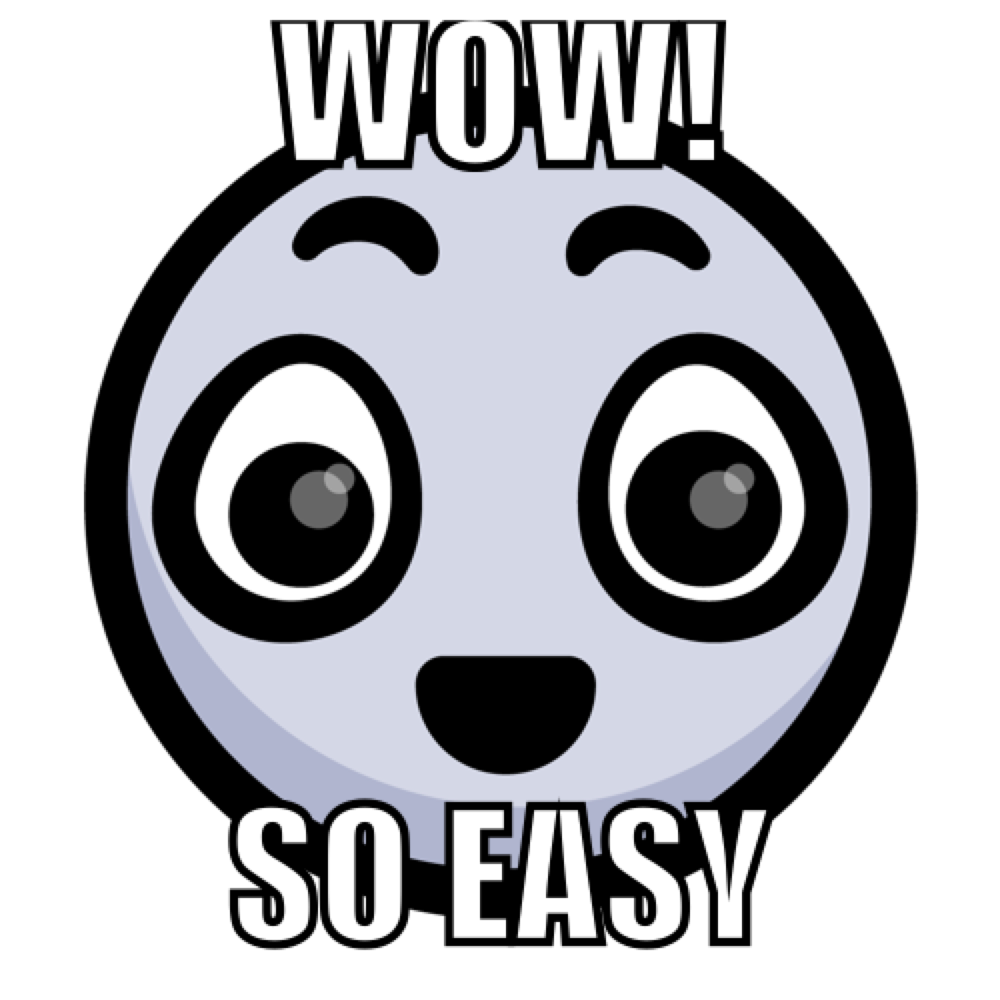

***

{width=400px} 

</br>

##A quick intro to the intro to R Lesson Series

</br>

This 'Intro to R Lesson Series' is brought to you by the Centre for the Analysis of Genome Evolution & Function's (CAGEF) bioinformatics training initiative. This course was developed based on feedback on the needs and interests of the Department of Cell & Systems Biology and the Department of Ecology and Evolutionary Biology. 


This lesson is the second in a 6-part series. The idea is that at the end of the series, you will be able to import and manipulate your data, make exploratory plots, perform some basic statistical tests, test a regression model, and make some even prettier plots and documents to share your results. 


</br>

How do we get there? Today we are going to be learning about how to subset and filter our data and perform all of the manipulations one has to do in daily coding life. We will learn about tidy data and how it makes data analysis less of a pain. We will perform some basic statistics on our newly transformed dataset. Next week we will learn how to tidy our data, subset and merge data and generate descriptive statistics. The next lesson will be data cleaning and string manipulation; this is really the battleground of coding - getting your data into the format where you can analyse it. After that, we will make all sorts of plots - from simple data exploration to interactive plots - this is always a fun lesson. And then lastly, we will learn to write some functions, which really can save you time and help scale up your analyses.


</br>

The structure of the class is a code-along style. It is hands on. The lecture AND code we are going through are available on GitHub for download at <https://github.com/eacton/CAGEF>, so you can spend the time coding and not taking notes. As we go along, there will be some challenge questions and multiple choice questions on Socrative. At the end of the class if you could please fill out a post-lesson survey (<https://www.surveymonkey.com/r/SMGKMCS>), it will help me further develop this course and would be greatly appreciated. 

</br>

***

####Highlighting

`grey background` - a package, function, code, command or directory      
*italics* - an important term or concept or an individual file or folder     
**bold** - heading or a term that is being defined      
<span style="color:blue">blue text</span> - named or unnamed hyperlink   


***

####Packages Used in This Lesson

The following packages are used in this lesson:

`tidyverse` (`tidyr`, `dplyr`, `tibble`)     


Please install and load these packages for the lesson. In this document I will load each package separately, but I will not be reminding you to install the package. Remember: these packages may be from CRAN OR Bioconductor. 

***

####Data Files Used in This Lesson

-ENV_pitlatrine.csv     
-gapminder_wide.csv         
-SPE_pitlatrine.csv     

These files can be downloaded at <https://github.com/eacton/CAGEF/tree/master/Lesson_2/data>. Right-click on the filename and select 'Save Link As...' to save the file locally. The files should be saved in the same folder you plan on using for your R script for this lesson.


***


__Objective:__ At the end of this session you will know the principles of tidy data, and be able to subset and transform your data, merge data frames, and perform simple calculations.

***

##A quick intro to base R subsetting

First, I am going to show you how to subset data in __base R__. Then I will show you how do the same thing with the popular packages `dplyr` and `tidyr`. These packages are great for data wrangling with _data frames_. While a lot of new packages play nicely with the functions we are going to use today, not all packages or data structures will work with `dplyr` functions. You will see `dplyr` and `tidyr` used for data cleaning and the manipulation of data frames.


###Dataset: Pyrosequencing of the V3-V5 hypervariable regions of the 16S rRNA gene

16S rRNA pyrosequencing of 30 latrines from Tanzania and Vietnam at different depths (multiples of 20cm). Microbial abundance is represented in Operational Taxonomic Units (OTUs). Operational Taxonomic Units (OTUs) are groups of organisms defined by a specified level of DNA sequence similarity at a marker gene (e.g. 97% similarity at the V4 hypervariable region of the 16S rRNA gene). Intrinsic environmental factors such as pH, temperature, organic matter composition were also recorded.

We have 2 csv files:

1. A metadata file (Naming conventions: [Country_LatrineNo_Depth]) with sample names and environmental variables.     
2. OTU abundance table.

B Torondel, JHJ Ensink, O Gunvirusdu, UZ Ijaz, J Parkhill, F Abdelahi, V-A Nguyen, S Sudgen, W Gibson, AW Walker, and C Quince.
Assessment of the influence of intrinsic environmental and geographical factors on the bacterial ecology of pit latrines
Microbial Biotechnology, 9(2):209-223, 2016. DOI:10.1111/1751-7915.12334

***

In this lesson we want to answer 3 simple questions: 

   
    - Which latrine depth has the greatest mean number of OTUs?
      (remember the Country_LatrineNo_Depth site encoding)
    - Is there more Clostridia in Tanzania or Vietnam?
    - Which site had the greatest number of Taxa represented?


To help us be able to answer these questions, we are going to learn how to manipulate our data.

{width=200px} 
</br>
</br>

Let's read in our dataset, store it in a variable, and remind ourselves about the structure.

```{r}

dat <- read.csv("data/SPE_pitlatrine.csv", stringsAsFactors = FALSE)
str(dat)

```


It is often extremely useful to subset your data by some logical condition (`==` (equal to), `!=` (not equal to), `>` (greater than), `>=` (greater than or equal to), `<` (less than), `<=` (less than or equal to), `&` (and), `|` (or)). For example, we may want to keep all rows that have either Fusobacteria or Methanobacteria.

```{r}

dat[dat$Taxa == "Fusobacteria" | dat$Taxa == "Methanobacteria", ]

```
Will this work?

```{r error = TRUE}

dat[dat$Taxa == "Fusobacteria" | "Methanobacteria", ]

```

What about this? 

```{r}
dat[dat$Taxa == c("Fusobacteria", "Methanobacteria"), ]
```


***

<div style="float:left;margin:0 10px 10px 0" markdown="1">
{width=100px}

</div>
Wait a second - why is this answer different? Why do we have 0 rows instead of 2?

</br>

</br>


###A reminder/warning about vectors 

```{r}
c(1,2,3) + c(10,11)

```
Vectors recycle. In this case, R gave us a warning that our vectors don't match. It returned to us a vector of length 3 (our longest vector), and it recycled the 10 from the shorter vector to add to the 3.

However, R will assume that you know what you are doing as long as your one of your vector lengths is a multiple of your other vector length. Here the shorter vector is recycled twice. No warning is given.

```{r}
c(1,2,3,4) + c(10,11)
```

Let's go back to our example. In this code, I am looking through the Taxa column for when Taxa is equal to Fusobacteria OR Taxa is equal to Methanobacteria.

```{r eval = FALSE}
dat[dat$Taxa == "Fusobacteria" | dat$Taxa == "Methanobacteria", ]
```

However, with a vector, I am alternately going through all values of Taxa and asking: does the first value match Fusobacteria? does the second value match Methanobacteria? Then the vector recycles and asks: does the third value match Fusobacteria? does the 4th value match Methanobacteria? We end up with a data frame of zero observations when we are expecting a data frame of 2 observations.

```{r eval = FALSE}
dat[dat$Taxa == c("Fusobacteria", "Methanobacteria"), ]
```


Be careful when filtering. You have been warned.


***
</br>
You can also filter to obtain more specific subsets using more than one column. To get only Taxa that had OTUs at sites T_2_1 and T_2_10 you can use the following filter:

```{r}
dat[dat$T_2_10!=0 & dat$T_2_1 != 0, ]
```

You can select columns by name or position, and reorder them as well (you can also do this for rows). I want to to compare the depth of latrine 2 at 9cm compared to 10cm, but I want Taxa in the last column. To inspect the first rows of an output, you can use the `head()` function. 

```{r}
head(dat[ , c("T_2_9", "T_2_10", "Taxa")])
#equivalent to
head(dat[ , c(9:10,1)])

```

Likewise, to inspect the last rows, you can use the `tail()` function. 

```{r }
tail(dat[ , "Taxa"])
#equivalent to
tail(dat[ , 1])

```
Try changing the output to show only the first 5 rows of your data frame.

```{r include = FALSE}
#using head
head(dat,5)
#subsetting
dat[1:5,]
```


You can arrange your data frame alphabetically or by value using `order()`. Let's take the first 10 columns for ease of visualization. Adding `decreasing = TRUE` to this function call results in reverse alphabetical ordering or highest to lowest values.

```{r}
head(dat[order(dat$Taxa, decreasing = TRUE), 1:10]) 
head(dat[order(dat$T_2_1, decreasing = TRUE), 1:10])
```
You can order your data frame by multiple variables. If we look at the top 10 rows after ordering we can see that as soon as T_2_12 gets to 0 OTUs, the data frame is ordered by values in T_2_9. 

```{r}
head(dat[order(dat$T_2_12, dat$T_2_9, decreasing = TRUE), 1:10], 10)
```
Now that we have some basic data-wrangling skills:

    - Which latrine depth has the greatest mean number of OTUs?
      (remember the Country_LatrineNo_Depth site encoding)
    - Is there more Clostridia in Tanzania or Vietnam?
    - Which site had the greatest number of Taxa represented?


How easy is it to answer these questions with the data in this 'messy' format?

***
__Challenge__ 


<div style="float:left;margin:0 10px 10px 0" markdown="1">
{width=150px}

</div>

Answer our 3 questions using the base R.


</br>
</br>
</br>

***

```{r include = FALSE}
#which latrine depth has the greatest mean number of otus?
mean_otus_sites <- apply(dat[,-1], 2, mean)
mean_otus_sites[order(mean_otus_sites, decreasing = TRUE)]
#end of abilities shown...based on descending order, probably 1cm? 


#more clostridia or tanzania in vietnam?
tan <- dat[, 1:30]
viet <- dat[, c(1, 31:82)]

tan <- tan[dat$Taxa == "Clostridia",]
viet <- viet[dat$Taxa == "Clostridia",]

sum(tan[,-1]) > sum(viet[, -1])
sum(tan[,-1])/(length(tan)-1) > sum(viet[, -1])/(length(viet)-1)

#which site had the greatest number of Taxa represented?
sum_otus_sites <- apply(dat[,-1], 2, function(x) ifelse(x !=0, 1, 0))
sum_otus_sites <- apply(sum_otus_sites, 2, sum)
sum_otus_sites[order(sum_otus_sites, decreasing = TRUE)]

```


##A quick intro to the dplyr package

The `dplyr` package was made by Hadley Wickham to help make data manipulation with data frames easier. It has 5 major functions:

  1. `filter()` - subsets your data frame by row
  2. `select()` - subsets your data frame by columns
  3. `arrange()` - orders your data frame alphabetically or numerically by ascending or descending variables
  4. `mutate(), transmute()` - create a new column of data
  5. `summarize()` - reduces data to summary values (for example using `mean()`, `sd()`, `min()`, `quantile()`, etc)
  
  
The `dplyr` package, and some other common packages for data frame manipulation allow the use of the pipe function, `%>%`. This is equivalent to `|` for any unix peeps. __Piping__ allows the output of a function to be passed to the next function without making intermediate variables. Piping can save typing, make your code more readable, and reduce clutter in your global environment from variables you don't need. The keyboard shortcut for `%>%` is `CTRL+SHIFT+M`. 

Let's load the library.

```{r message = FALSE}
library(dplyr)
library(tibble)
```

We are going to see how pipes work in conjunction with our first function, `filter()`. We are going to use the same subsetting examples so you can see how the syntax differs from base R. In this case, we want to keep all rows that have either Fusobacteria or Methanobacteria. 


```{r eval = FALSE}

filter(dat, Taxa == "Fusobacteria" | Taxa == "Methanobacteria")
#equivalent to
dat %>% filter(Taxa == "Fusobacteria" | Taxa == "Methanobacteria")
#equivalent to
```
```{r }
dat %>% filter(., Taxa == "Fusobacteria" | Taxa == "Methanobacteria") 
```

You'll notice that when piping, we are not explicitly writing the first argument (our data frame) to `filter()`, but rather passing the first argument to filter using `%>%`. The dot `.` is sometimes used to fill in the first argument as a placeholder (this is useful for nested functions (functions inside of functions), which we will come across a bit later).  

The `column_to_rownames()` function is used here to move our character data, Taxa, to rownames. We will then have a numeric dataframe on which to do any calculations while preserving all information. This function requires the column variable to be quoted. Click on 'dat' in the Global Environment to see the difference.


```{r}
taxa_rownames_dat <- dat %>% column_to_rownames("Taxa") 
```

We can use the reverse function `rownames_to_column` to recreate the Taxa column from rownames.

```{r}
taxa_colnames_dat <- taxa_rownames_dat %>% rownames_to_column("Taxa")
```

Continuing, with our previous base R subsetting examples, to get only Taxa that had OTUs at sites T_2_1 and T_2_10 using `dplyr`, you can use the following filter:

```{r}
dat %>% filter(., T_2_10 != 0 & T_2_1 != 0)
```

You can subset columns by using the `select()` function. You can also reorder columns using this function. I want to to compare the depth of latrine 2 at 9cm compared to 10cm, but I want Taxa in the last column. `head()` and `tail()` can also be used with pipes to look at the output.

```{r}
dat %>% select(T_2_9, T_2_10, Taxa) %>% head()
```

`dplyr` also includes some helper functions that allow you to select variables based on their names. For example, if we only wanted the samples from Vietnam, we could use `starts_with()`. 

```{r}
dat %>% select(Taxa, starts_with("V")) %>% head()

```

Or all latrines with depths of 4 cm using `ends_with()`.

```{r}
dat %>% select(Taxa, ends_with("4")) %>% head()

```

You can look up other 'select_helpers' in the help menu.

***
__Challenge__ 


<div style="float:left;margin:0 10px 10px 0" markdown="1">
{width=150px}

</div>

Check out 'select_helpers' in the help menu. Grab all of the columns that contain depths for Well 2, whether it is from Vietnam or Tanzania. Retain Taxa either as rownames or in a column.

```{r include = FALSE}
dat %>% select(Taxa, contains("_2_")) 

dat %>% select(Taxa, matches("_2_")) 

dat %>% select(Taxa, starts_with("T_2_"), starts_with("V_2_")) 

```


</br>
</br>
</br>

***

The `arrange()` function helps you to sort your data. The default is ordered from smallest to largest (or a-z for character data). You can switch the order by specifying `desc` (descending) as shown below. 

I have added a few extra lines of code to show you how we can start building code that passes a result to the next function instead of creating a bunch of new variables to store data in between functions being exectuted. However, if you get more than 2 pipes `%>%` it gets hard to follow for a reader (or yourself). Starting a new line after each pipe, allows a reader to easily see which function is operating and makes it easier to follow your logic.

```{r eval = c(3:8)}
dat %>% select(Taxa, T_2_1) %>% arrange(desc(T_2_1)) %>% filter(T_2_1 !=0) %>% filter(Taxa != "Unknown") %>% unique()
#equivalent to
dat %>% 
  select(Taxa, T_2_1) %>% 
  arrange(desc(T_2_1)) %>% 
  filter(T_2_1 !=0) %>%
  filter(Taxa != "Unknown") %>%
  unique()

```

`unique()` is a function that removes duplicate rows. How many rows did it remove in this case? How do you know?

```{r include = FALSE}
#Trick question. None. I just wanted to include the `unique()` function in the lesson.
#number of rows before and after the unique call are the same
```


`mutate()` is a function to create new column, most often the product of a calculation. For example, let's calculate the total number of OTUs for each Taxa using `rowSums()`. You must specify a column name for the column you are creating. 

An annoying part of `dplyr` is that it will drop rownames with most functions (ie. `mutate()`, `filter()` and `arrange()`, but not `select()`). It doesn't make much sense to take row sums if we can't tell what the rows are. However, to do the `rowSums()` calculation we cannot have character data in our rows. Therefore `.[ , -1]` is everything but our character data (which is our first column).

You may have noticed that I included the dot (`.`) in the bracket for `rowSums()`. This is because it is inside a nested function (`mutate()` is a function and `rowSums()` is inside it). Without an argument to `rowSums()` an error would be generated that "argument 'x' is missing with no default". 

```{r}
dat %>% mutate(total_OTUs = rowSums(.[,-1])) %>% head()

```
Note that if I use `rowSums()` outside of another function (ie. not nested), I do not need to specify the data frame. While mutate creates a new column for the result of the `rowSums()` function, using `rowSums()` alone produces an output in vector format of the length of the number of rows in the data frame.

```{r}
dat[, -1] %>% rowSums()
```
If instead, the dataframe where the Taxa column was converted to rownames, the output is a named vector; the rownames were preserved for the names of the vector elements.

```{r}
taxa_rownames_dat %>% rowSums()
```


`transmute()` will also create a new variable, but it will drop the existing variables (it will give you a single column of your new variable). The output for `transmute()` is a data frame of one column.

```{r}
dat %>% transmute(total_OTUs = rowSums(.[ , -1]))

```


It is up to you whether you want to keep your data in a data frame or switch to a vector if you are dealing with a single variable. Using a `dplyr` function will maintain your data in a data frame. Using non-dplyr functions will switch your data to a vector if you have a 1-dimensional output.


`dplyr` has one more super-useful function, `summarize()` which allows us to get summary statistics on data. I'll give one example and then we'll come back to this function once our data is in 'tidy' format. 

`n()` is a `dplyr` function to count the number of observations in a group - we are simply going to count the instances of a Taxa. In order for R to know we want to count the instances of each Taxa (as opposed to say, each row), there is a function `group_by()` that we can use to group variables or sets of variables together. That way if we had more than one case of "Clostridia", they would be grouped together and when we counted the number of cases, the result would be greater than 1. `group_by()` is useful for calculations and plotting on subsets of your data without having to turn your variables into factors.

We can arrange the results in descending order to see if there is more than one row per Taxa. 

```{r}
dat %>% 
  group_by(Taxa) %>%
  summarize(n = n()) %>%
  arrange(desc(n))
```
What is the result if you don't use `group_by()`? Can anyone think of another way to see if there is more than one row per Taxa? 

```{r include = FALSE}
#using mutate
dat %>% 
  group_by(Taxa) %>%
  mutate(n = n()) %>%
  arrange(desc(n))
#using transmute
dat %>% 
  group_by(Taxa) %>%
  transmute(n = n()) %>%
  arrange(desc(n))
#unique - total number of unique Taxa equal to number of rows
nrow(dat)
#should be equal to:
dat %>% 
  select(Taxa) %>%
  unique() %>%
  summarize(n()) #or nrow(.)

```

Now that we have some new tools, let's try to answer our questions again.

    - Which latrine depth has the greatest mean number of OTUs?
      (remember the Country_LatrineNo_Depth site encoding)
    - Is there more Clostridia in Tanzania or Vietnam?
    - Which site had the greatest number of Taxa represented?


***
__Challenge__ 


<div style="float:left;margin:0 10px 10px 0" markdown="1">
{width=150px}

</div>

Answer our 3 questions using the `dplyr`.

</br>
</br>
</br>

***

```{r include = FALSE}
#which latrine depth has the greatest mean number of otus?
#this doesn't get much better until we get our tidy data format
#we could grab otu depths that match and add them together...
mean_otus_sites <- apply(dat[,-1], 2, mean)
mean_otus_sites[order(mean_otus_sites, decreasing = TRUE)]
#end of abilities shown...based on descending order, probably 1cm? 


#more clostridia or tanzania in vietnam?
#now we can use helper functions to select by name rather than counting our columns
#total
tan <- dat %>%
  select(starts_with("T")) %>% 
  filter(Taxa == "Clostridia") %>% 
  transmute(sum_clostridia = sum(.[,-1]))

#or can use summarize
viet <- dat %>%
  select(Taxa, starts_with("V")) %>% 
  filter(Taxa == "Clostridia") %>% 
  summarize(sum_clostridia = sum(.[,-1]))

tan$sum_clostridia > viet$sum_clostridia
#don't really need to use transmute here, but good practice

#per site
tan <- dat %>%
  select(starts_with("T")) %>% 
  filter(Taxa == "Clostridia") %>% 
  transmute(sum_clostridia = sum(.[,-1])/(ncol(.)-1))

viet <- dat %>%
  select(Taxa, starts_with("V")) %>% 
  filter(Taxa == "Clostridia") %>% 
  summarize(sum_clostridia = as.numeric(mean(.[,-1])))

tan$sum_clostridia > viet$sum_clostridia 

#which site had the greatest number of Taxa represented?
#this doesn't get much better until we get our tidy data format
sum_otus_sites <- apply(dat[,-1], 2, function(x) ifelse(x !=0, 1, 0))
sum_otus_sites <- apply(sum_otus_sites, 2, sum)
sum_otus_sites[order(sum_otus_sites, decreasing = TRUE)]


```


##Intro to tidy data

_Why tidy data?_

Data cleaning (or dealing with 'messy' data) accounts for a huge chunk of data scientist's time. Ultimately, we want to get our data into a 'tidy' format where it is easy to manipulate, model and visualize. Having a consistent data structure and tools that work with that data structure can help this process along.

Tidy data has:

1. Each variable forms a column.
2. Each observation forms a row.
3. Each type of observational unit forms a table.

This seems pretty straight forward, and it is. It is the datasets you get that will not be straight forward. Having a map of where to take your data is helpful to unraveling its structure and getting it into a usable format.

The 5 most common problems with messy datasets are:

- common headers are values, not variable names
- multiple variables in one column
- variables stored in both rows and columns
- a single variable stored in multiple tables 
- multiple types of observational units stored in the same table

Fortunately, Hadley has also given us the tools to solve these problems.

###Intro to the tidyverse

The tidyverse is the universe of packages created by Hadley Wickham for data analysis. There are packages to help import, tidy, transform, model and visualize data. His packages are pretty popular, so he made a package to load all of his packages at once. This wrapper package is `tidyverse`. In this lesson series we have used `readr` and `readxl`, and we will be using `dplyr` and `tidyr` today, and `stringr` and `ggplot2` in future lessons. Install the package now.

```{r eval=FALSE}
install.packages("tidyverse")
```


{width=600px}

</br>
</br>

Hadley has a large fan-base. Someone even made a plot of Hadley using his own package, `ggplot2`.


{width=300px}

</br>
</br>

Back to the normalverse...


###Assessing our data frame

Which tidy data rules might our data frame break?

At first glance we can see that the column names are actually 3 different variables: 'Country', 'LatrineNumber', and 'Depth'. This information will likely be useful in our study, as we expect different bacteria at different depths, sites, and geographical locations. Each of these is a variable and should have its own separate column.

We could keep the column names as the sample names (as they are meaningful to the researcher) and add the extra variable columns, or we could make up sample names (ie. Sample_1) knowing that the information is not being lost, but rather stored in a more useful format.

Some of the Taxa also appear to have an additional variable of information (ie. _Gp1), but not all taxa have this information. We could also make a separate column for this information.

Each result is the same observational unit (ie. relative abundances of bacteria), so having one table is fine.

###Intro to tidyr

`tidyr` is a package with functions that help us turn our 'messy' data into 'tidy' data. It has 2 major workhorse functions and 2 other tidying functions:

1. `gather()` - convert a data frame from wide to long format
2. `spread()` - convert a data frame from long to wide format
3. `separate()` - split a column into 2 or more columns based on a string separator
4. `unite()` - merge 2 or more columns into 1 column using a string separator

`gather()` and `spread()` rely on key-value pairs to collapse or expand columns.

First let's load our library. Loading `tidyverse` will include the `tidyr` package that the `gather()` function is from.

```{r}
library(tidyverse)
```

Note that 8 different packages are loaded, and that 2 functions from the `stats` package have been replaced by functions of the same name by `dplyr`. Note that you can still access the `stats` version of the function by calling it directly as `stats::filter()`. 

We can use the `gather()` function to collect our columns. This will make our dataset 'long' instead of 'wide'. 

We need to provide `gather()` with information on our new columns. The first argument is our data frame, the second argument is the __key__, which is the name for the variable we want to gather (a set of column names). In this case our columns represent latrine sites, so we can assign the name 'Sites' to our key. The next argument is the __value__, which is the name for the measurements (usually numeric or integer) we have. In this case our values are Operational Taxonomic Units, so we can assign the name 'OTUs' to our value. The third argument is all of the columns that we want to gather. You can specify the columns by listing their names or positions. 

```{r }
dat %>% gather(Site, OTUs, T_2_1:V_9_4) %>% head()
```

```{r eval=FALSE}
#equivalent to
dat %>% gather(key = Site, value = OTUs, 2:82) %>% head()
#equivalent to
dat %>% gather(Site, OTUs, -1) %>% head()
#equivalent to
dat %>% gather(Site, OTUs, -Taxa) %>% head()
```
In the above examples "-" means gather every column except the 1st, or gather every column except Taxa. Taxa would still be retained as a column but its elements are not grouped in with 'Sites' (ie. we do not want 'V_9_4', 'T_2_9', and 'Clostridia' gathered into the same column). 


Let's save the last variation into a data frame called spread_dat.

```{r}
spread_dat <- dat %>% gather(Site, OTUs, -Taxa)
```

Note how the dimensions of your dataframe have changed relative to dat. spread_dat is now in a long format instead of wide.

Next, we can use the `separate()` function to get the Country, Latrine_Number, and Depth information from our Site column. `separate()` takes in your dataframe, the name of the column to be split, the names of your new columns, and the character that you want to split the columns by (in this case an underscore). Note that the default is to remove your original column - if you want to keep it, you can add the additional argument `remove = FALSE`, keeping in mind that you now have redundant data. 

```{r eval=1}
split_dat <- spread_dat %>% separate(Site, c("Country", "Latrine_Number", "Depth"), sep = "_")
#equivalent to
split_dat <- spread_dat %>% separate(Site, c("Country", "Latrine_Number", "Depth"), sep = "_", remove = TRUE)
```

We may also want to do this for the 'Group' of Acidobacteria. Try the code, but do not save the answer in a variable.

```{r}
split_dat %>% separate(Taxa, c("Taxa", "Group"), sep = "_Gp") %>% head(20)
```

We get a warning from R that it has filled in 'NA' for the bacteria that did not have groups. Note that I chose to split Taxa using '_Gp' since I did not need 'Gp'. 


***
__Challenge__ 


<div style="float:left;margin:0 10px 10px 0" markdown="1">
{width=150px}

</div>

Use the `glimpse()` function to look  at the type of each variable in our new data frame, split_dat. Are those the types you expected? Why or why not? How is `glimpse()` different from the `str()` function?

</br>
</br>
</br>

***

```{r include = FALSE}
#Latrine_Number and Depth are characters, not numeric or integer because they were derived from a character string
#glimpse is customized for tibbles and data frames and shows as much data as possible
```


There is a useful function `group_by()` that you can use to group variables or sets of variables together. This is useful for calculations and plotting on subsets of your data without having to turn your variables into factors. Say I wanted to look at a combination of Country and Well Depth. While visually, you wouldn't notice any changes to your data frame, if you look at the structure it will now be a 'grouped_df'. There are 15 groupings resulting from Country and Depth. After I have performed my desired operation, I can return my data frame to its original structure by calling `ungroup()`. First we will examine the structure of grouped and ungrouped output without any additional operations.  

```{r}
str(split_dat)

str(split_dat %>% group_by(Country, Depth))

str(split_dat %>% group_by(Country, Depth) %>% ungroup())
```


Now we can see an example of how `grouped_by` in action with `summarize()`, can easily calculate summary statistics for groups of data. Whereas in our messy data frame it was difficult to do calculations based on Country, Well Number or Latrine Depth, this is now an easy task. Let's get the mean, median, standard deviation and maximum for the number of OTUs collected in Tanzania vs Vietnam.

```{r}
split_dat %>% 
  group_by(Country) %>% 
  summarize(mean = mean(OTUs), median = median(OTUs), sd = sd(OTUs), maximum = max(OTUs))

```

In dealing with grouped data, we no longer have to grab a Country by subsetting or using helper functions to grab letters from their names. Group by recognizes that we have 2 countries and will perform calculations for both of them.


***
Now that we have tidy data, let's answer our questions:

    - Which latrine depth has the greatest mean number of OTUs?
      (remember the Country_LatrineNo_Depth site encoding)
    - Is there more Clostridia in Tanzania or Vietnam?
    - Which site had the greatest number of Taxa represented?


__Okay, Go!__

{width=200px}

</br>

Which latrine depth has the greatest mean number of OTUs?


```{r}
split_dat %>% 
  group_by(Latrine_Number) %>% 
  summarize(mean = mean(OTUs)) %>% 
  arrange(desc(mean))

```
Without data being in 'tidy' format - with all variables that were mashed together into a Site (Country_LatrineNo_Depth)  having their own columns - this is a difficult question to answer. Once Latrine_Number is a variable, we can simply group our data to perform our mean calculation and get an answer.

Is there more Clostridia in Tanzania or Vietnam?

```{r}
split_dat %>%
  filter(Taxa == "Clostridia") %>%
  group_by(Country) %>%
  summarise(sum = sum(OTUs), mean = mean(OTUs)) %>%
  arrange(desc(sum))

```
Again, being able to filter by Taxa and group by Country (as an isolated variable) helps a lot. With `dplyr` syntax we can perform all data manipulations and calculations in a code block that is readable. 


Which site had the greatest number of Taxa represented? 

```{r}
split_dat %>% 
  group_by(Country, Latrine_Number, Depth) %>% 
  filter(OTUs != 0) %>%
  summarize(count = n()) %>% 
  arrange(desc(count))

```

Since we can group by the 3 variables that were in the Site name, there is no disadvantage to having our data in tidy format compared to our original wide data frame. However now we are able to filter for non-zero OTUs, which was impossible in the wide format. Since we know from earlier in the lesson that each Taxa is only represented once for each site, we only have to count and order the number of observations to get our answer. 

</br>

{width=300px}

***

</br>


To get data back into its original format, there are reciprocal functions in the tidyr package, making it possible to switch between wide and long formats. 

__Fair question:__ But you've just been telling me how great the 'long' format is?!?! Why would I want the wide format again???

__Honest answer:__ Note that our original data frame was 52 rows and expanded to 4212 rows in the long format. When you have, say, a genomics dataset you might end up with 6,000 rows expanding to 600,000 rows. You probably want to do your calculations and switch back to the more 'human readable' format. Sure, I can save a data frame with 600,000 rows, but I can't really send it to anyone because LibreOffice or Excel might crash opening it.


***

__Challenge__ 


<div style="float:left;margin:0 10px 10px 0" markdown="1">
{width=150px}

</div>

Collapse Country, Latrine_Number and Depth back into one variable, 'Site', using the `unite()` function. Store the output in a data frame called unite_dat.

```{r include = FALSE, eval = TRUE}
unite_dat <- split_dat %>% 
  unite("Site", c("Country", "Latrine_Number", "Depth"), sep = "_") 
```


</br>
</br>
</br>

***
__Challenge__ 


<div style="float:left;margin:0 10px 10px 0" markdown="1">
{width=150px}

</div>

Use the `spread()` function to turn unite_dat into the wide shape of our original dataset. Save the output into a data frame called 'spread_dat'.

```{r include = FALSE}
spread_dat <- unite_dat %>% 
  spread(key = Site, value = OTUs)
```

</br>
</br>
</br>

***

##Adding rows and columns to data frames

We are going to use a subset of a second data frame from the same study to use in our join lesson. We are going to add and remove some observations so the names of the samples we are working with are not exactly equal.

```{r}
jdat <- read.csv("data/ENV_pitlatrine.csv", stringsAsFactors = FALSE)

str(jdat)
```

To remove some observations and variables, we can specify which rows/columns we do/do not want to keep.

```{r}
jdat <- jdat[-c(4,7,9,12,20,22) , 1:4]

```
To add an observation, we need to add a row of data. `rbind()` is a base R function that will add a row to the end of a data frame. 

{width=100px}

###A lesson in data structures

IF YOU ADD A VECTOR TO YOUR DATA FRAME `rbind()` does not check to make sure your value belongs to a column and will not throw an error if the length of the added row is longer or shorter than your data frame. For example, I want to add an extra row to my data frame which has 4 columns. If I use a vector it should have a length of 4 to match the number of columns in my data frame. Here, I have simply created a vector with a new sample name, and then have used the `rep()` function to repeat the value 5, 3 times. This is added to the data frame jdat.

```{r}
rbind(jdat, c("V_2_10", rep(5, 3))) %>% tail()

```


However, if I had created a vector that was too short, the vector would be recycled to match the number of columns in the data frame. We can see that the sample name has been recycled in the TS column.

```{r}
rbind(jdat, c("V_2_10", rep(5, 2))) %>% tail()
```

If the vector is too long, it will simply be truncated to the match the number of columns in the data frame.
```{r}
rbind(jdat, c("V_2_10", rep(5, 16))) %>% tail()
```


If you give `rbind()` your column information AS A VECTOR, it ignores it. This is the correct column information with the order of the columns altered. Note that the number 6 ends up in the Temp column despite being labelled pH.

```{r}
rbind(jdat, c(Samples = "V_2_10", Temp = 5, pH = 6, TS = 5)) %>% tail()
```

This is the incorrect column information. Note that the row is added regardless. Also, because vectors must be coerced to one data type our added vector was a character vector. We started with both character and numeric data in jdat. In adding a vector, the entire data frame (think of each column as a vector) has been coerced to character data.

```{r}
rbind(jdat, c(Turtles = "V_2_10", pH = 5, Volatility = 5, TS = 5)) %>% tail()
```
This will not happen if you USE A LIST with `rbind()`, because lists can hold multiple types of data. USING A LIST `rbind()` treats each item of the list as matching to a data frame column. The code below throws an error because the a data frame each row must only have one entry per column. "V_2_10" is put into the Sample column, next it tries to add `rep(5, 16)` to the pH column, but it can't because there are 16 elements. 

```{r error = TRUE}
rbind(jdat, list("V_2_10", rep(5, 16))) %>% tail()
```
Therefore, the code below will work because one value will be added to each column (extra values are ignored).

```{r}
rbind(jdat, list("V_2_10", 1, 2, 3, 4)) %>% tail()
```
But a vector greater than length one cannot be added into a row.

```{r error = TRUE}
rbind(jdat, list("V_2_10", c(1, 2, 3, 4))) %>% tail()
```


With named lists, R will warn us when our names do not match.

```{r error = TRUE}
rbind(jdat, list(Turtles = "V_2_10", pH = 5, Volatility = 5, TS = 5)) %>% tail()
```
This is a lesson in using correct data structures.

***

<div style="float:left;margin:0 10px 10px 0" markdown="1">
{width=100px}

</div>
Why doesn't jdat change after all these operations?

</br>

</br>

```{r include=FALSE}
#This is just a reminder that if you want to retain the addition of a row from 'rbind()' you need to save it into a variable. You can reassign the data frame object that you have (jdat) or create a new data frame object.
#ie. new_dat <- rbind(jdat, c(Samples = "V_2_10", Temp = 5, pH = 6, TS = 5))
```


***

There is an equivalent function from `dplyr`, `bind_rows()`, which tries to save you from errors by ensuring that your column identifiers match. If you do not give column identifiers, whether you are trying to add a vector or a list, it will not add your row to the frame.

```{r error = TRUE}
bind_rows(jdat, c("V_2_10", rep(5, 2))) %>% tail()
```


```{r error = TRUE}
bind_rows(jdat, list("V_2_10", rep(5, 2))) %>% tail()
```
If you give `bind_rows()` the correct column information in vector format, it will only add a vector as a row IF THE CHARACTER TYPE MATCHES ALL DATA FRAME COLUMN TYPES (ie. if our data frame was all character data). Otherwise, it actually gives you the useful error that your character types are not matching. 

```{r error = TRUE}
bind_rows(jdat, c(Samples = "V_2_10", pH = 5, Temp = 5, TS = 5)) %>% tail()
```

A _sanity check_ is making sure things are turning out as you expect them to - it is a way of checking your (or others') assumptions. It is particularly useful in the data exploration stage when you are getting familiar with your data set before you try to run any type of model. However, it is also good to make sure a function is behaving as you expect it to, or trouble-shooting odd behaviours. A list allows us to add the data we can't add in vector format, by retaining the data types that match the data frame columns.

```{r}
bind_rows(jdat, list(Samples = "V_2_10", pH = 5, Temp = 5, TS = 5)) %>% tail()

```


If you give `bind_rows()` the correct column information in list format, it will add your row. Here is a sanity check on switching the order of the columns again (pH is changed to a 6 to trace its position).

```{r}

bind_rows(jdat, list(Samples = "V_2_10", Temp = 5, pH = 6, TS = 5)) %>% tail()
```

`bind_rows()` has a different behaviour than `rbind()` when column names do not match. It will match your columns as much as possible, and then create new columns for the data that does not fit at the end of your data frame. Note that 'NA's will be created for all missing data.

```{r error = TRUE}
bind_rows(jdat, list(Turtles = "V_2_10", pH = 5, Volatility = 5, TS = 5)) %>% tail()
```
Whenever you are adding rows or columns, I strongly advise checking to see that the dimensions of the resulting data frame are what you expect. 
```{r}
jdat <- bind_rows(jdat, list(Samples = "V_2_10", pH = 5, Temp = 5, TS = 5)) 
dim(jdat)
```

***
__Challenge__ 


<div style="float:left;margin:0 10px 10px 0" markdown="1">
{width=150px}
</div>

Make a column and add it to jdat using the base R function `cbind()` and the `dplyr` function `bind_cols()`. Do you forsee any problems in using either of these functions?


```{r include = FALSE, eval=FALSE}
pdat <- cbind(jdat, Turtles = c(rep(5, 75)))
pdat <- bind_cols(jdat, Turtles = c(rep(5, 75)))

#these don't match row by identity, safer to use a join 
```

</br>
</br>
</br>

***


##All of the joins

Often we have more than one data table that shares a common attribute. For example, with our current dataset, we have other variables (such as pH) for a sample, as well as our OTU table, both of which have site IDs (ie. T_2_9). We want to merge these into one table.


Joins can be tricky, so we are going to use a subset of our tidy data such that we can easily observe the output of our join.

```{r}
str(spread_dat)
```
Joins use a 'key' by which we can match up our data frames. When we look at our data frames we can see that they have matching information in 'Samples'.  We are going to reduce our dataset by only keeping non-zero values so we can see how the join functions work a bit more easily. We have already removed some observations from jdat and added a row, just so our key columns don't match perfectly.

***
__Challenge__ 


<div style="float:left;margin:0 10px 10px 0" markdown="1">
{width=150px}

</div>

Filter unite_dat to remove all non-zero values, and store it in an object ndat. How many rows in unite_dat had the value of zero? Sort ndat to keep the top 20 rows with the highest OTUs.

</br>
</br>
</br>

***

```{r eval=TRUE, echo=FALSE}

ndat <- unite_dat %>% filter(OTUs!=0) %>% arrange(desc(OTUs)) %>% .[1:20, ]
```


There are 2 types of joins:

1. _mutating joins_ - uses a key to match observations and combines variables from 2 tables (adding columns and potentially rows)
2. _filtering joins_ - uses a key to match observations, to subset observations (rows)

In these examples we are joining 2 dataframes: x and y.

__Inner join__ is a mutating join.  Inner join returns all rows from x where there are matching values in y, and all columns from x and y. If there are multiple matches between x and y, all combination of the matches are returned.

A set of graphics from _'R for Data Science'_ makes the description clearer:
{width=500px}  


```{r}

inner_join(ndat, jdat, by = c("Site" = "Samples"))

```

We can see that there are 18 rows in the resulting data frame. and that columns from jdat have been added. Rows from ndat that did not have a matching site in jdat were removed.

</br>

__Outer joins__ are a set of mutating joins. There are 3 outer joins: left, right, and full.


{width=500px}
</br>

__Left join__ returns all rows from x, and all columns from x and y. Rows in x with no match in y will have NA values in the new columns. If there are multiple matches between x and y, all combinations of the matches are returned.


```{r}

left_join(ndat, jdat, by = c("Site" = "Samples"))

```
That means that we will have our 20 rows from ndat, and any items that weren't found in jdat, in this case T_2_2 and T_4_3 will be filled with NA.

__Right join__ returns all rows from y, and all columns from x and y. Rows in y with no match in x will have NA values in the new columns. If there are multiple matches between x and y, all combinations of the matches are returned.

```{r}

right_join(ndat, jdat, by = c("Site" = "Samples"))

```

That means that we will have our 75 rows from jdat, and any items that weren't found in ndat will be filled with NA. Since there are 77 rows in the final data frame, this means there must have been multiple rows matching from ndat. In other words, we had a duplicate key (Site) in ndat.

</br>

{width=500px}

</br>

</br>

Let's try to find which Site was duplicated by using `n()`.

```{r}
right_join(ndat, jdat, by = c("Site" = "Samples")) %>% 
  group_by(Site) %>% 
  filter(n()>1)

```

Note that Bacteriodia and Clostridia have different OTUs (from ndat), but the same pH, Temp and TS (from jdat). 


***
__Challenge__
<div style="float:left;margin:0 10px 10px 0" markdown="1">
{width=150px}

</div>

Use a function other than `filter()` with `n()` to find the duplicated Site.

</br>
</br>
</br>

***

Note that if both of our data frames had duplicated keys, all possible matches would be retruned.

</br>

{width=500px}

</br>

__Full join__ returns all rows and all columns from both x and y. Where there are not matching values, returns NA for the one missing.


```{r}

full_join(ndat, jdat, by = c("Site" = "Samples"))

```
The full join returns all of the rows from both ndat and jdat - we have the 75 rows from jdat, plus the second V_17_1 as seen in the right_join and T_2_2 and T_4_3 that we present in ndat but NA in jdat for a total of 79 rows.

Lastly, we have the 2 filtering joins. These will not add columns, but rather filter the rows based on what is present in the second data frame.

__Semi join__ returns all rows from x where there are matching values in y, keeping just columns from x. A semi join differs from an inner join because an inner join will return one row of x for each matching row of y, where a semi join will never duplicate rows of x.

```{r}
semi_join(ndat, jdat, by = c("Site" = "Samples"))

```
`semi_join()` returns the 18 rows of ndat that have a Site match in jdat. Note that the columns from jdat have not been added.

</br>

__Anti join__ returns all rows from x where there are not matching values in y, keeping just columns from x.

```{r}
anti_join(ndat, jdat, by = c("Site" = "Samples"))

```
This returns our 2 rows in ndat that did not have a match in jdat. Note that the columns from jdat have not been added.

***
__Challenge__
<div style="float:left;margin:0 10px 10px 0" markdown="1">
{width=150px}

</div>

Given the definitions for the inner_, left_, right_, full_, semi_ and anti_joins, what would you expect the resulting data frame to be if jdat and ndat were reversed? Write down the number of rows and columns you would expect the data frame to have, then run the code. Did you find any surprises?

</br>
</br>
</br>

***

__Challenge__
<div style="float:left;margin:0 10px 10px 0" markdown="1">
{width=150px}

</div>

Base R has a function that does join operations called `merge()`. What would be the code equivalent to the left_join of ndat and jdat? 

</br>
</br>
</br>

***


__Challenge__
<div style="float:left;margin:0 10px 10px 0" markdown="1">
{width=100px}

</div>

Read in the gapminder_wide.csv. What rules of tidy data does it break? Tidy this dataset and save it as gapminder_long.csv.

</br>

</br>

***      
        

  
#Resources:  
https://github.com/wmhall/tidyr_lesson/blob/master/tidyr_lesson.md          
http://stat545.com/block009_dplyr-intro.html          
http://stat545.com/block010_dplyr-end-single-table.html     
http://vita.had.co.nz/papers/tidy-data.pdf     
https://thinkr.fr/tidyverse-hadleyverse/     
http://stat545.com/bit001_dplyr-cheatsheet.html     
http://dplyr.tidyverse.org/articles/two-table.html     
http://r4ds.had.co.nz/relational-data.html#join-problems


#Post-Lesson Assessment
***

Your feedback is essential to help the next cohort of trainees. Please take a minute to complete the following short survey:
https://www.surveymonkey.com/r/SMGKMCS

</br>

***

</br>

Thanks for coming!!!

{width=300px}


