***
{width=400px} 

</br>

##A quick intro to the intro to R Lesson Series

</br>

This 'Intro to R Lesson Series' is brought to you by the Centre for the Analysis of Genome Evolution & Function's (CAGEF) bioinformatics training initiative. This course was developed based on feedback on the needs and interests of the Department of Cell & Systems Biology and the Department of Ecology and Evolutionary Biology. 


This lesson is the third in a 6-part series. The idea is that at the end of the series, you will be able to import and manipulate your data, make exploratory plots, perform some basic statistical tests, test a regression model, and make some even prettier plots and documents to share your results. 


</br>

How do we get there? Today we are going to be learning how to make all sorts of plots - from simple data exploration to interactive plots.The next lesson will be data cleaning and string manipulation; this is really the battleground of coding - getting your data into the format where you can analyse it. Then we will learn how to do t-tests and perform regression and modeling in R. And lastly, we will learn to write some functions, which really can save you time and help scale up your analyses.


</br>

The structure of the class is a code-along style. It is hands on. The lecture AND code we are going through are available on GitHub for download at <https://github.com/eacton/CAGEF>, so you can spend the time coding and not taking notes. As we go along, there will be some challenge questions and multiple choice questions on Socrative. At the end of the class if you could please fill out a post-lesson survey (<https://www.surveymonkey.com/r/VNQZ3KS>), it will help me further develop this course and would be greatly appreciated. 

***

####Highlighting

`grey background` - a package, function, code, command or directory      
*italics* - an important term or concept or an individual file or folder     
**bold** - heading or a term that is being defined      
<span style="color:blue">blue text</span> - named or unnamed hyperlink  


***

####Packages Used in This Lesson

The following packages are used in this lesson:

`tidyverse` (`ggplot2`, `tidyr`, `dplyr`, `forcats`)     
`RColorBrewer`     
`viridis`     
`gridExtra`     
`ggrepel`     
`ggbeeswarm`     
`ggthemes`     
`plotly`     
`ggvis`     
`ggpubr`     
`UpSetR`     

Please install and load these packages for the lesson. In this document I will load each package separately, but I will not be reminding you to install the package. Remember: these packages may be from CRAN OR Bioconductor. 

***


####Data Files Used in This Lesson

-split_ENV_pitlatrine.csv     
-long_SPE_pitlatrine.csv         
-SPE_pitlatrine.csv     

These files can be downloaded at <https://github.com/eacton/CAGEF/tree/master/Lesson_3/data>. Right-click on the filename and select 'Save Link As...' to save the file locally. The files should be saved in the same folder you plan on using for your R script for this lesson.


***

__Objective:__ At the end of this session you will be able to use `ggplot2` to make a ton of different types of plots with your data for both for data exploration and for publication-quality figures.  


***

##Intro to the Grammar of Graphics

 


**Grammar of graphics:** a language to be able to communicate about what we are plotting programatically

* The **aesthetics** are what you can see. For example, the data being plotted or represented by a shape or colour.
This data could be presented in multiple ways. Data is mapped to aesthetics. A plot can have multiple layers (for example,
a scatterplot with a regression line).

* Lines, bars, and points are examples of **geometric objects (geoms)** that could be used to present the data.

* The data units need to be converted to physical units in order to be displayed. This uses **scaling** and a coordinate system (position adjustment for where is our pixel going). Other **statistical transformations** can also occur, such as aggregating data, jittering, density estimates, a boxplot and binning. 

* **Facetting** allows us to plot subsets of the data.

This grammar allows very specific control over your plot and the ability to change features (easily). Plots can be scaled and made pretty enough for publication quality images.

`ggplot2` was made to interact well with tidy (long) datasets. I have found that if someone is spending lots of time figuring out how to make a scatterplot, his or her data is probably not in the correct format.


##The Grammar of Graphics in Action: Making Figures with ggplot2

####Dataset: Pyrosequencing of the V3-V5 hypervariable regions of the 16S rRNA gene

16S rRNA pyrosequencing of 30 latrines from Tanzania and Vietnam at different depths (multiples of 20cm). Microbial abundance is represented in Operational Taxonomic Units (OTUs). Operational Taxonomic Units (OTUs) are groups of organisms defined by a specified level of DNA sequence similarity at a marker gene (e.g. 97% similarity at the V4 hypervariable region of the 16S rRNA gene). Intrinsic environmental factors such as pH, temperature, organic matter composition were also recorded.

We have 2 csv files:

1. A metadata file (Naming conventions: [Country_LatrineNo_Depth]) with sample names and environmental variables.     
2. OTU abundance table.

B Torondel, JHJ Ensink, O Gunvirusdu, UZ Ijaz, J Parkhill, F Abdelahi, V-A Nguyen, S Sudgen, W Gibson, AW Walker, and C Quince.
Assessment of the influence of intrinsic environmental and geographical factors on the bacterial ecology of pit latrines
Microbial Biotechnology, 9(2):209-223, 2016. DOI:10.1111/1751-7915.12334

***

###Scatterplot

I have saved a version of the OTU table in tidy format (which we created in Lesson 2 - split_dat). As well as a modified version of the metadata table.


Let's read our data tables in and also load `ggplot2`. We will be using a variety of packages today that are grouped in `tidyverse`, so let's load `tidyverse`. You can see in the package startup message that `ggplot2` is one of the attached packages. You will also see in the 'Conflicts' section that `dplyr::filter()` and `dplyr::lag()` mask functions that are named the same thing from the stats package. This just means that if you call `filter()` it will by default be from `dplyr`. You can still call the masked function by explicitly using the version from the masked package, `stats::filter()`.


```r
library(tidyverse)
```

```
## ── Attaching packages ────────────────────────────────────────────────────────────────────────────────────────────────────────────── tidyverse 1.2.1 ──
```

```
## ✔ ggplot2 2.2.1     ✔ purrr   0.2.4
## ✔ tibble  1.4.2     ✔ dplyr   0.7.5
## ✔ tidyr   0.8.1     ✔ stringr 1.3.1
## ✔ readr   1.1.1     ✔ forcats 0.3.0
```

```
## ── Conflicts ───────────────────────────────────────────────────────────────────────────────────────────────────────────────── tidyverse_conflicts() ──
## ✖ dplyr::filter() masks stats::filter()
## ✖ dplyr::lag()    masks stats::lag()
```

```r
dat <- read.csv("data/long_SPE_pitlatrine.csv", stringsAsFactors = F, header = TRUE)
ndat <- read.csv("data/split_ENV_pitlatrine.csv")
```


Let's build a plot by adding components one by one to see how the grammar of graphics is implemented in `ggplot2`. To start, we of course need to input our data. However, if that is all we input, what we get back is a blank graphic. We have not yet said what we want to plot and how we want to plot it. 


```r
ggplot(ndat)
```

<!-- -->

We have, however, created a *ggplot object*. This is a list of 9 parameters: data, layers, scales, mapping, theme, coordinates, facet, plot environment, and labels. Luckily there are some defaults, so we don't have to specify everything, but you can start to see how ggplot objects are highly customizable. 


```r
str(ggplot(ndat))
```

```
## List of 9
##  $ data       :'data.frame':	81 obs. of  14 variables:
##   ..$ Country       : Factor w/ 2 levels "Tanzania","Vietnam": 1 1 1 1 1 1 1 1 1 1 ...
##   ..$ Latrine_Number: int [1:81] 2 2 2 2 2 2 2 2 3 3 ...
##   ..$ Depth         : chr [1:81] "1" "10" "12" "2" ...
##   ..$ pH            : num [1:81] 7.82 9.08 8.84 6.49 6.46 7.69 7.48 7.6 7.55 7.68 ...
##   ..$ Temp          : num [1:81] 25.1 24.2 25.1 29.6 27.9 28.7 29.8 25 28.8 28.9 ...
##   ..$ TS            : num [1:81] 14.5 37.8 71.1 13.9 29.4 ...
##   ..$ VS            : num [1:81] 71.33 31.52 5.94 64.93 26.85 ...
##   ..$ VFA           : num [1:81] 71 2 1 3.7 27.5 1.5 1.1 1.1 30.9 24.2 ...
##   ..$ CODt          : int [1:81] 874 102 35 389 161 57 107 62 384 372 ...
##   ..$ CODs          : int [1:81] 311 9 4 180 35 3 9 8 57 57 ...
##   ..$ perCODsbyt    : int [1:81] 36 9 10 46 22 6 8 13 15 15 ...
##   ..$ NH4           : num [1:81] 3.3 1.2 0.5 6.2 2.4 0.8 0.7 0.9 21.6 20.4 ...
##   ..$ Prot          : num [1:81] 35.4 18.4 0 29.3 19.4 0 14.1 7.6 33.1 44.5 ...
##   ..$ Carbo         : num [1:81] 22 43 17 25 31 14 28 28 47 48 ...
##  $ layers     : list()
##  $ scales     :Classes 'ScalesList', 'ggproto' <ggproto object: Class ScalesList>
##     add: function
##     clone: function
##     find: function
##     get_scales: function
##     has_scale: function
##     input: function
##     n: function
##     non_position_scales: function
##     scales: NULL
##     super:  <ggproto object: Class ScalesList> 
##  $ mapping    : list()
##  $ theme      : list()
##  $ coordinates:Classes 'CoordCartesian', 'Coord', 'ggproto' <ggproto object: Class CoordCartesian, Coord>
##     aspect: function
##     distance: function
##     expand: TRUE
##     is_linear: function
##     labels: function
##     limits: list
##     range: function
##     render_axis_h: function
##     render_axis_v: function
##     render_bg: function
##     render_fg: function
##     train: function
##     transform: function
##     super:  <ggproto object: Class CoordCartesian, Coord> 
##  $ facet      :Classes 'FacetNull', 'Facet', 'ggproto' <ggproto object: Class FacetNull, Facet>
##     compute_layout: function
##     draw_back: function
##     draw_front: function
##     draw_labels: function
##     draw_panels: function
##     finish_data: function
##     init_scales: function
##     map: function
##     map_data: function
##     params: list
##     render_back: function
##     render_front: function
##     render_panels: function
##     setup_data: function
##     setup_params: function
##     shrink: TRUE
##     train: function
##     train_positions: function
##     train_scales: function
##     vars: function
##     super:  <ggproto object: Class FacetNull, Facet> 
##  $ plot_env   :<environment: R_GlobalEnv> 
##  $ labels     : list()
##  - attr(*, "class")= chr [1:2] "gg" "ggplot"
```

The next step is to choose the data we are plotting **(aesthetics)**. At this point the data can be **scaled** and the axes appear. We have not yet specified how we want the data plot, just which data should be plotted. In practice, people usually omit 'mapping = ', but it is a good reminder that mapping is, in fact, what we are doing.


```r
ggplot(ndat, mapping = aes(x = TS, y = CODt))
```

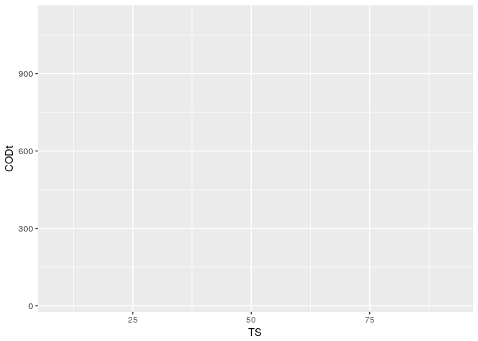<!-- -->

We now have chosen the **geometric object (geom)** with which to plot our data, in this case a point. A geom could be a line, a bar, a boxplot - you can type geom_ and then `Tab` to see all of the available options. *Autocomplete* can also be helpful for remembering syntax.


```r
ggplot(ndat, aes(x=TS, y=CODt)) + geom_point() 
```

<!-- -->

The data looks like there are two groupings. My guess would be that this is for the 2 different countries. We can easily test this by colouring our points by Country. Look at the structure of ndat in either the Global Environment or using `str()`. Note that Country is a factor. A colour will be chosen for each factor level. A legend will be automatically created for you. 

The **aesthetic** of colour which is mapped to Country can be specified when 'x' and 'y' (the data to be plotted) are specified using `aes()`. Colour can alternatively be specified using `geom_point(aes())` since it is a description of the points being plotted. I usually do the former, because it is more likely that I will change *how* I plot a figure (points, lines, bars) versus *what* I plot in a figure (TS, CODt, Country). There are minor implications for each of these choices.


```r
ggplot(ndat, aes(x=TS, y=CODt, colour = Country)) + geom_point() 
```

<!-- -->

```r
#is equivalent-ish to
ggplot(ndat, aes(x=TS, y=CODt)) + geom_point(aes(colour = Country)) 
```

<!-- -->

Some of our data points seem to be crushed near the x-axis. We can **scale** the y-axis to fix this. When we start customizing our plot, our code starts to get a bit harder to read on one line. We can create each specification on a new line by ending each line with `+`. 


```r
ggplot(ndat, aes(x=TS, y=CODt, colour = Country)) + 
  geom_point() + 
  scale_y_log10()
```

<!-- -->

####Faceting

**Faceting** allows us to split our data into groups. Note that I have removed the colour. It is good data visualization practice to only have one attribute (colour, shading, faceting, symbols) per grouping.


```r
ggplot(ndat, aes(x=TS, y=CODt)) + 
  geom_point() +
  scale_y_log10() +
  facet_grid(~Country)
```

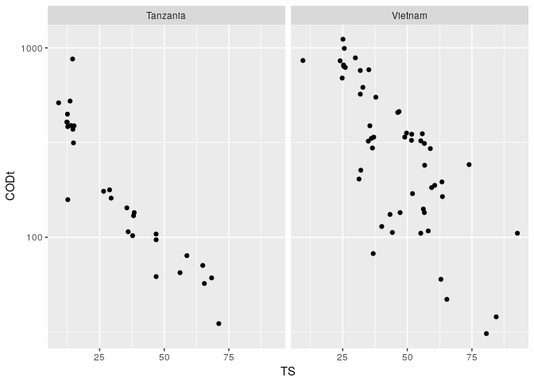<!-- -->

I could now add information from another variable as a colour in this plot. Note that if a variable is continuous instead of discrete, the colour will be a gradient.


```r
ggplot(ndat, aes(x=TS, y=CODt, colour = Temp)) + 
  geom_point() +
  scale_y_log10() +
  facet_grid(~Country)
```

<!-- -->

If we really wanted to we could add another variable to the plot by changing the shape attribute. Let's change Country to having 2 shapes and facet by the Depth of the latrine instead. Note that shape can only be used for discrete values. A quick reference key for shapes can be found in the 'Cookbook for R' (http://www.cookbook-r.com/Graphs/Shapes_and_line_types/). 


```r
ggplot(ndat, aes(x=TS, y=CODt, colour = Temp, shape = Country)) + 
  geom_point() +
  scale_y_log10() +
  facet_wrap(~Depth, scales = "free_y")
```

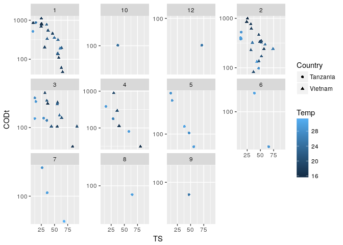<!-- -->

We can now note that only Tanzania had sampling greater than 4cm of depth. There are single latrines for 4 samples. There was no latrine at a depth of 11cm. Lack of replication and a bias towards Tanzania for the higher depths is something we should keep in mind while looking at this data. Depending on the question we are trying to answer, we may want to remove some of this data. 

We can also note that our numbers are being ordered as if they were characters. In the last lesson we created Depth by splitting a sample name. We can change Depth to numeric type, and the numbers will be ordered properly.


```r
ndat$Depth <- as.numeric(ndat$Depth)

ggplot(ndat, aes(x=TS, y=CODt, colour = Temp, shape = Country)) + 
  geom_point() +
  scale_y_log10() +
  facet_wrap(~Depth)
```

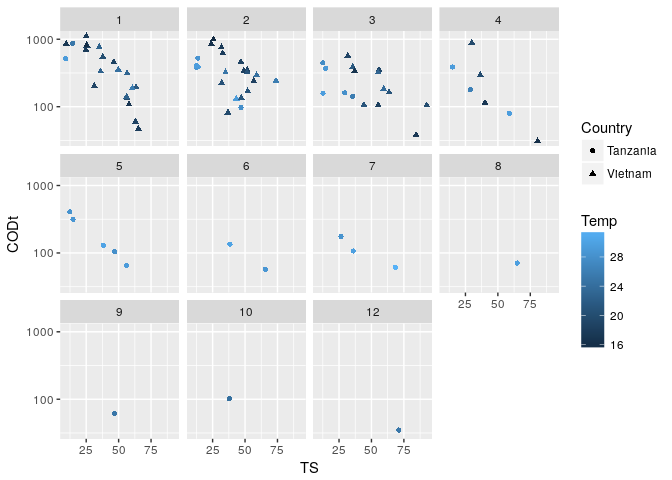<!-- -->

One thing that is not necessary in this case - but good to know about - is the ability to allow each grid to have its own independent axis scale. In our example, wells of Depths from 1-4cm have up to 1000 CODt, while the other wells barely have values past 100 CODt. This can be changed, but keep in mind most people will assume all grids have the same scale, so take extra care to point that the scales are different when presenting or publishing. 


```r
ggplot(ndat, aes(x=TS, y=CODt, colour = Temp, shape = Country)) + 
  geom_point() +
  scale_y_log10() +
  facet_wrap(~Depth, scales = "free_y")
```

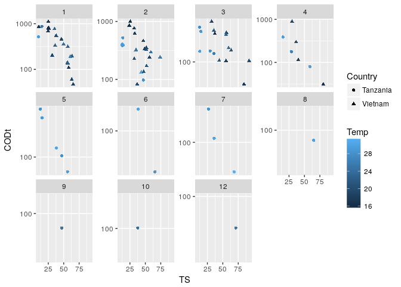<!-- -->

####Regression Lines
You can also add **statistical transformations** to your plots. Again, take a look at stat_ then `Tab` to see the list of options. In this case let's separately fit a linear regression line to CODt vs TS for each country. The grey area around the line is the confidence interval (default=0.95) and can be removed with the additional call to stat_smooth of `se = FALSE`.


```r
ggplot(ndat, aes(x=TS, y=CODt)) + 
  geom_point() +
  scale_y_log10() +
  facet_grid(~Country) +
  stat_smooth(method = lm)
```

<!-- -->

A linear model is not always the best fit. The method of calculating the smoothing function can be changed to other provided functions (such as loess, used below) or can be a custom formula. Note that I changed the confidence interval by modifying `level=0.8`. geoms can be made more transparent with the alpha parameter, which is set to 0.3 in the following code so that the emphasis is on the regression line rather than the points.


```r
ggplot(ndat, aes(x=TS, y=CODt)) + 
  geom_point(alpha = 0.3) +
  scale_y_log10() +
  facet_grid(~Country) +
  stat_smooth(method = loess, level = 0.8)
```

<!-- -->

##Exploring different types of plots

###Density Plots

We are making a density plot for OTUs by Country. I have set alpha (transparency) to 0.3 so that we can see both countries on our plot.


```r
ggplot(dat, aes(x=OTUs, fill=Country, alpha=0.3)) + 
	geom_density() 
```

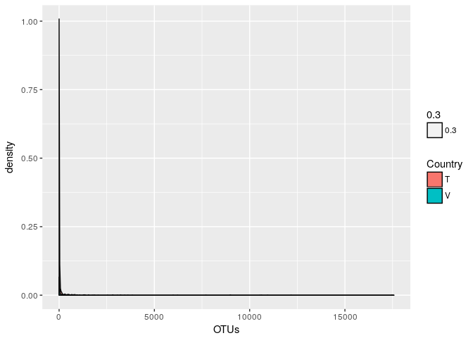<!-- -->

The first thing to notice is that everything is clumped at 0. This is because we have not filtered our data frame to remove all observations where OTUs are zero. Here we filter to have at least 2 OTUs. The other thing to notice is that there is a long tail where there will only be a few observations. It will be necessary to change the x-axis to see our data. This is done by setting 'limits' (lower and upper boundaries) on the x-axis with `xlim()`. Note that R gives us a warning that we are not viewing 158 of our 4212 rows. We can add a rug geom to see each value.


```r
ggplot(dat[dat$OTU >=2,], aes(x=OTUs, fill=Country, alpha=0.3)) + 
	geom_density() +
  geom_rug() +
  xlim(0, 1000)
```

```
## Warning: Removed 158 rows containing non-finite values (stat_density).
```

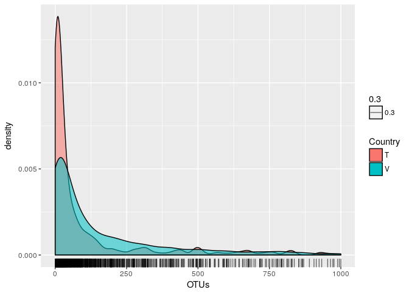<!-- -->

###Histograms

Histograms instead count the number of observations you have in each 'bin' that you specify. The default binwidth is 30, which means your data will be divided into a new bin every 30 units along your x-axis. THIS HAS NOTHING TO DO WITH YOUR DATA!! CHANGE IT!! R will even warn you to change your binwidth.


```r
ggplot(dat[dat$OTU >=2,], aes(x=OTUs, fill=Country, alpha=0.3)) + 
	geom_histogram() +
  xlim(0,1000)
```

```
## `stat_bin()` using `bins = 30`. Pick better value with `binwidth`.
```

```
## Warning: Removed 158 rows containing non-finite values (stat_bin).
```

<!-- -->

Instead of having the countries information stacked, we may want to see the data side by side. This can be done with the parameter position set to 'dodge'. A rug geom can also be added to a histogram. Note that the binwidth has been changed and limits have also been set on the y-axis.


```r
ggplot(dat[dat$OTU >=2,], aes(x=OTUs, fill=Country, alpha=0.3)) + 
	geom_histogram(binwidth = 50, position = "dodge") +
  xlim(0,1000) +
  ylim(0,150) +
  geom_rug()
```

<!-- -->

***
__Challenge__ 


<div style="float:left;margin:0 10px 10px 0" markdown="1">
{width=150px}

</div>

Using the data filtered for OTUs greater than or equal to two, make a violin plot of the distribution of OTUs for each country. Use a log scale. Colour the violin plots by Country. Draw lines across the violin plot where the quantiles (25th, 50th, 75th) are for each plot. What do the widths of the plots represent?


</br>
</br>
</br>

***


###Bar plots

Let's create a bar plot of OTUs per country and use the filled in colour to represent Taxa. 


```r
ggplot(dat, aes(x=Country, y=OTUs, fill=Taxa)) + 
	geom_bar() 
```

    ##Error: stat_count() must not be used with a y aesthetic.

This is a common error because the default for `geom_bar()` is to use the y-axis for a count. To use it for a variable instead, we have to specify `stat="identity"`.


```r
ggplot(dat[dat$OTU >=2,], aes(x=Country, y=OTUs, fill=Taxa)) + 
	geom_bar(stat = "identity") 
```

<!-- -->

####Controlling the order categorical variables in your legend

In the legend for the diagram above our factor levels for Taxa are in *alphabetical order*. However, an ordering that might be more useful would be an order that matches our data, for example, Taxa in descending order of OTUs. To do this, we can use the `forcats` package (included in `tidyverse` and already loaded). `fct_reorder2()` takes the factor we want ordered (Taxa) and orders it by the values given (Country, OTUs). 

We will talk about customizing plots later in this lesson, but the last line of code is one way to remove the legend title (by making the legend title 'blank').


```r
ggplot(dat[dat$OTU >=2,], aes(x=Country, y=OTUs, fill=fct_reorder2(Taxa, Country, OTUs))) + 
	geom_bar(stat = "identity") +
  theme(legend.title = element_blank())
```

<!-- -->

Now our highest abundance Taxa is the first value in our legend, and this matches the order of the Taxa in our bar graph. The legend order now has meaning. The white line in the Vietnam bar graph is a Taxa for which there was an OTU value in Tanzania but no data in Vietnam (since anything <=2 was filtered out of the data set). 


Let's take a second to look at what happens when stat does not equal 'identity'. What is being counted instead of OTUs? Why does the colouring for Taxa look so different?


```r
ggplot(dat, aes(x=Country, fill=Taxa)) + 
	geom_bar() 
```

<!-- -->


You can alternate between 'stacked' or 'dodged' (as we did with the histogram) for whether your bars are on top of each other or next to each other when splitting by a factor or categorical variable.


```r
ggplot(ndat, aes(x=Depth, y=pH, fill = Country)) + 
	geom_bar(stat="identity", position = "dodge") 
```

<!-- -->

You can have your bars horizonal instead of vertical by using `coord_flip()`.


```r
ggplot(ndat, aes(x=Depth, y=pH, fill = Country)) + 
	geom_bar(stat="identity", position = "dodge") +
  coord_flip()
```

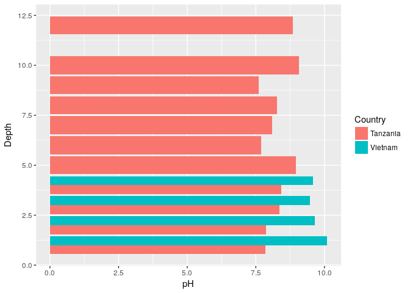<!-- -->

###Circular Plots

In `ggplot2`, circular plots are related to bar graphs - they just have different *coordinate systems*. The default coordinate system is cartesian coordinates, and we need to switch to polar coordinates to make a circle. This is a Coxcomb plot - pH levels increase as you move up the outer rings, and depth increases as you move clockwise around the circle. Colour is still represented by country. 


```r
ggplot(ndat, aes(x=Depth, y=pH, fill = Country)) + 
	geom_bar(stat="identity", position = "dodge") +
  coord_polar()
```

<!-- -->

To make your classic pie chart, use theta to specify what variable is going to be used to make up the angles (width of pie slices). To wrap to a full circle instead of having sections (as in the above Coxcomb plot), the width is set to one.


```r
ggplot(dat, aes(x="", y=Country, fill = Country)) + 
	geom_bar(stat = "identity", width = 1) +
  coord_polar(theta = "y")
```

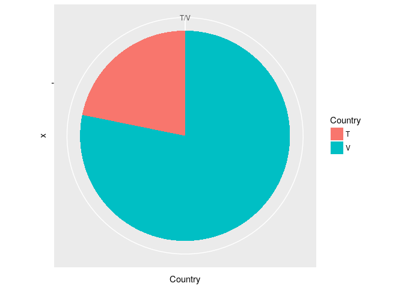<!-- -->


###Lines 

To draw a line graph, we select `geom_line()`. 


```r
ggplot(ndat, aes(x=Temp, y=pH)) + geom_line() 
```

<!-- -->

We can colour the lines for the different countries. Looking at our previous graph, what must have happened when these values were over the same range?


```r
ggplot(ndat, aes(x=Temp, y=pH, colour = Country)) + geom_line() 
```

<!-- -->

####Error bars

To plot error bars, we need to give the geom, `geom_errorbar()`, and the interval over which we want to draw the bar. This interval is usually one standard deviation, one standard error or a confidence interval. 

Luckily, we have learned how to calculate the mean and standard deviation with `dplyr`. Once we have that, all we need to do is add or subtract the standard deviation from our data points to get the bounds of the error bar. 

`geom_errorbar()` takes these bounds passed to the parameters ymax and ymin. In this case, since there were no sample replicates the standard deviation is taken from the mean of all of the soil readings in a given country at a given depth.


```r
errdat <- ndat %>% group_by(Country, Depth) %>% mutate(mean_pH = mean(pH)) %>% mutate(sd_pH= sd(pH))

ggplot(errdat, aes(x=Temp, y=pH, colour = Country)) + 
  geom_line() + 
  geom_errorbar(aes(ymin=pH-sd_pH, ymax = pH+sd_pH), width = 0.2, alpha = 0.4)
```

<!-- -->


###Stripplots

The first plots we made we scatterplots with 2 continuous variables. With one discrete variable and one categorical variable, we can make a stripplot. We use the point geom for both of these types of plots.


```r
ggplot(dat, aes(x = Depth, y = OTUs)) + geom_point() 
```

<!-- -->

Again, we have a lot of values crushed near the x-axis. If we add log scaling to the y-axis, we get an error that this transformation created infinite values. This is because we have zeros in our data set. 

```r
ggplot(dat, aes(x = Depth, y = OTUs)) +
  geom_point() +
  scale_y_log10() 
```

```
## Warning: Transformation introduced infinite values in continuous y-axis
```

<!-- -->

Knowing this, we could ignore the warning, or add +1 to each OTU (negligable on a log scale).


```r
ggplot(dat, aes(x = Depth, y = (OTUs+1))) +
  geom_point() +
  scale_y_log10() 
```

<!-- -->

In order to see the points a little better, we can 'jitter' them. Jittering spreads out our data points while keeping them in the same area of the plot so we can get an idea of density.


```r
ggplot(dat, aes(x = Depth, y = (OTUs+1))) +
  geom_point(position = "jitter") +
  scale_y_log10() +
  facet_wrap(~Country)
```

<!-- -->


###Bubble Plots

With bubble plots, we need to provide the size of our bubbles in a way that is proportional to our data, and provide a scale to map these to.

Let's group our OTUs by Country and Taxa and look at the Taxa for the top 30 OTUs. As a refresher, try to do this using `dplyr` functions.
 
We are going to make our bubbles (which can be thought of as large points) with `geom_jitter()` so that our bubbles don't overlap. Remember that we want to specify what we are plotting with **aesthetics**. We want the bubbles representing OTUs_per_Taxa, so we divide each value by pi when calling size.


```r
bdat <- dat %>% 
  group_by(Taxa, Country) %>% 
  mutate(OTUs_per_Taxa = sum(OTUs)) %>% 
  arrange(desc(OTUs_per_Taxa)) %>%
  select(Taxa, Country, OTUs_per_Taxa) %>%
  unique() %>%
  .[1:30,]

ggplot(bdat, aes(x = Country, y = OTUs_per_Taxa, fill=Taxa)) +
  scale_y_log10() +
  geom_jitter(aes(size = OTUs_per_Taxa/pi), pch = 21, show.legend = TRUE)  +
  guides(fill = FALSE)
```

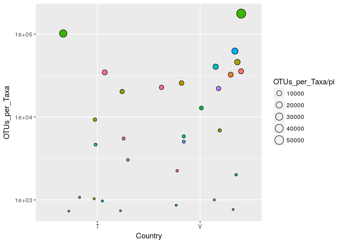<!-- -->

However, it is hard to tell proportionally how different these sizes are. Mapping values to a scale gives us more of an idea of their relative sizes. This is done by giving a range of values to `scale_size_continuous()`. This range is the size you want your plotting symbols (bubbles) to be after transformation. You can use trial and error to see what range you like; it is not changing your data, but rather your perception of the data.


```r
ggplot(bdat, aes(x = Country, y = OTUs_per_Taxa, fill=Taxa)) +
  scale_y_log10() +
  geom_jitter(aes(size = OTUs_per_Taxa/pi), pch = 21, show.legend = FALSE) + 
  scale_size_continuous(range=c(1,30)) +
  guides(fill=FALSE)
```

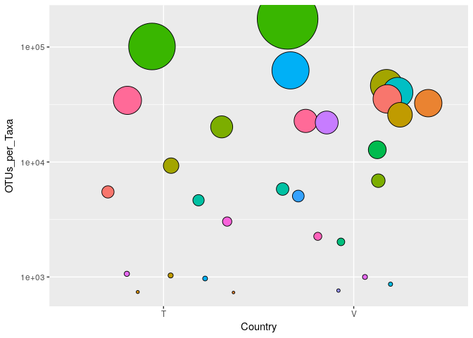<!-- -->

####Labelling Data Points

`ggplot2` provides 2 methods of labelling: `geom_label()` and `geom_text()`. Let's look at the help menu to find out what the difference between them is. 

We have to specify with **aesthetics** what we are plotting for our label. 


```r
ggplot(bdat, aes(x = Country, y = OTUs_per_Taxa, fill=Taxa)) +
  scale_y_log10() +
  geom_jitter(aes(size = OTUs_per_Taxa/pi), pch = 21, show.legend = FALSE) + 
  scale_size_continuous(range=c(1,30)) +
  geom_label(aes(label = Taxa), show.legend = FALSE)
```

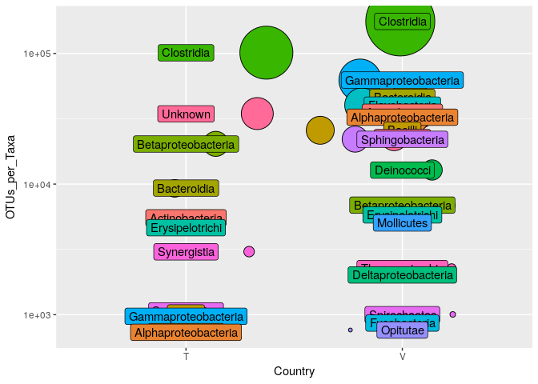<!-- -->

This isn't fantastic because our labels are overlapping. What parameters might you be able to use to move the labels? Try using them to get the labels to not overlap.

The text geom has an option to check for overlap of labels. `geom_text()` does not provide a background for the label, and it may be harder to tell which label belongs to each data point.


```r
ggplot(bdat, aes(x = Country, y = OTUs_per_Taxa, fill=Taxa)) +
  scale_y_log10() +
  geom_jitter(aes(size = sqrt(OTUs_per_Taxa/pi)), pch = 21, show.legend = FALSE) + 
  scale_size_continuous(range=c(1,30)) +
  geom_text(aes(label = Taxa), check_overlap = TRUE, show.legend = FALSE)
```

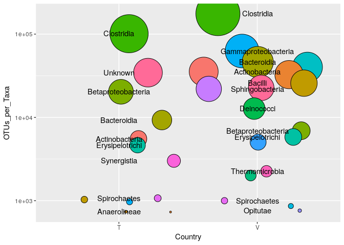<!-- -->

What happened here? Why don't we have as many labels? Look in the help menu to explain this behaviour.

I don't like futzing with label positions, so I went looking for a package that would do this for me. `ggrepel` will 'repel' your labels away from each other without getting rid of them. Let's check it out with our bubble plot labels. Install and load `ggrepel`. The equivalent function we can use is `geom_label_repel()`. The force parameter allow you to modify how far you want your labels pushed away from each other. 

Here, the box colour is being used to map to our data points but `ggrepel` can instead connect a line to data points by altering the value of segment.size. Variations on use can be found here: https://cran.r-project.org/web/packages/ggrepel/vignettes/ggrepel.html.


```r
library(ggrepel)

ggplot(bdat, aes(x = Country, y = OTUs_per_Taxa, fill=Taxa)) +
  scale_y_log10() +
  geom_jitter(aes(size = sqrt(OTUs_per_Taxa/pi)), pch = 21, show.legend = FALSE) + 
  scale_size_continuous(range=c(1,30)) +
  geom_label_repel(aes(label = Taxa), force = 2, show.legend = FALSE, segment.size = 0)
```

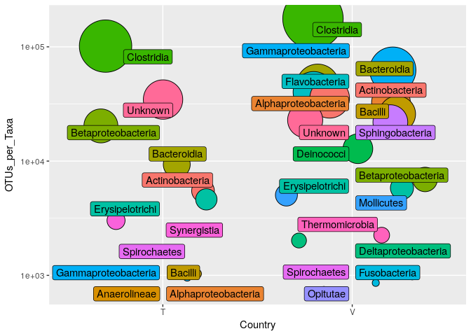<!-- -->

###Boxplots

Boxplots are a great way to visualize summary statistics for your data. As a reminder, the thick line in the center of the box is the median. The upper and lower ends of the box are the first and third quartiles (or 25th and 75th percentiles) of your data. The whiskers extend to the largest value no further than 1.5*IQR (inter-quartile range - the distance between the first and third quartiles). Data beyond these whiskers are considered outliers and plotted as individual points. This is a quick way to see how comparable your samples or variables are.

We are going to use boxplots to see the distribution of OTUs per Taxa across all samples.


```r
ggplot(dat, aes(x = Taxa, y = OTUs)) +
  geom_boxplot() 
```

<!-- -->

While we are going to address customization and what theme elements are shortly, but I think showing you now how to rotate the x-axis labels is appropriate. Essentially we are taking the text on the x-axis and rotating it by 90 degrees.


```r
ggplot(dat, aes(x = Taxa, y = OTUs)) +
  geom_boxplot() +
  theme(axis.text.x = element_text(angle=90))
```

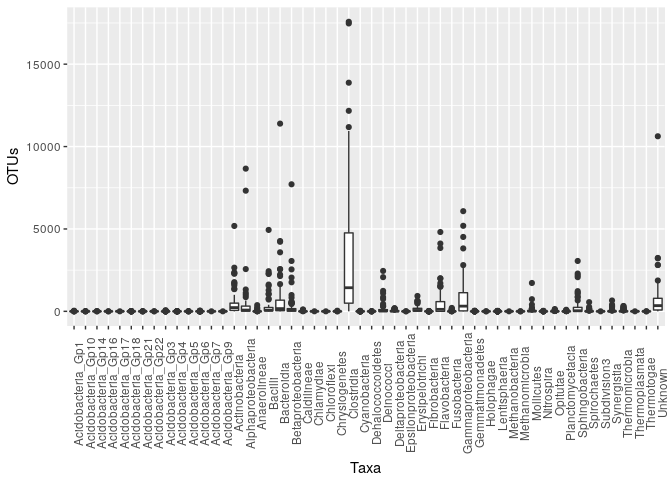<!-- -->

We then justify the labels such that they align with the x-axis. 

You may ask why this is a horizontal (hjust) justification, when it seems like moving the labels upwards towards the x-axis should be a vertical (vjust) justification. If you look in the help menu at `element_text()` you will see that the justification is carried out before the rotation. While we can specify the parameters of `element_text()` in any order, this does not change the order they are executed in the function.     


```r
ggplot(dat, aes(x = Taxa, y = OTUs)) +
  geom_boxplot() +
  theme(axis.text.x = element_text(angle=90, hjust = 1))
```

<!-- -->
</br> 

While it is clear that Clostridia is the most represented taxa, it is difficult to tell whether some other taxa have no representation, or if they are lowly represented. Transforming to a log scale on the y-axis will sort this out for us.


```r
ggplot(dat, aes(x = Taxa, y = OTUs)) +
  geom_boxplot() +
  theme(axis.text.x = element_text(angle=90, hjust=1)) +
  scale_y_log10()
```

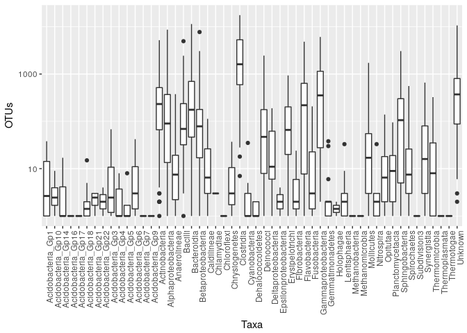<!-- -->

We could also clean this plot up a bit by removing those taxa with 1 or fewer OTUs as well as the condition that a taxa must be present in more than 1 sample.


```r
keep <- dat %>%
  filter(OTUs>=2) %>%
  group_by(Taxa) %>%
  summarize(n = n()) %>%
  filter(n > 1) %>%
  select(Taxa)

ggplot(dat[dat$Taxa %in% keep$Taxa,] , aes(x = Taxa, y = OTUs)) +
  geom_boxplot() +
  theme(axis.text.x = element_text(angle=90, hjust=1)) +
  scale_y_log10()
```

<!-- -->

If we facet by country we can see that Acidobacteria_Gp1, for example, is only found in Vietnam and not Tanzania. 


```r
ggplot(dat[dat$Taxa %in% keep$Taxa,] , aes(x = Taxa, y = OTUs)) + 
  geom_boxplot() + 
  theme(axis.text.x = element_text(angle=90, hjust=1)) + 
  scale_y_log10() + 
  facet_grid(~Country)
```

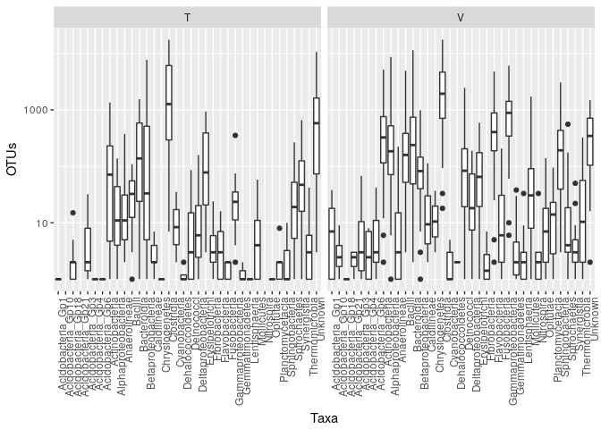<!-- -->

For now, let's just keep the Taxa that are common to both countries.


```r
keep <- dat %>% 
  filter(OTUs>=2) %>% 
  group_by(Country, Taxa) %>% 
  summarize(n = n()) %>% 
  filter(n > 1) 

keep <- unique(keep[duplicated(keep$Taxa),"Taxa"])

# keep <- dat %>% 
#   filter(OTUs >=2) %>% 
#   group_by(Country, Taxa) %>% 
#   summarize(n = n()) %>% 
#   filter(n >1) %>% 
#   ungroup() %>%
#   select(Taxa) %>%
#   .[duplicated(.),] %>%
#   unique()
  

ggplot(dat[dat$Taxa %in% keep$Taxa,] , aes(x = Taxa, y = OTUs)) + 
  geom_boxplot() + 
  theme(axis.text.x = element_text(angle=90, hjust=1)) + 
  scale_y_log10() + 
  facet_grid(~Country)
```

<!-- -->

We will be using this graph as a base for customization later in the lesson.

###Beeswarm Plots

Even though boxplots give us summary statistics on our data, it is useful to be able to see where our data points are. Adding the data as another layer using `geom_point()` plots our data in the form of a stripplot on top of our boxplots. It would be nice to see how many points we have at each OTU value, but there are a lot of points overlapping here. I have subset the data to 4 Taxa and 1 Country so that we can see the differences in the next geom options a bit better.

An option with `ggplot2` is to save your plot into a *ggplot object*. This works well if you know you are only changing one or two elements of your plot, and you do not want to keep retyping code. What we are going to vary here is how the data points are displayed.


```r
b <- ggplot(dat[(dat$Taxa=="Clostridia" | dat$Taxa == "Gammaproteobacteria" | dat$Taxa == "Unknown" | dat$Taxa == "Bacilli") & dat$Country == "T",] , aes(x = Taxa, y = OTUs)) + 
  geom_boxplot() +
  theme(axis.text.x = element_text(angle=90, hjust=1)) + 
  scale_y_log10()

b + geom_point()
```

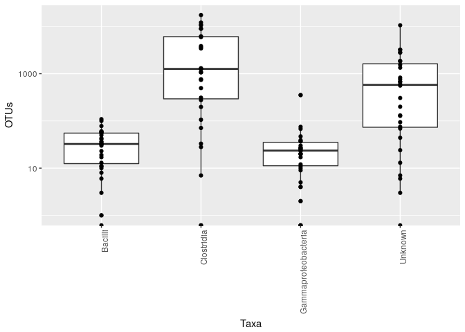<!-- -->

Jittering the points gives a general idea of the distribution, but is a bit too widely dispersed to give a good sense of the data.


```r
b + geom_jitter()
```

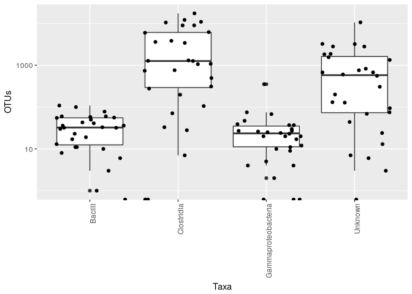<!-- -->

A beeswarm plot places data points that were overlapping next to each other, so we can get a better picture of the distribution of points. We simply overlay the points with `geom_beeswarm()`.


```r
library(ggbeeswarm)

b + geom_beeswarm()
```

<!-- -->


Increasing the spacing between data points (increasing 'cex') can make this distribution a bit clearer.


```r
b + geom_beeswarm(cex = 2.2) 
```

<!-- -->

Using `geom_quasirandom()` gives the empirical distribution of the stripplot to avoid overplotting.


```r
b + geom_quasirandom(varwidth = TRUE) 
```

<!-- -->


Other spacing and distribution options are available at https://github.com/eclarke/ggbeeswarm.


##Customization

</br>

{width=300px} 

</br>
</br>

###Attributes Related to Your Data

Plot elements relating to your data include things like axis labels, titles, colour or shapes that represent subsets of your data, scaling that is data-dependent, legends, and other data-driven parameters. 

For customizing your data it is possible to change:

- colour()
- fill()
- shape()
- size()
- alpha()

Titles and axis labels can be added using:

- ggtitle()
- xlab()
- ylab()

We have seen in the above examples that colour can be applied to discrete or continous variables. We can also use colour (shape, etc.) to represent outliers. In this data set outliers beyond the whiskers (above or below 1.5*IQR) can be coloured red.

I also want to add a title, modify the y-axis label to say that the data is log, and remove the x-axis label. Note that I remove the x-axis label by using 'NULL'.


```r
ggplot(dat[dat$Taxa %in% keep$Taxa,] , aes(x = Taxa, y = OTUs, fill = Taxa)) + 
  geom_boxplot(outlier.colour = "red") + 
  scale_y_log10() + 
  facet_grid(~Country) +
  ggtitle("Abundance of Taxa by Country") +
  xlab(NULL) +
  ylab("log(OTUs)") + 
  guides(fill=FALSE) 
```

<!-- -->

I also want to change my Country labels from a single letter to the country name. This can be done in a couple of ways. 

One way would be to change the values in the dataset. Since we haven't learned string manipulation yet, I will show you a second way, which is to use the `labeller()` function. I can make a vector of the names to replace 'T' and 'V' with. The data is split by Country in the `facet_grid()` and this is where we pass our labels to `labeller()`, which will output the names on the strip label.

I am now going to save this plot in a *ggplot object*, since we are going to use this as our base plot for the next section. (I am also going to rotate the x-axis text again. We will talk about theme elements soon, but in the meantime it won't drive me bonkers.)


```r
labels <- c(T = "Tanzania", V = "Vietnam")

p <- ggplot(dat[dat$Taxa %in% keep$Taxa,] , aes(x = Taxa, y = OTUs, fill = Taxa)) + 
  geom_boxplot(outlier.colour = "red") + 
  scale_y_log10() + 
  facet_grid(~Country, labeller = labeller(Country = labels)) +
  ggtitle("Abundance of Taxa by Country") +
  xlab(NULL) +
  ylab("log(OTUs)") +
  guides(fill=FALSE) + 
  theme(axis.text.x = element_text(angle=90, hjust=1))

p
```

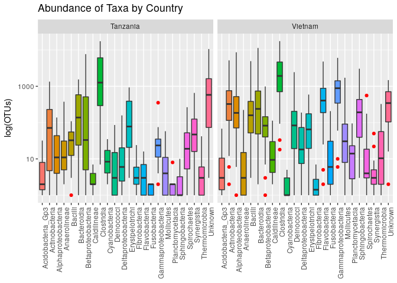<!-- -->

A common thing to want to do is to change colours from `ggplot2`'s rainbow color scheme. Let's create our own colour palette for Taxa.

###A Note on Colour Palettes

There are 3 main types of colour palettes.

1. *Sequential* - implies an order to your data -  ie. light to dark implies low values to high values.


```r
library(RColorBrewer)

display.brewer.all(type = "seq")
```

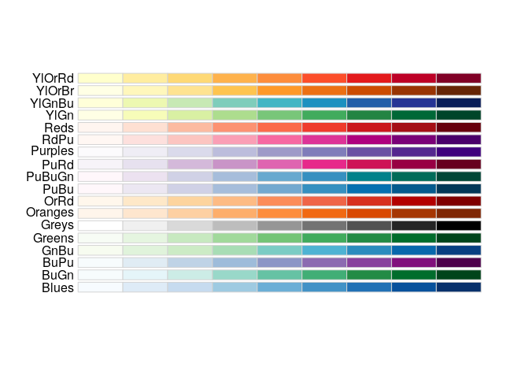<!-- -->

2. *Diverging* - low and high values are extremes, and the middle values are important - still goes from light to dark, but 3 colours mainly used.


```r
display.brewer.all(type = "div")
```

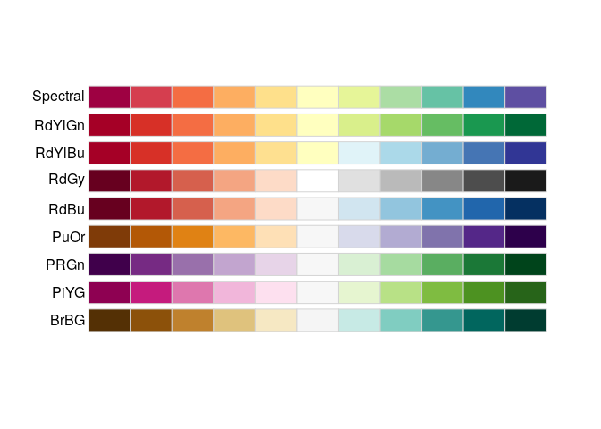<!-- -->

3. *Qualitative* - there is no quantitative relationship between colours. This is usually used for categorical data.


```r
display.brewer.all(type = "qual")
```

<!-- -->

Which of these types is `ggplot2`'s default color palette?

Let's test one of the `RColorBrewer` palettes out on our data.


```r
p + scale_fill_brewer(palette = "Spectral")
```

<!-- -->

Many colour palettes now exist. I'll showcase a couple that work nicely with `ggplot2`. These packages also have colorblind friendly options. `RColorBrewer` has options for these 3 types of palettes, which you can see with `display.brewer.all()`. With a smaller dataset, we could make a call in `ggplot` directly to `scale_fill_brewer()`, which just requires a choice of one of `RColorBrewer`'s palettes, such as "Spectral". However, we have 24 Taxa and these palettes have 8-12 colours, so we have to get creative.


I have simply taken the 2 qualitative palettes that each have a length of 12, put them into one palette, and made sure my values were unique. This can then be passed to `ggplot` via `scale_fill_manual()`. 


```r
palette1 <- brewer.pal(12, "Paired")
palette2 <- brewer.pal(12, "Set3")

custom <- c(palette1, palette2)

length(unique(custom))
```

```
## [1] 24
```

```r
p + scale_fill_manual(values = custom)
```

<!-- -->


You can always choose a vector of your own colors using this 'R color cheatsheet' (https://www.nceas.ucsb.edu/~frazier/RSpatialGuides/colorPaletteCheatsheet.pdf).

Names of colours as well as colour codes are accepted.

`scale_fill_manual(values=c("purple", "cornflowerblue", "grey", "yellow", "orange", "FF0000"))`


The `viridis` package also has some nice color palettes (https://cran.r-project.org/web/packages/viridis/vignettes/intro-to-viridis.html). I think they might all be diverging palettes (qualitative is best for our Taxa), but I will showcase a couple here.


```r
library(viridis)

p + scale_fill_viridis(discrete = TRUE)
```

<!-- -->

```r
p + scale_fill_viridis(discrete = TRUE, option = "plasma")
```

<!-- -->


`RSkittleBrewer` is another option for funky colour palettes.
`ggsci` has a variety of color palettes inspired by different scientific journals as well as television shows (https://cran.r-project.org/web/packages/ggsci/vignettes/ggsci.html).


###Theme: Attributes Unrelated to Your Data

As mentioned earlier, it is possible to customize every single aspect of a `ggplot`. Most of this occurs with a call to `theme()`, which you can think of as modifying everything BUT your data. For example, my axis labels can be modified, but they (hopefully) have something to do with my data. However, changing the size of the text or the font of the labels is unrelated to my data, and the same structure (text font & size) could be carried over to other plots if I saved my own theme.

Things that you can change with `theme()` include the axis, legend, panels, gridlines, or background.

Each *element* of a theme inherits from one of: 

- element_text (text elements like font, colour, size, face (bold, italics), alignment), 
- element_line (grid lines, axis lines), 
- element_rect (panels and backgrounds - colour, size, fill), 
- element_blank (assigns nothing, usually when you are trying to get rid of something), 
- element_grob (making a grid grob).

`ggplot2` comes with some themes - I suggest starting with the one that is close to what you want, and start modifying from there.

Check out these *themes*:

- theme_minimal()
- theme_classic()
- theme_bw()
- theme_void()
- theme_dark()
- theme_gray()
- theme_light()

You can look at the default for each theme simply by typing it into the console.


```r
theme_bw
```

```
## function (base_size = 11, base_family = "") 
## {
##     theme_grey(base_size = base_size, base_family = base_family) %+replace% 
##         theme(panel.background = element_rect(fill = "white", 
##             colour = NA), panel.border = element_rect(fill = NA, 
##             colour = "grey20"), panel.grid.major = element_line(colour = "grey92"), 
##             panel.grid.minor = element_line(colour = "grey92", 
##                 size = 0.25), strip.background = element_rect(fill = "grey85", 
##                 colour = "grey20"), legend.key = element_rect(fill = "white", 
##                 colour = NA), complete = TRUE)
## }
## <environment: namespace:ggplot2>
```

And this is what `theme_bw()` practically looks like:


```r
p + theme_bw()
```

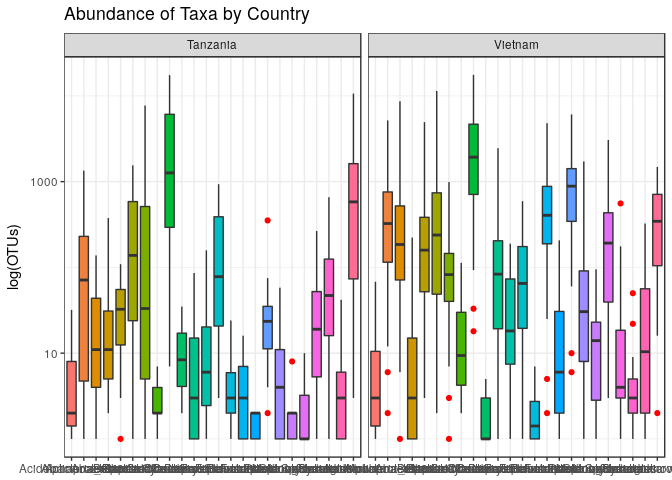<!-- -->

Note that the last call to theme overrides my previous call to theme if there is a conflict (in this case the angle of the x-axis text). Here is an example of `theme_dark()`. I am going to override the default x-axis text angle of this theme by modifying it AFTER I call `theme_dark()`.


```r
p + theme_dark() + 
  theme(axis.text.x = element_text(angle=90, hjust=1))
```

<!-- -->

`ggthemes` is a package of themes. Some of these themes are based off of graphs seen in print or on websites (the economist, wall street journal, fivethirtyeight) or to match standard tools (excel, google docs). Information about these themes can be found at https://github.com/jrnold/ggthemes.

Here are 2 possible themes.


```r
library(ggthemes)
p + theme_economist()
```

<!-- -->


```r
p + theme_stata()
```

<!-- -->

You can also make your own custom theme as demoed here: http://joeystanley.com/blog/custom-themes-in-ggplot2


I am going to show you how to customize a plot, starting from `theme_minimal()` because I don't like the grey backgrounds or harsh axis lines.


```r
p + theme_minimal()
```

<!-- -->
</br>

Things I don't like about this plot and their solutions: 

<table class="table" style="width: auto !important; margin-left: auto; margin-right: auto;">
 <thead>
  <tr>
   <th style="text-align:left;"> Problem </th>
   <th style="text-align:left;"> Solution </th>
  </tr>
 </thead>
<tbody>
  <tr>
   <td style="text-align:left;font-style: italic;border-right:1px solid;"> x-axis labels overlap </td>
   <td style="text-align:left;width: 40em; "> rotate lables: axis.text.x = element_text(angle =90, hjust=1) </td>
  </tr>
  <tr>
   <td style="text-align:left;font-style: italic;border-right:1px solid;"> country labels are smaller than axis labels </td>
   <td style="text-align:left;width: 40em; "> change size and face: strip.text.x = element_text(face = 'bold', size = 16) </td>
  </tr>
  <tr>
   <td style="text-align:left;font-style: italic;border-right:1px solid;"> title is uncentered </td>
   <td style="text-align:left;width: 40em; "> adjust horizontally: plot.title = element_text(hjust=0.5, size = 18) </td>
  </tr>
  <tr>
   <td style="text-align:left;font-style: italic;border-right:1px solid;"> border to separate countries </td>
   <td style="text-align:left;width: 40em; "> create a border: panel.border = element_rect(fill = NA) </td>
  </tr>
  <tr>
   <td style="text-align:left;font-style: italic;border-right:1px solid;"> make y axis ticks </td>
   <td style="text-align:left;width: 40em; "> create y axis ticks: axis.ticks.y = element_line() </td>
  </tr>
</tbody>
</table>


It isn't necessary to remember all of this syntax, I frequently find myself back at the help page at http://ggplot2.tidyverse.org/reference/theme.html.

As mentioned the last call to `theme()` will override previous calls that conflict. Therefore, if we want to start with `theme_minimal()` as our base, it has to be in our code BEFORE the other modifications. 


```r
p + 
  theme_minimal() +
  theme(axis.text.x = element_text(angle = 90, hjust = 1),
        panel.border = element_rect(fill=NA),
        strip.text.x = element_text(face = "bold", size = 16),
        plot.title = element_text(hjust=0.5, size = 18),
        axis.ticks.y = element_line())
```

<!-- -->

***
__Challenge__ 


<div style="float:left;margin:0 10px 10px 0" markdown="1">
{width=150px}

</div>

Change the colour of the plot background. Add minor gridlines, and make the major gridlines black. Increase the spacing in between the panels.


</br>
</br>
</br>


***
##Taking it up a notch

There are many fantastic R packages to analyze and visualize your data. As a group, we are likely working in a variety of specialized areas. The plots we have made so far today should be useful for data exploration for many different kinds of data. In the next section we are going to preview some more complex visualization types, but since these take more time to go through and not everyone may be interested in network diagrams, time-series analysis, or geospatial data, we will not be plotting all of these together. We will, however do an interactive heatmap and also an upset plot.  If you are interested in a tutorial on one of these other visualization types, please indicate that in the comments area of the lesson survey (https://www.surveymonkey.com/r/VNQZ3KS). 


###Interactive graphics 
**Packages**

Plotly: https://plot.ly/r/

ggvis: http://ggvis.rstudio.com/interactivity.html

Heatmaps: https://github.com/talgalili/heatmaply

Interactive time-series data: https://rstudio.github.io/dygraphs/

####Correlation Plots and Heatmaps

One common way to look for outliers or trends in data is to calculate the correlation coefficients between samples and make a correlation plot. Since the `cor()` function expects samples to be in columns and observations in rows, this is an example of where you would use 'wide' data. The default correlation coefficient is the Pearson correlation, but others (Kendall, Spearman) can be specified. `cor()` takes in a matrix of numeric data only.

Read in the wide version of our OTU table, keeping the Taxa as rownames since the matrix can only contain numeric data. Samples (the Country, Latrine Number and Depth combination) are in columns. We do not have any missing data in this example. Make sure to look at the help menu if you have 'NA's in your data to select which values to use as 'NA' will propogate through your matrix.


```r
cdat <- read.csv("data/SPE_pitlatrine.csv", row.names = 1)

cdat <- cor(cdat, method = "pearson", use = "complete.obs")
```

The output correlation matrix must be converted into long format before we can make our plot. Our data must first be converted to a data frame to use our `dplyr` and `tidyr` tools. We convert the matrix to a data frame, save the rownames as 'Site1', gather our column names ('Site2') and their values, making sure to retain 'Site1' information.

A heatmap can be made with `ggplot` by using the tile geom. The fill is now the correlation coefficient, which is a continuous variable (hence the gradient). I have changed the title of the legend from 'value' to 'Pearson Correlation' by using `scale_fill_continuous()`. The `\n` included in the name is a line break. A fantastic resource for modifying legends is http://www.cookbook-r.com/Graphs/Legends_(ggplot2)/.


```r
clong <- as.data.frame(cdat) %>% 
  rownames_to_column("Site1") %>% 
  gather(key = "Site2", value = "correlation", -Site1)

ggplot(clong, aes(Site1, Site2, fill = correlation)) + 
  geom_tile() +
  xlab(NULL) +
  ylab(NULL) +
  scale_fill_continuous(name = "Pearson\nCorrelation") +
  theme(axis.text.x = element_text(angle =90, hjust=1)) 
```

<!-- -->


If this looks a little jarring to you compared to 'normal' heatmaps, it is probably because the data has not been ordered yet. This can be done by calculating the distance between samples (ie. euclidean - *sqrt(sum((x_i - y_i)^2))*) and then clustering them in a hierarchical way (joining the most similiar samples, iteratively, until all samples are clustered).

`dist()` computes the distance between rows of a matrix and `hclust()` clusters the output of `dist()`. Once we reorder our correlation matrix, we then convert it to long format for plotting as before.


```r
distance <- dist(cdat)
clust <- hclust(distance)
cdat <- cdat[clust$order, clust$order]

clong <- as.data.frame(cdat) %>% 
  rownames_to_column("Site1") %>% 
  gather(key = "Site2", value = "correlation", -Site1)


# cdat <- read.csv("SPE_pitlatrine.csv", row.names=1)
# cdat <- cor(cdat, method = "pearson", use = "complete.obs")
# 
# clevels <- rownames(cdat)
# 
# 
# clong <- as.data.frame(cdat) %>% 
#   rownames_to_column("Site1") %>% 
#   gather(key = "Site2", value = "correlation", -Site1)
# 
# clong$Site1 <- factor(clong$Site1, levels = clevels, labels = clevels)
# clong$Site2 <- factor(clong$Site2, levels = clevels, labels = clevels)
# 
# ggplot(clong, aes(Site1, Site2, fill = correlation)) +
#          geom_tile() +
#          xlab(NULL) +
#          ylab(NULL) +
#         scale_fill_gradient(name= "Pearson\nCorrelation", low = "red", high = "yellow")+
#         theme(axis.text.x = element_text(angle = 90, hjust = 1))
#         
# distance <- dist(cdat)
# clust <- hclust(distance)
# fdat <- cdat[clust$order, clust$order]
# 
# levels <- rownames(fdat)
# 
# flong <- as.data.frame(fdat) %>% 
#   rownames_to_column("Site1") %>% 
#   gather(key = "Site2", value = "correlation", -Site1)
# 
# flong$Site1 <- factor(flong$Site1, levels = levels, labels = levels)
# flong$Site2 <- factor(flong$Site2, levels = levels, labels = levels)
# 
# ggplot(flong, aes(Site1, Site2, fill = correlation)) +
#   geom_tile() +
#   xlab(NULL) +
#   ylab(NULL) +
#   scale_fill_gradient(name= "Pearson\nCorrelation", low = "red", high = "yellow")+
#   theme(axis.text.x = element_text(angle = 90, hjust = 1))
```


To have a different colour scheme that for example, goes from red to yellow, you can use `scale_fill_gradient()` and specify what you want the diverging colours to be. Note that your legend title now derives from this gradient. 


```r
ggplot(clong, aes(Site1, Site2, fill = correlation)) + geom_tile() +
  scale_fill_gradient(name = "Pearson\nCorrelation", low = "red", high = "yellow") +
  xlab(NULL) +
  ylab(NULL)+
  theme(axis.text.x = element_text(angle =90, hjust=1, size =5), legend.title = element_text(size=10), axis.text.y = element_text(size=5)) 
```

<!-- -->

We can now see that there is a patch of dark red samples with low correlation. It is difficult to see which sites these are as the names are a bit small. 

Enter the interactive heatmap! `Plotly` allows for interactive plots in a variety of languages, and allows the creation of sharable links (if you are interested sign up for a free account to get API (Application Programming Interface) credentials https://plot.ly/r/getting-started/). They have created a package, which, luckily for us, interfaces seamlessly with `ggplot2`. We only need to save our plot and call the function `ggplotly()` to have an interactive graph! 

The response of plotly to manipulations other than hovering can be a bit slow if not using the API and may freeze/crash R, so I recommend saving your code before trying it.  


```r
library(plotly)
p <- ggplot(clong, aes(Site1, Site2, fill = correlation)) + geom_tile() +
  scale_fill_gradient(name = "Pearson\nCorrelation", low = "red", high = "yellow") +
  xlab(NULL) +
  ylab(NULL)+
  theme(axis.text.x = element_text(angle =90, hjust=1), legend.title = element_text(size=10)) 

ggplotly(p)
```

<!--html_preserve--><div id="4a4135370070" style="width:672px;height:480px;" class="plotly html-widget"></div>
<script type="application/json" data-for="4a4135370070">{"x":{"data":[{"x":[1,2,3,4,5,6,7,8,9,10,11,12,13,14,15,16,17,18,19,20,21,22,23,24,25,26,27,28,29,30,31,32,33,34,35,36,37,38,39,40,41,42,43,44,45,46,47,48,49,50,51,52,53,54,55,56,57,58,59,60,61,62,63,64,65,66,67,68,69,70,71,72,73,74,75,76,77,78,79,80,81],"y":[1,2,3,4,5,6,7,8,9,10,11,12,13,14,15,16,17,18,19,20,21,22,23,24,25,26,27,28,29,30,31,32,33,34,35,36,37,38,39,40,41,42,43,44,45,46,47,48,49,50,51,52,53,54,55,56,57,58,59,60,61,62,63,64,65,66,67,68,69,70,71,72,73,74,75,76,77,78,79,80,81],"z":[[1,0.72535468140901,0.0176241724291311,0.986451580530671,0.983408977518726,0.9732223613365,0.836347018536968,0.979016114447097,0.985292264023641,0.983015656679227,0.968121854501292,0.0178895977903611,0.969143675144259,0.913727508063806,0.523122139585563,0.940223501003818,0.977439555628026,0.969897375998955,0.985830626755473,0.970830142613468,0.971602322825336,0.957432495049906,0.983267668715893,0.389515366031808,0.017796737609297,0.203112520661913,0.0407360742710874,0.500663284720948,0.484136221319313,0.968959808633348,0.985203708473713,0.0662532801198615,0.281523380680104,0.207426046298972,0.338895184118805,0.364322514921425,0.955915044543867,0.968833188825243,0.989750076967415,0.963187546906363,0.958288047508838,0.965293248089177,0.950827156317384,0.948155520955387,0.973869059412108,0.99239746199481,0.734610987462713,0.980301953728452,0.918246047463508,0.880299113023902,0.701976369199751,0.932506421029157,0.614446664582776,0.644629035286511,0.920109461614384,0.927466937928438,0.0500489632976789,0.617217795453049,0.849537158112934,0.875276609904045,0.966146110947225,0.412348793709883,0.590755110587325,0.201921233025152,0.0197781047440865,0.0638117177382929,0.83661817766533,0.841962995872825,0.986125346945499,0.774572586994576,0.458440600740304,0.894250263074842,0.46787053626086,0.956098523256022,0.322094767376877,0.909704529220203,0.763059963667284,0.730496104834214,0.0704783345779285,0.753895440873877,0.942160403197122],[0.72535468140901,1,0.0175750208091274,0.738149418193759,0.73605585812609,0.734646795002282,0.939869151459795,0.739926857572215,0.745605685585307,0.748747261349092,0.825266153767897,0.00666976660800769,0.727761049124858,0.711189687414048,0.401251425758524,0.752065216298789,0.751249742972343,0.749477167632685,0.748085888786028,0.805520384035248,0.737836699113599,0.774428135244987,0.740609195283532,0.301969404570382,0.00933961463247748,0.295174811503069,0.0490195610221517,0.501711220040188,0.483230270308911,0.790782136413645,0.708953045203371,0.50036281430131,0.321083834906101,0.278911354099812,0.494409175198846,0.545704164788276,0.791379485265557,0.761862489207611,0.792721272234677,0.794604841131808,0.813452616911206,0.790201724684242,0.774040024296456,0.776705034618667,0.764618631380892,0.757618744955999,0.530115514949203,0.783733811460424,0.890933950629094,0.88162200504738,0.695629372548941,0.751086829961071,0.507584669564828,0.508270593331985,0.692156001819088,0.801682736126316,0.127630730764173,0.511573522582504,0.876764188358344,0.731867870738984,0.731625640106312,0.473008626728572,0.627438439946201,0.537665097893662,0.309233494276154,0.223774876328446,0.762875956460011,0.730156272418192,0.74236582771754,0.695357824157554,0.470375016519268,0.781707019853223,0.492588262505606,0.689221960750136,0.476628664927275,0.757473981423411,0.614613779944875,0.464131374130433,0.31971513898139,0.893299270237456,0.766135715439899],[0.0176241724291311,0.0175750208091274,1,0.0202253173970625,0.0246550204412281,0.0207196352219565,0.0491402408368066,0.0183225837151913,0.0191241730654539,0.017600601661659,0.0166590989797225,0.99788795291929,0.0684226220592495,0.132379025945759,0.832489856657678,0.0214320214880656,0.0832820522242197,0.0655739947933862,0.0328241781466709,0.0697266447474715,0.0221300674508982,0.0299201847421266,0.043787475812128,0.913261055861893,0.999900981577299,0.0260739755577067,0.998840289788563,0.0167066318234954,0.0632408871823989,0.0280002946239683,0.0285664982058139,0.103870247149754,0.064583856099684,0.0574606752799356,0.014143961773119,0.0490728292253395,0.0296208892869931,0.0355920829041621,0.0185474707634322,0.04646079570201,0.0463658583150226,0.0310115516310414,0.0261266896708711,0.0274128434230474,0.0188419511661824,0.0240154453339307,0.0218430901159839,0.0305752280008635,0.0302170249391917,0.0596595481484608,0.0231823815324209,0.0349600030696078,0.0234034099788187,0.0154055229822972,0.0227934241409716,0.0084464336176229,0.0366831791423137,0.0163808808856792,0.0196257914567018,0.0242897618274972,0.0246114192909096,0.0329017819954743,0.017538339434389,0.138834373994988,0.0628875145700692,0.0344141251454338,0.0120236945892998,0.0361501772196302,0.0321582917426543,0.0254238525408341,0.0310598349628447,0.0274731330749461,0.0456154625916147,0.0267823389763032,0.0559560636229167,0.1736532614183,0.0270079019856988,0.0174825278623078,0.0913042810808391,0.00506055482163055,0.0476597337405468],[0.986451580530671,0.738149418193759,0.0202253173970625,1,0.999619225955021,0.997527834360179,0.858319906401169,0.998300943293539,0.99857998403849,0.995153190855737,0.984816353868437,0.0211164800922143,0.992540226987118,0.937980840194583,0.538682873990781,0.961642255867803,0.983506845073899,0.978236064966732,0.998717695052933,0.981418346024876,0.995927292460199,0.986207080416838,0.999018264792802,0.402068485302652,0.0202654966916385,0.230441079379233,0.0427376067014179,0.494084465063794,0.494363853218859,0.978169270500031,0.950442967262401,0.0783165577378016,0.283735400891589,0.218600684315832,0.351881699053954,0.382512303838374,0.974456879721374,0.979487215260117,0.982857556709999,0.966929292899523,0.946996375231124,0.971214879788602,0.959349729229304,0.953104038931906,0.933937437630248,0.993884138730846,0.616925423284934,0.978996537314996,0.932175402572942,0.892774158792888,0.711693223893085,0.939371916977223,0.520463256860747,0.540939342338558,0.938293264447362,0.912436977537584,0.0627120166453561,0.627168368200765,0.836822569945426,0.891832839555639,0.985690917561749,0.440859094972363,0.594364955645395,0.220325377287545,0.029620257270754,0.0736831486278113,0.866011507356675,0.873637147768464,0.957029852624945,0.798045923639,0.478690214381938,0.90581702998981,0.486677158603112,0.903365918831919,0.337952839569859,0.935714683954999,0.739470476536877,0.611043174185694,0.0831632336356766,0.764972894738579,0.967972240085992],[0.983408977518726,0.73605585812609,0.0246550204412281,0.999619225955021,1,0.99815343663664,0.858103801640507,0.998395422895405,0.997654495597013,0.993684347742567,0.983639952820478,0.026206925956474,0.994074153341998,0.941695455983733,0.544232556062954,0.963475914269391,0.981139421044479,0.975553297140407,0.998023154533915,0.97924106342271,0.996652426619062,0.985987862146357,0.998902851062954,0.405852885595091,0.0247005500368251,0.22328078351613,0.0466534818291873,0.484043359753964,0.486015328839596,0.978466689550849,0.945708923215778,0.083025252466222,0.285051302420577,0.219156114770299,0.353442531114496,0.384528142658585,0.974354452146201,0.977930460650896,0.980204668612062,0.96701185302866,0.944721050630789,0.970360548879031,0.958925975169797,0.952380579281986,0.928360862913533,0.992588361162444,0.603363759539558,0.97785266653417,0.932714663616681,0.893240471508301,0.710276015133983,0.937468542978517,0.510749459208588,0.531596054587644,0.938629297381198,0.909289811880958,0.0699008084377351,0.627011739840524,0.833238867438031,0.893251317261931,0.987027783252234,0.445174419457049,0.593820981230414,0.219221087557836,0.0304712563991678,0.0747457883158695,0.86579352135859,0.873286953094009,0.952618734109221,0.799982578964327,0.484215630005003,0.906960378591354,0.493225768915397,0.897193004438733,0.33905967252712,0.935419527842691,0.734717174255817,0.597373980382812,0.0837423677981809,0.766260750646107,0.969630364369415],[0.9732223613365,0.734646795002282,0.0207196352219565,0.997527834360179,0.99815343663664,1,0.8578394172747,0.998313764578604,0.996027529859122,0.992037676954935,0.983173181609802,0.0212390924574297,0.994851433239459,0.937477542410916,0.538937250642954,0.960803271481708,0.97702476380862,0.972441580820392,0.995876175083348,0.976420614713258,0.998062220195214,0.990419473951636,0.997312878322755,0.40219583440076,0.0207873541162322,0.231222761999131,0.0424447961335354,0.479822555862166,0.486926248167002,0.974374148009255,0.929570010349978,0.0741896558197835,0.274934084763637,0.215377763757961,0.349311413745362,0.380875725864204,0.973795168766689,0.974699172145642,0.971941153555328,0.960916786063174,0.934487551159997,0.965800242890785,0.954377644102476,0.946627635956796,0.910454281436812,0.986865604073431,0.564016650910674,0.971257474925879,0.930576294026316,0.89077454222352,0.706143924144142,0.932309497109649,0.474332598591496,0.489509106286701,0.937874032601944,0.89773692168811,0.0574602426080756,0.621681686597143,0.822661385981945,0.889985702093827,0.986414246978193,0.439041118859295,0.583296497789531,0.218716239764322,0.0299022520392249,0.0742458070982321,0.868221193931316,0.876347115673404,0.93793375414552,0.79657155118757,0.475767334878088,0.902682858626305,0.480784407130066,0.874448499569438,0.332917787034669,0.936558141744027,0.720679747581442,0.557547137624677,0.0808245587478469,0.758962869833009,0.970189399775096],[0.836347018536968,0.939869151459795,0.0491402408368066,0.858319906401169,0.858103801640507,0.8578394172747,1,0.859369950731478,0.860879616417796,0.861009392399223,0.92237561011408,0.0427488459569588,0.853457402623314,0.82245778912931,0.491395285307687,0.846726501727142,0.857784124679153,0.855444597728283,0.862369704784392,0.906294571900897,0.862021777420896,0.885598906589493,0.860033636239698,0.377165248907141,0.0420906294069558,0.276801592456219,0.0795422898032851,0.479428278364033,0.495667828729025,0.872907356032807,0.801284698465156,0.300752351653674,0.268099409256642,0.201296409008711,0.351058959206873,0.418810547733491,0.855585727865054,0.850968025684645,0.866845778951634,0.858205054416255,0.85197360303086,0.840553086418773,0.821630572477311,0.819967339988091,0.835538671521012,0.864150512560351,0.546512041180244,0.862787786653076,0.932521013607463,0.868922354261286,0.61065345913956,0.809631928094376,0.447427593951266,0.460185799251001,0.798467818876487,0.809135450008364,0.0882296440737079,0.548288235563809,0.857478405829311,0.77353713981974,0.842169168195661,0.407645982109944,0.516126552550895,0.313760783117541,0.141260597282878,0.102649017112905,0.79145062947801,0.793193118081296,0.824554920547779,0.704154011131751,0.414471186272931,0.779771339136771,0.426011490518101,0.762981496767933,0.358860345832553,0.837712318784033,0.618529197604767,0.492886134533237,0.0860136756734945,0.832548171646868,0.839344701389059],[0.979016114447097,0.739926857572215,0.0183225837151913,0.998300943293539,0.998395422895405,0.998313764578604,0.859369950731478,1,0.998826850314185,0.996860996483268,0.986927214509013,0.0202830061844151,0.9917107290189,0.945899627242143,0.540743241613225,0.969796217818536,0.985275260525656,0.981554087480942,0.997890815674798,0.983208911626804,0.995272229421049,0.991813779467438,0.998395670805856,0.404445876139541,0.0182885637426069,0.262182672839922,0.0416338874753655,0.514811768121481,0.518854728458307,0.971476065737351,0.936169668117431,0.0844347665805283,0.288176546942117,0.22382755795905,0.353344503731908,0.385832819497848,0.971877020352367,0.9777262808278,0.975982961929044,0.958974869257808,0.937275510814768,0.966085868482096,0.955221934924873,0.948176646138343,0.91910074041748,0.987641446661814,0.590865249500027,0.970284872069845,0.925429527596928,0.885870502727211,0.716126095647804,0.938655693954458,0.50178740126104,0.524668037293571,0.934362993381792,0.903570177148805,0.0767283093145969,0.627059863430664,0.827851841350694,0.887064297533252,0.981044066410031,0.461235315380031,0.603941079256017,0.233600953106053,0.0343133865136637,0.078460738214843,0.871679254904016,0.881555534992737,0.944143417753179,0.802893324637568,0.486645276088027,0.901412734908959,0.500461583029878,0.887079794804884,0.349361443097651,0.94307305385477,0.733680459725382,0.58539851314963,0.0938825998456141,0.763299349688195,0.967126514527852],[0.985292264023641,0.745605685585307,0.0191241730654539,0.99857998403849,0.997654495597013,0.996027529859122,0.860879616417796,0.998826850314185,1,0.998935422446966,0.988757801230798,0.0197250616905999,0.988074441945262,0.938659148213138,0.537239909550118,0.965081902558606,0.99014320785911,0.986596060012767,0.998810971891227,0.987344537651219,0.992769120606254,0.990918152243783,0.998086640514561,0.40521780130845,0.0190487378217647,0.273339657303741,0.0434076527915294,0.533061315329344,0.533390487304829,0.971237810561415,0.945953304174126,0.0784302053496547,0.284947362114765,0.221551253005806,0.350984902326414,0.382618556744414,0.97155504520063,0.979779095556323,0.98141468435628,0.959552903831663,0.942702126963202,0.968344567319685,0.956090239106209,0.95012028598584,0.930924086163231,0.989948510732148,0.619947236660332,0.972833761335634,0.925369868441145,0.886629154057469,0.718359482234353,0.941362314145208,0.52661189467926,0.549683777535916,0.93191201373248,0.910211463249788,0.0626343950120437,0.625293494384499,0.835716999643572,0.883752557136043,0.977770171002049,0.451964094247234,0.605570071181151,0.237740453962184,0.0329133959255085,0.0752888989777634,0.870659137757087,0.880971375308801,0.953237289686165,0.798714403874257,0.476372213236477,0.900078582092291,0.488619713587441,0.899999761280651,0.346818240671558,0.942272689858747,0.742287605480219,0.614196391603452,0.0949631761590021,0.762421157925437,0.963475137462528],[0.983015656679227,0.748747261349092,0.017600601661659,0.995153190855737,0.993684347742567,0.992037676954935,0.861009392399223,0.996860996483268,0.998935422446966,1,0.989563868469563,0.0182318769463841,0.981700999425648,0.937622952890968,0.534573194192019,0.966021826694204,0.994055581649383,0.992003408288093,0.996804238111303,0.990646196893746,0.98772774646809,0.992110131017767,0.995142407180226,0.406721776054939,0.0174246581093922,0.310539252002677,0.0434602611469782,0.567011598873915,0.567209704683088,0.962635781166822,0.941563880051168,0.077281285221524,0.287069613329972,0.224496239397241,0.347611074213897,0.380478040269899,0.966176246977501,0.978153656188664,0.978278773725815,0.950581909765963,0.936943798586613,0.962821750276774,0.950689347646753,0.945112868557763,0.927897838813401,0.984684019354744,0.625745860218313,0.965300334709562,0.916239797355575,0.877382124069883,0.721648420358933,0.9416197436785,0.534301211568673,0.560622382892324,0.924799161643365,0.906461441116097,0.0648844870008637,0.623578549693722,0.832807203848569,0.874293766049326,0.968392938550046,0.461740728699247,0.613623786792371,0.250290262842967,0.0362254632210563,0.0780487345369238,0.872219539871027,0.885257059998473,0.949185684200111,0.797103369934005,0.473350660693904,0.891780287094411,0.48995316012334,0.897635659881571,0.35417428580858,0.945928176745433,0.744813477712508,0.620496454572216,0.102286710159151,0.757303488331432,0.956941099825336],[0.968121854501292,0.825266153767897,0.0166590989797225,0.984816353868437,0.983639952820478,0.983173181609802,0.92237561011408,0.986927214509013,0.988757801230798,0.989563868469563,1,0.0148626277432883,0.972011112770745,0.928862316476362,0.528378475912005,0.958892402459589,0.98322885775021,0.981543849508605,0.986106625335039,0.993574382124631,0.979126095792433,0.990736633631976,0.984297026925281,0.401307645248006,0.0145698900612693,0.314496182952025,0.0445504670899655,0.56111542759183,0.565661986126082,0.964765332512211,0.924322231481021,0.142692220228325,0.287664998809304,0.223136463140246,0.36279135422827,0.404398285644012,0.962802099069609,0.969276889826423,0.973915546834236,0.950745468311886,0.938373664569383,0.957573483819351,0.941989855497122,0.937000432961339,0.92384339861744,0.977020235161286,0.611783401817822,0.96235378712567,0.946896518403352,0.901191071085373,0.712835762416476,0.930116116472197,0.519098180086013,0.539817502762887,0.913388866937299,0.904292569486444,0.0681282673512412,0.618315506029058,0.863277775595811,0.870702112040882,0.959573507041,0.459346136063155,0.606292359647754,0.280201886065757,0.0647437605535465,0.0838276513713794,0.875350290019626,0.886206469110505,0.937081182440434,0.794126766659839,0.469547919660708,0.887264234006439,0.485037847504188,0.878830479831053,0.366060490257846,0.94131874153425,0.727993758841101,0.59209172424517,0.107541152395221,0.801721337288673,0.950502906337478],[0.0178895977903611,0.00666976660800769,0.99788795291929,0.0211164800922143,0.026206925956474,0.0212390924574297,0.0427488459569588,0.0202830061844151,0.0197250616905999,0.0182318769463841,0.0148626277432883,1,0.071164352203341,0.152061265928957,0.841182099340128,0.0360606318636302,0.0828409538771537,0.0648862172822533,0.0333754310377304,0.0680393734681646,0.0227701997749544,0.0284969475624048,0.0455089927142695,0.914575799055272,0.997869290904486,0.0230713455442413,0.996347607808829,0.0127384441750007,0.0599716235966666,0.0280485537838882,0.0279066203354046,0.122574905414806,0.0887931944112286,0.074523849533315,0.0209877651694529,0.0590031001873325,0.0282003480960346,0.036452250355974,0.0172443578986473,0.0466213126653755,0.0451401657005235,0.0293793014003385,0.028227552279156,0.0286397140001888,0.0166424584457545,0.0239576060343085,0.019457337139333,0.0290438265578839,0.0248680825932043,0.0529953650087447,0.0310663006627334,0.039442727956264,0.0231925687779798,0.024398943712073,0.0262588051252555,0.00878254791486073,0.0843716649102071,0.0277562121145513,0.0149663807809821,0.0290690585842082,0.0263371278702449,0.0714290887399503,0.0354575740537163,0.142115845470905,0.0769844602225539,0.0541522954209583,0.0161483844173806,0.041118007736746,0.0310818741261044,0.0394149234374408,0.0625555798177499,0.0308399249980431,0.0873218586428058,0.0299808687188223,0.0772163540024463,0.177682283961003,0.0349302184083731,0.0175048562262729,0.0977992338393259,0.0104355505171164,0.0517671724284514],[0.969143675144259,0.727761049124858,0.0684226220592495,0.992540226987118,0.994074153341998,0.994851433239459,0.853457402623314,0.9917107290189,0.988074441945262,0.981700999425648,0.972011112770745,0.071164352203341,1,0.949820054348821,0.583429468036622,0.963083541633036,0.96511708232777,0.956682390106544,0.991602499319492,0.965935798698722,0.996747849055614,0.98073693769825,0.994778623385004,0.438182888205578,0.0685020693817017,0.162508687972705,0.0875973291439636,0.419299230689355,0.426638851214396,0.979913074915368,0.935022855739104,0.0997754040098682,0.287942204616158,0.221935591917275,0.35821744964154,0.391916082090346,0.973976233709654,0.970351560524572,0.969835567058398,0.970565353511741,0.940986291414743,0.965331062616816,0.956392289148766,0.948248239250772,0.914539524752657,0.988001328315772,0.567303545232035,0.977192673207404,0.93805365463545,0.90039666112645,0.702502126468258,0.928513061408556,0.471490917873838,0.488299633003939,0.942907385302624,0.901102604081084,0.0839496260571223,0.626693797869668,0.82503633968815,0.901468603543684,0.992552679153495,0.441919258407347,0.579096025692406,0.208410513738488,0.0403523095045015,0.0847941097884544,0.858873355101457,0.860739707706887,0.942672683091194,0.800710680291896,0.496825118998201,0.911870738058077,0.501717603710092,0.883012504655615,0.335870354465248,0.93002861944963,0.720236433763908,0.560762936271159,0.0770654159468598,0.769140546554116,0.974966829906875],[0.913727508063806,0.711189687414048,0.132379025945759,0.937980840194583,0.941695455983733,0.937477542410916,0.82245778912931,0.945899627242143,0.938659148213138,0.937622952890968,0.928862316476362,0.152061265928957,0.949820054348821,1,0.654468627107092,0.988477505862409,0.930244967556175,0.923276894969284,0.940651319159087,0.929586870754886,0.936837655961809,0.932988979694951,0.946840864893901,0.498402561987852,0.131542663000582,0.240389985891301,0.153850102363056,0.473148655872789,0.483466975937904,0.921585547554472,0.87323721064096,0.249406762030184,0.404332161538868,0.309490275944871,0.405578535544716,0.457942043557152,0.917784085266748,0.926963024299649,0.915718839423603,0.916600145217731,0.892270900190326,0.910226739594868,0.915310438561391,0.905422778041036,0.85815295668022,0.928131626906946,0.542904589622139,0.912641890887362,0.87526746055892,0.841488676147783,0.732171016467772,0.908230829088375,0.478811287311218,0.538240805184569,0.89109410599311,0.864836449192363,0.310145565739572,0.648547092026112,0.791491931862279,0.869593173239194,0.929862170962333,0.631449372054659,0.68066699064647,0.303434683801433,0.129521346594461,0.172403409612153,0.850144196053059,0.85698789404651,0.883993981952279,0.83934712934108,0.630614966571105,0.880815310006027,0.691998230985728,0.846623866469185,0.464573844744627,0.928029808562903,0.730255163924745,0.539513610469459,0.173661480300873,0.791816629370234,0.936199284615021],[0.523122139585563,0.401251425758524,0.832489856657678,0.538682873990781,0.544232556062954,0.538937250642954,0.491395285307687,0.540743241613225,0.537239909550118,0.534573194192019,0.528378475912005,0.841182099340128,0.583429468036622,0.654468627107092,1,0.562677727023841,0.57994112269898,0.561628677432423,0.549380582233692,0.568989868088084,0.540108901570935,0.541297581487824,0.561504947396384,0.972941017013943,0.832055478144082,0.124761855675605,0.843161596999281,0.253149209268018,0.294798641613199,0.536937258475086,0.510005107462894,0.197198296638655,0.258107772215325,0.199650851070137,0.224073880578338,0.279291268432373,0.534745874918219,0.543180505960047,0.524632314590478,0.54836599784029,0.533306880103164,0.531651120096905,0.529934221308595,0.525333647627907,0.492973039802651,0.537026815259167,0.312882814276103,0.534117418081629,0.51192735678896,0.515172561484465,0.415844936706344,0.530063949702359,0.274410753583528,0.299174144099335,0.515085343905153,0.486884977996288,0.175820965230693,0.366408206614037,0.452666559080846,0.503201842485934,0.53961839638328,0.355131606721888,0.377292542888947,0.253736168992161,0.0992076498260583,0.102296872572885,0.476866804327551,0.498360500660223,0.518411861291868,0.480684844880557,0.361110090833109,0.511256386711325,0.40253732759125,0.491779843304004,0.282231005121023,0.646085912033836,0.421298743630169,0.307570730856247,0.144941591566457,0.438531338417218,0.558392178563652],[0.940223501003818,0.752065216298789,0.0214320214880656,0.961642255867803,0.963475914269391,0.960803271481708,0.846726501727142,0.969796217818536,0.965081902558606,0.966021826694204,0.958892402459589,0.0360606318636302,0.963083541633036,0.988477505862409,0.562677727023841,1,0.95441960232951,0.950590988153665,0.96495122723056,0.955208443202024,0.958597251587264,0.961728338031519,0.967341191793424,0.405512568618377,0.0205402279684745,0.279280692564329,0.0452605266298176,0.523099642805947,0.52358304868786,0.942906864914845,0.898843057101727,0.231102879793461,0.386219634114315,0.303816503557543,0.419151956135894,0.466473112693051,0.944834308848837,0.95157816579093,0.945217618774748,0.93689489346319,0.917752052725987,0.938863830985722,0.939883647337326,0.931284225907377,0.887566763130839,0.951954749330858,0.573615133628969,0.937302779001246,0.901652255440403,0.870171811207312,0.758498421641125,0.930606965479681,0.509707936006354,0.562591258257818,0.906361103789501,0.895636350448335,0.261006872211175,0.652727165575404,0.823760196873112,0.885243224834418,0.947942283485694,0.611904170611297,0.697442299567472,0.320294157605561,0.123232833501788,0.160842810246778,0.877133066927266,0.879579158165688,0.91034304552461,0.852387467175925,0.615494355158922,0.904007084728405,0.663836579317839,0.869686721130731,0.460771776356446,0.935984649921461,0.750486603936927,0.568332301961405,0.188122078074318,0.813133433980293,0.952928281845414],[0.977439555628026,0.751249742972343,0.0832820522242197,0.983506845073899,0.981139421044479,0.97702476380862,0.857784124679153,0.985275260525656,0.99014320785911,0.994055581649383,0.98322885775021,0.0828409538771537,0.96511708232777,0.930244967556175,0.57994112269898,0.95441960232951,1,0.998943817465619,0.988044510960549,0.994238173657731,0.971724315881604,0.983365403481744,0.984996285842427,0.468110201797797,0.0829591579584009,0.370363796907514,0.111753604510792,0.625962762714005,0.625445047852349,0.944627117871242,0.936565738035661,0.0798019687341458,0.289924219194686,0.228111159263009,0.343305552459444,0.378407371253033,0.953414877463447,0.972320205950739,0.971483509276818,0.934719808270343,0.929091041808564,0.952108922704099,0.938798663502556,0.934995087814695,0.92580651157952,0.972464002145378,0.650236704126648,0.951069471231791,0.898094015172392,0.863533531340531,0.724789624173069,0.939044355501737,0.564537818915271,0.594242541081054,0.90617470676124,0.900648990695579,0.0589729382924662,0.61676272807013,0.83050705092292,0.854954615636798,0.946558793561079,0.467032132322367,0.626717756387136,0.280555496184186,0.0365589075595425,0.0725505660865602,0.866894276293523,0.884990562047921,0.944599608008327,0.789246046676704,0.462343431963585,0.875307584649946,0.485239808918089,0.898175737093343,0.365006343031419,0.955201315231735,0.750211876981716,0.645284381122197,0.124307362815638,0.746089908943061,0.940395832362067],[0.969897375998955,0.749477167632685,0.0655739947933862,0.978236064966732,0.975553297140407,0.972441580820392,0.855444597728283,0.981554087480942,0.986596060012767,0.992003408288093,0.981543849508605,0.0648862172822533,0.956682390106544,0.923276894969284,0.561628677432423,0.950590988153665,0.998943817465619,1,0.983175333072799,0.993208621686026,0.966039041345962,0.982679079148128,0.979540125299007,0.453874235150204,0.0651938774104872,0.407916034604635,0.0952347195600956,0.65433829433806,0.655495849892042,0.933367570603185,0.923785893996426,0.0723214468752602,0.286997759254794,0.227874524688389,0.337612483749508,0.373331950480006,0.946041810343284,0.967667020485102,0.963296760497376,0.921633690866506,0.916764944961685,0.94308461013921,0.92980476005873,0.92588207070727,0.913491195520662,0.963605147310831,0.637048059025027,0.939275196099977,0.886329171389446,0.85045006167659,0.722238593814361,0.934831577882578,0.555651192795644,0.585784104734053,0.897785795715594,0.8900276620223,0.0566301749862535,0.613085365043242,0.821134410685985,0.843453774699614,0.936267384388016,0.471420493308296,0.627758983057429,0.286666192838989,0.0336704033321518,0.0696899309664006,0.867039935113407,0.88833580295747,0.932564927811785,0.785029251748777,0.455339991115649,0.863014257406936,0.480057245591541,0.884426532917142,0.367099979695111,0.95441063498421,0.744582268605169,0.632553410293056,0.127480099784974,0.736449993019977,0.93190917387541],[0.985830626755473,0.748085888786028,0.0328241781466709,0.998717695052933,0.998023154533915,0.995876175083348,0.862369704784392,0.997890815674798,0.998810971891227,0.996804238111303,0.986106625335039,0.0333754310377304,0.991602499319492,0.940651319159087,0.549380582233692,0.96495122723056,0.988044510960549,0.983175333072799,1,0.986445540582032,0.995315648040971,0.989386692281599,0.999387274525197,0.415036286698677,0.032772932386728,0.25107666647337,0.0563454055843312,0.51573772144081,0.514760555490635,0.975592973764469,0.95127323431852,0.0870566659197477,0.287008733942614,0.223485118892314,0.357738795281745,0.389262348024979,0.976065299447573,0.981496874954153,0.98394871054086,0.96644878101879,0.948937225379884,0.971615970608163,0.960253816413504,0.954547997505526,0.935948619001912,0.993198658271855,0.623996367983117,0.978626297290429,0.931984844823271,0.895972846977373,0.721766035969431,0.94318979516921,0.530479340501192,0.552709627379269,0.936166693692537,0.915933330154413,0.063947094990801,0.627728313354736,0.840973978121862,0.89116956188306,0.982536695795859,0.448953761343353,0.606917620629502,0.238872574186284,0.0364680528821393,0.0775050966269204,0.87031388214117,0.876532887004927,0.958610674353955,0.802008042954643,0.482248371495812,0.907578392987618,0.49225612202647,0.906135343223789,0.348108972345634,0.941975709100925,0.744259052621555,0.618231995028313,0.0984652689227391,0.768938087159579,0.9682907771492],[0.970830142613468,0.805520384035248,0.0697266447474715,0.981418346024876,0.97924106342271,0.976420614713258,0.906294571900897,0.983208911626804,0.987344537651219,0.990646196893746,0.993574382124631,0.0680393734681646,0.965935798698722,0.929586870754886,0.568989868088084,0.955208443202024,0.994238173657731,0.993208621686026,0.986445540582032,1,0.973910015692097,0.987839537632229,0.983398188042313,0.45331817635896,0.0680692148506551,0.361438764948323,0.0992840031461405,0.611158185282395,0.614447691831435,0.951574739948656,0.930215613541914,0.121979214141188,0.290481832243719,0.227629828713402,0.35082777950351,0.393871690108522,0.956773271019473,0.97124944821668,0.972383231765136,0.940485059274364,0.93397735355081,0.950822757403966,0.936764061325601,0.933070916729437,0.92774979998363,0.973471218064767,0.639977257610533,0.955236537657435,0.925402928230119,0.88388437118097,0.718805881510938,0.935452897633322,0.54782261724927,0.574777478449188,0.907127022079738,0.902050902982319,0.0643438975334281,0.61756832148041,0.853214023751515,0.858605952500201,0.9484058437094,0.46512741264529,0.617522378945014,0.291417060697131,0.0576201308363308,0.0803800181669654,0.873317071264326,0.887896758865475,0.941644153351993,0.790846849076329,0.462462743010618,0.875779221863042,0.482365458602082,0.890407601128956,0.37112056373324,0.954098893488289,0.740314170030685,0.62564117167813,0.116511756499829,0.778855086320102,0.94296157419481],[0.971602322825336,0.737836699113599,0.0221300674508982,0.995927292460199,0.996652426619062,0.998062220195214,0.862021777420896,0.995272229421049,0.992769120606254,0.98772774646809,0.979126095792433,0.0227701997749544,0.996747849055614,0.936837655961809,0.540108901570935,0.958597251587264,0.971724315881604,0.966039041345962,0.995315648040971,0.973910015692097,1,0.98733226899767,0.996858720206355,0.39996138205564,0.0221074146202372,0.206558657225803,0.043152621686731,0.458553014109857,0.464944609177496,0.97783504762976,0.9332242813551,0.0855080261130573,0.283511796425371,0.223414375433584,0.357978514951827,0.38977274828776,0.977213938863612,0.976190392118591,0.972643198465212,0.966063102640663,0.939300777190139,0.966114136616648,0.956878865107225,0.949596841483077,0.914556587073381,0.98879477988538,0.566597676711113,0.975606425337445,0.936853397391045,0.89762240652048,0.707935632991765,0.934681682435861,0.477475751609956,0.490893530203102,0.94504009074451,0.90230604297308,0.0623734858762182,0.630618703443182,0.828633592037833,0.898385299494255,0.990595308644091,0.436581434048591,0.58223027522445,0.217316713031824,0.0382622119728871,0.0824831691196731,0.86838441988561,0.871729838137175,0.942038415805086,0.799348341145621,0.481349712642369,0.90700891639351,0.48328670485518,0.879424487148329,0.337973000266104,0.933452618840472,0.725324797141278,0.559820854722036,0.079547883638464,0.766287407683828,0.973876743537973],[0.957432495049906,0.774428135244987,0.0299201847421266,0.986207080416838,0.985987862146357,0.990419473951636,0.885598906589493,0.991813779467438,0.990918152243783,0.992110131017767,0.990736633631976,0.0284969475624048,0.98073693769825,0.932988979694951,0.541297581487824,0.961728338031519,0.983365403481744,0.982679079148128,0.989386692281599,0.987839537632229,0.98733226899767,1,0.988559387632703,0.415981565742159,0.0290345864081459,0.325396896755229,0.0560287728250171,0.556335271090739,0.568477752222943,0.954402957355692,0.905726629058968,0.0922503393939076,0.274106732764101,0.220033415215982,0.347224874264466,0.38613978667346,0.963251602388963,0.968889010750145,0.959913828522665,0.939381336219655,0.918283500250813,0.950118983612713,0.937640532681561,0.930726384454322,0.893627963842312,0.970710774275772,0.549710025723328,0.951489070480254,0.922614823855507,0.880925889653906,0.708385606870704,0.927817294556672,0.468139357687016,0.483961601974966,0.919179347591296,0.883378370802635,0.0531390440966093,0.615449051618033,0.824145263010196,0.868149662594361,0.963397527759533,0.452430402113574,0.593953234572494,0.26084491237632,0.0418450765447732,0.0743754432274743,0.875709102813093,0.888538082601403,0.918054603755313,0.792260125517692,0.462568876067416,0.880710985472916,0.472482280956476,0.850792566126565,0.351188661110451,0.946739837001271,0.712730732936664,0.538747358469964,0.101089582644795,0.761572746849366,0.955007033597413],[0.983267668715893,0.740609195283532,0.043787475812128,0.999018264792802,0.998902851062954,0.997312878322755,0.860033636239698,0.998395670805856,0.998086640514561,0.995142407180226,0.984297026925281,0.0455089927142695,0.994778623385004,0.946840864893901,0.561504947396384,0.967341191793424,0.984996285842427,0.979540125299007,0.999387274525197,0.983398188042313,0.996858720206355,0.988559387632703,1,0.424954522325674,0.0437893446972738,0.236876730093357,0.0664562728172022,0.498159690892285,0.50012008284369,0.976810849015033,0.947230004848917,0.0897682405597587,0.291463086929959,0.227555153901851,0.356702171694848,0.390677258563427,0.97581165585845,0.980573607364842,0.981096418879676,0.966932656062495,0.946408076587574,0.97033584669227,0.960098277921416,0.953575203273895,0.930233105203612,0.99267313634522,0.609185648601588,0.977887811799906,0.931777125204343,0.894411681069626,0.718640209430894,0.941664900892652,0.51529997970277,0.538285667173142,0.93896566383507,0.9117927198714,0.0758488083284644,0.629678575247863,0.835668594163559,0.893592719492474,0.98562000570895,0.455263465367223,0.603703041841272,0.232762817706991,0.0390886857770514,0.082123965138437,0.870253617837044,0.876803864159295,0.954581752242654,0.806222805073459,0.49117665460198,0.90810345857462,0.500560222515649,0.900648982594214,0.348831447332084,0.942917258885884,0.741821143900879,0.603753576414952,0.0930530786196788,0.768531636282236,0.971155361511626],[0.389515366031808,0.301969404570382,0.913261055861893,0.402068485302652,0.405852885595091,0.40219583440076,0.377165248907141,0.404445876139541,0.40521780130845,0.406721776054939,0.401307645248006,0.914575799055272,0.438182888205578,0.498402561987852,0.972941017013943,0.405512568618377,0.468110201797797,0.453874235150204,0.415036286698677,0.45331817635896,0.39996138205564,0.415981565742159,0.424954522325674,1,0.912962889328634,0.201623020839623,0.924759428288248,0.280940820714527,0.328137528406727,0.386855558855949,0.372493499310254,0.129694287806321,0.187297799535298,0.161408740937048,0.14376510228999,0.199544108053319,0.396593100529961,0.413042804844396,0.388179315741695,0.39642414702925,0.392065474783431,0.393535961449561,0.388560797373542,0.386678423000075,0.357988409893284,0.394371695707252,0.233189207532135,0.387438832557356,0.366366113417831,0.377133192858219,0.316505028902527,0.402868437916001,0.211581077263846,0.225784774602017,0.373980456875832,0.348716874010475,0.0889681772266266,0.259564267409735,0.328059652148405,0.351603277104538,0.388138480173463,0.259542160860157,0.280554222532012,0.250767087768987,0.0888877004229402,0.0813837167320124,0.365351642131565,0.397954614334211,0.380778067450788,0.353229455954604,0.237901704325956,0.362861015427729,0.264155320143725,0.354547103456746,0.216242743379701,0.54359635258786,0.322720530344251,0.228821121538635,0.134953106482125,0.295880499337533,0.414696965780117],[0.017796737609297,0.00933961463247748,0.999900981577299,0.0202654966916385,0.0247005500368251,0.0207873541162322,0.0420906294069558,0.0182885637426069,0.0190487378217647,0.0174246581093922,0.0145698900612693,0.997869290904486,0.0685020693817017,0.131542663000582,0.832055478144082,0.0205402279684745,0.0829591579584009,0.0651938774104872,0.032772932386728,0.0680692148506551,0.0221074146202372,0.0290345864081459,0.0437893446972738,0.912962889328634,1,0.0241161698758766,0.998424191158218,0.0152111757802014,0.061394840108099,0.0270978052239854,0.0288275684687464,0.0969564881423463,0.06323520117104,0.0566703319443019,0.01272312062104,0.0464254409363512,0.0292677624769464,0.035354222459969,0.0178651919031084,0.0457244163905088,0.0452401326149241,0.0308677998896143,0.0261457586395809,0.0273428121827983,0.0177307122726203,0.0237331965912845,0.0207719783709505,0.0300104086160188,0.0267459718304736,0.0571018108639894,0.0229694743813344,0.0347609263497694,0.0229105820874843,0.014727730715344,0.0230170580774486,0.00759410677138428,0.0345106506964529,0.0158772431687774,0.0157326893003293,0.0240748269725252,0.0248205968900931,0.0310442330124209,0.0168819255956491,0.135372014122944,0.0591471965974101,0.0326187866594939,0.0106523234953015,0.0348522577749574,0.0319670659891504,0.0246430589229896,0.0302382871816655,0.0273820310846381,0.0443292989882262,0.0267768002527371,0.0535085687768008,0.172753926267737,0.0270306955895376,0.017722427572797,0.0909298977440226,0,0.0474695177150615],[0.203112520661913,0.295174811503069,0.0260739755577067,0.230441079379233,0.22328078351613,0.231222761999131,0.276801592456219,0.262182672839922,0.273339657303741,0.310539252002677,0.314496182952025,0.0230713455442413,0.162508687972705,0.240389985891301,0.124761855675605,0.279280692564329,0.370363796907514,0.407916034604635,0.25107666647337,0.361438764948323,0.206558657225803,0.325396896755229,0.236876730093357,0.201623020839623,0.0241161698758766,1,0.0648489063714948,0.926485996849772,0.950301862768795,0.104325412989571,0.0999708896835114,0.0395453762221939,0.143520320955001,0.1692039779748,0.0980315933121169,0.132461150032199,0.195965237498871,0.263453049415707,0.197668592414976,0.0826385041345585,0.120729905829932,0.175517600211223,0.173583161445418,0.175189012110067,0.116057234292502,0.16324799353541,0.0798146595290474,0.105741692998209,0.086801502519395,0.0827320433941711,0.304989286326843,0.283394957628002,0.173069223452162,0.212438893865587,0.133438845796905,0.153141001533034,0.0757355843240115,0.1696889206518,0.161393193170409,0.0809715405605862,0.104458146359885,0.37996139095416,0.380008509412102,0.423585399003676,0.0804773304866542,0.0661260110797208,0.337647540665331,0.407011002082104,0.121264132555056,0.244807032164055,0.112959871974184,0.100200713287769,0.19368193918293,0.0930212151276547,0.305161896261577,0.395044891667286,0.22675325457357,0.0847166723217737,0.287948487371621,0.13334352326032,0.170512781656447],[0.0407360742710874,0.0490195610221517,0.998840289788563,0.0427376067014179,0.0466534818291873,0.0424447961335354,0.0795422898032851,0.0416338874753655,0.0434076527915294,0.0434602611469782,0.0445504670899655,0.996347607808829,0.0875973291439636,0.153850102363056,0.843161596999281,0.0452605266298176,0.111753604510792,0.0952347195600956,0.0563454055843312,0.0992840031461405,0.043152621686731,0.0560287728250171,0.0664562728172022,0.924759428288248,0.998424191158218,0.0648489063714948,1,0.0594923738916349,0.106018391170789,0.0472019051653599,0.0488891446449649,0.1121410243291,0.0744978087618333,0.0668233261732086,0.022561353202784,0.0608019696533695,0.0509549250469934,0.0598753111644552,0.042261613474109,0.0647846573809435,0.0676907944694293,0.0520298587749738,0.0467535792693082,0.0484420212918637,0.0416528154101304,0.0453476979842588,0.0434338081436099,0.0502423820818231,0.0510201771606273,0.0787319323521371,0.0455927051532191,0.0599048119671874,0.0446886408132595,0.0391769936922528,0.0408070288320375,0.0304508625515152,0.0391526023873205,0.0314157563300281,0.0443407463660863,0.0397617315529996,0.041743397762451,0.0528802715416644,0.040095645563984,0.160497695094643,0.07185979459902,0.0414499554188825,0.0380645460957552,0.0644204972872135,0.0536080519437812,0.0453004638945992,0.0403155873280352,0.0443826866201534,0.0581730402327265,0.0476554392937691,0.0734710080661844,0.202095393688739,0.0488302427929262,0.0375809641615048,0.100649238776332,0.0266303777650381,0.0674956292033191],[0.500663284720948,0.501711220040188,0.0167066318234954,0.494084465063794,0.484043359753964,0.479822555862166,0.479428278364033,0.514811768121481,0.533061315329344,0.567011598873915,0.56111542759183,0.0127384441750007,0.419299230689355,0.473148655872789,0.253149209268018,0.523099642805947,0.625962762714005,0.65433829433806,0.51573772144081,0.611158185282395,0.458553014109857,0.556335271090739,0.498159690892285,0.280940820714527,0.0152111757802014,0.926485996849772,0.0594923738916349,1,0.988034835258096,0.390954357099266,0.430048021562239,0.0967514562300275,0.236381521690047,0.23485791068958,0.236646273690459,0.264656169917662,0.468880469823127,0.53176649071171,0.498454542492264,0.382351219939142,0.435176551308483,0.468399240202165,0.462481976890473,0.467491489374806,0.448503896025353,0.451544553164043,0.414547810748553,0.407943779320513,0.361505976444538,0.36794337015246,0.536921068684981,0.551154956892453,0.467897126652644,0.516430894919056,0.388258065613651,0.468556555801689,0.0792371549777701,0.343104036405004,0.448998572512658,0.349915779726497,0.375086469906108,0.47490480029015,0.5771194204833,0.496579921459055,0.114693113894689,0.106484111393705,0.552863041970164,0.60101984072307,0.447230267852205,0.463253792236342,0.26027718296967,0.391868506894339,0.340457193920609,0.435341515753461,0.403304944702466,0.61746017919572,0.485659913017855,0.418369127244421,0.343569114318315,0.3800587564634,0.433353427546504],[0.484136221319313,0.483230270308911,0.0632408871823989,0.494363853218859,0.486015328839596,0.486926248167002,0.495667828729025,0.518854728458307,0.533390487304829,0.567209704683088,0.565661986126082,0.0599716235966666,0.426638851214396,0.483466975937904,0.294798641613199,0.52358304868786,0.625445047852349,0.655495849892042,0.514760555490635,0.614447691831435,0.464944609177496,0.568477752222943,0.50012008284369,0.328137528406727,0.061394840108099,0.950301862768795,0.106018391170789,0.988034835258096,1,0.377777052667479,0.396034139595146,0.0523338867451826,0.208817659528008,0.205713454476521,0.180436931350068,0.219611948147106,0.454153208411956,0.522187951494338,0.4749675004918,0.360000927487584,0.399718129290134,0.442454184610701,0.435229883441559,0.43761531217282,0.410066033571081,0.441036547066738,0.335196465131985,0.387300640101297,0.347664117361999,0.334636193105344,0.479646675156267,0.530958799110057,0.374294636014343,0.422417169684445,0.385440840940539,0.419594653710413,0.0694512258570229,0.329724566086869,0.405452663670201,0.325721117928602,0.372095604646197,0.450542032775851,0.515914017759946,0.43968090704771,0.0709372823594035,0.0678541056700353,0.541370618542666,0.604651389511463,0.41416727722228,0.440789108098852,0.225532468438632,0.350845365386813,0.302905569779961,0.388403454152255,0.364068735002554,0.623936046854062,0.439471259647417,0.33791421605465,0.273769081628118,0.341386232560864,0.424049806273716],[0.968959808633348,0.790782136413645,0.0280002946239683,0.978169270500031,0.978466689550849,0.974374148009255,0.872907356032807,0.971476065737351,0.971237810561415,0.962635781166822,0.964765332512211,0.0280485537838882,0.979913074915368,0.921585547554472,0.536937258475086,0.942906864914845,0.944627117871242,0.933367570603185,0.975592973764469,0.951574739948656,0.97783504762976,0.954402957355692,0.976810849015033,0.386855558855949,0.0270978052239854,0.104325412989571,0.0472019051653599,0.390954357099266,0.377777052667479,1,0.953796928169327,0.223143767848852,0.374196619380496,0.303970809118938,0.475107543886885,0.496709212838915,0.988714915277228,0.977242510628793,0.986080448783274,0.995709714208494,0.983219054578649,0.988828641364823,0.98237429955857,0.979722589566208,0.948737307176066,0.988218284269424,0.632768900835636,0.995012533630969,0.973731394267631,0.951548796638913,0.761939250342929,0.951399385526774,0.576282248628735,0.575617486105019,0.958817559686179,0.955645539585808,0.113224507841438,0.687739143864113,0.900078949970494,0.945661642161379,0.992155915483301,0.463935178571913,0.644299160649788,0.298716207999473,0.124038266492238,0.150345843547183,0.877586249247402,0.858723910464406,0.966668271831639,0.828688796990273,0.543145761771553,0.951990885517053,0.541084995370341,0.916468462563829,0.421884113443815,0.915656743356337,0.785621025297033,0.61618893606332,0.173364973286643,0.854013778031627,0.978318452407716],[0.985203708473713,0.708953045203371,0.0285664982058139,0.950442967262401,0.945708923215778,0.929570010349978,0.801284698465156,0.936169668117431,0.945953304174126,0.941563880051168,0.924322231481021,0.0279066203354046,0.935022855739104,0.87323721064096,0.510005107462894,0.898843057101727,0.936565738035661,0.923785893996426,0.95127323431852,0.930215613541914,0.9332242813551,0.905726629058968,0.947230004848917,0.372493499310254,0.0288275684687464,0.0999708896835114,0.0488891446449649,0.430048021562239,0.396034139595146,0.953796928169327,1,0.0930915844684724,0.292455441275016,0.212585087380813,0.357116891008849,0.373923046459168,0.931729152443961,0.941103485882297,0.97764025313746,0.957822279131242,0.963627939082101,0.949110565078343,0.935572087292781,0.936254828530885,0.993538649823686,0.974305581497844,0.814226615946369,0.973903198394789,0.907333656333332,0.879129065831966,0.692342803857642,0.910612112251679,0.682832475459899,0.711031105146476,0.899726020351669,0.936560899157383,0.0466098304081935,0.6125037347205,0.8606850860823,0.868967563422973,0.941805496750896,0.373816091766614,0.580936499309787,0.19181535679284,0.0343680192612388,0.0736286806288814,0.795087556295119,0.784835901513869,0.997547883021881,0.749005360304799,0.452732633688449,0.888769095312429,0.454956209976668,0.987265380845263,0.315916650325452,0.860646496013797,0.775099542308928,0.809772609270771,0.0769988009928326,0.755012763628948,0.912465649970426],[0.0662532801198615,0.50036281430131,0.103870247149754,0.0783165577378016,0.083025252466222,0.0741896558197835,0.300752351653674,0.0844347665805283,0.0784302053496547,0.077281285221524,0.142692220228325,0.122574905414806,0.0997754040098682,0.249406762030184,0.197198296638655,0.231102879793461,0.0798019687341458,0.0723214468752602,0.0870566659197477,0.121979214141188,0.0855080261130573,0.0922503393939076,0.0897682405597587,0.129694287806321,0.0969564881423463,0.0395453762221939,0.1121410243291,0.0967514562300275,0.0523338867451826,0.223143767848852,0.0930915844684724,1,0.757429100498421,0.725148196125861,0.810136445626583,0.845856485918238,0.241711298422376,0.205606043675785,0.173599221565576,0.246159456501384,0.298218790959213,0.239253673428499,0.288723466322394,0.302845991652547,0.159933890614174,0.110327375582653,0.103015977467057,0.179363529468603,0.302647956843907,0.386730980138393,0.570971147740672,0.311918351060626,0.402446340732752,0.377270496522075,0.240205770241734,0.363909178671552,0.692510120290244,0.526235913226872,0.463678887714,0.406666673133687,0.151176721771343,0.674191712083641,0.684897319160946,0.802701529419723,0.682975818335055,0.586736487754704,0.388820745137111,0.29825444468558,0.143355650128604,0.491672658278312,0.701171673163782,0.377480771138749,0.73521770624602,0.162578519460221,0.836245152128595,0.246127419902889,0.463193567584038,0.056674729600991,0.793067001204088,0.674619414203973,0.239627333612156],[0.281523380680104,0.321083834906101,0.064583856099684,0.283735400891589,0.285051302420577,0.274934084763637,0.268099409256642,0.288176546942117,0.284947362114765,0.287069613329972,0.287664998809304,0.0887931944112286,0.287942204616158,0.404332161538868,0.258107772215325,0.386219634114315,0.289924219194686,0.286997759254794,0.287008733942614,0.290481832243719,0.283511796425371,0.274106732764101,0.291463086929959,0.187297799535298,0.06323520117104,0.143520320955001,0.0744978087618333,0.236381521690047,0.208817659528008,0.374196619380496,0.292455441275016,0.757429100498421,1,0.941517382608837,0.88458160087567,0.881200751564254,0.40891232961941,0.443481774072926,0.333722965148801,0.368838816621324,0.429878025518331,0.386594477322064,0.45847283678648,0.479933245012467,0.321481793056455,0.291159364977745,0.242464604785513,0.323979475337988,0.313176894465424,0.363605979756713,0.654589112187255,0.560883519531389,0.605787056322433,0.551638261355097,0.534150277294029,0.49896040531477,0.672931026099941,0.87604667985032,0.509227286153227,0.605964421544682,0.344078831700957,0.700824800280896,0.767290875332398,0.673027852523781,0.530804017681157,0.54801422036018,0.531282230285796,0.468720268663879,0.335945932026033,0.639488091043332,0.742351712107719,0.445059823160806,0.738611947853595,0.362768424036087,0.941663075334135,0.431075463909175,0.772807158531988,0.243779037790486,0.702755885500221,0.62408235993893,0.384267051482601],[0.207426046298972,0.278911354099812,0.0574606752799356,0.218600684315832,0.219156114770299,0.215377763757961,0.201296409008711,0.22382755795905,0.221551253005806,0.224496239397241,0.223136463140246,0.074523849533315,0.221935591917275,0.309490275944871,0.199650851070137,0.303816503557543,0.228111159263009,0.227874524688389,0.223485118892314,0.227629828713402,0.223414375433584,0.220033415215982,0.227555153901851,0.161408740937048,0.0566703319443019,0.1692039779748,0.0668233261732086,0.23485791068958,0.205713454476521,0.303970809118938,0.212585087380813,0.725148196125861,0.941517382608837,1,0.826786667428887,0.907743063012365,0.355613048734329,0.378889646873138,0.269197911011705,0.296259867004544,0.358960448578407,0.330770579624839,0.408700949929282,0.428149995105201,0.23631351961984,0.221959114368995,0.149945658550859,0.256569571397566,0.253909844254163,0.321546980852091,0.675000934520007,0.494172774539818,0.506670331925993,0.470019273846398,0.451315821064589,0.430488254972258,0.682510222555525,0.763972153717042,0.437365348462584,0.5219706631127,0.282363208225949,0.705936470227517,0.738764616466873,0.740759867278528,0.660264840039799,0.658412933725793,0.56442977773288,0.496140898228122,0.25524402952916,0.67152661591505,0.790979799144618,0.408354238262615,0.679572871199495,0.279062060591463,0.914037537138133,0.410526659993325,0.747404067268718,0.1525733835169,0.746616037854422,0.574223831177015,0.351208384002548],[0.338895184118805,0.494409175198846,0.014143961773119,0.351881699053954,0.353442531114496,0.349311413745362,0.351058959206873,0.353344503731908,0.350984902326414,0.347611074213897,0.36279135422827,0.0209877651694529,0.35821744964154,0.405578535544716,0.224073880578338,0.419151956135894,0.343305552459444,0.337612483749508,0.357738795281745,0.35082777950351,0.357978514951827,0.347224874264466,0.356702171694848,0.14376510228999,0.01272312062104,0.0980315933121169,0.022561353202784,0.236646273690459,0.180436931350068,0.475107543886885,0.357116891008849,0.810136445626583,0.88458160087567,0.826786667428887,1,0.928505534015697,0.526191627756286,0.506494600666047,0.427684039106219,0.491608224015288,0.544752585393957,0.516529412026044,0.56393450898859,0.584587448824926,0.392589546912644,0.370783051159725,0.239306686765025,0.433285872529837,0.463925993658587,0.566203391760141,0.755441819972666,0.610024597187147,0.629476842698071,0.524450965360281,0.571311092244708,0.619471433232435,0.464164013332569,0.836560917344838,0.63789656896834,0.704527876715217,0.428395479342577,0.613607500959063,0.839913601125704,0.783860148007254,0.484442798559582,0.452643509128807,0.567681129943617,0.46735758500639,0.40876597579025,0.659159249045287,0.69628939880657,0.603148328897634,0.708689787679652,0.396269018206356,0.9124922690379,0.456140371156514,0.746239194982877,0.223441831909011,0.838386576662144,0.752788573802887,0.473692782690807],[0.364322514921425,0.545704164788276,0.0490728292253395,0.382512303838374,0.384528142658585,0.380875725864204,0.418810547733491,0.385832819497848,0.382618556744414,0.380478040269899,0.404398285644012,0.0590031001873325,0.391916082090346,0.457942043557152,0.279291268432373,0.466473112693051,0.378407371253033,0.373331950480006,0.389262348024979,0.393871690108522,0.38977274828776,0.38613978667346,0.390677258563427,0.199544108053319,0.0464254409363512,0.132461150032199,0.0608019696533695,0.264656169917662,0.219611948147106,0.496709212838915,0.373923046459168,0.845856485918238,0.881200751564254,0.907743063012365,0.928505534015697,1,0.541521355697935,0.523915747189177,0.453589482206474,0.504717486230264,0.554447149536087,0.528812241058705,0.583135196737136,0.59961527281715,0.409808782943031,0.399360528101695,0.242223901120888,0.453756368782434,0.498539967627499,0.583872636750487,0.796059799630645,0.616226011417476,0.569874987216417,0.513803279583066,0.560392225384736,0.618138095552973,0.644524177504816,0.785067382847747,0.650007294129842,0.688380313470219,0.456106412153696,0.712410493194504,0.8434027709136,0.823792099678273,0.608363331532812,0.555758706934674,0.693912124418436,0.607150180387827,0.422512717697033,0.775886042210741,0.847356262997602,0.620570942866879,0.760721873369962,0.424484416813041,0.923846132351373,0.538984052379346,0.76363884567433,0.221527409515218,0.844325436546147,0.80131393721122,0.521376983681892],[0.955915044543867,0.791379485265557,0.0296208892869931,0.974456879721374,0.974354452146201,0.973795168766689,0.855585727865054,0.971877020352367,0.97155504520063,0.966176246977501,0.962802099069609,0.0282003480960346,0.973976233709654,0.917784085266748,0.534745874918219,0.944834308848837,0.953414877463447,0.946041810343284,0.976065299447573,0.956773271019473,0.977213938863612,0.963251602388963,0.97581165585845,0.396593100529961,0.0292677624769464,0.195965237498871,0.0509549250469934,0.468880469823127,0.454153208411956,0.988714915277228,0.931729152443961,0.241711298422376,0.40891232961941,0.355613048734329,0.526191627756286,0.541521355697935,1,0.988798179739827,0.98050236347197,0.98621158433834,0.977889936197234,0.993884917529278,0.992411683318369,0.990380021995333,0.92451133386218,0.977077475652422,0.589923403228854,0.983432513807927,0.957813740791067,0.953253461269889,0.81545349701448,0.972063514496807,0.581685627199702,0.571862761812395,0.963753868934316,0.961978328230956,0.11268397119061,0.714154403954995,0.900493155819155,0.95639534932954,0.985032283483931,0.508528404012367,0.7063983440103,0.381838556383355,0.154399261551908,0.179055024279631,0.906237294255477,0.882876354276097,0.949772753840915,0.860117075779339,0.570336696993271,0.963700705317984,0.567775002542642,0.891122277511771,0.480164350269534,0.939682787280644,0.813550577067117,0.577872116657463,0.256879229123341,0.859171315154078,0.985437619259005],[0.968833188825243,0.761862489207611,0.0355920829041621,0.979487215260117,0.977930460650896,0.974699172145642,0.850968025684645,0.9777262808278,0.979779095556323,0.978153656188664,0.969276889826423,0.036452250355974,0.970351560524572,0.926963024299649,0.543180505960047,0.95157816579093,0.972320205950739,0.967667020485102,0.981496874954153,0.97124944821668,0.976190392118591,0.968889010750145,0.980573607364842,0.413042804844396,0.035354222459969,0.263453049415707,0.0598753111644552,0.53176649071171,0.522187951494338,0.977242510628793,0.941103485882297,0.205606043675785,0.443481774072926,0.378889646873138,0.506494600666047,0.523915747189177,0.988798179739827,1,0.980448267046894,0.968620382749658,0.968256327879124,0.980608078335275,0.982028501729345,0.981967190349193,0.934142873511427,0.977275597452858,0.630757761185098,0.972674997239936,0.927878320815654,0.908700631946841,0.795126018911239,0.984811032509881,0.624987391268712,0.618727839197578,0.973284106715341,0.953980767371756,0.126375827613119,0.751553953999564,0.893314588127776,0.946929340888779,0.975773262994043,0.514780567663558,0.704320317515215,0.354596509044918,0.120401489667233,0.158120113108792,0.901419459837368,0.890956498376933,0.957443753566689,0.857910246512188,0.557817196257528,0.927800357165846,0.559971436696247,0.908701659030911,0.491079025579145,0.950930348165442,0.845461764920858,0.624200936835374,0.223129064829531,0.829957275759586,0.968513653177367],[0.989750076967415,0.792721272234677,0.0185474707634322,0.982857556709999,0.980204668612062,0.971941153555328,0.866845778951634,0.975982961929044,0.98141468435628,0.978278773725815,0.973915546834236,0.0172443578986473,0.969835567058398,0.915718839423603,0.524632314590478,0.945217618774748,0.971483509276818,0.963296760497376,0.98394871054086,0.972383231765136,0.972643198465212,0.959913828522665,0.981096418879676,0.388179315741695,0.0178651919031084,0.197668592414976,0.042261613474109,0.498454542492264,0.4749675004918,0.986080448783274,0.97764025313746,0.173599221565576,0.333722965148801,0.269197911011705,0.427684039106219,0.453589482206474,0.98050236347197,0.980448267046894,1,0.984863816078904,0.985102055490827,0.988485863063209,0.978635476875917,0.976877713984412,0.974526642802384,0.993094779530038,0.712792486664898,0.993435913780175,0.955086574449921,0.934750176756928,0.770069437999954,0.954381412174793,0.63567558058128,0.649745119516345,0.933577282179184,0.964326663390337,0.0826149786874882,0.649805568677936,0.904752692981318,0.914289955182864,0.974564079510377,0.46565114344217,0.656339655648565,0.308143833717372,0.110764562481544,0.137327673111211,0.875527996839771,0.864839359422185,0.986142160721696,0.815937076627085,0.513731819752527,0.9399574000195,0.522507528893903,0.94887264020102,0.399502461480909,0.926154159896072,0.793052909290758,0.700400593705005,0.167134477167159,0.827698898288495,0.966277886153999],[0.963187546906363,0.794604841131808,0.04646079570201,0.966929292899523,0.96701185302866,0.960916786063174,0.858205054416255,0.958974869257808,0.959552903831663,0.950581909765963,0.950745468311886,0.0466213126653755,0.970565353511741,0.916600145217731,0.54836599784029,0.93689489346319,0.934719808270343,0.921633690866506,0.96644878101879,0.940485059274364,0.966063102640663,0.939381336219655,0.966932656062495,0.39642414702925,0.0457244163905088,0.0826385041345585,0.0647846573809435,0.382351219939142,0.360000927487584,0.995709714208494,0.957822279131242,0.246159456501384,0.368838816621324,0.296259867004544,0.491608224015288,0.504717486230264,0.98621158433834,0.968620382749658,0.984863816078904,1,0.989980008892006,0.990704199070065,0.983532628376693,0.981102331143894,0.953658021289307,0.982966684009747,0.653551241491278,0.996005660223301,0.974104877252401,0.964581942046646,0.77616102800329,0.945462588511249,0.59787812121188,0.60023052643716,0.945024991530031,0.965389866310509,0.111029384745332,0.673021000481189,0.90635647949653,0.945847044668722,0.984176149107903,0.468654210060869,0.665322728831623,0.321744866342249,0.132255196543588,0.152117233278589,0.863901076303358,0.836149496297888,0.970251696513683,0.828825410644228,0.553915314714607,0.965268157174959,0.559849497040194,0.924969547214083,0.426805528824461,0.903653827988597,0.784842207140881,0.63706042055929,0.203999172462905,0.863591200216405,0.974533165676686],[0.958288047508838,0.813452616911206,0.0463658583150226,0.946996375231124,0.944721050630789,0.934487551159997,0.85197360303086,0.937275510814768,0.942702126963202,0.936943798586613,0.938373664569383,0.0451401657005235,0.940986291414743,0.892270900190326,0.533306880103164,0.917752052725987,0.929091041808564,0.916764944961685,0.948937225379884,0.93397735355081,0.939300777190139,0.918283500250813,0.946408076587574,0.392065474783431,0.0452401326149241,0.120729905829932,0.0676907944694293,0.435176551308483,0.399718129290134,0.983219054578649,0.963627939082101,0.298218790959213,0.429878025518331,0.358960448578407,0.544752585393957,0.554447149536087,0.977889936197234,0.968256327879124,0.985102055490827,0.989980008892006,1,0.98750443080651,0.984622501938195,0.986902720768418,0.96912703170934,0.968890132413806,0.719029061242684,0.986696320057807,0.96210602536576,0.962117344540843,0.815680934726359,0.9599693319241,0.693720599487134,0.689614883302126,0.940464094458598,0.988664531683998,0.129305906552729,0.710269002157349,0.940976754323315,0.949273781651004,0.959811258365973,0.496563914623,0.714295772249036,0.392689027539176,0.190536805820215,0.205040511466329,0.872733709363363,0.839430846913266,0.978332857275594,0.836732386596855,0.568827462601254,0.963706446792268,0.57671046716549,0.946334675289874,0.490011820867565,0.902766680804219,0.838831575615674,0.701136977041863,0.266630428298016,0.885526674526312,0.957827863097517],[0.965293248089177,0.790201724684242,0.0310115516310414,0.971214879788602,0.970360548879031,0.965800242890785,0.840553086418773,0.966085868482096,0.968344567319685,0.962821750276774,0.957573483819351,0.0293793014003385,0.965331062616816,0.910226739594868,0.531651120096905,0.938863830985722,0.952108922704099,0.94308461013921,0.971615970608163,0.950822757403966,0.966114136616648,0.950118983612713,0.97033584669227,0.393535961449561,0.0308677998896143,0.175517600211223,0.0520298587749738,0.468399240202165,0.442454184610701,0.988828641364823,0.949110565078343,0.239253673428499,0.386594477322064,0.330770579624839,0.516529412026044,0.528812241058705,0.993884917529278,0.980608078335275,0.988485863063209,0.990704199070065,0.98750443080651,1,0.994359874244475,0.992600197394317,0.943267607692827,0.978960923847791,0.64131840124396,0.988551933573536,0.957844108829544,0.959574003450084,0.819708114782857,0.964188231362443,0.619301352951463,0.616304936466881,0.945014023689271,0.974172421909272,0.105062264993462,0.685305730999437,0.908971264319244,0.946940120645823,0.978137023509631,0.502253085848442,0.711565325530554,0.382927633806501,0.154739363889427,0.176074019620535,0.893392935322459,0.869102326642797,0.963614948703087,0.850062586032771,0.566275162648482,0.97277369756522,0.570243873970175,0.914497175974905,0.463231806041246,0.927367766490909,0.811342223076418,0.629204726856564,0.264068174627412,0.860035294476154,0.979184166031062],[0.950827156317384,0.774040024296456,0.0261266896708711,0.959349729229304,0.958925975169797,0.954377644102476,0.821630572477311,0.955221934924873,0.956090239106209,0.950689347646753,0.941989855497122,0.028227552279156,0.956392289148766,0.915310438561391,0.529934221308595,0.939883647337326,0.938798663502556,0.92980476005873,0.960253816413504,0.936764061325601,0.956878865107225,0.937640532681561,0.960098277921416,0.388560797373542,0.0261457586395809,0.173583161445418,0.0467535792693082,0.462481976890473,0.435229883441559,0.98237429955857,0.935572087292781,0.288723466322394,0.45847283678648,0.408700949929282,0.56393450898859,0.583135196737136,0.992411683318369,0.982028501729345,0.978635476875917,0.983532628376693,0.984622501938195,0.994359874244475,1,0.998917550138841,0.9291778569301,0.966625526583112,0.623841094328703,0.978141990808528,0.94398956849046,0.951218966571587,0.857919389930161,0.978537800961219,0.636491772660313,0.631991143935864,0.958112907650341,0.980231783139989,0.174343176544231,0.729712309056772,0.913722361829757,0.963998961948199,0.973545883407645,0.566157828968302,0.753694807009406,0.429568949370184,0.224466964763715,0.253494777549257,0.915731248307452,0.886110149441151,0.952704419757892,0.881658395135145,0.623511828962365,0.9796953877752,0.625564374040228,0.907472848057861,0.530715845547007,0.93512390841161,0.850358974784815,0.615004120654932,0.310005875443373,0.875557715153902,0.984334431095367],[0.948155520955387,0.776705034618667,0.0274128434230474,0.953104038931906,0.952380579281986,0.946627635956796,0.819967339988091,0.948176646138343,0.95012028598584,0.945112868557763,0.937000432961339,0.0286397140001888,0.948248239250772,0.905422778041036,0.525333647627907,0.931284225907377,0.934995087814695,0.92588207070727,0.954547997505526,0.933070916729437,0.949596841483077,0.930726384454322,0.953575203273895,0.386678423000075,0.0273428121827983,0.175189012110067,0.0484420212918637,0.467491489374806,0.43761531217282,0.979722589566208,0.936254828530885,0.302845991652547,0.479933245012467,0.428149995105201,0.584587448824926,0.59961527281715,0.990380021995333,0.981967190349193,0.976877713984412,0.981102331143894,0.986902720768418,0.992600197394317,0.998917550138841,1,0.93250903755074,0.962177447984299,0.638392911576901,0.975421410412433,0.940958129666263,0.950058330475405,0.862697344724062,0.98221659999658,0.663407064700416,0.654239799482839,0.960592860051223,0.984742494899999,0.174339790948156,0.747949356066146,0.921249497128573,0.967961142390489,0.967942724652871,0.562253633575098,0.762110127798967,0.442325660521354,0.229833510409549,0.257318696293894,0.914798766589564,0.882849759825191,0.954394902249883,0.880771174938327,0.622771514901208,0.976806280090602,0.622891936288164,0.911941038936418,0.547372232552414,0.931475351602749,0.865216196946313,0.629007252061059,0.325767135343786,0.880960474660118,0.97751332209894],[0.973869059412108,0.764618631380892,0.0188419511661824,0.933937437630248,0.928360862913533,0.910454281436812,0.835538671521012,0.91910074041748,0.930924086163231,0.927897838813401,0.92384339861744,0.0166424584457545,0.914539524752657,0.85815295668022,0.492973039802651,0.887566763130839,0.92580651157952,0.913491195520662,0.935948619001912,0.92774979998363,0.914556587073381,0.893627963842312,0.930233105203612,0.357988409893284,0.0177307122726203,0.116057234292502,0.0416528154101304,0.448503896025353,0.410066033571081,0.948737307176066,0.993538649823686,0.159933890614174,0.321481793056455,0.23631351961984,0.392589546912644,0.409808782943031,0.92451133386218,0.934142873511427,0.974526642802384,0.953658021289307,0.96912703170934,0.943267607692827,0.9291778569301,0.93250903755074,1,0.962963065431739,0.841066214171431,0.967794018342155,0.920197138459772,0.891828562973774,0.701492583240495,0.908781396399344,0.720980153565311,0.74494831165582,0.889429888974245,0.945816799133475,0.0596435292889056,0.62721733501762,0.894208192512434,0.868314504294727,0.924261325332176,0.384345865133474,0.600487816571994,0.237718831147801,0.0697953034889073,0.0923921684406345,0.795355402790248,0.780204190246968,0.995020231013641,0.749196745661243,0.457898300415737,0.884418237708033,0.464014614812133,0.988294603595991,0.351692505471092,0.852172652624283,0.788087946497428,0.827290890531739,0.107878517216911,0.793437435067041,0.898279270351304],[0.99239746199481,0.757618744955999,0.0240154453339307,0.993884138730846,0.992588361162444,0.986865604073431,0.864150512560351,0.987641446661814,0.989948510732148,0.984684019354744,0.977020235161286,0.0239576060343085,0.988001328315772,0.928131626906946,0.537026815259167,0.951954749330858,0.972464002145378,0.963605147310831,0.993198658271855,0.973471218064767,0.98879477988538,0.970710774275772,0.99267313634522,0.394371695707252,0.0237331965912845,0.16324799353541,0.0453476979842588,0.451544553164043,0.441036547066738,0.988218284269424,0.974305581497844,0.110327375582653,0.291159364977745,0.221959114368995,0.370783051159725,0.399360528101695,0.977077475652422,0.977275597452858,0.993094779530038,0.982966684009747,0.968890132413806,0.978960923847791,0.966625526583112,0.962177447984299,0.962963065431739,1,0.674337938857411,0.993717461167269,0.950829520362382,0.916130782521971,0.718176192434027,0.939265501756688,0.565969520249084,0.58603391075272,0.939125470906603,0.93512318766523,0.0628514120312096,0.629210543012913,0.865000308553675,0.903296989353607,0.987855652415765,0.425142406487265,0.597143698951365,0.223504457598199,0.0479079169895958,0.0847376429655486,0.856875546671269,0.853615927844034,0.97968173207556,0.796847261961146,0.485314878467652,0.921164891513954,0.488332169283589,0.93598727434341,0.339712791812204,0.920103413084511,0.754577535628924,0.665043549467887,0.0891653142225416,0.790211270583049,0.967663427336548],[0.734610987462713,0.530115514949203,0.0218430901159839,0.616925423284934,0.603363759539558,0.564016650910674,0.546512041180244,0.590865249500027,0.619947236660332,0.625745860218313,0.611783401817822,0.019457337139333,0.567303545232035,0.542904589622139,0.312882814276103,0.573615133628969,0.650236704126648,0.637048059025027,0.623996367983117,0.639977257610533,0.566597676711113,0.549710025723328,0.609185648601588,0.233189207532135,0.0207719783709505,0.0798146595290474,0.0434338081436099,0.414547810748553,0.335196465131985,0.632768900835636,0.814226615946369,0.103015977467057,0.242464604785513,0.149945658550859,0.239306686765025,0.242223901120888,0.589923403228854,0.630757761185098,0.712792486664898,0.653551241491278,0.719029061242684,0.64131840124396,0.623841094328703,0.638392911576901,0.841066214171431,0.674337938857411,1,0.682113698251996,0.602127211624651,0.5822246708293,0.474283673770724,0.628000973412952,0.836059861595011,0.894185523495663,0.563997438760672,0.716921950482058,0.0369146527149156,0.421434132555623,0.682297837839607,0.550435804837675,0.579458323895736,0.217657048685983,0.438232997953527,0.143901082099594,0.0375411483552446,0.048220807188539,0.478686019302643,0.465874502111411,0.798291484265065,0.463007657850336,0.270918866522306,0.575997347520565,0.291020685342572,0.875120158676533,0.22864547838829,0.535776163695317,0.645401333622541,0.994608162872748,0.0557661513867503,0.534925193043597,0.545901293432605],[0.980301953728452,0.783733811460424,0.0305752280008635,0.978996537314996,0.97785266653417,0.971257474925879,0.862787786653076,0.970284872069845,0.972833761335634,0.965300334709562,0.96235378712567,0.0290438265578839,0.977192673207404,0.912641890887362,0.534117418081629,0.937302779001246,0.951069471231791,0.939275196099977,0.978626297290429,0.955236537657435,0.975606425337445,0.951489070480254,0.977887811799906,0.387438832557356,0.0300104086160188,0.105741692998209,0.0502423820818231,0.407943779320513,0.387300640101297,0.995012533630969,0.973903198394789,0.179363529468603,0.323979475337988,0.256569571397566,0.433285872529837,0.453756368782434,0.983432513807927,0.972674997239936,0.993435913780175,0.996005660223301,0.986696320057807,0.988551933573536,0.978141990808528,0.975421410412433,0.967794018342155,0.993717461167269,0.682113698251996,1,0.968940104697756,0.949137946748119,0.750512880061313,0.942076774785906,0.597509724358855,0.605447615902422,0.94145846689488,0.958512287858517,0.0727224663097579,0.646958146059633,0.896665388878291,0.926580655174462,0.986471674078264,0.433711650686699,0.627937184696846,0.274902473122065,0.0978903972493418,0.123625486812165,0.859342668893512,0.84040540451942,0.982388281924608,0.809401745002533,0.513013995703829,0.948364309894507,0.512309797050358,0.939628600562954,0.377767105822136,0.90700415907876,0.773532758371499,0.667940025908911,0.147079420274186,0.831881942669729,0.971329266965106],[0.918246047463508,0.890933950629094,0.0302170249391917,0.932175402572942,0.932714663616681,0.930576294026316,0.932521013607463,0.925429527596928,0.925369868441145,0.916239797355575,0.946896518403352,0.0248680825932043,0.93805365463545,0.87526746055892,0.51192735678896,0.901652255440403,0.898094015172392,0.886329171389446,0.931984844823271,0.925402928230119,0.936853397391045,0.922614823855507,0.931777125204343,0.366366113417831,0.0267459718304736,0.086801502519395,0.0510201771606273,0.361505976444538,0.347664117361999,0.973731394267631,0.907333656333332,0.302647956843907,0.313176894465424,0.253909844254163,0.463925993658587,0.498539967627499,0.957813740791067,0.927878320815654,0.955086574449921,0.974104877252401,0.96210602536576,0.957844108829544,0.94398956849046,0.940958129666263,0.920197138459772,0.950829520362382,0.602127211624651,0.968940104697756,1,0.979219757952347,0.736901318909565,0.895735861803268,0.527657282298263,0.52538024683158,0.896669909920795,0.930312643293699,0.0853381723495561,0.610904110944074,0.918449246279899,0.903435196002658,0.950123108600535,0.435213520624956,0.612071380134435,0.341747686048805,0.172775956187025,0.158357708222265,0.850764894985344,0.821631337115668,0.925452607618913,0.794061881574963,0.514470276394106,0.934716929315914,0.510165672197812,0.866513264921483,0.396971055978251,0.875155965294325,0.715858748603237,0.564804480617229,0.180628167371019,0.893095143312701,0.946791098071034],[0.880299113023902,0.88162200504738,0.0596595481484608,0.892774158792888,0.893240471508301,0.89077454222352,0.868922354261286,0.885870502727211,0.886629154057469,0.877382124069883,0.901191071085373,0.0529953650087447,0.90039666112645,0.841488676147783,0.515172561484465,0.870171811207312,0.863533531340531,0.85045006167659,0.895972846977373,0.88388437118097,0.89762240652048,0.880925889653906,0.894411681069626,0.377133192858219,0.0571018108639894,0.0827320433941711,0.0787319323521371,0.36794337015246,0.334636193105344,0.951548796638913,0.879129065831966,0.386730980138393,0.363605979756713,0.321546980852091,0.566203391760141,0.583872636750487,0.953253461269889,0.908700631946841,0.934750176756928,0.964581942046646,0.962117344540843,0.959574003450084,0.951218966571587,0.950058330475405,0.891828562973774,0.916130782521971,0.5822246708293,0.949137946748119,0.979219757952347,1,0.817827005508975,0.895941579917316,0.570594425650887,0.556106461767363,0.87451569529329,0.949348323631988,0.107456766619749,0.621257624008714,0.927374415714303,0.916825768182808,0.922100250632939,0.48684673078306,0.701868528620291,0.470202119447583,0.255781978222364,0.230467430094168,0.857721342055486,0.807413306740422,0.901758209010179,0.81928271677021,0.571994658175925,0.969814989969872,0.57041547114523,0.844411109919795,0.477531236138518,0.862235946692541,0.744348228546535,0.548106296982822,0.334606857253793,0.92009972264462,0.940110563858141],[0.701976369199751,0.695629372548941,0.0231823815324209,0.711693223893085,0.710276015133983,0.706143924144142,0.61065345913956,0.716126095647804,0.718359482234353,0.721648420358933,0.712835762416476,0.0310663006627334,0.702502126468258,0.732171016467772,0.415844936706344,0.758498421641125,0.724789624173069,0.722238593814361,0.721766035969431,0.718805881510938,0.707935632991765,0.708385606870704,0.718640209430894,0.316505028902527,0.0229694743813344,0.304989286326843,0.0455927051532191,0.536921068684981,0.479646675156267,0.761939250342929,0.692342803857642,0.570971147740672,0.654589112187255,0.675000934520007,0.755441819972666,0.796059799630645,0.81545349701448,0.795126018911239,0.770069437999954,0.77616102800329,0.815680934726359,0.819708114782857,0.857919389930161,0.862697344724062,0.701492583240495,0.718176192434027,0.474283673770724,0.750512880061313,0.736901318909565,0.817827005508975,1,0.867244047310196,0.647558138493364,0.657998139828371,0.770386713178951,0.865100993257691,0.417291240384115,0.709442673720171,0.802365751540262,0.83239220349946,0.735316456378684,0.807663529019079,0.934873367889889,0.794008395015822,0.598309350783147,0.602504641313749,0.899195638131415,0.837362949240576,0.724850726079578,0.880005756462886,0.785688068694648,0.890107785868129,0.795020991011637,0.703855206027913,0.802087178486012,0.827891475868663,0.865953754360668,0.468995228802084,0.685528319659618,0.857363838243327,0.826246796943492],[0.932506421029157,0.751086829961071,0.0349600030696078,0.939371916977223,0.937468542978517,0.932309497109649,0.809631928094376,0.938655693954458,0.941362314145208,0.9416197436785,0.930116116472197,0.039442727956264,0.928513061408556,0.908230829088375,0.530063949702359,0.930606965479681,0.939044355501737,0.934831577882578,0.94318979516921,0.935452897633322,0.934681682435861,0.927817294556672,0.941664900892652,0.402868437916001,0.0347609263497694,0.283394957628002,0.0599048119671874,0.551154956892453,0.530958799110057,0.951399385526774,0.910612112251679,0.311918351060626,0.560883519531389,0.494172774539818,0.610024597187147,0.616226011417476,0.972063514496807,0.984811032509881,0.954381412174793,0.945462588511249,0.9599693319241,0.964188231362443,0.978537800961219,0.98221659999658,0.908781396399344,0.939265501756688,0.628000973412952,0.942076774785906,0.895735861803268,0.895941579917316,0.867244047310196,1,0.682490001606376,0.675181421614647,0.97206978705567,0.962864710464009,0.215674717035711,0.814096622614056,0.897077223243205,0.958044039399931,0.942525254644395,0.609469916956726,0.789989659965787,0.468306139498406,0.240148844417704,0.282400917322772,0.921053542537615,0.90020115149421,0.932589526524857,0.878121690543236,0.622804058617384,0.934440058427144,0.64246822211065,0.893884585800196,0.61570950156122,0.947776279900568,0.902772388630668,0.623917669103285,0.342900008477961,0.856550123120906,0.954478493683065],[0.614446664582776,0.507584669564828,0.0234034099788187,0.520463256860747,0.510749459208588,0.474332598591496,0.447427593951266,0.50178740126104,0.52661189467926,0.534301211568673,0.519098180086013,0.0231925687779798,0.471490917873838,0.478811287311218,0.274410753583528,0.509707936006354,0.564537818915271,0.555651192795644,0.530479340501192,0.54782261724927,0.477475751609956,0.468139357687016,0.51529997970277,0.211581077263846,0.0229105820874843,0.173069223452162,0.0446886408132595,0.467897126652644,0.374294636014343,0.576282248628735,0.682832475459899,0.402446340732752,0.605787056322433,0.506670331925993,0.629476842698071,0.569874987216417,0.581685627199702,0.624987391268712,0.63567558058128,0.59787812121188,0.693720599487134,0.619301352951463,0.636491772660313,0.663407064700416,0.720980153565311,0.565969520249084,0.836059861595011,0.597509724358855,0.527657282298263,0.570594425650887,0.647558138493364,0.682490001606376,1,0.951691458350345,0.602074476205392,0.754251621509544,0.192492761219014,0.699342971005291,0.759925753916559,0.661152683333758,0.513125855099795,0.399120387690913,0.68674374056275,0.472704053328384,0.229609000666315,0.235814065710644,0.523946722143038,0.474250102567607,0.695032829670205,0.55530627893966,0.435426667066921,0.598825452473496,0.477657783068638,0.755894980133134,0.592005343720986,0.523079133291704,0.802762894606847,0.833978411518671,0.443329655454936,0.640216605721974,0.510557704274106],[0.644629035286511,0.508270593331985,0.0154055229822972,0.540939342338558,0.531596054587644,0.489509106286701,0.460185799251001,0.524668037293571,0.549683777535916,0.560622382892324,0.539817502762887,0.024398943712073,0.488299633003939,0.538240805184569,0.299174144099335,0.562591258257818,0.594242541081054,0.585784104734053,0.552709627379269,0.574777478449188,0.490893530203102,0.483961601974966,0.538285667173142,0.225784774602017,0.014727730715344,0.212438893865587,0.0391769936922528,0.516430894919056,0.422417169684445,0.575617486105019,0.711031105146476,0.377270496522075,0.551638261355097,0.470019273846398,0.524450965360281,0.513803279583066,0.571862761812395,0.618727839197578,0.649745119516345,0.60023052643716,0.689614883302126,0.616304936466881,0.631991143935864,0.654239799482839,0.74494831165582,0.58603391075272,0.894185523495663,0.605447615902422,0.52538024683158,0.556106461767363,0.657998139828371,0.675181421614647,0.951691458350345,1,0.569747814931665,0.734360390148921,0.283992271547802,0.601285540426697,0.698130551595226,0.604665597830578,0.515577595646558,0.49592348128005,0.702632599829368,0.454395168144203,0.272591617803092,0.281547809821342,0.546232319607893,0.507636792050424,0.71383339719087,0.596890592746217,0.508046931977316,0.603484472520743,0.551298510720392,0.79623397992972,0.561758825332741,0.551549508137435,0.795654267192963,0.896988236245147,0.392209885637654,0.626496474098334,0.529345424599065],[0.920109461614384,0.692156001819088,0.0227934241409716,0.938293264447362,0.938629297381198,0.937874032601944,0.798467818876487,0.934362993381792,0.93191201373248,0.924799161643365,0.913388866937299,0.0262588051252555,0.942907385302624,0.89109410599311,0.515085343905153,0.906361103789501,0.90617470676124,0.897785795715594,0.936166693692537,0.907127022079738,0.94504009074451,0.919179347591296,0.93896566383507,0.373980456875832,0.0230170580774486,0.133438845796905,0.0408070288320375,0.388258065613651,0.385440840940539,0.958817559686179,0.899726020351669,0.240205770241734,0.534150277294029,0.451315821064589,0.571311092244708,0.560392225384736,0.963753868934316,0.973284106715341,0.933577282179184,0.945024991530031,0.940464094458598,0.945014023689271,0.958112907650341,0.960592860051223,0.889429888974245,0.939125470906603,0.563997438760672,0.94145846689488,0.896669909920795,0.87451569529329,0.770386713178951,0.97206978705567,0.602074476205392,0.569747814931665,1,0.926107243175124,0.154640819924342,0.830351505673067,0.861502713453079,0.967853131509339,0.962475040695959,0.495861461810339,0.675105795181622,0.32046841485292,0.147673228526513,0.206507408215134,0.867785083951816,0.846071088660928,0.91952644155024,0.83052908722061,0.557126056513182,0.902527344820592,0.557123499762822,0.867174734673588,0.533073819089826,0.901454205524755,0.859907993837674,0.560171117681816,0.21468485151703,0.812864776934956,0.94421791731026],[0.927466937928438,0.801682736126316,0.0084464336176229,0.912436977537584,0.909289811880958,0.89773692168811,0.809135450008364,0.903570177148805,0.910211463249788,0.906461441116097,0.904292569486444,0.00878254791486073,0.901102604081084,0.864836449192363,0.486884977996288,0.895636350448335,0.900648990695579,0.8900276620223,0.915933330154413,0.902050902982319,0.90230604297308,0.883378370802635,0.9117927198714,0.348716874010475,0.00759410677138428,0.153141001533034,0.0304508625515152,0.468556555801689,0.419594653710413,0.955645539585808,0.936560899157383,0.363909178671552,0.49896040531477,0.430488254972258,0.619471433232435,0.618138095552973,0.961978328230956,0.953980767371756,0.964326663390337,0.965389866310509,0.988664531683998,0.974172421909272,0.980231783139989,0.984742494899999,0.945816799133475,0.93512318766523,0.716921950482058,0.958512287858517,0.930312643293699,0.949348323631988,0.865100993257691,0.962864710464009,0.754251621509544,0.734360390148921,0.926107243175124,1,0.176045520844883,0.747979455941159,0.959140103815661,0.956707581760427,0.927247646391151,0.553754699986736,0.781767400304697,0.478220097963329,0.256486856837318,0.270989705138737,0.87626356917288,0.833292820051426,0.95494446940534,0.850486404284048,0.609590833800819,0.966140085648321,0.629732044405199,0.929267606890436,0.569670189158315,0.886189695971328,0.873288275397075,0.702268768892387,0.363786075184432,0.901938472449506,0.938208346378989],[0.0500489632976789,0.127630730764173,0.0366831791423137,0.0627120166453561,0.0699008084377351,0.0574602426080756,0.0882296440737079,0.0767283093145969,0.0626343950120437,0.0648844870008637,0.0681282673512412,0.0843716649102071,0.0839496260571223,0.310145565739572,0.175820965230693,0.261006872211175,0.0589729382924662,0.0566301749862535,0.063947094990801,0.0643438975334281,0.0623734858762182,0.0531390440966093,0.0758488083284644,0.0889681772266266,0.0345106506964529,0.0757355843240115,0.0391526023873205,0.0792371549777701,0.0694512258570229,0.113224507841438,0.0466098304081935,0.692510120290244,0.672931026099941,0.682510222555525,0.464164013332569,0.644524177504816,0.11268397119061,0.126375827613119,0.0826149786874882,0.111029384745332,0.129305906552729,0.105062264993462,0.174343176544231,0.174339790948156,0.0596435292889056,0.0628514120312096,0.0369146527149156,0.0727224663097579,0.0853381723495561,0.107456766619749,0.417291240384115,0.215674717035711,0.192492761219014,0.283992271547802,0.154640819924342,0.176045520844883,1,0.391874459337777,0.176125590179152,0.240553039531149,0.105380087322443,0.762351842201101,0.523180791047052,0.488980318010352,0.580047073609471,0.579599825958079,0.382633771005014,0.363206790742698,0.0649184823178908,0.47348217405767,0.782406923005635,0.214681174494688,0.769965365866008,0.136787290599026,0.674102738475204,0.23957112199017,0.35151894078358,0.0434899666424948,0.551050232265607,0.397357822397078,0.180353125639722],[0.617217795453049,0.511573522582504,0.0163808808856792,0.627168368200765,0.627011739840524,0.621681686597143,0.548288235563809,0.627059863430664,0.625293494384499,0.623578549693722,0.618315506029058,0.0277562121145513,0.626693797869668,0.648547092026112,0.366408206614037,0.652727165575404,0.61676272807013,0.613085365043242,0.627728313354736,0.61756832148041,0.630618703443182,0.615449051618033,0.629678575247863,0.259564267409735,0.0158772431687774,0.1696889206518,0.0314157563300281,0.343104036405004,0.329724566086869,0.687739143864113,0.6125037347205,0.526235913226872,0.87604667985032,0.763972153717042,0.836560917344838,0.785067382847747,0.714154403954995,0.751553953999564,0.649805568677936,0.673021000481189,0.710269002157349,0.685305730999437,0.729712309056772,0.747949356066146,0.62721733501762,0.629210543012913,0.421434132555623,0.646958146059633,0.610904110944074,0.621257624008714,0.709442673720171,0.814096622614056,0.699342971005291,0.601285540426697,0.830351505673067,0.747979455941159,0.391874459337777,1,0.741959469315537,0.855694557084795,0.672613704084863,0.55808626253919,0.752903684814198,0.497480065668861,0.251441382845124,0.294783714416672,0.698421590684902,0.653721114924829,0.651038881879003,0.739208927426875,0.627297503163172,0.669323371901985,0.635199782986315,0.634241425135861,0.805938468977739,0.671629081476344,0.879463456214805,0.421191566627739,0.497651310861184,0.746718444433783,0.65903643156277],[0.849537158112934,0.876764188358344,0.0196257914567018,0.836822569945426,0.833238867438031,0.822661385981945,0.857478405829311,0.827851841350694,0.835716999643572,0.832807203848569,0.863277775595811,0.0149663807809821,0.82503633968815,0.791491931862279,0.452666559080846,0.823760196873112,0.83050705092292,0.821134410685985,0.840973978121862,0.853214023751515,0.828633592037833,0.824145263010196,0.835668594163559,0.328059652148405,0.0157326893003293,0.161393193170409,0.0443407463660863,0.448998572512658,0.405452663670201,0.900078949970494,0.8606850860823,0.463678887714,0.509227286153227,0.437365348462584,0.63789656896834,0.650007294129842,0.900493155819155,0.893314588127776,0.904752692981318,0.90635647949653,0.940976754323315,0.908971264319244,0.913722361829757,0.921249497128573,0.894208192512434,0.865000308553675,0.682297837839607,0.896665388878291,0.918449246279899,0.927374415714303,0.802365751540262,0.897077223243205,0.759925753916559,0.698130551595226,0.861502713453079,0.959140103815661,0.176125590179152,0.741959469315537,1,0.917026732846652,0.853475403211578,0.507256028090735,0.735601361904808,0.511331701769955,0.279722177455665,0.255881770452056,0.827258936383592,0.781156612103625,0.887592330039003,0.799694891948012,0.567894819600726,0.895690385805588,0.581092462522265,0.85747126737451,0.57952918904811,0.824066888452675,0.822084100772645,0.645854779616004,0.37047209844632,0.930962529319327,0.862436409228941],[0.875276609904045,0.731867870738984,0.0242897618274972,0.891832839555639,0.893251317261931,0.889985702093827,0.77353713981974,0.887064297533252,0.883752557136043,0.874293766049326,0.870702112040882,0.0290690585842082,0.901468603543684,0.869593173239194,0.503201842485934,0.885243224834418,0.854954615636798,0.843453774699614,0.89116956188306,0.858605952500201,0.898385299494255,0.868149662594361,0.893592719492474,0.351603277104538,0.0240748269725252,0.0809715405605862,0.0397617315529996,0.349915779726497,0.325721117928602,0.945661642161379,0.868967563422973,0.406666673133687,0.605964421544682,0.5219706631127,0.704527876715217,0.688380313470219,0.95639534932954,0.946929340888779,0.914289955182864,0.945847044668722,0.949273781651004,0.946940120645823,0.963998961948199,0.967961142390489,0.868314504294727,0.903296989353607,0.550435804837675,0.926580655174462,0.903435196002658,0.916825768182808,0.83239220349946,0.958044039399931,0.661152683333758,0.604665597830578,0.967853131509339,0.956707581760427,0.240553039531149,0.855694557084795,0.917026732846652,1,0.934916996910264,0.554637428925779,0.770486305806063,0.448261851605984,0.217464877336486,0.245822323240061,0.866521235489586,0.818697285417787,0.895378681388996,0.869785179799033,0.654053559290776,0.942580183793588,0.65804254361646,0.848883513064106,0.62818887243326,0.867633383928153,0.872116667538254,0.539980266592555,0.383466465338751,0.89742648696912,0.929957302675975],[0.966146110947225,0.731625640106312,0.0246114192909096,0.985690917561749,0.987027783252234,0.986414246978193,0.842169168195661,0.981044066410031,0.977770171002049,0.968392938550046,0.959573507041,0.0263371278702449,0.992552679153495,0.929862170962333,0.53961839638328,0.947942283485694,0.946558793561079,0.936267384388016,0.982536695795859,0.9484058437094,0.990595308644091,0.963397527759533,0.98562000570895,0.388138480173463,0.0248205968900931,0.104458146359885,0.041743397762451,0.375086469906108,0.372095604646197,0.992155915483301,0.941805496750896,0.151176721771343,0.344078831700957,0.282363208225949,0.428395479342577,0.456106412153696,0.985032283483931,0.975773262994043,0.974564079510377,0.984176149107903,0.959811258365973,0.978137023509631,0.973545883407645,0.967942724652871,0.924261325332176,0.987855652415765,0.579458323895736,0.986471674078264,0.950123108600535,0.922100250632939,0.735316456378684,0.942525254644395,0.513125855099795,0.515577595646558,0.962475040695959,0.927247646391151,0.105380087322443,0.672613704084863,0.853475403211578,0.934916996910264,1,0.44879444478362,0.609600644190589,0.241833754717131,0.0805609307246346,0.122876993543664,0.873080488167892,0.861246490440193,0.951759249048983,0.823808649325456,0.53292680019903,0.936132079184929,0.52109054968117,0.895258218677726,0.382001311211307,0.918030433102677,0.760272262879471,0.571698789003105,0.128221771559873,0.80518197315226,0.98143479944545],[0.412348793709883,0.473008626728572,0.0329017819954743,0.440859094972363,0.445174419457049,0.439041118859295,0.407645982109944,0.461235315380031,0.451964094247234,0.461740728699247,0.459346136063155,0.0714290887399503,0.441919258407347,0.631449372054659,0.355131606721888,0.611904170611297,0.467032132322367,0.471420493308296,0.448953761343353,0.46512741264529,0.436581434048591,0.452430402113574,0.455263465367223,0.259542160860157,0.0310442330124209,0.37996139095416,0.0528802715416644,0.47490480029015,0.450542032775851,0.463935178571913,0.373816091766614,0.674191712083641,0.700824800280896,0.705936470227517,0.613607500959063,0.712410493194504,0.508528404012367,0.514780567663558,0.46565114344217,0.468654210060869,0.496563914623,0.502253085848442,0.566157828968302,0.562253633575098,0.384345865133474,0.425142406487265,0.217657048685983,0.433711650686699,0.435213520624956,0.48684673078306,0.807663529019079,0.609469916956726,0.399120387690913,0.49592348128005,0.495861461810339,0.553754699986736,0.762351842201101,0.55808626253919,0.507256028090735,0.554637428925779,0.44879444478362,1,0.857638815942344,0.758498091890621,0.704165738888091,0.719700093859691,0.699575996653132,0.670778009875077,0.404455366334104,0.760904587599711,0.870054430210445,0.60485634979824,0.942855097807132,0.41502734735194,0.835535310785875,0.623893446144362,0.664071524123344,0.220152375460831,0.644611745732452,0.669337047381179,0.571733360818849],[0.590755110587325,0.627438439946201,0.017538339434389,0.594364955645395,0.593820981230414,0.583296497789531,0.516126552550895,0.603941079256017,0.605570071181151,0.613623786792371,0.606292359647754,0.0354575740537163,0.579096025692406,0.68066699064647,0.377292542888947,0.697442299567472,0.626717756387136,0.627758983057429,0.606917620629502,0.617522378945014,0.58223027522445,0.593953234572494,0.603703041841272,0.280554222532012,0.0168819255956491,0.380008509412102,0.040095645563984,0.5771194204833,0.515914017759946,0.644299160649788,0.580936499309787,0.684897319160946,0.767290875332398,0.738764616466873,0.839913601125704,0.8434027709136,0.7063983440103,0.704320317515215,0.656339655648565,0.665322728831623,0.714295772249036,0.711565325530554,0.753694807009406,0.762110127798967,0.600487816571994,0.597143698951365,0.438232997953527,0.627937184696846,0.612071380134435,0.701868528620291,0.934873367889889,0.789989659965787,0.68674374056275,0.702632599829368,0.675105795181622,0.781767400304697,0.523180791047052,0.752903684814198,0.735601361904808,0.770486305806063,0.609600644190589,0.857638815942344,1,0.836587214713329,0.52697451896212,0.51537086370529,0.776073293339782,0.709814095222626,0.618472620599966,0.858845285064226,0.834368724427586,0.784668121660166,0.887428290587918,0.616934954126415,0.892335995298141,0.717736228971162,0.853644633618544,0.436615249809535,0.782112191307335,0.831495480526322,0.694407504510999],[0.201921233025152,0.537665097893662,0.138834373994988,0.220325377287545,0.219221087557836,0.218716239764322,0.313760783117541,0.233600953106053,0.237740453962184,0.250290262842967,0.280201886065757,0.142115845470905,0.208410513738488,0.303434683801433,0.253736168992161,0.320294157605561,0.280555496184186,0.286666192838989,0.238872574186284,0.291417060697131,0.217316713031824,0.26084491237632,0.232762817706991,0.250767087768987,0.135372014122944,0.423585399003676,0.160497695094643,0.496579921459055,0.43968090704771,0.298716207999473,0.19181535679284,0.802701529419723,0.673027852523781,0.740759867278528,0.783860148007254,0.823792099678273,0.381838556383355,0.354596509044918,0.308143833717372,0.321744866342249,0.392689027539176,0.382927633806501,0.429568949370184,0.442325660521354,0.237718831147801,0.223504457598199,0.143901082099594,0.274902473122065,0.341747686048805,0.470202119447583,0.794008395015822,0.468306139498406,0.472704053328384,0.454395168144203,0.32046841485292,0.478220097963329,0.488980318010352,0.497480065668861,0.511331701769955,0.448261851605984,0.241833754717131,0.758498091890621,0.836587214713329,1,0.763179358867841,0.68752919851351,0.575281004534892,0.50207633506182,0.242671052576857,0.601878423532241,0.677793555799281,0.503604270382135,0.694912299109384,0.232404791790248,0.862795224106989,0.455841569794493,0.591755524053448,0.118774967147258,0.911028857080118,0.649468681519428,0.381839804920123],[0.0197781047440865,0.309233494276154,0.0628875145700692,0.029620257270754,0.0304712563991678,0.0299022520392249,0.141260597282878,0.0343133865136637,0.0329133959255085,0.0362254632210563,0.0647437605535465,0.0769844602225539,0.0403523095045015,0.129521346594461,0.0992076498260583,0.123232833501788,0.0365589075595425,0.0336704033321518,0.0364680528821393,0.0576201308363308,0.0382622119728871,0.0418450765447732,0.0390886857770514,0.0888877004229402,0.0591471965974101,0.0804773304866542,0.07185979459902,0.114693113894689,0.0709372823594035,0.124038266492238,0.0343680192612388,0.682975818335055,0.530804017681157,0.660264840039799,0.484442798559582,0.608363331532812,0.154399261551908,0.120401489667233,0.110764562481544,0.132255196543588,0.190536805820215,0.154739363889427,0.224466964763715,0.229833510409549,0.0697953034889073,0.0479079169895958,0.0375411483552446,0.0978903972493418,0.172775956187025,0.255781978222364,0.598309350783147,0.240148844417704,0.229609000666315,0.272591617803092,0.147673228526513,0.256486856837318,0.580047073609471,0.251441382845124,0.279722177455665,0.217464877336486,0.0805609307246346,0.704165738888091,0.52697451896212,0.763179358867841,1,0.976119498024519,0.424279728896007,0.361445404385904,0.0658090974000033,0.403087982412056,0.589451826264239,0.313997673203054,0.565960583750102,0.0842745082539102,0.663384965721587,0.248536115545055,0.403508423213359,0.0151178985186019,0.602124185864834,0.427854016609398,0.235527141126553],[0.0638117177382929,0.223774876328446,0.0344141251454338,0.0736831486278113,0.0747457883158695,0.0742458070982321,0.102649017112905,0.078460738214843,0.0752888989777634,0.0780487345369238,0.0838276513713794,0.0541522954209583,0.0847941097884544,0.172403409612153,0.102296872572885,0.160842810246778,0.0725505660865602,0.0696899309664006,0.0775050966269204,0.0803800181669654,0.0824831691196731,0.0743754432274743,0.082123965138437,0.0813837167320124,0.0326187866594939,0.0661260110797208,0.0414499554188825,0.106484111393705,0.0678541056700353,0.150345843547183,0.0736286806288814,0.586736487754704,0.54801422036018,0.658412933725793,0.452643509128807,0.555758706934674,0.179055024279631,0.158120113108792,0.137327673111211,0.152117233278589,0.205040511466329,0.176074019620535,0.253494777549257,0.257318696293894,0.0923921684406345,0.0847376429655486,0.048220807188539,0.123625486812165,0.158357708222265,0.230467430094168,0.602504641313749,0.282400917322772,0.235814065710644,0.281547809821342,0.206507408215134,0.270989705138737,0.579599825958079,0.294783714416672,0.255881770452056,0.245822323240061,0.122876993543664,0.719700093859691,0.51537086370529,0.68752919851351,0.976119498024519,1,0.436197774473094,0.384512707362027,0.0993785363810971,0.397764942294091,0.570733067700019,0.325845347262373,0.573597566518198,0.119408034727022,0.651875694916037,0.276614619586701,0.434866747141186,0.0423412266820981,0.533267942962212,0.37740211541003,0.270233682768668],[0.83661817766533,0.762875956460011,0.0120236945892998,0.866011507356675,0.86579352135859,0.868221193931316,0.79145062947801,0.871679254904016,0.870659137757087,0.872219539871027,0.875350290019626,0.0161483844173806,0.858873355101457,0.850144196053059,0.476866804327551,0.877133066927266,0.866894276293523,0.867039935113407,0.87031388214117,0.873317071264326,0.86838441988561,0.875709102813093,0.870253617837044,0.365351642131565,0.0106523234953015,0.337647540665331,0.0380645460957552,0.552863041970164,0.541370618542666,0.877586249247402,0.795087556295119,0.388820745137111,0.531282230285796,0.56442977773288,0.567681129943617,0.693912124418436,0.906237294255477,0.901419459837368,0.875527996839771,0.863901076303358,0.872733709363363,0.893392935322459,0.915731248307452,0.914798766589564,0.795355402790248,0.856875546671269,0.478686019302643,0.859342668893512,0.850764894985344,0.857721342055486,0.899195638131415,0.921053542537615,0.523946722143038,0.546232319607893,0.867785083951816,0.87626356917288,0.382633771005014,0.698421590684902,0.827258936383592,0.866521235489586,0.873080488167892,0.699575996653132,0.776073293339782,0.575281004534892,0.424279728896007,0.436197774473094,1,0.985551565414615,0.820464037621432,0.911621480433932,0.728058426816967,0.895788140962578,0.666327097682836,0.781023020940766,0.639830110364453,0.94944446740492,0.822806366902036,0.466868194559355,0.439498259589984,0.855040689174509,0.923962326410404],[0.841962995872825,0.730156272418192,0.0361501772196302,0.873637147768464,0.873286953094009,0.876347115673404,0.793193118081296,0.881555534992737,0.880971375308801,0.885257059998473,0.886206469110505,0.041118007736746,0.860739707706887,0.85698789404651,0.498360500660223,0.879579158165688,0.884990562047921,0.88833580295747,0.876532887004927,0.887896758865475,0.871729838137175,0.888538082601403,0.876803864159295,0.397954614334211,0.0348522577749574,0.407011002082104,0.0644204972872135,0.60101984072307,0.604651389511463,0.858723910464406,0.784835901513869,0.29825444468558,0.468720268663879,0.496140898228122,0.46735758500639,0.607150180387827,0.882876354276097,0.890956498376933,0.864839359422185,0.836149496297888,0.839430846913266,0.869102326642797,0.886110149441151,0.882849759825191,0.780204190246968,0.853615927844034,0.465874502111411,0.84040540451942,0.821631337115668,0.807413306740422,0.837362949240576,0.90020115149421,0.474250102567607,0.507636792050424,0.846071088660928,0.833292820051426,0.363206790742698,0.653721114924829,0.781156612103625,0.818697285417787,0.861246490440193,0.670778009875077,0.709814095222626,0.50207633506182,0.361445404385904,0.384512707362027,0.985551565414615,1,0.805828109427192,0.866151298555356,0.667786525205347,0.846856410391623,0.614272856446512,0.765653834531023,0.573361239411653,0.958728678864815,0.770064102184619,0.457224850026828,0.35718539981333,0.790486883570904,0.906628849261085],[0.986125346945499,0.74236582771754,0.0321582917426543,0.957029852624945,0.952618734109221,0.93793375414552,0.824554920547779,0.944143417753179,0.953237289686165,0.949185684200111,0.937081182440434,0.0310818741261044,0.942672683091194,0.883993981952279,0.518411861291868,0.91034304552461,0.944599608008327,0.932564927811785,0.958610674353955,0.941644153351993,0.942038415805086,0.918054603755313,0.954581752242654,0.380778067450788,0.0319670659891504,0.121264132555056,0.0536080519437812,0.447230267852205,0.41416727722228,0.966668271831639,0.997547883021881,0.143355650128604,0.335945932026033,0.25524402952916,0.40876597579025,0.422512717697033,0.949772753840915,0.957443753566689,0.986142160721696,0.970251696513683,0.978332857275594,0.963614948703087,0.952704419757892,0.954394902249883,0.995020231013641,0.97968173207556,0.798291484265065,0.982388281924608,0.925452607618913,0.901758209010179,0.724850726079578,0.932589526524857,0.695032829670205,0.71383339719087,0.91952644155024,0.95494446940534,0.0649184823178908,0.651038881879003,0.887592330039003,0.895378681388996,0.951759249048983,0.404455366334104,0.618472620599966,0.242671052576857,0.0658090974000033,0.0993785363810971,0.820464037621432,0.805828109427192,1,0.775116627465772,0.479533680518744,0.907789675516797,0.483694928007334,0.984079977699945,0.36614946297839,0.879743023068272,0.800995390855158,0.790374298993749,0.122866139786728,0.791638442747078,0.927504789462621],[0.774572586994576,0.695357824157554,0.0254238525408341,0.798045923639,0.799982578964327,0.79657155118757,0.704154011131751,0.802893324637568,0.798714403874257,0.797103369934005,0.794126766659839,0.0394149234374408,0.800710680291896,0.83934712934108,0.480684844880557,0.852387467175925,0.789246046676704,0.785029251748777,0.802008042954643,0.790846849076329,0.799348341145621,0.792260125517692,0.806222805073459,0.353229455954604,0.0246430589229896,0.244807032164055,0.0453004638945992,0.463253792236342,0.440789108098852,0.828688796990273,0.749005360304799,0.491672658278312,0.639488091043332,0.67152661591505,0.659159249045287,0.775886042210741,0.860117075779339,0.857910246512188,0.815937076627085,0.828825410644228,0.836732386596855,0.850062586032771,0.881658395135145,0.880771174938327,0.749196745661243,0.796847261961146,0.463007657850336,0.809401745002533,0.794061881574963,0.81928271677021,0.880005756462886,0.878121690543236,0.55530627893966,0.596890592746217,0.83052908722061,0.850486404284048,0.47348217405767,0.739208927426875,0.799694891948012,0.869785179799033,0.823808649325456,0.760904587599711,0.858845285064226,0.601878423532241,0.403087982412056,0.397764942294091,0.911621480433932,0.866151298555356,0.775116627465772,1,0.880745168902837,0.876052258883424,0.78991824109135,0.751415915239794,0.708757296237228,0.860999067741936,0.882882250826826,0.45683270501943,0.500708432547354,0.879423690881836,0.868976080414115],[0.458440600740304,0.470375016519268,0.0310598349628447,0.478690214381938,0.484215630005003,0.475767334878088,0.414471186272931,0.486645276088027,0.476372213236477,0.473350660693904,0.469547919660708,0.0625555798177499,0.496825118998201,0.630614966571105,0.361110090833109,0.615494355158922,0.462343431963585,0.455339991115649,0.482248371495812,0.462462743010618,0.481349712642369,0.462568876067416,0.49117665460198,0.237901704325956,0.0302382871816655,0.112959871974184,0.0403155873280352,0.26027718296967,0.225532468438632,0.543145761771553,0.452732633688449,0.701171673163782,0.742351712107719,0.790979799144618,0.69628939880657,0.847356262997602,0.570336696993271,0.557817196257528,0.513731819752527,0.553915314714607,0.568827462601254,0.566275162648482,0.623511828962365,0.622771514901208,0.457898300415737,0.485314878467652,0.270918866522306,0.513013995703829,0.514470276394106,0.571994658175925,0.785688068694648,0.622804058617384,0.435426667066921,0.508046931977316,0.557126056513182,0.609590833800819,0.782406923005635,0.627297503163172,0.567894819600726,0.654053559290776,0.53292680019903,0.870054430210445,0.834368724427586,0.677793555799281,0.589451826264239,0.570733067700019,0.728058426816967,0.667786525205347,0.479533680518744,0.880745168902837,1,0.668331899845763,0.907136458231359,0.500736055694374,0.800511512880102,0.605125736388538,0.729836965469643,0.271212128862407,0.663319712302149,0.754834196176866,0.610786079010946],[0.894250263074842,0.781707019853223,0.0274731330749461,0.90581702998981,0.906960378591354,0.902682858626305,0.779771339136771,0.901412734908959,0.900078582092291,0.891780287094411,0.887264234006439,0.0308399249980431,0.911870738058077,0.880815310006027,0.511256386711325,0.904007084728405,0.875307584649946,0.863014257406936,0.907578392987618,0.875779221863042,0.90700891639351,0.880710985472916,0.90810345857462,0.362861015427729,0.0273820310846381,0.100200713287769,0.0443826866201534,0.391868506894339,0.350845365386813,0.951990885517053,0.888769095312429,0.377480771138749,0.445059823160806,0.408354238262615,0.603148328897634,0.620570942866879,0.963700705317984,0.927800357165846,0.9399574000195,0.965268157174959,0.963706446792268,0.97277369756522,0.9796953877752,0.976806280090602,0.884418237708033,0.921164891513954,0.575997347520565,0.948364309894507,0.934716929315914,0.969814989969872,0.890107785868129,0.934440058427144,0.598825452473496,0.603484472520743,0.902527344820592,0.966140085648321,0.214681174494688,0.669323371901985,0.895690385805588,0.942580183793588,0.936132079184929,0.60485634979824,0.784668121660166,0.503604270382135,0.313997673203054,0.325845347262373,0.895788140962578,0.846856410391623,0.907789675516797,0.876052258883424,0.668331899845763,1,0.679777433159812,0.862977220041378,0.552451957939706,0.88977662909591,0.808959225302175,0.562896134311567,0.396933248689992,0.899122641094228,0.96723140007726],[0.46787053626086,0.492588262505606,0.0456154625916147,0.486677158603112,0.493225768915397,0.480784407130066,0.426011490518101,0.500461583029878,0.488619713587441,0.48995316012334,0.485037847504188,0.0873218586428058,0.501717603710092,0.691998230985728,0.40253732759125,0.663836579317839,0.485239808918089,0.480057245591541,0.49225612202647,0.482365458602082,0.48328670485518,0.472482280956476,0.500560222515649,0.264155320143725,0.0443292989882262,0.19368193918293,0.0581730402327265,0.340457193920609,0.302905569779961,0.541084995370341,0.454956209976668,0.73521770624602,0.738611947853595,0.679572871199495,0.708689787679652,0.760721873369962,0.567775002542642,0.559971436696247,0.522507528893903,0.559849497040194,0.57671046716549,0.570243873970175,0.625564374040228,0.622891936288164,0.464014614812133,0.488332169283589,0.291020685342572,0.512309797050358,0.510165672197812,0.57041547114523,0.795020991011637,0.64246822211065,0.477657783068638,0.551298510720392,0.557123499762822,0.629732044405199,0.769965365866008,0.635199782986315,0.581092462522265,0.65804254361646,0.52109054968117,0.942855097807132,0.887428290587918,0.694912299109384,0.565960583750102,0.573597566518198,0.666327097682836,0.614272856446512,0.483694928007334,0.78991824109135,0.907136458231359,0.679777433159812,1,0.501062780834809,0.832654513361394,0.604798833559325,0.686634437530654,0.29270821943959,0.662259621930082,0.751212500778428,0.609094396975846],[0.956098523256022,0.689221960750136,0.0267823389763032,0.903365918831919,0.897193004438733,0.874448499569438,0.762981496767933,0.887079794804884,0.899999761280651,0.897635659881571,0.878830479831053,0.0299808687188223,0.883012504655615,0.846623866469185,0.491779843304004,0.869686721130731,0.898175737093343,0.884426532917142,0.906135343223789,0.890407601128956,0.879424487148329,0.850792566126565,0.900648982594214,0.354547103456746,0.0267768002527371,0.0930212151276547,0.0476554392937691,0.435341515753461,0.388403454152255,0.916468462563829,0.987265380845263,0.162578519460221,0.362768424036087,0.279062060591463,0.396269018206356,0.424484416813041,0.891122277511771,0.908701659030911,0.94887264020102,0.924969547214083,0.946334675289874,0.914497175974905,0.907472848057861,0.911941038936418,0.988294603595991,0.93598727434341,0.875120158676533,0.939628600562954,0.866513264921483,0.844411109919795,0.703855206027913,0.893884585800196,0.755894980133134,0.79623397992972,0.867174734673588,0.929267606890436,0.136787290599026,0.634241425135861,0.85747126737451,0.848883513064106,0.895258218677726,0.41502734735194,0.616934954126415,0.232404791790248,0.0842745082539102,0.119408034727022,0.781023020940766,0.765653834531023,0.984079977699945,0.751415915239794,0.500736055694374,0.862977220041378,0.501062780834809,1,0.37476369019,0.830598792373288,0.805912241511731,0.872283233397289,0.13446762326827,0.761752489998222,0.870112325139524],[0.322094767376877,0.476628664927275,0.0559560636229167,0.337952839569859,0.33905967252712,0.332917787034669,0.358860345832553,0.349361443097651,0.346818240671558,0.35417428580858,0.366060490257846,0.0772163540024463,0.335870354465248,0.464573844744627,0.282231005121023,0.460771776356446,0.365006343031419,0.367099979695111,0.348108972345634,0.37112056373324,0.337973000266104,0.351188661110451,0.348831447332084,0.216242743379701,0.0535085687768008,0.305161896261577,0.0734710080661844,0.403304944702466,0.364068735002554,0.421884113443815,0.315916650325452,0.836245152128595,0.941663075334135,0.914037537138133,0.9124922690379,0.923846132351373,0.480164350269534,0.491079025579145,0.399502461480909,0.426805528824461,0.490011820867565,0.463231806041246,0.530715845547007,0.547372232552414,0.351692505471092,0.339712791812204,0.22864547838829,0.377767105822136,0.396971055978251,0.477531236138518,0.802087178486012,0.61570950156122,0.592005343720986,0.561758825332741,0.533073819089826,0.569670189158315,0.674102738475204,0.805938468977739,0.57952918904811,0.62818887243326,0.382001311211307,0.835535310785875,0.892335995298141,0.862795224106989,0.663384965721587,0.651875694916037,0.639830110364453,0.573361239411653,0.36614946297839,0.708757296237228,0.800511512880102,0.552451957939706,0.832654513361394,0.37476369019,1,0.529190738188121,0.772560337134716,0.220125388368232,0.836650199285655,0.71996253941033,0.470249790090638],[0.909704529220203,0.757473981423411,0.1736532614183,0.935714683954999,0.935419527842691,0.936558141744027,0.837712318784033,0.94307305385477,0.942272689858747,0.945928176745433,0.94131874153425,0.177682283961003,0.93002861944963,0.928029808562903,0.646085912033836,0.935984649921461,0.955201315231735,0.95441063498421,0.941975709100925,0.954098893488289,0.933452618840472,0.946739837001271,0.942917258885884,0.54359635258786,0.172753926267737,0.395044891667286,0.202095393688739,0.61746017919572,0.623936046854062,0.915656743356337,0.860646496013797,0.246127419902889,0.431075463909175,0.410526659993325,0.456140371156514,0.538984052379346,0.939682787280644,0.950930348165442,0.926154159896072,0.903653827988597,0.902766680804219,0.927367766490909,0.93512390841161,0.931475351602749,0.852172652624283,0.920103413084511,0.535776163695317,0.90700415907876,0.875155965294325,0.862235946692541,0.827891475868663,0.947776279900568,0.523079133291704,0.551549508137435,0.901454205524755,0.886189695971328,0.23957112199017,0.671629081476344,0.824066888452675,0.867633383928153,0.918030433102677,0.623893446144362,0.717736228971162,0.455841569794493,0.248536115545055,0.276614619586701,0.94944446740492,0.958728678864815,0.879743023068272,0.860999067741936,0.605125736388538,0.88977662909591,0.604798833559325,0.830598792373288,0.529190738188121,1,0.792784506044282,0.528526149842631,0.291436397020802,0.798617836384519,0.949609463830576],[0.763059963667284,0.614613779944875,0.0270079019856988,0.739470476536877,0.734717174255817,0.720679747581442,0.618529197604767,0.733680459725382,0.742287605480219,0.744813477712508,0.727993758841101,0.0349302184083731,0.720236433763908,0.730255163924745,0.421298743630169,0.750486603936927,0.750211876981716,0.744582268605169,0.744259052621555,0.740314170030685,0.725324797141278,0.712730732936664,0.741821143900879,0.322720530344251,0.0270306955895376,0.22675325457357,0.0488302427929262,0.485659913017855,0.439471259647417,0.785621025297033,0.775099542308928,0.463193567584038,0.772807158531988,0.747404067268718,0.746239194982877,0.76363884567433,0.813550577067117,0.845461764920858,0.793052909290758,0.784842207140881,0.838831575615674,0.811342223076418,0.850358974784815,0.865216196946313,0.788087946497428,0.754577535628924,0.645401333622541,0.773532758371499,0.715858748603237,0.744348228546535,0.865953754360668,0.902772388630668,0.802762894606847,0.795654267192963,0.859907993837674,0.873288275397075,0.35151894078358,0.879463456214805,0.822084100772645,0.872116667538254,0.760272262879471,0.664071524123344,0.853644633618544,0.591755524053448,0.403508423213359,0.434866747141186,0.822806366902036,0.770064102184619,0.800995390855158,0.882882250826826,0.729836965469643,0.808959225302175,0.686634437530654,0.805912241511731,0.772560337134716,0.792784506044282,1,0.647186962531504,0.492445368551702,0.813824513264221,0.785061368507034],[0.730496104834214,0.464131374130433,0.0174825278623078,0.611043174185694,0.597373980382812,0.557547137624677,0.492886134533237,0.58539851314963,0.614196391603452,0.620496454572216,0.59209172424517,0.0175048562262729,0.560762936271159,0.539513610469459,0.307570730856247,0.568332301961405,0.645284381122197,0.632553410293056,0.618231995028313,0.62564117167813,0.559820854722036,0.538747358469964,0.603753576414952,0.228821121538635,0.017722427572797,0.0847166723217737,0.0375809641615048,0.418369127244421,0.33791421605465,0.61618893606332,0.809772609270771,0.056674729600991,0.243779037790486,0.1525733835169,0.223441831909011,0.221527409515218,0.577872116657463,0.624200936835374,0.700400593705005,0.63706042055929,0.701136977041863,0.629204726856564,0.615004120654932,0.629007252061059,0.827290890531739,0.665043549467887,0.994608162872748,0.667940025908911,0.564804480617229,0.548106296982822,0.468995228802084,0.623917669103285,0.833978411518671,0.896988236245147,0.560171117681816,0.702268768892387,0.0434899666424948,0.421191566627739,0.645854779616004,0.539980266592555,0.571698789003105,0.220152375460831,0.436615249809535,0.118774967147258,0.0151178985186019,0.0423412266820981,0.466868194559355,0.457224850026828,0.790374298993749,0.45683270501943,0.271212128862407,0.562896134311567,0.29270821943959,0.872283233397289,0.220125388368232,0.528526149842631,0.647186962531504,1,0.0501983957399051,0.491963963037362,0.536494151887941],[0.0704783345779285,0.31971513898139,0.0913042810808391,0.0831632336356766,0.0837423677981809,0.0808245587478469,0.0860136756734945,0.0938825998456141,0.0949631761590021,0.102286710159151,0.107541152395221,0.0977992338393259,0.0770654159468598,0.173661480300873,0.144941591566457,0.188122078074318,0.124307362815638,0.127480099784974,0.0984652689227391,0.116511756499829,0.079547883638464,0.101089582644795,0.0930530786196788,0.134953106482125,0.0909298977440226,0.287948487371621,0.100649238776332,0.343569114318315,0.273769081628118,0.173364973286643,0.0769988009928326,0.793067001204088,0.702755885500221,0.746616037854422,0.838386576662144,0.844325436546147,0.256879229123341,0.223129064829531,0.167134477167159,0.203999172462905,0.266630428298016,0.264068174627412,0.310005875443373,0.325767135343786,0.107878517216911,0.0891653142225416,0.0557661513867503,0.147079420274186,0.180628167371019,0.334606857253793,0.685528319659618,0.342900008477961,0.443329655454936,0.392209885637654,0.21468485151703,0.363786075184432,0.551050232265607,0.497651310861184,0.37047209844632,0.383466465338751,0.128221771559873,0.644611745732452,0.782112191307335,0.911028857080118,0.602124185864834,0.533267942962212,0.439498259589984,0.35718539981333,0.122866139786728,0.500708432547354,0.663319712302149,0.396933248689992,0.662259621930082,0.13446762326827,0.836650199285655,0.291436397020802,0.492445368551702,0.0501983957399051,1,0.534126948005648,0.236547536900766],[0.753895440873877,0.893299270237456,0.00506055482163055,0.764972894738579,0.766260750646107,0.758962869833009,0.832548171646868,0.763299349688195,0.762421157925437,0.757303488331432,0.801721337288673,0.0104355505171164,0.769140546554116,0.791816629370234,0.438531338417218,0.813133433980293,0.746089908943061,0.736449993019977,0.768938087159579,0.778855086320102,0.766287407683828,0.761572746849366,0.768531636282236,0.295880499337533,0,0.13334352326032,0.0266303777650381,0.3800587564634,0.341386232560864,0.854013778031627,0.755012763628948,0.674619414203973,0.62408235993893,0.574223831177015,0.752788573802887,0.80131393721122,0.859171315154078,0.829957275759586,0.827698898288495,0.863591200216405,0.885526674526312,0.860035294476154,0.875557715153902,0.880960474660118,0.793437435067041,0.790211270583049,0.534925193043597,0.831881942669729,0.893095143312701,0.92009972264462,0.857363838243327,0.856550123120906,0.640216605721974,0.626496474098334,0.812864776934956,0.901938472449506,0.397357822397078,0.746718444433783,0.930962529319327,0.89742648696912,0.80518197315226,0.669337047381179,0.831495480526322,0.649468681519428,0.427854016609398,0.37740211541003,0.855040689174509,0.790486883570904,0.791638442747078,0.879423690881836,0.754834196176866,0.899122641094228,0.751212500778428,0.761752489998222,0.71996253941033,0.798617836384519,0.813824513264221,0.491963963037362,0.534126948005648,1,0.842391405151952],[0.942160403197122,0.766135715439899,0.0476597337405468,0.967972240085992,0.969630364369415,0.970189399775096,0.839344701389059,0.967126514527852,0.963475137462528,0.956941099825336,0.950502906337478,0.0517671724284514,0.974966829906875,0.936199284615021,0.558392178563652,0.952928281845414,0.940395832362067,0.93190917387541,0.9682907771492,0.94296157419481,0.973876743537973,0.955007033597413,0.971155361511626,0.414696965780117,0.0474695177150615,0.170512781656447,0.0674956292033191,0.433353427546504,0.424049806273716,0.978318452407716,0.912465649970426,0.239627333612156,0.384267051482601,0.351208384002548,0.473692782690807,0.521376983681892,0.985437619259005,0.968513653177367,0.966277886153999,0.974533165676686,0.957827863097517,0.979184166031062,0.984334431095367,0.97751332209894,0.898279270351304,0.967663427336548,0.545901293432605,0.971329266965106,0.946791098071034,0.940110563858141,0.826246796943492,0.954478493683065,0.510557704274106,0.529345424599065,0.94421791731026,0.938208346378989,0.180353125639722,0.65903643156277,0.862436409228941,0.929957302675975,0.98143479944545,0.571733360818849,0.694407504510999,0.381839804920123,0.235527141126553,0.270233682768668,0.923962326410404,0.906628849261085,0.927504789462621,0.868976080414115,0.610786079010946,0.96723140007726,0.609094396975846,0.870112325139524,0.470249790090638,0.949609463830576,0.785061368507034,0.536494151887941,0.236547536900766,0.842391405151952,1]],"text":[["Site1: T_2_1<br />Site2: T_2_1<br />correlation:  1.000000e+00","Site1: T_2_10<br />Site2: T_2_1<br />correlation:  7.125005e-01","Site1: T_2_12<br />Site2: T_2_1<br />correlation: -2.835384e-02","Site1: T_2_2<br />Site2: T_2_1<br />correlation:  9.858175e-01","Site1: T_2_3<br />Site2: T_2_1<br />correlation:  9.826325e-01","Site1: T_2_6<br />Site2: T_2_1<br />correlation:  9.719691e-01","Site1: T_2_7<br />Site2: T_2_1<br />correlation:  8.286876e-01","Site1: T_2_9<br />Site2: T_2_1<br />correlation:  9.780340e-01","Site1: T_3_2<br />Site2: T_2_1<br />correlation:  9.846039e-01","Site1: T_3_3<br />Site2: T_2_1<br />correlation:  9.822207e-01","Site1: T_3_5<br />Site2: T_2_1<br />correlation:  9.666299e-01","Site1: T_4_3<br />Site2: T_2_1<br />correlation: -2.807599e-02","Site1: T_4_4<br />Site2: T_2_1<br />correlation:  9.676995e-01","Site1: T_4_5<br />Site2: T_2_1<br />correlation:  9.096897e-01","Site1: T_4_6<br />Site2: T_2_1<br />correlation:  5.008029e-01","Site1: T_4_7<br />Site2: T_2_1<br />correlation:  9.374258e-01","Site1: T_5_2<br />Site2: T_2_1<br />correlation:  9.763837e-01","Site1: T_5_3<br />Site2: T_2_1<br />correlation:  9.684885e-01","Site1: T_5_4<br />Site2: T_2_1<br />correlation:  9.851675e-01","Site1: T_5_5<br />Site2: T_2_1<br />correlation:  9.694649e-01","Site1: T_6_2<br />Site2: T_2_1<br />correlation:  9.702732e-01","Site1: T_6_5<br />Site2: T_2_1<br />correlation:  9.554402e-01","Site1: T_6_7<br />Site2: T_2_1<br />correlation:  9.824845e-01","Site1: T_6_8<br />Site2: T_2_1<br />correlation:  3.609429e-01","Site1: T_9_1<br />Site2: T_2_1<br />correlation: -2.817319e-02","Site1: T_9_2<br />Site2: T_2_1<br />correlation:  1.658159e-01","Site1: T_9_3<br />Site2: T_2_1<br />correlation: -4.160231e-03","Site1: T_9_4<br />Site2: T_2_1<br />correlation:  4.772929e-01","Site1: T_9_5<br />Site2: T_2_1<br />correlation:  4.599923e-01","Site1: V_1_2<br />Site2: T_2_1<br />correlation:  9.675070e-01","Site1: V_10_1<br />Site2: T_2_1<br />correlation:  9.845112e-01","Site1: V_11_1<br />Site2: T_2_1<br />correlation:  2.255125e-02","Site1: V_11_2<br />Site2: T_2_1<br />correlation:  2.478966e-01","Site1: V_11_3<br />Site2: T_2_1<br />correlation:  1.703313e-01","Site1: V_12_1<br />Site2: T_2_1<br />correlation:  3.079536e-01","Site1: V_12_2<br />Site2: T_2_1<br />correlation:  3.345710e-01","Site1: V_13_1<br />Site2: T_2_1<br />correlation:  9.538517e-01","Site1: V_13_2<br />Site2: T_2_1<br />correlation:  9.673745e-01","Site1: V_14_1<br />Site2: T_2_1<br />correlation:  9.892704e-01","Site1: V_14_2<br />Site2: T_2_1<br />correlation:  9.614646e-01","Site1: V_14_3<br />Site2: T_2_1<br />correlation:  9.563358e-01","Site1: V_15_1<br />Site2: T_2_1<br />correlation:  9.636689e-01","Site1: V_15_2<br />Site2: T_2_1<br />correlation:  9.485257e-01","Site1: V_15_3<br />Site2: T_2_1<br />correlation:  9.457291e-01","Site1: V_16_1<br />Site2: T_2_1<br />correlation:  9.726461e-01","Site1: V_16_2<br />Site2: T_2_1<br />correlation:  9.920416e-01","Site1: V_17_1<br />Site2: T_2_1<br />correlation:  7.221900e-01","Site1: V_17_2<br />Site2: T_2_1<br />correlation:  9.793800e-01","Site1: V_18_1<br />Site2: T_2_1<br />correlation:  9.144197e-01","Site1: V_18_2<br />Site2: T_2_1<br />correlation:  8.746968e-01","Site1: V_18_3<br />Site2: T_2_1<br />correlation:  6.880280e-01","Site1: V_18_4<br />Site2: T_2_1<br />correlation:  9.293475e-01","Site1: V_19_1<br />Site2: T_2_1<br />correlation:  5.964017e-01","Site1: V_19_2<br />Site2: T_2_1<br />correlation:  6.279967e-01","Site1: V_19_3<br />Site2: T_2_1<br />correlation:  9.163704e-01","Site1: V_2_1<br />Site2: T_2_1<br />correlation:  9.240722e-01","Site1: V_2_2<br />Site2: T_2_1<br />correlation:  5.588528e-03","Site1: V_2_3<br />Site2: T_2_1<br />correlation:  5.993025e-01","Site1: V_20_1<br />Site2: T_2_1<br />correlation:  8.424951e-01","Site1: V_21_1<br />Site2: T_2_1<br />correlation:  8.694392e-01","Site1: V_21_4<br />Site2: T_2_1<br />correlation:  9.645617e-01","Site1: V_22_1<br />Site2: T_2_1<br />correlation:  3.848450e-01","Site1: V_22_3<br />Site2: T_2_1<br />correlation:  5.716013e-01","Site1: V_22_4<br />Site2: T_2_1<br />correlation:  1.645689e-01","Site1: V_3_1<br />Site2: T_2_1<br />correlation: -2.609909e-02","Site1: V_3_2<br />Site2: T_2_1<br />correlation:  1.999542e-02","Site1: V_4_1<br />Site2: T_2_1<br />correlation:  8.289714e-01","Site1: V_4_2<br />Site2: T_2_1<br />correlation:  8.345664e-01","Site1: V_5_1<br />Site2: T_2_1<br />correlation:  9.854760e-01","Site1: V_5_3<br />Site2: T_2_1<br />correlation:  7.640219e-01","Site1: V_6_1<br />Site2: T_2_1<br />correlation:  4.330941e-01","Site1: V_6_2<br />Site2: T_2_1<br />correlation:  8.893009e-01","Site1: V_6_3<br />Site2: T_2_1<br />correlation:  4.429653e-01","Site1: V_7_1<br />Site2: T_2_1<br />correlation:  9.540438e-01","Site1: V_7_2<br />Site2: T_2_1<br />correlation:  2.903669e-01","Site1: V_7_3<br />Site2: T_2_1<br />correlation:  9.054784e-01","Site1: V_8_2<br />Site2: T_2_1<br />correlation:  7.519705e-01","Site1: V_9_1<br />Site2: T_2_1<br />correlation:  7.178825e-01","Site1: V_9_2<br />Site2: T_2_1<br />correlation:  2.697405e-02","Site1: V_9_3<br />Site2: T_2_1<br />correlation:  7.423770e-01","Site1: V_9_4<br />Site2: T_2_1<br />correlation:  9.394533e-01"],["Site1: T_2_1<br />Site2: T_2_10<br />correlation:  7.125005e-01","Site1: T_2_10<br />Site2: T_2_10<br />correlation:  1.000000e+00","Site1: T_2_12<br />Site2: T_2_10<br />correlation: -2.840529e-02","Site1: T_2_2<br />Site2: T_2_10<br />correlation:  7.258941e-01","Site1: T_2_3<br />Site2: T_2_10<br />correlation:  7.237025e-01","Site1: T_2_6<br />Site2: T_2_10<br />correlation:  7.222275e-01","Site1: T_2_7<br />Site2: T_2_10<br />correlation:  9.370549e-01","Site1: T_2_9<br />Site2: T_2_10<br />correlation:  7.277547e-01","Site1: T_3_2<br />Site2: T_2_10<br />correlation:  7.336993e-01","Site1: T_3_3<br />Site2: T_2_10<br />correlation:  7.369879e-01","Site1: T_3_5<br />Site2: T_2_10<br />correlation:  8.170881e-01","Site1: T_4_3<br />Site2: T_2_10<br />correlation: -3.982094e-02","Site1: T_4_4<br />Site2: T_2_10<br />correlation:  7.150195e-01","Site1: T_4_5<br />Site2: T_2_10<br />correlation:  6.976725e-01","Site1: T_4_6<br />Site2: T_2_10<br />correlation:  3.732283e-01","Site1: T_4_7<br />Site2: T_2_10<br />correlation:  7.404612e-01","Site1: T_5_2<br />Site2: T_2_10<br />correlation:  7.396075e-01","Site1: T_5_3<br />Site2: T_2_10<br />correlation:  7.377520e-01","Site1: T_5_4<br />Site2: T_2_10<br />correlation:  7.362956e-01","Site1: T_5_5<br />Site2: T_2_10<br />correlation:  7.964182e-01","Site1: T_6_2<br />Site2: T_2_10<br />correlation:  7.255667e-01","Site1: T_6_5<br />Site2: T_2_10<br />correlation:  7.638707e-01","Site1: T_6_7<br />Site2: T_2_10<br />correlation:  7.284690e-01","Site1: T_6_8<br />Site2: T_2_10<br />correlation:  2.692996e-01","Site1: T_9_1<br />Site2: T_2_10<br />correlation: -3.702614e-02","Site1: T_9_2<br />Site2: T_2_10<br />correlation:  2.621870e-01","Site1: T_9_3<br />Site2: T_2_10<br />correlation:  4.510946e-03","Site1: T_9_4<br />Site2: T_2_10<br />correlation:  4.783899e-01","Site1: T_9_5<br />Site2: T_2_10<br />correlation:  4.590440e-01","Site1: V_1_2<br />Site2: T_2_10<br />correlation:  7.809901e-01","Site1: V_10_1<br />Site2: T_2_10<br />correlation:  6.953312e-01","Site1: V_11_1<br />Site2: T_2_10<br />correlation:  4.769784e-01","Site1: V_11_2<br />Site2: T_2_10<br />correlation:  2.893086e-01","Site1: V_11_3<br />Site2: T_2_10<br />correlation:  2.451623e-01","Site1: V_12_1<br />Site2: T_2_10<br />correlation:  4.707461e-01","Site1: V_12_2<br />Site2: T_2_10<br />correlation:  5.244418e-01","Site1: V_13_1<br />Site2: T_2_10<br />correlation:  7.816154e-01","Site1: V_13_2<br />Site2: T_2_10<br />correlation:  7.507170e-01","Site1: V_14_1<br />Site2: T_2_10<br />correlation:  7.830200e-01","Site1: V_14_2<br />Site2: T_2_10<br />correlation:  7.849918e-01","Site1: V_14_3<br />Site2: T_2_10<br />correlation:  8.047217e-01","Site1: V_15_1<br />Site2: T_2_10<br />correlation:  7.803826e-01","Site1: V_15_2<br />Site2: T_2_10<br />correlation:  7.634644e-01","Site1: V_15_3<br />Site2: T_2_10<br />correlation:  7.662542e-01","Site1: V_16_1<br />Site2: T_2_10<br />correlation:  7.536021e-01","Site1: V_16_2<br />Site2: T_2_10<br />correlation:  7.462746e-01","Site1: V_17_1<br />Site2: T_2_10<br />correlation:  5.081236e-01","Site1: V_17_2<br />Site2: T_2_10<br />correlation:  7.736119e-01","Site1: V_18_1<br />Site2: T_2_10<br />correlation:  8.858293e-01","Site1: V_18_2<br />Site2: T_2_10<br />correlation:  8.760816e-01","Site1: V_18_3<br />Site2: T_2_10<br />correlation:  6.813840e-01","Site1: V_18_4<br />Site2: T_2_10<br />correlation:  7.394370e-01","Site1: V_19_1<br />Site2: T_2_10<br />correlation:  4.845382e-01","Site1: V_19_2<br />Site2: T_2_10<br />correlation:  4.852562e-01","Site1: V_19_3<br />Site2: T_2_10<br />correlation:  6.777480e-01","Site1: V_2_1<br />Site2: T_2_10<br />correlation:  7.924009e-01","Site1: V_2_2<br />Site2: T_2_10<br />correlation:  8.680134e-02","Site1: V_2_3<br />Site2: T_2_10<br />correlation:  4.887138e-01","Site1: V_20_1<br />Site2: T_2_10<br />correlation:  8.709964e-01","Site1: V_21_1<br />Site2: T_2_10<br />correlation:  7.193185e-01","Site1: V_21_4<br />Site2: T_2_10<br />correlation:  7.190649e-01","Site1: V_22_1<br />Site2: T_2_10<br />correlation:  4.483439e-01","Site1: V_22_3<br />Site2: T_2_10<br />correlation:  6.100015e-01","Site1: V_22_4<br />Site2: T_2_10<br />correlation:  5.160265e-01","Site1: V_3_1<br />Site2: T_2_10<br />correlation:  2.769036e-01","Site1: V_3_2<br />Site2: T_2_10<br />correlation:  1.874453e-01","Site1: V_4_1<br />Site2: T_2_10<br />correlation:  7.517779e-01","Site1: V_4_2<br />Site2: T_2_10<br />correlation:  7.175268e-01","Site1: V_5_1<br />Site2: T_2_10<br />correlation:  7.303078e-01","Site1: V_5_3<br />Site2: T_2_10<br />correlation:  6.810997e-01","Site1: V_6_1<br />Site2: T_2_10<br />correlation:  4.455870e-01","Site1: V_6_2<br />Site2: T_2_10<br />correlation:  7.714903e-01","Site1: V_6_3<br />Site2: T_2_10<br />correlation:  4.688399e-01","Site1: V_7_1<br />Site2: T_2_10<br />correlation:  6.746767e-01","Site1: V_7_2<br />Site2: T_2_10<br />correlation:  4.521334e-01","Site1: V_7_3<br />Site2: T_2_10<br />correlation:  7.461231e-01","Site1: V_8_2<br />Site2: T_2_10<br />correlation:  5.965766e-01","Site1: V_9_1<br />Site2: T_2_10<br />correlation:  4.390512e-01","Site1: V_9_2<br />Site2: T_2_10<br />correlation:  2.878759e-01","Site1: V_9_3<br />Site2: T_2_10<br />correlation:  8.883054e-01","Site1: V_9_4<br />Site2: T_2_10<br />correlation:  7.551902e-01"],["Site1: T_2_1<br />Site2: T_2_12<br />correlation: -2.835384e-02","Site1: T_2_10<br />Site2: T_2_12<br />correlation: -2.840529e-02","Site1: T_2_12<br />Site2: T_2_12<br />correlation:  1.000000e+00","Site1: T_2_2<br />Site2: T_2_12<br />correlation: -2.563095e-02","Site1: T_2_3<br />Site2: T_2_12<br />correlation: -2.099392e-02","Site1: T_2_6<br />Site2: T_2_12<br />correlation: -2.511350e-02","Site1: T_2_7<br />Site2: T_2_12<br />correlation:  4.637274e-03","Site1: T_2_9<br />Site2: T_2_12<br />correlation: -2.762274e-02","Site1: T_3_2<br />Site2: T_2_12<br />correlation: -2.678363e-02","Site1: T_3_3<br />Site2: T_2_12<br />correlation: -2.837851e-02","Site1: T_3_5<br />Site2: T_2_12<br />correlation: -2.936408e-02","Site1: T_4_3<br />Site2: T_2_12<br />correlation:  9.977891e-01","Site1: T_4_4<br />Site2: T_2_12<br />correlation:  2.482213e-02","Site1: T_4_5<br />Site2: T_2_12<br />correlation:  9.177187e-02","Site1: T_4_6<br />Site2: T_2_12<br />correlation:  8.246499e-01","Site1: T_4_7<br />Site2: T_2_12<br />correlation: -2.436777e-02","Site1: T_5_2<br />Site2: T_2_12<br />correlation:  4.037702e-02","Site1: T_5_3<br />Site2: T_2_12<br />correlation:  2.184018e-02","Site1: T_5_4<br />Site2: T_2_12<br />correlation: -1.244243e-02","Site1: T_5_5<br />Site2: T_2_12<br />correlation:  2.618718e-02","Site1: T_6_2<br />Site2: T_2_12<br />correlation: -2.363705e-02","Site1: T_6_5<br />Site2: T_2_12<br />correlation: -1.548234e-02","Site1: T_6_7<br />Site2: T_2_12<br />correlation: -9.660155e-04","Site1: T_6_8<br />Site2: T_2_12<br />correlation:  9.092014e-01","Site1: T_9_1<br />Site2: T_2_12<br />correlation:  9.998963e-01","Site1: T_9_2<br />Site2: T_2_12<br />correlation: -1.950856e-02","Site1: T_9_3<br />Site2: T_2_12<br />correlation:  9.987860e-01","Site1: T_9_4<br />Site2: T_2_12<br />correlation: -2.931432e-02","Site1: T_9_5<br />Site2: T_2_12<br />correlation:  1.939787e-02","Site1: V_1_2<br />Site2: T_2_12<br />correlation: -1.749208e-02","Site1: V_10_1<br />Site2: T_2_12<br />correlation: -1.689938e-02","Site1: V_11_1<br />Site2: T_2_12<br />correlation:  6.192880e-02","Site1: V_11_2<br />Site2: T_2_12<br />correlation:  2.080370e-02","Site1: V_11_3<br />Site2: T_2_12<br />correlation:  1.334713e-02","Site1: V_12_1<br />Site2: T_2_12<br />correlation: -3.199693e-02","Site1: V_12_2<br />Site2: T_2_12<br />correlation:  4.566708e-03","Site1: V_13_1<br />Site2: T_2_12<br />correlation: -1.579564e-02","Site1: V_13_2<br />Site2: T_2_12<br />correlation: -9.544976e-03","Site1: V_14_1<br />Site2: T_2_12<br />correlation: -2.738733e-02","Site1: V_14_2<br />Site2: T_2_12<br />correlation:  1.832423e-03","Site1: V_14_3<br />Site2: T_2_12<br />correlation:  1.733043e-03","Site1: V_15_1<br />Site2: T_2_12<br />correlation: -1.433989e-02","Site1: V_15_2<br />Site2: T_2_12<br />correlation: -1.945338e-02","Site1: V_15_3<br />Site2: T_2_12<br />correlation: -1.810703e-02","Site1: V_16_1<br />Site2: T_2_12<br />correlation: -2.707906e-02","Site1: V_16_2<br />Site2: T_2_12<br />correlation: -2.166343e-02","Site1: V_17_1<br />Site2: T_2_12<br />correlation: -2.393746e-02","Site1: V_17_2<br />Site2: T_2_12<br />correlation: -1.479663e-02","Site1: V_18_1<br />Site2: T_2_12<br />correlation: -1.517160e-02","Site1: V_18_2<br />Site2: T_2_12<br />correlation:  1.564892e-02","Site1: V_18_3<br />Site2: T_2_12<br />correlation: -2.253549e-02","Site1: V_18_4<br />Site2: T_2_12<br />correlation: -1.020664e-02","Site1: V_19_1<br />Site2: T_2_12<br />correlation: -2.230411e-02","Site1: V_19_2<br />Site2: T_2_12<br />correlation: -3.067633e-02","Site1: V_19_3<br />Site2: T_2_12<br />correlation: -2.294265e-02","Site1: V_2_1<br />Site2: T_2_12<br />correlation: -3.796112e-02","Site1: V_2_2<br />Site2: T_2_12<br />correlation: -8.402814e-03","Site1: V_2_3<br />Site2: T_2_12<br />correlation: -2.965532e-02","Site1: V_20_1<br />Site2: T_2_12<br />correlation: -2.625854e-02","Site1: V_21_1<br />Site2: T_2_12<br />correlation: -2.137628e-02","Site1: V_21_4<br />Site2: T_2_12<br />correlation: -2.103957e-02","Site1: V_22_1<br />Site2: T_2_12<br />correlation: -1.236119e-02","Site1: V_22_3<br />Site2: T_2_12<br />correlation: -2.844369e-02","Site1: V_22_4<br />Site2: T_2_12<br />correlation:  9.852935e-02","Site1: V_3_1<br />Site2: T_2_12<br />correlation:  1.902796e-02","Site1: V_3_2<br />Site2: T_2_12<br />correlation: -1.077807e-02","Site1: V_4_1<br />Site2: T_2_12<br />correlation: -3.421643e-02","Site1: V_4_2<br />Site2: T_2_12<br />correlation: -8.960762e-03","Site1: V_5_1<br />Site2: T_2_12<br />correlation: -1.313948e-02","Site1: V_5_3<br />Site2: T_2_12<br />correlation: -2.018911e-02","Site1: V_6_1<br />Site2: T_2_12<br />correlation: -1.428935e-02","Site1: V_6_2<br />Site2: T_2_12<br />correlation: -1.804392e-02","Site1: V_6_3<br />Site2: T_2_12<br />correlation:  9.475263e-04","Site1: V_7_1<br />Site2: T_2_12<br />correlation: -1.876704e-02","Site1: V_7_2<br />Site2: T_2_12<br />correlation:  1.177210e-02","Site1: V_7_3<br />Site2: T_2_12<br />correlation:  1.349779e-01","Site1: V_8_2<br />Site2: T_2_12<br />correlation: -1.853092e-02","Site1: V_9_1<br />Site2: T_2_12<br />correlation: -2.850211e-02","Site1: V_9_2<br />Site2: T_2_12<br />correlation:  4.877471e-02","Site1: V_9_3<br />Site2: T_2_12<br />correlation: -4.150547e-02","Site1: V_9_4<br />Site2: T_2_12<br />correlation:  3.087475e-03"],["Site1: T_2_1<br />Site2: T_2_2<br />correlation:  9.858175e-01","Site1: T_2_10<br />Site2: T_2_2<br />correlation:  7.258941e-01","Site1: T_2_12<br />Site2: T_2_2<br />correlation: -2.563095e-02","Site1: T_2_2<br />Site2: T_2_2<br />correlation:  1.000000e+00","Site1: T_2_3<br />Site2: T_2_2<br />correlation:  9.996014e-01","Site1: T_2_6<br />Site2: T_2_2<br />correlation:  9.974121e-01","Site1: T_2_7<br />Site2: T_2_2<br />correlation:  8.516889e-01","Site1: T_2_9<br />Site2: T_2_2<br />correlation:  9.982214e-01","Site1: T_3_2<br />Site2: T_2_2<br />correlation:  9.985135e-01","Site1: T_3_3<br />Site2: T_2_2<br />correlation:  9.949263e-01","Site1: T_3_5<br />Site2: T_2_2<br />correlation:  9.841057e-01","Site1: T_4_3<br />Site2: T_2_2<br />correlation: -2.469808e-02","Site1: T_4_4<br />Site2: T_2_2<br />correlation:  9.921911e-01","Site1: T_4_5<br />Site2: T_2_2<br />correlation:  9.350782e-01","Site1: T_4_6<br />Site2: T_2_2<br />correlation:  5.170919e-01","Site1: T_4_7<br />Site2: T_2_2<br />correlation:  9.598470e-01","Site1: T_5_2<br />Site2: T_2_2<br />correlation:  9.827349e-01","Site1: T_5_3<br />Site2: T_2_2<br />correlation:  9.772175e-01","Site1: T_5_4<br />Site2: T_2_2<br />correlation:  9.986577e-01","Site1: T_5_5<br />Site2: T_2_2<br />correlation:  9.805487e-01","Site1: T_6_2<br />Site2: T_2_2<br />correlation:  9.957367e-01","Site1: T_6_5<br />Site2: T_2_2<br />correlation:  9.855615e-01","Site1: T_6_7<br />Site2: T_2_2<br />correlation:  9.989723e-01","Site1: T_6_8<br />Site2: T_2_2<br />correlation:  3.740836e-01","Site1: T_9_1<br />Site2: T_2_2<br />correlation: -2.558889e-02","Site1: T_9_2<br />Site2: T_2_2<br />correlation:  1.944235e-01","Site1: T_9_3<br />Site2: T_2_2<br />correlation: -2.065022e-03","Site1: T_9_4<br />Site2: T_2_2<br />correlation:  4.704062e-01","Site1: T_9_5<br />Site2: T_2_2<br />correlation:  4.706986e-01","Site1: V_1_2<br />Site2: T_2_2<br />correlation:  9.771475e-01","Site1: V_10_1<br />Site2: T_2_2<br />correlation:  9.481236e-01","Site1: V_11_1<br />Site2: T_2_2<br />correlation:  3.517913e-02","Site1: V_11_2<br />Site2: T_2_2<br />correlation:  2.502122e-01","Site1: V_11_3<br />Site2: T_2_2<br />correlation:  1.820290e-01","Site1: V_12_1<br />Site2: T_2_2<br />correlation:  3.215479e-01","Site1: V_12_2<br />Site2: T_2_2<br />correlation:  3.536121e-01","Site1: V_13_1<br />Site2: T_2_2<br />correlation:  9.732614e-01","Site1: V_13_2<br />Site2: T_2_2<br />correlation:  9.785272e-01","Site1: V_14_1<br />Site2: T_2_2<br />correlation:  9.820552e-01","Site1: V_14_2<br />Site2: T_2_2<br />correlation:  9.653815e-01","Site1: V_14_3<br />Site2: T_2_2<br />correlation:  9.445157e-01","Site1: V_15_1<br />Site2: T_2_2<br />correlation:  9.698677e-01","Site1: V_15_2<br />Site2: T_2_2<br />correlation:  9.574472e-01","Site1: V_15_3<br />Site2: T_2_2<br />correlation:  9.509092e-01","Site1: V_16_1<br />Site2: T_2_2<br />correlation:  9.308455e-01","Site1: V_16_2<br />Site2: T_2_2<br />correlation:  9.935979e-01","Site1: V_17_1<br />Site2: T_2_2<br />correlation:  5.989964e-01","Site1: V_17_2<br />Site2: T_2_2<br />correlation:  9.780135e-01","Site1: V_18_1<br />Site2: T_2_2<br />correlation:  9.290010e-01","Site1: V_18_2<br />Site2: T_2_2<br />correlation:  8.877557e-01","Site1: V_18_3<br />Site2: T_2_2<br />correlation:  6.981996e-01","Site1: V_18_4<br />Site2: T_2_2<br />correlation:  9.365343e-01","Site1: V_19_1<br />Site2: T_2_2<br />correlation:  4.980196e-01","Site1: V_19_2<br />Site2: T_2_2<br />correlation:  5.194540e-01","Site1: V_19_3<br />Site2: T_2_2<br />correlation:  9.354052e-01","Site1: V_2_1<br />Site2: T_2_2<br />correlation:  9.083388e-01","Site1: V_2_2<br />Site2: T_2_2<br />correlation:  1.884425e-02","Site1: V_2_3<br />Site2: T_2_2<br />correlation:  6.097188e-01","Site1: V_20_1<br />Site2: T_2_2<br />correlation:  8.291854e-01","Site1: V_21_1<br />Site2: T_2_2<br />correlation:  8.867703e-01","Site1: V_21_4<br />Site2: T_2_2<br />correlation:  9.850212e-01","Site1: V_22_1<br />Site2: T_2_2<br />correlation:  4.146897e-01","Site1: V_22_3<br />Site2: T_2_2<br />correlation:  5.753801e-01","Site1: V_22_4<br />Site2: T_2_2<br />correlation:  1.838344e-01","Site1: V_3_1<br />Site2: T_2_2<br />correlation: -1.579630e-02","Site1: V_3_2<br />Site2: T_2_2<br />correlation:  3.032886e-02","Site1: V_4_1<br />Site2: T_2_2<br />correlation:  8.597405e-01","Site1: V_4_2<br />Site2: T_2_2<br />correlation:  8.677230e-01","Site1: V_5_1<br />Site2: T_2_2<br />correlation:  9.550187e-01","Site1: V_5_3<br />Site2: T_2_2<br />correlation:  7.885939e-01","Site1: V_6_1<br />Site2: T_2_2<br />correlation:  4.542914e-01","Site1: V_6_2<br />Site2: T_2_2<br />correlation:  9.014090e-01","Site1: V_6_3<br />Site2: T_2_2<br />correlation:  4.626522e-01","Site1: V_7_1<br />Site2: T_2_2<br />correlation:  8.988432e-01","Site1: V_7_2<br />Site2: T_2_2<br />correlation:  3.069671e-01","Site1: V_7_3<br />Site2: T_2_2<br />correlation:  9.327059e-01","Site1: V_8_2<br />Site2: T_2_2<br />correlation:  7.272769e-01","Site1: V_9_1<br />Site2: T_2_2<br />correlation:  5.928389e-01","Site1: V_9_2<br />Site2: T_2_2<br />correlation:  4.025264e-02","Site1: V_9_3<br />Site2: T_2_2<br />correlation:  7.539730e-01","Site1: V_9_4<br />Site2: T_2_2<br />correlation:  9.664732e-01"],["Site1: T_2_1<br />Site2: T_2_3<br />correlation:  9.826325e-01","Site1: T_2_10<br />Site2: T_2_3<br />correlation:  7.237025e-01","Site1: T_2_12<br />Site2: T_2_3<br />correlation: -2.099392e-02","Site1: T_2_2<br />Site2: T_2_3<br />correlation:  9.996014e-01","Site1: T_2_3<br />Site2: T_2_3<br />correlation:  1.000000e+00","Site1: T_2_6<br />Site2: T_2_3<br />correlation:  9.980670e-01","Site1: T_2_7<br />Site2: T_2_3<br />correlation:  8.514627e-01","Site1: T_2_9<br />Site2: T_2_3<br />correlation:  9.983203e-01","Site1: T_3_2<br />Site2: T_2_3<br />correlation:  9.975447e-01","Site1: T_3_3<br />Site2: T_2_3<br />correlation:  9.933888e-01","Site1: T_3_5<br />Site2: T_2_3<br />correlation:  9.828743e-01","Site1: T_4_3<br />Site2: T_2_3<br />correlation: -1.936939e-02","Site1: T_4_4<br />Site2: T_2_3<br />correlation:  9.937968e-01","Site1: T_4_5<br />Site2: T_2_3<br />correlation:  9.389666e-01","Site1: T_4_6<br />Site2: T_2_3<br />correlation:  5.229013e-01","Site1: T_4_7<br />Site2: T_2_3<br />correlation:  9.617665e-01","Site1: T_5_2<br />Site2: T_2_3<br />correlation:  9.802567e-01","Site1: T_5_3<br />Site2: T_2_3<br />correlation:  9.744091e-01","Site1: T_5_4<br />Site2: T_2_3<br />correlation:  9.979306e-01","Site1: T_5_5<br />Site2: T_2_3<br />correlation:  9.782695e-01","Site1: T_6_2<br />Site2: T_2_3<br />correlation:  9.964958e-01","Site1: T_6_5<br />Site2: T_2_3<br />correlation:  9.853321e-01","Site1: T_6_7<br />Site2: T_2_3<br />correlation:  9.988515e-01","Site1: T_6_8<br />Site2: T_2_3<br />correlation:  3.780451e-01","Site1: T_9_1<br />Site2: T_2_3<br />correlation: -2.094626e-02","Site1: T_9_2<br />Site2: T_2_3<br />correlation:  1.869281e-01","Site1: T_9_3<br />Site2: T_2_3<br />correlation:  2.034128e-03","Site1: T_9_4<br />Site2: T_2_3<br />correlation:  4.598951e-01","Site1: T_9_5<br />Site2: T_2_3<br />correlation:  4.619594e-01","Site1: V_1_2<br />Site2: T_2_3<br />correlation:  9.774589e-01","Site1: V_10_1<br />Site2: T_2_3<br />correlation:  9.431679e-01","Site1: V_11_1<br />Site2: T_2_3<br />correlation:  4.010820e-02","Site1: V_11_2<br />Site2: T_2_3<br />correlation:  2.515897e-01","Site1: V_11_3<br />Site2: T_2_3<br />correlation:  1.826104e-01","Site1: V_12_1<br />Site2: T_2_3<br />correlation:  3.231818e-01","Site1: V_12_2<br />Site2: T_2_3<br />correlation:  3.557223e-01","Site1: V_13_1<br />Site2: T_2_3<br />correlation:  9.731542e-01","Site1: V_13_2<br />Site2: T_2_3<br />correlation:  9.768975e-01","Site1: V_14_1<br />Site2: T_2_3<br />correlation:  9.792782e-01","Site1: V_14_2<br />Site2: T_2_3<br />correlation:  9.654679e-01","Site1: V_14_3<br />Site2: T_2_3<br />correlation:  9.421338e-01","Site1: V_15_1<br />Site2: T_2_3<br />correlation:  9.689733e-01","Site1: V_15_2<br />Site2: T_2_3<br />correlation:  9.570036e-01","Site1: V_15_3<br />Site2: T_2_3<br />correlation:  9.501519e-01","Site1: V_16_1<br />Site2: T_2_3<br />correlation:  9.250079e-01","Site1: V_16_2<br />Site2: T_2_3<br />correlation:  9.922415e-01","Site1: V_17_1<br />Site2: T_2_3<br />correlation:  5.848000e-01","Site1: V_17_2<br />Site2: T_2_3<br />correlation:  9.768161e-01","Site1: V_18_1<br />Site2: T_2_3<br />correlation:  9.295655e-01","Site1: V_18_2<br />Site2: T_2_3<br />correlation:  8.882438e-01","Site1: V_18_3<br />Site2: T_2_3<br />correlation:  6.967161e-01","Site1: V_18_4<br />Site2: T_2_3<br />correlation:  9.345419e-01","Site1: V_19_1<br />Site2: T_2_3<br />correlation:  4.878511e-01","Site1: V_19_2<br />Site2: T_2_3<br />correlation:  5.096734e-01","Site1: V_19_3<br />Site2: T_2_3<br />correlation:  9.357570e-01","Site1: V_2_1<br />Site2: T_2_3<br />correlation:  9.050443e-01","Site1: V_2_2<br />Site2: T_2_3<br />correlation:  2.636950e-02","Site1: V_2_3<br />Site2: T_2_3<br />correlation:  6.095548e-01","Site1: V_20_1<br />Site2: T_2_3<br />correlation:  8.254340e-01","Site1: V_21_1<br />Site2: T_2_3<br />correlation:  8.882552e-01","Site1: V_21_4<br />Site2: T_2_3<br />correlation:  9.864206e-01","Site1: V_22_1<br />Site2: T_2_3<br />correlation:  4.192070e-01","Site1: V_22_3<br />Site2: T_2_3<br />correlation:  5.748106e-01","Site1: V_22_4<br />Site2: T_2_3<br />correlation:  1.826784e-01","Site1: V_3_1<br />Site2: T_2_3<br />correlation: -1.490547e-02","Site1: V_3_2<br />Site2: T_2_3<br />correlation:  3.144123e-02","Site1: V_4_1<br />Site2: T_2_3<br />correlation:  8.595123e-01","Site1: V_4_2<br />Site2: T_2_3<br />correlation:  8.673564e-01","Site1: V_5_1<br />Site2: T_2_3<br />correlation:  9.504012e-01","Site1: V_5_3<br />Site2: T_2_3<br />correlation:  7.906212e-01","Site1: V_6_1<br />Site2: T_2_3<br />correlation:  4.600754e-01","Site1: V_6_2<br />Site2: T_2_3<br />correlation:  9.026059e-01","Site1: V_6_3<br />Site2: T_2_3<br />correlation:  4.695073e-01","Site1: V_7_1<br />Site2: T_2_3<br />correlation:  8.923813e-01","Site1: V_7_2<br />Site2: T_2_3<br />correlation:  3.081258e-01","Site1: V_7_3<br />Site2: T_2_3<br />correlation:  9.323970e-01","Site1: V_8_2<br />Site2: T_2_3<br />correlation:  7.223012e-01","Site1: V_9_1<br />Site2: T_2_3<br />correlation:  5.785299e-01","Site1: V_9_2<br />Site2: T_2_3<br />correlation:  4.085888e-02","Site1: V_9_3<br />Site2: T_2_3<br />correlation:  7.553211e-01","Site1: V_9_4<br />Site2: T_2_3<br />correlation:  9.682090e-01"],["Site1: T_2_1<br />Site2: T_2_6<br />correlation:  9.719691e-01","Site1: T_2_10<br />Site2: T_2_6<br />correlation:  7.222275e-01","Site1: T_2_12<br />Site2: T_2_6<br />correlation: -2.511350e-02","Site1: T_2_2<br />Site2: T_2_6<br />correlation:  9.974121e-01","Site1: T_2_3<br />Site2: T_2_6<br />correlation:  9.980670e-01","Site1: T_2_6<br />Site2: T_2_6<br />correlation:  1.000000e+00","Site1: T_2_7<br />Site2: T_2_6<br />correlation:  8.511859e-01","Site1: T_2_9<br />Site2: T_2_6<br />correlation:  9.982348e-01","Site1: T_3_2<br />Site2: T_2_6<br />correlation:  9.958416e-01","Site1: T_3_3<br />Site2: T_2_6<br />correlation:  9.916650e-01","Site1: T_3_5<br />Site2: T_2_6<br />correlation:  9.823856e-01","Site1: T_4_3<br />Site2: T_2_6<br />correlation: -2.456973e-02","Site1: T_4_4<br />Site2: T_2_6<br />correlation:  9.946105e-01","Site1: T_4_5<br />Site2: T_2_6<br />correlation:  9.345513e-01","Site1: T_4_6<br />Site2: T_2_6<br />correlation:  5.173582e-01","Site1: T_4_7<br />Site2: T_2_6<br />correlation:  9.589688e-01","Site1: T_5_2<br />Site2: T_2_6<br />correlation:  9.759495e-01","Site1: T_5_3<br />Site2: T_2_6<br />correlation:  9.711518e-01","Site1: T_5_4<br />Site2: T_2_6<br />correlation:  9.956832e-01","Site1: T_5_5<br />Site2: T_2_6<br />correlation:  9.753170e-01","Site1: T_6_2<br />Site2: T_2_6<br />correlation:  9.979715e-01","Site1: T_6_5<br />Site2: T_2_6<br />correlation:  9.899711e-01","Site1: T_6_7<br />Site2: T_2_6<br />correlation:  9.971871e-01","Site1: T_6_8<br />Site2: T_2_6<br />correlation:  3.742169e-01","Site1: T_9_1<br />Site2: T_2_6<br />correlation: -2.504261e-02","Site1: T_9_2<br />Site2: T_2_6<br />correlation:  1.952418e-01","Site1: T_9_3<br />Site2: T_2_6<br />correlation: -2.371536e-03","Site1: T_9_4<br />Site2: T_2_6<br />correlation:  4.554768e-01","Site1: T_9_5<br />Site2: T_2_6<br />correlation:  4.629129e-01","Site1: V_1_2<br />Site2: T_2_6<br />correlation:  9.731748e-01","Site1: V_10_1<br />Site2: T_2_6<br />correlation:  9.262737e-01","Site1: V_11_1<br />Site2: T_2_6<br />correlation:  3.085907e-02","Site1: V_11_2<br />Site2: T_2_6<br />correlation:  2.409989e-01","Site1: V_11_3<br />Site2: T_2_6<br />correlation:  1.786552e-01","Site1: V_12_1<br />Site2: T_2_6<br />correlation:  3.188573e-01","Site1: V_12_2<br />Site2: T_2_6<br />correlation:  3.518989e-01","Site1: V_13_1<br />Site2: T_2_6<br />correlation:  9.725687e-01","Site1: V_13_2<br />Site2: T_2_6<br />correlation:  9.735150e-01","Site1: V_14_1<br />Site2: T_2_6<br />correlation:  9.706279e-01","Site1: V_14_2<br />Site2: T_2_6<br />correlation:  9.590876e-01","Site1: V_14_3<br />Site2: T_2_6<br />correlation:  9.314214e-01","Site1: V_15_1<br />Site2: T_2_6<br />correlation:  9.641996e-01","Site1: V_15_2<br />Site2: T_2_6<br />correlation:  9.522424e-01","Site1: V_15_3<br />Site2: T_2_6<br />correlation:  9.441297e-01","Site1: V_16_1<br />Site2: T_2_6<br />correlation:  9.062633e-01","Site1: V_16_2<br />Site2: T_2_6<br />correlation:  9.862509e-01","Site1: V_17_1<br />Site2: T_2_6<br />correlation:  5.436114e-01","Site1: V_17_2<br />Site2: T_2_6<br />correlation:  9.699122e-01","Site1: V_18_1<br />Site2: T_2_6<br />correlation:  9.273271e-01","Site1: V_18_2<br />Site2: T_2_6<br />correlation:  8.856625e-01","Site1: V_18_3<br />Site2: T_2_6<br />correlation:  6.923906e-01","Site1: V_18_4<br />Site2: T_2_6<br />correlation:  9.291414e-01","Site1: V_19_1<br />Site2: T_2_6<br />correlation:  4.497299e-01","Site1: V_19_2<br />Site2: T_2_6<br />correlation:  4.656167e-01","Site1: V_19_3<br />Site2: T_2_6<br />correlation:  9.349664e-01","Site1: V_2_1<br />Site2: T_2_6<br />correlation:  8.929507e-01","Site1: V_2_2<br />Site2: T_2_6<br />correlation:  1.334668e-02","Site1: V_2_3<br />Site2: T_2_6<br />correlation:  6.039753e-01","Site1: V_20_1<br />Site2: T_2_6<br />correlation:  8.143614e-01","Site1: V_21_1<br />Site2: T_2_6<br />correlation:  8.848367e-01","Site1: V_21_4<br />Site2: T_2_6<br />correlation:  9.857784e-01","Site1: V_22_1<br />Site2: T_2_6<br />correlation:  4.127866e-01","Site1: V_22_3<br />Site2: T_2_6<br />correlation:  5.637936e-01","Site1: V_22_4<br />Site2: T_2_6<br />correlation:  1.821499e-01","Site1: V_3_1<br />Site2: T_2_6<br />correlation: -1.550111e-02","Site1: V_3_2<br />Site2: T_2_6<br />correlation:  3.091785e-02","Site1: V_4_1<br />Site2: T_2_6<br />correlation:  8.620536e-01","Site1: V_4_2<br />Site2: T_2_6<br />correlation:  8.705598e-01","Site1: V_5_1<br />Site2: T_2_6<br />correlation:  9.350289e-01","Site1: V_5_3<br />Site2: T_2_6<br />correlation:  7.870505e-01","Site1: V_6_1<br />Site2: T_2_6<br />correlation:  4.512317e-01","Site1: V_6_2<br />Site2: T_2_6<br />correlation:  8.981281e-01","Site1: V_6_3<br />Site2: T_2_6<br />correlation:  4.564836e-01","Site1: V_7_1<br />Site2: T_2_6<br />correlation:  8.685723e-01","Site1: V_7_2<br />Site2: T_2_6<br />correlation:  3.016964e-01","Site1: V_7_3<br />Site2: T_2_6<br />correlation:  9.335889e-01","Site1: V_8_2<br />Site2: T_2_6<br />correlation:  7.076068e-01","Site1: V_9_1<br />Site2: T_2_6<br />correlation:  5.368391e-01","Site1: V_9_2<br />Site2: T_2_6<br />correlation:  3.780451e-02","Site1: V_9_3<br />Site2: T_2_6<br />correlation:  7.476816e-01","Site1: V_9_4<br />Site2: T_2_6<br />correlation:  9.687942e-01"],["Site1: T_2_1<br />Site2: T_2_7<br />correlation:  8.286876e-01","Site1: T_2_10<br />Site2: T_2_7<br />correlation:  9.370549e-01","Site1: T_2_12<br />Site2: T_2_7<br />correlation:  4.637274e-03","Site1: T_2_2<br />Site2: T_2_7<br />correlation:  8.516889e-01","Site1: T_2_3<br />Site2: T_2_7<br />correlation:  8.514627e-01","Site1: T_2_6<br />Site2: T_2_7<br />correlation:  8.511859e-01","Site1: T_2_7<br />Site2: T_2_7<br />correlation:  1.000000e+00","Site1: T_2_9<br />Site2: T_2_7<br />correlation:  8.527881e-01","Site1: T_3_2<br />Site2: T_2_7<br />correlation:  8.543684e-01","Site1: T_3_3<br />Site2: T_2_7<br />correlation:  8.545042e-01","Site1: T_3_5<br />Site2: T_2_7<br />correlation:  9.187426e-01","Site1: T_4_3<br />Site2: T_2_7<br />correlation: -2.053256e-03","Site1: T_4_4<br />Site2: T_2_7<br />correlation:  8.465988e-01","Site1: T_4_5<br />Site2: T_2_7<br />correlation:  8.141483e-01","Site1: T_4_6<br />Site2: T_2_7<br />correlation:  4.675911e-01","Site1: T_4_7<br />Site2: T_2_7<br />correlation:  8.395529e-01","Site1: T_5_2<br />Site2: T_2_7<br />correlation:  8.511280e-01","Site1: T_5_3<br />Site2: T_2_7<br />correlation:  8.486790e-01","Site1: T_5_4<br />Site2: T_2_7<br />correlation:  8.559282e-01","Site1: T_5_5<br />Site2: T_2_7<br />correlation:  9.019089e-01","Site1: T_6_2<br />Site2: T_2_7<br />correlation:  8.555640e-01","Site1: T_6_5<br />Site2: T_2_7<br />correlation:  8.802446e-01","Site1: T_6_7<br />Site2: T_2_7<br />correlation:  8.534828e-01","Site1: T_6_8<br />Site2: T_2_7<br />correlation:  3.480148e-01","Site1: T_9_1<br />Site2: T_2_7<br />correlation: -2.742279e-03","Site1: T_9_2<br />Site2: T_2_7<br />correlation:  2.429538e-01","Site1: T_9_3<br />Site2: T_2_7<br />correlation:  3.646223e-02","Site1: T_9_4<br />Site2: T_2_7<br />correlation:  4.550640e-01","Site1: T_9_5<br />Site2: T_2_7<br />correlation:  4.720636e-01","Site1: V_1_2<br />Site2: T_2_7<br />correlation:  8.669591e-01","Site1: V_10_1<br />Site2: T_2_7<br />correlation:  7.919843e-01","Site1: V_11_1<br />Site2: T_2_7<br />correlation:  2.680256e-01","Site1: V_11_2<br />Site2: T_2_7<br />correlation:  2.338444e-01","Site1: V_11_3<br />Site2: T_2_7<br />correlation:  1.639148e-01","Site1: V_12_1<br />Site2: T_2_7<br />correlation:  3.206867e-01","Site1: V_12_2<br />Site2: T_2_7<br />correlation:  3.916092e-01","Site1: V_13_1<br />Site2: T_2_7<br />correlation:  8.488267e-01","Site1: V_13_2<br />Site2: T_2_7<br />correlation:  8.439929e-01","Site1: V_14_1<br />Site2: T_2_7<br />correlation:  8.606138e-01","Site1: V_14_2<br />Site2: T_2_7<br />correlation:  8.515686e-01","Site1: V_14_3<br />Site2: T_2_7<br />correlation:  8.450455e-01","Site1: V_15_1<br />Site2: T_2_7<br />correlation:  8.330905e-01","Site1: V_15_2<br />Site2: T_2_7<br />correlation:  8.132824e-01","Site1: V_15_3<br />Site2: T_2_7<br />correlation:  8.115413e-01","Site1: V_16_1<br />Site2: T_2_7<br />correlation:  8.278414e-01","Site1: V_16_2<br />Site2: T_2_7<br />correlation:  8.577924e-01","Site1: V_17_1<br />Site2: T_2_7<br />correlation:  5.252875e-01","Site1: V_17_2<br />Site2: T_2_7<br />correlation:  8.563659e-01","Site1: V_18_1<br />Site2: T_2_7<br />correlation:  9.293628e-01","Site1: V_18_2<br />Site2: T_2_7<br />correlation:  8.627875e-01","Site1: V_18_3<br />Site2: T_2_7<br />correlation:  5.924309e-01","Site1: V_18_4<br />Site2: T_2_7<br />correlation:  8.007222e-01","Site1: V_19_1<br />Site2: T_2_7<br />correlation:  4.215656e-01","Site1: V_19_2<br />Site2: T_2_7<br />correlation:  4.349209e-01","Site1: V_19_3<br />Site2: T_2_7<br />correlation:  7.890355e-01","Site1: V_2_1<br />Site2: T_2_7<br />correlation:  8.002024e-01","Site1: V_2_2<br />Site2: T_2_7<br />correlation:  4.555617e-02","Site1: V_2_3<br />Site2: T_2_7<br />correlation:  5.271468e-01","Site1: V_20_1<br />Site2: T_2_7<br />correlation:  8.508080e-01","Site1: V_21_1<br />Site2: T_2_7<br />correlation:  7.629380e-01","Site1: V_21_4<br />Site2: T_2_7<br />correlation:  8.347822e-01","Site1: V_22_1<br />Site2: T_2_7<br />correlation:  3.799221e-01","Site1: V_22_3<br />Site2: T_2_7<br />correlation:  4.934799e-01","Site1: V_22_4<br />Site2: T_2_7<br />correlation:  2.816428e-01","Site1: V_3_1<br />Site2: T_2_7<br />correlation:  1.010691e-01","Site1: V_3_2<br />Site2: T_2_7<br />correlation:  6.065041e-02","Site1: V_4_1<br />Site2: T_2_7<br />correlation:  7.816899e-01","Site1: V_4_2<br />Site2: T_2_7<br />correlation:  7.835140e-01","Site1: V_5_1<br />Site2: T_2_7<br />correlation:  8.163436e-01","Site1: V_5_3<br />Site2: T_2_7<br />correlation:  6.903076e-01","Site1: V_6_1<br />Site2: T_2_7<br />correlation:  3.870668e-01","Site1: V_6_2<br />Site2: T_2_7<br />correlation:  7.694640e-01","Site1: V_6_3<br />Site2: T_2_7<br />correlation:  3.991472e-01","Site1: V_7_1<br />Site2: T_2_7<br />correlation:  7.518884e-01","Site1: V_7_2<br />Site2: T_2_7<br />correlation:  3.288532e-01","Site1: V_7_3<br />Site2: T_2_7<br />correlation:  8.301168e-01","Site1: V_8_2<br />Site2: T_2_7<br />correlation:  6.006753e-01","Site1: V_9_1<br />Site2: T_2_7<br />correlation:  4.691517e-01","Site1: V_9_2<br />Site2: T_2_7<br />correlation:  4.323649e-02","Site1: V_9_3<br />Site2: T_2_7<br />correlation:  8.247109e-01","Site1: V_9_4<br />Site2: T_2_7<br />correlation:  8.318256e-01"],["Site1: T_2_1<br />Site2: T_2_9<br />correlation:  9.780340e-01","Site1: T_2_10<br />Site2: T_2_9<br />correlation:  7.277547e-01","Site1: T_2_12<br />Site2: T_2_9<br />correlation: -2.762274e-02","Site1: T_2_2<br />Site2: T_2_9<br />correlation:  9.982214e-01","Site1: T_2_3<br />Site2: T_2_9<br />correlation:  9.983203e-01","Site1: T_2_6<br />Site2: T_2_9<br />correlation:  9.982348e-01","Site1: T_2_7<br />Site2: T_2_9<br />correlation:  8.527881e-01","Site1: T_2_9<br />Site2: T_2_9<br />correlation:  1.000000e+00","Site1: T_3_2<br />Site2: T_2_9<br />correlation:  9.987719e-01","Site1: T_3_3<br />Site2: T_2_9<br />correlation:  9.967141e-01","Site1: T_3_5<br />Site2: T_2_9<br />correlation:  9.863154e-01","Site1: T_4_3<br />Site2: T_2_9<br />correlation: -2.557056e-02","Site1: T_4_4<br />Site2: T_2_9<br />correlation:  9.913228e-01","Site1: T_4_5<br />Site2: T_2_9<br />correlation:  9.433676e-01","Site1: T_4_6<br />Site2: T_2_9<br />correlation:  5.192487e-01","Site1: T_4_7<br />Site2: T_2_9<br />correlation:  9.683826e-01","Site1: T_5_2<br />Site2: T_2_9<br />correlation:  9.845861e-01","Site1: T_5_3<br />Site2: T_2_9<br />correlation:  9.806908e-01","Site1: T_5_4<br />Site2: T_2_9<br />correlation:  9.977921e-01","Site1: T_5_5<br />Site2: T_2_9<br />correlation:  9.824230e-01","Site1: T_6_2<br />Site2: T_2_9<br />correlation:  9.950510e-01","Site1: T_6_5<br />Site2: T_2_9<br />correlation:  9.914306e-01","Site1: T_6_7<br />Site2: T_2_9<br />correlation:  9.983206e-01","Site1: T_6_8<br />Site2: T_2_9<br />correlation:  3.765722e-01","Site1: T_9_1<br />Site2: T_2_9<br />correlation: -2.765835e-02","Site1: T_9_2<br />Site2: T_2_9<br />correlation:  2.276507e-01","Site1: T_9_3<br />Site2: T_2_9<br />correlation: -3.220398e-03","Site1: T_9_4<br />Site2: T_2_9<br />correlation:  4.921036e-01","Site1: T_9_5<br />Site2: T_2_9<br />correlation:  4.963357e-01","Site1: V_1_2<br />Site2: T_2_9<br />correlation:  9.701411e-01","Site1: V_10_1<br />Site2: T_2_9<br />correlation:  9.331822e-01","Site1: V_11_1<br />Site2: T_2_9<br />correlation:  4.158369e-02","Site1: V_11_2<br />Site2: T_2_9<br />correlation:  2.548612e-01","Site1: V_11_3<br />Site2: T_2_9<br />correlation:  1.875005e-01","Site1: V_12_1<br />Site2: T_2_9<br />correlation:  3.230792e-01","Site1: V_12_2<br />Site2: T_2_9<br />correlation:  3.570880e-01","Site1: V_13_1<br />Site2: T_2_9<br />correlation:  9.705608e-01","Site1: V_13_2<br />Site2: T_2_9<br />correlation:  9.766838e-01","Site1: V_14_1<br />Site2: T_2_9<br />correlation:  9.748589e-01","Site1: V_14_2<br />Site2: T_2_9<br />correlation:  9.570548e-01","Site1: V_14_3<br />Site2: T_2_9<br />correlation:  9.343398e-01","Site1: V_15_1<br />Site2: T_2_9<br />correlation:  9.644986e-01","Site1: V_15_2<br />Site2: T_2_9<br />correlation:  9.531262e-01","Site1: V_15_3<br />Site2: T_2_9<br />correlation:  9.457512e-01","Site1: V_16_1<br />Site2: T_2_9<br />correlation:  9.153144e-01","Site1: V_16_2<br />Site2: T_2_9<br />correlation:  9.870630e-01","Site1: V_17_1<br />Site2: T_2_9<br />correlation:  5.717166e-01","Site1: V_17_2<br />Site2: T_2_9<br />correlation:  9.688941e-01","Site1: V_18_1<br />Site2: T_2_9<br />correlation:  9.219394e-01","Site1: V_18_2<br />Site2: T_2_9<br />correlation:  8.805289e-01","Site1: V_18_3<br />Site2: T_2_9<br />correlation:  7.028400e-01","Site1: V_18_4<br />Site2: T_2_9<br />correlation:  9.357846e-01","Site1: V_19_1<br />Site2: T_2_9<br />correlation:  4.784696e-01","Site1: V_19_2<br />Site2: T_2_9<br />correlation:  5.024211e-01","Site1: V_19_3<br />Site2: T_2_9<br />correlation:  9.312910e-01","Site1: V_2_1<br />Site2: T_2_9<br />correlation:  8.990570e-01","Site1: V_2_2<br />Site2: T_2_9<br />correlation:  3.351654e-02","Site1: V_2_3<br />Site2: T_2_9<br />correlation:  6.096052e-01","Site1: V_20_1<br />Site2: T_2_9<br />correlation:  8.197948e-01","Site1: V_21_1<br />Site2: T_2_9<br />correlation:  8.817786e-01","Site1: V_21_4<br />Site2: T_2_9<br />correlation:  9.801569e-01","Site1: V_22_1<br />Site2: T_2_9<br />correlation:  4.360196e-01","Site1: V_22_3<br />Site2: T_2_9<br />correlation:  5.854044e-01","Site1: V_22_4<br />Site2: T_2_9<br />correlation:  1.977313e-01","Site1: V_3_1<br />Site2: T_2_9<br />correlation: -1.088352e-02","Site1: V_3_2<br />Site2: T_2_9<br />correlation:  3.533006e-02","Site1: V_4_1<br />Site2: T_2_9<br />correlation:  8.656735e-01","Site1: V_4_2<br />Site2: T_2_9<br />correlation:  8.760120e-01","Site1: V_5_1<br />Site2: T_2_9<br />correlation:  9.415292e-01","Site1: V_5_3<br />Site2: T_2_9<br />correlation:  7.936682e-01","Site1: V_6_1<br />Site2: T_2_9<br />correlation:  4.626188e-01","Site1: V_6_2<br />Site2: T_2_9<br />correlation:  8.967986e-01","Site1: V_6_3<br />Site2: T_2_9<br />correlation:  4.770818e-01","Site1: V_7_1<br />Site2: T_2_9<br />correlation:  8.817948e-01","Site1: V_7_2<br />Site2: T_2_9<br />correlation:  3.189097e-01","Site1: V_7_3<br />Site2: T_2_9<br />correlation:  9.404087e-01","Site1: V_8_2<br />Site2: T_2_9<br />correlation:  7.212159e-01","Site1: V_9_1<br />Site2: T_2_9<br />correlation:  5.659940e-01","Site1: V_9_2<br />Site2: T_2_9<br />correlation:  5.147370e-02","Site1: V_9_3<br />Site2: T_2_9<br />correlation:  7.522211e-01","Site1: V_9_4<br />Site2: T_2_9<br />correlation:  9.655879e-01"],["Site1: T_2_1<br />Site2: T_3_2<br />correlation:  9.846039e-01","Site1: T_2_10<br />Site2: T_3_2<br />correlation:  7.336993e-01","Site1: T_2_12<br />Site2: T_3_2<br />correlation: -2.678363e-02","Site1: T_2_2<br />Site2: T_3_2<br />correlation:  9.985135e-01","Site1: T_2_3<br />Site2: T_3_2<br />correlation:  9.975447e-01","Site1: T_2_6<br />Site2: T_3_2<br />correlation:  9.958416e-01","Site1: T_2_7<br />Site2: T_3_2<br />correlation:  8.543684e-01","Site1: T_2_9<br />Site2: T_3_2<br />correlation:  9.987719e-01","Site1: T_3_2<br />Site2: T_3_2<br />correlation:  1.000000e+00","Site1: T_3_3<br />Site2: T_3_2<br />correlation:  9.988856e-01","Site1: T_3_5<br />Site2: T_3_2<br />correlation:  9.882316e-01","Site1: T_4_3<br />Site2: T_3_2<br />correlation: -2.615462e-02","Site1: T_4_4<br />Site2: T_3_2<br />correlation:  9.875163e-01","Site1: T_4_5<br />Site2: T_3_2<br />correlation:  9.357882e-01","Site1: T_4_6<br />Site2: T_3_2<br />correlation:  5.155814e-01","Site1: T_4_7<br />Site2: T_3_2<br />correlation:  9.634476e-01","Site1: T_5_2<br />Site2: T_3_2<br />correlation:  9.896819e-01","Site1: T_5_3<br />Site2: T_3_2<br />correlation:  9.859687e-01","Site1: T_5_4<br />Site2: T_3_2<br />correlation:  9.987553e-01","Site1: T_5_5<br />Site2: T_3_2<br />correlation:  9.867522e-01","Site1: T_6_2<br />Site2: T_3_2<br />correlation:  9.924307e-01","Site1: T_6_5<br />Site2: T_3_2<br />correlation:  9.904931e-01","Site1: T_6_7<br />Site2: T_3_2<br />correlation:  9.979971e-01","Site1: T_6_8<br />Site2: T_3_2<br />correlation:  3.773803e-01","Site1: T_9_1<br />Site2: T_3_2<br />correlation: -2.686260e-02","Site1: T_9_2<br />Site2: T_3_2<br />correlation:  2.393299e-01","Site1: T_9_3<br />Site2: T_3_2<br />correlation: -1.363615e-03","Site1: T_9_4<br />Site2: T_3_2<br />correlation:  5.112072e-01","Site1: T_9_5<br />Site2: T_3_2<br />correlation:  5.115518e-01","Site1: V_1_2<br />Site2: T_3_2<br />correlation:  9.698917e-01","Site1: V_10_1<br />Site2: T_3_2<br />correlation:  9.434238e-01","Site1: V_11_1<br />Site2: T_3_2<br />correlation:  3.529809e-02","Site1: V_11_2<br />Site2: T_3_2<br />correlation:  2.514808e-01","Site1: V_11_3<br />Site2: T_3_2<br />correlation:  1.851176e-01","Site1: V_12_1<br />Site2: T_3_2<br />correlation:  3.206091e-01","Site1: V_12_2<br />Site2: T_3_2<br />correlation:  3.537233e-01","Site1: V_13_1<br />Site2: T_3_2<br />correlation:  9.702237e-01","Site1: V_13_2<br />Site2: T_3_2<br />correlation:  9.788327e-01","Site1: V_14_1<br />Site2: T_3_2<br />correlation:  9.805448e-01","Site1: V_14_2<br />Site2: T_3_2<br />correlation:  9.576599e-01","Site1: V_14_3<br />Site2: T_3_2<br />correlation:  9.400204e-01","Site1: V_15_1<br />Site2: T_3_2<br />correlation:  9.668630e-01","Site1: V_15_2<br />Site2: T_3_2<br />correlation:  9.540351e-01","Site1: V_15_3<br />Site2: T_3_2<br />correlation:  9.477858e-01","Site1: V_16_1<br />Site2: T_3_2<br />correlation:  9.276911e-01","Site1: V_16_2<br />Site2: T_3_2<br />correlation:  9.894781e-01","Site1: V_17_1<br />Site2: T_3_2<br />correlation:  6.021597e-01","Site1: V_17_2<br />Site2: T_3_2<br />correlation:  9.715623e-01","Site1: V_18_1<br />Site2: T_3_2<br />correlation:  9.218770e-01","Site1: V_18_2<br />Site2: T_3_2<br />correlation:  8.813231e-01","Site1: V_18_3<br />Site2: T_3_2<br />correlation:  7.051779e-01","Site1: V_18_4<br />Site2: T_3_2<br />correlation:  9.386179e-01","Site1: V_19_1<br />Site2: T_3_2<br />correlation:  5.044560e-01","Site1: V_19_2<br />Site2: T_3_2<br />correlation:  5.286077e-01","Site1: V_19_3<br />Site2: T_3_2<br />correlation:  9.287253e-01","Site1: V_2_1<br />Site2: T_3_2<br />correlation:  9.060091e-01","Site1: V_2_2<br />Site2: T_3_2<br />correlation:  1.876299e-02","Site1: V_2_3<br />Site2: T_3_2<br />correlation:  6.077562e-01","Site1: V_20_1<br />Site2: T_3_2<br />correlation:  8.280281e-01","Site1: V_21_1<br />Site2: T_3_2<br />correlation:  8.783118e-01","Site1: V_21_4<br />Site2: T_3_2<br />correlation:  9.767298e-01","Site1: V_22_1<br />Site2: T_3_2<br />correlation:  4.263144e-01","Site1: V_22_3<br />Site2: T_3_2<br />correlation:  5.871096e-01","Site1: V_22_4<br />Site2: T_3_2<br />correlation:  2.020645e-01","Site1: V_3_1<br />Site2: T_3_2<br />correlation: -1.234903e-02","Site1: V_3_2<br />Site2: T_3_2<br />correlation:  3.200976e-02","Site1: V_4_1<br />Site2: T_3_2<br />correlation:  8.646056e-01","Site1: V_4_2<br />Site2: T_3_2<br />correlation:  8.754005e-01","Site1: V_5_1<br />Site2: T_3_2<br />correlation:  9.510487e-01","Site1: V_5_3<br />Site2: T_3_2<br />correlation:  7.892937e-01","Site1: V_6_1<br />Site2: T_3_2<br />correlation:  4.518649e-01","Site1: V_6_2<br />Site2: T_3_2<br />correlation:  8.954020e-01","Site1: V_6_3<br />Site2: T_3_2<br />correlation:  4.646856e-01","Site1: V_7_1<br />Site2: T_3_2<br />correlation:  8.953195e-01","Site1: V_7_2<br />Site2: T_3_2<br />correlation:  3.162475e-01","Site1: V_7_3<br />Site2: T_3_2<br />correlation:  9.395709e-01","Site1: V_8_2<br />Site2: T_3_2<br />correlation:  7.302259e-01","Site1: V_9_1<br />Site2: T_3_2<br />correlation:  5.961397e-01","Site1: V_9_2<br />Site2: T_3_2<br />correlation:  5.260485e-02","Site1: V_9_3<br />Site2: T_3_2<br />correlation:  7.513018e-01","Site1: V_9_4<br />Site2: T_3_2<br />correlation:  9.617657e-01"],["Site1: T_2_1<br />Site2: T_3_3<br />correlation:  9.822207e-01","Site1: T_2_10<br />Site2: T_3_3<br />correlation:  7.369879e-01","Site1: T_2_12<br />Site2: T_3_3<br />correlation: -2.837851e-02","Site1: T_2_2<br />Site2: T_3_3<br />correlation:  9.949263e-01","Site1: T_2_3<br />Site2: T_3_3<br />correlation:  9.933888e-01","Site1: T_2_6<br />Site2: T_3_3<br />correlation:  9.916650e-01","Site1: T_2_7<br />Site2: T_3_3<br />correlation:  8.545042e-01","Site1: T_2_9<br />Site2: T_3_3<br />correlation:  9.967141e-01","Site1: T_3_2<br />Site2: T_3_3<br />correlation:  9.988856e-01","Site1: T_3_3<br />Site2: T_3_3<br />correlation:  1.000000e+00","Site1: T_3_5<br />Site2: T_3_3<br />correlation:  9.890754e-01","Site1: T_4_3<br />Site2: T_3_3<br />correlation: -2.771769e-02","Site1: T_4_4<br />Site2: T_3_3<br />correlation:  9.808446e-01","Site1: T_4_5<br />Site2: T_3_3<br />correlation:  9.347035e-01","Site1: T_4_6<br />Site2: T_3_3<br />correlation:  5.127899e-01","Site1: T_4_7<br />Site2: T_3_3<br />correlation:  9.644316e-01","Site1: T_5_2<br />Site2: T_3_3<br />correlation:  9.937774e-01","Site1: T_5_3<br />Site2: T_3_3<br />correlation:  9.916291e-01","Site1: T_5_4<br />Site2: T_3_3<br />correlation:  9.966547e-01","Site1: T_5_5<br />Site2: T_3_3<br />correlation:  9.902084e-01","Site1: T_6_2<br />Site2: T_3_3<br />correlation:  9.871534e-01","Site1: T_6_5<br />Site2: T_3_3<br />correlation:  9.917409e-01","Site1: T_6_7<br />Site2: T_3_3<br />correlation:  9.949151e-01","Site1: T_6_8<br />Site2: T_3_3<br />correlation:  3.789547e-01","Site1: T_9_1<br />Site2: T_3_3<br />correlation: -2.856269e-02","Site1: T_9_2<br />Site2: T_3_3<br />correlation:  2.782705e-01","Site1: T_9_3<br />Site2: T_3_3<br />correlation: -1.308545e-03","Site1: T_9_4<br />Site2: T_3_3<br />correlation:  5.467465e-01","Site1: T_9_5<br />Site2: T_3_3<br />correlation:  5.469539e-01","Site1: V_1_2<br />Site2: T_3_3<br />correlation:  9.608870e-01","Site1: V_10_1<br />Site2: T_3_3<br />correlation:  9.388289e-01","Site1: V_11_1<br />Site2: T_3_3<br />correlation:  3.409540e-02","Site1: V_11_2<br />Site2: T_3_3<br />correlation:  2.537024e-01","Site1: V_11_3<br />Site2: T_3_3<br />correlation:  1.882004e-01","Site1: V_12_1<br />Site2: T_3_3<br />correlation:  3.170774e-01","Site1: V_12_2<br />Site2: T_3_3<br />correlation:  3.514826e-01","Site1: V_13_1<br />Site2: T_3_3<br />correlation:  9.645932e-01","Site1: V_13_2<br />Site2: T_3_3<br />correlation:  9.771312e-01","Site1: V_14_1<br />Site2: T_3_3<br />correlation:  9.772622e-01","Site1: V_14_2<br />Site2: T_3_3<br />correlation:  9.482690e-01","Site1: V_14_3<br />Site2: T_3_3<br />correlation:  9.339926e-01","Site1: V_15_1<br />Site2: T_3_3<br />correlation:  9.610817e-01","Site1: V_15_2<br />Site2: T_3_3<br />correlation:  9.483815e-01","Site1: V_15_3<br />Site2: T_3_3<br />correlation:  9.425440e-01","Site1: V_16_1<br />Site2: T_3_3<br />correlation:  9.245233e-01","Site1: V_16_2<br />Site2: T_3_3<br />correlation:  9.839672e-01","Site1: V_17_1<br />Site2: T_3_3<br />correlation:  6.082297e-01","Site1: V_17_2<br />Site2: T_3_3<br />correlation:  9.636763e-01","Site1: V_18_1<br />Site2: T_3_3<br />correlation:  9.123196e-01","Site1: V_18_2<br />Site2: T_3_3<br />correlation:  8.716433e-01","Site1: V_18_3<br />Site2: T_3_3<br />correlation:  7.086208e-01","Site1: V_18_4<br />Site2: T_3_3<br />correlation:  9.388874e-01","Site1: V_19_1<br />Site2: T_3_3<br />correlation:  5.125052e-01","Site1: V_19_2<br />Site2: T_3_3<br />correlation:  5.400582e-01","Site1: V_19_3<br />Site2: T_3_3<br />correlation:  9.212795e-01","Site1: V_2_1<br />Site2: T_3_3<br />correlation:  9.020836e-01","Site1: V_2_2<br />Site2: T_3_3<br />correlation:  2.111840e-02","Site1: V_2_3<br />Site2: T_3_3<br />correlation:  6.059609e-01","Site1: V_20_1<br />Site2: T_3_3<br />correlation:  8.249821e-01","Site1: V_21_1<br />Site2: T_3_3<br />correlation:  8.684104e-01","Site1: V_21_4<br />Site2: T_3_3<br />correlation:  9.669136e-01","Site1: V_22_1<br />Site2: T_3_3<br />correlation:  4.365486e-01","Site1: V_22_3<br />Site2: T_3_3<br />correlation:  5.955403e-01","Site1: V_22_4<br />Site2: T_3_3<br />correlation:  2.152017e-01","Site1: V_3_1<br />Site2: T_3_3<br />correlation: -8.881952e-03","Site1: V_3_2<br />Site2: T_3_3<br />correlation:  3.489877e-02","Site1: V_4_1<br />Site2: T_3_3<br />correlation:  8.662390e-01","Site1: V_4_2<br />Site2: T_3_3<br />correlation:  8.798868e-01","Site1: V_5_1<br />Site2: T_3_3<br />correlation:  9.468074e-01","Site1: V_5_3<br />Site2: T_3_3<br />correlation:  7.876072e-01","Site1: V_6_1<br />Site2: T_3_3<br />correlation:  4.487020e-01","Site1: V_6_2<br />Site2: T_3_3<br />correlation:  8.867153e-01","Site1: V_6_3<br />Site2: T_3_3<br />correlation:  4.660815e-01","Site1: V_7_1<br />Site2: T_3_3<br />correlation:  8.928447e-01","Site1: V_7_2<br />Site2: T_3_3<br />correlation:  3.239478e-01","Site1: V_7_3<br />Site2: T_3_3<br />correlation:  9.433975e-01","Site1: V_8_2<br />Site2: T_3_3<br />correlation:  7.328700e-01","Site1: V_9_1<br />Site2: T_3_3<br />correlation:  6.027346e-01","Site1: V_9_2<br />Site2: T_3_3<br />correlation:  6.027115e-02","Site1: V_9_3<br />Site2: T_3_3<br />correlation:  7.459446e-01","Site1: V_9_4<br />Site2: T_3_3<br />correlation:  9.549258e-01"],["Site1: T_2_1<br />Site2: T_3_5<br />correlation:  9.666299e-01","Site1: T_2_10<br />Site2: T_3_5<br />correlation:  8.170881e-01","Site1: T_2_12<br />Site2: T_3_5<br />correlation: -2.936408e-02","Site1: T_2_2<br />Site2: T_3_5<br />correlation:  9.841057e-01","Site1: T_2_3<br />Site2: T_3_5<br />correlation:  9.828743e-01","Site1: T_2_6<br />Site2: T_3_5<br />correlation:  9.823856e-01","Site1: T_2_7<br />Site2: T_3_5<br />correlation:  9.187426e-01","Site1: T_2_9<br />Site2: T_3_5<br />correlation:  9.863154e-01","Site1: T_3_2<br />Site2: T_3_5<br />correlation:  9.882316e-01","Site1: T_3_3<br />Site2: T_3_5<br />correlation:  9.890754e-01","Site1: T_3_5<br />Site2: T_3_5<br />correlation:  1.000000e+00","Site1: T_4_3<br />Site2: T_3_5<br />correlation: -3.124463e-02","Site1: T_4_4<br />Site2: T_3_5<br />correlation:  9.707012e-01","Site1: T_4_5<br />Site2: T_3_5<br />correlation:  9.255329e-01","Site1: T_4_6<br />Site2: T_3_5<br />correlation:  5.063052e-01","Site1: T_4_7<br />Site2: T_3_5<br />correlation:  9.569684e-01","Site1: T_5_2<br />Site2: T_3_5<br />correlation:  9.824439e-01","Site1: T_5_3<br />Site2: T_3_5<br />correlation:  9.806800e-01","Site1: T_5_4<br />Site2: T_3_5<br />correlation:  9.854564e-01","Site1: T_5_5<br />Site2: T_3_5<br />correlation:  9.932736e-01","Site1: T_6_2<br />Site2: T_3_5<br />correlation:  9.781491e-01","Site1: T_6_5<br />Site2: T_3_5<br />correlation:  9.903031e-01","Site1: T_6_7<br />Site2: T_3_5<br />correlation:  9.835621e-01","Site1: T_6_8<br />Site2: T_3_5<br />correlation:  3.732871e-01","Site1: T_9_1<br />Site2: T_3_5<br />correlation: -3.155107e-02","Site1: T_9_2<br />Site2: T_3_5<br />correlation:  2.824126e-01","Site1: T_9_3<br />Site2: T_3_5<br />correlation: -1.673141e-04","Site1: T_9_4<br />Site2: T_3_5<br />correlation:  5.405744e-01","Site1: T_9_5<br />Site2: T_3_5<br />correlation:  5.453337e-01","Site1: V_1_2<br />Site2: T_3_5<br />correlation:  9.631162e-01","Site1: V_10_1<br />Site2: T_3_5<br />correlation:  9.207803e-01","Site1: V_11_1<br />Site2: T_3_5<br />correlation:  1.025678e-01","Site1: V_11_2<br />Site2: T_3_5<br />correlation:  2.543257e-01","Site1: V_11_3<br />Site2: T_3_5<br />correlation:  1.867770e-01","Site1: V_12_1<br />Site2: T_3_5<br />correlation:  3.329682e-01","Site1: V_12_2<br />Site2: T_3_5<br />correlation:  3.765224e-01","Site1: V_13_1<br />Site2: T_3_5<br />correlation:  9.610611e-01","Site1: V_13_2<br />Site2: T_3_5<br />correlation:  9.678390e-01","Site1: V_14_1<br />Site2: T_3_5<br />correlation:  9.726947e-01","Site1: V_14_2<br />Site2: T_3_5<br />correlation:  9.484402e-01","Site1: V_14_3<br />Site2: T_3_5<br />correlation:  9.354894e-01","Site1: V_15_1<br />Site2: T_3_5<br />correlation:  9.555878e-01","Site1: V_15_2<br />Site2: T_3_5<br />correlation:  9.392748e-01","Site1: V_15_3<br />Site2: T_3_5<br />correlation:  9.340519e-01","Site1: V_16_1<br />Site2: T_3_5<br />correlation:  9.202791e-01","Site1: V_16_2<br />Site2: T_3_5<br />correlation:  9.759447e-01","Site1: V_17_1<br />Site2: T_3_5<br />correlation:  5.936138e-01","Site1: V_17_2<br />Site2: T_3_5<br />correlation:  9.605918e-01","Site1: V_18_1<br />Site2: T_3_5<br />correlation:  9.444111e-01","Site1: V_18_2<br />Site2: T_3_5<br />correlation:  8.965665e-01","Site1: V_18_3<br />Site2: T_3_5<br />correlation:  6.993957e-01","Site1: V_18_4<br />Site2: T_3_5<br />correlation:  9.268454e-01","Site1: V_19_1<br />Site2: T_3_5<br />correlation:  4.965906e-01","Site1: V_19_2<br />Site2: T_3_5<br />correlation:  5.182796e-01","Site1: V_19_3<br />Site2: T_3_5<br />correlation:  9.093352e-01","Site1: V_2_1<br />Site2: T_3_5<br />correlation:  8.998132e-01","Site1: V_2_2<br />Site2: T_3_5<br />correlation:  2.451399e-02","Site1: V_2_3<br />Site2: T_3_5<br />correlation:  6.004516e-01","Site1: V_20_1<br />Site2: T_3_5<br />correlation:  8.568788e-01","Site1: V_21_1<br />Site2: T_3_5<br />correlation:  8.646506e-01","Site1: V_21_4<br />Site2: T_3_5<br />correlation:  9.576814e-01","Site1: V_22_1<br />Site2: T_3_5<br />correlation:  4.340420e-01","Site1: V_22_3<br />Site2: T_3_5<br />correlation:  5.878657e-01","Site1: V_22_4<br />Site2: T_3_5<br />correlation:  2.465133e-01","Site1: V_3_1<br />Site2: T_3_5<br />correlation:  2.097108e-02","Site1: V_3_2<br />Site2: T_3_5<br />correlation:  4.094816e-02","Site1: V_4_1<br />Site2: T_3_5<br />correlation:  8.695163e-01","Site1: V_4_2<br />Site2: T_3_5<br />correlation:  8.808806e-01","Site1: V_5_1<br />Site2: T_3_5<br />correlation:  9.341364e-01","Site1: V_5_3<br />Site2: T_3_5<br />correlation:  7.844913e-01","Site1: V_6_1<br />Site2: T_3_5<br />correlation:  4.447212e-01","Site1: V_6_2<br />Site2: T_3_5<br />correlation:  8.819879e-01","Site1: V_6_3<br />Site2: T_3_5<br />correlation:  4.609361e-01","Site1: V_7_1<br />Site2: T_3_5<br />correlation:  8.731594e-01","Site1: V_7_2<br />Site2: T_3_5<br />correlation:  3.363903e-01","Site1: V_7_3<br />Site2: T_3_5<br />correlation:  9.385723e-01","Site1: V_8_2<br />Site2: T_3_5<br />correlation:  7.152631e-01","Site1: V_9_1<br />Site2: T_3_5<br />correlation:  5.730004e-01","Site1: V_9_2<br />Site2: T_3_5<br />correlation:  6.577152e-02","Site1: V_9_3<br />Site2: T_3_5<br />correlation:  7.924413e-01","Site1: V_9_4<br />Site2: T_3_5<br />correlation:  9.481863e-01"],["Site1: T_2_1<br />Site2: T_4_3<br />correlation: -2.807599e-02","Site1: T_2_10<br />Site2: T_4_3<br />correlation: -3.982094e-02","Site1: T_2_12<br />Site2: T_4_3<br />correlation:  9.977891e-01","Site1: T_2_2<br />Site2: T_4_3<br />correlation: -2.469808e-02","Site1: T_2_3<br />Site2: T_4_3<br />correlation: -1.936939e-02","Site1: T_2_6<br />Site2: T_4_3<br />correlation: -2.456973e-02","Site1: T_2_7<br />Site2: T_4_3<br />correlation: -2.053256e-03","Site1: T_2_9<br />Site2: T_4_3<br />correlation: -2.557056e-02","Site1: T_3_2<br />Site2: T_4_3<br />correlation: -2.615462e-02","Site1: T_3_3<br />Site2: T_4_3<br />correlation: -2.771769e-02","Site1: T_3_5<br />Site2: T_4_3<br />correlation: -3.124463e-02","Site1: T_4_3<br />Site2: T_4_3<br />correlation:  1.000000e+00","Site1: T_4_4<br />Site2: T_4_3<br />correlation:  2.769218e-02","Site1: T_4_5<br />Site2: T_4_3<br />correlation:  1.123753e-01","Site1: T_4_6<br />Site2: T_4_3<br />correlation:  8.337490e-01","Site1: T_4_7<br />Site2: T_4_3<br />correlation: -9.054498e-03","Site1: T_5_2<br />Site2: T_4_3<br />correlation:  3.991528e-02","Site1: T_5_3<br />Site2: T_4_3<br />correlation:  2.112021e-02","Site1: T_5_4<br />Site2: T_4_3<br />correlation: -1.186537e-02","Site1: T_5_5<br />Site2: T_4_3<br />correlation:  2.442094e-02","Site1: T_6_2<br />Site2: T_4_3<br />correlation: -2.296696e-02","Site1: T_6_5<br />Site2: T_4_3<br />correlation: -1.697218e-02","Site1: T_6_7<br />Site2: T_4_3<br />correlation:  8.360733e-04","Site1: T_6_8<br />Site2: T_4_3<br />correlation:  9.105777e-01","Site1: T_9_1<br />Site2: T_4_3<br />correlation:  9.977696e-01","Site1: T_9_2<br />Site2: T_4_3<br />correlation: -2.265172e-02","Site1: T_9_3<br />Site2: T_4_3<br />correlation:  9.961767e-01","Site1: T_9_4<br />Site2: T_4_3<br />correlation: -3.346823e-02","Site1: T_9_5<br />Site2: T_4_3<br />correlation:  1.597560e-02","Site1: V_1_2<br />Site2: T_4_3<br />correlation: -1.744156e-02","Site1: V_10_1<br />Site2: T_4_3<br />correlation: -1.759014e-02","Site1: V_11_1<br />Site2: T_4_3<br />correlation:  8.150889e-02","Site1: V_11_2<br />Site2: T_4_3<br />correlation:  4.614610e-02","Site1: V_11_3<br />Site2: T_4_3<br />correlation:  3.120891e-02","Site1: V_12_1<br />Site2: T_4_3<br />correlation: -2.483282e-02","Site1: V_12_2<br />Site2: T_4_3<br />correlation:  1.496174e-02","Site1: V_13_1<br />Site2: T_4_3<br />correlation: -1.728267e-02","Site1: V_13_2<br />Site2: T_4_3<br />correlation: -8.644551e-03","Site1: V_14_1<br />Site2: T_4_3<br />correlation: -2.875143e-02","Site1: V_14_2<br />Site2: T_4_3<br />correlation:  2.000453e-03","Site1: V_14_3<br />Site2: T_4_3<br />correlation:  4.499841e-04","Site1: V_15_1<br />Site2: T_4_3<br />correlation: -1.604853e-02","Site1: V_15_2<br />Site2: T_4_3<br />correlation: -1.725419e-02","Site1: V_15_3<br />Site2: T_4_3<br />correlation: -1.682274e-02","Site1: V_16_1<br />Site2: T_4_3<br />correlation: -2.938150e-02","Site1: V_16_2<br />Site2: T_4_3<br />correlation: -2.172398e-02","Site1: V_17_1<br />Site2: T_4_3<br />correlation: -2.643487e-02","Site1: V_17_2<br />Site2: T_4_3<br />correlation: -1.639971e-02","Site1: V_18_1<br />Site2: T_4_3<br />correlation: -2.077089e-02","Site1: V_18_2<br />Site2: T_4_3<br />correlation:  8.672829e-03","Site1: V_18_3<br />Site2: T_4_3<br />correlation: -1.428258e-02","Site1: V_18_4<br />Site2: T_4_3<br />correlation: -5.514110e-03","Site1: V_19_1<br />Site2: T_4_3<br />correlation: -2.252482e-02","Site1: V_19_2<br />Site2: T_4_3<br />correlation: -2.126199e-02","Site1: V_19_3<br />Site2: T_4_3<br />correlation: -1.931508e-02","Site1: V_2_1<br />Site2: T_4_3<br />correlation: -3.760927e-02","Site1: V_2_2<br />Site2: T_4_3<br />correlation:  4.151763e-02","Site1: V_2_3<br />Site2: T_4_3<br />correlation: -1.774759e-02","Site1: V_20_1<br />Site2: T_4_3<br />correlation: -3.113602e-02","Site1: V_21_1<br />Site2: T_4_3<br />correlation: -1.637330e-02","Site1: V_21_4<br />Site2: T_4_3<br />correlation: -1.923309e-02","Site1: V_22_1<br />Site2: T_4_3<br />correlation:  2.796930e-02","Site1: V_22_3<br />Site2: T_4_3<br />correlation: -9.685781e-03","Site1: V_22_4<br />Site2: T_4_3<br />correlation:  1.019644e-01","Site1: V_3_1<br />Site2: T_4_3<br />correlation:  3.378468e-02","Site1: V_3_2<br />Site2: T_4_3<br />correlation:  9.883907e-03","Site1: V_4_1<br />Site2: T_4_3<br />correlation: -2.989870e-02","Site1: V_4_2<br />Site2: T_4_3<br />correlation: -3.760422e-03","Site1: V_5_1<br />Site2: T_4_3<br />correlation: -1.426628e-02","Site1: V_5_3<br />Site2: T_4_3<br />correlation: -5.543216e-03","Site1: V_6_1<br />Site2: T_4_3<br />correlation:  1.868049e-02","Site1: V_6_2<br />Site2: T_4_3<br />correlation: -1.451955e-02","Site1: V_6_3<br />Site2: T_4_3<br />correlation:  4.460590e-02","Site1: V_7_1<br />Site2: T_4_3<br />correlation: -1.541881e-02","Site1: V_7_2<br />Site2: T_4_3<br />correlation:  3.402743e-02","Site1: V_7_3<br />Site2: T_4_3<br />correlation:  1.391955e-01","Site1: V_8_2<br />Site2: T_4_3<br />correlation: -1.023782e-02","Site1: V_9_1<br />Site2: T_4_3<br />correlation: -2.847874e-02","Site1: V_9_2<br />Site2: T_4_3<br />correlation:  5.557365e-02","Site1: V_9_3<br />Site2: T_4_3<br />correlation: -3.587891e-02","Site1: V_9_4<br />Site2: T_4_3<br />correlation:  7.387154e-03"],["Site1: T_2_1<br />Site2: T_4_4<br />correlation:  9.676995e-01","Site1: T_2_10<br />Site2: T_4_4<br />correlation:  7.150195e-01","Site1: T_2_12<br />Site2: T_4_4<br />correlation:  2.482213e-02","Site1: T_2_2<br />Site2: T_4_4<br />correlation:  9.921911e-01","Site1: T_2_3<br />Site2: T_4_4<br />correlation:  9.937968e-01","Site1: T_2_6<br />Site2: T_4_4<br />correlation:  9.946105e-01","Site1: T_2_7<br />Site2: T_4_4<br />correlation:  8.465988e-01","Site1: T_2_9<br />Site2: T_4_4<br />correlation:  9.913228e-01","Site1: T_3_2<br />Site2: T_4_4<br />correlation:  9.875163e-01","Site1: T_3_3<br />Site2: T_4_4<br />correlation:  9.808446e-01","Site1: T_3_5<br />Site2: T_4_4<br />correlation:  9.707012e-01","Site1: T_4_3<br />Site2: T_4_4<br />correlation:  2.769218e-02","Site1: T_4_4<br />Site2: T_4_4<br />correlation:  1.000000e+00","Site1: T_4_5<br />Site2: T_4_4<br />correlation:  9.474715e-01","Site1: T_4_6<br />Site2: T_4_4<br />correlation:  5.639328e-01","Site1: T_4_7<br />Site2: T_4_4<br />correlation:  9.613557e-01","Site1: T_5_2<br />Site2: T_4_4<br />correlation:  9.634845e-01","Site1: T_5_3<br />Site2: T_4_4<br />correlation:  9.546550e-01","Site1: T_5_4<br />Site2: T_4_4<br />correlation:  9.912095e-01","Site1: T_5_5<br />Site2: T_4_4<br />correlation:  9.643415e-01","Site1: T_6_2<br />Site2: T_4_4<br />correlation:  9.965956e-01","Site1: T_6_5<br />Site2: T_4_4<br />correlation:  9.798354e-01","Site1: T_6_7<br />Site2: T_4_4<br />correlation:  9.945342e-01","Site1: T_6_8<br />Site2: T_4_4<br />correlation:  4.118882e-01","Site1: T_9_1<br />Site2: T_4_4<br />correlation:  2.490529e-02","Site1: T_9_2<br />Site2: T_4_4<br />correlation:  1.233117e-01","Site1: T_9_3<br />Site2: T_4_4<br />correlation:  4.489426e-02","Site1: T_9_4<br />Site2: T_4_4<br />correlation:  3.921208e-01","Site1: T_9_5<br />Site2: T_4_4<br />correlation:  3.998039e-01","Site1: V_1_2<br />Site2: T_4_4<br />correlation:  9.789729e-01","Site1: V_10_1<br />Site2: T_4_4<br />correlation:  9.319817e-01","Site1: V_11_1<br />Site2: T_4_4<br />correlation:  5.764231e-02","Site1: V_11_2<br />Site2: T_4_4<br />correlation:  2.546159e-01","Site1: V_11_3<br />Site2: T_4_4<br />correlation:  1.855199e-01","Site1: V_12_1<br />Site2: T_4_4<br />correlation:  3.281802e-01","Site1: V_12_2<br />Site2: T_4_4<br />correlation:  3.634560e-01","Site1: V_13_1<br />Site2: T_4_4<br />correlation:  9.727582e-01","Site1: V_13_2<br />Site2: T_4_4<br />correlation:  9.689639e-01","Site1: V_14_1<br />Site2: T_4_4<br />correlation:  9.684238e-01","Site1: V_14_2<br />Site2: T_4_4<br />correlation:  9.691877e-01","Site1: V_14_3<br />Site2: T_4_4<br />correlation:  9.382243e-01","Site1: V_15_1<br />Site2: T_4_4<br />correlation:  9.637085e-01","Site1: V_15_2<br />Site2: T_4_4<br />correlation:  9.543513e-01","Site1: V_15_3<br />Site2: T_4_4<br />correlation:  9.458261e-01","Site1: V_16_1<br />Site2: T_4_4<br />correlation:  9.105397e-01","Site1: V_16_2<br />Site2: T_4_4<br />correlation:  9.874398e-01","Site1: V_17_1<br />Site2: T_4_4<br />correlation:  5.470521e-01","Site1: V_17_2<br />Site2: T_4_4<br />correlation:  9.761252e-01","Site1: V_18_1<br />Site2: T_4_4<br />correlation:  9.351544e-01","Site1: V_18_2<br />Site2: T_4_4<br />correlation:  8.957349e-01","Site1: V_18_3<br />Site2: T_4_4<br />correlation:  6.885784e-01","Site1: V_18_4<br />Site2: T_4_4<br />correlation:  9.251673e-01","Site1: V_19_1<br />Site2: T_4_4<br />correlation:  4.467552e-01","Site1: V_19_2<br />Site2: T_4_4<br />correlation:  4.643506e-01","Site1: V_19_3<br />Site2: T_4_4<br />correlation:  9.402353e-01","Site1: V_2_1<br />Site2: T_4_4<br />correlation:  8.964739e-01","Site1: V_2_2<br />Site2: T_4_4<br />correlation:  4.107584e-02","Site1: V_2_3<br />Site2: T_4_4<br />correlation:  6.092220e-01","Site1: V_20_1<br />Site2: T_4_4<br />correlation:  8.168475e-01","Site1: V_21_1<br />Site2: T_4_4<br />correlation:  8.968571e-01","Site1: V_21_4<br />Site2: T_4_4<br />correlation:  9.922041e-01","Site1: V_22_1<br />Site2: T_4_4<br />correlation:  4.157995e-01","Site1: V_22_3<br />Site2: T_4_4<br />correlation:  5.593965e-01","Site1: V_22_4<br />Site2: T_4_4<br />correlation:  1.713619e-01","Site1: V_3_1<br />Site2: T_4_4<br />correlation: -4.561957e-03","Site1: V_3_2<br />Site2: T_4_4<br />correlation:  4.195985e-02","Site1: V_4_1<br />Site2: T_4_4<br />correlation:  8.522682e-01","Site1: V_4_2<br />Site2: T_4_4<br />correlation:  8.542219e-01","Site1: V_5_1<br />Site2: T_4_4<br />correlation:  9.399896e-01","Site1: V_5_3<br />Site2: T_4_4<br />correlation:  7.913834e-01","Site1: V_6_1<br />Site2: T_4_4<br />correlation:  4.732751e-01","Site1: V_6_2<br />Site2: T_4_4<br />correlation:  9.077460e-01","Site1: V_6_3<br />Site2: T_4_4<br />correlation:  4.783966e-01","Site1: V_7_1<br />Site2: T_4_4<br />correlation:  8.775372e-01","Site1: V_7_2<br />Site2: T_4_4<br />correlation:  3.047872e-01","Site1: V_7_3<br />Site2: T_4_4<br />correlation:  9.267538e-01","Site1: V_8_2<br />Site2: T_4_4<br />correlation:  7.071427e-01","Site1: V_9_1<br />Site2: T_4_4<br />correlation:  5.402054e-01","Site1: V_9_2<br />Site2: T_4_4<br />correlation:  3.386943e-02","Site1: V_9_3<br />Site2: T_4_4<br />correlation:  7.583357e-01","Site1: V_9_4<br />Site2: T_4_4<br />correlation:  9.737952e-01"],["Site1: T_2_1<br />Site2: T_4_5<br />correlation:  9.096897e-01","Site1: T_2_10<br />Site2: T_4_5<br />correlation:  6.976725e-01","Site1: T_2_12<br />Site2: T_4_5<br />correlation:  9.177187e-02","Site1: T_2_2<br />Site2: T_4_5<br />correlation:  9.350782e-01","Site1: T_2_3<br />Site2: T_4_5<br />correlation:  9.389666e-01","Site1: T_2_6<br />Site2: T_4_5<br />correlation:  9.345513e-01","Site1: T_2_7<br />Site2: T_4_5<br />correlation:  8.141483e-01","Site1: T_2_9<br />Site2: T_4_5<br />correlation:  9.433676e-01","Site1: T_3_2<br />Site2: T_4_5<br />correlation:  9.357882e-01","Site1: T_3_3<br />Site2: T_4_5<br />correlation:  9.347035e-01","Site1: T_3_5<br />Site2: T_4_5<br />correlation:  9.255329e-01","Site1: T_4_3<br />Site2: T_4_5<br />correlation:  1.123753e-01","Site1: T_4_4<br />Site2: T_4_5<br />correlation:  9.474715e-01","Site1: T_4_5<br />Site2: T_4_5<br />correlation:  1.000000e+00","Site1: T_4_6<br />Site2: T_4_5<br />correlation:  6.382968e-01","Site1: T_4_7<br />Site2: T_4_5<br />correlation:  9.879382e-01","Site1: T_5_2<br />Site2: T_4_5<br />correlation:  9.269802e-01","Site1: T_5_3<br />Site2: T_4_5<br />correlation:  9.196860e-01","Site1: T_5_4<br />Site2: T_4_5<br />correlation:  9.378736e-01","Site1: T_5_5<br />Site2: T_4_5<br />correlation:  9.262913e-01","Site1: T_6_2<br />Site2: T_4_5<br />correlation:  9.338815e-01","Site1: T_6_5<br />Site2: T_4_5<br />correlation:  9.298527e-01","Site1: T_6_7<br />Site2: T_4_5<br />correlation:  9.443529e-01","Site1: T_6_8<br />Site2: T_4_5<br />correlation:  4.749264e-01","Site1: T_9_1<br />Site2: T_4_5<br />correlation:  9.089637e-02","Site1: T_9_2<br />Site2: T_4_5<br />correlation:  2.048381e-01","Site1: T_9_3<br />Site2: T_4_5<br />correlation:  1.142479e-01","Site1: T_9_4<br />Site2: T_4_5<br />correlation:  4.484905e-01","Site1: T_9_5<br />Site2: T_4_5<br />correlation:  4.592917e-01","Site1: V_1_2<br />Site2: T_4_5<br />correlation:  9.179155e-01","Site1: V_10_1<br />Site2: T_4_5<br />correlation:  8.673043e-01","Site1: V_11_1<br />Site2: T_4_5<br />correlation:  2.142768e-01","Site1: V_11_2<br />Site2: T_4_5<br />correlation:  3.764532e-01","Site1: V_11_3<br />Site2: T_4_5<br />correlation:  2.771724e-01","Site1: V_12_1<br />Site2: T_4_5<br />correlation:  3.777579e-01","Site1: V_12_2<br />Site2: T_4_5<br />correlation:  4.325722e-01","Site1: V_13_1<br />Site2: T_4_5<br />correlation:  9.139361e-01","Site1: V_13_2<br />Site2: T_4_5<br />correlation:  9.235447e-01","Site1: V_14_1<br />Site2: T_4_5<br />correlation:  9.117742e-01","Site1: V_14_2<br />Site2: T_4_5<br />correlation:  9.126968e-01","Site1: V_14_3<br />Site2: T_4_5<br />correlation:  8.872289e-01","Site1: V_15_1<br />Site2: T_4_5<br />correlation:  9.060251e-01","Site1: V_15_2<br />Site2: T_4_5<br />correlation:  9.113467e-01","Site1: V_15_3<br />Site2: T_4_5<br />correlation:  9.009963e-01","Site1: V_16_1<br />Site2: T_4_5<br />correlation:  8.515141e-01","Site1: V_16_2<br />Site2: T_4_5<br />correlation:  9.247680e-01","Site1: V_17_1<br />Site2: T_4_5<br />correlation:  5.215112e-01","Site1: V_17_2<br />Site2: T_4_5<br />correlation:  9.085533e-01","Site1: V_18_1<br />Site2: T_4_5<br />correlation:  8.694296e-01","Site1: V_18_2<br />Site2: T_4_5<br />correlation:  8.340699e-01","Site1: V_18_3<br />Site2: T_4_5<br />correlation:  7.196359e-01","Site1: V_18_4<br />Site2: T_4_5<br />correlation:  9.039358e-01","Site1: V_19_1<br />Site2: T_4_5<br />correlation:  4.544182e-01","Site1: V_19_2<br />Site2: T_4_5<br />correlation:  5.166291e-01","Site1: V_19_3<br />Site2: T_4_5<br />correlation:  8.859970e-01","Site1: V_2_1<br />Site2: T_4_5<br />correlation:  8.585104e-01","Site1: V_2_2<br />Site2: T_4_5<br />correlation:  2.778584e-01","Site1: V_2_3<br />Site2: T_4_5<br />correlation:  6.320981e-01","Site1: V_20_1<br />Site2: T_4_5<br />correlation:  7.817332e-01","Site1: V_21_1<br />Site2: T_4_5<br />correlation:  8.634898e-01","Site1: V_21_4<br />Site2: T_4_5<br />correlation:  9.265795e-01","Site1: V_22_1<br />Site2: T_4_5<br />correlation:  6.142001e-01","Site1: V_22_3<br />Site2: T_4_5<br />correlation:  6.657213e-01","Site1: V_22_4<br />Site2: T_4_5<br />correlation:  2.708334e-01","Site1: V_3_1<br />Site2: T_4_5<br />correlation:  8.878045e-02","Site1: V_3_2<br />Site2: T_4_5<br />correlation:  1.336695e-01","Site1: V_4_1<br />Site2: T_4_5<br />correlation:  8.431305e-01","Site1: V_4_2<br />Site2: T_4_5<br />correlation:  8.502945e-01","Site1: V_5_1<br />Site2: T_4_5<br />correlation:  8.785646e-01","Site1: V_5_3<br />Site2: T_4_5<br />correlation:  8.318281e-01","Site1: V_6_1<br />Site2: T_4_5<br />correlation:  6.133267e-01","Site1: V_6_2<br />Site2: T_4_5<br />correlation:  8.752371e-01","Site1: V_6_3<br />Site2: T_4_5<br />correlation:  6.775829e-01","Site1: V_7_1<br />Site2: T_4_5<br />correlation:  8.394454e-01","Site1: V_7_2<br />Site2: T_4_5<br />correlation:  4.395144e-01","Site1: V_7_3<br />Site2: T_4_5<br />correlation:  9.246614e-01","Site1: V_8_2<br />Site2: T_4_5<br />correlation:  7.176303e-01","Site1: V_9_1<br />Site2: T_4_5<br />correlation:  5.179615e-01","Site1: V_9_2<br />Site2: T_4_5<br />correlation:  1.349865e-01","Site1: V_9_3<br />Site2: T_4_5<br />correlation:  7.820730e-01","Site1: V_9_4<br />Site2: T_4_5<br />correlation:  9.332132e-01"],["Site1: T_2_1<br />Site2: T_4_6<br />correlation:  5.008029e-01","Site1: T_2_10<br />Site2: T_4_6<br />correlation:  3.732283e-01","Site1: T_2_12<br />Site2: T_4_6<br />correlation:  8.246499e-01","Site1: T_2_2<br />Site2: T_4_6<br />correlation:  5.170919e-01","Site1: T_2_3<br />Site2: T_4_6<br />correlation:  5.229013e-01","Site1: T_2_6<br />Site2: T_4_6<br />correlation:  5.173582e-01","Site1: T_2_7<br />Site2: T_4_6<br />correlation:  4.675911e-01","Site1: T_2_9<br />Site2: T_4_6<br />correlation:  5.192487e-01","Site1: T_3_2<br />Site2: T_4_6<br />correlation:  5.155814e-01","Site1: T_3_3<br />Site2: T_4_6<br />correlation:  5.127899e-01","Site1: T_3_5<br />Site2: T_4_6<br />correlation:  5.063052e-01","Site1: T_4_3<br />Site2: T_4_6<br />correlation:  8.337490e-01","Site1: T_4_4<br />Site2: T_4_6<br />correlation:  5.639328e-01","Site1: T_4_5<br />Site2: T_4_6<br />correlation:  6.382968e-01","Site1: T_4_6<br />Site2: T_4_6<br />correlation:  1.000000e+00","Site1: T_4_7<br />Site2: T_4_6<br />correlation:  5.422098e-01","Site1: T_5_2<br />Site2: T_4_6<br />correlation:  5.602812e-01","Site1: T_5_3<br />Site2: T_4_6<br />correlation:  5.411116e-01","Site1: T_5_4<br />Site2: T_4_6<br />correlation:  5.282903e-01","Site1: T_5_5<br />Site2: T_4_6<br />correlation:  5.488174e-01","Site1: T_6_2<br />Site2: T_4_6<br />correlation:  5.185847e-01","Site1: T_6_5<br />Site2: T_4_6<br />correlation:  5.198290e-01","Site1: T_6_7<br />Site2: T_4_6<br />correlation:  5.409821e-01","Site1: T_6_8<br />Site2: T_4_6<br />correlation:  9.716746e-01","Site1: T_9_1<br />Site2: T_4_6<br />correlation:  8.241952e-01","Site1: T_9_2<br />Site2: T_4_6<br />correlation:  8.379820e-02","Site1: T_9_3<br />Site2: T_4_6<br />correlation:  8.358211e-01","Site1: T_9_4<br />Site2: T_4_6<br />correlation:  2.181944e-01","Site1: T_9_5<br />Site2: T_4_6<br />correlation:  2.617932e-01","Site1: V_1_2<br />Site2: T_4_6<br />correlation:  5.152646e-01","Site1: V_10_1<br />Site2: T_4_6<br />correlation:  4.870719e-01","Site1: V_11_1<br />Site2: T_4_6<br />correlation:  1.596249e-01","Site1: V_11_2<br />Site2: T_4_6<br />correlation:  2.233851e-01","Site1: V_11_3<br />Site2: T_4_6<br />correlation:  1.621922e-01","Site1: V_12_1<br />Site2: T_4_6<br />correlation:  1.877583e-01","Site1: V_12_2<br />Site2: T_4_6<br />correlation:  2.455600e-01","Site1: V_13_1<br />Site2: T_4_6<br />correlation:  5.129706e-01","Site1: V_13_2<br />Site2: T_4_6<br />correlation:  5.218000e-01","Site1: V_14_1<br />Site2: T_4_6<br />correlation:  5.023837e-01","Site1: V_14_2<br />Site2: T_4_6<br />correlation:  5.272282e-01","Site1: V_14_3<br />Site2: T_4_6<br />correlation:  5.114643e-01","Site1: V_15_1<br />Site2: T_4_6<br />correlation:  5.097310e-01","Site1: V_15_2<br />Site2: T_4_6<br />correlation:  5.079338e-01","Site1: V_15_3<br />Site2: T_4_6<br />correlation:  5.031179e-01","Site1: V_16_1<br />Site2: T_4_6<br />correlation:  4.692427e-01","Site1: V_16_2<br />Site2: T_4_6<br />correlation:  5.153583e-01","Site1: V_17_1<br />Site2: T_4_6<br />correlation:  2.807238e-01","Site1: V_17_2<br />Site2: T_4_6<br />correlation:  5.123128e-01","Site1: V_18_1<br />Site2: T_4_6<br />correlation:  4.890842e-01","Site1: V_18_2<br />Site2: T_4_6<br />correlation:  4.924812e-01","Site1: V_18_3<br />Site2: T_4_6<br />correlation:  3.885048e-01","Site1: V_18_4<br />Site2: T_4_6<br />correlation:  5.080696e-01","Site1: V_19_1<br />Site2: T_4_6<br />correlation:  2.404511e-01","Site1: V_19_2<br />Site2: T_4_6<br />correlation:  2.663735e-01","Site1: V_19_3<br />Site2: T_4_6<br />correlation:  4.923899e-01","Site1: V_2_1<br />Site2: T_4_6<br />correlation:  4.628697e-01","Site1: V_2_2<br />Site2: T_4_6<br />correlation:  1.372470e-01","Site1: V_2_3<br />Site2: T_4_6<br />correlation:  3.367543e-01","Site1: V_20_1<br />Site2: T_4_6<br />correlation:  4.270498e-01","Site1: V_21_1<br />Site2: T_4_6<br />correlation:  4.799503e-01","Site1: V_21_4<br />Site2: T_4_6<br />correlation:  5.180712e-01","Site1: V_22_1<br />Site2: T_4_6<br />correlation:  3.249499e-01","Site1: V_22_3<br />Site2: T_4_6<br />correlation:  3.481480e-01","Site1: V_22_4<br />Site2: T_4_6<br />correlation:  2.188089e-01","Site1: V_3_1<br />Site2: T_4_6<br />correlation:  5.704798e-02","Site1: V_3_2<br />Site2: T_4_6<br />correlation:  6.028179e-02","Site1: V_4_1<br />Site2: T_4_6<br />correlation:  4.523827e-01","Site1: V_4_2<br />Site2: T_4_6<br />correlation:  4.748823e-01","Site1: V_5_1<br />Site2: T_4_6<br />correlation:  4.958722e-01","Site1: V_5_3<br />Site2: T_4_6<br />correlation:  4.563794e-01","Site1: V_6_1<br />Site2: T_4_6<br />correlation:  3.312082e-01","Site1: V_6_2<br />Site2: T_4_6<br />correlation:  4.883818e-01","Site1: V_6_3<br />Site2: T_4_6<br />correlation:  3.745744e-01","Site1: V_7_1<br />Site2: T_4_6<br />correlation:  4.679937e-01","Site1: V_7_2<br />Site2: T_4_6<br />correlation:  2.486374e-01","Site1: V_7_3<br />Site2: T_4_6<br />correlation:  6.295217e-01","Site1: V_8_2<br />Site2: T_4_6<br />correlation:  3.942139e-01","Site1: V_9_1<br />Site2: T_4_6<br />correlation:  2.751631e-01","Site1: V_9_2<br />Site2: T_4_6<br />correlation:  1.049224e-01","Site1: V_9_3<br />Site2: T_4_6<br />correlation:  4.122530e-01","Site1: V_9_4<br />Site2: T_4_6<br />correlation:  5.377237e-01"],["Site1: T_2_1<br />Site2: T_4_7<br />correlation:  9.374258e-01","Site1: T_2_10<br />Site2: T_4_7<br />correlation:  7.404612e-01","Site1: T_2_12<br />Site2: T_4_7<br />correlation: -2.436777e-02","Site1: T_2_2<br />Site2: T_4_7<br />correlation:  9.598470e-01","Site1: T_2_3<br />Site2: T_4_7<br />correlation:  9.617665e-01","Site1: T_2_6<br />Site2: T_4_7<br />correlation:  9.589688e-01","Site1: T_2_7<br />Site2: T_4_7<br />correlation:  8.395529e-01","Site1: T_2_9<br />Site2: T_4_7<br />correlation:  9.683826e-01","Site1: T_3_2<br />Site2: T_4_7<br />correlation:  9.634476e-01","Site1: T_3_3<br />Site2: T_4_7<br />correlation:  9.644316e-01","Site1: T_3_5<br />Site2: T_4_7<br />correlation:  9.569684e-01","Site1: T_4_3<br />Site2: T_4_7<br />correlation: -9.054498e-03","Site1: T_4_4<br />Site2: T_4_7<br />correlation:  9.613557e-01","Site1: T_4_5<br />Site2: T_4_7<br />correlation:  9.879382e-01","Site1: T_4_6<br />Site2: T_4_7<br />correlation:  5.422098e-01","Site1: T_4_7<br />Site2: T_4_7<br />correlation:  1.000000e+00","Site1: T_5_2<br />Site2: T_4_7<br />correlation:  9.522863e-01","Site1: T_5_3<br />Site2: T_4_7<br />correlation:  9.482785e-01","Site1: T_5_4<br />Site2: T_4_7<br />correlation:  9.633108e-01","Site1: T_5_5<br />Site2: T_4_7<br />correlation:  9.531121e-01","Site1: T_6_2<br />Site2: T_4_7<br />correlation:  9.566595e-01","Site1: T_6_5<br />Site2: T_4_7<br />correlation:  9.599371e-01","Site1: T_6_7<br />Site2: T_4_7<br />correlation:  9.658127e-01","Site1: T_6_8<br />Site2: T_4_7<br />correlation:  3.776889e-01","Site1: T_9_1<br />Site2: T_4_7<br />correlation: -2.530130e-02","Site1: T_9_2<br />Site2: T_4_7<br />correlation:  2.455490e-01","Site1: T_9_3<br />Site2: T_4_7<br />correlation:  5.759783e-04","Site1: T_9_4<br />Site2: T_4_7<br />correlation:  5.007793e-01","Site1: T_9_5<br />Site2: T_4_7<br />correlation:  5.012854e-01","Site1: V_1_2<br />Site2: T_4_7<br />correlation:  9.402347e-01","Site1: V_10_1<br />Site2: T_4_7<br />correlation:  8.941086e-01","Site1: V_11_1<br />Site2: T_4_7<br />correlation:  1.951163e-01","Site1: V_11_2<br />Site2: T_4_7<br />correlation:  3.574930e-01","Site1: V_11_3<br />Site2: T_4_7<br />correlation:  2.712331e-01","Site1: V_12_1<br />Site2: T_4_7<br />correlation:  3.919666e-01","Site1: V_12_2<br />Site2: T_4_7<br />correlation:  4.415025e-01","Site1: V_13_1<br />Site2: T_4_7<br />correlation:  9.422524e-01","Site1: V_13_2<br />Site2: T_4_7<br />correlation:  9.493119e-01","Site1: V_14_1<br />Site2: T_4_7<br />correlation:  9.426536e-01","Site1: V_14_2<br />Site2: T_4_7<br />correlation:  9.339414e-01","Site1: V_14_3<br />Site2: T_4_7<br />correlation:  9.139026e-01","Site1: V_15_1<br />Site2: T_4_7<br />correlation:  9.360025e-01","Site1: V_15_2<br />Site2: T_4_7<br />correlation:  9.370700e-01","Site1: V_15_3<br />Site2: T_4_7<br />correlation:  9.280681e-01","Site1: V_16_1<br />Site2: T_4_7<br />correlation:  8.823046e-01","Site1: V_16_2<br />Site2: T_4_7<br />correlation:  9.497061e-01","Site1: V_17_1<br />Site2: T_4_7<br />correlation:  5.536591e-01","Site1: V_17_2<br />Site2: T_4_7<br />correlation:  9.343684e-01","Site1: V_18_1<br />Site2: T_4_7<br />correlation:  8.970493e-01","Site1: V_18_2<br />Site2: T_4_7<br />correlation:  8.640955e-01","Site1: V_18_3<br />Site2: T_4_7<br />correlation:  7.471955e-01","Site1: V_18_4<br />Site2: T_4_7<br />correlation:  9.273592e-01","Site1: V_19_1<br />Site2: T_4_7<br />correlation:  4.867609e-01","Site1: V_19_2<br />Site2: T_4_7<br />correlation:  5.421193e-01","Site1: V_19_3<br />Site2: T_4_7<br />correlation:  9.019785e-01","Site1: V_2_1<br />Site2: T_4_7<br />correlation:  8.907518e-01","Site1: V_2_2<br />Site2: T_4_7<br />correlation:  2.264199e-01","Site1: V_2_3<br />Site2: T_4_7<br />correlation:  6.364738e-01","Site1: V_20_1<br />Site2: T_4_7<br />correlation:  8.155117e-01","Site1: V_21_1<br />Site2: T_4_7<br />correlation:  8.798723e-01","Site1: V_21_4<br />Site2: T_4_7<br />correlation:  9.455058e-01","Site1: V_22_1<br />Site2: T_4_7<br />correlation:  5.937402e-01","Site1: V_22_3<br />Site2: T_4_7<br />correlation:  6.832817e-01","Site1: V_22_4<br />Site2: T_4_7<br />correlation:  2.884820e-01","Site1: V_3_1<br />Site2: T_4_7<br />correlation:  8.219761e-02","Site1: V_3_2<br />Site2: T_4_7<br />correlation:  1.215678e-01","Site1: V_4_1<br />Site2: T_4_7<br />correlation:  8.713825e-01","Site1: V_4_2<br />Site2: T_4_7<br />correlation:  8.739431e-01","Site1: V_5_1<br />Site2: T_4_7<br />correlation:  9.061468e-01","Site1: V_5_3<br />Site2: T_4_7<br />correlation:  8.454788e-01","Site1: V_6_1<br />Site2: T_4_7<br />correlation:  5.974984e-01","Site1: V_6_2<br />Site2: T_4_7<br />correlation:  8.995143e-01","Site1: V_6_3<br />Site2: T_4_7<br />correlation:  6.481032e-01","Site1: V_7_1<br />Site2: T_4_7<br />correlation:  8.635877e-01","Site1: V_7_2<br />Site2: T_4_7<br />correlation:  4.355343e-01","Site1: V_7_3<br />Site2: T_4_7<br />correlation:  9.329885e-01","Site1: V_8_2<br />Site2: T_4_7<br />correlation:  7.388087e-01","Site1: V_9_1<br />Site2: T_4_7<br />correlation:  5.481290e-01","Site1: V_9_2<br />Site2: T_4_7<br />correlation:  1.501239e-01","Site1: V_9_3<br />Site2: T_4_7<br />correlation:  8.043875e-01","Site1: V_9_4<br />Site2: T_4_7<br />correlation:  9.507252e-01"],["Site1: T_2_1<br />Site2: T_5_2<br />correlation:  9.763837e-01","Site1: T_2_10<br />Site2: T_5_2<br />correlation:  7.396075e-01","Site1: T_2_12<br />Site2: T_5_2<br />correlation:  4.037702e-02","Site1: T_2_2<br />Site2: T_5_2<br />correlation:  9.827349e-01","Site1: T_2_3<br />Site2: T_5_2<br />correlation:  9.802567e-01","Site1: T_2_6<br />Site2: T_5_2<br />correlation:  9.759495e-01","Site1: T_2_7<br />Site2: T_5_2<br />correlation:  8.511280e-01","Site1: T_2_9<br />Site2: T_5_2<br />correlation:  9.845861e-01","Site1: T_3_2<br />Site2: T_5_2<br />correlation:  9.896819e-01","Site1: T_3_3<br />Site2: T_5_2<br />correlation:  9.937774e-01","Site1: T_3_5<br />Site2: T_5_2<br />correlation:  9.824439e-01","Site1: T_4_3<br />Site2: T_5_2<br />correlation:  3.991528e-02","Site1: T_4_4<br />Site2: T_5_2<br />correlation:  9.634845e-01","Site1: T_4_5<br />Site2: T_5_2<br />correlation:  9.269802e-01","Site1: T_4_6<br />Site2: T_5_2<br />correlation:  5.602812e-01","Site1: T_4_7<br />Site2: T_5_2<br />correlation:  9.522863e-01","Site1: T_5_2<br />Site2: T_5_2<br />correlation:  1.000000e+00","Site1: T_5_3<br />Site2: T_5_2<br />correlation:  9.988944e-01","Site1: T_5_4<br />Site2: T_5_2<br />correlation:  9.874850e-01","Site1: T_5_5<br />Site2: T_5_2<br />correlation:  9.939685e-01","Site1: T_6_2<br />Site2: T_5_2<br />correlation:  9.704009e-01","Site1: T_6_5<br />Site2: T_5_2<br />correlation:  9.825869e-01","Site1: T_6_7<br />Site2: T_5_2<br />correlation:  9.842941e-01","Site1: T_6_8<br />Site2: T_5_2<br />correlation:  4.432162e-01","Site1: T_9_1<br />Site2: T_5_2<br />correlation:  4.003901e-02","Site1: T_9_2<br />Site2: T_5_2<br />correlation:  3.408950e-01","Site1: T_9_3<br />Site2: T_5_2<br />correlation:  7.018112e-02","Site1: T_9_4<br />Site2: T_5_2<br />correlation:  6.084567e-01","Site1: T_9_5<br />Site2: T_5_2<br />correlation:  6.079148e-01","Site1: V_1_2<br />Site2: T_5_2<br />correlation:  9.420355e-01","Site1: V_10_1<br />Site2: T_5_2<br />correlation:  9.335968e-01","Site1: V_11_1<br />Site2: T_5_2<br />correlation:  3.673406e-02","Site1: V_11_2<br />Site2: T_5_2<br />correlation:  2.566906e-01","Site1: V_11_3<br />Site2: T_5_2<br />correlation:  1.919845e-01","Site1: V_12_1<br />Site2: T_5_2<br />correlation:  3.125704e-01","Site1: V_12_2<br />Site2: T_5_2<br />correlation:  3.493151e-01","Site1: V_13_1<br />Site2: T_5_2<br />correlation:  9.512346e-01","Site1: V_13_2<br />Site2: T_5_2<br />correlation:  9.710247e-01","Site1: V_14_1<br />Site2: T_5_2<br />correlation:  9.701489e-01","Site1: V_14_2<br />Site2: T_5_2<br />correlation:  9.316645e-01","Site1: V_14_3<br />Site2: T_5_2<br />correlation:  9.257723e-01","Site1: V_15_1<br />Site2: T_5_2<br />correlation:  9.498675e-01","Site1: V_15_2<br />Site2: T_5_2<br />correlation:  9.359343e-01","Site1: V_15_3<br />Site2: T_5_2<br />correlation:  9.319527e-01","Site1: V_16_1<br />Site2: T_5_2<br />correlation:  9.223340e-01","Site1: V_16_2<br />Site2: T_5_2<br />correlation:  9.711752e-01","Site1: V_17_1<br />Site2: T_5_2<br />correlation:  6.338668e-01","Site1: V_17_2<br />Site2: T_5_2<br />correlation:  9.487794e-01","Site1: V_18_1<br />Site2: T_5_2<br />correlation:  8.933245e-01","Site1: V_18_2<br />Site2: T_5_2<br />correlation:  8.571465e-01","Site1: V_18_3<br />Site2: T_5_2<br />correlation:  7.119090e-01","Site1: V_18_4<br />Site2: T_5_2<br />correlation:  9.361915e-01","Site1: V_19_1<br />Site2: T_5_2<br />correlation:  5.441569e-01","Site1: V_19_2<br />Site2: T_5_2<br />correlation:  5.752519e-01","Site1: V_19_3<br />Site2: T_5_2<br />correlation:  9.017834e-01","Site1: V_2_1<br />Site2: T_5_2<br />correlation:  8.959991e-01","Site1: V_2_2<br />Site2: T_5_2<br />correlation:  1.493017e-02","Site1: V_2_3<br />Site2: T_5_2<br />correlation:  5.988261e-01","Site1: V_20_1<br />Site2: T_5_2<br />correlation:  8.225743e-01","Site1: V_21_1<br />Site2: T_5_2<br />correlation:  8.481661e-01","Site1: V_21_4<br />Site2: T_5_2<br />correlation:  9.440576e-01","Site1: V_22_1<br />Site2: T_5_2<br />correlation:  4.420877e-01","Site1: V_22_3<br />Site2: T_5_2<br />correlation:  6.092471e-01","Site1: V_22_4<br />Site2: T_5_2<br />correlation:  2.468834e-01","Site1: V_3_1<br />Site2: T_5_2<br />correlation: -8.532902e-03","Site1: V_3_2<br />Site2: T_5_2<br />correlation:  2.914327e-02","Site1: V_4_1<br />Site2: T_5_2<br />correlation:  8.606645e-01","Site1: V_4_2<br />Site2: T_5_2<br />correlation:  8.796078e-01","Site1: V_5_1<br />Site2: T_5_2<br />correlation:  9.420067e-01","Site1: V_5_3<br />Site2: T_5_2<br />correlation:  7.793822e-01","Site1: V_6_1<br />Site2: T_5_2<br />correlation:  4.371796e-01","Site1: V_6_2<br />Site2: T_5_2<br />correlation:  8.694716e-01","Site1: V_6_3<br />Site2: T_5_2<br />correlation:  4.611476e-01","Site1: V_7_1<br />Site2: T_5_2<br />correlation:  8.934101e-01","Site1: V_7_2<br />Site2: T_5_2<br />correlation:  3.352868e-01","Site1: V_7_3<br />Site2: T_5_2<br />correlation:  9.531046e-01","Site1: V_8_2<br />Site2: T_5_2<br />correlation:  7.385211e-01","Site1: V_9_1<br />Site2: T_5_2<br />correlation:  6.286827e-01","Site1: V_9_2<br />Site2: T_5_2<br />correlation:  8.332243e-02","Site1: V_9_3<br />Site2: T_5_2<br />correlation:  7.342062e-01","Site1: V_9_4<br />Site2: T_5_2<br />correlation:  9.376062e-01"],["Site1: T_2_1<br />Site2: T_5_3<br />correlation:  9.684885e-01","Site1: T_2_10<br />Site2: T_5_3<br />correlation:  7.377520e-01","Site1: T_2_12<br />Site2: T_5_3<br />correlation:  2.184018e-02","Site1: T_2_2<br />Site2: T_5_3<br />correlation:  9.772175e-01","Site1: T_2_3<br />Site2: T_5_3<br />correlation:  9.744091e-01","Site1: T_2_6<br />Site2: T_5_3<br />correlation:  9.711518e-01","Site1: T_2_7<br />Site2: T_5_3<br />correlation:  8.486790e-01","Site1: T_2_9<br />Site2: T_5_3<br />correlation:  9.806908e-01","Site1: T_3_2<br />Site2: T_5_3<br />correlation:  9.859687e-01","Site1: T_3_3<br />Site2: T_5_3<br />correlation:  9.916291e-01","Site1: T_3_5<br />Site2: T_5_3<br />correlation:  9.806800e-01","Site1: T_4_3<br />Site2: T_5_3<br />correlation:  2.112021e-02","Site1: T_4_4<br />Site2: T_5_3<br />correlation:  9.546550e-01","Site1: T_4_5<br />Site2: T_5_3<br />correlation:  9.196860e-01","Site1: T_4_6<br />Site2: T_5_3<br />correlation:  5.411116e-01","Site1: T_4_7<br />Site2: T_5_3<br />correlation:  9.482785e-01","Site1: T_5_2<br />Site2: T_5_3<br />correlation:  9.988944e-01","Site1: T_5_3<br />Site2: T_5_3<br />correlation:  1.000000e+00","Site1: T_5_4<br />Site2: T_5_3<br />correlation:  9.823879e-01","Site1: T_5_5<br />Site2: T_5_3<br />correlation:  9.928908e-01","Site1: T_6_2<br />Site2: T_5_3<br />correlation:  9.644496e-01","Site1: T_6_5<br />Site2: T_5_3<br />correlation:  9.818684e-01","Site1: T_6_7<br />Site2: T_5_3<br />correlation:  9.785825e-01","Site1: T_6_8<br />Site2: T_5_3<br />correlation:  4.283140e-01","Site1: T_9_1<br />Site2: T_5_3<br />correlation:  2.144227e-02","Site1: T_9_2<br />Site2: T_5_3<br />correlation:  3.802048e-01","Site1: T_9_3<br />Site2: T_5_3<br />correlation:  5.288911e-02","Site1: T_9_4<br />Site2: T_5_3<br />correlation:  6.381603e-01","Site1: T_9_5<br />Site2: T_5_3<br />correlation:  6.393721e-01","Site1: V_1_2<br />Site2: T_5_3<br />correlation:  9.302490e-01","Site1: V_10_1<br />Site2: T_5_3<br />correlation:  9.202189e-01","Site1: V_11_1<br />Site2: T_5_3<br />correlation:  2.890343e-02","Site1: V_11_2<br />Site2: T_5_3<br />correlation:  2.536272e-01","Site1: V_11_3<br />Site2: T_5_3<br />correlation:  1.917368e-01","Site1: V_12_1<br />Site2: T_5_3<br />correlation:  3.066108e-01","Site1: V_12_2<br />Site2: T_5_3<br />correlation:  3.440021e-01","Site1: V_13_1<br />Site2: T_5_3<br />correlation:  9.435164e-01","Site1: V_13_2<br />Site2: T_5_3<br />correlation:  9.661537e-01","Site1: V_14_1<br />Site2: T_5_3<br />correlation:  9.615789e-01","Site1: V_14_2<br />Site2: T_5_3<br />correlation:  9.179659e-01","Site1: V_14_3<br />Site2: T_5_3<br />correlation:  9.128693e-01","Site1: V_15_1<br />Site2: T_5_3<br />correlation:  9.404208e-01","Site1: V_15_2<br />Site2: T_5_3<br />correlation:  9.265194e-01","Site1: V_15_3<br />Site2: T_5_3<br />correlation:  9.224131e-01","Site1: V_16_1<br />Site2: T_5_3<br />correlation:  9.094423e-01","Site1: V_16_2<br />Site2: T_5_3<br />correlation:  9.619018e-01","Site1: V_17_1<br />Site2: T_5_3<br />correlation:  6.200609e-01","Site1: V_17_2<br />Site2: T_5_3<br />correlation:  9.364331e-01","Site1: V_18_1<br />Site2: T_5_3<br />correlation:  8.810091e-01","Site1: V_18_2<br />Site2: T_5_3<br />correlation:  8.434507e-01","Site1: V_18_3<br />Site2: T_5_3<br />correlation:  7.092386e-01","Site1: V_18_4<br />Site2: T_5_3<br />correlation:  9.317815e-01","Site1: V_19_1<br />Site2: T_5_3<br />correlation:  5.348544e-01","Site1: V_19_2<br />Site2: T_5_3<br />correlation:  5.663976e-01","Site1: V_19_3<br />Site2: T_5_3<br />correlation:  8.930019e-01","Site1: V_2_1<br />Site2: T_5_3<br />correlation:  8.848806e-01","Site1: V_2_2<br />Site2: T_5_3<br />correlation:  1.247776e-02","Site1: V_2_3<br />Site2: T_5_3<br />correlation:  5.949766e-01","Site1: V_20_1<br />Site2: T_5_3<br />correlation:  8.127630e-01","Site1: V_21_1<br />Site2: T_5_3<br />correlation:  8.361270e-01","Site1: V_21_4<br />Site2: T_5_3<br />correlation:  9.332845e-01","Site1: V_22_1<br />Site2: T_5_3<br />correlation:  4.466815e-01","Site1: V_22_3<br />Site2: T_5_3<br />correlation:  6.103370e-01","Site1: V_22_4<br />Site2: T_5_3<br />correlation:  2.532801e-01","Site1: V_3_1<br />Site2: T_5_3<br />correlation: -1.155660e-02","Site1: V_3_2<br />Site2: T_5_3<br />correlation:  2.614875e-02","Site1: V_4_1<br />Site2: T_5_3<br />correlation:  8.608170e-01","Site1: V_4_2<br />Site2: T_5_3<br />correlation:  8.831096e-01","Site1: V_5_1<br />Site2: T_5_3<br />correlation:  9.294088e-01","Site1: V_5_3<br />Site2: T_5_3<br />correlation:  7.749680e-01","Site1: V_6_1<br />Site2: T_5_3<br />correlation:  4.298483e-01","Site1: V_6_2<br />Site2: T_5_3<br />correlation:  8.566029e-01","Site1: V_6_3<br />Site2: T_5_3<br />correlation:  4.557224e-01","Site1: V_7_1<br />Site2: T_5_3<br />correlation:  8.790174e-01","Site1: V_7_2<br />Site2: T_5_3<br />correlation:  3.374784e-01","Site1: V_7_3<br />Site2: T_5_3<br />correlation:  9.522769e-01","Site1: V_8_2<br />Site2: T_5_3<br />correlation:  7.326280e-01","Site1: V_9_1<br />Site2: T_5_3<br />correlation:  6.153559e-01","Site1: V_9_2<br />Site2: T_5_3<br />correlation:  8.664366e-02","Site1: V_9_3<br />Site2: T_5_3<br />correlation:  7.241151e-01","Site1: V_9_4<br />Site2: T_5_3<br />correlation:  9.287223e-01"],["Site1: T_2_1<br />Site2: T_5_4<br />correlation:  9.851675e-01","Site1: T_2_10<br />Site2: T_5_4<br />correlation:  7.362956e-01","Site1: T_2_12<br />Site2: T_5_4<br />correlation: -1.244243e-02","Site1: T_2_2<br />Site2: T_5_4<br />correlation:  9.986577e-01","Site1: T_2_3<br />Site2: T_5_4<br />correlation:  9.979306e-01","Site1: T_2_6<br />Site2: T_5_4<br />correlation:  9.956832e-01","Site1: T_2_7<br />Site2: T_5_4<br />correlation:  8.559282e-01","Site1: T_2_9<br />Site2: T_5_4<br />correlation:  9.977921e-01","Site1: T_3_2<br />Site2: T_5_4<br />correlation:  9.987553e-01","Site1: T_3_3<br />Site2: T_5_4<br />correlation:  9.966547e-01","Site1: T_3_5<br />Site2: T_5_4<br />correlation:  9.854564e-01","Site1: T_4_3<br />Site2: T_5_4<br />correlation: -1.186537e-02","Site1: T_4_4<br />Site2: T_5_4<br />correlation:  9.912095e-01","Site1: T_4_5<br />Site2: T_5_4<br />correlation:  9.378736e-01","Site1: T_4_6<br />Site2: T_5_4<br />correlation:  5.282903e-01","Site1: T_4_7<br />Site2: T_5_4<br />correlation:  9.633108e-01","Site1: T_5_2<br />Site2: T_5_4<br />correlation:  9.874850e-01","Site1: T_5_3<br />Site2: T_5_4<br />correlation:  9.823879e-01","Site1: T_5_4<br />Site2: T_5_4<br />correlation:  1.000000e+00","Site1: T_5_5<br />Site2: T_5_4<br />correlation:  9.858112e-01","Site1: T_6_2<br />Site2: T_5_4<br />correlation:  9.950964e-01","Site1: T_6_5<br />Site2: T_5_4<br />correlation:  9.888900e-01","Site1: T_6_7<br />Site2: T_5_4<br />correlation:  9.993586e-01","Site1: T_6_8<br />Site2: T_5_4<br />correlation:  3.876583e-01","Site1: T_9_1<br />Site2: T_5_4<br />correlation: -1.249607e-02","Site1: T_9_2<br />Site2: T_5_4<br />correlation:  2.160249e-01","Site1: T_9_3<br />Site2: T_5_4<br />correlation:  1.217966e-02","Site1: T_9_4<br />Site2: T_5_4<br />correlation:  4.930729e-01","Site1: T_9_5<br />Site2: T_5_4<br />correlation:  4.920500e-01","Site1: V_1_2<br />Site2: T_5_4<br />correlation:  9.744507e-01","Site1: V_10_1<br />Site2: T_5_4<br />correlation:  9.489927e-01","Site1: V_11_1<br />Site2: T_5_4<br />correlation:  4.432830e-02","Site1: V_11_2<br />Site2: T_5_4<br />correlation:  2.536387e-01","Site1: V_11_3<br />Site2: T_5_4<br />correlation:  1.871420e-01","Site1: V_12_1<br />Site2: T_5_4<br />correlation:  3.276791e-01","Site1: V_12_2<br />Site2: T_5_4<br />correlation:  3.606781e-01","Site1: V_13_1<br />Site2: T_5_4<br />correlation:  9.749451e-01","Site1: V_13_2<br />Site2: T_5_4<br />correlation:  9.806309e-01","Site1: V_14_1<br />Site2: T_5_4<br />correlation:  9.831975e-01","Site1: V_14_2<br />Site2: T_5_4<br />correlation:  9.648785e-01","Site1: V_14_3<br />Site2: T_5_4<br />correlation:  9.465473e-01","Site1: V_15_1<br />Site2: T_5_4<br />correlation:  9.702875e-01","Site1: V_15_2<br />Site2: T_5_4<br />correlation:  9.583936e-01","Site1: V_15_3<br />Site2: T_5_4<br />correlation:  9.524207e-01","Site1: V_16_1<br />Site2: T_5_4<br />correlation:  9.329508e-01","Site1: V_16_2<br />Site2: T_5_4<br />correlation:  9.928803e-01","Site1: V_17_1<br />Site2: T_5_4<br />correlation:  6.063983e-01","Site1: V_17_2<br />Site2: T_5_4<br />correlation:  9.776259e-01","Site1: V_18_1<br />Site2: T_5_4<br />correlation:  9.288015e-01","Site1: V_18_2<br />Site2: T_5_4<br />correlation:  8.911041e-01","Site1: V_18_3<br />Site2: T_5_4<br />correlation:  7.087439e-01","Site1: V_18_4<br />Site2: T_5_4<br />correlation:  9.405309e-01","Site1: V_19_1<br />Site2: T_5_4<br />correlation:  5.085044e-01","Site1: V_19_2<br />Site2: T_5_4<br />correlation:  5.317752e-01","Site1: V_19_3<br />Site2: T_5_4<br />correlation:  9.331791e-01","Site1: V_2_1<br />Site2: T_5_4<br />correlation:  9.119988e-01","Site1: V_2_2<br />Site2: T_5_4<br />correlation:  2.013713e-02","Site1: V_2_3<br />Site2: T_5_4<br />correlation:  6.103049e-01","Site1: V_20_1<br />Site2: T_5_4<br />correlation:  8.335311e-01","Site1: V_21_1<br />Site2: T_5_4<br />correlation:  8.860760e-01","Site1: V_21_4<br />Site2: T_5_4<br />correlation:  9.817194e-01","Site1: V_22_1<br />Site2: T_5_4<br />correlation:  4.231632e-01","Site1: V_22_3<br />Site2: T_5_4<br />correlation:  5.885202e-01","Site1: V_22_4<br />Site2: T_5_4<br />correlation:  2.032496e-01","Site1: V_3_1<br />Site2: T_5_4<br />correlation: -8.628008e-03","Site1: V_3_2<br />Site2: T_5_4<br />correlation:  3.432969e-02","Site1: V_4_1<br />Site2: T_5_4<br />correlation:  8.642442e-01","Site1: V_4_2<br />Site2: T_5_4<br />correlation:  8.707543e-01","Site1: V_5_1<br />Site2: T_5_4<br />correlation:  9.566735e-01","Site1: V_5_3<br />Site2: T_5_4<br />correlation:  7.927415e-01","Site1: V_6_1<br />Site2: T_5_4<br />correlation:  4.580161e-01","Site1: V_6_2<br />Site2: T_5_4<br />correlation:  9.032528e-01","Site1: V_6_3<br />Site2: T_5_4<br />correlation:  4.684923e-01","Site1: V_7_1<br />Site2: T_5_4<br />correlation:  9.017422e-01","Site1: V_7_2<br />Site2: T_5_4<br />correlation:  3.175986e-01","Site1: V_7_3<br />Site2: T_5_4<br />correlation:  9.392600e-01","Site1: V_8_2<br />Site2: T_5_4<br />correlation:  7.322896e-01","Site1: V_9_1<br />Site2: T_5_4<br />correlation:  6.003642e-01","Site1: V_9_2<br />Site2: T_5_4<br />correlation:  5.627086e-02","Site1: V_9_3<br />Site2: T_5_4<br />correlation:  7.581237e-01","Site1: V_9_4<br />Site2: T_5_4<br />correlation:  9.668067e-01"],["Site1: T_2_1<br />Site2: T_5_5<br />correlation:  9.694649e-01","Site1: T_2_10<br />Site2: T_5_5<br />correlation:  7.964182e-01","Site1: T_2_12<br />Site2: T_5_5<br />correlation:  2.618718e-02","Site1: T_2_2<br />Site2: T_5_5<br />correlation:  9.805487e-01","Site1: T_2_3<br />Site2: T_5_5<br />correlation:  9.782695e-01","Site1: T_2_6<br />Site2: T_5_5<br />correlation:  9.753170e-01","Site1: T_2_7<br />Site2: T_5_5<br />correlation:  9.019089e-01","Site1: T_2_9<br />Site2: T_5_5<br />correlation:  9.824230e-01","Site1: T_3_2<br />Site2: T_5_5<br />correlation:  9.867522e-01","Site1: T_3_3<br />Site2: T_5_5<br />correlation:  9.902084e-01","Site1: T_3_5<br />Site2: T_5_5<br />correlation:  9.932736e-01","Site1: T_4_3<br />Site2: T_5_5<br />correlation:  2.442094e-02","Site1: T_4_4<br />Site2: T_5_5<br />correlation:  9.643415e-01","Site1: T_4_5<br />Site2: T_5_5<br />correlation:  9.262913e-01","Site1: T_4_6<br />Site2: T_5_5<br />correlation:  5.488174e-01","Site1: T_4_7<br />Site2: T_5_5<br />correlation:  9.531121e-01","Site1: T_5_2<br />Site2: T_5_5<br />correlation:  9.939685e-01","Site1: T_5_3<br />Site2: T_5_5<br />correlation:  9.928908e-01","Site1: T_5_4<br />Site2: T_5_5<br />correlation:  9.858112e-01","Site1: T_5_5<br />Site2: T_5_5<br />correlation:  1.000000e+00","Site1: T_6_2<br />Site2: T_5_5<br />correlation:  9.726889e-01","Site1: T_6_5<br />Site2: T_5_5<br />correlation:  9.872704e-01","Site1: T_6_7<br />Site2: T_5_5<br />correlation:  9.826212e-01","Site1: T_6_8<br />Site2: T_5_5<br />correlation:  4.277319e-01","Site1: T_9_1<br />Site2: T_5_5<br />correlation:  2.445218e-02","Site1: T_9_2<br />Site2: T_5_5<br />correlation:  3.315523e-01","Site1: T_9_3<br />Site2: T_5_5<br />correlation:  5.712791e-02","Site1: T_9_4<br />Site2: T_5_5<br />correlation:  5.929593e-01","Site1: T_9_5<br />Site2: T_5_5<br />correlation:  5.964027e-01","Site1: V_1_2<br />Site2: T_5_5<br />correlation:  9.493083e-01","Site1: V_10_1<br />Site2: T_5_5<br />correlation:  9.269495e-01","Site1: V_11_1<br />Site2: T_5_5<br />correlation:  8.088532e-02","Site1: V_11_2<br />Site2: T_5_5<br />correlation:  2.572743e-01","Site1: V_11_3<br />Site2: T_5_5<br />correlation:  1.914807e-01","Site1: V_12_1<br />Site2: T_5_5<br />correlation:  3.204447e-01","Site1: V_12_2<br />Site2: T_5_5<br />correlation:  3.655031e-01","Site1: V_13_1<br />Site2: T_5_5<br />correlation:  9.547501e-01","Site1: V_13_2<br />Site2: T_5_5<br />correlation:  9.699038e-01","Site1: V_14_1<br />Site2: T_5_5<br />correlation:  9.710907e-01","Site1: V_14_2<br />Site2: T_5_5<br />correlation:  9.376996e-01","Site1: V_14_3<br />Site2: T_5_5<br />correlation:  9.308873e-01","Site1: V_15_1<br />Site2: T_5_5<br />correlation:  9.485211e-01","Site1: V_15_2<br />Site2: T_5_5<br />correlation:  9.338044e-01","Site1: V_15_3<br />Site2: T_5_5<br />correlation:  9.299384e-01","Site1: V_16_1<br />Site2: T_5_5<br />correlation:  9.243683e-01","Site1: V_16_2<br />Site2: T_5_5<br />correlation:  9.722296e-01","Site1: V_17_1<br />Site2: T_5_5<br />correlation:  6.231272e-01","Site1: V_17_2<br />Site2: T_5_5<br />correlation:  9.531415e-01","Site1: V_18_1<br />Site2: T_5_5<br />correlation:  9.219116e-01","Site1: V_18_2<br />Site2: T_5_5<br />correlation:  8.784498e-01","Site1: V_18_3<br />Site2: T_5_5<br />correlation:  7.056452e-01","Site1: V_18_4<br />Site2: T_5_5<br />correlation:  9.324319e-01","Site1: V_19_1<br />Site2: T_5_5<br />correlation:  5.266594e-01","Site1: V_19_2<br />Site2: T_5_5<br />correlation:  5.548758e-01","Site1: V_19_3<br />Site2: T_5_5<br />correlation:  9.027803e-01","Site1: V_2_1<br />Site2: T_5_5<br />correlation:  8.974666e-01","Site1: V_2_2<br />Site2: T_5_5<br />correlation:  2.055251e-02","Site1: V_2_3<br />Site2: T_5_5<br />correlation:  5.996694e-01","Site1: V_20_1<br />Site2: T_5_5<br />correlation:  8.463440e-01","Site1: V_21_1<br />Site2: T_5_5<br />correlation:  8.519883e-01","Site1: V_21_4<br />Site2: T_5_5<br />correlation:  9.459911e-01","Site1: V_22_1<br />Site2: T_5_5<br />correlation:  4.400938e-01","Site1: V_22_3<br />Site2: T_5_5<br />correlation:  5.996213e-01","Site1: V_22_4<br />Site2: T_5_5<br />correlation:  2.582533e-01","Site1: V_3_1<br />Site2: T_5_5<br />correlation:  1.351405e-02","Site1: V_3_2<br />Site2: T_5_5<br />correlation:  3.733916e-02","Site1: V_4_1<br />Site2: T_5_5<br />correlation:  8.673879e-01","Site1: V_4_2<br />Site2: T_5_5<br />correlation:  8.826500e-01","Site1: V_5_1<br />Site2: T_5_5<br />correlation:  9.389129e-01","Site1: V_5_3<br />Site2: T_5_5<br />correlation:  7.810579e-01","Site1: V_6_1<br />Site2: T_5_5<br />correlation:  4.373045e-01","Site1: V_6_2<br />Site2: T_5_5<br />correlation:  8.699653e-01","Site1: V_6_3<br />Site2: T_5_5<br />correlation:  4.581387e-01","Site1: V_7_1<br />Site2: T_5_5<br />correlation:  8.852784e-01","Site1: V_7_2<br />Site2: T_5_5<br />correlation:  3.416872e-01","Site1: V_7_3<br />Site2: T_5_5<br />correlation:  9.519506e-01","Site1: V_8_2<br />Site2: T_5_5<br />correlation:  7.281601e-01","Site1: V_9_1<br />Site2: T_5_5<br />correlation:  6.081201e-01","Site1: V_9_2<br />Site2: T_5_5<br />correlation:  7.516197e-02","Site1: V_9_3<br />Site2: T_5_5<br />correlation:  7.685049e-01","Site1: V_9_4<br />Site2: T_5_5<br />correlation:  9.402920e-01"],["Site1: T_2_1<br />Site2: T_6_2<br />correlation:  9.702732e-01","Site1: T_2_10<br />Site2: T_6_2<br />correlation:  7.255667e-01","Site1: T_2_12<br />Site2: T_6_2<br />correlation: -2.363705e-02","Site1: T_2_2<br />Site2: T_6_2<br />correlation:  9.957367e-01","Site1: T_2_3<br />Site2: T_6_2<br />correlation:  9.964958e-01","Site1: T_2_6<br />Site2: T_6_2<br />correlation:  9.979715e-01","Site1: T_2_7<br />Site2: T_6_2<br />correlation:  8.555640e-01","Site1: T_2_9<br />Site2: T_6_2<br />correlation:  9.950510e-01","Site1: T_3_2<br />Site2: T_6_2<br />correlation:  9.924307e-01","Site1: T_3_3<br />Site2: T_6_2<br />correlation:  9.871534e-01","Site1: T_3_5<br />Site2: T_6_2<br />correlation:  9.781491e-01","Site1: T_4_3<br />Site2: T_6_2<br />correlation: -2.296696e-02","Site1: T_4_4<br />Site2: T_6_2<br />correlation:  9.965956e-01","Site1: T_4_5<br />Site2: T_6_2<br />correlation:  9.338815e-01","Site1: T_4_6<br />Site2: T_6_2<br />correlation:  5.185847e-01","Site1: T_4_7<br />Site2: T_6_2<br />correlation:  9.566595e-01","Site1: T_5_2<br />Site2: T_6_2<br />correlation:  9.704009e-01","Site1: T_5_3<br />Site2: T_6_2<br />correlation:  9.644496e-01","Site1: T_5_4<br />Site2: T_6_2<br />correlation:  9.950964e-01","Site1: T_5_5<br />Site2: T_6_2<br />correlation:  9.726889e-01","Site1: T_6_2<br />Site2: T_6_2<br />correlation:  1.000000e+00","Site1: T_6_5<br />Site2: T_6_2<br />correlation:  9.867394e-01","Site1: T_6_7<br />Site2: T_6_2<br />correlation:  9.967117e-01","Site1: T_6_8<br />Site2: T_6_2<br />correlation:  3.718779e-01","Site1: T_9_1<br />Site2: T_6_2<br />correlation: -2.366077e-02","Site1: T_9_2<br />Site2: T_6_2<br />correlation:  1.694233e-01","Site1: T_9_3<br />Site2: T_6_2<br />correlation: -1.630583e-03","Site1: T_9_4<br />Site2: T_6_2<br />correlation:  4.332117e-01","Site1: T_9_5<br />Site2: T_6_2<br />correlation:  4.399025e-01","Site1: V_1_2<br />Site2: T_6_2<br />correlation:  9.767977e-01","Site1: V_10_1<br />Site2: T_6_2<br />correlation:  9.300990e-01","Site1: V_11_1<br />Site2: T_6_2<br />correlation:  4.270718e-02","Site1: V_11_2<br />Site2: T_6_2<br />correlation:  2.499781e-01","Site1: V_11_3<br />Site2: T_6_2<br />correlation:  1.870679e-01","Site1: V_12_1<br />Site2: T_6_2<br />correlation:  3.279301e-01","Site1: V_12_2<br />Site2: T_6_2<br />correlation:  3.612124e-01","Site1: V_13_1<br />Site2: T_6_2<br />correlation:  9.761475e-01","Site1: V_13_2<br />Site2: T_6_2<br />correlation:  9.750760e-01","Site1: V_14_1<br />Site2: T_6_2<br />correlation:  9.713628e-01","Site1: V_14_2<br />Site2: T_6_2<br />correlation:  9.644748e-01","Site1: V_14_3<br />Site2: T_6_2<br />correlation:  9.364599e-01","Site1: V_15_1<br />Site2: T_6_2<br />correlation:  9.645282e-01","Site1: V_15_2<br />Site2: T_6_2<br />correlation:  9.548607e-01","Site1: V_15_3<br />Site2: T_6_2<br />correlation:  9.472378e-01","Site1: V_16_1<br />Site2: T_6_2<br />correlation:  9.105576e-01","Site1: V_16_2<br />Site2: T_6_2<br />correlation:  9.882703e-01","Site1: V_17_1<br />Site2: T_6_2<br />correlation:  5.463132e-01","Site1: V_17_2<br />Site2: T_6_2<br />correlation:  9.744647e-01","Site1: V_18_1<br />Site2: T_6_2<br />correlation:  9.338980e-01","Site1: V_18_2<br />Site2: T_6_2<br />correlation:  8.928308e-01","Site1: V_18_3<br />Site2: T_6_2<br />correlation:  6.942662e-01","Site1: V_18_4<br />Site2: T_6_2<br />correlation:  9.316246e-01","Site1: V_19_1<br />Site2: T_6_2<br />correlation:  4.530201e-01","Site1: V_19_2<br />Site2: T_6_2<br />correlation:  4.670659e-01","Site1: V_19_3<br />Site2: T_6_2<br />correlation:  9.424678e-01","Site1: V_2_1<br />Site2: T_6_2<br />correlation:  8.977337e-01","Site1: V_2_2<br />Site2: T_6_2<br />correlation:  1.848987e-02","Site1: V_2_3<br />Site2: T_6_2<br />correlation:  6.133306e-01","Site1: V_20_1<br />Site2: T_6_2<br />correlation:  8.206132e-01","Site1: V_21_1<br />Site2: T_6_2<br />correlation:  8.936294e-01","Site1: V_21_4<br />Site2: T_6_2<br />correlation:  9.901551e-01","Site1: V_22_1<br />Site2: T_6_2<br />correlation:  4.102118e-01","Site1: V_22_3<br />Site2: T_6_2<br />correlation:  5.626775e-01","Site1: V_22_4<br />Site2: T_6_2<br />correlation:  1.806849e-01","Site1: V_3_1<br />Site2: T_6_2<br />correlation: -6.749878e-03","Site1: V_3_2<br />Site2: T_6_2<br />correlation:  3.954075e-02","Site1: V_4_1<br />Site2: T_6_2<br />correlation:  8.622244e-01","Site1: V_4_2<br />Site2: T_6_2<br />correlation:  8.657264e-01","Site1: V_5_1<br />Site2: T_6_2<br />correlation:  9.393256e-01","Site1: V_5_3<br />Site2: T_6_2<br />correlation:  7.899573e-01","Site1: V_6_1<br />Site2: T_6_2<br />correlation:  4.570754e-01","Site1: V_6_2<br />Site2: T_6_2<br />correlation:  9.026567e-01","Site1: V_6_3<br />Site2: T_6_2<br />correlation:  4.591030e-01","Site1: V_7_1<br />Site2: T_6_2<br />correlation:  8.737812e-01","Site1: V_7_2<br />Site2: T_6_2<br />correlation:  3.069882e-01","Site1: V_7_3<br />Site2: T_6_2<br />correlation:  9.303380e-01","Site1: V_8_2<br />Site2: T_6_2<br />correlation:  7.124692e-01","Site1: V_9_1<br />Site2: T_6_2<br />correlation:  5.392192e-01","Site1: V_9_2<br />Site2: T_6_2<br />correlation:  3.646808e-02","Site1: V_9_3<br />Site2: T_6_2<br />correlation:  7.553490e-01","Site1: V_9_4<br />Site2: T_6_2<br />correlation:  9.726541e-01"],["Site1: T_2_1<br />Site2: T_6_5<br />correlation:  9.554402e-01","Site1: T_2_10<br />Site2: T_6_5<br />correlation:  7.638707e-01","Site1: T_2_12<br />Site2: T_6_5<br />correlation: -1.548234e-02","Site1: T_2_2<br />Site2: T_6_5<br />correlation:  9.855615e-01","Site1: T_2_3<br />Site2: T_6_5<br />correlation:  9.853321e-01","Site1: T_2_6<br />Site2: T_6_5<br />correlation:  9.899711e-01","Site1: T_2_7<br />Site2: T_6_5<br />correlation:  8.802446e-01","Site1: T_2_9<br />Site2: T_6_5<br />correlation:  9.914306e-01","Site1: T_3_2<br />Site2: T_6_5<br />correlation:  9.904931e-01","Site1: T_3_3<br />Site2: T_6_5<br />correlation:  9.917409e-01","Site1: T_3_5<br />Site2: T_6_5<br />correlation:  9.903031e-01","Site1: T_4_3<br />Site2: T_6_5<br />correlation: -1.697218e-02","Site1: T_4_4<br />Site2: T_6_5<br />correlation:  9.798354e-01","Site1: T_4_5<br />Site2: T_6_5<br />correlation:  9.298527e-01","Site1: T_4_6<br />Site2: T_6_5<br />correlation:  5.198290e-01","Site1: T_4_7<br />Site2: T_6_5<br />correlation:  9.599371e-01","Site1: T_5_2<br />Site2: T_6_5<br />correlation:  9.825869e-01","Site1: T_5_3<br />Site2: T_6_5<br />correlation:  9.818684e-01","Site1: T_5_4<br />Site2: T_6_5<br />correlation:  9.888900e-01","Site1: T_5_5<br />Site2: T_6_5<br />correlation:  9.872704e-01","Site1: T_6_2<br />Site2: T_6_5<br />correlation:  9.867394e-01","Site1: T_6_5<br />Site2: T_6_5<br />correlation:  1.000000e+00","Site1: T_6_7<br />Site2: T_6_5<br />correlation:  9.880239e-01","Site1: T_6_8<br />Site2: T_6_5<br />correlation:  3.886478e-01","Site1: T_9_1<br />Site2: T_6_5<br />correlation: -1.640938e-02","Site1: T_9_2<br />Site2: T_6_5<br />correlation:  2.938235e-01","Site1: T_9_3<br />Site2: T_6_5<br />correlation:  1.184821e-02","Site1: T_9_4<br />Site2: T_6_5<br />correlation:  5.355705e-01","Site1: T_9_5<br />Site2: T_6_5<br />correlation:  5.482813e-01","Site1: V_1_2<br />Site2: T_6_5<br />correlation:  9.522689e-01","Site1: V_10_1<br />Site2: T_6_5<br />correlation:  9.013144e-01","Site1: V_11_1<br />Site2: T_6_5<br />correlation:  4.976505e-02","Site1: V_11_2<br />Site2: T_6_5<br />correlation:  2.401328e-01","Site1: V_11_3<br />Site2: T_6_5<br />correlation:  1.835287e-01","Site1: V_12_1<br />Site2: T_6_5<br />correlation:  3.166731e-01","Site1: V_12_2<br />Site2: T_6_5<br />correlation:  3.574094e-01","Site1: V_13_1<br />Site2: T_6_5<br />correlation:  9.615317e-01","Site1: V_13_2<br />Site2: T_6_5<br />correlation:  9.674329e-01","Site1: V_14_1<br />Site2: T_6_5<br />correlation:  9.580377e-01","Site1: V_14_2<br />Site2: T_6_5<br />correlation:  9.365442e-01","Site1: V_14_3<br />Site2: T_6_5<br />correlation:  9.144589e-01","Site1: V_15_1<br />Site2: T_6_5<br />correlation:  9.477844e-01","Site1: V_15_2<br />Site2: T_6_5<br />correlation:  9.347219e-01","Site1: V_15_3<br />Site2: T_6_5<br />correlation:  9.274842e-01","Site1: V_16_1<br />Site2: T_6_5<br />correlation:  8.886494e-01","Site1: V_16_2<br />Site2: T_6_5<br />correlation:  9.693400e-01","Site1: V_17_1<br />Site2: T_6_5<br />correlation:  5.286352e-01","Site1: V_17_2<br />Site2: T_6_5<br />correlation:  9.492186e-01","Site1: V_18_1<br />Site2: T_6_5<br />correlation:  9.189930e-01","Site1: V_18_2<br />Site2: T_6_5<br />correlation:  8.753529e-01","Site1: V_18_3<br />Site2: T_6_5<br />correlation:  6.947372e-01","Site1: V_18_4<br />Site2: T_6_5<br />correlation:  9.244389e-01","Site1: V_19_1<br />Site2: T_6_5<br />correlation:  4.432468e-01","Site1: V_19_2<br />Site2: T_6_5<br />correlation:  4.598095e-01","Site1: V_19_3<br />Site2: T_6_5<br />correlation:  9.153967e-01","Site1: V_2_1<br />Site2: T_6_5<br />correlation:  8.779201e-01","Site1: V_2_2<br />Site2: T_6_5<br />correlation:  8.823233e-03","Site1: V_2_3<br />Site2: T_6_5<br />correlation:  5.974510e-01","Site1: V_20_1<br />Site2: T_6_5<br />correlation:  8.159148e-01","Site1: V_21_1<br />Site2: T_6_5<br />correlation:  8.619787e-01","Site1: V_21_4<br />Site2: T_6_5<br />correlation:  9.616844e-01","Site1: V_22_1<br />Site2: T_6_5<br />correlation:  4.268026e-01","Site1: V_22_3<br />Site2: T_6_5<br />correlation:  5.749491e-01","Site1: V_22_4<br />Site2: T_6_5<br />correlation:  2.262503e-01","Site1: V_3_1<br />Site2: T_6_5<br />correlation: -2.999325e-03","Site1: V_3_2<br />Site2: T_6_5<br />correlation:  3.105356e-02","Site1: V_4_1<br />Site2: T_6_5<br />correlation:  8.698919e-01","Site1: V_4_2<br />Site2: T_6_5<br />correlation:  8.833213e-01","Site1: V_5_1<br />Site2: T_6_5<br />correlation:  9.142193e-01","Site1: V_5_3<br />Site2: T_6_5<br />correlation:  7.825373e-01","Site1: V_6_1<br />Site2: T_6_5<br />correlation:  4.374156e-01","Site1: V_6_2<br />Site2: T_6_5<br />correlation:  8.751279e-01","Site1: V_6_3<br />Site2: T_6_5<br />correlation:  4.477929e-01","Site1: V_7_1<br />Site2: T_6_5<br />correlation:  8.438092e-01","Site1: V_7_2<br />Site2: T_6_5<br />correlation:  3.208224e-01","Site1: V_7_3<br />Site2: T_6_5<br />correlation:  9.442471e-01","Site1: V_8_2<br />Site2: T_6_5<br />correlation:  6.992857e-01","Site1: V_9_1<br />Site2: T_6_5<br />correlation:  5.171594e-01","Site1: V_9_2<br />Site2: T_6_5<br />correlation:  5.901799e-02","Site1: V_9_3<br />Site2: T_6_5<br />correlation:  7.504137e-01","Site1: V_9_4<br />Site2: T_6_5<br />correlation:  9.529012e-01"],["Site1: T_2_1<br />Site2: T_6_7<br />correlation:  9.824845e-01","Site1: T_2_10<br />Site2: T_6_7<br />correlation:  7.284690e-01","Site1: T_2_12<br />Site2: T_6_7<br />correlation: -9.660155e-04","Site1: T_2_2<br />Site2: T_6_7<br />correlation:  9.989723e-01","Site1: T_2_3<br />Site2: T_6_7<br />correlation:  9.988515e-01","Site1: T_2_6<br />Site2: T_6_7<br />correlation:  9.971871e-01","Site1: T_2_7<br />Site2: T_6_7<br />correlation:  8.534828e-01","Site1: T_2_9<br />Site2: T_6_7<br />correlation:  9.983206e-01","Site1: T_3_2<br />Site2: T_6_7<br />correlation:  9.979971e-01","Site1: T_3_3<br />Site2: T_6_7<br />correlation:  9.949151e-01","Site1: T_3_5<br />Site2: T_6_7<br />correlation:  9.835621e-01","Site1: T_4_3<br />Site2: T_6_7<br />correlation:  8.360733e-04","Site1: T_4_4<br />Site2: T_6_7<br />correlation:  9.945342e-01","Site1: T_4_5<br />Site2: T_6_7<br />correlation:  9.443529e-01","Site1: T_4_6<br />Site2: T_6_7<br />correlation:  5.409821e-01","Site1: T_4_7<br />Site2: T_6_7<br />correlation:  9.658127e-01","Site1: T_5_2<br />Site2: T_6_7<br />correlation:  9.842941e-01","Site1: T_5_3<br />Site2: T_6_7<br />correlation:  9.785825e-01","Site1: T_5_4<br />Site2: T_6_7<br />correlation:  9.993586e-01","Site1: T_5_5<br />Site2: T_6_7<br />correlation:  9.826212e-01","Site1: T_6_2<br />Site2: T_6_7<br />correlation:  9.967117e-01","Site1: T_6_5<br />Site2: T_6_7<br />correlation:  9.880239e-01","Site1: T_6_7<br />Site2: T_6_7<br />correlation:  1.000000e+00","Site1: T_6_8<br />Site2: T_6_7<br />correlation:  3.980407e-01","Site1: T_9_1<br />Site2: T_6_7<br />correlation: -9.640592e-04","Site1: T_9_2<br />Site2: T_6_7<br />correlation:  2.011604e-01","Site1: T_9_3<br />Site2: T_6_7<br />correlation:  2.276375e-02","Site1: T_9_4<br />Site2: T_6_7<br />correlation:  4.746721e-01","Site1: T_9_5<br />Site2: T_6_7<br />correlation:  4.767243e-01","Site1: V_1_2<br />Site2: T_6_7<br />correlation:  9.757255e-01","Site1: V_10_1<br />Site2: T_6_7<br />correlation:  9.447602e-01","Site1: V_11_1<br />Site2: T_6_7<br />correlation:  4.716678e-02","Site1: V_11_2<br />Site2: T_6_7<br />correlation:  2.583015e-01","Site1: V_11_3<br />Site2: T_6_7<br />correlation:  1.914025e-01","Site1: V_12_1<br />Site2: T_6_7<br />correlation:  3.265940e-01","Site1: V_12_2<br />Site2: T_6_7<br />correlation:  3.621592e-01","Site1: V_13_1<br />Site2: T_6_7<br />correlation:  9.746796e-01","Site1: V_13_2<br />Site2: T_6_7<br />correlation:  9.796644e-01","Site1: V_14_1<br />Site2: T_6_7<br />correlation:  9.802117e-01","Site1: V_14_2<br />Site2: T_6_7<br />correlation:  9.653850e-01","Site1: V_14_3<br />Site2: T_6_7<br />correlation:  9.438998e-01","Site1: V_15_1<br />Site2: T_6_7<br />correlation:  9.689475e-01","Site1: V_15_2<br />Site2: T_6_7<br />correlation:  9.582308e-01","Site1: V_15_3<br />Site2: T_6_7<br />correlation:  9.514024e-01","Site1: V_16_1<br />Site2: T_6_7<br />correlation:  9.269678e-01","Site1: V_16_2<br />Site2: T_6_7<br />correlation:  9.923302e-01","Site1: V_17_1<br />Site2: T_6_7<br />correlation:  5.908944e-01","Site1: V_17_2<br />Site2: T_6_7<br />correlation:  9.768529e-01","Site1: V_18_1<br />Site2: T_6_7<br />correlation:  9.285841e-01","Site1: V_18_2<br />Site2: T_6_7<br />correlation:  8.894698e-01","Site1: V_18_3<br />Site2: T_6_7<br />correlation:  7.054718e-01","Site1: V_18_4<br />Site2: T_6_7<br />correlation:  9.389347e-01","Site1: V_19_1<br />Site2: T_6_7<br />correlation:  4.926146e-01","Site1: V_19_2<br />Site2: T_6_7<br />correlation:  5.166761e-01","Site1: V_19_3<br />Site2: T_6_7<br />correlation:  9.361091e-01","Site1: V_2_1<br />Site2: T_6_7<br />correlation:  9.076644e-01","Site1: V_2_2<br />Site2: T_6_7<br />correlation:  3.259588e-02","Site1: V_2_3<br />Site2: T_6_7<br />correlation:  6.123465e-01","Site1: V_20_1<br />Site2: T_6_7<br />correlation:  8.279774e-01","Site1: V_21_1<br />Site2: T_6_7<br />correlation:  8.886126e-01","Site1: V_21_4<br />Site2: T_6_7<br />correlation:  9.849470e-01","Site1: V_22_1<br />Site2: T_6_7<br />correlation:  4.297682e-01","Site1: V_22_3<br />Site2: T_6_7<br />correlation:  5.851552e-01","Site1: V_22_4<br />Site2: T_6_7<br />correlation:  1.968539e-01","Site1: V_3_1<br />Site2: T_6_7<br />correlation: -5.884722e-03","Site1: V_3_2<br />Site2: T_6_7<br />correlation:  3.916473e-02","Site1: V_4_1<br />Site2: T_6_7<br />correlation:  8.641811e-01","Site1: V_4_2<br />Site2: T_6_7<br />correlation:  8.710379e-01","Site1: V_5_1<br />Site2: T_6_7<br />correlation:  9.524560e-01","Site1: V_5_3<br />Site2: T_6_7<br />correlation:  7.971535e-01","Site1: V_6_1<br />Site2: T_6_7<br />correlation:  4.673623e-01","Site1: V_6_2<br />Site2: T_6_7<br />correlation:  9.038024e-01","Site1: V_6_3<br />Site2: T_6_7<br />correlation:  4.771850e-01","Site1: V_7_1<br />Site2: T_6_7<br />correlation:  8.959991e-01","Site1: V_7_2<br />Site2: T_6_7<br />correlation:  3.183549e-01","Site1: V_7_3<br />Site2: T_6_7<br />correlation:  9.402456e-01","Site1: V_8_2<br />Site2: T_6_7<br />correlation:  7.297376e-01","Site1: V_9_1<br />Site2: T_6_7<br />correlation:  5.852081e-01","Site1: V_9_2<br />Site2: T_6_7<br />correlation:  5.060536e-02","Site1: V_9_3<br />Site2: T_6_7<br />correlation:  7.576983e-01","Site1: V_9_4<br />Site2: T_6_7<br />correlation:  9.698053e-01"],["Site1: T_2_1<br />Site2: T_6_8<br />correlation:  3.609429e-01","Site1: T_2_10<br />Site2: T_6_8<br />correlation:  2.692996e-01","Site1: T_2_12<br />Site2: T_6_8<br />correlation:  9.092014e-01","Site1: T_2_2<br />Site2: T_6_8<br />correlation:  3.740836e-01","Site1: T_2_3<br />Site2: T_6_8<br />correlation:  3.780451e-01","Site1: T_2_6<br />Site2: T_6_8<br />correlation:  3.742169e-01","Site1: T_2_7<br />Site2: T_6_8<br />correlation:  3.480148e-01","Site1: T_2_9<br />Site2: T_6_8<br />correlation:  3.765722e-01","Site1: T_3_2<br />Site2: T_6_8<br />correlation:  3.773803e-01","Site1: T_3_3<br />Site2: T_6_8<br />correlation:  3.789547e-01","Site1: T_3_5<br />Site2: T_6_8<br />correlation:  3.732871e-01","Site1: T_4_3<br />Site2: T_6_8<br />correlation:  9.105777e-01","Site1: T_4_4<br />Site2: T_6_8<br />correlation:  4.118882e-01","Site1: T_4_5<br />Site2: T_6_8<br />correlation:  4.749264e-01","Site1: T_4_6<br />Site2: T_6_8<br />correlation:  9.716746e-01","Site1: T_4_7<br />Site2: T_6_8<br />correlation:  3.776889e-01","Site1: T_5_2<br />Site2: T_6_8<br />correlation:  4.432162e-01","Site1: T_5_3<br />Site2: T_6_8<br />correlation:  4.283140e-01","Site1: T_5_4<br />Site2: T_6_8<br />correlation:  3.876583e-01","Site1: T_5_5<br />Site2: T_6_8<br />correlation:  4.277319e-01","Site1: T_6_2<br />Site2: T_6_8<br />correlation:  3.718779e-01","Site1: T_6_5<br />Site2: T_6_8<br />correlation:  3.886478e-01","Site1: T_6_7<br />Site2: T_6_8<br />correlation:  3.980407e-01","Site1: T_6_8<br />Site2: T_6_8<br />correlation:  1.000000e+00","Site1: T_9_1<br />Site2: T_6_8<br />correlation:  9.088893e-01","Site1: T_9_2<br />Site2: T_6_8<br />correlation:  1.642567e-01","Site1: T_9_3<br />Site2: T_6_8<br />correlation:  9.212380e-01","Site1: T_9_4<br />Site2: T_6_8<br />correlation:  2.472868e-01","Site1: T_9_5<br />Site2: T_6_8<br />correlation:  2.966924e-01","Site1: V_1_2<br />Site2: T_6_8<br />correlation:  3.581586e-01","Site1: V_10_1<br />Site2: T_6_8<br />correlation:  3.431244e-01","Site1: V_11_1<br />Site2: T_6_8<br />correlation:  8.896148e-02","Site1: V_11_2<br />Site2: T_6_8<br />correlation:  1.492610e-01","Site1: V_11_3<br />Site2: T_6_8<br />correlation:  1.221603e-01","Site1: V_12_1<br />Site2: T_6_8<br />correlation:  1.036909e-01","Site1: V_12_2<br />Site2: T_6_8<br />correlation:  1.620805e-01","Site1: V_13_1<br />Site2: T_6_8<br />correlation:  3.683519e-01","Site1: V_13_2<br />Site2: T_6_8<br />correlation:  3.855715e-01","Site1: V_14_1<br />Site2: T_6_8<br />correlation:  3.595444e-01","Site1: V_14_2<br />Site2: T_6_8<br />correlation:  3.681751e-01","Site1: V_14_3<br />Site2: T_6_8<br />correlation:  3.636124e-01","Site1: V_15_1<br />Site2: T_6_8<br />correlation:  3.651517e-01","Site1: V_15_2<br />Site2: T_6_8<br />correlation:  3.599437e-01","Site1: V_15_3<br />Site2: T_6_8<br />correlation:  3.579732e-01","Site1: V_16_1<br />Site2: T_6_8<br />correlation:  3.279404e-01","Site1: V_16_2<br />Site2: T_6_8<br />correlation:  3.660266e-01","Site1: V_17_1<br />Site2: T_6_8<br />correlation:  1.973003e-01","Site1: V_17_2<br />Site2: T_6_8<br />correlation:  3.587692e-01","Site1: V_18_1<br />Site2: T_6_8<br />correlation:  3.367102e-01","Site1: V_18_2<br />Site2: T_6_8<br />correlation:  3.479812e-01","Site1: V_18_3<br />Site2: T_6_8<br />correlation:  2.845155e-01","Site1: V_18_4<br />Site2: T_6_8<br />correlation:  3.749210e-01","Site1: V_19_1<br />Site2: T_6_8<br />correlation:  1.746808e-01","Site1: V_19_2<br />Site2: T_6_8<br />correlation:  1.895493e-01","Site1: V_19_3<br />Site2: T_6_8<br />correlation:  3.446809e-01","Site1: V_2_1<br />Site2: T_6_8<br />correlation:  3.182350e-01","Site1: V_2_2<br />Site2: T_6_8<br />correlation:  4.632927e-02","Site1: V_2_3<br />Site2: T_6_8<br />correlation:  2.249097e-01","Site1: V_20_1<br />Site2: T_6_8<br />correlation:  2.966109e-01","Site1: V_21_1<br />Site2: T_6_8<br />correlation:  3.212564e-01","Site1: V_21_4<br />Site2: T_6_8<br />correlation:  3.595016e-01","Site1: V_22_1<br />Site2: T_6_8<br />correlation:  2.248866e-01","Site1: V_22_3<br />Site2: T_6_8<br />correlation:  2.468821e-01","Site1: V_22_4<br />Site2: T_6_8<br />correlation:  2.157008e-01","Site1: V_3_1<br />Site2: T_6_8<br />correlation:  4.624503e-02","Site1: V_3_2<br />Site2: T_6_8<br />correlation:  3.838984e-02","Site1: V_4_1<br />Site2: T_6_8<br />correlation:  3.356483e-01","Site1: V_4_2<br />Site2: T_6_8<br />correlation:  3.697772e-01","Site1: V_5_1<br />Site2: T_6_8<br />correlation:  3.517967e-01","Site1: V_5_3<br />Site2: T_6_8<br />correlation:  3.229587e-01","Site1: V_6_1<br />Site2: T_6_8<br />correlation:  2.022333e-01","Site1: V_6_2<br />Site2: T_6_8<br />correlation:  3.330411e-01","Site1: V_6_3<br />Site2: T_6_8<br />correlation:  2.297157e-01","Site1: V_7_1<br />Site2: T_6_8<br />correlation:  3.243381e-01","Site1: V_7_2<br />Site2: T_6_8<br />correlation:  1.795607e-01","Site1: V_7_3<br />Site2: T_6_8<br />correlation:  5.222354e-01","Site1: V_8_2<br />Site2: T_6_8<br />correlation:  2.910219e-01","Site1: V_9_1<br />Site2: T_6_8<br />correlation:  1.927277e-01","Site1: V_9_2<br />Site2: T_6_8<br />correlation:  9.446643e-02","Site1: V_9_3<br />Site2: T_6_8<br />correlation:  2.629257e-01","Site1: V_9_4<br />Site2: T_6_8<br />correlation:  3.873031e-01"],["Site1: T_2_1<br />Site2: T_9_1<br />correlation: -2.817319e-02","Site1: T_2_10<br />Site2: T_9_1<br />correlation: -3.702614e-02","Site1: T_2_12<br />Site2: T_9_1<br />correlation:  9.998963e-01","Site1: T_2_2<br />Site2: T_9_1<br />correlation: -2.558889e-02","Site1: T_2_3<br />Site2: T_9_1<br />correlation: -2.094626e-02","Site1: T_2_6<br />Site2: T_9_1<br />correlation: -2.504261e-02","Site1: T_2_7<br />Site2: T_9_1<br />correlation: -2.742279e-03","Site1: T_2_9<br />Site2: T_9_1<br />correlation: -2.765835e-02","Site1: T_3_2<br />Site2: T_9_1<br />correlation: -2.686260e-02","Site1: T_3_3<br />Site2: T_9_1<br />correlation: -2.856269e-02","Site1: T_3_5<br />Site2: T_9_1<br />correlation: -3.155107e-02","Site1: T_4_3<br />Site2: T_9_1<br />correlation:  9.977696e-01","Site1: T_4_4<br />Site2: T_9_1<br />correlation:  2.490529e-02","Site1: T_4_5<br />Site2: T_9_1<br />correlation:  9.089637e-02","Site1: T_4_6<br />Site2: T_9_1<br />correlation:  8.241952e-01","Site1: T_4_7<br />Site2: T_9_1<br />correlation: -2.530130e-02","Site1: T_5_2<br />Site2: T_9_1<br />correlation:  4.003901e-02","Site1: T_5_3<br />Site2: T_9_1<br />correlation:  2.144227e-02","Site1: T_5_4<br />Site2: T_9_1<br />correlation: -1.249607e-02","Site1: T_5_5<br />Site2: T_9_1<br />correlation:  2.445218e-02","Site1: T_6_2<br />Site2: T_9_1<br />correlation: -2.366077e-02","Site1: T_6_5<br />Site2: T_9_1<br />correlation: -1.640938e-02","Site1: T_6_7<br />Site2: T_9_1<br />correlation: -9.640592e-04","Site1: T_6_8<br />Site2: T_9_1<br />correlation:  9.088893e-01","Site1: T_9_1<br />Site2: T_9_1<br />correlation:  1.000000e+00","Site1: T_9_2<br />Site2: T_9_1<br />correlation: -2.155800e-02","Site1: T_9_3<br />Site2: T_9_1<br />correlation:  9.983504e-01","Site1: T_9_4<br />Site2: T_9_1<br />correlation: -3.087977e-02","Site1: T_9_5<br />Site2: T_9_1<br />correlation:  1.746542e-02","Site1: V_1_2<br />Site2: T_9_1<br />correlation: -1.843681e-02","Site1: V_10_1<br />Site2: T_9_1<br />correlation: -1.662609e-02","Site1: V_11_1<br />Site2: T_9_1<br />correlation:  5.469146e-02","Site1: V_11_2<br />Site2: T_9_1<br />correlation:  1.939192e-02","Site1: V_11_3<br />Site2: T_9_1<br />correlation:  1.251980e-02","Site1: V_12_1<br />Site2: T_9_1<br />correlation: -3.348427e-02","Site1: V_12_2<br />Site2: T_9_1<br />correlation:  1.795414e-03","Site1: V_13_1<br />Site2: T_9_1<br />correlation: -1.616529e-02","Site1: V_13_2<br />Site2: T_9_1<br />correlation: -9.793969e-03","Site1: V_14_1<br />Site2: T_9_1<br />correlation: -2.810154e-02","Site1: V_14_2<br />Site2: T_9_1<br />correlation:  1.061579e-03","Site1: V_14_3<br />Site2: T_9_1<br />correlation:  5.546298e-04","Site1: V_15_1<br />Site2: T_9_1<br />correlation: -1.449037e-02","Site1: V_15_2<br />Site2: T_9_1<br />correlation: -1.943342e-02","Site1: V_15_3<br />Site2: T_9_1<br />correlation: -1.818034e-02","Site1: V_16_1<br />Site2: T_9_1<br />correlation: -2.824231e-02","Site1: V_16_2<br />Site2: T_9_1<br />correlation: -2.195889e-02","Site1: V_17_1<br />Site2: T_9_1<br />correlation: -2.505870e-02","Site1: V_17_2<br />Site2: T_9_1<br />correlation: -1.538789e-02","Site1: V_18_1<br />Site2: T_9_1<br />correlation: -1.880511e-02","Site1: V_18_2<br />Site2: T_9_1<br />correlation:  1.297147e-02","Site1: V_18_3<br />Site2: T_9_1<br />correlation: -2.275836e-02","Site1: V_18_4<br />Site2: T_9_1<br />correlation: -1.041503e-02","Site1: V_19_1<br />Site2: T_9_1<br />correlation: -2.282001e-02","Site1: V_19_2<br />Site2: T_9_1<br />correlation: -3.138584e-02","Site1: V_19_3<br />Site2: T_9_1<br />correlation: -2.270855e-02","Site1: V_2_1<br />Site2: T_9_1<br />correlation: -3.885334e-02","Site1: V_2_2<br />Site2: T_9_1<br />correlation: -1.067702e-02","Site1: V_2_3<br />Site2: T_9_1<br />correlation: -3.018253e-02","Site1: V_20_1<br />Site2: T_9_1<br />correlation: -3.033385e-02","Site1: V_21_1<br />Site2: T_9_1<br />correlation: -2.160127e-02","Site1: V_21_4<br />Site2: T_9_1<br />correlation: -2.082060e-02","Site1: V_22_1<br />Site2: T_9_1<br />correlation: -1.430568e-02","Site1: V_22_3<br />Site2: T_9_1<br />correlation: -2.913082e-02","Site1: V_22_4<br />Site2: T_9_1<br />correlation:  9.490494e-02","Site1: V_3_1<br />Site2: T_9_1<br />correlation:  1.511258e-02","Site1: V_3_2<br />Site2: T_9_1<br />correlation: -1.265743e-02","Site1: V_4_1<br />Site2: T_9_1<br />correlation: -3.565199e-02","Site1: V_4_2<br />Site2: T_9_1<br />correlation: -1.031943e-02","Site1: V_5_1<br />Site2: T_9_1<br />correlation: -1.333965e-02","Site1: V_5_3<br />Site2: T_9_1<br />correlation: -2.100645e-02","Site1: V_6_1<br />Site2: T_9_1<br />correlation: -1.514935e-02","Site1: V_6_2<br />Site2: T_9_1<br />correlation: -1.813928e-02","Site1: V_6_3<br />Site2: T_9_1<br />correlation: -3.988335e-04","Site1: V_7_1<br />Site2: T_9_1<br />correlation: -1.877284e-02","Site1: V_7_2<br />Site2: T_9_1<br />correlation:  9.210052e-03","Site1: V_7_3<br />Site2: T_9_1<br />correlation:  1.340364e-01","Site1: V_8_2<br />Site2: T_9_1<br />correlation: -1.850706e-02","Site1: V_9_1<br />Site2: T_9_1<br />correlation: -2.825098e-02","Site1: V_9_2<br />Site2: T_9_1<br />correlation:  4.838281e-02","Site1: V_9_3<br />Site2: T_9_1<br />correlation: -4.680287e-02","Site1: V_9_4<br />Site2: T_9_1<br />correlation:  2.888357e-03"],["Site1: T_2_1<br />Site2: T_9_2<br />correlation:  1.658159e-01","Site1: T_2_10<br />Site2: T_9_2<br />correlation:  2.621870e-01","Site1: T_2_12<br />Site2: T_9_2<br />correlation: -1.950856e-02","Site1: T_2_2<br />Site2: T_9_2<br />correlation:  1.944235e-01","Site1: T_2_3<br />Site2: T_9_2<br />correlation:  1.869281e-01","Site1: T_2_6<br />Site2: T_9_2<br />correlation:  1.952418e-01","Site1: T_2_7<br />Site2: T_9_2<br />correlation:  2.429538e-01","Site1: T_2_9<br />Site2: T_9_2<br />correlation:  2.276507e-01","Site1: T_3_2<br />Site2: T_9_2<br />correlation:  2.393299e-01","Site1: T_3_3<br />Site2: T_9_2<br />correlation:  2.782705e-01","Site1: T_3_5<br />Site2: T_9_2<br />correlation:  2.824126e-01","Site1: T_4_3<br />Site2: T_9_2<br />correlation: -2.265172e-02","Site1: T_4_4<br />Site2: T_9_2<br />correlation:  1.233117e-01","Site1: T_4_5<br />Site2: T_9_2<br />correlation:  2.048381e-01","Site1: T_4_6<br />Site2: T_9_2<br />correlation:  8.379820e-02","Site1: T_4_7<br />Site2: T_9_2<br />correlation:  2.455490e-01","Site1: T_5_2<br />Site2: T_9_2<br />correlation:  3.408950e-01","Site1: T_5_3<br />Site2: T_9_2<br />correlation:  3.802048e-01","Site1: T_5_4<br />Site2: T_9_2<br />correlation:  2.160249e-01","Site1: T_5_5<br />Site2: T_9_2<br />correlation:  3.315523e-01","Site1: T_6_2<br />Site2: T_9_2<br />correlation:  1.694233e-01","Site1: T_6_5<br />Site2: T_9_2<br />correlation:  2.938235e-01","Site1: T_6_7<br />Site2: T_9_2<br />correlation:  2.011604e-01","Site1: T_6_8<br />Site2: T_9_2<br />correlation:  1.642567e-01","Site1: T_9_1<br />Site2: T_9_2<br />correlation: -2.155800e-02","Site1: T_9_2<br />Site2: T_9_2<br />correlation:  1.000000e+00","Site1: T_9_3<br />Site2: T_9_2<br />correlation:  2.108115e-02","Site1: T_9_4<br />Site2: T_9_2<br />correlation:  9.230453e-01","Site1: T_9_5<br />Site2: T_9_2<br />correlation:  9.479758e-01","Site1: V_1_2<br />Site2: T_9_2<br />correlation:  6.240527e-02","Site1: V_10_1<br />Site2: T_9_2<br />correlation:  5.784694e-02","Site1: V_11_1<br />Site2: T_9_2<br />correlation: -5.406658e-03","Site1: V_11_2<br />Site2: T_9_2<br />correlation:  1.034346e-01","Site1: V_11_3<br />Site2: T_9_2<br />correlation:  1.303203e-01","Site1: V_12_1<br />Site2: T_9_2<br />correlation:  5.581688e-02","Site1: V_12_2<br />Site2: T_9_2<br />correlation:  9.185784e-02","Site1: V_13_1<br />Site2: T_9_2<br />correlation:  1.583341e-01","Site1: V_13_2<br />Site2: T_9_2<br />correlation:  2.289805e-01","Site1: V_14_1<br />Site2: T_9_2<br />correlation:  1.601172e-01","Site1: V_14_2<br />Site2: T_9_2<br />correlation:  3.970335e-02","Site1: V_14_3<br />Site2: T_9_2<br />correlation:  7.957754e-02","Site1: V_15_1<br />Site2: T_9_2<br />correlation:  1.369295e-01","Site1: V_15_2<br />Site2: T_9_2<br />correlation:  1.349045e-01","Site1: V_15_3<br />Site2: T_9_2<br />correlation:  1.365855e-01","Site1: V_16_1<br />Site2: T_9_2<br />correlation:  7.468618e-02","Site1: V_16_2<br />Site2: T_9_2<br />correlation:  1.240856e-01","Site1: V_17_1<br />Site2: T_9_2<br />correlation:  3.674734e-02","Site1: V_17_2<br />Site2: T_9_2<br />correlation:  6.388784e-02","Site1: V_18_1<br />Site2: T_9_2<br />correlation:  4.406119e-02","Site1: V_18_2<br />Site2: T_9_2<br />correlation:  3.980127e-02","Site1: V_18_3<br />Site2: T_9_2<br />correlation:  2.724608e-01","Site1: V_18_4<br />Site2: T_9_2<br />correlation:  2.498558e-01","Site1: V_19_1<br />Site2: T_9_2<br />correlation:  1.343665e-01","Site1: V_19_2<br />Site2: T_9_2<br />correlation:  1.755788e-01","Site1: V_19_3<br />Site2: T_9_2<br />correlation:  9.288130e-02","Site1: V_2_1<br />Site2: T_9_2<br />correlation:  1.135056e-01","Site1: V_2_2<br />Site2: T_9_2<br />correlation:  3.247736e-02","Site1: V_2_3<br />Site2: T_9_2<br />correlation:  1.308280e-01","Site1: V_20_1<br />Site2: T_9_2<br />correlation:  1.221440e-01","Site1: V_21_1<br />Site2: T_9_2<br />correlation:  3.795837e-02","Site1: V_21_4<br />Site2: T_9_2<br />correlation:  6.254422e-02","Site1: V_22_1<br />Site2: T_9_2<br />correlation:  3.509418e-01","Site1: V_22_3<br />Site2: T_9_2<br />correlation:  3.509911e-01","Site1: V_22_4<br />Site2: T_9_2<br />correlation:  3.966075e-01","Site1: V_3_1<br />Site2: T_9_2<br />correlation:  3.744103e-02","Site1: V_3_2<br />Site2: T_9_2<br />correlation:  2.241803e-02","Site1: V_4_1<br />Site2: T_9_2<br />correlation:  3.066475e-01","Site1: V_4_2<br />Site2: T_9_2<br />correlation:  3.792574e-01","Site1: V_5_1<br />Site2: T_9_2<br />correlation:  8.013677e-02","Site1: V_5_3<br />Site2: T_9_2<br />correlation:  2.094618e-01","Site1: V_6_1<br />Site2: T_9_2<br />correlation:  7.144385e-02","Site1: V_6_2<br />Site2: T_9_2<br />correlation:  5.808752e-02","Site1: V_6_3<br />Site2: T_9_2<br />correlation:  1.559439e-01","Site1: V_7_1<br />Site2: T_9_2<br />correlation:  5.057200e-02","Site1: V_7_2<br />Site2: T_9_2<br />correlation:  2.726415e-01","Site1: V_7_3<br />Site2: T_9_2<br />correlation:  3.667313e-01","Site1: V_8_2<br />Site2: T_9_2<br />correlation:  1.905631e-01","Site1: V_9_1<br />Site2: T_9_2<br />correlation:  4.187878e-02","Site1: V_9_2<br />Site2: T_9_2<br />correlation:  2.546224e-01","Site1: V_9_3<br />Site2: T_9_2<br />correlation:  9.278151e-02","Site1: V_9_4<br />Site2: T_9_2<br />correlation:  1.316904e-01"],["Site1: T_2_1<br />Site2: T_9_3<br />correlation: -4.160231e-03","Site1: T_2_10<br />Site2: T_9_3<br />correlation:  4.510946e-03","Site1: T_2_12<br />Site2: T_9_3<br />correlation:  9.987860e-01","Site1: T_2_2<br />Site2: T_9_3<br />correlation: -2.065022e-03","Site1: T_2_3<br />Site2: T_9_3<br />correlation:  2.034128e-03","Site1: T_2_6<br />Site2: T_9_3<br />correlation: -2.371536e-03","Site1: T_2_7<br />Site2: T_9_3<br />correlation:  3.646223e-02","Site1: T_2_9<br />Site2: T_9_3<br />correlation: -3.220398e-03","Site1: T_3_2<br />Site2: T_9_3<br />correlation: -1.363615e-03","Site1: T_3_3<br />Site2: T_9_3<br />correlation: -1.308545e-03","Site1: T_3_5<br />Site2: T_9_3<br />correlation: -1.673141e-04","Site1: T_4_3<br />Site2: T_9_3<br />correlation:  9.961767e-01","Site1: T_4_4<br />Site2: T_9_3<br />correlation:  4.489426e-02","Site1: T_4_5<br />Site2: T_9_3<br />correlation:  1.142479e-01","Site1: T_4_6<br />Site2: T_9_3<br />correlation:  8.358211e-01","Site1: T_4_7<br />Site2: T_9_3<br />correlation:  5.759783e-04","Site1: T_5_2<br />Site2: T_9_3<br />correlation:  7.018112e-02","Site1: T_5_3<br />Site2: T_9_3<br />correlation:  5.288911e-02","Site1: T_5_4<br />Site2: T_9_3<br />correlation:  1.217966e-02","Site1: T_5_5<br />Site2: T_9_3<br />correlation:  5.712791e-02","Site1: T_6_2<br />Site2: T_9_3<br />correlation: -1.630583e-03","Site1: T_6_5<br />Site2: T_9_3<br />correlation:  1.184821e-02","Site1: T_6_7<br />Site2: T_9_3<br />correlation:  2.276375e-02","Site1: T_6_8<br />Site2: T_9_3<br />correlation:  9.212380e-01","Site1: T_9_1<br />Site2: T_9_3<br />correlation:  9.983504e-01","Site1: T_9_2<br />Site2: T_9_3<br />correlation:  2.108115e-02","Site1: T_9_3<br />Site2: T_9_3<br />correlation:  1.000000e+00","Site1: T_9_4<br />Site2: T_9_3<br />correlation:  1.547392e-02","Site1: T_9_5<br />Site2: T_9_3<br />correlation:  6.417749e-02","Site1: V_1_2<br />Site2: T_9_3<br />correlation:  2.608219e-03","Site1: V_10_1<br />Site2: T_9_3<br />correlation:  4.374426e-03","Site1: V_11_1<br />Site2: T_9_3<br />correlation:  7.058668e-02","Site1: V_11_2<br />Site2: T_9_3<br />correlation:  3.118165e-02","Site1: V_11_3<br />Site2: T_9_3<br />correlation:  2.314798e-02","Site1: V_12_1<br />Site2: T_9_3<br />correlation: -2.318558e-02","Site1: V_12_2<br />Site2: T_9_3<br />correlation:  1.684481e-02","Site1: V_13_1<br />Site2: T_9_3<br />correlation:  6.536891e-03","Site1: V_13_2<br />Site2: T_9_3<br />correlation:  1.587478e-02","Site1: V_14_1<br />Site2: T_9_3<br />correlation: -2.563293e-03","Site1: V_14_2<br />Site2: T_9_3<br />correlation:  2.101389e-02","Site1: V_14_3<br />Site2: T_9_3<br />correlation:  2.405605e-02","Site1: V_15_1<br />Site2: T_9_3<br />correlation:  7.662135e-03","Site1: V_15_2<br />Site2: T_9_3<br />correlation:  2.138910e-03","Site1: V_15_3<br />Site2: T_9_3<br />correlation:  3.906376e-03","Site1: V_16_1<br />Site2: T_9_3<br />correlation: -3.200584e-03","Site1: V_16_2<br />Site2: T_9_3<br />correlation:  6.672295e-04","Site1: V_17_1<br />Site2: T_9_3<br />correlation: -1.336236e-03","Site1: V_17_2<br />Site2: T_9_3<br />correlation:  5.790999e-03","Site1: V_18_1<br />Site2: T_9_3<br />correlation:  6.605197e-03","Site1: V_18_2<br />Site2: T_9_3<br />correlation:  3.561394e-02","Site1: V_18_3<br />Site2: T_9_3<br />correlation:  9.237037e-04","Site1: V_18_4<br />Site2: T_9_3<br />correlation:  1.590566e-02","Site1: V_19_1<br />Site2: T_9_3<br />correlation: -2.267342e-05","Site1: V_19_2<br />Site2: T_9_3<br />correlation: -5.792281e-03","Site1: V_19_3<br />Site2: T_9_3<br />correlation: -4.085956e-03","Site1: V_2_1<br />Site2: T_9_3<br />correlation: -1.492682e-02","Site1: V_2_2<br />Site2: T_9_3<br />correlation: -5.817814e-03","Site1: V_2_3<br />Site2: T_9_3<br />correlation: -1.391677e-02","Site1: V_20_1<br />Site2: T_9_3<br />correlation: -3.868503e-04","Site1: V_21_1<br />Site2: T_9_3<br />correlation: -5.180176e-03","Site1: V_21_4<br />Site2: T_9_3<br />correlation: -3.105762e-03","Site1: V_22_1<br />Site2: T_9_3<br />correlation:  8.552349e-03","Site1: V_22_3<br />Site2: T_9_3<br />correlation: -4.830634e-03","Site1: V_22_4<br />Site2: T_9_3<br />correlation:  1.212066e-01","Site1: V_3_1<br />Site2: T_9_3<br />correlation:  2.842017e-02","Site1: V_3_2<br />Site2: T_9_3<br />correlation: -3.412939e-03","Site1: V_4_1<br />Site2: T_9_3<br />correlation: -6.956795e-03","Site1: V_4_2<br />Site2: T_9_3<br />correlation:  2.063269e-02","Site1: V_5_1<br />Site2: T_9_3<br />correlation:  9.314192e-03","Site1: V_5_3<br />Site2: T_9_3<br />correlation:  6.177847e-04","Site1: V_6_1<br />Site2: T_9_3<br />correlation: -4.600398e-03","Site1: V_6_2<br />Site2: T_9_3<br />correlation: -3.429471e-04","Site1: V_6_3<br />Site2: T_9_3<br />correlation:  1.409283e-02","Site1: V_7_1<br />Site2: T_9_3<br />correlation:  3.082980e-03","Site1: V_7_2<br />Site2: T_9_3<br />correlation:  3.010679e-02","Site1: V_7_3<br />Site2: T_9_3<br />correlation:  1.647512e-01","Site1: V_8_2<br />Site2: T_9_3<br />correlation:  4.312767e-03","Site1: V_9_1<br />Site2: T_9_3<br />correlation: -7.463010e-03","Site1: V_9_2<br />Site2: T_9_3<br />correlation:  5.855704e-02","Site1: V_9_3<br />Site2: T_9_3<br />correlation: -1.892612e-02","Site1: V_9_4<br />Site2: T_9_3<br />correlation:  2.385175e-02"],["Site1: T_2_1<br />Site2: T_9_4<br />correlation:  4.772929e-01","Site1: T_2_10<br />Site2: T_9_4<br />correlation:  4.783899e-01","Site1: T_2_12<br />Site2: T_9_4<br />correlation: -2.931432e-02","Site1: T_2_2<br />Site2: T_9_4<br />correlation:  4.704062e-01","Site1: T_2_3<br />Site2: T_9_4<br />correlation:  4.598951e-01","Site1: T_2_6<br />Site2: T_9_4<br />correlation:  4.554768e-01","Site1: T_2_7<br />Site2: T_9_4<br />correlation:  4.550640e-01","Site1: T_2_9<br />Site2: T_9_4<br />correlation:  4.921036e-01","Site1: T_3_2<br />Site2: T_9_4<br />correlation:  5.112072e-01","Site1: T_3_3<br />Site2: T_9_4<br />correlation:  5.467465e-01","Site1: T_3_5<br />Site2: T_9_4<br />correlation:  5.405744e-01","Site1: T_4_3<br />Site2: T_9_4<br />correlation: -3.346823e-02","Site1: T_4_4<br />Site2: T_9_4<br />correlation:  3.921208e-01","Site1: T_4_5<br />Site2: T_9_4<br />correlation:  4.484905e-01","Site1: T_4_6<br />Site2: T_9_4<br />correlation:  2.181944e-01","Site1: T_4_7<br />Site2: T_9_4<br />correlation:  5.007793e-01","Site1: T_5_2<br />Site2: T_9_4<br />correlation:  6.084567e-01","Site1: T_5_3<br />Site2: T_9_4<br />correlation:  6.381603e-01","Site1: T_5_4<br />Site2: T_9_4<br />correlation:  4.930729e-01","Site1: T_5_5<br />Site2: T_9_4<br />correlation:  5.929593e-01","Site1: T_6_2<br />Site2: T_9_4<br />correlation:  4.332117e-01","Site1: T_6_5<br />Site2: T_9_4<br />correlation:  5.355705e-01","Site1: T_6_7<br />Site2: T_9_4<br />correlation:  4.746721e-01","Site1: T_6_8<br />Site2: T_9_4<br />correlation:  2.472868e-01","Site1: T_9_1<br />Site2: T_9_4<br />correlation: -3.087977e-02","Site1: T_9_2<br />Site2: T_9_4<br />correlation:  9.230453e-01","Site1: T_9_3<br />Site2: T_9_4<br />correlation:  1.547392e-02","Site1: T_9_4<br />Site2: T_9_4<br />correlation:  1.000000e+00","Site1: T_9_5<br />Site2: T_9_4<br />correlation:  9.874748e-01","Site1: V_1_2<br />Site2: T_9_4<br />correlation:  3.624493e-01","Site1: V_10_1<br />Site2: T_9_4<br />correlation:  4.033726e-01","Site1: V_11_1<br />Site2: T_9_4<br />correlation:  5.447683e-02","Site1: V_11_2<br />Site2: T_9_4<br />correlation:  2.006420e-01","Site1: V_11_3<br />Site2: T_9_4<br />correlation:  1.990471e-01","Site1: V_12_1<br />Site2: T_9_4<br />correlation:  2.009191e-01","Site1: V_12_2<br />Site2: T_9_4<br />correlation:  2.302400e-01","Site1: V_13_1<br />Site2: T_9_4<br />correlation:  4.440226e-01","Site1: V_13_2<br />Site2: T_9_4<br />correlation:  5.098518e-01","Site1: V_14_1<br />Site2: T_9_4<br />correlation:  4.749808e-01","Site1: V_14_2<br />Site2: T_9_4<br />correlation:  3.534435e-01","Site1: V_14_3<br />Site2: T_9_4<br />correlation:  4.087412e-01","Site1: V_15_1<br />Site2: T_9_4<br />correlation:  4.435188e-01","Site1: V_15_2<br />Site2: T_9_4<br />correlation:  4.373246e-01","Site1: V_15_3<br />Site2: T_9_4<br />correlation:  4.425686e-01","Site1: V_16_1<br />Site2: T_9_4<br />correlation:  4.226923e-01","Site1: V_16_2<br />Site2: T_9_4<br />correlation:  4.258753e-01","Site1: V_17_1<br />Site2: T_9_4<br />correlation:  3.871470e-01","Site1: V_17_2<br />Site2: T_9_4<br />correlation:  3.802338e-01","Site1: V_18_1<br />Site2: T_9_4<br />correlation:  3.316226e-01","Site1: V_18_2<br />Site2: T_9_4<br />correlation:  3.383613e-01","Site1: V_18_3<br />Site2: T_9_4<br />correlation:  5.152476e-01","Site1: V_18_4<br />Site2: T_9_4<br />correlation:  5.301477e-01","Site1: V_19_1<br />Site2: T_9_4<br />correlation:  4.429932e-01","Site1: V_19_2<br />Site2: T_9_4<br />correlation:  4.937985e-01","Site1: V_19_3<br />Site2: T_9_4<br />correlation:  3.596268e-01","Site1: V_2_1<br />Site2: T_9_4<br />correlation:  4.436835e-01","Site1: V_2_2<br />Site2: T_9_4<br />correlation:  3.614281e-02","Site1: V_2_3<br />Site2: T_9_4<br />correlation:  3.123594e-01","Site1: V_20_1<br />Site2: T_9_4<br />correlation:  4.232101e-01","Site1: V_21_1<br />Site2: T_9_4<br />correlation:  3.194900e-01","Site1: V_21_4<br />Site2: T_9_4<br />correlation:  3.458387e-01","Site1: V_22_1<br />Site2: T_9_4<br />correlation:  4.503288e-01","Site1: V_22_3<br />Site2: T_9_4<br />correlation:  5.573274e-01","Site1: V_22_4<br />Site2: T_9_4<br />correlation:  4.730184e-01","Site1: V_3_1<br />Site2: T_9_4<br />correlation:  7.325821e-02","Site1: V_3_2<br />Site2: T_9_4<br />correlation:  6.466500e-02","Site1: V_4_1<br />Site2: T_9_4<br />correlation:  5.319357e-01","Site1: V_4_2<br />Site2: T_9_4<br />correlation:  5.823464e-01","Site1: V_5_1<br />Site2: T_9_4<br />correlation:  4.213591e-01","Site1: V_5_3<br />Site2: T_9_4<br />correlation:  4.381325e-01","Site1: V_6_1<br />Site2: T_9_4<br />correlation:  2.256560e-01","Site1: V_6_2<br />Site2: T_9_4<br />correlation:  3.634062e-01","Site1: V_6_3<br />Site2: T_9_4<br />correlation:  3.095887e-01","Site1: V_7_1<br />Site2: T_9_4<br />correlation:  4.089139e-01","Site1: V_7_2<br />Site2: T_9_4<br />correlation:  3.753779e-01","Site1: V_7_3<br />Site2: T_9_4<br />correlation:  5.995562e-01","Site1: V_8_2<br />Site2: T_9_4<br />correlation:  4.615873e-01","Site1: V_9_1<br />Site2: T_9_4<br />correlation:  3.911471e-01","Site1: V_9_2<br />Site2: T_9_4<br />correlation:  3.128463e-01","Site1: V_9_3<br />Site2: T_9_4<br />correlation:  3.510437e-01","Site1: V_9_4<br />Site2: T_9_4<br />correlation:  4.068327e-01"],["Site1: T_2_1<br />Site2: T_9_5<br />correlation:  4.599923e-01","Site1: T_2_10<br />Site2: T_9_5<br />correlation:  4.590440e-01","Site1: T_2_12<br />Site2: T_9_5<br />correlation:  1.939787e-02","Site1: T_2_2<br />Site2: T_9_5<br />correlation:  4.706986e-01","Site1: T_2_3<br />Site2: T_9_5<br />correlation:  4.619594e-01","Site1: T_2_6<br />Site2: T_9_5<br />correlation:  4.629129e-01","Site1: T_2_7<br />Site2: T_9_5<br />correlation:  4.720636e-01","Site1: T_2_9<br />Site2: T_9_5<br />correlation:  4.963357e-01","Site1: T_3_2<br />Site2: T_9_5<br />correlation:  5.115518e-01","Site1: T_3_3<br />Site2: T_9_5<br />correlation:  5.469539e-01","Site1: T_3_5<br />Site2: T_9_5<br />correlation:  5.453337e-01","Site1: T_4_3<br />Site2: T_9_5<br />correlation:  1.597560e-02","Site1: T_4_4<br />Site2: T_9_5<br />correlation:  3.998039e-01","Site1: T_4_5<br />Site2: T_9_5<br />correlation:  4.592917e-01","Site1: T_4_6<br />Site2: T_9_5<br />correlation:  2.617932e-01","Site1: T_4_7<br />Site2: T_9_5<br />correlation:  5.012854e-01","Site1: T_5_2<br />Site2: T_9_5<br />correlation:  6.079148e-01","Site1: T_5_3<br />Site2: T_9_5<br />correlation:  6.393721e-01","Site1: T_5_4<br />Site2: T_9_5<br />correlation:  4.920500e-01","Site1: T_5_5<br />Site2: T_9_5<br />correlation:  5.964027e-01","Site1: T_6_2<br />Site2: T_9_5<br />correlation:  4.399025e-01","Site1: T_6_5<br />Site2: T_9_5<br />correlation:  5.482813e-01","Site1: T_6_7<br />Site2: T_9_5<br />correlation:  4.767243e-01","Site1: T_6_8<br />Site2: T_9_5<br />correlation:  2.966924e-01","Site1: T_9_1<br />Site2: T_9_5<br />correlation:  1.746542e-02","Site1: T_9_2<br />Site2: T_9_5<br />correlation:  9.479758e-01","Site1: T_9_3<br />Site2: T_9_5<br />correlation:  6.417749e-02","Site1: T_9_4<br />Site2: T_9_5<br />correlation:  9.874748e-01","Site1: T_9_5<br />Site2: T_9_5<br />correlation:  1.000000e+00","Site1: V_1_2<br />Site2: T_9_5<br />correlation:  3.486552e-01","Site1: V_10_1<br />Site2: T_9_5<br />correlation:  3.677668e-01","Site1: V_11_1<br />Site2: T_9_5<br />correlation:  7.980392e-03","Site1: V_11_2<br />Site2: T_9_5<br />correlation:  1.717881e-01","Site1: V_11_3<br />Site2: T_9_5<br />correlation:  1.685386e-01","Site1: V_12_1<br />Site2: T_9_5<br />correlation:  1.420790e-01","Site1: V_12_2<br />Site2: T_9_5<br />correlation:  1.830875e-01","Site1: V_13_1<br />Site2: T_9_5<br />correlation:  4.286060e-01","Site1: V_13_2<br />Site2: T_9_5<br />correlation:  4.998250e-01","Site1: V_14_1<br />Site2: T_9_5<br />correlation:  4.503945e-01","Site1: V_14_2<br />Site2: T_9_5<br />correlation:  3.300471e-01","Site1: V_14_3<br />Site2: T_9_5<br />correlation:  3.716232e-01","Site1: V_15_1<br />Site2: T_9_5<br />correlation:  4.163594e-01","Site1: V_15_2<br />Site2: T_9_5<br />correlation:  4.087970e-01","Site1: V_15_3<br />Site2: T_9_5<br />correlation:  4.112941e-01","Site1: V_16_1<br />Site2: T_9_5<br />correlation:  3.824554e-01","Site1: V_16_2<br />Site2: T_9_5<br />correlation:  4.148755e-01","Site1: V_17_1<br />Site2: T_9_5<br />correlation:  3.040818e-01","Site1: V_17_2<br />Site2: T_9_5<br />correlation:  3.586246e-01","Site1: V_18_1<br />Site2: T_9_5<br />correlation:  3.171329e-01","Site1: V_18_2<br />Site2: T_9_5<br />correlation:  3.034953e-01","Site1: V_18_3<br />Site2: T_9_5<br />correlation:  4.552926e-01","Site1: V_18_4<br />Site2: T_9_5<br />correlation:  5.090063e-01","Site1: V_19_1<br />Site2: T_9_5<br />correlation:  3.450098e-01","Site1: V_19_2<br />Site2: T_9_5<br />correlation:  3.953846e-01","Site1: V_19_3<br />Site2: T_9_5<br />correlation:  3.566777e-01","Site1: V_2_1<br />Site2: T_9_5<br />correlation:  3.924300e-01","Site1: V_2_2<br />Site2: T_9_5<br />correlation:  2.589887e-02","Site1: V_2_3<br />Site2: T_9_5<br />correlation:  2.983538e-01","Site1: V_20_1<br />Site2: T_9_5<br />correlation:  3.776261e-01","Site1: V_21_1<br />Site2: T_9_5<br />correlation:  2.941629e-01","Site1: V_21_4<br />Site2: T_9_5<br />correlation:  3.427079e-01","Site1: V_22_1<br />Site2: T_9_5<br />correlation:  4.248258e-01","Site1: V_22_3<br />Site2: T_9_5<br />correlation:  4.932574e-01","Site1: V_22_4<br />Site2: T_9_5<br />correlation:  4.134564e-01","Site1: V_3_1<br />Site2: T_9_5<br />correlation:  2.745448e-02","Site1: V_3_2<br />Site2: T_9_5<br />correlation:  2.422700e-02","Site1: V_4_1<br />Site2: T_9_5<br />correlation:  5.199054e-01","Site1: V_4_2<br />Site2: T_9_5<br />correlation:  5.861479e-01","Site1: V_5_1<br />Site2: T_9_5<br />correlation:  3.867486e-01","Site1: V_5_3<br />Site2: T_9_5<br />correlation:  4.146164e-01","Site1: V_6_1<br />Site2: T_9_5<br />correlation:  1.892852e-01","Site1: V_6_2<br />Site2: T_9_5<br />correlation:  3.204631e-01","Site1: V_6_3<br />Site2: T_9_5<br />correlation:  2.702795e-01","Site1: V_7_1<br />Site2: T_9_5<br />correlation:  3.597790e-01","Site1: V_7_2<br />Site2: T_9_5<br />correlation:  3.343053e-01","Site1: V_7_3<br />Site2: T_9_5<br />correlation:  6.063352e-01","Site1: V_8_2<br />Site2: T_9_5<br />correlation:  4.132369e-01","Site1: V_9_1<br />Site2: T_9_5<br />correlation:  3.069267e-01","Site1: V_9_2<br />Site2: T_9_5<br />correlation:  2.397794e-01","Site1: V_9_3<br />Site2: T_9_5<br />correlation:  3.105612e-01","Site1: V_9_4<br />Site2: T_9_5<br />correlation:  3.970937e-01"],["Site1: T_2_1<br />Site2: V_1_2<br />correlation:  9.675070e-01","Site1: T_2_10<br />Site2: V_1_2<br />correlation:  7.809901e-01","Site1: T_2_12<br />Site2: V_1_2<br />correlation: -1.749208e-02","Site1: T_2_2<br />Site2: V_1_2<br />correlation:  9.771475e-01","Site1: T_2_3<br />Site2: V_1_2<br />correlation:  9.774589e-01","Site1: T_2_6<br />Site2: V_1_2<br />correlation:  9.731748e-01","Site1: T_2_7<br />Site2: V_1_2<br />correlation:  8.669591e-01","Site1: T_2_9<br />Site2: V_1_2<br />correlation:  9.701411e-01","Site1: T_3_2<br />Site2: V_1_2<br />correlation:  9.698917e-01","Site1: T_3_3<br />Site2: V_1_2<br />correlation:  9.608870e-01","Site1: T_3_5<br />Site2: V_1_2<br />correlation:  9.631162e-01","Site1: T_4_3<br />Site2: V_1_2<br />correlation: -1.744156e-02","Site1: T_4_4<br />Site2: V_1_2<br />correlation:  9.789729e-01","Site1: T_4_5<br />Site2: V_1_2<br />correlation:  9.179155e-01","Site1: T_4_6<br />Site2: V_1_2<br />correlation:  5.152646e-01","Site1: T_4_7<br />Site2: V_1_2<br />correlation:  9.402347e-01","Site1: T_5_2<br />Site2: V_1_2<br />correlation:  9.420355e-01","Site1: T_5_3<br />Site2: V_1_2<br />correlation:  9.302490e-01","Site1: T_5_4<br />Site2: V_1_2<br />correlation:  9.744507e-01","Site1: T_5_5<br />Site2: V_1_2<br />correlation:  9.493083e-01","Site1: T_6_2<br />Site2: V_1_2<br />correlation:  9.767977e-01","Site1: T_6_5<br />Site2: V_1_2<br />correlation:  9.522689e-01","Site1: T_6_7<br />Site2: V_1_2<br />correlation:  9.757255e-01","Site1: T_6_8<br />Site2: V_1_2<br />correlation:  3.581586e-01","Site1: T_9_1<br />Site2: V_1_2<br />correlation: -1.843681e-02","Site1: T_9_2<br />Site2: V_1_2<br />correlation:  6.240527e-02","Site1: T_9_3<br />Site2: V_1_2<br />correlation:  2.608219e-03","Site1: T_9_4<br />Site2: V_1_2<br />correlation:  3.624493e-01","Site1: T_9_5<br />Site2: V_1_2<br />correlation:  3.486552e-01","Site1: V_1_2<br />Site2: V_1_2<br />correlation:  1.000000e+00","Site1: V_10_1<br />Site2: V_1_2<br />correlation:  9.516345e-01","Site1: V_11_1<br />Site2: V_1_2<br />correlation:  1.867847e-01","Site1: V_11_2<br />Site2: V_1_2<br />correlation:  3.449072e-01","Site1: V_11_3<br />Site2: V_1_2<br />correlation:  2.713946e-01","Site1: V_12_1<br />Site2: V_1_2<br />correlation:  4.505411e-01","Site1: V_12_2<br />Site2: V_1_2<br />correlation:  4.731538e-01","Site1: V_13_1<br />Site2: V_1_2<br />correlation:  9.881867e-01","Site1: V_13_2<br />Site2: V_1_2<br />correlation:  9.761774e-01","Site1: V_14_1<br />Site2: V_1_2<br />correlation:  9.854290e-01","Site1: V_14_2<br />Site2: V_1_2<br />correlation:  9.955089e-01","Site1: V_14_3<br />Site2: V_1_2<br />correlation:  9.824337e-01","Site1: V_15_1<br />Site2: V_1_2<br />correlation:  9.883058e-01","Site1: V_15_2<br />Site2: V_1_2<br />correlation:  9.815494e-01","Site1: V_15_3<br />Site2: V_1_2<br />correlation:  9.787735e-01","Site1: V_16_1<br />Site2: V_1_2<br />correlation:  9.463381e-01","Site1: V_16_2<br />Site2: V_1_2<br />correlation:  9.876669e-01","Site1: V_17_1<br />Site2: V_1_2<br />correlation:  6.155814e-01","Site1: V_17_2<br />Site2: V_1_2<br />correlation:  9.947791e-01","Site1: V_18_1<br />Site2: V_1_2<br />correlation:  9.725019e-01","Site1: V_18_2<br />Site2: V_1_2<br />correlation:  9.492811e-01","Site1: V_18_3<br />Site2: V_1_2<br />correlation:  7.507973e-01","Site1: V_18_4<br />Site2: V_1_2<br />correlation:  9.491247e-01","Site1: V_19_1<br />Site2: V_1_2<br />correlation:  5.564510e-01","Site1: V_19_2<br />Site2: V_1_2<br />correlation:  5.557552e-01","Site1: V_19_3<br />Site2: V_1_2<br />correlation:  9.568901e-01","Site1: V_2_1<br />Site2: V_1_2<br />correlation:  9.535696e-01","Site1: V_2_2<br />Site2: V_1_2<br />correlation:  7.172087e-02","Site1: V_2_3<br />Site2: V_1_2<br />correlation:  6.731244e-01","Site1: V_20_1<br />Site2: V_1_2<br />correlation:  8.954024e-01","Site1: V_21_1<br />Site2: V_1_2<br />correlation:  9.431185e-01","Site1: V_21_4<br />Site2: V_1_2<br />correlation:  9.917888e-01","Site1: V_22_1<br />Site2: V_1_2<br />correlation:  4.388458e-01","Site1: V_22_3<br />Site2: V_1_2<br />correlation:  6.276513e-01","Site1: V_22_4<br />Site2: V_1_2<br />correlation:  2.658941e-01","Site1: V_3_1<br />Site2: V_1_2<br />correlation:  8.304074e-02","Site1: V_3_2<br />Site2: V_1_2<br />correlation:  1.105796e-01","Site1: V_4_1<br />Site2: V_1_2<br />correlation:  8.718569e-01","Site1: V_4_2<br />Site2: V_1_2<br />correlation:  8.521118e-01","Site1: V_5_1<br />Site2: V_1_2<br />correlation:  9.651083e-01","Site1: V_5_3<br />Site2: V_1_2<br />correlation:  8.206709e-01","Site1: V_6_1<br />Site2: V_1_2<br />correlation:  5.217637e-01","Site1: V_6_2<br />Site2: V_1_2<br />correlation:  9.497439e-01","Site1: V_6_3<br />Site2: V_1_2<br />correlation:  5.196065e-01","Site1: V_7_1<br />Site2: V_1_2<br />correlation:  9.125589e-01","Site1: V_7_2<br />Site2: V_1_2<br />correlation:  3.948266e-01","Site1: V_7_3<br />Site2: V_1_2<br />correlation:  9.117092e-01","Site1: V_8_2<br />Site2: V_1_2<br />correlation:  7.755875e-01","Site1: V_9_1<br />Site2: V_1_2<br />correlation:  5.982255e-01","Site1: V_9_2<br />Site2: V_1_2<br />correlation:  1.346761e-01","Site1: V_9_3<br />Site2: V_1_2<br />correlation:  8.471812e-01","Site1: V_9_4<br />Site2: V_1_2<br />correlation:  9.773037e-01"],["Site1: T_2_1<br />Site2: V_10_1<br />correlation:  9.845112e-01","Site1: T_2_10<br />Site2: V_10_1<br />correlation:  6.953312e-01","Site1: T_2_12<br />Site2: V_10_1<br />correlation: -1.689938e-02","Site1: T_2_2<br />Site2: V_10_1<br />correlation:  9.481236e-01","Site1: T_2_3<br />Site2: V_10_1<br />correlation:  9.431679e-01","Site1: T_2_6<br />Site2: V_10_1<br />correlation:  9.262737e-01","Site1: T_2_7<br />Site2: V_10_1<br />correlation:  7.919843e-01","Site1: T_2_9<br />Site2: V_10_1<br />correlation:  9.331822e-01","Site1: T_3_2<br />Site2: V_10_1<br />correlation:  9.434238e-01","Site1: T_3_3<br />Site2: V_10_1<br />correlation:  9.388289e-01","Site1: T_3_5<br />Site2: V_10_1<br />correlation:  9.207803e-01","Site1: T_4_3<br />Site2: V_10_1<br />correlation: -1.759014e-02","Site1: T_4_4<br />Site2: V_10_1<br />correlation:  9.319817e-01","Site1: T_4_5<br />Site2: V_10_1<br />correlation:  8.673043e-01","Site1: T_4_6<br />Site2: V_10_1<br />correlation:  4.870719e-01","Site1: T_4_7<br />Site2: V_10_1<br />correlation:  8.941086e-01","Site1: T_5_2<br />Site2: V_10_1<br />correlation:  9.335968e-01","Site1: T_5_3<br />Site2: V_10_1<br />correlation:  9.202189e-01","Site1: T_5_4<br />Site2: V_10_1<br />correlation:  9.489927e-01","Site1: T_5_5<br />Site2: V_10_1<br />correlation:  9.269495e-01","Site1: T_6_2<br />Site2: V_10_1<br />correlation:  9.300990e-01","Site1: T_6_5<br />Site2: V_10_1<br />correlation:  9.013144e-01","Site1: T_6_7<br />Site2: V_10_1<br />correlation:  9.447602e-01","Site1: T_6_8<br />Site2: V_10_1<br />correlation:  3.431244e-01","Site1: T_9_1<br />Site2: V_10_1<br />correlation: -1.662609e-02","Site1: T_9_2<br />Site2: V_10_1<br />correlation:  5.784694e-02","Site1: T_9_3<br />Site2: V_10_1<br />correlation:  4.374426e-03","Site1: T_9_4<br />Site2: V_10_1<br />correlation:  4.033726e-01","Site1: T_9_5<br />Site2: V_10_1<br />correlation:  3.677668e-01","Site1: V_1_2<br />Site2: V_10_1<br />correlation:  9.516345e-01","Site1: V_10_1<br />Site2: V_10_1<br />correlation:  1.000000e+00","Site1: V_11_1<br />Site2: V_10_1<br />correlation:  5.064567e-02","Site1: V_11_2<br />Site2: V_10_1<br />correlation:  2.593403e-01","Site1: V_11_3<br />Site2: V_10_1<br />correlation:  1.757318e-01","Site1: V_12_1<br />Site2: V_10_1<br />correlation:  3.270281e-01","Site1: V_12_2<br />Site2: V_10_1<br />correlation:  3.446208e-01","Site1: V_13_1<br />Site2: V_10_1<br />correlation:  9.285339e-01","Site1: V_13_2<br />Site2: V_10_1<br />correlation:  9.383470e-01","Site1: V_14_1<br />Site2: V_10_1<br />correlation:  9.765938e-01","Site1: V_14_2<br />Site2: V_10_1<br />correlation:  9.558482e-01","Site1: V_14_3<br />Site2: V_10_1<br />correlation:  9.619256e-01","Site1: V_15_1<br />Site2: V_10_1<br />correlation:  9.467288e-01","Site1: V_15_2<br />Site2: V_10_1<br />correlation:  9.325567e-01","Site1: V_15_3<br />Site2: V_10_1<br />correlation:  9.332714e-01","Site1: V_16_1<br />Site2: V_10_1<br />correlation:  9.932362e-01","Site1: V_16_2<br />Site2: V_10_1<br />correlation:  9.731030e-01","Site1: V_17_1<br />Site2: V_10_1<br />correlation:  8.055319e-01","Site1: V_17_2<br />Site2: V_10_1<br />correlation:  9.726818e-01","Site1: V_18_1<br />Site2: V_10_1<br />correlation:  9.029966e-01","Site1: V_18_2<br />Site2: V_10_1<br />correlation:  8.734720e-01","Site1: V_18_3<br />Site2: V_10_1<br />correlation:  6.779436e-01","Site1: V_18_4<br />Site2: V_10_1<br />correlation:  9.064285e-01","Site1: V_19_1<br />Site2: V_10_1<br />correlation:  6.679881e-01","Site1: V_19_2<br />Site2: V_10_1<br />correlation:  6.975065e-01","Site1: V_19_3<br />Site2: V_10_1<br />correlation:  8.950329e-01","Site1: V_2_1<br />Site2: V_10_1<br />correlation:  9.335918e-01","Site1: V_2_2<br />Site2: V_10_1<br />correlation:  1.988433e-03","Site1: V_2_3<br />Site2: V_10_1<br />correlation:  5.943678e-01","Site1: V_20_1<br />Site2: V_10_1<br />correlation:  8.541647e-01","Site1: V_21_1<br />Site2: V_10_1<br />correlation:  8.628349e-01","Site1: V_21_4<br />Site2: V_10_1<br />correlation:  9.390818e-01","Site1: V_22_1<br />Site2: V_10_1<br />correlation:  3.445089e-01","Site1: V_22_3<br />Site2: V_10_1<br />correlation:  5.613231e-01","Site1: V_22_4<br />Site2: V_10_1<br />correlation:  1.539900e-01","Site1: V_3_1<br />Site2: V_10_1<br />correlation: -1.082633e-02","Site1: V_3_2<br />Site2: V_10_1<br />correlation:  3.027184e-02","Site1: V_4_1<br />Site2: V_10_1<br />correlation:  7.854971e-01","Site1: V_4_2<br />Site2: V_10_1<br />correlation:  7.747656e-01","Site1: V_5_1<br />Site2: V_10_1<br />correlation:  9.974331e-01","Site1: V_5_3<br />Site2: V_10_1<br />correlation:  7.372581e-01","Site1: V_6_1<br />Site2: V_10_1<br />correlation:  4.271189e-01","Site1: V_6_2<br />Site2: V_10_1<br />correlation:  8.835632e-01","Site1: V_6_3<br />Site2: V_10_1<br />correlation:  4.294466e-01","Site1: V_7_1<br />Site2: V_10_1<br />correlation:  9.866694e-01","Site1: V_7_2<br />Site2: V_10_1<br />correlation:  2.838996e-01","Site1: V_7_3<br />Site2: V_10_1<br />correlation:  8.541244e-01","Site1: V_8_2<br />Site2: V_10_1<br />correlation:  7.645736e-01","Site1: V_9_1<br />Site2: V_10_1<br />correlation:  8.008694e-01","Site1: V_9_2<br />Site2: V_10_1<br />correlation:  3.379970e-02","Site1: V_9_3<br />Site2: V_10_1<br />correlation:  7.435467e-01","Site1: V_9_4<br />Site2: V_10_1<br />correlation:  9.083688e-01"],["Site1: T_2_1<br />Site2: V_11_1<br />correlation:  2.255125e-02","Site1: T_2_10<br />Site2: V_11_1<br />correlation:  4.769784e-01","Site1: T_2_12<br />Site2: V_11_1<br />correlation:  6.192880e-02","Site1: T_2_2<br />Site2: V_11_1<br />correlation:  3.517913e-02","Site1: T_2_3<br />Site2: V_11_1<br />correlation:  4.010820e-02","Site1: T_2_6<br />Site2: V_11_1<br />correlation:  3.085907e-02","Site1: T_2_7<br />Site2: V_11_1<br />correlation:  2.680256e-01","Site1: T_2_9<br />Site2: V_11_1<br />correlation:  4.158369e-02","Site1: T_3_2<br />Site2: V_11_1<br />correlation:  3.529809e-02","Site1: T_3_3<br />Site2: V_11_1<br />correlation:  3.409540e-02","Site1: T_3_5<br />Site2: V_11_1<br />correlation:  1.025678e-01","Site1: T_4_3<br />Site2: V_11_1<br />correlation:  8.150889e-02","Site1: T_4_4<br />Site2: V_11_1<br />correlation:  5.764231e-02","Site1: T_4_5<br />Site2: V_11_1<br />correlation:  2.142768e-01","Site1: T_4_6<br />Site2: V_11_1<br />correlation:  1.596249e-01","Site1: T_4_7<br />Site2: V_11_1<br />correlation:  1.951163e-01","Site1: T_5_2<br />Site2: V_11_1<br />correlation:  3.673406e-02","Site1: T_5_3<br />Site2: V_11_1<br />correlation:  2.890343e-02","Site1: T_5_4<br />Site2: V_11_1<br />correlation:  4.432830e-02","Site1: T_5_5<br />Site2: V_11_1<br />correlation:  8.088532e-02","Site1: T_6_2<br />Site2: V_11_1<br />correlation:  4.270718e-02","Site1: T_6_5<br />Site2: V_11_1<br />correlation:  4.976505e-02","Site1: T_6_7<br />Site2: V_11_1<br />correlation:  4.716678e-02","Site1: T_6_8<br />Site2: V_11_1<br />correlation:  8.896148e-02","Site1: T_9_1<br />Site2: V_11_1<br />correlation:  5.469146e-02","Site1: T_9_2<br />Site2: V_11_1<br />correlation: -5.406658e-03","Site1: T_9_3<br />Site2: V_11_1<br />correlation:  7.058668e-02","Site1: T_9_4<br />Site2: V_11_1<br />correlation:  5.447683e-02","Site1: T_9_5<br />Site2: V_11_1<br />correlation:  7.980392e-03","Site1: V_1_2<br />Site2: V_11_1<br />correlation:  1.867847e-01","Site1: V_10_1<br />Site2: V_11_1<br />correlation:  5.064567e-02","Site1: V_11_1<br />Site2: V_11_1<br />correlation:  1.000000e+00","Site1: V_11_2<br />Site2: V_11_1<br />correlation:  7.460761e-01","Site1: V_11_3<br />Site2: V_11_1<br />correlation:  7.122843e-01","Site1: V_12_1<br />Site2: V_11_1<br />correlation:  8.012503e-01","Site1: V_12_2<br />Site2: V_11_1<br />correlation:  8.386421e-01","Site1: V_13_1<br />Site2: V_11_1<br />correlation:  2.062212e-01","Site1: V_13_2<br />Site2: V_11_1<br />correlation:  1.684261e-01","Site1: V_14_1<br />Site2: V_11_1<br />correlation:  1.349213e-01","Site1: V_14_2<br />Site2: V_11_1<br />correlation:  2.108776e-01","Site1: V_14_3<br />Site2: V_11_1<br />correlation:  2.653734e-01","Site1: V_15_1<br />Site2: V_11_1<br />correlation:  2.036486e-01","Site1: V_15_2<br />Site2: V_11_1<br />correlation:  2.554337e-01","Site1: V_15_3<br />Site2: V_11_1<br />correlation:  2.702172e-01","Site1: V_16_1<br />Site2: V_11_1<br />correlation:  1.206164e-01","Site1: V_16_2<br />Site2: V_11_1<br />correlation:  6.868814e-02","Site1: V_17_1<br />Site2: V_11_1<br />correlation:  6.103455e-02","Site1: V_17_2<br />Site2: V_11_1<br />correlation:  1.409554e-01","Site1: V_18_1<br />Site2: V_11_1<br />correlation:  2.700099e-01","Site1: V_18_2<br />Site2: V_11_1<br />correlation:  3.580282e-01","Site1: V_18_3<br />Site2: V_11_1<br />correlation:  5.508914e-01","Site1: V_18_4<br />Site2: V_11_1<br />correlation:  2.797142e-01","Site1: V_19_1<br />Site2: V_11_1<br />correlation:  3.744791e-01","Site1: V_19_2<br />Site2: V_11_1<br />correlation:  3.481250e-01","Site1: V_19_3<br />Site2: V_11_1<br />correlation:  2.046452e-01","Site1: V_2_1<br />Site2: V_11_1<br />correlation:  3.341383e-01","Site1: V_2_2<br />Site2: V_11_1<br />correlation:  6.781187e-01","Site1: V_2_3<br />Site2: V_11_1<br />correlation:  5.040624e-01","Site1: V_20_1<br />Site2: V_11_1<br />correlation:  4.385775e-01","Site1: V_21_1<br />Site2: V_11_1<br />correlation:  3.788970e-01","Site1: V_21_4<br />Site2: V_11_1<br />correlation:  1.114494e-01","Site1: V_22_1<br />Site2: V_11_1<br />correlation:  6.589429e-01","Site1: V_22_3<br />Site2: V_11_1<br />correlation:  6.701496e-01","Site1: V_22_4<br />Site2: V_11_1<br />correlation:  7.934674e-01","Site1: V_3_1<br />Site2: V_11_1<br />correlation:  6.681382e-01","Site1: V_3_2<br />Site2: V_11_1<br />correlation:  5.673946e-01","Site1: V_4_1<br />Site2: V_11_1<br />correlation:  3.602158e-01","Site1: V_4_2<br />Site2: V_11_1<br />correlation:  2.654107e-01","Site1: V_5_1<br />Site2: V_11_1<br />correlation:  1.032622e-01","Site1: V_5_3<br />Site2: V_11_1<br />correlation:  4.678815e-01","Site1: V_6_1<br />Site2: V_11_1<br />correlation:  6.871856e-01","Site1: V_6_2<br />Site2: V_11_1<br />correlation:  3.483451e-01","Site1: V_6_3<br />Site2: V_11_1<br />correlation:  7.228251e-01","Site1: V_7_1<br />Site2: V_11_1<br />correlation:  1.233848e-01","Site1: V_7_2<br />Site2: V_11_1<br />correlation:  8.285810e-01","Site1: V_7_3<br />Site2: V_11_1<br />correlation:  2.108440e-01","Site1: V_8_2<br />Site2: V_11_1<br />correlation:  4.380695e-01","Site1: V_9_1<br />Site2: V_11_1<br />correlation:  1.252440e-02","Site1: V_9_2<br />Site2: V_11_1<br />correlation:  7.833819e-01","Site1: V_9_3<br />Site2: V_11_1<br />correlation:  6.593907e-01","Site1: V_9_4<br />Site2: V_11_1<br />correlation:  2.040397e-01"],["Site1: T_2_1<br />Site2: V_11_2<br />correlation:  2.478966e-01","Site1: T_2_10<br />Site2: V_11_2<br />correlation:  2.893086e-01","Site1: T_2_12<br />Site2: V_11_2<br />correlation:  2.080370e-02","Site1: T_2_2<br />Site2: V_11_2<br />correlation:  2.502122e-01","Site1: T_2_3<br />Site2: V_11_2<br />correlation:  2.515897e-01","Site1: T_2_6<br />Site2: V_11_2<br />correlation:  2.409989e-01","Site1: T_2_7<br />Site2: V_11_2<br />correlation:  2.338444e-01","Site1: T_2_9<br />Site2: V_11_2<br />correlation:  2.548612e-01","Site1: T_3_2<br />Site2: V_11_2<br />correlation:  2.514808e-01","Site1: T_3_3<br />Site2: V_11_2<br />correlation:  2.537024e-01","Site1: T_3_5<br />Site2: V_11_2<br />correlation:  2.543257e-01","Site1: T_4_3<br />Site2: V_11_2<br />correlation:  4.614610e-02","Site1: T_4_4<br />Site2: V_11_2<br />correlation:  2.546159e-01","Site1: T_4_5<br />Site2: V_11_2<br />correlation:  3.764532e-01","Site1: T_4_6<br />Site2: V_11_2<br />correlation:  2.233851e-01","Site1: T_4_7<br />Site2: V_11_2<br />correlation:  3.574930e-01","Site1: T_5_2<br />Site2: V_11_2<br />correlation:  2.566906e-01","Site1: T_5_3<br />Site2: V_11_2<br />correlation:  2.536272e-01","Site1: T_5_4<br />Site2: V_11_2<br />correlation:  2.536387e-01","Site1: T_5_5<br />Site2: V_11_2<br />correlation:  2.572743e-01","Site1: T_6_2<br />Site2: V_11_2<br />correlation:  2.499781e-01","Site1: T_6_5<br />Site2: V_11_2<br />correlation:  2.401328e-01","Site1: T_6_7<br />Site2: V_11_2<br />correlation:  2.583015e-01","Site1: T_6_8<br />Site2: V_11_2<br />correlation:  1.492610e-01","Site1: T_9_1<br />Site2: V_11_2<br />correlation:  1.939192e-02","Site1: T_9_2<br />Site2: V_11_2<br />correlation:  1.034346e-01","Site1: T_9_3<br />Site2: V_11_2<br />correlation:  3.118165e-02","Site1: T_9_4<br />Site2: V_11_2<br />correlation:  2.006420e-01","Site1: T_9_5<br />Site2: V_11_2<br />correlation:  1.717881e-01","Site1: V_1_2<br />Site2: V_11_2<br />correlation:  3.449072e-01","Site1: V_10_1<br />Site2: V_11_2<br />correlation:  2.593403e-01","Site1: V_11_1<br />Site2: V_11_2<br />correlation:  7.460761e-01","Site1: V_11_2<br />Site2: V_11_2<br />correlation:  1.000000e+00","Site1: V_11_3<br />Site2: V_11_2<br />correlation:  9.387802e-01","Site1: V_12_1<br />Site2: V_11_2<br />correlation:  8.791797e-01","Site1: V_12_2<br />Site2: V_11_2<br />correlation:  8.756406e-01","Site1: V_13_1<br />Site2: V_11_2<br />correlation:  3.812477e-01","Site1: V_13_2<br />Site2: V_11_2<br />correlation:  4.174351e-01","Site1: V_14_1<br />Site2: V_11_2<br />correlation:  3.025393e-01","Site1: V_14_2<br />Site2: V_11_2<br />correlation:  3.392987e-01","Site1: V_14_3<br />Site2: V_11_2<br />correlation:  4.031947e-01","Site1: V_15_1<br />Site2: V_11_2<br />correlation:  3.578853e-01","Site1: V_15_2<br />Site2: V_11_2<br />correlation:  4.331278e-01","Site1: V_15_3<br />Site2: V_11_2<br />correlation:  4.555926e-01","Site1: V_16_1<br />Site2: V_11_2<br />correlation:  2.897252e-01","Site1: V_16_2<br />Site2: V_11_2<br />correlation:  2.579836e-01","Site1: V_17_1<br />Site2: V_11_2<br />correlation:  2.070098e-01","Site1: V_17_2<br />Site2: V_11_2<br />correlation:  2.923398e-01","Site1: V_18_1<br />Site2: V_11_2<br />correlation:  2.810316e-01","Site1: V_18_2<br />Site2: V_11_2<br />correlation:  3.338209e-01","Site1: V_18_3<br />Site2: V_11_2<br />correlation:  6.384229e-01","Site1: V_18_4<br />Site2: V_11_2<br />correlation:  5.403316e-01","Site1: V_19_1<br />Site2: V_11_2<br />correlation:  5.873368e-01","Site1: V_19_2<br />Site2: V_11_2<br />correlation:  5.306536e-01","Site1: V_19_3<br />Site2: V_11_2<br />correlation:  5.123472e-01","Site1: V_2_1<br />Site2: V_11_2<br />correlation:  4.755103e-01","Site1: V_2_2<br />Site2: V_11_2<br />correlation:  6.576233e-01","Site1: V_2_3<br />Site2: V_11_2<br />correlation:  8.702453e-01","Site1: V_20_1<br />Site2: V_11_2<br />correlation:  4.862577e-01","Site1: V_21_1<br />Site2: V_11_2<br />correlation:  5.875224e-01","Site1: V_21_4<br />Site2: V_11_2<br />correlation:  3.133798e-01","Site1: V_22_1<br />Site2: V_11_2<br />correlation:  6.868225e-01","Site1: V_22_3<br />Site2: V_11_2<br />correlation:  7.563994e-01","Site1: V_22_4<br />Site2: V_11_2<br />correlation:  6.577246e-01","Site1: V_3_1<br />Site2: V_11_2<br />correlation:  5.088443e-01","Site1: V_3_2<br />Site2: V_11_2<br />correlation:  5.268600e-01","Site1: V_4_1<br />Site2: V_11_2<br />correlation:  5.093449e-01","Site1: V_4_2<br />Site2: V_11_2<br />correlation:  4.438549e-01","Site1: V_5_1<br />Site2: V_11_2<br />correlation:  3.048663e-01","Site1: V_5_3<br />Site2: V_11_2<br />correlation:  6.226151e-01","Site1: V_6_1<br />Site2: V_11_2<br />correlation:  7.302930e-01","Site1: V_6_2<br />Site2: V_11_2<br />correlation:  4.190870e-01","Site1: V_6_3<br />Site2: V_11_2<br />correlation:  7.263782e-01","Site1: V_7_1<br />Site2: V_11_2<br />correlation:  3.329442e-01","Site1: V_7_2<br />Site2: V_11_2<br />correlation:  9.389327e-01","Site1: V_7_3<br />Site2: V_11_2<br />correlation:  4.044482e-01","Site1: V_8_2<br />Site2: V_11_2<br />correlation:  7.621739e-01","Site1: V_9_1<br />Site2: V_11_2<br />correlation:  2.083857e-01","Site1: V_9_2<br />Site2: V_11_2<br />correlation:  6.888440e-01","Site1: V_9_3<br />Site2: V_11_2<br />correlation:  6.064883e-01","Site1: V_9_4<br />Site2: V_11_2<br />correlation:  3.554490e-01"],["Site1: T_2_1<br />Site2: V_11_3<br />correlation:  1.703313e-01","Site1: T_2_10<br />Site2: V_11_3<br />correlation:  2.451623e-01","Site1: T_2_12<br />Site2: V_11_3<br />correlation:  1.334713e-02","Site1: T_2_2<br />Site2: V_11_3<br />correlation:  1.820290e-01","Site1: T_2_3<br />Site2: V_11_3<br />correlation:  1.826104e-01","Site1: T_2_6<br />Site2: V_11_3<br />correlation:  1.786552e-01","Site1: T_2_7<br />Site2: V_11_3<br />correlation:  1.639148e-01","Site1: T_2_9<br />Site2: V_11_3<br />correlation:  1.875005e-01","Site1: T_3_2<br />Site2: V_11_3<br />correlation:  1.851176e-01","Site1: T_3_3<br />Site2: V_11_3<br />correlation:  1.882004e-01","Site1: T_3_5<br />Site2: V_11_3<br />correlation:  1.867770e-01","Site1: T_4_3<br />Site2: V_11_3<br />correlation:  3.120891e-02","Site1: T_4_4<br />Site2: V_11_3<br />correlation:  1.855199e-01","Site1: T_4_5<br />Site2: V_11_3<br />correlation:  2.771724e-01","Site1: T_4_6<br />Site2: V_11_3<br />correlation:  1.621922e-01","Site1: T_4_7<br />Site2: V_11_3<br />correlation:  2.712331e-01","Site1: T_5_2<br />Site2: V_11_3<br />correlation:  1.919845e-01","Site1: T_5_3<br />Site2: V_11_3<br />correlation:  1.917368e-01","Site1: T_5_4<br />Site2: V_11_3<br />correlation:  1.871420e-01","Site1: T_5_5<br />Site2: V_11_3<br />correlation:  1.914807e-01","Site1: T_6_2<br />Site2: V_11_3<br />correlation:  1.870679e-01","Site1: T_6_5<br />Site2: V_11_3<br />correlation:  1.835287e-01","Site1: T_6_7<br />Site2: V_11_3<br />correlation:  1.914025e-01","Site1: T_6_8<br />Site2: V_11_3<br />correlation:  1.221603e-01","Site1: T_9_1<br />Site2: V_11_3<br />correlation:  1.251980e-02","Site1: T_9_2<br />Site2: V_11_3<br />correlation:  1.303203e-01","Site1: T_9_3<br />Site2: V_11_3<br />correlation:  2.314798e-02","Site1: T_9_4<br />Site2: V_11_3<br />correlation:  1.990471e-01","Site1: T_9_5<br />Site2: V_11_3<br />correlation:  1.685386e-01","Site1: V_1_2<br />Site2: V_11_3<br />correlation:  2.713946e-01","Site1: V_10_1<br />Site2: V_11_3<br />correlation:  1.757318e-01","Site1: V_11_1<br />Site2: V_11_3<br />correlation:  7.122843e-01","Site1: V_11_2<br />Site2: V_11_3<br />correlation:  9.387802e-01","Site1: V_11_3<br />Site2: V_11_3<br />correlation:  1.000000e+00","Site1: V_12_1<br />Site2: V_11_3<br />correlation:  8.186798e-01","Site1: V_12_2<br />Site2: V_11_3<br />correlation:  9.034252e-01","Site1: V_13_1<br />Site2: V_11_3<br />correlation:  3.254539e-01","Site1: V_13_2<br />Site2: V_11_3<br />correlation:  3.498199e-01","Site1: V_14_1<br />Site2: V_11_3<br />correlation:  2.349943e-01","Site1: V_14_2<br />Site2: V_11_3<br />correlation:  2.633228e-01","Site1: V_14_3<br />Site2: V_11_3<br />correlation:  3.289580e-01","Site1: V_15_1<br />Site2: V_11_3<br />correlation:  2.994487e-01","Site1: V_15_2<br />Site2: V_11_3<br />correlation:  3.810265e-01","Site1: V_15_3<br />Site2: V_11_3<br />correlation:  4.013858e-01","Site1: V_16_1<br />Site2: V_11_3<br />correlation:  2.005708e-01","Site1: V_16_2<br />Site2: V_11_3<br />correlation:  1.855446e-01","Site1: V_17_1<br />Site2: V_11_3<br />correlation:  1.101607e-01","Site1: V_17_2<br />Site2: V_11_3<br />correlation:  2.217749e-01","Site1: V_18_1<br />Site2: V_11_3<br />correlation:  2.189907e-01","Site1: V_18_2<br />Site2: V_11_3<br />correlation:  2.897934e-01","Site1: V_18_3<br />Site2: V_11_3<br />correlation:  6.597900e-01","Site1: V_18_4<br />Site2: V_11_3<br />correlation:  4.704986e-01","Site1: V_19_1<br />Site2: V_11_3<br />correlation:  4.835811e-01","Site1: V_19_2<br />Site2: V_11_3<br />correlation:  4.452147e-01","Site1: V_19_3<br />Site2: V_11_3<br />correlation:  4.256358e-01","Site1: V_2_1<br />Site2: V_11_3<br />correlation:  4.038335e-01","Site1: V_2_2<br />Site2: V_11_3<br />correlation:  6.676508e-01","Site1: V_2_3<br />Site2: V_11_3<br />correlation:  7.529254e-01","Site1: V_20_1<br />Site2: V_11_3<br />correlation:  4.110324e-01","Site1: V_21_1<br />Site2: V_11_3<br />correlation:  4.995975e-01","Site1: V_21_4<br />Site2: V_11_3<br />correlation:  2.487757e-01","Site1: V_22_1<br />Site2: V_11_3<br />correlation:  6.921735e-01","Site1: V_22_3<br />Site2: V_11_3<br />correlation:  7.265381e-01","Site1: V_22_4<br />Site2: V_11_3<br />correlation:  7.286267e-01","Site1: V_3_1<br />Site2: V_11_3<br />correlation:  6.443643e-01","Site1: V_3_2<br />Site2: V_11_3<br />correlation:  6.424257e-01","Site1: V_4_1<br />Site2: V_11_3<br />correlation:  5.440438e-01","Site1: V_4_2<br />Site2: V_11_3<br />correlation:  4.725588e-01","Site1: V_5_1<br />Site2: V_11_3<br />correlation:  2.203873e-01","Site1: V_5_3<br />Site2: V_11_3<br />correlation:  6.561531e-01","Site1: V_6_1<br />Site2: V_11_3<br />correlation:  7.811971e-01","Site1: V_6_2<br />Site2: V_11_3<br />correlation:  3.806635e-01","Site1: V_6_3<br />Site2: V_11_3<br />correlation:  6.645760e-01","Site1: V_7_1<br />Site2: V_11_3<br />correlation:  2.453201e-01","Site1: V_7_2<br />Site2: V_11_3<br />correlation:  9.100142e-01","Site1: V_7_3<br />Site2: V_11_3<br />correlation:  3.829376e-01","Site1: V_8_2<br />Site2: V_11_3<br />correlation:  7.355819e-01","Site1: V_9_1<br />Site2: V_11_3<br />correlation:  1.129114e-01","Site1: V_9_2<br />Site2: V_11_3<br />correlation:  7.347569e-01","Site1: V_9_3<br />Site2: V_11_3<br />correlation:  5.542963e-01","Site1: V_9_4<br />Site2: V_11_3<br />correlation:  3.208431e-01"],["Site1: T_2_1<br />Site2: V_12_1<br />correlation:  3.079536e-01","Site1: T_2_10<br />Site2: V_12_1<br />correlation:  4.707461e-01","Site1: T_2_12<br />Site2: V_12_1<br />correlation: -3.199693e-02","Site1: T_2_2<br />Site2: V_12_1<br />correlation:  3.215479e-01","Site1: T_2_3<br />Site2: V_12_1<br />correlation:  3.231818e-01","Site1: T_2_6<br />Site2: V_12_1<br />correlation:  3.188573e-01","Site1: T_2_7<br />Site2: V_12_1<br />correlation:  3.206867e-01","Site1: T_2_9<br />Site2: V_12_1<br />correlation:  3.230792e-01","Site1: T_3_2<br />Site2: V_12_1<br />correlation:  3.206091e-01","Site1: T_3_3<br />Site2: V_12_1<br />correlation:  3.170774e-01","Site1: T_3_5<br />Site2: V_12_1<br />correlation:  3.329682e-01","Site1: T_4_3<br />Site2: V_12_1<br />correlation: -2.483282e-02","Site1: T_4_4<br />Site2: V_12_1<br />correlation:  3.281802e-01","Site1: T_4_5<br />Site2: V_12_1<br />correlation:  3.777579e-01","Site1: T_4_6<br />Site2: V_12_1<br />correlation:  1.877583e-01","Site1: T_4_7<br />Site2: V_12_1<br />correlation:  3.919666e-01","Site1: T_5_2<br />Site2: V_12_1<br />correlation:  3.125704e-01","Site1: T_5_3<br />Site2: V_12_1<br />correlation:  3.066108e-01","Site1: T_5_4<br />Site2: V_12_1<br />correlation:  3.276791e-01","Site1: T_5_5<br />Site2: V_12_1<br />correlation:  3.204447e-01","Site1: T_6_2<br />Site2: V_12_1<br />correlation:  3.279301e-01","Site1: T_6_5<br />Site2: V_12_1<br />correlation:  3.166731e-01","Site1: T_6_7<br />Site2: V_12_1<br />correlation:  3.265940e-01","Site1: T_6_8<br />Site2: V_12_1<br />correlation:  1.036909e-01","Site1: T_9_1<br />Site2: V_12_1<br />correlation: -3.348427e-02","Site1: T_9_2<br />Site2: V_12_1<br />correlation:  5.581688e-02","Site1: T_9_3<br />Site2: V_12_1<br />correlation: -2.318558e-02","Site1: T_9_4<br />Site2: V_12_1<br />correlation:  2.009191e-01","Site1: T_9_5<br />Site2: V_12_1<br />correlation:  1.420790e-01","Site1: V_1_2<br />Site2: V_12_1<br />correlation:  4.505411e-01","Site1: V_10_1<br />Site2: V_12_1<br />correlation:  3.270281e-01","Site1: V_11_1<br />Site2: V_12_1<br />correlation:  8.012503e-01","Site1: V_11_2<br />Site2: V_12_1<br />correlation:  8.791797e-01","Site1: V_11_3<br />Site2: V_12_1<br />correlation:  8.186798e-01","Site1: V_12_1<br />Site2: V_12_1<br />correlation:  1.000000e+00","Site1: V_12_2<br />Site2: V_12_1<br />correlation:  9.251594e-01","Site1: V_13_1<br />Site2: V_12_1<br />correlation:  5.040160e-01","Site1: V_13_2<br />Site2: V_12_1<br />correlation:  4.833971e-01","Site1: V_14_1<br />Site2: V_12_1<br />correlation:  4.008980e-01","Site1: V_14_2<br />Site2: V_12_1<br />correlation:  4.678140e-01","Site1: V_14_3<br />Site2: V_12_1<br />correlation:  5.234457e-01","Site1: V_15_1<br />Site2: V_12_1<br />correlation:  4.939016e-01","Site1: V_15_2<br />Site2: V_12_1<br />correlation:  5.435254e-01","Site1: V_15_3<br />Site2: V_12_1<br />correlation:  5.651449e-01","Site1: V_16_1<br />Site2: V_12_1<br />correlation:  3.641610e-01","Site1: V_16_2<br />Site2: V_12_1<br />correlation:  3.413339e-01","Site1: V_17_1<br />Site2: V_12_1<br />correlation:  2.037041e-01","Site1: V_17_2<br />Site2: V_12_1<br />correlation:  4.067620e-01","Site1: V_18_1<br />Site2: V_12_1<br />correlation:  4.388362e-01","Site1: V_18_2<br />Site2: V_12_1<br />correlation:  5.459005e-01","Site1: V_18_3<br />Site2: V_12_1<br />correlation:  7.439958e-01","Site1: V_18_4<br />Site2: V_12_1<br />correlation:  5.917726e-01","Site1: V_19_1<br />Site2: V_12_1<br />correlation:  6.121353e-01","Site1: V_19_2<br />Site2: V_12_1<br />correlation:  5.021939e-01","Site1: V_19_3<br />Site2: V_12_1<br />correlation:  5.512472e-01","Site1: V_2_1<br />Site2: V_12_1<br />correlation:  6.016616e-01","Site1: V_2_2<br />Site2: V_12_1<br />correlation:  4.390854e-01","Site1: V_2_3<br />Site2: V_12_1<br />correlation:  8.289115e-01","Site1: V_20_1<br />Site2: V_12_1<br />correlation:  6.209491e-01","Site1: V_21_1<br />Site2: V_12_1<br />correlation:  6.906989e-01","Site1: V_21_4<br />Site2: V_12_1<br />correlation:  4.016427e-01","Site1: V_22_1<br />Site2: V_12_1<br />correlation:  5.955232e-01","Site1: V_22_3<br />Site2: V_12_1<br />correlation:  8.324211e-01","Site1: V_22_4<br />Site2: V_12_1<br />correlation:  7.737442e-01","Site1: V_3_1<br />Site2: V_12_1<br />correlation:  4.603132e-01","Site1: V_3_2<br />Site2: V_12_1<br />correlation:  4.270257e-01","Site1: V_4_1<br />Site2: V_12_1<br />correlation:  5.474474e-01","Site1: V_4_2<br />Site2: V_12_1<br />correlation:  4.424284e-01","Site1: V_5_1<br />Site2: V_12_1<br />correlation:  3.810945e-01","Site1: V_5_3<br />Site2: V_12_1<br />correlation:  6.432069e-01","Site1: V_6_1<br />Site2: V_12_1<br />correlation:  6.820749e-01","Site1: V_6_2<br />Site2: V_12_1<br />correlation:  5.845745e-01","Site1: V_6_3<br />Site2: V_12_1<br />correlation:  6.950556e-01","Site1: V_7_1<br />Site2: V_12_1<br />correlation:  3.680127e-01","Site1: V_7_2<br />Site2: V_12_1<br />correlation:  9.083967e-01","Site1: V_7_3<br />Site2: V_12_1<br />correlation:  4.306862e-01","Site1: V_8_2<br />Site2: V_12_1<br />correlation:  7.343625e-01","Site1: V_9_1<br />Site2: V_12_1<br />correlation:  1.870967e-01","Site1: V_9_2<br />Site2: V_12_1<br />correlation:  8.308226e-01","Site1: V_9_3<br />Site2: V_12_1<br />correlation:  7.412184e-01","Site1: V_9_4<br />Site2: V_12_1<br />correlation:  4.490601e-01"],["Site1: T_2_1<br />Site2: V_12_2<br />correlation:  3.345710e-01","Site1: T_2_10<br />Site2: V_12_2<br />correlation:  5.244418e-01","Site1: T_2_12<br />Site2: V_12_2<br />correlation:  4.566708e-03","Site1: T_2_2<br />Site2: V_12_2<br />correlation:  3.536121e-01","Site1: T_2_3<br />Site2: V_12_2<br />correlation:  3.557223e-01","Site1: T_2_6<br />Site2: V_12_2<br />correlation:  3.518989e-01","Site1: T_2_7<br />Site2: V_12_2<br />correlation:  3.916092e-01","Site1: T_2_9<br />Site2: V_12_2<br />correlation:  3.570880e-01","Site1: T_3_2<br />Site2: V_12_2<br />correlation:  3.537233e-01","Site1: T_3_3<br />Site2: V_12_2<br />correlation:  3.514826e-01","Site1: T_3_5<br />Site2: V_12_2<br />correlation:  3.765224e-01","Site1: T_4_3<br />Site2: V_12_2<br />correlation:  1.496174e-02","Site1: T_4_4<br />Site2: V_12_2<br />correlation:  3.634560e-01","Site1: T_4_5<br />Site2: V_12_2<br />correlation:  4.325722e-01","Site1: T_4_6<br />Site2: V_12_2<br />correlation:  2.455600e-01","Site1: T_4_7<br />Site2: V_12_2<br />correlation:  4.415025e-01","Site1: T_5_2<br />Site2: V_12_2<br />correlation:  3.493151e-01","Site1: T_5_3<br />Site2: V_12_2<br />correlation:  3.440021e-01","Site1: T_5_4<br />Site2: V_12_2<br />correlation:  3.606781e-01","Site1: T_5_5<br />Site2: V_12_2<br />correlation:  3.655031e-01","Site1: T_6_2<br />Site2: V_12_2<br />correlation:  3.612124e-01","Site1: T_6_5<br />Site2: V_12_2<br />correlation:  3.574094e-01","Site1: T_6_7<br />Site2: V_12_2<br />correlation:  3.621592e-01","Site1: T_6_8<br />Site2: V_12_2<br />correlation:  1.620805e-01","Site1: T_9_1<br />Site2: V_12_2<br />correlation:  1.795414e-03","Site1: T_9_2<br />Site2: V_12_2<br />correlation:  9.185784e-02","Site1: T_9_3<br />Site2: V_12_2<br />correlation:  1.684481e-02","Site1: T_9_4<br />Site2: V_12_2<br />correlation:  2.302400e-01","Site1: T_9_5<br />Site2: V_12_2<br />correlation:  1.830875e-01","Site1: V_1_2<br />Site2: V_12_2<br />correlation:  4.731538e-01","Site1: V_10_1<br />Site2: V_12_2<br />correlation:  3.446208e-01","Site1: V_11_1<br />Site2: V_12_2<br />correlation:  8.386421e-01","Site1: V_11_2<br />Site2: V_12_2<br />correlation:  8.756406e-01","Site1: V_11_3<br />Site2: V_12_2<br />correlation:  9.034252e-01","Site1: V_12_1<br />Site2: V_12_2<br />correlation:  9.251594e-01","Site1: V_12_2<br />Site2: V_12_2<br />correlation:  1.000000e+00","Site1: V_13_1<br />Site2: V_12_2<br />correlation:  5.200632e-01","Site1: V_13_2<br />Site2: V_12_2<br />correlation:  5.016336e-01","Site1: V_14_1<br />Site2: V_12_2<br />correlation:  4.280159e-01","Site1: V_14_2<br />Site2: V_12_2<br />correlation:  4.815368e-01","Site1: V_14_3<br />Site2: V_12_2<br />correlation:  5.335940e-01","Site1: V_15_1<br />Site2: V_12_2<br />correlation:  5.067593e-01","Site1: V_15_2<br />Site2: V_12_2<br />correlation:  5.636247e-01","Site1: V_15_3<br />Site2: V_12_2<br />correlation:  5.808761e-01","Site1: V_16_1<br />Site2: V_12_2<br />correlation:  3.821861e-01","Site1: V_16_2<br />Site2: V_12_2<br />correlation:  3.712489e-01","Site1: V_17_1<br />Site2: V_12_2<br />correlation:  2.067578e-01","Site1: V_17_2<br />Site2: V_12_2<br />correlation:  4.281906e-01","Site1: V_18_1<br />Site2: V_12_2<br />correlation:  4.750702e-01","Site1: V_18_2<br />Site2: V_12_2<br />correlation:  5.643967e-01","Site1: V_18_3<br />Site2: V_12_2<br />correlation:  7.865148e-01","Site1: V_18_4<br />Site2: V_12_2<br />correlation:  5.982643e-01","Site1: V_19_1<br />Site2: V_12_2<br />correlation:  5.497439e-01","Site1: V_19_2<br />Site2: V_12_2<br />correlation:  4.910479e-01","Site1: V_19_3<br />Site2: V_12_2<br />correlation:  5.398173e-01","Site1: V_2_1<br />Site2: V_12_2<br />correlation:  6.002659e-01","Site1: V_2_2<br />Site2: V_12_2<br />correlation:  6.278869e-01","Site1: V_2_3<br />Site2: V_12_2<br />correlation:  7.750079e-01","Site1: V_20_1<br />Site2: V_12_2<br />correlation:  6.336266e-01","Site1: V_21_1<br />Site2: V_12_2<br />correlation:  6.737956e-01","Site1: V_21_4<br />Site2: V_12_2<br />correlation:  4.306506e-01","Site1: V_22_1<br />Site2: V_12_2<br />correlation:  6.989505e-01","Site1: V_22_3<br />Site2: V_12_2<br />correlation:  8.360736e-01","Site1: V_22_4<br />Site2: V_12_2<br />correlation:  8.155451e-01","Site1: V_3_1<br />Site2: V_12_2<br />correlation:  5.900336e-01","Site1: V_3_2<br />Site2: V_12_2<br />correlation:  5.349669e-01","Site1: V_4_1<br />Site2: V_12_2<br />correlation:  6.795863e-01","Site1: V_4_2<br />Site2: V_12_2<br />correlation:  5.887637e-01","Site1: V_5_1<br />Site2: V_12_2<br />correlation:  3.954847e-01","Site1: V_5_3<br />Site2: V_12_2<br />correlation:  7.653969e-01","Site1: V_6_1<br />Site2: V_12_2<br />correlation:  8.402121e-01","Site1: V_6_2<br />Site2: V_12_2<br />correlation:  6.028126e-01","Site1: V_6_3<br />Site2: V_12_2<br />correlation:  7.495230e-01","Site1: V_7_1<br />Site2: V_12_2<br />correlation:  3.975486e-01","Site1: V_7_2<br />Site2: V_12_2<br />correlation:  9.202819e-01","Site1: V_7_3<br />Site2: V_12_2<br />correlation:  5.174072e-01","Site1: V_8_2<br />Site2: V_12_2<br />correlation:  7.525765e-01","Site1: V_9_1<br />Site2: V_12_2<br />correlation:  1.850927e-01","Site1: V_9_2<br />Site2: V_12_2<br />correlation:  8.370394e-01","Site1: V_9_3<br />Site2: V_12_2<br />correlation:  7.920149e-01","Site1: V_9_4<br />Site2: V_12_2<br />correlation:  4.989761e-01"],["Site1: T_2_1<br />Site2: V_13_1<br />correlation:  9.538517e-01","Site1: T_2_10<br />Site2: V_13_1<br />correlation:  7.816154e-01","Site1: T_2_12<br />Site2: V_13_1<br />correlation: -1.579564e-02","Site1: T_2_2<br />Site2: V_13_1<br />correlation:  9.732614e-01","Site1: T_2_3<br />Site2: V_13_1<br />correlation:  9.731542e-01","Site1: T_2_6<br />Site2: V_13_1<br />correlation:  9.725687e-01","Site1: T_2_7<br />Site2: V_13_1<br />correlation:  8.488267e-01","Site1: T_2_9<br />Site2: V_13_1<br />correlation:  9.705608e-01","Site1: T_3_2<br />Site2: V_13_1<br />correlation:  9.702237e-01","Site1: T_3_3<br />Site2: V_13_1<br />correlation:  9.645932e-01","Site1: T_3_5<br />Site2: V_13_1<br />correlation:  9.610611e-01","Site1: T_4_3<br />Site2: V_13_1<br />correlation: -1.728267e-02","Site1: T_4_4<br />Site2: V_13_1<br />correlation:  9.727582e-01","Site1: T_4_5<br />Site2: V_13_1<br />correlation:  9.139361e-01","Site1: T_4_6<br />Site2: V_13_1<br />correlation:  5.129706e-01","Site1: T_4_7<br />Site2: V_13_1<br />correlation:  9.422524e-01","Site1: T_5_2<br />Site2: V_13_1<br />correlation:  9.512346e-01","Site1: T_5_3<br />Site2: V_13_1<br />correlation:  9.435164e-01","Site1: T_5_4<br />Site2: V_13_1<br />correlation:  9.749451e-01","Site1: T_5_5<br />Site2: V_13_1<br />correlation:  9.547501e-01","Site1: T_6_2<br />Site2: V_13_1<br />correlation:  9.761475e-01","Site1: T_6_5<br />Site2: V_13_1<br />correlation:  9.615317e-01","Site1: T_6_7<br />Site2: V_13_1<br />correlation:  9.746796e-01","Site1: T_6_8<br />Site2: V_13_1<br />correlation:  3.683519e-01","Site1: T_9_1<br />Site2: V_13_1<br />correlation: -1.616529e-02","Site1: T_9_2<br />Site2: V_13_1<br />correlation:  1.583341e-01","Site1: T_9_3<br />Site2: V_13_1<br />correlation:  6.536891e-03","Site1: T_9_4<br />Site2: V_13_1<br />correlation:  4.440226e-01","Site1: T_9_5<br />Site2: V_13_1<br />correlation:  4.286060e-01","Site1: V_1_2<br />Site2: V_13_1<br />correlation:  9.881867e-01","Site1: V_10_1<br />Site2: V_13_1<br />correlation:  9.285339e-01","Site1: V_11_1<br />Site2: V_13_1<br />correlation:  2.062212e-01","Site1: V_11_2<br />Site2: V_13_1<br />correlation:  3.812477e-01","Site1: V_11_3<br />Site2: V_13_1<br />correlation:  3.254539e-01","Site1: V_12_1<br />Site2: V_13_1<br />correlation:  5.040160e-01","Site1: V_12_2<br />Site2: V_13_1<br />correlation:  5.200632e-01","Site1: V_13_1<br />Site2: V_13_1<br />correlation:  1.000000e+00","Site1: V_13_2<br />Site2: V_13_1<br />correlation:  9.882739e-01","Site1: V_14_1<br />Site2: V_13_1<br />correlation:  9.795898e-01","Site1: V_14_2<br />Site2: V_13_1<br />correlation:  9.855662e-01","Site1: V_14_3<br />Site2: V_13_1<br />correlation:  9.768551e-01","Site1: V_15_1<br />Site2: V_13_1<br />correlation:  9.935987e-01","Site1: V_15_2<br />Site2: V_13_1<br />correlation:  9.920565e-01","Site1: V_15_3<br />Site2: V_13_1<br />correlation:  9.899298e-01","Site1: V_16_1<br />Site2: V_13_1<br />correlation:  9.209782e-01","Site1: V_16_2<br />Site2: V_13_1<br />correlation:  9.760046e-01","Site1: V_17_1<br />Site2: V_13_1<br />correlation:  5.707306e-01","Site1: V_17_2<br />Site2: V_13_1<br />correlation:  9.826571e-01","Site1: V_18_1<br />Site2: V_13_1<br />correlation:  9.558393e-01","Site1: V_18_2<br />Site2: V_13_1<br />correlation:  9.510656e-01","Site1: V_18_3<br />Site2: V_13_1<br />correlation:  8.068162e-01","Site1: V_18_4<br />Site2: V_13_1<br />correlation:  9.707560e-01","Site1: V_19_1<br />Site2: V_13_1<br />correlation:  5.621073e-01","Site1: V_19_2<br />Site2: V_13_1<br />correlation:  5.518247e-01","Site1: V_19_3<br />Site2: V_13_1<br />correlation:  9.620574e-01","Site1: V_2_1<br />Site2: V_13_1<br />correlation:  9.601988e-01","Site1: V_2_2<br />Site2: V_13_1<br />correlation:  7.115503e-02","Site1: V_2_3<br />Site2: V_13_1<br />correlation:  7.007760e-01","Site1: V_20_1<br />Site2: V_13_1<br />correlation:  8.958359e-01","Site1: V_21_1<br />Site2: V_13_1<br />correlation:  9.543545e-01","Site1: V_21_4<br />Site2: V_13_1<br />correlation:  9.843318e-01","Site1: V_22_1<br />Site2: V_13_1<br />correlation:  4.855261e-01","Site1: V_22_3<br />Site2: V_13_1<br />correlation:  6.926569e-01","Site1: V_22_4<br />Site2: V_13_1<br />correlation:  3.529068e-01","Site1: V_3_1<br />Site2: V_13_1<br />correlation:  1.148227e-01","Site1: V_3_2<br />Site2: V_13_1<br />correlation:  1.406324e-01","Site1: V_4_1<br />Site2: V_13_1<br />correlation:  9.018489e-01","Site1: V_4_2<br />Site2: V_13_1<br />correlation:  8.773946e-01","Site1: V_5_1<br />Site2: V_13_1<br />correlation:  9.474220e-01","Site1: V_5_3<br />Site2: V_13_1<br />correlation:  8.535702e-01","Site1: V_6_1<br />Site2: V_13_1<br />correlation:  5.502272e-01","Site1: V_6_2<br />Site2: V_13_1<br />correlation:  9.620018e-01","Site1: V_6_3<br />Site2: V_13_1<br />correlation:  5.475456e-01","Site1: V_7_1<br />Site2: V_13_1<br />correlation:  8.860265e-01","Site1: V_7_2<br />Site2: V_13_1<br />correlation:  4.558345e-01","Site1: V_7_3<br />Site2: V_13_1<br />correlation:  9.368598e-01","Site1: V_8_2<br />Site2: V_13_1<br />correlation:  8.048242e-01","Site1: V_9_1<br />Site2: V_13_1<br />correlation:  5.581153e-01","Site1: V_9_2<br />Site2: V_13_1<br />correlation:  2.220990e-01","Site1: V_9_3<br />Site2: V_13_1<br />correlation:  8.525801e-01","Site1: V_9_4<br />Site2: V_13_1<br />correlation:  9.847561e-01"],["Site1: T_2_1<br />Site2: V_13_2<br />correlation:  9.673745e-01","Site1: T_2_10<br />Site2: V_13_2<br />correlation:  7.507170e-01","Site1: T_2_12<br />Site2: V_13_2<br />correlation: -9.544976e-03","Site1: T_2_2<br />Site2: V_13_2<br />correlation:  9.785272e-01","Site1: T_2_3<br />Site2: V_13_2<br />correlation:  9.768975e-01","Site1: T_2_6<br />Site2: V_13_2<br />correlation:  9.735150e-01","Site1: T_2_7<br />Site2: V_13_2<br />correlation:  8.439929e-01","Site1: T_2_9<br />Site2: V_13_2<br />correlation:  9.766838e-01","Site1: T_3_2<br />Site2: V_13_2<br />correlation:  9.788327e-01","Site1: T_3_3<br />Site2: V_13_2<br />correlation:  9.771312e-01","Site1: T_3_5<br />Site2: V_13_2<br />correlation:  9.678390e-01","Site1: T_4_3<br />Site2: V_13_2<br />correlation: -8.644551e-03","Site1: T_4_4<br />Site2: V_13_2<br />correlation:  9.689639e-01","Site1: T_4_5<br />Site2: V_13_2<br />correlation:  9.235447e-01","Site1: T_4_6<br />Site2: V_13_2<br />correlation:  5.218000e-01","Site1: T_4_7<br />Site2: V_13_2<br />correlation:  9.493119e-01","Site1: T_5_2<br />Site2: V_13_2<br />correlation:  9.710247e-01","Site1: T_5_3<br />Site2: V_13_2<br />correlation:  9.661537e-01","Site1: T_5_4<br />Site2: V_13_2<br />correlation:  9.806309e-01","Site1: T_5_5<br />Site2: V_13_2<br />correlation:  9.699038e-01","Site1: T_6_2<br />Site2: V_13_2<br />correlation:  9.750760e-01","Site1: T_6_5<br />Site2: V_13_2<br />correlation:  9.674329e-01","Site1: T_6_7<br />Site2: V_13_2<br />correlation:  9.796644e-01","Site1: T_6_8<br />Site2: V_13_2<br />correlation:  3.855715e-01","Site1: T_9_1<br />Site2: V_13_2<br />correlation: -9.793969e-03","Site1: T_9_2<br />Site2: V_13_2<br />correlation:  2.289805e-01","Site1: T_9_3<br />Site2: V_13_2<br />correlation:  1.587478e-02","Site1: T_9_4<br />Site2: V_13_2<br />correlation:  5.098518e-01","Site1: T_9_5<br />Site2: V_13_2<br />correlation:  4.998250e-01","Site1: V_1_2<br />Site2: V_13_2<br />correlation:  9.761774e-01","Site1: V_10_1<br />Site2: V_13_2<br />correlation:  9.383470e-01","Site1: V_11_1<br />Site2: V_13_2<br />correlation:  1.684261e-01","Site1: V_11_2<br />Site2: V_13_2<br />correlation:  4.174351e-01","Site1: V_11_3<br />Site2: V_13_2<br />correlation:  3.498199e-01","Site1: V_12_1<br />Site2: V_13_2<br />correlation:  4.833971e-01","Site1: V_12_2<br />Site2: V_13_2<br />correlation:  5.016336e-01","Site1: V_13_1<br />Site2: V_13_2<br />correlation:  9.882739e-01","Site1: V_13_2<br />Site2: V_13_2<br />correlation:  1.000000e+00","Site1: V_14_1<br />Site2: V_13_2<br />correlation:  9.795332e-01","Site1: V_14_2<br />Site2: V_13_2<br />correlation:  9.671517e-01","Site1: V_14_3<br />Site2: V_13_2<br />correlation:  9.667706e-01","Site1: V_15_1<br />Site2: V_13_2<br />correlation:  9.797005e-01","Site1: V_15_2<br />Site2: V_13_2<br />correlation:  9.811874e-01","Site1: V_15_3<br />Site2: V_13_2<br />correlation:  9.811232e-01","Site1: V_16_1<br />Site2: V_13_2<br />correlation:  9.310606e-01","Site1: V_16_2<br />Site2: V_13_2<br />correlation:  9.762120e-01","Site1: V_17_1<br />Site2: V_13_2<br />correlation:  6.134762e-01","Site1: V_17_2<br />Site2: V_13_2<br />correlation:  9.713961e-01","Site1: V_18_1<br />Site2: V_13_2<br />correlation:  9.245028e-01","Site1: V_18_2<br />Site2: V_13_2<br />correlation:  9.044276e-01","Site1: V_18_3<br />Site2: V_13_2<br />correlation:  7.855373e-01","Site1: V_18_4<br />Site2: V_13_2<br />correlation:  9.841001e-01","Site1: V_19_1<br />Site2: V_13_2<br />correlation:  6.074357e-01","Site1: V_19_2<br />Site2: V_13_2<br />correlation:  6.008832e-01","Site1: V_19_3<br />Site2: V_13_2<br />correlation:  9.720337e-01","Site1: V_2_1<br />Site2: V_13_2<br />correlation:  9.518269e-01","Site1: V_2_2<br />Site2: V_13_2<br />correlation:  8.548771e-02","Site1: V_2_3<br />Site2: V_13_2<br />correlation:  7.399260e-01","Site1: V_20_1<br />Site2: V_13_2<br />correlation:  8.883214e-01","Site1: V_21_1<br />Site2: V_13_2<br />correlation:  9.444455e-01","Site1: V_21_4<br />Site2: V_13_2<br />correlation:  9.746394e-01","Site1: V_22_1<br />Site2: V_13_2<br />correlation:  4.920709e-01","Site1: V_22_3<br />Site2: V_13_2<br />correlation:  6.904817e-01","Site1: V_22_4<br />Site2: V_13_2<br />correlation:  3.243898e-01","Site1: V_3_1<br />Site2: V_13_2<br />correlation:  7.923375e-02","Site1: V_3_2<br />Site2: V_13_2<br />correlation:  1.187177e-01","Site1: V_4_1<br />Site2: V_13_2<br />correlation:  8.968056e-01","Site1: V_4_2<br />Site2: V_13_2<br />correlation:  8.858529e-01","Site1: V_5_1<br />Site2: V_13_2<br />correlation:  9.554520e-01","Site1: V_5_3<br />Site2: V_13_2<br />correlation:  8.512600e-01","Site1: V_6_1<br />Site2: V_13_2<br />correlation:  5.371218e-01","Site1: V_6_2<br />Site2: V_13_2<br />correlation:  9.244212e-01","Site1: V_6_3<br />Site2: V_13_2<br />correlation:  5.393768e-01","Site1: V_7_1<br />Site2: V_13_2<br />correlation:  9.044286e-01","Site1: V_7_2<br />Site2: V_13_2<br />correlation:  4.672601e-01","Site1: V_7_3<br />Site2: V_13_2<br />correlation:  9.486337e-01","Site1: V_8_2<br />Site2: V_13_2<br />correlation:  8.382289e-01","Site1: V_9_1<br />Site2: V_13_2<br />correlation:  6.066125e-01","Site1: V_9_2<br />Site2: V_13_2<br />correlation:  1.867693e-01","Site1: V_9_3<br />Site2: V_13_2<br />correlation:  8.219988e-01","Site1: V_9_4<br />Site2: V_13_2<br />correlation:  9.670400e-01"],["Site1: T_2_1<br />Site2: V_14_1<br />correlation:  9.892704e-01","Site1: T_2_10<br />Site2: V_14_1<br />correlation:  7.830200e-01","Site1: T_2_12<br />Site2: V_14_1<br />correlation: -2.738733e-02","Site1: T_2_2<br />Site2: V_14_1<br />correlation:  9.820552e-01","Site1: T_2_3<br />Site2: V_14_1<br />correlation:  9.792782e-01","Site1: T_2_6<br />Site2: V_14_1<br />correlation:  9.706279e-01","Site1: T_2_7<br />Site2: V_14_1<br />correlation:  8.606138e-01","Site1: T_2_9<br />Site2: V_14_1<br />correlation:  9.748589e-01","Site1: T_3_2<br />Site2: V_14_1<br />correlation:  9.805448e-01","Site1: T_3_3<br />Site2: V_14_1<br />correlation:  9.772622e-01","Site1: T_3_5<br />Site2: V_14_1<br />correlation:  9.726947e-01","Site1: T_4_3<br />Site2: V_14_1<br />correlation: -2.875143e-02","Site1: T_4_4<br />Site2: V_14_1<br />correlation:  9.684238e-01","Site1: T_4_5<br />Site2: V_14_1<br />correlation:  9.117742e-01","Site1: T_4_6<br />Site2: V_14_1<br />correlation:  5.023837e-01","Site1: T_4_7<br />Site2: V_14_1<br />correlation:  9.426536e-01","Site1: T_5_2<br />Site2: V_14_1<br />correlation:  9.701489e-01","Site1: T_5_3<br />Site2: V_14_1<br />correlation:  9.615789e-01","Site1: T_5_4<br />Site2: V_14_1<br />correlation:  9.831975e-01","Site1: T_5_5<br />Site2: V_14_1<br />correlation:  9.710907e-01","Site1: T_6_2<br />Site2: V_14_1<br />correlation:  9.713628e-01","Site1: T_6_5<br />Site2: V_14_1<br />correlation:  9.580377e-01","Site1: T_6_7<br />Site2: V_14_1<br />correlation:  9.802117e-01","Site1: T_6_8<br />Site2: V_14_1<br />correlation:  3.595444e-01","Site1: T_9_1<br />Site2: V_14_1<br />correlation: -2.810154e-02","Site1: T_9_2<br />Site2: V_14_1<br />correlation:  1.601172e-01","Site1: T_9_3<br />Site2: V_14_1<br />correlation: -2.563293e-03","Site1: T_9_4<br />Site2: V_14_1<br />correlation:  4.749808e-01","Site1: T_9_5<br />Site2: V_14_1<br />correlation:  4.503945e-01","Site1: V_1_2<br />Site2: V_14_1<br />correlation:  9.854290e-01","Site1: V_10_1<br />Site2: V_14_1<br />correlation:  9.765938e-01","Site1: V_11_1<br />Site2: V_14_1<br />correlation:  1.349213e-01","Site1: V_11_2<br />Site2: V_14_1<br />correlation:  3.025393e-01","Site1: V_11_3<br />Site2: V_14_1<br />correlation:  2.349943e-01","Site1: V_12_1<br />Site2: V_14_1<br />correlation:  4.008980e-01","Site1: V_12_2<br />Site2: V_14_1<br />correlation:  4.280159e-01","Site1: V_13_1<br />Site2: V_14_1<br />correlation:  9.795898e-01","Site1: V_13_2<br />Site2: V_14_1<br />correlation:  9.795332e-01","Site1: V_14_1<br />Site2: V_14_1<br />correlation:  1.000000e+00","Site1: V_14_2<br />Site2: V_14_1<br />correlation:  9.841554e-01","Site1: V_14_3<br />Site2: V_14_1<br />correlation:  9.844048e-01","Site1: V_15_1<br />Site2: V_14_1<br />correlation:  9.879470e-01","Site1: V_15_2<br />Site2: V_14_1<br />correlation:  9.776356e-01","Site1: V_15_3<br />Site2: V_14_1<br />correlation:  9.757955e-01","Site1: V_16_1<br />Site2: V_14_1<br />correlation:  9.733344e-01","Site1: V_16_2<br />Site2: V_14_1<br />correlation:  9.927716e-01","Site1: V_17_1<br />Site2: V_14_1<br />correlation:  6.993504e-01","Site1: V_17_2<br />Site2: V_14_1<br />correlation:  9.931287e-01","Site1: V_18_1<br />Site2: V_14_1<br />correlation:  9.529845e-01","Site1: V_18_2<br />Site2: V_14_1<br />correlation:  9.316963e-01","Site1: V_18_3<br />Site2: V_14_1<br />correlation:  7.593080e-01","Site1: V_18_4<br />Site2: V_14_1<br />correlation:  9.522463e-01","Site1: V_19_1<br />Site2: V_14_1<br />correlation:  6.186242e-01","Site1: V_19_2<br />Site2: V_14_1<br />correlation:  6.333522e-01","Site1: V_19_3<br />Site2: V_14_1<br />correlation:  9.304685e-01","Site1: V_2_1<br />Site2: V_14_1<br />correlation:  9.626570e-01","Site1: V_2_2<br />Site2: V_14_1<br />correlation:  3.967873e-02","Site1: V_2_3<br />Site2: V_14_1<br />correlation:  6.334155e-01","Site1: V_20_1<br />Site2: V_14_1<br />correlation:  9.002948e-01","Site1: V_21_1<br />Site2: V_14_1<br />correlation:  9.102785e-01","Site1: V_21_4<br />Site2: V_14_1<br />correlation:  9.733736e-01","Site1: V_22_1<br />Site2: V_14_1<br />correlation:  4.406421e-01","Site1: V_22_3<br />Site2: V_14_1<br />correlation:  6.402554e-01","Site1: V_22_4<br />Site2: V_14_1<br />correlation:  2.757630e-01","Site1: V_3_1<br />Site2: V_14_1<br />correlation:  6.914579e-02","Site1: V_3_2<br />Site2: V_14_1<br />correlation:  9.695213e-02","Site1: V_4_1<br />Site2: V_14_1<br />correlation:  8.697023e-01","Site1: V_4_2<br />Site2: V_14_1<br />correlation:  8.585135e-01","Site1: V_5_1<br />Site2: V_14_1<br />correlation:  9.854936e-01","Site1: V_5_3<br />Site2: V_14_1<br />correlation:  8.073224e-01","Site1: V_6_1<br />Site2: V_14_1<br />correlation:  4.909731e-01","Site1: V_6_2<br />Site2: V_14_1<br />correlation:  9.371472e-01","Site1: V_6_3<br />Site2: V_14_1<br />correlation:  5.001595e-01","Site1: V_7_1<br />Site2: V_14_1<br />correlation:  9.464797e-01","Site1: V_7_2<br />Site2: V_14_1<br />correlation:  3.713975e-01","Site1: V_7_3<br />Site2: V_14_1<br />correlation:  9.226980e-01","Site1: V_8_2<br />Site2: V_14_1<br />correlation:  7.833672e-01","Site1: V_9_1<br />Site2: V_14_1<br />correlation:  6.863785e-01","Site1: V_9_2<br />Site2: V_14_1<br />correlation:  1.281540e-01","Site1: V_9_3<br />Site2: V_14_1<br />correlation:  8.196347e-01","Site1: V_9_4<br />Site2: V_14_1<br />correlation:  9.646996e-01"],["Site1: T_2_1<br />Site2: V_14_2<br />correlation:  9.614646e-01","Site1: T_2_10<br />Site2: V_14_2<br />correlation:  7.849918e-01","Site1: T_2_12<br />Site2: V_14_2<br />correlation:  1.832423e-03","Site1: T_2_2<br />Site2: V_14_2<br />correlation:  9.653815e-01","Site1: T_2_3<br />Site2: V_14_2<br />correlation:  9.654679e-01","Site1: T_2_6<br />Site2: V_14_2<br />correlation:  9.590876e-01","Site1: T_2_7<br />Site2: V_14_2<br />correlation:  8.515686e-01","Site1: T_2_9<br />Site2: V_14_2<br />correlation:  9.570548e-01","Site1: T_3_2<br />Site2: V_14_2<br />correlation:  9.576599e-01","Site1: T_3_3<br />Site2: V_14_2<br />correlation:  9.482690e-01","Site1: T_3_5<br />Site2: V_14_2<br />correlation:  9.484402e-01","Site1: T_4_3<br />Site2: V_14_2<br />correlation:  2.000453e-03","Site1: T_4_4<br />Site2: V_14_2<br />correlation:  9.691877e-01","Site1: T_4_5<br />Site2: V_14_2<br />correlation:  9.126968e-01","Site1: T_4_6<br />Site2: V_14_2<br />correlation:  5.272282e-01","Site1: T_4_7<br />Site2: V_14_2<br />correlation:  9.339414e-01","Site1: T_5_2<br />Site2: V_14_2<br />correlation:  9.316645e-01","Site1: T_5_3<br />Site2: V_14_2<br />correlation:  9.179659e-01","Site1: T_5_4<br />Site2: V_14_2<br />correlation:  9.648785e-01","Site1: T_5_5<br />Site2: V_14_2<br />correlation:  9.376996e-01","Site1: T_6_2<br />Site2: V_14_2<br />correlation:  9.644748e-01","Site1: T_6_5<br />Site2: V_14_2<br />correlation:  9.365442e-01","Site1: T_6_7<br />Site2: V_14_2<br />correlation:  9.653850e-01","Site1: T_6_8<br />Site2: V_14_2<br />correlation:  3.681751e-01","Site1: T_9_1<br />Site2: V_14_2<br />correlation:  1.061579e-03","Site1: T_9_2<br />Site2: V_14_2<br />correlation:  3.970335e-02","Site1: T_9_3<br />Site2: V_14_2<br />correlation:  2.101389e-02","Site1: T_9_4<br />Site2: V_14_2<br />correlation:  3.534435e-01","Site1: T_9_5<br />Site2: V_14_2<br />correlation:  3.300471e-01","Site1: V_1_2<br />Site2: V_14_2<br />correlation:  9.955089e-01","Site1: V_10_1<br />Site2: V_14_2<br />correlation:  9.558482e-01","Site1: V_11_1<br />Site2: V_14_2<br />correlation:  2.108776e-01","Site1: V_11_2<br />Site2: V_14_2<br />correlation:  3.392987e-01","Site1: V_11_3<br />Site2: V_14_2<br />correlation:  2.633228e-01","Site1: V_12_1<br />Site2: V_14_2<br />correlation:  4.678140e-01","Site1: V_12_2<br />Site2: V_14_2<br />correlation:  4.815368e-01","Site1: V_13_1<br />Site2: V_14_2<br />correlation:  9.855662e-01","Site1: V_13_2<br />Site2: V_14_2<br />correlation:  9.671517e-01","Site1: V_14_1<br />Site2: V_14_2<br />correlation:  9.841554e-01","Site1: V_14_2<br />Site2: V_14_2<br />correlation:  1.000000e+00","Site1: V_14_3<br />Site2: V_14_2<br />correlation:  9.895110e-01","Site1: V_15_1<br />Site2: V_14_2<br />correlation:  9.902691e-01","Site1: V_15_2<br />Site2: V_14_2<br />correlation:  9.827619e-01","Site1: V_15_3<br />Site2: V_14_2<br />correlation:  9.802179e-01","Site1: V_16_1<br />Site2: V_14_2<br />correlation:  9.514891e-01","Site1: V_16_2<br />Site2: V_14_2<br />correlation:  9.821695e-01","Site1: V_17_1<br />Site2: V_14_2<br />correlation:  6.373364e-01","Site1: V_17_2<br />Site2: V_14_2<br />correlation:  9.958187e-01","Site1: V_18_1<br />Site2: V_14_2<br />correlation:  9.728929e-01","Site1: V_18_2<br />Site2: V_14_2<br />correlation:  9.629243e-01","Site1: V_18_3<br />Site2: V_14_2<br />correlation:  7.656847e-01","Site1: V_18_4<br />Site2: V_14_2<br />correlation:  9.429101e-01","Site1: V_19_1<br />Site2: V_14_2<br />correlation:  5.790577e-01","Site1: V_19_2<br />Site2: V_14_2<br />correlation:  5.815202e-01","Site1: V_19_3<br />Site2: V_14_2<br />correlation:  9.424520e-01","Site1: V_2_1<br />Site2: V_14_2<br />correlation:  9.637700e-01","Site1: V_2_2<br />Site2: V_14_2<br />correlation:  6.942301e-02","Site1: V_2_3<br />Site2: V_14_2<br />correlation:  6.577174e-01","Site1: V_20_1<br />Site2: V_14_2<br />correlation:  9.019737e-01","Site1: V_21_1<br />Site2: V_14_2<br />correlation:  9.433125e-01","Site1: V_21_4<br />Site2: V_14_2<br />correlation:  9.834355e-01","Site1: V_22_1<br />Site2: V_14_2<br />correlation:  4.437857e-01","Site1: V_22_3<br />Site2: V_14_2<br />correlation:  6.496589e-01","Site1: V_22_4<br />Site2: V_14_2<br />correlation:  2.900006e-01","Site1: V_3_1<br />Site2: V_14_2<br />correlation:  9.164225e-02","Site1: V_3_2<br />Site2: V_14_2<br />correlation:  1.124339e-01","Site1: V_4_1<br />Site2: V_14_2<br />correlation:  8.575313e-01","Site1: V_4_2<br />Site2: V_14_2<br />correlation:  8.284808e-01","Site1: V_5_1<br />Site2: V_14_2<br />correlation:  9.688594e-01","Site1: V_5_3<br />Site2: V_14_2<br />correlation:  8.208139e-01","Site1: V_6_1<br />Site2: V_14_2<br />correlation:  5.330373e-01","Site1: V_6_2<br />Site2: V_14_2<br />correlation:  9.636426e-01","Site1: V_6_3<br />Site2: V_14_2<br />correlation:  5.392492e-01","Site1: V_7_1<br />Site2: V_14_2<br />correlation:  9.214579e-01","Site1: V_7_2<br />Site2: V_14_2<br />correlation:  3.999784e-01","Site1: V_7_3<br />Site2: V_14_2<br />correlation:  8.991446e-01","Site1: V_8_2<br />Site2: V_14_2<br />correlation:  7.747722e-01","Site1: V_9_1<br />Site2: V_14_2<br />correlation:  6.200738e-01","Site1: V_9_2<br />Site2: V_14_2<br />correlation:  1.667440e-01","Site1: V_9_3<br />Site2: V_14_2<br />correlation:  8.572069e-01","Site1: V_9_4<br />Site2: V_14_2<br />correlation:  9.733412e-01"],["Site1: T_2_1<br />Site2: V_14_3<br />correlation:  9.563358e-01","Site1: T_2_10<br />Site2: V_14_3<br />correlation:  8.047217e-01","Site1: T_2_12<br />Site2: V_14_3<br />correlation:  1.733043e-03","Site1: T_2_2<br />Site2: V_14_3<br />correlation:  9.445157e-01","Site1: T_2_3<br />Site2: V_14_3<br />correlation:  9.421338e-01","Site1: T_2_6<br />Site2: V_14_3<br />correlation:  9.314214e-01","Site1: T_2_7<br />Site2: V_14_3<br />correlation:  8.450455e-01","Site1: T_2_9<br />Site2: V_14_3<br />correlation:  9.343398e-01","Site1: T_3_2<br />Site2: V_14_3<br />correlation:  9.400204e-01","Site1: T_3_3<br />Site2: V_14_3<br />correlation:  9.339926e-01","Site1: T_3_5<br />Site2: V_14_3<br />correlation:  9.354894e-01","Site1: T_4_3<br />Site2: V_14_3<br />correlation:  4.499841e-04","Site1: T_4_4<br />Site2: V_14_3<br />correlation:  9.382243e-01","Site1: T_4_5<br />Site2: V_14_3<br />correlation:  8.872289e-01","Site1: T_4_6<br />Site2: V_14_3<br />correlation:  5.114643e-01","Site1: T_4_7<br />Site2: V_14_3<br />correlation:  9.139026e-01","Site1: T_5_2<br />Site2: V_14_3<br />correlation:  9.257723e-01","Site1: T_5_3<br />Site2: V_14_3<br />correlation:  9.128693e-01","Site1: T_5_4<br />Site2: V_14_3<br />correlation:  9.465473e-01","Site1: T_5_5<br />Site2: V_14_3<br />correlation:  9.308873e-01","Site1: T_6_2<br />Site2: V_14_3<br />correlation:  9.364599e-01","Site1: T_6_5<br />Site2: V_14_3<br />correlation:  9.144589e-01","Site1: T_6_7<br />Site2: V_14_3<br />correlation:  9.438998e-01","Site1: T_6_8<br />Site2: V_14_3<br />correlation:  3.636124e-01","Site1: T_9_1<br />Site2: V_14_3<br />correlation:  5.546298e-04","Site1: T_9_2<br />Site2: V_14_3<br />correlation:  7.957754e-02","Site1: T_9_3<br />Site2: V_14_3<br />correlation:  2.405605e-02","Site1: T_9_4<br />Site2: V_14_3<br />correlation:  4.087412e-01","Site1: T_9_5<br />Site2: V_14_3<br />correlation:  3.716232e-01","Site1: V_1_2<br />Site2: V_14_3<br />correlation:  9.824337e-01","Site1: V_10_1<br />Site2: V_14_3<br />correlation:  9.619256e-01","Site1: V_11_1<br />Site2: V_14_3<br />correlation:  2.653734e-01","Site1: V_11_2<br />Site2: V_14_3<br />correlation:  4.031947e-01","Site1: V_11_3<br />Site2: V_14_3<br />correlation:  3.289580e-01","Site1: V_12_1<br />Site2: V_14_3<br />correlation:  5.234457e-01","Site1: V_12_2<br />Site2: V_14_3<br />correlation:  5.335940e-01","Site1: V_13_1<br />Site2: V_14_3<br />correlation:  9.768551e-01","Site1: V_13_2<br />Site2: V_14_3<br />correlation:  9.667706e-01","Site1: V_14_1<br />Site2: V_14_3<br />correlation:  9.844048e-01","Site1: V_14_2<br />Site2: V_14_3<br />correlation:  9.895110e-01","Site1: V_14_3<br />Site2: V_14_3<br />correlation:  1.000000e+00","Site1: V_15_1<br />Site2: V_14_3<br />correlation:  9.869196e-01","Site1: V_15_2<br />Site2: V_14_3<br />correlation:  9.839028e-01","Site1: V_15_3<br />Site2: V_14_3<br />correlation:  9.862897e-01","Site1: V_16_1<br />Site2: V_14_3<br />correlation:  9.676821e-01","Site1: V_16_2<br />Site2: V_14_3<br />correlation:  9.674341e-01","Site1: V_17_1<br />Site2: V_14_3<br />correlation:  7.058788e-01","Site1: V_17_2<br />Site2: V_14_3<br />correlation:  9.860737e-01","Site1: V_18_1<br />Site2: V_14_3<br />correlation:  9.603325e-01","Site1: V_18_2<br />Site2: V_14_3<br />correlation:  9.603443e-01","Site1: V_18_3<br />Site2: V_14_3<br />correlation:  8.070543e-01","Site1: V_18_4<br />Site2: V_14_3<br />correlation:  9.580958e-01","Site1: V_19_1<br />Site2: V_14_3<br />correlation:  6.793858e-01","Site1: V_19_2<br />Site2: V_14_3<br />correlation:  6.750880e-01","Site1: V_19_3<br />Site2: V_14_3<br />correlation:  9.376776e-01","Site1: V_2_1<br />Site2: V_14_3<br />correlation:  9.881340e-01","Site1: V_2_2<br />Site2: V_14_3<br />correlation:  8.855492e-02","Site1: V_2_3<br />Site2: V_14_3<br />correlation:  6.967088e-01","Site1: V_20_1<br />Site2: V_14_3<br />correlation:  9.382143e-01","Site1: V_21_1<br />Site2: V_14_3<br />correlation:  9.468996e-01","Site1: V_21_4<br />Site2: V_14_3<br />correlation:  9.579303e-01","Site1: V_22_1<br />Site2: V_14_3<br />correlation:  4.730017e-01","Site1: V_22_3<br />Site2: V_14_3<br />correlation:  7.009240e-01","Site1: V_22_4<br />Site2: V_14_3<br />correlation:  3.642651e-01","Site1: V_3_1<br />Site2: V_14_3<br />correlation:  1.526516e-01","Site1: V_3_2<br />Site2: V_14_3<br />correlation:  1.678341e-01","Site1: V_4_1<br />Site2: V_14_3<br />correlation:  8.667773e-01","Site1: V_4_2<br />Site2: V_14_3<br />correlation:  8.319157e-01","Site1: V_5_1<br />Site2: V_14_3<br />correlation:  9.773188e-01","Site1: V_5_3<br />Site2: V_14_3<br />correlation:  8.290910e-01","Site1: V_6_1<br />Site2: V_14_3<br />correlation:  5.486473e-01","Site1: V_6_2<br />Site2: V_14_3<br />correlation:  9.620078e-01","Site1: V_6_3<br />Site2: V_14_3<br />correlation:  5.568993e-01","Site1: V_7_1<br />Site2: V_14_3<br />correlation:  9.438230e-01","Site1: V_7_2<br />Site2: V_14_3<br />correlation:  4.661429e-01","Site1: V_7_3<br />Site2: V_14_3<br />correlation:  8.982159e-01","Site1: V_8_2<br />Site2: V_14_3<br />correlation:  8.312884e-01","Site1: V_9_1<br />Site2: V_14_3<br />correlation:  6.871493e-01","Site1: V_9_2<br />Site2: V_14_3<br />correlation:  2.323066e-01","Site1: V_9_3<br />Site2: V_14_3<br />correlation:  8.801690e-01","Site1: V_9_4<br />Site2: V_14_3<br />correlation:  9.558541e-01"],["Site1: T_2_1<br />Site2: V_15_1<br />correlation:  9.636689e-01","Site1: T_2_10<br />Site2: V_15_1<br />correlation:  7.803826e-01","Site1: T_2_12<br />Site2: V_15_1<br />correlation: -1.433989e-02","Site1: T_2_2<br />Site2: V_15_1<br />correlation:  9.698677e-01","Site1: T_2_3<br />Site2: V_15_1<br />correlation:  9.689733e-01","Site1: T_2_6<br />Site2: V_15_1<br />correlation:  9.641996e-01","Site1: T_2_7<br />Site2: V_15_1<br />correlation:  8.330905e-01","Site1: T_2_9<br />Site2: V_15_1<br />correlation:  9.644986e-01","Site1: T_3_2<br />Site2: V_15_1<br />correlation:  9.668630e-01","Site1: T_3_3<br />Site2: V_15_1<br />correlation:  9.610817e-01","Site1: T_3_5<br />Site2: V_15_1<br />correlation:  9.555878e-01","Site1: T_4_3<br />Site2: V_15_1<br />correlation: -1.604853e-02","Site1: T_4_4<br />Site2: V_15_1<br />correlation:  9.637085e-01","Site1: T_4_5<br />Site2: V_15_1<br />correlation:  9.060251e-01","Site1: T_4_6<br />Site2: V_15_1<br />correlation:  5.097310e-01","Site1: T_4_7<br />Site2: V_15_1<br />correlation:  9.360025e-01","Site1: T_5_2<br />Site2: V_15_1<br />correlation:  9.498675e-01","Site1: T_5_3<br />Site2: V_15_1<br />correlation:  9.404208e-01","Site1: T_5_4<br />Site2: V_15_1<br />correlation:  9.702875e-01","Site1: T_5_5<br />Site2: V_15_1<br />correlation:  9.485211e-01","Site1: T_6_2<br />Site2: V_15_1<br />correlation:  9.645282e-01","Site1: T_6_5<br />Site2: V_15_1<br />correlation:  9.477844e-01","Site1: T_6_7<br />Site2: V_15_1<br />correlation:  9.689475e-01","Site1: T_6_8<br />Site2: V_15_1<br />correlation:  3.651517e-01","Site1: T_9_1<br />Site2: V_15_1<br />correlation: -1.449037e-02","Site1: T_9_2<br />Site2: V_15_1<br />correlation:  1.369295e-01","Site1: T_9_3<br />Site2: V_15_1<br />correlation:  7.662135e-03","Site1: T_9_4<br />Site2: V_15_1<br />correlation:  4.435188e-01","Site1: T_9_5<br />Site2: V_15_1<br />correlation:  4.163594e-01","Site1: V_1_2<br />Site2: V_15_1<br />correlation:  9.883058e-01","Site1: V_10_1<br />Site2: V_15_1<br />correlation:  9.467288e-01","Site1: V_11_1<br />Site2: V_15_1<br />correlation:  2.036486e-01","Site1: V_11_2<br />Site2: V_15_1<br />correlation:  3.578853e-01","Site1: V_11_3<br />Site2: V_15_1<br />correlation:  2.994487e-01","Site1: V_12_1<br />Site2: V_15_1<br />correlation:  4.939016e-01","Site1: V_12_2<br />Site2: V_15_1<br />correlation:  5.067593e-01","Site1: V_13_1<br />Site2: V_15_1<br />correlation:  9.935987e-01","Site1: V_13_2<br />Site2: V_15_1<br />correlation:  9.797005e-01","Site1: V_14_1<br />Site2: V_15_1<br />correlation:  9.879470e-01","Site1: V_14_2<br />Site2: V_15_1<br />correlation:  9.902691e-01","Site1: V_14_3<br />Site2: V_15_1<br />correlation:  9.869196e-01","Site1: V_15_1<br />Site2: V_15_1<br />correlation:  1.000000e+00","Site1: V_15_2<br />Site2: V_15_1<br />correlation:  9.940959e-01","Site1: V_15_3<br />Site2: V_15_1<br />correlation:  9.922539e-01","Site1: V_16_1<br />Site2: V_15_1<br />correlation:  9.406124e-01","Site1: V_16_2<br />Site2: V_15_1<br />correlation:  9.779762e-01","Site1: V_17_1<br />Site2: V_15_1<br />correlation:  6.245311e-01","Site1: V_17_2<br />Site2: V_15_1<br />correlation:  9.880161e-01","Site1: V_18_1<br />Site2: V_15_1<br />correlation:  9.558711e-01","Site1: V_18_2<br />Site2: V_15_1<br />correlation:  9.576820e-01","Site1: V_18_3<br />Site2: V_15_1<br />correlation:  8.112699e-01","Site1: V_18_4<br />Site2: V_15_1<br />correlation:  9.625121e-01","Site1: V_19_1<br />Site2: V_15_1<br />correlation:  6.014836e-01","Site1: V_19_2<br />Site2: V_15_1<br />correlation:  5.983469e-01","Site1: V_19_3<br />Site2: V_15_1<br />correlation:  9.424405e-01","Site1: V_2_1<br />Site2: V_15_1<br />correlation:  9.729636e-01","Site1: V_2_2<br />Site2: V_15_1<br />correlation:  6.317661e-02","Site1: V_2_3<br />Site2: V_15_1<br />correlation:  6.705771e-01","Site1: V_20_1<br />Site2: V_15_1<br />correlation:  9.047109e-01","Site1: V_21_1<br />Site2: V_15_1<br />correlation:  9.444568e-01","Site1: V_21_4<br />Site2: V_15_1<br />correlation:  9.771138e-01","Site1: V_22_1<br />Site2: V_15_1<br />correlation:  4.789571e-01","Site1: V_22_3<br />Site2: V_15_1<br />correlation:  6.980658e-01","Site1: V_22_4<br />Site2: V_15_1<br />correlation:  3.540469e-01","Site1: V_3_1<br />Site2: V_15_1<br />correlation:  1.151787e-01","Site1: V_3_2<br />Site2: V_15_1<br />correlation:  1.375119e-01","Site1: V_4_1<br />Site2: V_15_1<br />correlation:  8.884034e-01","Site1: V_4_2<br />Site2: V_15_1<br />correlation:  8.629759e-01","Site1: V_5_1<br />Site2: V_15_1<br />correlation:  9.619120e-01","Site1: V_5_3<br />Site2: V_15_1<br />correlation:  8.430451e-01","Site1: V_6_1<br />Site2: V_15_1<br />correlation:  5.459756e-01","Site1: V_6_2<br />Site2: V_15_1<br />correlation:  9.714994e-01","Site1: V_6_3<br />Site2: V_15_1<br />correlation:  5.501301e-01","Site1: V_7_1<br />Site2: V_15_1<br />correlation:  9.104954e-01","Site1: V_7_2<br />Site2: V_15_1<br />correlation:  4.381095e-01","Site1: V_7_3<br />Site2: V_15_1<br />correlation:  9.239684e-01","Site1: V_8_2<br />Site2: V_15_1<br />correlation:  8.025125e-01","Site1: V_9_1<br />Site2: V_15_1<br />correlation:  6.118504e-01","Site1: V_9_2<br />Site2: V_15_1<br />correlation:  2.296245e-01","Site1: V_9_3<br />Site2: V_15_1<br />correlation:  8.534845e-01","Site1: V_9_4<br />Site2: V_15_1<br />correlation:  9.782099e-01"],["Site1: T_2_1<br />Site2: V_15_2<br />correlation:  9.485257e-01","Site1: T_2_10<br />Site2: V_15_2<br />correlation:  7.634644e-01","Site1: T_2_12<br />Site2: V_15_2<br />correlation: -1.945338e-02","Site1: T_2_2<br />Site2: V_15_2<br />correlation:  9.574472e-01","Site1: T_2_3<br />Site2: V_15_2<br />correlation:  9.570036e-01","Site1: T_2_6<br />Site2: V_15_2<br />correlation:  9.522424e-01","Site1: T_2_7<br />Site2: V_15_2<br />correlation:  8.132824e-01","Site1: T_2_9<br />Site2: V_15_2<br />correlation:  9.531262e-01","Site1: T_3_2<br />Site2: V_15_2<br />correlation:  9.540351e-01","Site1: T_3_3<br />Site2: V_15_2<br />correlation:  9.483815e-01","Site1: T_3_5<br />Site2: V_15_2<br />correlation:  9.392748e-01","Site1: T_4_3<br />Site2: V_15_2<br />correlation: -1.725419e-02","Site1: T_4_4<br />Site2: V_15_2<br />correlation:  9.543513e-01","Site1: T_4_5<br />Site2: V_15_2<br />correlation:  9.113467e-01","Site1: T_4_6<br />Site2: V_15_2<br />correlation:  5.079338e-01","Site1: T_4_7<br />Site2: V_15_2<br />correlation:  9.370700e-01","Site1: T_5_2<br />Site2: V_15_2<br />correlation:  9.359343e-01","Site1: T_5_3<br />Site2: V_15_2<br />correlation:  9.265194e-01","Site1: T_5_4<br />Site2: V_15_2<br />correlation:  9.583936e-01","Site1: T_5_5<br />Site2: V_15_2<br />correlation:  9.338044e-01","Site1: T_6_2<br />Site2: V_15_2<br />correlation:  9.548607e-01","Site1: T_6_5<br />Site2: V_15_2<br />correlation:  9.347219e-01","Site1: T_6_7<br />Site2: V_15_2<br />correlation:  9.582308e-01","Site1: T_6_8<br />Site2: V_15_2<br />correlation:  3.599437e-01","Site1: T_9_1<br />Site2: V_15_2<br />correlation: -1.943342e-02","Site1: T_9_2<br />Site2: V_15_2<br />correlation:  1.349045e-01","Site1: T_9_3<br />Site2: V_15_2<br />correlation:  2.138910e-03","Site1: T_9_4<br />Site2: V_15_2<br />correlation:  4.373246e-01","Site1: T_9_5<br />Site2: V_15_2<br />correlation:  4.087970e-01","Site1: V_1_2<br />Site2: V_15_2<br />correlation:  9.815494e-01","Site1: V_10_1<br />Site2: V_15_2<br />correlation:  9.325567e-01","Site1: V_11_1<br />Site2: V_15_2<br />correlation:  2.554337e-01","Site1: V_11_2<br />Site2: V_15_2<br />correlation:  4.331278e-01","Site1: V_11_3<br />Site2: V_15_2<br />correlation:  3.810265e-01","Site1: V_12_1<br />Site2: V_15_2<br />correlation:  5.435254e-01","Site1: V_12_2<br />Site2: V_15_2<br />correlation:  5.636247e-01","Site1: V_13_1<br />Site2: V_15_2<br />correlation:  9.920565e-01","Site1: V_13_2<br />Site2: V_15_2<br />correlation:  9.811874e-01","Site1: V_14_1<br />Site2: V_15_2<br />correlation:  9.776356e-01","Site1: V_14_2<br />Site2: V_15_2<br />correlation:  9.827619e-01","Site1: V_14_3<br />Site2: V_15_2<br />correlation:  9.839028e-01","Site1: V_15_1<br />Site2: V_15_2<br />correlation:  9.940959e-01","Site1: V_15_2<br />Site2: V_15_2<br />correlation:  1.000000e+00","Site1: V_15_3<br />Site2: V_15_2<br />correlation:  9.988669e-01","Site1: V_16_1<br />Site2: V_15_2<br />correlation:  9.258632e-01","Site1: V_16_2<br />Site2: V_15_2<br />correlation:  9.650635e-01","Site1: V_17_1<br />Site2: V_15_2<br />correlation:  6.062358e-01","Site1: V_17_2<br />Site2: V_15_2<br />correlation:  9.771190e-01","Site1: V_18_1<br />Site2: V_15_2<br />correlation:  9.413681e-01","Site1: V_18_2<br />Site2: V_15_2<br />correlation:  9.489359e-01","Site1: V_18_3<br />Site2: V_15_2<br />correlation:  8.512696e-01","Site1: V_18_4<br />Site2: V_15_2<br />correlation:  9.775333e-01","Site1: V_19_1<br />Site2: V_15_2<br />correlation:  6.194785e-01","Site1: V_19_2<br />Site2: V_15_2<br />correlation:  6.147673e-01","Site1: V_19_3<br />Site2: V_15_2<br />correlation:  9.561525e-01","Site1: V_2_1<br />Site2: V_15_2<br />correlation:  9.793066e-01","Site1: V_2_2<br />Site2: V_15_2<br />correlation:  1.357001e-01","Site1: V_2_3<br />Site2: V_15_2<br />correlation:  7.170621e-01","Site1: V_20_1<br />Site2: V_15_2<br />correlation:  9.096843e-01","Site1: V_21_1<br />Site2: V_15_2<br />correlation:  9.623140e-01","Site1: V_21_4<br />Site2: V_15_2<br />correlation:  9.723078e-01","Site1: V_22_1<br />Site2: V_15_2<br />correlation:  5.458528e-01","Site1: V_22_3<br />Site2: V_15_2<br />correlation:  7.421670e-01","Site1: V_22_4<br />Site2: V_15_2<br />correlation:  4.028711e-01","Site1: V_3_1<br />Site2: V_15_2<br />correlation:  1.881698e-01","Site1: V_3_2<br />Site2: V_15_2<br />correlation:  2.185562e-01","Site1: V_4_1<br />Site2: V_15_2<br />correlation:  9.117872e-01","Site1: V_4_2<br />Site2: V_15_2<br />correlation:  8.807798e-01","Site1: V_5_1<br />Site2: V_15_2<br />correlation:  9.504909e-01","Site1: V_5_3<br />Site2: V_15_2<br />correlation:  8.761197e-01","Site1: V_6_1<br />Site2: V_15_2<br />correlation:  6.058911e-01","Site1: V_6_2<br />Site2: V_15_2<br />correlation:  9.787451e-01","Site1: V_6_3<br />Site2: V_15_2<br />correlation:  6.080397e-01","Site1: V_7_1<br />Site2: V_15_2<br />correlation:  9.031423e-01","Site1: V_7_2<br />Site2: V_15_2<br />correlation:  5.087520e-01","Site1: V_7_3<br />Site2: V_15_2<br />correlation:  9.320875e-01","Site1: V_8_2<br />Site2: V_15_2<br />correlation:  8.433553e-01","Site1: V_9_1<br />Site2: V_15_2<br />correlation:  5.969852e-01","Site1: V_9_2<br />Site2: V_15_2<br />correlation:  2.777122e-01","Site1: V_9_3<br />Site2: V_15_2<br />correlation:  8.697335e-01","Site1: V_9_4<br />Site2: V_15_2<br />correlation:  9.836012e-01"],["Site1: T_2_1<br />Site2: V_15_3<br />correlation:  9.457291e-01","Site1: T_2_10<br />Site2: V_15_3<br />correlation:  7.662542e-01","Site1: T_2_12<br />Site2: V_15_3<br />correlation: -1.810703e-02","Site1: T_2_2<br />Site2: V_15_3<br />correlation:  9.509092e-01","Site1: T_2_3<br />Site2: V_15_3<br />correlation:  9.501519e-01","Site1: T_2_6<br />Site2: V_15_3<br />correlation:  9.441297e-01","Site1: T_2_7<br />Site2: V_15_3<br />correlation:  8.115413e-01","Site1: T_2_9<br />Site2: V_15_3<br />correlation:  9.457512e-01","Site1: T_3_2<br />Site2: V_15_3<br />correlation:  9.477858e-01","Site1: T_3_3<br />Site2: V_15_3<br />correlation:  9.425440e-01","Site1: T_3_5<br />Site2: V_15_3<br />correlation:  9.340519e-01","Site1: T_4_3<br />Site2: V_15_3<br />correlation: -1.682274e-02","Site1: T_4_4<br />Site2: V_15_3<br />correlation:  9.458261e-01","Site1: T_4_5<br />Site2: V_15_3<br />correlation:  9.009963e-01","Site1: T_4_6<br />Site2: V_15_3<br />correlation:  5.031179e-01","Site1: T_4_7<br />Site2: V_15_3<br />correlation:  9.280681e-01","Site1: T_5_2<br />Site2: V_15_3<br />correlation:  9.319527e-01","Site1: T_5_3<br />Site2: V_15_3<br />correlation:  9.224131e-01","Site1: T_5_4<br />Site2: V_15_3<br />correlation:  9.524207e-01","Site1: T_5_5<br />Site2: V_15_3<br />correlation:  9.299384e-01","Site1: T_6_2<br />Site2: V_15_3<br />correlation:  9.472378e-01","Site1: T_6_5<br />Site2: V_15_3<br />correlation:  9.274842e-01","Site1: T_6_7<br />Site2: V_15_3<br />correlation:  9.514024e-01","Site1: T_6_8<br />Site2: V_15_3<br />correlation:  3.579732e-01","Site1: T_9_1<br />Site2: V_15_3<br />correlation: -1.818034e-02","Site1: T_9_2<br />Site2: V_15_3<br />correlation:  1.365855e-01","Site1: T_9_3<br />Site2: V_15_3<br />correlation:  3.906376e-03","Site1: T_9_4<br />Site2: V_15_3<br />correlation:  4.425686e-01","Site1: T_9_5<br />Site2: V_15_3<br />correlation:  4.112941e-01","Site1: V_1_2<br />Site2: V_15_3<br />correlation:  9.787735e-01","Site1: V_10_1<br />Site2: V_15_3<br />correlation:  9.332714e-01","Site1: V_11_1<br />Site2: V_15_3<br />correlation:  2.702172e-01","Site1: V_11_2<br />Site2: V_15_3<br />correlation:  4.555926e-01","Site1: V_11_3<br />Site2: V_15_3<br />correlation:  4.013858e-01","Site1: V_12_1<br />Site2: V_15_3<br />correlation:  5.651449e-01","Site1: V_12_2<br />Site2: V_15_3<br />correlation:  5.808761e-01","Site1: V_13_1<br />Site2: V_15_3<br />correlation:  9.899298e-01","Site1: V_13_2<br />Site2: V_15_3<br />correlation:  9.811232e-01","Site1: V_14_1<br />Site2: V_15_3<br />correlation:  9.757955e-01","Site1: V_14_2<br />Site2: V_15_3<br />correlation:  9.802179e-01","Site1: V_14_3<br />Site2: V_15_3<br />correlation:  9.862897e-01","Site1: V_15_1<br />Site2: V_15_3<br />correlation:  9.922539e-01","Site1: V_15_2<br />Site2: V_15_3<br />correlation:  9.988669e-01","Site1: V_15_3<br />Site2: V_15_3<br />correlation:  1.000000e+00","Site1: V_16_1<br />Site2: V_15_3<br />correlation:  9.293503e-01","Site1: V_16_2<br />Site2: V_15_3<br />correlation:  9.604072e-01","Site1: V_17_1<br />Site2: V_15_3<br />correlation:  6.214687e-01","Site1: V_17_2<br />Site2: V_15_3<br />correlation:  9.742711e-01","Site1: V_18_1<br />Site2: V_15_3<br />correlation:  9.381948e-01","Site1: V_18_2<br />Site2: V_15_3<br />correlation:  9.477209e-01","Site1: V_18_3<br />Site2: V_15_3<br />correlation:  8.562712e-01","Site1: V_18_4<br />Site2: V_15_3<br />correlation:  9.813843e-01","Site1: V_19_1<br />Site2: V_15_3<br />correlation:  6.476535e-01","Site1: V_19_2<br />Site2: V_15_3<br />correlation:  6.380572e-01","Site1: V_19_3<br />Site2: V_15_3<br />correlation:  9.587485e-01","Site1: V_2_1<br />Site2: V_15_3<br />correlation:  9.840284e-01","Site1: V_2_2<br />Site2: V_15_3<br />correlation:  1.356965e-01","Site1: V_2_3<br />Site2: V_15_3<br />correlation:  7.361527e-01","Site1: V_20_1<br />Site2: V_15_3<br />correlation:  9.175637e-01","Site1: V_21_1<br />Site2: V_15_3<br />correlation:  9.664616e-01","Site1: V_21_4<br />Site2: V_15_3<br />correlation:  9.664424e-01","Site1: V_22_1<br />Site2: V_15_3<br />correlation:  5.417658e-01","Site1: V_22_3<br />Site2: V_15_3<br />correlation:  7.509762e-01","Site1: V_22_4<br />Site2: V_15_3<br />correlation:  4.162249e-01","Site1: V_3_1<br />Site2: V_15_3<br />correlation:  1.937875e-01","Site1: V_3_2<br />Site2: V_15_3<br />correlation:  2.225591e-01","Site1: V_4_1<br />Site2: V_15_3<br />correlation:  9.108111e-01","Site1: V_4_2<br />Site2: V_15_3<br />correlation:  8.773668e-01","Site1: V_5_1<br />Site2: V_15_3<br />correlation:  9.522605e-01","Site1: V_5_3<br />Site2: V_15_3<br />correlation:  8.751909e-01","Site1: V_6_1<br />Site2: V_15_3<br />correlation:  6.051161e-01","Site1: V_6_2<br />Site2: V_15_3<br />correlation:  9.757207e-01","Site1: V_6_3<br />Site2: V_15_3<br />correlation:  6.052422e-01","Site1: V_7_1<br />Site2: V_15_3<br />correlation:  9.078196e-01","Site1: V_7_2<br />Site2: V_15_3<br />correlation:  5.261880e-01","Site1: V_7_3<br />Site2: V_15_3<br />correlation:  9.282682e-01","Site1: V_8_2<br />Site2: V_15_3<br />correlation:  8.589079e-01","Site1: V_9_1<br />Site2: V_15_3<br />correlation:  6.116437e-01","Site1: V_9_2<br />Site2: V_15_3<br />correlation:  2.942111e-01","Site1: V_9_3<br />Site2: V_15_3<br />correlation:  8.753891e-01","Site1: V_9_4<br />Site2: V_15_3<br />correlation:  9.764609e-01"],["Site1: T_2_1<br />Site2: V_16_1<br />correlation:  9.726461e-01","Site1: T_2_10<br />Site2: V_16_1<br />correlation:  7.536021e-01","Site1: T_2_12<br />Site2: V_16_1<br />correlation: -2.707906e-02","Site1: T_2_2<br />Site2: V_16_1<br />correlation:  9.308455e-01","Site1: T_2_3<br />Site2: V_16_1<br />correlation:  9.250079e-01","Site1: T_2_6<br />Site2: V_16_1<br />correlation:  9.062633e-01","Site1: T_2_7<br />Site2: V_16_1<br />correlation:  8.278414e-01","Site1: T_2_9<br />Site2: V_16_1<br />correlation:  9.153144e-01","Site1: T_3_2<br />Site2: V_16_1<br />correlation:  9.276911e-01","Site1: T_3_3<br />Site2: V_16_1<br />correlation:  9.245233e-01","Site1: T_3_5<br />Site2: V_16_1<br />correlation:  9.202791e-01","Site1: T_4_3<br />Site2: V_16_1<br />correlation: -2.938150e-02","Site1: T_4_4<br />Site2: V_16_1<br />correlation:  9.105397e-01","Site1: T_4_5<br />Site2: V_16_1<br />correlation:  8.515141e-01","Site1: T_4_6<br />Site2: V_16_1<br />correlation:  4.692427e-01","Site1: T_4_7<br />Site2: V_16_1<br />correlation:  8.823046e-01","Site1: T_5_2<br />Site2: V_16_1<br />correlation:  9.223340e-01","Site1: T_5_3<br />Site2: V_16_1<br />correlation:  9.094423e-01","Site1: T_5_4<br />Site2: V_16_1<br />correlation:  9.329508e-01","Site1: T_5_5<br />Site2: V_16_1<br />correlation:  9.243683e-01","Site1: T_6_2<br />Site2: V_16_1<br />correlation:  9.105576e-01","Site1: T_6_5<br />Site2: V_16_1<br />correlation:  8.886494e-01","Site1: T_6_7<br />Site2: V_16_1<br />correlation:  9.269678e-01","Site1: T_6_8<br />Site2: V_16_1<br />correlation:  3.279404e-01","Site1: T_9_1<br />Site2: V_16_1<br />correlation: -2.824231e-02","Site1: T_9_2<br />Site2: V_16_1<br />correlation:  7.468618e-02","Site1: T_9_3<br />Site2: V_16_1<br />correlation: -3.200584e-03","Site1: T_9_4<br />Site2: V_16_1<br />correlation:  4.226923e-01","Site1: T_9_5<br />Site2: V_16_1<br />correlation:  3.824554e-01","Site1: V_1_2<br />Site2: V_16_1<br />correlation:  9.463381e-01","Site1: V_10_1<br />Site2: V_16_1<br />correlation:  9.932362e-01","Site1: V_11_1<br />Site2: V_16_1<br />correlation:  1.206164e-01","Site1: V_11_2<br />Site2: V_16_1<br />correlation:  2.897252e-01","Site1: V_11_3<br />Site2: V_16_1<br />correlation:  2.005708e-01","Site1: V_12_1<br />Site2: V_16_1<br />correlation:  3.641610e-01","Site1: V_12_2<br />Site2: V_16_1<br />correlation:  3.821861e-01","Site1: V_13_1<br />Site2: V_16_1<br />correlation:  9.209782e-01","Site1: V_13_2<br />Site2: V_16_1<br />correlation:  9.310606e-01","Site1: V_14_1<br />Site2: V_16_1<br />correlation:  9.733344e-01","Site1: V_14_2<br />Site2: V_16_1<br />correlation:  9.514891e-01","Site1: V_14_3<br />Site2: V_16_1<br />correlation:  9.676821e-01","Site1: V_15_1<br />Site2: V_16_1<br />correlation:  9.406124e-01","Site1: V_15_2<br />Site2: V_16_1<br />correlation:  9.258632e-01","Site1: V_15_3<br />Site2: V_16_1<br />correlation:  9.293503e-01","Site1: V_16_1<br />Site2: V_16_1<br />correlation:  1.000000e+00","Site1: V_16_2<br />Site2: V_16_1<br />correlation:  9.612296e-01","Site1: V_17_1<br />Site2: V_16_1<br />correlation:  8.336277e-01","Site1: V_17_2<br />Site2: V_16_1<br />correlation:  9.662867e-01","Site1: V_18_1<br />Site2: V_16_1<br />correlation:  9.164621e-01","Site1: V_18_2<br />Site2: V_16_1<br />correlation:  8.867658e-01","Site1: V_18_3<br />Site2: V_16_1<br />correlation:  6.875216e-01","Site1: V_18_4<br />Site2: V_16_1<br />correlation:  9.045121e-01","Site1: V_19_1<br />Site2: V_16_1<br />correlation:  7.079212e-01","Site1: V_19_2<br />Site2: V_16_1<br />correlation:  7.330112e-01","Site1: V_19_3<br />Site2: V_16_1<br />correlation:  8.842549e-01","Site1: V_2_1<br />Site2: V_16_1<br />correlation:  9.432809e-01","Site1: V_2_2<br />Site2: V_16_1<br />correlation:  1.563215e-02","Site1: V_2_3<br />Site2: V_16_1<br />correlation:  6.097700e-01","Site1: V_20_1<br />Site2: V_16_1<br />correlation:  8.892568e-01","Site1: V_21_1<br />Site2: V_16_1<br />correlation:  8.621512e-01","Site1: V_21_4<br />Site2: V_16_1<br />correlation:  9.207165e-01","Site1: V_22_1<br />Site2: V_16_1<br />correlation:  3.555315e-01","Site1: V_22_3<br />Site2: V_16_1<br />correlation:  5.817895e-01","Site1: V_22_4<br />Site2: V_16_1<br />correlation:  2.020419e-01","Site1: V_3_1<br />Site2: V_16_1<br />correlation:  2.625905e-02","Site1: V_3_2<br />Site2: V_16_1<br />correlation:  4.991352e-02","Site1: V_4_1<br />Site2: V_16_1<br />correlation:  7.857774e-01","Site1: V_4_2<br />Site2: V_16_1<br />correlation:  7.699171e-01","Site1: V_5_1<br />Site2: V_16_1<br />correlation:  9.947872e-01","Site1: V_5_3<br />Site2: V_16_1<br />correlation:  7.374584e-01","Site1: V_6_1<br />Site2: V_16_1<br />correlation:  4.325264e-01","Site1: V_6_2<br />Site2: V_16_1<br />correlation:  8.790087e-01","Site1: V_6_3<br />Site2: V_16_1<br />correlation:  4.389290e-01","Site1: V_7_1<br />Site2: V_16_1<br />correlation:  9.877468e-01","Site1: V_7_2<br />Site2: V_16_1<br />correlation:  3.213499e-01","Site1: V_7_3<br />Site2: V_16_1<br />correlation:  8.452539e-01","Site1: V_8_2<br />Site2: V_16_1<br />correlation:  7.781699e-01","Site1: V_9_1<br />Site2: V_16_1<br />correlation:  8.192076e-01","Site1: V_9_2<br />Site2: V_16_1<br />correlation:  6.612467e-02","Site1: V_9_3<br />Site2: V_16_1<br />correlation:  7.837697e-01","Site1: V_9_4<br />Site2: V_16_1<br />correlation:  8.935184e-01"],["Site1: T_2_1<br />Site2: V_16_2<br />correlation:  9.920416e-01","Site1: T_2_10<br />Site2: V_16_2<br />correlation:  7.462746e-01","Site1: T_2_12<br />Site2: V_16_2<br />correlation: -2.166343e-02","Site1: T_2_2<br />Site2: V_16_2<br />correlation:  9.935979e-01","Site1: T_2_3<br />Site2: V_16_2<br />correlation:  9.922415e-01","Site1: T_2_6<br />Site2: V_16_2<br />correlation:  9.862509e-01","Site1: T_2_7<br />Site2: V_16_2<br />correlation:  8.577924e-01","Site1: T_2_9<br />Site2: V_16_2<br />correlation:  9.870630e-01","Site1: T_3_2<br />Site2: V_16_2<br />correlation:  9.894781e-01","Site1: T_3_3<br />Site2: V_16_2<br />correlation:  9.839672e-01","Site1: T_3_5<br />Site2: V_16_2<br />correlation:  9.759447e-01","Site1: T_4_3<br />Site2: V_16_2<br />correlation: -2.172398e-02","Site1: T_4_4<br />Site2: V_16_2<br />correlation:  9.874398e-01","Site1: T_4_5<br />Site2: V_16_2<br />correlation:  9.247680e-01","Site1: T_4_6<br />Site2: V_16_2<br />correlation:  5.153583e-01","Site1: T_4_7<br />Site2: V_16_2<br />correlation:  9.497061e-01","Site1: T_5_2<br />Site2: V_16_2<br />correlation:  9.711752e-01","Site1: T_5_3<br />Site2: V_16_2<br />correlation:  9.619018e-01","Site1: T_5_4<br />Site2: V_16_2<br />correlation:  9.928803e-01","Site1: T_5_5<br />Site2: V_16_2<br />correlation:  9.722296e-01","Site1: T_6_2<br />Site2: V_16_2<br />correlation:  9.882703e-01","Site1: T_6_5<br />Site2: V_16_2<br />correlation:  9.693400e-01","Site1: T_6_7<br />Site2: V_16_2<br />correlation:  9.923302e-01","Site1: T_6_8<br />Site2: V_16_2<br />correlation:  3.660266e-01","Site1: T_9_1<br />Site2: V_16_2<br />correlation: -2.195889e-02","Site1: T_9_2<br />Site2: V_16_2<br />correlation:  1.240856e-01","Site1: T_9_3<br />Site2: V_16_2<br />correlation:  6.672295e-04","Site1: T_9_4<br />Site2: V_16_2<br />correlation:  4.258753e-01","Site1: T_9_5<br />Site2: V_16_2<br />correlation:  4.148755e-01","Site1: V_1_2<br />Site2: V_16_2<br />correlation:  9.876669e-01","Site1: V_10_1<br />Site2: V_16_2<br />correlation:  9.731030e-01","Site1: V_11_1<br />Site2: V_16_2<br />correlation:  6.868814e-02","Site1: V_11_2<br />Site2: V_16_2<br />correlation:  2.579836e-01","Site1: V_11_3<br />Site2: V_16_2<br />correlation:  1.855446e-01","Site1: V_12_1<br />Site2: V_16_2<br />correlation:  3.413339e-01","Site1: V_12_2<br />Site2: V_16_2<br />correlation:  3.712489e-01","Site1: V_13_1<br />Site2: V_16_2<br />correlation:  9.760046e-01","Site1: V_13_2<br />Site2: V_16_2<br />correlation:  9.762120e-01","Site1: V_14_1<br />Site2: V_16_2<br />correlation:  9.927716e-01","Site1: V_14_2<br />Site2: V_16_2<br />correlation:  9.821695e-01","Site1: V_14_3<br />Site2: V_16_2<br />correlation:  9.674341e-01","Site1: V_15_1<br />Site2: V_16_2<br />correlation:  9.779762e-01","Site1: V_15_2<br />Site2: V_16_2<br />correlation:  9.650635e-01","Site1: V_15_3<br />Site2: V_16_2<br />correlation:  9.604072e-01","Site1: V_16_1<br />Site2: V_16_2<br />correlation:  9.612296e-01","Site1: V_16_2<br />Site2: V_16_2<br />correlation:  1.000000e+00","Site1: V_17_1<br />Site2: V_16_2<br />correlation:  6.590960e-01","Site1: V_17_2<br />Site2: V_16_2<br />correlation:  9.934234e-01","Site1: V_18_1<br />Site2: V_16_2<br />correlation:  9.485282e-01","Site1: V_18_2<br />Site2: V_16_2<br />correlation:  9.122055e-01","Site1: V_18_3<br />Site2: V_16_2<br />correlation:  7.049860e-01","Site1: V_18_4<br />Site2: V_16_2<br />correlation:  9.364230e-01","Site1: V_19_1<br />Site2: V_16_2<br />correlation:  5.456556e-01","Site1: V_19_2<br />Site2: V_16_2<br />correlation:  5.666591e-01","Site1: V_19_3<br />Site2: V_16_2<br />correlation:  9.362764e-01","Site1: V_2_1<br />Site2: V_16_2<br />correlation:  9.320868e-01","Site1: V_2_2<br />Site2: V_16_2<br />correlation:  1.899017e-02","Site1: V_2_3<br />Site2: V_16_2<br />correlation:  6.118565e-01","Site1: V_20_1<br />Site2: V_16_2<br />correlation:  8.586819e-01","Site1: V_21_1<br />Site2: V_16_2<br />correlation:  8.987710e-01","Site1: V_21_4<br />Site2: V_16_2<br />correlation:  9.872873e-01","Site1: V_22_1<br />Site2: V_16_2<br />correlation:  3.982374e-01","Site1: V_22_3<br />Site2: V_16_2<br />correlation:  5.782889e-01","Site1: V_22_4<br />Site2: V_16_2<br />correlation:  1.871622e-01","Site1: V_3_1<br />Site2: V_16_2<br />correlation:  3.347274e-03","Site1: V_3_2<br />Site2: V_16_2<br />correlation:  4.190074e-02","Site1: V_4_1<br />Site2: V_16_2<br />correlation:  8.501769e-01","Site1: V_4_2<br />Site2: V_16_2<br />correlation:  8.467647e-01","Site1: V_5_1<br />Site2: V_16_2<br />correlation:  9.787308e-01","Site1: V_5_3<br />Site2: V_16_2<br />correlation:  7.873391e-01","Site1: V_6_1<br />Site2: V_16_2<br />correlation:  4.612261e-01","Site1: V_6_2<br />Site2: V_16_2<br />correlation:  9.174752e-01","Site1: V_6_3<br />Site2: V_16_2<br />correlation:  4.643846e-01","Site1: V_7_1<br />Site2: V_16_2<br />correlation:  9.329913e-01","Site1: V_7_2<br />Site2: V_16_2<br />correlation:  3.088095e-01","Site1: V_7_3<br />Site2: V_16_2<br />correlation:  9.163640e-01","Site1: V_8_2<br />Site2: V_16_2<br />correlation:  7.430911e-01","Site1: V_9_1<br />Site2: V_16_2<br />correlation:  6.493666e-01","Site1: V_9_2<br />Site2: V_16_2<br />correlation:  4.653564e-02","Site1: V_9_3<br />Site2: V_16_2<br />correlation:  7.803926e-01","Site1: V_9_4<br />Site2: V_16_2<br />correlation:  9.661500e-01"],["Site1: T_2_1<br />Site2: V_17_1<br />correlation:  7.221900e-01","Site1: T_2_10<br />Site2: V_17_1<br />correlation:  5.081236e-01","Site1: T_2_12<br />Site2: V_17_1<br />correlation: -2.393746e-02","Site1: T_2_2<br />Site2: V_17_1<br />correlation:  5.989964e-01","Site1: T_2_3<br />Site2: V_17_1<br />correlation:  5.848000e-01","Site1: T_2_6<br />Site2: V_17_1<br />correlation:  5.436114e-01","Site1: T_2_7<br />Site2: V_17_1<br />correlation:  5.252875e-01","Site1: T_2_9<br />Site2: V_17_1<br />correlation:  5.717166e-01","Site1: T_3_2<br />Site2: V_17_1<br />correlation:  6.021597e-01","Site1: T_3_3<br />Site2: V_17_1<br />correlation:  6.082297e-01","Site1: T_3_5<br />Site2: V_17_1<br />correlation:  5.936138e-01","Site1: T_4_3<br />Site2: V_17_1<br />correlation: -2.643487e-02","Site1: T_4_4<br />Site2: V_17_1<br />correlation:  5.470521e-01","Site1: T_4_5<br />Site2: V_17_1<br />correlation:  5.215112e-01","Site1: T_4_6<br />Site2: V_17_1<br />correlation:  2.807238e-01","Site1: T_4_7<br />Site2: V_17_1<br />correlation:  5.536591e-01","Site1: T_5_2<br />Site2: V_17_1<br />correlation:  6.338668e-01","Site1: T_5_3<br />Site2: V_17_1<br />correlation:  6.200609e-01","Site1: T_5_4<br />Site2: V_17_1<br />correlation:  6.063983e-01","Site1: T_5_5<br />Site2: V_17_1<br />correlation:  6.231272e-01","Site1: T_6_2<br />Site2: V_17_1<br />correlation:  5.463132e-01","Site1: T_6_5<br />Site2: V_17_1<br />correlation:  5.286352e-01","Site1: T_6_7<br />Site2: V_17_1<br />correlation:  5.908944e-01","Site1: T_6_8<br />Site2: V_17_1<br />correlation:  1.973003e-01","Site1: T_9_1<br />Site2: V_17_1<br />correlation: -2.505870e-02","Site1: T_9_2<br />Site2: V_17_1<br />correlation:  3.674734e-02","Site1: T_9_3<br />Site2: V_17_1<br />correlation: -1.336236e-03","Site1: T_9_4<br />Site2: V_17_1<br />correlation:  3.871470e-01","Site1: T_9_5<br />Site2: V_17_1<br />correlation:  3.040818e-01","Site1: V_1_2<br />Site2: V_17_1<br />correlation:  6.155814e-01","Site1: V_10_1<br />Site2: V_17_1<br />correlation:  8.055319e-01","Site1: V_11_1<br />Site2: V_17_1<br />correlation:  6.103455e-02","Site1: V_11_2<br />Site2: V_17_1<br />correlation:  2.070098e-01","Site1: V_11_3<br />Site2: V_17_1<br />correlation:  1.101607e-01","Site1: V_12_1<br />Site2: V_17_1<br />correlation:  2.037041e-01","Site1: V_12_2<br />Site2: V_17_1<br />correlation:  2.067578e-01","Site1: V_13_1<br />Site2: V_17_1<br />correlation:  5.707306e-01","Site1: V_13_2<br />Site2: V_17_1<br />correlation:  6.134762e-01","Site1: V_14_1<br />Site2: V_17_1<br />correlation:  6.993504e-01","Site1: V_14_2<br />Site2: V_17_1<br />correlation:  6.373364e-01","Site1: V_14_3<br />Site2: V_17_1<br />correlation:  7.058788e-01","Site1: V_15_1<br />Site2: V_17_1<br />correlation:  6.245311e-01","Site1: V_15_2<br />Site2: V_17_1<br />correlation:  6.062358e-01","Site1: V_15_3<br />Site2: V_17_1<br />correlation:  6.214687e-01","Site1: V_16_1<br />Site2: V_17_1<br />correlation:  8.336277e-01","Site1: V_16_2<br />Site2: V_17_1<br />correlation:  6.590960e-01","Site1: V_17_1<br />Site2: V_17_1<br />correlation:  1.000000e+00","Site1: V_17_2<br />Site2: V_17_1<br />correlation:  6.672357e-01","Site1: V_18_1<br />Site2: V_17_1<br />correlation:  5.835056e-01","Site1: V_18_2<br />Site2: V_17_1<br />correlation:  5.626716e-01","Site1: V_18_3<br />Site2: V_17_1<br />correlation:  4.496786e-01","Site1: V_18_4<br />Site2: V_17_1<br />correlation:  6.105904e-01","Site1: V_19_1<br />Site2: V_17_1<br />correlation:  8.283870e-01","Site1: V_19_2<br />Site2: V_17_1<br />correlation:  8.892331e-01","Site1: V_19_3<br />Site2: V_17_1<br />correlation:  5.435913e-01","Site1: V_2_1<br />Site2: V_17_1<br />correlation:  7.036731e-01","Site1: V_2_2<br />Site2: V_17_1<br />correlation: -8.160506e-03","Site1: V_2_3<br />Site2: V_17_1<br />correlation:  3.943556e-01","Site1: V_20_1<br />Site2: V_17_1<br />correlation:  6.674285e-01","Site1: V_21_1<br />Site2: V_17_1<br />correlation:  5.293949e-01","Site1: V_21_4<br />Site2: V_17_1<br />correlation:  5.597758e-01","Site1: V_22_1<br />Site2: V_17_1<br />correlation:  1.810412e-01","Site1: V_22_3<br />Site2: V_17_1<br />correlation:  4.119407e-01","Site1: V_22_4<br />Site2: V_17_1<br />correlation:  1.038332e-01","Site1: V_3_1<br />Site2: V_17_1<br />correlation: -7.504689e-03","Site1: V_3_2<br />Site2: V_17_1<br />correlation:  3.674808e-03","Site1: V_4_1<br />Site2: V_17_1<br />correlation:  4.542870e-01","Site1: V_4_2<br />Site2: V_17_1<br />correlation:  4.408759e-01","Site1: V_5_1<br />Site2: V_17_1<br />correlation:  7.888509e-01","Site1: V_5_3<br />Site2: V_17_1<br />correlation:  4.378749e-01","Site1: V_6_1<br />Site2: V_17_1<br />correlation:  2.367958e-01","Site1: V_6_2<br />Site2: V_17_1<br />correlation:  5.561528e-01","Site1: V_6_3<br />Site2: V_17_1<br />correlation:  2.578384e-01","Site1: V_7_1<br />Site2: V_17_1<br />correlation:  8.692754e-01","Site1: V_7_2<br />Site2: V_17_1<br />correlation:  1.925439e-01","Site1: V_7_3<br />Site2: V_17_1<br />correlation:  5.140492e-01","Site1: V_8_2<br />Site2: V_17_1<br />correlation:  6.288051e-01","Site1: V_9_1<br />Site2: V_17_1<br />correlation:  9.943558e-01","Site1: V_9_2<br />Site2: V_17_1<br />correlation:  1.157330e-02","Site1: V_9_3<br />Site2: V_17_1<br />correlation:  5.131584e-01","Site1: V_9_4<br />Site2: V_17_1<br />correlation:  5.246482e-01"],["Site1: T_2_1<br />Site2: V_17_2<br />correlation:  9.793800e-01","Site1: T_2_10<br />Site2: V_17_2<br />correlation:  7.736119e-01","Site1: T_2_12<br />Site2: V_17_2<br />correlation: -1.479663e-02","Site1: T_2_2<br />Site2: V_17_2<br />correlation:  9.780135e-01","Site1: T_2_3<br />Site2: V_17_2<br />correlation:  9.768161e-01","Site1: T_2_6<br />Site2: V_17_2<br />correlation:  9.699122e-01","Site1: T_2_7<br />Site2: V_17_2<br />correlation:  8.563659e-01","Site1: T_2_9<br />Site2: V_17_2<br />correlation:  9.688941e-01","Site1: T_3_2<br />Site2: V_17_2<br />correlation:  9.715623e-01","Site1: T_3_3<br />Site2: V_17_2<br />correlation:  9.636763e-01","Site1: T_3_5<br />Site2: V_17_2<br />correlation:  9.605918e-01","Site1: T_4_3<br />Site2: V_17_2<br />correlation: -1.639971e-02","Site1: T_4_4<br />Site2: V_17_2<br />correlation:  9.761252e-01","Site1: T_4_5<br />Site2: V_17_2<br />correlation:  9.085533e-01","Site1: T_4_6<br />Site2: V_17_2<br />correlation:  5.123128e-01","Site1: T_4_7<br />Site2: V_17_2<br />correlation:  9.343684e-01","Site1: T_5_2<br />Site2: V_17_2<br />correlation:  9.487794e-01","Site1: T_5_3<br />Site2: V_17_2<br />correlation:  9.364331e-01","Site1: T_5_4<br />Site2: V_17_2<br />correlation:  9.776259e-01","Site1: T_5_5<br />Site2: V_17_2<br />correlation:  9.531415e-01","Site1: T_6_2<br />Site2: V_17_2<br />correlation:  9.744647e-01","Site1: T_6_5<br />Site2: V_17_2<br />correlation:  9.492186e-01","Site1: T_6_7<br />Site2: V_17_2<br />correlation:  9.768529e-01","Site1: T_6_8<br />Site2: V_17_2<br />correlation:  3.587692e-01","Site1: T_9_1<br />Site2: V_17_2<br />correlation: -1.538789e-02","Site1: T_9_2<br />Site2: V_17_2<br />correlation:  6.388784e-02","Site1: T_9_3<br />Site2: V_17_2<br />correlation:  5.790999e-03","Site1: T_9_4<br />Site2: V_17_2<br />correlation:  3.802338e-01","Site1: T_9_5<br />Site2: V_17_2<br />correlation:  3.586246e-01","Site1: V_1_2<br />Site2: V_17_2<br />correlation:  9.947791e-01","Site1: V_10_1<br />Site2: V_17_2<br />correlation:  9.726818e-01","Site1: V_11_1<br />Site2: V_17_2<br />correlation:  1.409554e-01","Site1: V_11_2<br />Site2: V_17_2<br />correlation:  2.923398e-01","Site1: V_11_3<br />Site2: V_17_2<br />correlation:  2.217749e-01","Site1: V_12_1<br />Site2: V_17_2<br />correlation:  4.067620e-01","Site1: V_12_2<br />Site2: V_17_2<br />correlation:  4.281906e-01","Site1: V_13_1<br />Site2: V_17_2<br />correlation:  9.826571e-01","Site1: V_13_2<br />Site2: V_17_2<br />correlation:  9.713961e-01","Site1: V_14_1<br />Site2: V_17_2<br />correlation:  9.931287e-01","Site1: V_14_2<br />Site2: V_17_2<br />correlation:  9.958187e-01","Site1: V_14_3<br />Site2: V_17_2<br />correlation:  9.860737e-01","Site1: V_15_1<br />Site2: V_17_2<br />correlation:  9.880161e-01","Site1: V_15_2<br />Site2: V_17_2<br />correlation:  9.771190e-01","Site1: V_15_3<br />Site2: V_17_2<br />correlation:  9.742711e-01","Site1: V_16_1<br />Site2: V_17_2<br />correlation:  9.662867e-01","Site1: V_16_2<br />Site2: V_17_2<br />correlation:  9.934234e-01","Site1: V_17_1<br />Site2: V_17_2<br />correlation:  6.672357e-01","Site1: V_17_2<br />Site2: V_17_2<br />correlation:  1.000000e+00","Site1: V_18_1<br />Site2: V_17_2<br />correlation:  9.674864e-01","Site1: V_18_2<br />Site2: V_17_2<br />correlation:  9.467575e-01","Site1: V_18_3<br />Site2: V_17_2<br />correlation:  7.388362e-01","Site1: V_18_4<br />Site2: V_17_2<br />correlation:  9.393658e-01","Site1: V_19_1<br />Site2: V_17_2<br />correlation:  5.786720e-01","Site1: V_19_2<br />Site2: V_17_2<br />correlation:  5.869814e-01","Site1: V_19_3<br />Site2: V_17_2<br />correlation:  9.387186e-01","Site1: V_2_1<br />Site2: V_17_2<br />correlation:  9.565705e-01","Site1: V_2_2<br />Site2: V_17_2<br />correlation:  2.932322e-02","Site1: V_2_3<br />Site2: V_17_2<br />correlation:  6.304348e-01","Site1: V_20_1<br />Site2: V_17_2<br />correlation:  8.918290e-01","Site1: V_21_1<br />Site2: V_17_2<br />correlation:  9.231444e-01","Site1: V_21_4<br />Site2: V_17_2<br />correlation:  9.858385e-01","Site1: V_22_1<br />Site2: V_17_2<br />correlation:  4.072077e-01","Site1: V_22_3<br />Site2: V_17_2<br />correlation:  6.105236e-01","Site1: V_22_4<br />Site2: V_17_2<br />correlation:  2.409658e-01","Site1: V_3_1<br />Site2: V_17_2<br />correlation:  5.566908e-02","Site1: V_3_2<br />Site2: V_17_2<br />correlation:  8.260864e-02","Site1: V_4_1<br />Site2: V_17_2<br />correlation:  8.527595e-01","Site1: V_4_2<br />Site2: V_17_2<br />correlation:  8.329359e-01","Site1: V_5_1<br />Site2: V_17_2<br />correlation:  9.815640e-01","Site1: V_5_3<br />Site2: V_17_2<br />correlation:  8.004812e-01","Site1: V_6_1<br />Site2: V_17_2<br />correlation:  4.902217e-01","Site1: V_6_2<br />Site2: V_17_2<br />correlation:  9.459476e-01","Site1: V_6_3<br />Site2: V_17_2<br />correlation:  4.894845e-01","Site1: V_7_1<br />Site2: V_17_2<br />correlation:  9.368030e-01","Site1: V_7_2<br />Site2: V_17_2<br />correlation:  3.486448e-01","Site1: V_7_3<br />Site2: V_17_2<br />correlation:  9.026517e-01","Site1: V_8_2<br />Site2: V_17_2<br />correlation:  7.629334e-01","Site1: V_9_1<br />Site2: V_17_2<br />correlation:  6.523987e-01","Site1: V_9_2<br />Site2: V_17_2<br />correlation:  1.071603e-01","Site1: V_9_3<br />Site2: V_17_2<br />correlation:  8.240135e-01","Site1: V_9_4<br />Site2: V_17_2<br />correlation:  9.699874e-01"],["Site1: T_2_1<br />Site2: V_18_1<br />correlation:  9.144197e-01","Site1: T_2_10<br />Site2: V_18_1<br />correlation:  8.858293e-01","Site1: T_2_12<br />Site2: V_18_1<br />correlation: -1.517160e-02","Site1: T_2_2<br />Site2: V_18_1<br />correlation:  9.290010e-01","Site1: T_2_3<br />Site2: V_18_1<br />correlation:  9.295655e-01","Site1: T_2_6<br />Site2: V_18_1<br />correlation:  9.273271e-01","Site1: T_2_7<br />Site2: V_18_1<br />correlation:  9.293628e-01","Site1: T_2_9<br />Site2: V_18_1<br />correlation:  9.219394e-01","Site1: T_3_2<br />Site2: V_18_1<br />correlation:  9.218770e-01","Site1: T_3_3<br />Site2: V_18_1<br />correlation:  9.123196e-01","Site1: T_3_5<br />Site2: V_18_1<br />correlation:  9.444111e-01","Site1: T_4_3<br />Site2: V_18_1<br />correlation: -2.077089e-02","Site1: T_4_4<br />Site2: V_18_1<br />correlation:  9.351544e-01","Site1: T_4_5<br />Site2: V_18_1<br />correlation:  8.694296e-01","Site1: T_4_6<br />Site2: V_18_1<br />correlation:  4.890842e-01","Site1: T_4_7<br />Site2: V_18_1<br />correlation:  8.970493e-01","Site1: T_5_2<br />Site2: V_18_1<br />correlation:  8.933245e-01","Site1: T_5_3<br />Site2: V_18_1<br />correlation:  8.810091e-01","Site1: T_5_4<br />Site2: V_18_1<br />correlation:  9.288015e-01","Site1: T_5_5<br />Site2: V_18_1<br />correlation:  9.219116e-01","Site1: T_6_2<br />Site2: V_18_1<br />correlation:  9.338980e-01","Site1: T_6_5<br />Site2: V_18_1<br />correlation:  9.189930e-01","Site1: T_6_7<br />Site2: V_18_1<br />correlation:  9.285841e-01","Site1: T_6_8<br />Site2: V_18_1<br />correlation:  3.367102e-01","Site1: T_9_1<br />Site2: V_18_1<br />correlation: -1.880511e-02","Site1: T_9_2<br />Site2: V_18_1<br />correlation:  4.406119e-02","Site1: T_9_3<br />Site2: V_18_1<br />correlation:  6.605197e-03","Site1: T_9_4<br />Site2: V_18_1<br />correlation:  3.316226e-01","Site1: T_9_5<br />Site2: V_18_1<br />correlation:  3.171329e-01","Site1: V_1_2<br />Site2: V_18_1<br />correlation:  9.725019e-01","Site1: V_10_1<br />Site2: V_18_1<br />correlation:  9.029966e-01","Site1: V_11_1<br />Site2: V_18_1<br />correlation:  2.700099e-01","Site1: V_11_2<br />Site2: V_18_1<br />correlation:  2.810316e-01","Site1: V_11_3<br />Site2: V_18_1<br />correlation:  2.189907e-01","Site1: V_12_1<br />Site2: V_18_1<br />correlation:  4.388362e-01","Site1: V_12_2<br />Site2: V_18_1<br />correlation:  4.750702e-01","Site1: V_13_1<br />Site2: V_18_1<br />correlation:  9.558393e-01","Site1: V_13_2<br />Site2: V_18_1<br />correlation:  9.245028e-01","Site1: V_14_1<br />Site2: V_18_1<br />correlation:  9.529845e-01","Site1: V_14_2<br />Site2: V_18_1<br />correlation:  9.728929e-01","Site1: V_14_3<br />Site2: V_18_1<br />correlation:  9.603325e-01","Site1: V_15_1<br />Site2: V_18_1<br />correlation:  9.558711e-01","Site1: V_15_2<br />Site2: V_18_1<br />correlation:  9.413681e-01","Site1: V_15_3<br />Site2: V_18_1<br />correlation:  9.381948e-01","Site1: V_16_1<br />Site2: V_18_1<br />correlation:  9.164621e-01","Site1: V_16_2<br />Site2: V_18_1<br />correlation:  9.485282e-01","Site1: V_17_1<br />Site2: V_18_1<br />correlation:  5.835056e-01","Site1: V_17_2<br />Site2: V_18_1<br />correlation:  9.674864e-01","Site1: V_18_1<br />Site2: V_18_1<br />correlation:  1.000000e+00","Site1: V_18_2<br />Site2: V_18_1<br />correlation:  9.782472e-01","Site1: V_18_3<br />Site2: V_18_1<br />correlation:  7.245875e-01","Site1: V_18_4<br />Site2: V_18_1<br />correlation:  8.908560e-01","Site1: V_19_1<br />Site2: V_18_1<br />correlation:  5.055503e-01","Site1: V_19_2<br />Site2: V_18_1<br />correlation:  5.031667e-01","Site1: V_19_3<br />Site2: V_18_1<br />correlation:  8.918338e-01","Site1: V_2_1<br />Site2: V_18_1<br />correlation:  9.270511e-01","Site1: V_2_2<br />Site2: V_18_1<br />correlation:  4.252937e-02","Site1: V_2_3<br />Site2: V_18_1<br />correlation:  5.926933e-01","Site1: V_20_1<br />Site2: V_18_1<br />correlation:  9.146324e-01","Site1: V_21_1<br />Site2: V_18_1<br />correlation:  8.989157e-01","Site1: V_21_4<br />Site2: V_18_1<br />correlation:  9.477887e-01","Site1: V_22_1<br />Site2: V_18_1<br />correlation:  4.087799e-01","Site1: V_22_3<br />Site2: V_18_1<br />correlation:  5.939152e-01","Site1: V_22_4<br />Site2: V_18_1<br />correlation:  3.109396e-01","Site1: V_3_1<br />Site2: V_18_1<br />correlation:  1.340595e-01","Site1: V_3_2<br />Site2: V_18_1<br />correlation:  1.189664e-01","Site1: V_4_1<br />Site2: V_18_1<br />correlation:  8.437803e-01","Site1: V_4_2<br />Site2: V_18_1<br />correlation:  8.132832e-01","Site1: V_5_1<br />Site2: V_18_1<br />correlation:  9.219636e-01","Site1: V_5_3<br />Site2: V_18_1<br />correlation:  7.844234e-01","Site1: V_6_1<br />Site2: V_18_1<br />correlation:  4.917461e-01","Site1: V_6_2<br />Site2: V_18_1<br />correlation:  9.316615e-01","Site1: V_6_3<br />Site2: V_18_1<br />correlation:  4.872400e-01","Site1: V_7_1<br />Site2: V_18_1<br />correlation:  8.602657e-01","Site1: V_7_2<br />Site2: V_18_1<br />correlation:  3.687476e-01","Site1: V_7_3<br />Site2: V_18_1<br />correlation:  8.693129e-01","Site1: V_8_2<br />Site2: V_18_1<br />correlation:  7.025601e-01","Site1: V_9_1<br />Site2: V_18_1<br />correlation:  5.444361e-01","Site1: V_9_2<br />Site2: V_18_1<br />correlation:  1.422792e-01","Site1: V_9_3<br />Site2: V_18_1<br />correlation:  8.880917e-01","Site1: V_9_4<br />Site2: V_18_1<br />correlation:  9.443008e-01"],["Site1: T_2_1<br />Site2: V_18_2<br />correlation:  8.746968e-01","Site1: T_2_10<br />Site2: V_18_2<br />correlation:  8.760816e-01","Site1: T_2_12<br />Site2: V_18_2<br />correlation:  1.564892e-02","Site1: T_2_2<br />Site2: V_18_2<br />correlation:  8.877557e-01","Site1: T_2_3<br />Site2: V_18_2<br />correlation:  8.882438e-01","Site1: T_2_6<br />Site2: V_18_2<br />correlation:  8.856625e-01","Site1: T_2_7<br />Site2: V_18_2<br />correlation:  8.627875e-01","Site1: T_2_9<br />Site2: V_18_2<br />correlation:  8.805289e-01","Site1: T_3_2<br />Site2: V_18_2<br />correlation:  8.813231e-01","Site1: T_3_3<br />Site2: V_18_2<br />correlation:  8.716433e-01","Site1: T_3_5<br />Site2: V_18_2<br />correlation:  8.965665e-01","Site1: T_4_3<br />Site2: V_18_2<br />correlation:  8.672829e-03","Site1: T_4_4<br />Site2: V_18_2<br />correlation:  8.957349e-01","Site1: T_4_5<br />Site2: V_18_2<br />correlation:  8.340699e-01","Site1: T_4_6<br />Site2: V_18_2<br />correlation:  4.924812e-01","Site1: T_4_7<br />Site2: V_18_2<br />correlation:  8.640955e-01","Site1: T_5_2<br />Site2: V_18_2<br />correlation:  8.571465e-01","Site1: T_5_3<br />Site2: V_18_2<br />correlation:  8.434507e-01","Site1: T_5_4<br />Site2: V_18_2<br />correlation:  8.911041e-01","Site1: T_5_5<br />Site2: V_18_2<br />correlation:  8.784498e-01","Site1: T_6_2<br />Site2: V_18_2<br />correlation:  8.928308e-01","Site1: T_6_5<br />Site2: V_18_2<br />correlation:  8.753529e-01","Site1: T_6_7<br />Site2: V_18_2<br />correlation:  8.894698e-01","Site1: T_6_8<br />Site2: V_18_2<br />correlation:  3.479812e-01","Site1: T_9_1<br />Site2: V_18_2<br />correlation:  1.297147e-02","Site1: T_9_2<br />Site2: V_18_2<br />correlation:  3.980127e-02","Site1: T_9_3<br />Site2: V_18_2<br />correlation:  3.561394e-02","Site1: T_9_4<br />Site2: V_18_2<br />correlation:  3.383613e-01","Site1: T_9_5<br />Site2: V_18_2<br />correlation:  3.034953e-01","Site1: V_1_2<br />Site2: V_18_2<br />correlation:  9.492811e-01","Site1: V_10_1<br />Site2: V_18_2<br />correlation:  8.734720e-01","Site1: V_11_1<br />Site2: V_18_2<br />correlation:  3.580282e-01","Site1: V_11_2<br />Site2: V_18_2<br />correlation:  3.338209e-01","Site1: V_11_3<br />Site2: V_18_2<br />correlation:  2.897934e-01","Site1: V_12_1<br />Site2: V_18_2<br />correlation:  5.459005e-01","Site1: V_12_2<br />Site2: V_18_2<br />correlation:  5.643967e-01","Site1: V_13_1<br />Site2: V_18_2<br />correlation:  9.510656e-01","Site1: V_13_2<br />Site2: V_18_2<br />correlation:  9.044276e-01","Site1: V_14_1<br />Site2: V_18_2<br />correlation:  9.316963e-01","Site1: V_14_2<br />Site2: V_18_2<br />correlation:  9.629243e-01","Site1: V_14_3<br />Site2: V_18_2<br />correlation:  9.603443e-01","Site1: V_15_1<br />Site2: V_18_2<br />correlation:  9.576820e-01","Site1: V_15_2<br />Site2: V_18_2<br />correlation:  9.489359e-01","Site1: V_15_3<br />Site2: V_18_2<br />correlation:  9.477209e-01","Site1: V_16_1<br />Site2: V_18_2<br />correlation:  8.867658e-01","Site1: V_16_2<br />Site2: V_18_2<br />correlation:  9.122055e-01","Site1: V_17_1<br />Site2: V_18_2<br />correlation:  5.626716e-01","Site1: V_17_2<br />Site2: V_18_2<br />correlation:  9.467575e-01","Site1: V_18_1<br />Site2: V_18_2<br />correlation:  9.782472e-01","Site1: V_18_2<br />Site2: V_18_2<br />correlation:  1.000000e+00","Site1: V_18_3<br />Site2: V_18_2<br />correlation:  8.093008e-01","Site1: V_18_4<br />Site2: V_18_2<br />correlation:  8.910713e-01","Site1: V_19_1<br />Site2: V_18_2<br />correlation:  5.504970e-01","Site1: V_19_2<br />Site2: V_18_2<br />correlation:  5.353310e-01","Site1: V_19_3<br />Site2: V_18_2<br />correlation:  8.686427e-01","Site1: V_2_1<br />Site2: V_18_2<br />correlation:  9.469777e-01","Site1: V_2_2<br />Site2: V_18_2<br />correlation:  6.568318e-02","Site1: V_2_3<br />Site2: V_18_2<br />correlation:  6.035314e-01","Site1: V_20_1<br />Site2: V_18_2<br />correlation:  9.239753e-01","Site1: V_21_1<br />Site2: V_18_2<br />correlation:  9.129330e-01","Site1: V_21_4<br />Site2: V_18_2<br />correlation:  9.184543e-01","Site1: V_22_1<br />Site2: V_18_2<br />correlation:  4.628297e-01","Site1: V_22_3<br />Site2: V_18_2<br />correlation:  6.879151e-01","Site1: V_22_4<br />Site2: V_18_2<br />correlation:  4.454061e-01","Site1: V_3_1<br />Site2: V_18_2<br />correlation:  2.209504e-01","Site1: V_3_2<br />Site2: V_18_2<br />correlation:  1.944511e-01","Site1: V_4_1<br />Site2: V_18_2<br />correlation:  8.510623e-01","Site1: V_4_2<br />Site2: V_18_2<br />correlation:  7.983997e-01","Site1: V_5_1<br />Site2: V_18_2<br />correlation:  8.971602e-01","Site1: V_5_3<br />Site2: V_18_2<br />correlation:  8.108246e-01","Site1: V_6_1<br />Site2: V_18_2<br />correlation:  5.519628e-01","Site1: V_6_2<br />Site2: V_18_2<br />correlation:  9.684022e-01","Site1: V_6_3<br />Site2: V_18_2<br />correlation:  5.503097e-01","Site1: V_7_1<br />Site2: V_18_2<br />correlation:  8.371291e-01","Site1: V_7_2<br />Site2: V_18_2<br />correlation:  4.530782e-01","Site1: V_7_3<br />Site2: V_18_2<br />correlation:  8.557882e-01","Site1: V_8_2<br />Site2: V_18_2<br />correlation:  7.323830e-01","Site1: V_9_1<br />Site2: V_18_2<br />correlation:  5.269564e-01","Site1: V_9_2<br />Site2: V_18_2<br />correlation:  3.034645e-01","Site1: V_9_3<br />Site2: V_18_2<br />correlation:  9.163602e-01","Site1: V_9_4<br />Site2: V_18_2<br />correlation:  9.373076e-01"],["Site1: T_2_1<br />Site2: V_18_3<br />correlation:  6.880280e-01","Site1: T_2_10<br />Site2: V_18_3<br />correlation:  6.813840e-01","Site1: T_2_12<br />Site2: V_18_3<br />correlation: -2.253549e-02","Site1: T_2_2<br />Site2: V_18_3<br />correlation:  6.981996e-01","Site1: T_2_3<br />Site2: V_18_3<br />correlation:  6.967161e-01","Site1: T_2_6<br />Site2: V_18_3<br />correlation:  6.923906e-01","Site1: T_2_7<br />Site2: V_18_3<br />correlation:  5.924309e-01","Site1: T_2_9<br />Site2: V_18_3<br />correlation:  7.028400e-01","Site1: T_3_2<br />Site2: V_18_3<br />correlation:  7.051779e-01","Site1: T_3_3<br />Site2: V_18_3<br />correlation:  7.086208e-01","Site1: T_3_5<br />Site2: V_18_3<br />correlation:  6.993957e-01","Site1: T_4_3<br />Site2: V_18_3<br />correlation: -1.428258e-02","Site1: T_4_4<br />Site2: V_18_3<br />correlation:  6.885784e-01","Site1: T_4_5<br />Site2: V_18_3<br />correlation:  7.196359e-01","Site1: T_4_6<br />Site2: V_18_3<br />correlation:  3.885048e-01","Site1: T_4_7<br />Site2: V_18_3<br />correlation:  7.471955e-01","Site1: T_5_2<br />Site2: V_18_3<br />correlation:  7.119090e-01","Site1: T_5_3<br />Site2: V_18_3<br />correlation:  7.092386e-01","Site1: T_5_4<br />Site2: V_18_3<br />correlation:  7.087439e-01","Site1: T_5_5<br />Site2: V_18_3<br />correlation:  7.056452e-01","Site1: T_6_2<br />Site2: V_18_3<br />correlation:  6.942662e-01","Site1: T_6_5<br />Site2: V_18_3<br />correlation:  6.947372e-01","Site1: T_6_7<br />Site2: V_18_3<br />correlation:  7.054718e-01","Site1: T_6_8<br />Site2: V_18_3<br />correlation:  2.845155e-01","Site1: T_9_1<br />Site2: V_18_3<br />correlation: -2.275836e-02","Site1: T_9_2<br />Site2: V_18_3<br />correlation:  2.724608e-01","Site1: T_9_3<br />Site2: V_18_3<br />correlation:  9.237037e-04","Site1: T_9_4<br />Site2: V_18_3<br />correlation:  5.152476e-01","Site1: T_9_5<br />Site2: V_18_3<br />correlation:  4.552926e-01","Site1: V_1_2<br />Site2: V_18_3<br />correlation:  7.507973e-01","Site1: V_10_1<br />Site2: V_18_3<br />correlation:  6.779436e-01","Site1: V_11_1<br />Site2: V_18_3<br />correlation:  5.508914e-01","Site1: V_11_2<br />Site2: V_18_3<br />correlation:  6.384229e-01","Site1: V_11_3<br />Site2: V_18_3<br />correlation:  6.597900e-01","Site1: V_12_1<br />Site2: V_18_3<br />correlation:  7.439958e-01","Site1: V_12_2<br />Site2: V_18_3<br />correlation:  7.865148e-01","Site1: V_13_1<br />Site2: V_18_3<br />correlation:  8.068162e-01","Site1: V_13_2<br />Site2: V_18_3<br />correlation:  7.855373e-01","Site1: V_14_1<br />Site2: V_18_3<br />correlation:  7.593080e-01","Site1: V_14_2<br />Site2: V_18_3<br />correlation:  7.656847e-01","Site1: V_14_3<br />Site2: V_18_3<br />correlation:  8.070543e-01","Site1: V_15_1<br />Site2: V_18_3<br />correlation:  8.112699e-01","Site1: V_15_2<br />Site2: V_18_3<br />correlation:  8.512696e-01","Site1: V_15_3<br />Site2: V_18_3<br />correlation:  8.562712e-01","Site1: V_16_1<br />Site2: V_18_3<br />correlation:  6.875216e-01","Site1: V_16_2<br />Site2: V_18_3<br />correlation:  7.049860e-01","Site1: V_17_1<br />Site2: V_18_3<br />correlation:  4.496786e-01","Site1: V_17_2<br />Site2: V_18_3<br />correlation:  7.388362e-01","Site1: V_18_1<br />Site2: V_18_3<br />correlation:  7.245875e-01","Site1: V_18_2<br />Site2: V_18_3<br />correlation:  8.093008e-01","Site1: V_18_3<br />Site2: V_18_3<br />correlation:  1.000000e+00","Site1: V_18_4<br />Site2: V_18_3<br />correlation:  8.610307e-01","Site1: V_19_1<br />Site2: V_18_3<br />correlation:  6.310628e-01","Site1: V_19_2<br />Site2: V_18_3<br />correlation:  6.419915e-01","Site1: V_19_3<br />Site2: V_18_3<br />correlation:  7.596402e-01","Site1: V_2_1<br />Site2: V_18_3<br />correlation:  8.587873e-01","Site1: V_2_2<br />Site2: V_18_3<br />correlation:  3.900188e-01","Site1: V_2_3<br />Site2: V_18_3<br />correlation:  6.958438e-01","Site1: V_20_1<br />Site2: V_18_3<br />correlation:  7.931159e-01","Site1: V_21_1<br />Site2: V_18_3<br />correlation:  8.245477e-01","Site1: V_21_4<br />Site2: V_18_3<br />correlation:  7.229285e-01","Site1: V_22_1<br />Site2: V_18_3<br />correlation:  7.986616e-01","Site1: V_22_3<br />Site2: V_18_3<br />correlation:  9.318253e-01","Site1: V_22_4<br />Site2: V_18_3<br />correlation:  7.843674e-01","Site1: V_3_1<br />Site2: V_18_3<br />correlation:  5.795091e-01","Site1: V_3_2<br />Site2: V_18_3<br />correlation:  5.839007e-01","Site1: V_4_1<br />Site2: V_18_3<br />correlation:  8.944777e-01","Site1: V_4_2<br />Site2: V_18_3<br />correlation:  8.297511e-01","Site1: V_5_1<br />Site2: V_18_3<br />correlation:  7.119730e-01","Site1: V_5_3<br />Site2: V_18_3<br />correlation:  8.743897e-01","Site1: V_6_1<br />Site2: V_18_3<br />correlation:  7.756577e-01","Site1: V_6_2<br />Site2: V_18_3<br />correlation:  8.849645e-01","Site1: V_6_3<br />Site2: V_18_3<br />correlation:  7.854274e-01","Site1: V_7_1<br />Site2: V_18_3<br />correlation:  6.899948e-01","Site1: V_7_2<br />Site2: V_18_3<br />correlation:  7.928243e-01","Site1: V_7_3<br />Site2: V_18_3<br />correlation:  8.198363e-01","Site1: V_8_2<br />Site2: V_18_3<br />correlation:  8.596800e-01","Site1: V_9_1<br />Site2: V_18_3<br />correlation:  4.441427e-01","Site1: V_9_2<br />Site2: V_18_3<br />correlation:  6.708101e-01","Site1: V_9_3<br />Site2: V_18_3<br />correlation:  8.506881e-01","Site1: V_9_4<br />Site2: V_18_3<br />correlation:  8.181146e-01"],["Site1: T_2_1<br />Site2: V_18_4<br />correlation:  9.293475e-01","Site1: T_2_10<br />Site2: V_18_4<br />correlation:  7.394370e-01","Site1: T_2_12<br />Site2: V_18_4<br />correlation: -1.020664e-02","Site1: T_2_2<br />Site2: V_18_4<br />correlation:  9.365343e-01","Site1: T_2_3<br />Site2: V_18_4<br />correlation:  9.345419e-01","Site1: T_2_6<br />Site2: V_18_4<br />correlation:  9.291414e-01","Site1: T_2_7<br />Site2: V_18_4<br />correlation:  8.007222e-01","Site1: T_2_9<br />Site2: V_18_4<br />correlation:  9.357846e-01","Site1: T_3_2<br />Site2: V_18_4<br />correlation:  9.386179e-01","Site1: T_3_3<br />Site2: V_18_4<br />correlation:  9.388874e-01","Site1: T_3_5<br />Site2: V_18_4<br />correlation:  9.268454e-01","Site1: T_4_3<br />Site2: V_18_4<br />correlation: -5.514110e-03","Site1: T_4_4<br />Site2: V_18_4<br />correlation:  9.251673e-01","Site1: T_4_5<br />Site2: V_18_4<br />correlation:  9.039358e-01","Site1: T_4_6<br />Site2: V_18_4<br />correlation:  5.080696e-01","Site1: T_4_7<br />Site2: V_18_4<br />correlation:  9.273592e-01","Site1: T_5_2<br />Site2: V_18_4<br />correlation:  9.361915e-01","Site1: T_5_3<br />Site2: V_18_4<br />correlation:  9.317815e-01","Site1: T_5_4<br />Site2: V_18_4<br />correlation:  9.405309e-01","Site1: T_5_5<br />Site2: V_18_4<br />correlation:  9.324319e-01","Site1: T_6_2<br />Site2: V_18_4<br />correlation:  9.316246e-01","Site1: T_6_5<br />Site2: V_18_4<br />correlation:  9.244389e-01","Site1: T_6_7<br />Site2: V_18_4<br />correlation:  9.389347e-01","Site1: T_6_8<br />Site2: V_18_4<br />correlation:  3.749210e-01","Site1: T_9_1<br />Site2: V_18_4<br />correlation: -1.041503e-02","Site1: T_9_2<br />Site2: V_18_4<br />correlation:  2.498558e-01","Site1: T_9_3<br />Site2: V_18_4<br />correlation:  1.590566e-02","Site1: T_9_4<br />Site2: V_18_4<br />correlation:  5.301477e-01","Site1: T_9_5<br />Site2: V_18_4<br />correlation:  5.090063e-01","Site1: V_1_2<br />Site2: V_18_4<br />correlation:  9.491247e-01","Site1: V_10_1<br />Site2: V_18_4<br />correlation:  9.064285e-01","Site1: V_11_1<br />Site2: V_18_4<br />correlation:  2.797142e-01","Site1: V_11_2<br />Site2: V_18_4<br />correlation:  5.403316e-01","Site1: V_11_3<br />Site2: V_18_4<br />correlation:  4.704986e-01","Site1: V_12_1<br />Site2: V_18_4<br />correlation:  5.917726e-01","Site1: V_12_2<br />Site2: V_18_4<br />correlation:  5.982643e-01","Site1: V_13_1<br />Site2: V_18_4<br />correlation:  9.707560e-01","Site1: V_13_2<br />Site2: V_18_4<br />correlation:  9.841001e-01","Site1: V_14_1<br />Site2: V_18_4<br />correlation:  9.522463e-01","Site1: V_14_2<br />Site2: V_18_4<br />correlation:  9.429101e-01","Site1: V_14_3<br />Site2: V_18_4<br />correlation:  9.580958e-01","Site1: V_15_1<br />Site2: V_18_4<br />correlation:  9.625121e-01","Site1: V_15_2<br />Site2: V_18_4<br />correlation:  9.775333e-01","Site1: V_15_3<br />Site2: V_18_4<br />correlation:  9.813843e-01","Site1: V_16_1<br />Site2: V_18_4<br />correlation:  9.045121e-01","Site1: V_16_2<br />Site2: V_18_4<br />correlation:  9.364230e-01","Site1: V_17_1<br />Site2: V_18_4<br />correlation:  6.105904e-01","Site1: V_17_2<br />Site2: V_18_4<br />correlation:  9.393658e-01","Site1: V_18_1<br />Site2: V_18_4<br />correlation:  8.908560e-01","Site1: V_18_2<br />Site2: V_18_4<br />correlation:  8.910713e-01","Site1: V_18_3<br />Site2: V_18_4<br />correlation:  8.610307e-01","Site1: V_18_4<br />Site2: V_18_4<br />correlation:  1.000000e+00","Site1: V_19_1<br />Site2: V_18_4<br />correlation:  6.676296e-01","Site1: V_19_2<br />Site2: V_18_4<br />correlation:  6.599790e-01","Site1: V_19_3<br />Site2: V_18_4<br />correlation:  9.707626e-01","Site1: V_2_1<br />Site2: V_18_4<br />correlation:  9.611267e-01","Site1: V_2_2<br />Site2: V_18_4<br />correlation:  1.789660e-01","Site1: V_2_3<br />Site2: V_18_4<br />correlation:  8.053958e-01","Site1: V_20_1<br />Site2: V_18_4<br />correlation:  8.922601e-01","Site1: V_21_1<br />Site2: V_18_4<br />correlation:  9.560804e-01","Site1: V_21_4<br />Site2: V_18_4<br />correlation:  9.398353e-01","Site1: V_22_1<br />Site2: V_18_4<br />correlation:  5.911920e-01","Site1: V_22_3<br />Site2: V_18_4<br />correlation:  7.801606e-01","Site1: V_22_4<br />Site2: V_18_4<br />correlation:  4.434213e-01","Site1: V_3_1<br />Site2: V_18_4<br />correlation:  2.045856e-01","Site1: V_3_2<br />Site2: V_18_4<br />correlation:  2.488152e-01","Site1: V_4_1<br />Site2: V_18_4<br />correlation:  9.173586e-01","Site1: V_4_2<br />Site2: V_18_4<br />correlation:  8.955303e-01","Site1: V_5_1<br />Site2: V_18_4<br />correlation:  9.294345e-01","Site1: V_5_3<br />Site2: V_18_4<br />correlation:  8.724174e-01","Site1: V_6_1<br />Site2: V_18_4<br />correlation:  6.051502e-01","Site1: V_6_2<br />Site2: V_18_4<br />correlation:  9.313717e-01","Site1: V_6_3<br />Site2: V_18_4<br />correlation:  6.257347e-01","Site1: V_7_1<br />Site2: V_18_4<br />correlation:  8.889181e-01","Site1: V_7_2<br />Site2: V_18_4<br />correlation:  5.977236e-01","Site1: V_7_3<br />Site2: V_18_4<br />correlation:  9.453321e-01","Site1: V_8_2<br />Site2: V_18_4<br />correlation:  8.982219e-01","Site1: V_9_1<br />Site2: V_18_4<br />correlation:  6.063159e-01","Site1: V_9_2<br />Site2: V_18_4<br />correlation:  3.121458e-01","Site1: V_9_3<br />Site2: V_18_4<br />correlation:  8.498363e-01","Site1: V_9_4<br />Site2: V_18_4<br />correlation:  9.523480e-01"],["Site1: T_2_1<br />Site2: V_19_1<br />correlation:  5.964017e-01","Site1: T_2_10<br />Site2: V_19_1<br />correlation:  4.845382e-01","Site1: T_2_12<br />Site2: V_19_1<br />correlation: -2.230411e-02","Site1: T_2_2<br />Site2: V_19_1<br />correlation:  4.980196e-01","Site1: T_2_3<br />Site2: V_19_1<br />correlation:  4.878511e-01","Site1: T_2_6<br />Site2: V_19_1<br />correlation:  4.497299e-01","Site1: T_2_7<br />Site2: V_19_1<br />correlation:  4.215656e-01","Site1: T_2_9<br />Site2: V_19_1<br />correlation:  4.784696e-01","Site1: T_3_2<br />Site2: V_19_1<br />correlation:  5.044560e-01","Site1: T_3_3<br />Site2: V_19_1<br />correlation:  5.125052e-01","Site1: T_3_5<br />Site2: V_19_1<br />correlation:  4.965906e-01","Site1: T_4_3<br />Site2: V_19_1<br />correlation: -2.252482e-02","Site1: T_4_4<br />Site2: V_19_1<br />correlation:  4.467552e-01","Site1: T_4_5<br />Site2: V_19_1<br />correlation:  4.544182e-01","Site1: T_4_6<br />Site2: V_19_1<br />correlation:  2.404511e-01","Site1: T_4_7<br />Site2: V_19_1<br />correlation:  4.867609e-01","Site1: T_5_2<br />Site2: V_19_1<br />correlation:  5.441569e-01","Site1: T_5_3<br />Site2: V_19_1<br />correlation:  5.348544e-01","Site1: T_5_4<br />Site2: V_19_1<br />correlation:  5.085044e-01","Site1: T_5_5<br />Site2: V_19_1<br />correlation:  5.266594e-01","Site1: T_6_2<br />Site2: V_19_1<br />correlation:  4.530201e-01","Site1: T_6_5<br />Site2: V_19_1<br />correlation:  4.432468e-01","Site1: T_6_7<br />Site2: V_19_1<br />correlation:  4.926146e-01","Site1: T_6_8<br />Site2: V_19_1<br />correlation:  1.746808e-01","Site1: T_9_1<br />Site2: V_19_1<br />correlation: -2.282001e-02","Site1: T_9_2<br />Site2: V_19_1<br />correlation:  1.343665e-01","Site1: T_9_3<br />Site2: V_19_1<br />correlation: -2.267342e-05","Site1: T_9_4<br />Site2: V_19_1<br />correlation:  4.429932e-01","Site1: T_9_5<br />Site2: V_19_1<br />correlation:  3.450098e-01","Site1: V_1_2<br />Site2: V_19_1<br />correlation:  5.564510e-01","Site1: V_10_1<br />Site2: V_19_1<br />correlation:  6.679881e-01","Site1: V_11_1<br />Site2: V_19_1<br />correlation:  3.744791e-01","Site1: V_11_2<br />Site2: V_19_1<br />correlation:  5.873368e-01","Site1: V_11_3<br />Site2: V_19_1<br />correlation:  4.835811e-01","Site1: V_12_1<br />Site2: V_19_1<br />correlation:  6.121353e-01","Site1: V_12_2<br />Site2: V_19_1<br />correlation:  5.497439e-01","Site1: V_13_1<br />Site2: V_19_1<br />correlation:  5.621073e-01","Site1: V_13_2<br />Site2: V_19_1<br />correlation:  6.074357e-01","Site1: V_14_1<br />Site2: V_19_1<br />correlation:  6.186242e-01","Site1: V_14_2<br />Site2: V_19_1<br />correlation:  5.790577e-01","Site1: V_14_3<br />Site2: V_19_1<br />correlation:  6.793858e-01","Site1: V_15_1<br />Site2: V_19_1<br />correlation:  6.014836e-01","Site1: V_15_2<br />Site2: V_19_1<br />correlation:  6.194785e-01","Site1: V_15_3<br />Site2: V_19_1<br />correlation:  6.476535e-01","Site1: V_16_1<br />Site2: V_19_1<br />correlation:  7.079212e-01","Site1: V_16_2<br />Site2: V_19_1<br />correlation:  5.456556e-01","Site1: V_17_1<br />Site2: V_19_1<br />correlation:  8.283870e-01","Site1: V_17_2<br />Site2: V_19_1<br />correlation:  5.786720e-01","Site1: V_18_1<br />Site2: V_19_1<br />correlation:  5.055503e-01","Site1: V_18_2<br />Site2: V_19_1<br />correlation:  5.504970e-01","Site1: V_18_3<br />Site2: V_19_1<br />correlation:  6.310628e-01","Site1: V_18_4<br />Site2: V_19_1<br />correlation:  6.676296e-01","Site1: V_19_1<br />Site2: V_19_1<br />correlation:  1.000000e+00","Site1: V_19_2<br />Site2: V_19_1<br />correlation:  9.494305e-01","Site1: V_19_3<br />Site2: V_19_1<br />correlation:  5.834504e-01","Site1: V_2_1<br />Site2: V_19_1<br />correlation:  7.427499e-01","Site1: V_2_2<br />Site2: V_19_1<br />correlation:  1.546991e-01","Site1: V_2_3<br />Site2: V_19_1<br />correlation:  6.852714e-01","Site1: V_20_1<br />Site2: V_19_1<br />correlation:  7.486896e-01","Site1: V_21_1<br />Site2: V_19_1<br />correlation:  6.452937e-01","Site1: V_21_4<br />Site2: V_19_1<br />correlation:  4.903387e-01","Site1: V_22_1<br />Site2: V_19_1<br />correlation:  3.709975e-01","Site1: V_22_3<br />Site2: V_19_1<br />correlation:  6.720824e-01","Site1: V_22_4<br />Site2: V_19_1<br />correlation:  4.480251e-01","Site1: V_3_1<br />Site2: V_19_1<br />correlation:  1.935525e-01","Site1: V_3_2<br />Site2: V_19_1<br />correlation:  2.000480e-01","Site1: V_4_1<br />Site2: V_19_1<br />correlation:  5.016661e-01","Site1: V_4_2<br />Site2: V_19_1<br />correlation:  4.496435e-01","Site1: V_5_1<br />Site2: V_19_1<br />correlation:  6.807595e-01","Site1: V_5_3<br />Site2: V_19_1<br />correlation:  5.344933e-01","Site1: V_6_1<br />Site2: V_19_1<br />correlation:  4.090030e-01","Site1: V_6_2<br />Site2: V_19_1<br />correlation:  5.800493e-01","Site1: V_6_3<br />Site2: V_19_1<br />correlation:  4.532107e-01","Site1: V_7_1<br />Site2: V_19_1<br />correlation:  7.444702e-01","Site1: V_7_2<br />Site2: V_19_1<br />correlation:  5.729100e-01","Site1: V_7_3<br />Site2: V_19_1<br />correlation:  5.007579e-01","Site1: V_8_2<br />Site2: V_19_1<br />correlation:  7.935316e-01","Site1: V_9_1<br />Site2: V_19_1<br />correlation:  8.262081e-01","Site1: V_9_2<br />Site2: V_19_1<br />correlation:  4.172759e-01","Site1: V_9_3<br />Site2: V_19_1<br />correlation:  6.233777e-01","Site1: V_9_4<br />Site2: V_19_1<br />correlation:  4.876504e-01"],["Site1: T_2_1<br />Site2: V_19_2<br />correlation:  6.279967e-01","Site1: T_2_10<br />Site2: V_19_2<br />correlation:  4.852562e-01","Site1: T_2_12<br />Site2: V_19_2<br />correlation: -3.067633e-02","Site1: T_2_2<br />Site2: V_19_2<br />correlation:  5.194540e-01","Site1: T_2_3<br />Site2: V_19_2<br />correlation:  5.096734e-01","Site1: T_2_6<br />Site2: V_19_2<br />correlation:  4.656167e-01","Site1: T_2_7<br />Site2: V_19_2<br />correlation:  4.349209e-01","Site1: T_2_9<br />Site2: V_19_2<br />correlation:  5.024211e-01","Site1: T_3_2<br />Site2: V_19_2<br />correlation:  5.286077e-01","Site1: T_3_3<br />Site2: V_19_2<br />correlation:  5.400582e-01","Site1: T_3_5<br />Site2: V_19_2<br />correlation:  5.182796e-01","Site1: T_4_3<br />Site2: V_19_2<br />correlation: -2.126199e-02","Site1: T_4_4<br />Site2: V_19_2<br />correlation:  4.643506e-01","Site1: T_4_5<br />Site2: V_19_2<br />correlation:  5.166291e-01","Site1: T_4_6<br />Site2: V_19_2<br />correlation:  2.663735e-01","Site1: T_4_7<br />Site2: V_19_2<br />correlation:  5.421193e-01","Site1: T_5_2<br />Site2: V_19_2<br />correlation:  5.752519e-01","Site1: T_5_3<br />Site2: V_19_2<br />correlation:  5.663976e-01","Site1: T_5_4<br />Site2: V_19_2<br />correlation:  5.317752e-01","Site1: T_5_5<br />Site2: V_19_2<br />correlation:  5.548758e-01","Site1: T_6_2<br />Site2: V_19_2<br />correlation:  4.670659e-01","Site1: T_6_5<br />Site2: V_19_2<br />correlation:  4.598095e-01","Site1: T_6_7<br />Site2: V_19_2<br />correlation:  5.166761e-01","Site1: T_6_8<br />Site2: V_19_2<br />correlation:  1.895493e-01","Site1: T_9_1<br />Site2: V_19_2<br />correlation: -3.138584e-02","Site1: T_9_2<br />Site2: V_19_2<br />correlation:  1.755788e-01","Site1: T_9_3<br />Site2: V_19_2<br />correlation: -5.792281e-03","Site1: T_9_4<br />Site2: V_19_2<br />correlation:  4.937985e-01","Site1: T_9_5<br />Site2: V_19_2<br />correlation:  3.953846e-01","Site1: V_1_2<br />Site2: V_19_2<br />correlation:  5.557552e-01","Site1: V_10_1<br />Site2: V_19_2<br />correlation:  6.975065e-01","Site1: V_11_1<br />Site2: V_19_2<br />correlation:  3.481250e-01","Site1: V_11_2<br />Site2: V_19_2<br />correlation:  5.306536e-01","Site1: V_11_3<br />Site2: V_19_2<br />correlation:  4.452147e-01","Site1: V_12_1<br />Site2: V_19_2<br />correlation:  5.021939e-01","Site1: V_12_2<br />Site2: V_19_2<br />correlation:  4.910479e-01","Site1: V_13_1<br />Site2: V_19_2<br />correlation:  5.518247e-01","Site1: V_13_2<br />Site2: V_19_2<br />correlation:  6.008832e-01","Site1: V_14_1<br />Site2: V_19_2<br />correlation:  6.333522e-01","Site1: V_14_2<br />Site2: V_19_2<br />correlation:  5.815202e-01","Site1: V_14_3<br />Site2: V_19_2<br />correlation:  6.750880e-01","Site1: V_15_1<br />Site2: V_19_2<br />correlation:  5.983469e-01","Site1: V_15_2<br />Site2: V_19_2<br />correlation:  6.147673e-01","Site1: V_15_3<br />Site2: V_19_2<br />correlation:  6.380572e-01","Site1: V_16_1<br />Site2: V_19_2<br />correlation:  7.330112e-01","Site1: V_16_2<br />Site2: V_19_2<br />correlation:  5.666591e-01","Site1: V_17_1<br />Site2: V_19_2<br />correlation:  8.892331e-01","Site1: V_17_2<br />Site2: V_19_2<br />correlation:  5.869814e-01","Site1: V_18_1<br />Site2: V_19_2<br />correlation:  5.031667e-01","Site1: V_18_2<br />Site2: V_19_2<br />correlation:  5.353310e-01","Site1: V_18_3<br />Site2: V_19_2<br />correlation:  6.419915e-01","Site1: V_18_4<br />Site2: V_19_2<br />correlation:  6.599790e-01","Site1: V_19_1<br />Site2: V_19_2<br />correlation:  9.494305e-01","Site1: V_19_2<br />Site2: V_19_2<br />correlation:  1.000000e+00","Site1: V_19_3<br />Site2: V_19_2<br />correlation:  5.496108e-01","Site1: V_2_1<br />Site2: V_19_2<br />correlation:  7.219277e-01","Site1: V_2_2<br />Site2: V_19_2<br />correlation:  2.504811e-01","Site1: V_2_3<br />Site2: V_19_2<br />correlation:  5.826246e-01","Site1: V_20_1<br />Site2: V_19_2<br />correlation:  6.840022e-01","Site1: V_21_1<br />Site2: V_19_2<br />correlation:  5.861628e-01","Site1: V_21_4<br />Site2: V_19_2<br />correlation:  4.929052e-01","Site1: V_22_1<br />Site2: V_19_2<br />correlation:  4.723313e-01","Site1: V_22_3<br />Site2: V_19_2<br />correlation:  6.887150e-01","Site1: V_22_4<br />Site2: V_19_2<br />correlation:  4.288593e-01","Site1: V_3_1<br />Site2: V_19_2<br />correlation:  2.385468e-01","Site1: V_3_2<br />Site2: V_19_2<br />correlation:  2.479222e-01","Site1: V_4_1<br />Site2: V_19_2<br />correlation:  5.249947e-01","Site1: V_4_2<br />Site2: V_19_2<br />correlation:  4.845928e-01","Site1: V_5_1<br />Site2: V_19_2<br />correlation:  7.004400e-01","Site1: V_5_3<br />Site2: V_19_2<br />correlation:  5.780239e-01","Site1: V_6_1<br />Site2: V_19_2<br />correlation:  4.850221e-01","Site1: V_6_2<br />Site2: V_19_2<br />correlation:  5.849264e-01","Site1: V_6_3<br />Site2: V_19_2<br />correlation:  5.302980e-01","Site1: V_7_1<br />Site2: V_19_2<br />correlation:  7.866971e-01","Site1: V_7_2<br />Site2: V_19_2<br />correlation:  5.412479e-01","Site1: V_7_3<br />Site2: V_19_2<br />correlation:  5.305607e-01","Site1: V_8_2<br />Site2: V_19_2<br />correlation:  7.860903e-01","Site1: V_9_1<br />Site2: V_19_2<br />correlation:  8.921670e-01","Site1: V_9_2<br />Site2: V_19_2<br />correlation:  3.637636e-01","Site1: V_9_3<br />Site2: V_19_2<br />correlation:  6.090154e-01","Site1: V_9_4<br />Site2: V_19_2<br />correlation:  5.073174e-01"],["Site1: T_2_1<br />Site2: V_19_3<br />correlation:  9.163704e-01","Site1: T_2_10<br />Site2: V_19_3<br />correlation:  6.777480e-01","Site1: T_2_12<br />Site2: V_19_3<br />correlation: -2.294265e-02","Site1: T_2_2<br />Site2: V_19_3<br />correlation:  9.354052e-01","Site1: T_2_3<br />Site2: V_19_3<br />correlation:  9.357570e-01","Site1: T_2_6<br />Site2: V_19_3<br />correlation:  9.349664e-01","Site1: T_2_7<br />Site2: V_19_3<br />correlation:  7.890355e-01","Site1: T_2_9<br />Site2: V_19_3<br />correlation:  9.312910e-01","Site1: T_3_2<br />Site2: V_19_3<br />correlation:  9.287253e-01","Site1: T_3_3<br />Site2: V_19_3<br />correlation:  9.212795e-01","Site1: T_3_5<br />Site2: V_19_3<br />correlation:  9.093352e-01","Site1: T_4_3<br />Site2: V_19_3<br />correlation: -1.931508e-02","Site1: T_4_4<br />Site2: V_19_3<br />correlation:  9.402353e-01","Site1: T_4_5<br />Site2: V_19_3<br />correlation:  8.859970e-01","Site1: T_4_6<br />Site2: V_19_3<br />correlation:  4.923899e-01","Site1: T_4_7<br />Site2: V_19_3<br />correlation:  9.019785e-01","Site1: T_5_2<br />Site2: V_19_3<br />correlation:  9.017834e-01","Site1: T_5_3<br />Site2: V_19_3<br />correlation:  8.930019e-01","Site1: T_5_4<br />Site2: V_19_3<br />correlation:  9.331791e-01","Site1: T_5_5<br />Site2: V_19_3<br />correlation:  9.027803e-01","Site1: T_6_2<br />Site2: V_19_3<br />correlation:  9.424678e-01","Site1: T_6_5<br />Site2: V_19_3<br />correlation:  9.153967e-01","Site1: T_6_7<br />Site2: V_19_3<br />correlation:  9.361091e-01","Site1: T_6_8<br />Site2: V_19_3<br />correlation:  3.446809e-01","Site1: T_9_1<br />Site2: V_19_3<br />correlation: -2.270855e-02","Site1: T_9_2<br />Site2: V_19_3<br />correlation:  9.288130e-02","Site1: T_9_3<br />Site2: V_19_3<br />correlation: -4.085956e-03","Site1: T_9_4<br />Site2: V_19_3<br />correlation:  3.596268e-01","Site1: T_9_5<br />Site2: V_19_3<br />correlation:  3.566777e-01","Site1: V_1_2<br />Site2: V_19_3<br />correlation:  9.568901e-01","Site1: V_10_1<br />Site2: V_19_3<br />correlation:  8.950329e-01","Site1: V_11_1<br />Site2: V_19_3<br />correlation:  2.046452e-01","Site1: V_11_2<br />Site2: V_19_3<br />correlation:  5.123472e-01","Site1: V_11_3<br />Site2: V_19_3<br />correlation:  4.256358e-01","Site1: V_12_1<br />Site2: V_19_3<br />correlation:  5.512472e-01","Site1: V_12_2<br />Site2: V_19_3<br />correlation:  5.398173e-01","Site1: V_13_1<br />Site2: V_19_3<br />correlation:  9.620574e-01","Site1: V_13_2<br />Site2: V_19_3<br />correlation:  9.720337e-01","Site1: V_14_1<br />Site2: V_19_3<br />correlation:  9.304685e-01","Site1: V_14_2<br />Site2: V_19_3<br />correlation:  9.424520e-01","Site1: V_14_3<br />Site2: V_19_3<br />correlation:  9.376776e-01","Site1: V_15_1<br />Site2: V_19_3<br />correlation:  9.424405e-01","Site1: V_15_2<br />Site2: V_19_3<br />correlation:  9.561525e-01","Site1: V_15_3<br />Site2: V_19_3<br />correlation:  9.587485e-01","Site1: V_16_1<br />Site2: V_19_3<br />correlation:  8.842549e-01","Site1: V_16_2<br />Site2: V_19_3<br />correlation:  9.362764e-01","Site1: V_17_1<br />Site2: V_19_3<br />correlation:  5.435913e-01","Site1: V_17_2<br />Site2: V_19_3<br />correlation:  9.387186e-01","Site1: V_18_1<br />Site2: V_19_3<br />correlation:  8.918338e-01","Site1: V_18_2<br />Site2: V_19_3<br />correlation:  8.686427e-01","Site1: V_18_3<br />Site2: V_19_3<br />correlation:  7.596402e-01","Site1: V_18_4<br />Site2: V_19_3<br />correlation:  9.707626e-01","Site1: V_19_1<br />Site2: V_19_3<br />correlation:  5.834504e-01","Site1: V_19_2<br />Site2: V_19_3<br />correlation:  5.496108e-01","Site1: V_19_3<br />Site2: V_19_3<br />correlation:  1.000000e+00","Site1: V_2_1<br />Site2: V_19_3<br />correlation:  9.226489e-01","Site1: V_2_2<br />Site2: V_19_3<br />correlation:  1.150756e-01","Site1: V_2_3<br />Site2: V_19_3<br />correlation:  8.224115e-01","Site1: V_20_1<br />Site2: V_19_3<br />correlation:  8.550206e-01","Site1: V_21_1<br />Site2: V_19_3<br />correlation:  9.663486e-01","Site1: V_21_4<br />Site2: V_19_3<br />correlation:  9.607188e-01","Site1: V_22_1<br />Site2: V_19_3<br />correlation:  4.722663e-01","Site1: V_22_3<br />Site2: V_19_3<br />correlation:  6.598998e-01","Site1: V_22_4<br />Site2: V_19_3<br />correlation:  2.886644e-01","Site1: V_3_1<br />Site2: V_19_3<br />correlation:  1.077819e-01","Site1: V_3_2<br />Site2: V_19_3<br />correlation:  1.693697e-01","Site1: V_4_1<br />Site2: V_19_3<br />correlation:  8.615970e-01","Site1: V_4_2<br />Site2: V_19_3<br />correlation:  8.388668e-01","Site1: V_5_1<br />Site2: V_19_3<br />correlation:  9.157600e-01","Site1: V_5_3<br />Site2: V_19_3<br />correlation:  8.225974e-01","Site1: V_6_1<br />Site2: V_19_3<br />correlation:  5.363983e-01","Site1: V_6_2<br />Site2: V_19_3<br />correlation:  8.979653e-01","Site1: V_6_3<br />Site2: V_19_3<br />correlation:  5.363956e-01","Site1: V_7_1<br />Site2: V_19_3<br />correlation:  8.609581e-01","Site1: V_7_2<br />Site2: V_19_3<br />correlation:  5.112203e-01","Site1: V_7_3<br />Site2: V_19_3<br />correlation:  8.968420e-01","Site1: V_8_2<br />Site2: V_19_3<br />correlation:  8.533513e-01","Site1: V_9_1<br />Site2: V_19_3<br />correlation:  5.395859e-01","Site1: V_9_2<br />Site2: V_19_3<br />correlation:  1.779298e-01","Site1: V_9_3<br />Site2: V_19_3<br />correlation:  8.041063e-01","Site1: V_9_4<br />Site2: V_19_3<br />correlation:  9.416072e-01"],["Site1: T_2_1<br />Site2: V_2_1<br />correlation:  9.240722e-01","Site1: T_2_10<br />Site2: V_2_1<br />correlation:  7.924009e-01","Site1: T_2_12<br />Site2: V_2_1<br />correlation: -3.796112e-02","Site1: T_2_2<br />Site2: V_2_1<br />correlation:  9.083388e-01","Site1: T_2_3<br />Site2: V_2_1<br />correlation:  9.050443e-01","Site1: T_2_6<br />Site2: V_2_1<br />correlation:  8.929507e-01","Site1: T_2_7<br />Site2: V_2_1<br />correlation:  8.002024e-01","Site1: T_2_9<br />Site2: V_2_1<br />correlation:  8.990570e-01","Site1: T_3_2<br />Site2: V_2_1<br />correlation:  9.060091e-01","Site1: T_3_3<br />Site2: V_2_1<br />correlation:  9.020836e-01","Site1: T_3_5<br />Site2: V_2_1<br />correlation:  8.998132e-01","Site1: T_4_3<br />Site2: V_2_1<br />correlation: -3.760927e-02","Site1: T_4_4<br />Site2: V_2_1<br />correlation:  8.964739e-01","Site1: T_4_5<br />Site2: V_2_1<br />correlation:  8.585104e-01","Site1: T_4_6<br />Site2: V_2_1<br />correlation:  4.628697e-01","Site1: T_4_7<br />Site2: V_2_1<br />correlation:  8.907518e-01","Site1: T_5_2<br />Site2: V_2_1<br />correlation:  8.959991e-01","Site1: T_5_3<br />Site2: V_2_1<br />correlation:  8.848806e-01","Site1: T_5_4<br />Site2: V_2_1<br />correlation:  9.119988e-01","Site1: T_5_5<br />Site2: V_2_1<br />correlation:  8.974666e-01","Site1: T_6_2<br />Site2: V_2_1<br />correlation:  8.977337e-01","Site1: T_6_5<br />Site2: V_2_1<br />correlation:  8.779201e-01","Site1: T_6_7<br />Site2: V_2_1<br />correlation:  9.076644e-01","Site1: T_6_8<br />Site2: V_2_1<br />correlation:  3.182350e-01","Site1: T_9_1<br />Site2: V_2_1<br />correlation: -3.885334e-02","Site1: T_9_2<br />Site2: V_2_1<br />correlation:  1.135056e-01","Site1: T_9_3<br />Site2: V_2_1<br />correlation: -1.492682e-02","Site1: T_9_4<br />Site2: V_2_1<br />correlation:  4.436835e-01","Site1: T_9_5<br />Site2: V_2_1<br />correlation:  3.924300e-01","Site1: V_1_2<br />Site2: V_2_1<br />correlation:  9.535696e-01","Site1: V_10_1<br />Site2: V_2_1<br />correlation:  9.335918e-01","Site1: V_11_1<br />Site2: V_2_1<br />correlation:  3.341383e-01","Site1: V_11_2<br />Site2: V_2_1<br />correlation:  4.755103e-01","Site1: V_11_3<br />Site2: V_2_1<br />correlation:  4.038335e-01","Site1: V_12_1<br />Site2: V_2_1<br />correlation:  6.016616e-01","Site1: V_12_2<br />Site2: V_2_1<br />correlation:  6.002659e-01","Site1: V_13_1<br />Site2: V_2_1<br />correlation:  9.601988e-01","Site1: V_13_2<br />Site2: V_2_1<br />correlation:  9.518269e-01","Site1: V_14_1<br />Site2: V_2_1<br />correlation:  9.626570e-01","Site1: V_14_2<br />Site2: V_2_1<br />correlation:  9.637700e-01","Site1: V_14_3<br />Site2: V_2_1<br />correlation:  9.881340e-01","Site1: V_15_1<br />Site2: V_2_1<br />correlation:  9.729636e-01","Site1: V_15_2<br />Site2: V_2_1<br />correlation:  9.793066e-01","Site1: V_15_3<br />Site2: V_2_1<br />correlation:  9.840284e-01","Site1: V_16_1<br />Site2: V_2_1<br />correlation:  9.432809e-01","Site1: V_16_2<br />Site2: V_2_1<br />correlation:  9.320868e-01","Site1: V_17_1<br />Site2: V_2_1<br />correlation:  7.036731e-01","Site1: V_17_2<br />Site2: V_2_1<br />correlation:  9.565705e-01","Site1: V_18_1<br />Site2: V_2_1<br />correlation:  9.270511e-01","Site1: V_18_2<br />Site2: V_2_1<br />correlation:  9.469777e-01","Site1: V_18_3<br />Site2: V_2_1<br />correlation:  8.587873e-01","Site1: V_18_4<br />Site2: V_2_1<br />correlation:  9.611267e-01","Site1: V_19_1<br />Site2: V_2_1<br />correlation:  7.427499e-01","Site1: V_19_2<br />Site2: V_2_1<br />correlation:  7.219277e-01","Site1: V_19_3<br />Site2: V_2_1<br />correlation:  9.226489e-01","Site1: V_2_1<br />Site2: V_2_1<br />correlation:  1.000000e+00","Site1: V_2_2<br />Site2: V_2_1<br />correlation:  1.374821e-01","Site1: V_2_3<br />Site2: V_2_1<br />correlation:  7.361842e-01","Site1: V_20_1<br />Site2: V_2_1<br />correlation:  9.572277e-01","Site1: V_21_1<br />Site2: V_2_1<br />correlation:  9.546814e-01","Site1: V_21_4<br />Site2: V_2_1<br />correlation:  9.238426e-01","Site1: V_22_1<br />Site2: V_2_1<br />correlation:  5.328691e-01","Site1: V_22_3<br />Site2: V_2_1<br />correlation:  7.715535e-01","Site1: V_22_4<br />Site2: V_2_1<br />correlation:  4.537993e-01","Site1: V_3_1<br />Site2: V_2_1<br />correlation:  2.216883e-01","Site1: V_3_2<br />Site2: V_2_1<br />correlation:  2.368699e-01","Site1: V_4_1<br />Site2: V_2_1<br />correlation:  8.704723e-01","Site1: V_4_2<br />Site2: V_2_1<br />correlation:  8.254904e-01","Site1: V_5_1<br />Site2: V_2_1<br />correlation:  9.528357e-01","Site1: V_5_3<br />Site2: V_2_1<br />correlation:  8.434887e-01","Site1: V_6_1<br />Site2: V_2_1<br />correlation:  5.913186e-01","Site1: V_6_2<br />Site2: V_2_1<br />correlation:  9.645553e-01","Site1: V_6_3<br />Site2: V_2_1<br />correlation:  6.124024e-01","Site1: V_7_1<br />Site2: V_2_1<br />correlation:  9.259571e-01","Site1: V_7_2<br />Site2: V_2_1<br />correlation:  5.495295e-01","Site1: V_7_3<br />Site2: V_2_1<br />correlation:  8.808630e-01","Site1: V_8_2<br />Site2: V_2_1<br />correlation:  8.673578e-01","Site1: V_9_1<br />Site2: V_2_1<br />correlation:  6.883341e-01","Site1: V_9_2<br />Site2: V_2_1<br />correlation:  3.340094e-01","Site1: V_9_3<br />Site2: V_2_1<br />correlation:  8.973489e-01","Site1: V_9_4<br />Site2: V_2_1<br />correlation:  9.353163e-01"],["Site1: T_2_1<br />Site2: V_2_2<br />correlation:  5.588528e-03","Site1: T_2_10<br />Site2: V_2_2<br />correlation:  8.680134e-02","Site1: T_2_12<br />Site2: V_2_2<br />correlation: -8.402814e-03","Site1: T_2_2<br />Site2: V_2_2<br />correlation:  1.884425e-02","Site1: T_2_3<br />Site2: V_2_2<br />correlation:  2.636950e-02","Site1: T_2_6<br />Site2: V_2_2<br />correlation:  1.334668e-02","Site1: T_2_7<br />Site2: V_2_2<br />correlation:  4.555617e-02","Site1: T_2_9<br />Site2: V_2_2<br />correlation:  3.351654e-02","Site1: T_3_2<br />Site2: V_2_2<br />correlation:  1.876299e-02","Site1: T_3_3<br />Site2: V_2_2<br />correlation:  2.111840e-02","Site1: T_3_5<br />Site2: V_2_2<br />correlation:  2.451399e-02","Site1: T_4_3<br />Site2: V_2_2<br />correlation:  4.151763e-02","Site1: T_4_4<br />Site2: V_2_2<br />correlation:  4.107584e-02","Site1: T_4_5<br />Site2: V_2_2<br />correlation:  2.778584e-01","Site1: T_4_6<br />Site2: V_2_2<br />correlation:  1.372470e-01","Site1: T_4_7<br />Site2: V_2_2<br />correlation:  2.264199e-01","Site1: T_5_2<br />Site2: V_2_2<br />correlation:  1.493017e-02","Site1: T_5_3<br />Site2: V_2_2<br />correlation:  1.247776e-02","Site1: T_5_4<br />Site2: V_2_2<br />correlation:  2.013713e-02","Site1: T_5_5<br />Site2: V_2_2<br />correlation:  2.055251e-02","Site1: T_6_2<br />Site2: V_2_2<br />correlation:  1.848987e-02","Site1: T_6_5<br />Site2: V_2_2<br />correlation:  8.823233e-03","Site1: T_6_7<br />Site2: V_2_2<br />correlation:  3.259588e-02","Site1: T_6_8<br />Site2: V_2_2<br />correlation:  4.632927e-02","Site1: T_9_1<br />Site2: V_2_2<br />correlation: -1.067702e-02","Site1: T_9_2<br />Site2: V_2_2<br />correlation:  3.247736e-02","Site1: T_9_3<br />Site2: V_2_2<br />correlation: -5.817814e-03","Site1: T_9_4<br />Site2: V_2_2<br />correlation:  3.614281e-02","Site1: T_9_5<br />Site2: V_2_2<br />correlation:  2.589887e-02","Site1: V_1_2<br />Site2: V_2_2<br />correlation:  7.172087e-02","Site1: V_10_1<br />Site2: V_2_2<br />correlation:  1.988433e-03","Site1: V_11_1<br />Site2: V_2_2<br />correlation:  6.781187e-01","Site1: V_11_2<br />Site2: V_2_2<br />correlation:  6.576233e-01","Site1: V_11_3<br />Site2: V_2_2<br />correlation:  6.676508e-01","Site1: V_12_1<br />Site2: V_2_2<br />correlation:  4.390854e-01","Site1: V_12_2<br />Site2: V_2_2<br />correlation:  6.278869e-01","Site1: V_13_1<br />Site2: V_2_2<br />correlation:  7.115503e-02","Site1: V_13_2<br />Site2: V_2_2<br />correlation:  8.548771e-02","Site1: V_14_1<br />Site2: V_2_2<br />correlation:  3.967873e-02","Site1: V_14_2<br />Site2: V_2_2<br />correlation:  6.942301e-02","Site1: V_14_3<br />Site2: V_2_2<br />correlation:  8.855492e-02","Site1: V_15_1<br />Site2: V_2_2<br />correlation:  6.317661e-02","Site1: V_15_2<br />Site2: V_2_2<br />correlation:  1.357001e-01","Site1: V_15_3<br />Site2: V_2_2<br />correlation:  1.356965e-01","Site1: V_16_1<br />Site2: V_2_2<br />correlation:  1.563215e-02","Site1: V_16_2<br />Site2: V_2_2<br />correlation:  1.899017e-02","Site1: V_17_1<br />Site2: V_2_2<br />correlation: -8.160506e-03","Site1: V_17_2<br />Site2: V_2_2<br />correlation:  2.932322e-02","Site1: V_18_1<br />Site2: V_2_2<br />correlation:  4.252937e-02","Site1: V_18_2<br />Site2: V_2_2<br />correlation:  6.568318e-02","Site1: V_18_3<br />Site2: V_2_2<br />correlation:  3.900188e-01","Site1: V_18_4<br />Site2: V_2_2<br />correlation:  1.789660e-01","Site1: V_19_1<br />Site2: V_2_2<br />correlation:  1.546991e-01","Site1: V_19_2<br />Site2: V_2_2<br />correlation:  2.504811e-01","Site1: V_19_3<br />Site2: V_2_2<br />correlation:  1.150756e-01","Site1: V_2_1<br />Site2: V_2_2<br />correlation:  1.374821e-01","Site1: V_2_2<br />Site2: V_2_2<br />correlation:  1.000000e+00","Site1: V_2_3<br />Site2: V_2_2<br />correlation:  3.634124e-01","Site1: V_20_1<br />Site2: V_2_2<br />correlation:  1.375659e-01","Site1: V_21_1<br />Site2: V_2_2<br />correlation:  2.050087e-01","Site1: V_21_4<br />Site2: V_2_2<br />correlation:  6.350931e-02","Site1: V_22_1<br />Site2: V_2_2<br />correlation:  7.512292e-01","Site1: V_22_3<br />Site2: V_2_2<br />correlation:  5.008643e-01","Site1: V_22_4<br />Site2: V_2_2<br />correlation:  4.650631e-01","Site1: V_3_1<br />Site2: V_2_2<br />correlation:  5.603921e-01","Site1: V_3_2<br />Site2: V_2_2<br />correlation:  5.599239e-01","Site1: V_4_1<br />Site2: V_2_2<br />correlation:  3.537393e-01","Site1: V_4_2<br />Site2: V_2_2<br />correlation:  3.334030e-01","Site1: V_5_1<br />Site2: V_2_2<br />correlation:  2.115398e-02","Site1: V_5_3<br />Site2: V_2_2<br />correlation:  4.488396e-01","Site1: V_6_1<br />Site2: V_2_2<br />correlation:  7.722229e-01","Site1: V_6_2<br />Site2: V_2_2<br />correlation:  1.779260e-01","Site1: V_6_3<br />Site2: V_2_2<br />correlation:  7.591991e-01","Site1: V_7_1<br />Site2: V_2_2<br />correlation:  9.638646e-02","Site1: V_7_2<br />Site2: V_2_2<br />correlation:  6.588498e-01","Site1: V_7_3<br />Site2: V_2_2<br />correlation:  2.039809e-01","Site1: V_8_2<br />Site2: V_2_2<br />correlation:  3.211682e-01","Site1: V_9_1<br />Site2: V_2_2<br />correlation: -1.277449e-03","Site1: V_9_2<br />Site2: V_2_2<br />correlation:  5.300381e-01","Site1: V_9_3<br />Site2: V_2_2<br />correlation:  3.691524e-01","Site1: V_9_4<br />Site2: V_2_2<br />correlation:  1.419913e-01"],["Site1: T_2_1<br />Site2: V_2_3<br />correlation:  5.993025e-01","Site1: T_2_10<br />Site2: V_2_3<br />correlation:  4.887138e-01","Site1: T_2_12<br />Site2: V_2_3<br />correlation: -2.965532e-02","Site1: T_2_2<br />Site2: V_2_3<br />correlation:  6.097188e-01","Site1: T_2_3<br />Site2: V_2_3<br />correlation:  6.095548e-01","Site1: T_2_6<br />Site2: V_2_3<br />correlation:  6.039753e-01","Site1: T_2_7<br />Site2: V_2_3<br />correlation:  5.271468e-01","Site1: T_2_9<br />Site2: V_2_3<br />correlation:  6.096052e-01","Site1: T_3_2<br />Site2: V_2_3<br />correlation:  6.077562e-01","Site1: T_3_3<br />Site2: V_2_3<br />correlation:  6.059609e-01","Site1: T_3_5<br />Site2: V_2_3<br />correlation:  6.004516e-01","Site1: T_4_3<br />Site2: V_2_3<br />correlation: -1.774759e-02","Site1: T_4_4<br />Site2: V_2_3<br />correlation:  6.092220e-01","Site1: T_4_5<br />Site2: V_2_3<br />correlation:  6.320981e-01","Site1: T_4_6<br />Site2: V_2_3<br />correlation:  3.367543e-01","Site1: T_4_7<br />Site2: V_2_3<br />correlation:  6.364738e-01","Site1: T_5_2<br />Site2: V_2_3<br />correlation:  5.988261e-01","Site1: T_5_3<br />Site2: V_2_3<br />correlation:  5.949766e-01","Site1: T_5_4<br />Site2: V_2_3<br />correlation:  6.103049e-01","Site1: T_5_5<br />Site2: V_2_3<br />correlation:  5.996694e-01","Site1: T_6_2<br />Site2: V_2_3<br />correlation:  6.133306e-01","Site1: T_6_5<br />Site2: V_2_3<br />correlation:  5.974510e-01","Site1: T_6_7<br />Site2: V_2_3<br />correlation:  6.123465e-01","Site1: T_6_8<br />Site2: V_2_3<br />correlation:  2.249097e-01","Site1: T_9_1<br />Site2: V_2_3<br />correlation: -3.018253e-02","Site1: T_9_2<br />Site2: V_2_3<br />correlation:  1.308280e-01","Site1: T_9_3<br />Site2: V_2_3<br />correlation: -1.391677e-02","Site1: T_9_4<br />Site2: V_2_3<br />correlation:  3.123594e-01","Site1: T_9_5<br />Site2: V_2_3<br />correlation:  2.983538e-01","Site1: V_1_2<br />Site2: V_2_3<br />correlation:  6.731244e-01","Site1: V_10_1<br />Site2: V_2_3<br />correlation:  5.943678e-01","Site1: V_11_1<br />Site2: V_2_3<br />correlation:  5.040624e-01","Site1: V_11_2<br />Site2: V_2_3<br />correlation:  8.702453e-01","Site1: V_11_3<br />Site2: V_2_3<br />correlation:  7.529254e-01","Site1: V_12_1<br />Site2: V_2_3<br />correlation:  8.289115e-01","Site1: V_12_2<br />Site2: V_2_3<br />correlation:  7.750079e-01","Site1: V_13_1<br />Site2: V_2_3<br />correlation:  7.007760e-01","Site1: V_13_2<br />Site2: V_2_3<br />correlation:  7.399260e-01","Site1: V_14_1<br />Site2: V_2_3<br />correlation:  6.334155e-01","Site1: V_14_2<br />Site2: V_2_3<br />correlation:  6.577174e-01","Site1: V_14_3<br />Site2: V_2_3<br />correlation:  6.967088e-01","Site1: V_15_1<br />Site2: V_2_3<br />correlation:  6.705771e-01","Site1: V_15_2<br />Site2: V_2_3<br />correlation:  7.170621e-01","Site1: V_15_3<br />Site2: V_2_3<br />correlation:  7.361527e-01","Site1: V_16_1<br />Site2: V_2_3<br />correlation:  6.097700e-01","Site1: V_16_2<br />Site2: V_2_3<br />correlation:  6.118565e-01","Site1: V_17_1<br />Site2: V_2_3<br />correlation:  3.943556e-01","Site1: V_17_2<br />Site2: V_2_3<br />correlation:  6.304348e-01","Site1: V_18_1<br />Site2: V_2_3<br />correlation:  5.926933e-01","Site1: V_18_2<br />Site2: V_2_3<br />correlation:  6.035314e-01","Site1: V_18_3<br />Site2: V_2_3<br />correlation:  6.958438e-01","Site1: V_18_4<br />Site2: V_2_3<br />correlation:  8.053958e-01","Site1: V_19_1<br />Site2: V_2_3<br />correlation:  6.852714e-01","Site1: V_19_2<br />Site2: V_2_3<br />correlation:  5.826246e-01","Site1: V_19_3<br />Site2: V_2_3<br />correlation:  8.224115e-01","Site1: V_2_1<br />Site2: V_2_3<br />correlation:  7.361842e-01","Site1: V_2_2<br />Site2: V_2_3<br />correlation:  3.634124e-01","Site1: V_2_3<br />Site2: V_2_3<br />correlation:  1.000000e+00","Site1: V_20_1<br />Site2: V_2_3<br />correlation:  7.298824e-01","Site1: V_21_1<br />Site2: V_2_3<br />correlation:  8.489406e-01","Site1: V_21_4<br />Site2: V_2_3<br />correlation:  6.572911e-01","Site1: V_22_1<br />Site2: V_2_3<br />correlation:  5.374034e-01","Site1: V_22_3<br />Site2: V_2_3<br />correlation:  7.413389e-01","Site1: V_22_4<br />Site2: V_2_3<br />correlation:  4.739607e-01","Site1: V_3_1<br />Site2: V_2_3<br />correlation:  2.164067e-01","Site1: V_3_2<br />Site2: V_2_3<br />correlation:  2.617776e-01","Site1: V_4_1<br />Site2: V_2_3<br />correlation:  6.843069e-01","Site1: V_4_2<br />Site2: V_2_3<br />correlation:  6.375143e-01","Site1: V_5_1<br />Site2: V_2_3<br />correlation:  6.347065e-01","Site1: V_5_3<br />Site2: V_2_3<br />correlation:  7.270032e-01","Site1: V_6_1<br />Site2: V_2_3<br />correlation:  6.098540e-01","Site1: V_6_2<br />Site2: V_2_3<br />correlation:  6.538468e-01","Site1: V_6_3<br />Site2: V_2_3<br />correlation:  6.181261e-01","Site1: V_7_1<br />Site2: V_2_3<br />correlation:  6.171229e-01","Site1: V_7_2<br />Site2: V_2_3<br />correlation:  7.968558e-01","Site1: V_7_3<br />Site2: V_2_3<br />correlation:  6.562604e-01","Site1: V_8_2<br />Site2: V_2_3<br />correlation:  8.738220e-01","Site1: V_9_1<br />Site2: V_2_3<br />correlation:  3.941017e-01","Site1: V_9_2<br />Site2: V_2_3<br />correlation:  4.741400e-01","Site1: V_9_3<br />Site2: V_2_3<br />correlation:  7.348641e-01","Site1: V_9_4<br />Site2: V_2_3<br />correlation:  6.430784e-01"],["Site1: T_2_1<br />Site2: V_20_1<br />correlation:  8.424951e-01","Site1: T_2_10<br />Site2: V_20_1<br />correlation:  8.709964e-01","Site1: T_2_12<br />Site2: V_20_1<br />correlation: -2.625854e-02","Site1: T_2_2<br />Site2: V_20_1<br />correlation:  8.291854e-01","Site1: T_2_3<br />Site2: V_20_1<br />correlation:  8.254340e-01","Site1: T_2_6<br />Site2: V_20_1<br />correlation:  8.143614e-01","Site1: T_2_7<br />Site2: V_20_1<br />correlation:  8.508080e-01","Site1: T_2_9<br />Site2: V_20_1<br />correlation:  8.197948e-01","Site1: T_3_2<br />Site2: V_20_1<br />correlation:  8.280281e-01","Site1: T_3_3<br />Site2: V_20_1<br />correlation:  8.249821e-01","Site1: T_3_5<br />Site2: V_20_1<br />correlation:  8.568788e-01","Site1: T_4_3<br />Site2: V_20_1<br />correlation: -3.113602e-02","Site1: T_4_4<br />Site2: V_20_1<br />correlation:  8.168475e-01","Site1: T_4_5<br />Site2: V_20_1<br />correlation:  7.817332e-01","Site1: T_4_6<br />Site2: V_20_1<br />correlation:  4.270498e-01","Site1: T_4_7<br />Site2: V_20_1<br />correlation:  8.155117e-01","Site1: T_5_2<br />Site2: V_20_1<br />correlation:  8.225743e-01","Site1: T_5_3<br />Site2: V_20_1<br />correlation:  8.127630e-01","Site1: T_5_4<br />Site2: V_20_1<br />correlation:  8.335311e-01","Site1: T_5_5<br />Site2: V_20_1<br />correlation:  8.463440e-01","Site1: T_6_2<br />Site2: V_20_1<br />correlation:  8.206132e-01","Site1: T_6_5<br />Site2: V_20_1<br />correlation:  8.159148e-01","Site1: T_6_7<br />Site2: V_20_1<br />correlation:  8.279774e-01","Site1: T_6_8<br />Site2: V_20_1<br />correlation:  2.966109e-01","Site1: T_9_1<br />Site2: V_20_1<br />correlation: -3.033385e-02","Site1: T_9_2<br />Site2: V_20_1<br />correlation:  1.221440e-01","Site1: T_9_3<br />Site2: V_20_1<br />correlation: -3.868503e-04","Site1: T_9_4<br />Site2: V_20_1<br />correlation:  4.232101e-01","Site1: T_9_5<br />Site2: V_20_1<br />correlation:  3.776261e-01","Site1: V_1_2<br />Site2: V_20_1<br />correlation:  8.954024e-01","Site1: V_10_1<br />Site2: V_20_1<br />correlation:  8.541647e-01","Site1: V_11_1<br />Site2: V_20_1<br />correlation:  4.385775e-01","Site1: V_11_2<br />Site2: V_20_1<br />correlation:  4.862577e-01","Site1: V_11_3<br />Site2: V_20_1<br />correlation:  4.110324e-01","Site1: V_12_1<br />Site2: V_20_1<br />correlation:  6.209491e-01","Site1: V_12_2<br />Site2: V_20_1<br />correlation:  6.336266e-01","Site1: V_13_1<br />Site2: V_20_1<br />correlation:  8.958359e-01","Site1: V_13_2<br />Site2: V_20_1<br />correlation:  8.883214e-01","Site1: V_14_1<br />Site2: V_20_1<br />correlation:  9.002948e-01","Site1: V_14_2<br />Site2: V_20_1<br />correlation:  9.019737e-01","Site1: V_14_3<br />Site2: V_20_1<br />correlation:  9.382143e-01","Site1: V_15_1<br />Site2: V_20_1<br />correlation:  9.047109e-01","Site1: V_15_2<br />Site2: V_20_1<br />correlation:  9.096843e-01","Site1: V_15_3<br />Site2: V_20_1<br />correlation:  9.175637e-01","Site1: V_16_1<br />Site2: V_20_1<br />correlation:  8.892568e-01","Site1: V_16_2<br />Site2: V_20_1<br />correlation:  8.586819e-01","Site1: V_17_1<br />Site2: V_20_1<br />correlation:  6.674285e-01","Site1: V_17_2<br />Site2: V_20_1<br />correlation:  8.918290e-01","Site1: V_18_1<br />Site2: V_20_1<br />correlation:  9.146324e-01","Site1: V_18_2<br />Site2: V_20_1<br />correlation:  9.239753e-01","Site1: V_18_3<br />Site2: V_20_1<br />correlation:  7.931159e-01","Site1: V_18_4<br />Site2: V_20_1<br />correlation:  8.922601e-01","Site1: V_19_1<br />Site2: V_20_1<br />correlation:  7.486896e-01","Site1: V_19_2<br />Site2: V_20_1<br />correlation:  6.840022e-01","Site1: V_19_3<br />Site2: V_20_1<br />correlation:  8.550206e-01","Site1: V_2_1<br />Site2: V_20_1<br />correlation:  9.572277e-01","Site1: V_2_2<br />Site2: V_20_1<br />correlation:  1.375659e-01","Site1: V_2_3<br />Site2: V_20_1<br />correlation:  7.298824e-01","Site1: V_20_1<br />Site2: V_20_1<br />correlation:  1.000000e+00","Site1: V_21_1<br />Site2: V_20_1<br />correlation:  9.131433e-01","Site1: V_21_4<br />Site2: V_20_1<br />correlation:  8.466176e-01","Site1: V_22_1<br />Site2: V_20_1<br />correlation:  4.841942e-01","Site1: V_22_3<br />Site2: V_20_1<br />correlation:  7.232267e-01","Site1: V_22_4<br />Site2: V_20_1<br />correlation:  4.884606e-01","Site1: V_3_1<br />Site2: V_20_1<br />correlation:  2.460111e-01","Site1: V_3_2<br />Site2: V_20_1<br />correlation:  2.210549e-01","Site1: V_4_1<br />Site2: V_20_1<br />correlation:  8.191742e-01","Site1: V_4_2<br />Site2: V_20_1<br />correlation:  7.709141e-01","Site1: V_5_1<br />Site2: V_20_1<br />correlation:  8.823313e-01","Site1: V_5_3<br />Site2: V_20_1<br />correlation:  7.903200e-01","Site1: V_6_1<br />Site2: V_20_1<br />correlation:  5.476711e-01","Site1: V_6_2<br />Site2: V_20_1<br />correlation:  8.908084e-01","Site1: V_6_3<br />Site2: V_20_1<br />correlation:  5.614864e-01","Site1: V_7_1<br />Site2: V_20_1<br />correlation:  8.508005e-01","Site1: V_7_2<br />Site2: V_20_1<br />correlation:  5.598499e-01","Site1: V_7_3<br />Site2: V_20_1<br />correlation:  8.158327e-01","Site1: V_8_2<br />Site2: V_20_1<br />correlation:  8.137571e-01","Site1: V_9_1<br />Site2: V_20_1<br />correlation:  6.292798e-01","Site1: V_9_2<br />Site2: V_20_1<br />correlation:  3.410084e-01","Site1: V_9_3<br />Site2: V_20_1<br />correlation:  9.277314e-01","Site1: V_9_4<br />Site2: V_20_1<br />correlation:  8.559980e-01"],["Site1: T_2_1<br />Site2: V_21_1<br />correlation:  8.694392e-01","Site1: T_2_10<br />Site2: V_21_1<br />correlation:  7.193185e-01","Site1: T_2_12<br />Site2: V_21_1<br />correlation: -2.137628e-02","Site1: T_2_2<br />Site2: V_21_1<br />correlation:  8.867703e-01","Site1: T_2_3<br />Site2: V_21_1<br />correlation:  8.882552e-01","Site1: T_2_6<br />Site2: V_21_1<br />correlation:  8.848367e-01","Site1: T_2_7<br />Site2: V_21_1<br />correlation:  7.629380e-01","Site1: T_2_9<br />Site2: V_21_1<br />correlation:  8.817786e-01","Site1: T_3_2<br />Site2: V_21_1<br />correlation:  8.783118e-01","Site1: T_3_3<br />Site2: V_21_1<br />correlation:  8.684104e-01","Site1: T_3_5<br />Site2: V_21_1<br />correlation:  8.646506e-01","Site1: T_4_3<br />Site2: V_21_1<br />correlation: -1.637330e-02","Site1: T_4_4<br />Site2: V_21_1<br />correlation:  8.968571e-01","Site1: T_4_5<br />Site2: V_21_1<br />correlation:  8.634898e-01","Site1: T_4_6<br />Site2: V_21_1<br />correlation:  4.799503e-01","Site1: T_4_7<br />Site2: V_21_1<br />correlation:  8.798723e-01","Site1: T_5_2<br />Site2: V_21_1<br />correlation:  8.481661e-01","Site1: T_5_3<br />Site2: V_21_1<br />correlation:  8.361270e-01","Site1: T_5_4<br />Site2: V_21_1<br />correlation:  8.860760e-01","Site1: T_5_5<br />Site2: V_21_1<br />correlation:  8.519883e-01","Site1: T_6_2<br />Site2: V_21_1<br />correlation:  8.936294e-01","Site1: T_6_5<br />Site2: V_21_1<br />correlation:  8.619787e-01","Site1: T_6_7<br />Site2: V_21_1<br />correlation:  8.886126e-01","Site1: T_6_8<br />Site2: V_21_1<br />correlation:  3.212564e-01","Site1: T_9_1<br />Site2: V_21_1<br />correlation: -2.160127e-02","Site1: T_9_2<br />Site2: V_21_1<br />correlation:  3.795837e-02","Site1: T_9_3<br />Site2: V_21_1<br />correlation: -5.180176e-03","Site1: T_9_4<br />Site2: V_21_1<br />correlation:  3.194900e-01","Site1: T_9_5<br />Site2: V_21_1<br />correlation:  2.941629e-01","Site1: V_1_2<br />Site2: V_21_1<br />correlation:  9.431185e-01","Site1: V_10_1<br />Site2: V_21_1<br />correlation:  8.628349e-01","Site1: V_11_1<br />Site2: V_21_1<br />correlation:  3.788970e-01","Site1: V_11_2<br />Site2: V_21_1<br />correlation:  5.875224e-01","Site1: V_11_3<br />Site2: V_21_1<br />correlation:  4.995975e-01","Site1: V_12_1<br />Site2: V_21_1<br />correlation:  6.906989e-01","Site1: V_12_2<br />Site2: V_21_1<br />correlation:  6.737956e-01","Site1: V_13_1<br />Site2: V_21_1<br />correlation:  9.543545e-01","Site1: V_13_2<br />Site2: V_21_1<br />correlation:  9.444455e-01","Site1: V_14_1<br />Site2: V_21_1<br />correlation:  9.102785e-01","Site1: V_14_2<br />Site2: V_21_1<br />correlation:  9.433125e-01","Site1: V_14_3<br />Site2: V_21_1<br />correlation:  9.468996e-01","Site1: V_15_1<br />Site2: V_21_1<br />correlation:  9.444568e-01","Site1: V_15_2<br />Site2: V_21_1<br />correlation:  9.623140e-01","Site1: V_15_3<br />Site2: V_21_1<br />correlation:  9.664616e-01","Site1: V_16_1<br />Site2: V_21_1<br />correlation:  8.621512e-01","Site1: V_16_2<br />Site2: V_21_1<br />correlation:  8.987710e-01","Site1: V_17_1<br />Site2: V_21_1<br />correlation:  5.293949e-01","Site1: V_17_2<br />Site2: V_21_1<br />correlation:  9.231444e-01","Site1: V_18_1<br />Site2: V_21_1<br />correlation:  8.989157e-01","Site1: V_18_2<br />Site2: V_21_1<br />correlation:  9.129330e-01","Site1: V_18_3<br />Site2: V_21_1<br />correlation:  8.245477e-01","Site1: V_18_4<br />Site2: V_21_1<br />correlation:  9.560804e-01","Site1: V_19_1<br />Site2: V_21_1<br />correlation:  6.452937e-01","Site1: V_19_2<br />Site2: V_21_1<br />correlation:  5.861628e-01","Site1: V_19_3<br />Site2: V_21_1<br />correlation:  9.663486e-01","Site1: V_2_1<br />Site2: V_21_1<br />correlation:  9.546814e-01","Site1: V_2_2<br />Site2: V_21_1<br />correlation:  2.050087e-01","Site1: V_2_3<br />Site2: V_21_1<br />correlation:  8.489406e-01","Site1: V_20_1<br />Site2: V_21_1<br />correlation:  9.131433e-01","Site1: V_21_1<br />Site2: V_21_1<br />correlation:  1.000000e+00","Site1: V_21_4<br />Site2: V_21_1<br />correlation:  9.318709e-01","Site1: V_22_1<br />Site2: V_21_1<br />correlation:  5.337932e-01","Site1: V_22_3<br />Site2: V_21_1<br />correlation:  7.597444e-01","Site1: V_22_4<br />Site2: V_21_1<br />correlation:  4.224389e-01","Site1: V_3_1<br />Site2: V_21_1<br />correlation:  1.808400e-01","Site1: V_3_2<br />Site2: V_21_1<br />correlation:  2.105246e-01","Site1: V_4_1<br />Site2: V_21_1<br />correlation:  8.602740e-01","Site1: V_4_2<br />Site2: V_21_1<br />correlation:  8.102118e-01","Site1: V_5_1<br />Site2: V_21_1<br />correlation:  8.904821e-01","Site1: V_5_3<br />Site2: V_21_1<br />correlation:  8.636908e-01","Site1: V_6_1<br />Site2: V_21_1<br />correlation:  6.378623e-01","Site1: V_6_2<br />Site2: V_21_1<br />correlation:  9.398928e-01","Site1: V_6_3<br />Site2: V_21_1<br />correlation:  6.420380e-01","Site1: V_7_1<br />Site2: V_21_1<br />correlation:  8.418108e-01","Site1: V_7_2<br />Site2: V_21_1<br />correlation:  6.107870e-01","Site1: V_7_3<br />Site2: V_21_1<br />correlation:  8.614382e-01","Site1: V_8_2<br />Site2: V_21_1<br />correlation:  8.661314e-01","Site1: V_9_1<br />Site2: V_21_1<br />correlation:  5.184500e-01","Site1: V_9_2<br />Site2: V_21_1<br />correlation:  3.546109e-01","Site1: V_9_3<br />Site2: V_21_1<br />correlation:  8.926258e-01","Site1: V_9_4<br />Site2: V_21_1<br />correlation:  9.266791e-01"],["Site1: T_2_1<br />Site2: V_21_4<br />correlation:  9.645617e-01","Site1: T_2_10<br />Site2: V_21_4<br />correlation:  7.190649e-01","Site1: T_2_12<br />Site2: V_21_4<br />correlation: -2.103957e-02","Site1: T_2_2<br />Site2: V_21_4<br />correlation:  9.850212e-01","Site1: T_2_3<br />Site2: V_21_4<br />correlation:  9.864206e-01","Site1: T_2_6<br />Site2: V_21_4<br />correlation:  9.857784e-01","Site1: T_2_7<br />Site2: V_21_4<br />correlation:  8.347822e-01","Site1: T_2_9<br />Site2: V_21_4<br />correlation:  9.801569e-01","Site1: T_3_2<br />Site2: V_21_4<br />correlation:  9.767298e-01","Site1: T_3_3<br />Site2: V_21_4<br />correlation:  9.669136e-01","Site1: T_3_5<br />Site2: V_21_4<br />correlation:  9.576814e-01","Site1: T_4_3<br />Site2: V_21_4<br />correlation: -1.923309e-02","Site1: T_4_4<br />Site2: V_21_4<br />correlation:  9.922041e-01","Site1: T_4_5<br />Site2: V_21_4<br />correlation:  9.265795e-01","Site1: T_4_6<br />Site2: V_21_4<br />correlation:  5.180712e-01","Site1: T_4_7<br />Site2: V_21_4<br />correlation:  9.455058e-01","Site1: T_5_2<br />Site2: V_21_4<br />correlation:  9.440576e-01","Site1: T_5_3<br />Site2: V_21_4<br />correlation:  9.332845e-01","Site1: T_5_4<br />Site2: V_21_4<br />correlation:  9.817194e-01","Site1: T_5_5<br />Site2: V_21_4<br />correlation:  9.459911e-01","Site1: T_6_2<br />Site2: V_21_4<br />correlation:  9.901551e-01","Site1: T_6_5<br />Site2: V_21_4<br />correlation:  9.616844e-01","Site1: T_6_7<br />Site2: V_21_4<br />correlation:  9.849470e-01","Site1: T_6_8<br />Site2: V_21_4<br />correlation:  3.595016e-01","Site1: T_9_1<br />Site2: V_21_4<br />correlation: -2.082060e-02","Site1: T_9_2<br />Site2: V_21_4<br />correlation:  6.254422e-02","Site1: T_9_3<br />Site2: V_21_4<br />correlation: -3.105762e-03","Site1: T_9_4<br />Site2: V_21_4<br />correlation:  3.458387e-01","Site1: T_9_5<br />Site2: V_21_4<br />correlation:  3.427079e-01","Site1: V_1_2<br />Site2: V_21_4<br />correlation:  9.917888e-01","Site1: V_10_1<br />Site2: V_21_4<br />correlation:  9.390818e-01","Site1: V_11_1<br />Site2: V_21_4<br />correlation:  1.114494e-01","Site1: V_11_2<br />Site2: V_21_4<br />correlation:  3.133798e-01","Site1: V_11_3<br />Site2: V_21_4<br />correlation:  2.487757e-01","Site1: V_12_1<br />Site2: V_21_4<br />correlation:  4.016427e-01","Site1: V_12_2<br />Site2: V_21_4<br />correlation:  4.306506e-01","Site1: V_13_1<br />Site2: V_21_4<br />correlation:  9.843318e-01","Site1: V_13_2<br />Site2: V_21_4<br />correlation:  9.746394e-01","Site1: V_14_1<br />Site2: V_21_4<br />correlation:  9.733736e-01","Site1: V_14_2<br />Site2: V_21_4<br />correlation:  9.834355e-01","Site1: V_14_3<br />Site2: V_21_4<br />correlation:  9.579303e-01","Site1: V_15_1<br />Site2: V_21_4<br />correlation:  9.771138e-01","Site1: V_15_2<br />Site2: V_21_4<br />correlation:  9.723078e-01","Site1: V_15_3<br />Site2: V_21_4<br />correlation:  9.664424e-01","Site1: V_16_1<br />Site2: V_21_4<br />correlation:  9.207165e-01","Site1: V_16_2<br />Site2: V_21_4<br />correlation:  9.872873e-01","Site1: V_17_1<br />Site2: V_21_4<br />correlation:  5.597758e-01","Site1: V_17_2<br />Site2: V_21_4<br />correlation:  9.858385e-01","Site1: V_18_1<br />Site2: V_21_4<br />correlation:  9.477887e-01","Site1: V_18_2<br />Site2: V_21_4<br />correlation:  9.184543e-01","Site1: V_18_3<br />Site2: V_21_4<br />correlation:  7.229285e-01","Site1: V_18_4<br />Site2: V_21_4<br />correlation:  9.398353e-01","Site1: V_19_1<br />Site2: V_21_4<br />correlation:  4.903387e-01","Site1: V_19_2<br />Site2: V_21_4<br />correlation:  4.929052e-01","Site1: V_19_3<br />Site2: V_21_4<br />correlation:  9.607188e-01","Site1: V_2_1<br />Site2: V_21_4<br />correlation:  9.238426e-01","Site1: V_2_2<br />Site2: V_21_4<br />correlation:  6.350931e-02","Site1: V_2_3<br />Site2: V_21_4<br />correlation:  6.572911e-01","Site1: V_20_1<br />Site2: V_21_4<br />correlation:  8.466176e-01","Site1: V_21_1<br />Site2: V_21_4<br />correlation:  9.318709e-01","Site1: V_21_4<br />Site2: V_21_4<br />correlation:  1.000000e+00","Site1: V_22_1<br />Site2: V_21_4<br />correlation:  4.229964e-01","Site1: V_22_3<br />Site2: V_21_4<br />correlation:  5.913288e-01","Site1: V_22_4<br />Site2: V_21_4<br />correlation:  2.063494e-01","Site1: V_3_1<br />Site2: V_21_4<br />correlation:  3.752854e-02","Site1: V_3_2<br />Site2: V_21_4<br />correlation:  8.182512e-02","Site1: V_4_1<br />Site2: V_21_4<br />correlation:  8.671403e-01","Site1: V_4_2<br />Site2: V_21_4<br />correlation:  8.547524e-01","Site1: V_5_1<br />Site2: V_21_4<br />correlation:  9.495014e-01","Site1: V_5_3<br />Site2: V_21_4<br />correlation:  8.155624e-01","Site1: V_6_1<br />Site2: V_21_4<br />correlation:  5.110664e-01","Site1: V_6_2<br />Site2: V_21_4<br />correlation:  9.331429e-01","Site1: V_6_3<br />Site2: V_21_4<br />correlation:  4.986762e-01","Site1: V_7_1<br />Site2: V_21_4<br />correlation:  8.903560e-01","Site1: V_7_2<br />Site2: V_21_4<br />correlation:  3.530772e-01","Site1: V_7_3<br />Site2: V_21_4<br />correlation:  9.141940e-01","Site1: V_8_2<br />Site2: V_21_4<br />correlation:  7.490523e-01","Site1: V_9_1<br />Site2: V_21_4<br />correlation:  5.516531e-01","Site1: V_9_2<br />Site2: V_21_4<br />correlation:  8.742005e-02","Site1: V_9_3<br />Site2: V_21_4<br />correlation:  7.960639e-01","Site1: V_9_4<br />Site2: V_21_4<br />correlation:  9.805659e-01"],["Site1: T_2_1<br />Site2: V_22_1<br />correlation:  3.848450e-01","Site1: T_2_10<br />Site2: V_22_1<br />correlation:  4.483439e-01","Site1: T_2_12<br />Site2: V_22_1<br />correlation: -1.236119e-02","Site1: T_2_2<br />Site2: V_22_1<br />correlation:  4.146897e-01","Site1: T_2_3<br />Site2: V_22_1<br />correlation:  4.192070e-01","Site1: T_2_6<br />Site2: V_22_1<br />correlation:  4.127866e-01","Site1: T_2_7<br />Site2: V_22_1<br />correlation:  3.799221e-01","Site1: T_2_9<br />Site2: V_22_1<br />correlation:  4.360196e-01","Site1: T_3_2<br />Site2: V_22_1<br />correlation:  4.263144e-01","Site1: T_3_3<br />Site2: V_22_1<br />correlation:  4.365486e-01","Site1: T_3_5<br />Site2: V_22_1<br />correlation:  4.340420e-01","Site1: T_4_3<br />Site2: V_22_1<br />correlation:  2.796930e-02","Site1: T_4_4<br />Site2: V_22_1<br />correlation:  4.157995e-01","Site1: T_4_5<br />Site2: V_22_1<br />correlation:  6.142001e-01","Site1: T_4_6<br />Site2: V_22_1<br />correlation:  3.249499e-01","Site1: T_4_7<br />Site2: V_22_1<br />correlation:  5.937402e-01","Site1: T_5_2<br />Site2: V_22_1<br />correlation:  4.420877e-01","Site1: T_5_3<br />Site2: V_22_1<br />correlation:  4.466815e-01","Site1: T_5_4<br />Site2: V_22_1<br />correlation:  4.231632e-01","Site1: T_5_5<br />Site2: V_22_1<br />correlation:  4.400938e-01","Site1: T_6_2<br />Site2: V_22_1<br />correlation:  4.102118e-01","Site1: T_6_5<br />Site2: V_22_1<br />correlation:  4.268026e-01","Site1: T_6_7<br />Site2: V_22_1<br />correlation:  4.297682e-01","Site1: T_6_8<br />Site2: V_22_1<br />correlation:  2.248866e-01","Site1: T_9_1<br />Site2: V_22_1<br />correlation: -1.430568e-02","Site1: T_9_2<br />Site2: V_22_1<br />correlation:  3.509418e-01","Site1: T_9_3<br />Site2: V_22_1<br />correlation:  8.552349e-03","Site1: T_9_4<br />Site2: V_22_1<br />correlation:  4.503288e-01","Site1: T_9_5<br />Site2: V_22_1<br />correlation:  4.248258e-01","Site1: V_1_2<br />Site2: V_22_1<br />correlation:  4.388458e-01","Site1: V_10_1<br />Site2: V_22_1<br />correlation:  3.445089e-01","Site1: V_11_1<br />Site2: V_22_1<br />correlation:  6.589429e-01","Site1: V_11_2<br />Site2: V_22_1<br />correlation:  6.868225e-01","Site1: V_11_3<br />Site2: V_22_1<br />correlation:  6.921735e-01","Site1: V_12_1<br />Site2: V_22_1<br />correlation:  5.955232e-01","Site1: V_12_2<br />Site2: V_22_1<br />correlation:  6.989505e-01","Site1: V_13_1<br />Site2: V_22_1<br />correlation:  4.855261e-01","Site1: V_13_2<br />Site2: V_22_1<br />correlation:  4.920709e-01","Site1: V_14_1<br />Site2: V_22_1<br />correlation:  4.406421e-01","Site1: V_14_2<br />Site2: V_22_1<br />correlation:  4.437857e-01","Site1: V_14_3<br />Site2: V_22_1<br />correlation:  4.730017e-01","Site1: V_15_1<br />Site2: V_22_1<br />correlation:  4.789571e-01","Site1: V_15_2<br />Site2: V_22_1<br />correlation:  5.458528e-01","Site1: V_15_3<br />Site2: V_22_1<br />correlation:  5.417658e-01","Site1: V_16_1<br />Site2: V_22_1<br />correlation:  3.555315e-01","Site1: V_16_2<br />Site2: V_22_1<br />correlation:  3.982374e-01","Site1: V_17_1<br />Site2: V_22_1<br />correlation:  1.810412e-01","Site1: V_17_2<br />Site2: V_22_1<br />correlation:  4.072077e-01","Site1: V_18_1<br />Site2: V_22_1<br />correlation:  4.087799e-01","Site1: V_18_2<br />Site2: V_22_1<br />correlation:  4.628297e-01","Site1: V_18_3<br />Site2: V_22_1<br />correlation:  7.986616e-01","Site1: V_18_4<br />Site2: V_22_1<br />correlation:  5.911920e-01","Site1: V_19_1<br />Site2: V_22_1<br />correlation:  3.709975e-01","Site1: V_19_2<br />Site2: V_22_1<br />correlation:  4.723313e-01","Site1: V_19_3<br />Site2: V_22_1<br />correlation:  4.722663e-01","Site1: V_2_1<br />Site2: V_22_1<br />correlation:  5.328691e-01","Site1: V_2_2<br />Site2: V_22_1<br />correlation:  7.512292e-01","Site1: V_2_3<br />Site2: V_22_1<br />correlation:  5.374034e-01","Site1: V_20_1<br />Site2: V_22_1<br />correlation:  4.841942e-01","Site1: V_21_1<br />Site2: V_22_1<br />correlation:  5.337932e-01","Site1: V_21_4<br />Site2: V_22_1<br />correlation:  4.229964e-01","Site1: V_22_1<br />Site2: V_22_1<br />correlation:  1.000000e+00","Site1: V_22_3<br />Site2: V_22_1<br />correlation:  8.509759e-01","Site1: V_22_4<br />Site2: V_22_1<br />correlation:  7.471951e-01","Site1: V_3_1<br />Site2: V_22_1<br />correlation:  6.903198e-01","Site1: V_3_2<br />Site2: V_22_1<br />correlation:  7.065813e-01","Site1: V_4_1<br />Site2: V_22_1<br />correlation:  6.855153e-01","Site1: V_4_2<br />Site2: V_22_1<br />correlation:  6.553695e-01","Site1: V_5_1<br />Site2: V_22_1<br />correlation:  3.765822e-01","Site1: V_5_3<br />Site2: V_22_1<br />correlation:  7.497142e-01","Site1: V_6_1<br />Site2: V_22_1<br />correlation:  8.639726e-01","Site1: V_6_2<br />Site2: V_22_1<br />correlation:  5.863625e-01","Site1: V_6_3<br />Site2: V_22_1<br />correlation:  9.401806e-01","Site1: V_7_1<br />Site2: V_22_1<br />correlation:  3.876489e-01","Site1: V_7_2<br />Site2: V_22_1<br />correlation:  8.278379e-01","Site1: V_7_3<br />Site2: V_22_1<br />correlation:  6.062906e-01","Site1: V_8_2<br />Site2: V_22_1<br />correlation:  6.483491e-01","Site1: V_9_1<br />Site2: V_22_1<br />correlation:  1.836533e-01","Site1: V_9_2<br />Site2: V_22_1<br />correlation:  6.279786e-01","Site1: V_9_3<br />Site2: V_22_1<br />correlation:  6.538611e-01","Site1: V_9_4<br />Site2: V_22_1<br />correlation:  5.516893e-01"],["Site1: T_2_1<br />Site2: V_22_3<br />correlation:  5.716013e-01","Site1: T_2_10<br />Site2: V_22_3<br />correlation:  6.100015e-01","Site1: T_2_12<br />Site2: V_22_3<br />correlation: -2.844369e-02","Site1: T_2_2<br />Site2: V_22_3<br />correlation:  5.753801e-01","Site1: T_2_3<br />Site2: V_22_3<br />correlation:  5.748106e-01","Site1: T_2_6<br />Site2: V_22_3<br />correlation:  5.637936e-01","Site1: T_2_7<br />Site2: V_22_3<br />correlation:  4.934799e-01","Site1: T_2_9<br />Site2: V_22_3<br />correlation:  5.854044e-01","Site1: T_3_2<br />Site2: V_22_3<br />correlation:  5.871096e-01","Site1: T_3_3<br />Site2: V_22_3<br />correlation:  5.955403e-01","Site1: T_3_5<br />Site2: V_22_3<br />correlation:  5.878657e-01","Site1: T_4_3<br />Site2: V_22_3<br />correlation: -9.685781e-03","Site1: T_4_4<br />Site2: V_22_3<br />correlation:  5.593965e-01","Site1: T_4_5<br />Site2: V_22_3<br />correlation:  6.657213e-01","Site1: T_4_6<br />Site2: V_22_3<br />correlation:  3.481480e-01","Site1: T_4_7<br />Site2: V_22_3<br />correlation:  6.832817e-01","Site1: T_5_2<br />Site2: V_22_3<br />correlation:  6.092471e-01","Site1: T_5_3<br />Site2: V_22_3<br />correlation:  6.103370e-01","Site1: T_5_4<br />Site2: V_22_3<br />correlation:  5.885202e-01","Site1: T_5_5<br />Site2: V_22_3<br />correlation:  5.996213e-01","Site1: T_6_2<br />Site2: V_22_3<br />correlation:  5.626775e-01","Site1: T_6_5<br />Site2: V_22_3<br />correlation:  5.749491e-01","Site1: T_6_7<br />Site2: V_22_3<br />correlation:  5.851552e-01","Site1: T_6_8<br />Site2: V_22_3<br />correlation:  2.468821e-01","Site1: T_9_1<br />Site2: V_22_3<br />correlation: -2.913082e-02","Site1: T_9_2<br />Site2: V_22_3<br />correlation:  3.509911e-01","Site1: T_9_3<br />Site2: V_22_3<br />correlation: -4.830634e-03","Site1: T_9_4<br />Site2: V_22_3<br />correlation:  5.573274e-01","Site1: T_9_5<br />Site2: V_22_3<br />correlation:  4.932574e-01","Site1: V_1_2<br />Site2: V_22_3<br />correlation:  6.276513e-01","Site1: V_10_1<br />Site2: V_22_3<br />correlation:  5.613231e-01","Site1: V_11_1<br />Site2: V_22_3<br />correlation:  6.701496e-01","Site1: V_11_2<br />Site2: V_22_3<br />correlation:  7.563994e-01","Site1: V_11_3<br />Site2: V_22_3<br />correlation:  7.265381e-01","Site1: V_12_1<br />Site2: V_22_3<br />correlation:  8.324211e-01","Site1: V_12_2<br />Site2: V_22_3<br />correlation:  8.360736e-01","Site1: V_13_1<br />Site2: V_22_3<br />correlation:  6.926569e-01","Site1: V_13_2<br />Site2: V_22_3<br />correlation:  6.904817e-01","Site1: V_14_1<br />Site2: V_22_3<br />correlation:  6.402554e-01","Site1: V_14_2<br />Site2: V_22_3<br />correlation:  6.496589e-01","Site1: V_14_3<br />Site2: V_22_3<br />correlation:  7.009240e-01","Site1: V_15_1<br />Site2: V_22_3<br />correlation:  6.980658e-01","Site1: V_15_2<br />Site2: V_22_3<br />correlation:  7.421670e-01","Site1: V_15_3<br />Site2: V_22_3<br />correlation:  7.509762e-01","Site1: V_16_1<br />Site2: V_22_3<br />correlation:  5.817895e-01","Site1: V_16_2<br />Site2: V_22_3<br />correlation:  5.782889e-01","Site1: V_17_1<br />Site2: V_22_3<br />correlation:  4.119407e-01","Site1: V_17_2<br />Site2: V_22_3<br />correlation:  6.105236e-01","Site1: V_18_1<br />Site2: V_22_3<br />correlation:  5.939152e-01","Site1: V_18_2<br />Site2: V_22_3<br />correlation:  6.879151e-01","Site1: V_18_3<br />Site2: V_22_3<br />correlation:  9.318253e-01","Site1: V_18_4<br />Site2: V_22_3<br />correlation:  7.801606e-01","Site1: V_19_1<br />Site2: V_22_3<br />correlation:  6.720824e-01","Site1: V_19_2<br />Site2: V_22_3<br />correlation:  6.887150e-01","Site1: V_19_3<br />Site2: V_22_3<br />correlation:  6.598998e-01","Site1: V_2_1<br />Site2: V_22_3<br />correlation:  7.715535e-01","Site1: V_2_2<br />Site2: V_22_3<br />correlation:  5.008643e-01","Site1: V_2_3<br />Site2: V_22_3<br />correlation:  7.413389e-01","Site1: V_20_1<br />Site2: V_22_3<br />correlation:  7.232267e-01","Site1: V_21_1<br />Site2: V_22_3<br />correlation:  7.597444e-01","Site1: V_21_4<br />Site2: V_22_3<br />correlation:  5.913288e-01","Site1: V_22_1<br />Site2: V_22_3<br />correlation:  8.509759e-01","Site1: V_22_3<br />Site2: V_22_3<br />correlation:  1.000000e+00","Site1: V_22_4<br />Site2: V_22_3<br />correlation:  8.289390e-01","Site1: V_3_1<br />Site2: V_22_3<br />correlation:  5.048356e-01","Site1: V_3_2<br />Site2: V_22_3<br />correlation:  4.926888e-01","Site1: V_4_1<br />Site2: V_22_3<br />correlation:  7.655929e-01","Site1: V_4_2<br />Site2: V_22_3<br />correlation:  6.962326e-01","Site1: V_5_1<br />Site2: V_22_3<br />correlation:  6.006160e-01","Site1: V_5_3<br />Site2: V_22_3<br />correlation:  8.522388e-01","Site1: V_6_1<br />Site2: V_22_3<br />correlation:  8.266167e-01","Site1: V_6_2<br />Site2: V_22_3<br />correlation:  7.745900e-01","Site1: V_6_3<br />Site2: V_22_3<br />correlation:  8.821596e-01","Site1: V_7_1<br />Site2: V_22_3<br />correlation:  5.990064e-01","Site1: V_7_2<br />Site2: V_22_3<br />correlation:  8.872970e-01","Site1: V_7_3<br />Site2: V_22_3<br />correlation:  7.045255e-01","Site1: V_8_2<br />Site2: V_22_3<br />correlation:  8.467948e-01","Site1: V_9_1<br />Site2: V_22_3<br />correlation:  4.102472e-01","Site1: V_9_2<br />Site2: V_22_3<br />correlation:  7.719144e-01","Site1: V_9_3<br />Site2: V_22_3<br />correlation:  8.236090e-01","Site1: V_9_4<br />Site2: V_22_3<br />correlation:  6.801049e-01"],["Site1: T_2_1<br />Site2: V_22_4<br />correlation:  1.645689e-01","Site1: T_2_10<br />Site2: V_22_4<br />correlation:  5.160265e-01","Site1: T_2_12<br />Site2: V_22_4<br />correlation:  9.852935e-02","Site1: T_2_2<br />Site2: V_22_4<br />correlation:  1.838344e-01","Site1: T_2_3<br />Site2: V_22_4<br />correlation:  1.826784e-01","Site1: T_2_6<br />Site2: V_22_4<br />correlation:  1.821499e-01","Site1: T_2_7<br />Site2: V_22_4<br />correlation:  2.816428e-01","Site1: T_2_9<br />Site2: V_22_4<br />correlation:  1.977313e-01","Site1: T_3_2<br />Site2: V_22_4<br />correlation:  2.020645e-01","Site1: T_3_3<br />Site2: V_22_4<br />correlation:  2.152017e-01","Site1: T_3_5<br />Site2: V_22_4<br />correlation:  2.465133e-01","Site1: T_4_3<br />Site2: V_22_4<br />correlation:  1.019644e-01","Site1: T_4_4<br />Site2: V_22_4<br />correlation:  1.713619e-01","Site1: T_4_5<br />Site2: V_22_4<br />correlation:  2.708334e-01","Site1: T_4_6<br />Site2: V_22_4<br />correlation:  2.188089e-01","Site1: T_4_7<br />Site2: V_22_4<br />correlation:  2.884820e-01","Site1: T_5_2<br />Site2: V_22_4<br />correlation:  2.468834e-01","Site1: T_5_3<br />Site2: V_22_4<br />correlation:  2.532801e-01","Site1: T_5_4<br />Site2: V_22_4<br />correlation:  2.032496e-01","Site1: T_5_5<br />Site2: V_22_4<br />correlation:  2.582533e-01","Site1: T_6_2<br />Site2: V_22_4<br />correlation:  1.806849e-01","Site1: T_6_5<br />Site2: V_22_4<br />correlation:  2.262503e-01","Site1: T_6_7<br />Site2: V_22_4<br />correlation:  1.968539e-01","Site1: T_6_8<br />Site2: V_22_4<br />correlation:  2.157008e-01","Site1: T_9_1<br />Site2: V_22_4<br />correlation:  9.490494e-02","Site1: T_9_2<br />Site2: V_22_4<br />correlation:  3.966075e-01","Site1: T_9_3<br />Site2: V_22_4<br />correlation:  1.212066e-01","Site1: T_9_4<br />Site2: V_22_4<br />correlation:  4.730184e-01","Site1: T_9_5<br />Site2: V_22_4<br />correlation:  4.134564e-01","Site1: V_1_2<br />Site2: V_22_4<br />correlation:  2.658941e-01","Site1: V_10_1<br />Site2: V_22_4<br />correlation:  1.539900e-01","Site1: V_11_1<br />Site2: V_22_4<br />correlation:  7.934674e-01","Site1: V_11_2<br />Site2: V_22_4<br />correlation:  6.577246e-01","Site1: V_11_3<br />Site2: V_22_4<br />correlation:  7.286267e-01","Site1: V_12_1<br />Site2: V_22_4<br />correlation:  7.737442e-01","Site1: V_12_2<br />Site2: V_22_4<br />correlation:  8.155451e-01","Site1: V_13_1<br />Site2: V_22_4<br />correlation:  3.529068e-01","Site1: V_13_2<br />Site2: V_22_4<br />correlation:  3.243898e-01","Site1: V_14_1<br />Site2: V_22_4<br />correlation:  2.757630e-01","Site1: V_14_2<br />Site2: V_22_4<br />correlation:  2.900006e-01","Site1: V_14_3<br />Site2: V_22_4<br />correlation:  3.642651e-01","Site1: V_15_1<br />Site2: V_22_4<br />correlation:  3.540469e-01","Site1: V_15_2<br />Site2: V_22_4<br />correlation:  4.028711e-01","Site1: V_15_3<br />Site2: V_22_4<br />correlation:  4.162249e-01","Site1: V_16_1<br />Site2: V_22_4<br />correlation:  2.020419e-01","Site1: V_16_2<br />Site2: V_22_4<br />correlation:  1.871622e-01","Site1: V_17_1<br />Site2: V_22_4<br />correlation:  1.038332e-01","Site1: V_17_2<br />Site2: V_22_4<br />correlation:  2.409658e-01","Site1: V_18_1<br />Site2: V_22_4<br />correlation:  3.109396e-01","Site1: V_18_2<br />Site2: V_22_4<br />correlation:  4.454061e-01","Site1: V_18_3<br />Site2: V_22_4<br />correlation:  7.843674e-01","Site1: V_18_4<br />Site2: V_22_4<br />correlation:  4.434213e-01","Site1: V_19_1<br />Site2: V_22_4<br />correlation:  4.480251e-01","Site1: V_19_2<br />Site2: V_22_4<br />correlation:  4.288593e-01","Site1: V_19_3<br />Site2: V_22_4<br />correlation:  2.886644e-01","Site1: V_2_1<br />Site2: V_22_4<br />correlation:  4.537993e-01","Site1: V_2_2<br />Site2: V_22_4<br />correlation:  4.650631e-01","Site1: V_2_3<br />Site2: V_22_4<br />correlation:  4.739607e-01","Site1: V_20_1<br />Site2: V_22_4<br />correlation:  4.884606e-01","Site1: V_21_1<br />Site2: V_22_4<br />correlation:  4.224389e-01","Site1: V_21_4<br />Site2: V_22_4<br />correlation:  2.063494e-01","Site1: V_22_1<br />Site2: V_22_4<br />correlation:  7.471951e-01","Site1: V_22_3<br />Site2: V_22_4<br />correlation:  8.289390e-01","Site1: V_22_4<br />Site2: V_22_4<br />correlation:  1.000000e+00","Site1: V_3_1<br />Site2: V_22_4<br />correlation:  7.520955e-01","Site1: V_3_2<br />Site2: V_22_4<br />correlation:  6.729047e-01","Site1: V_4_1<br />Site2: V_22_4<br />correlation:  5.554029e-01","Site1: V_4_2<br />Site2: V_22_4<br />correlation:  4.787721e-01","Site1: V_5_1<br />Site2: V_22_4<br />correlation:  2.072259e-01","Site1: V_5_3<br />Site2: V_22_4<br />correlation:  5.832452e-01","Site1: V_6_1<br />Site2: V_22_4<br />correlation:  6.627134e-01","Site1: V_6_2<br />Site2: V_22_4<br />correlation:  4.803715e-01","Site1: V_6_3<br />Site2: V_22_4<br />correlation:  6.806333e-01","Site1: V_7_1<br />Site2: V_22_4<br />correlation:  1.964791e-01","Site1: V_7_2<br />Site2: V_22_4<br />correlation:  8.563736e-01","Site1: V_7_3<br />Site2: V_22_4<br />correlation:  4.303734e-01","Site1: V_8_2<br />Site2: V_22_4<br />correlation:  5.726485e-01","Site1: V_9_1<br />Site2: V_22_4<br />correlation:  7.753111e-02","Site1: V_9_2<br />Site2: V_22_4<br />correlation:  9.068648e-01","Site1: V_9_3<br />Site2: V_22_4<br />correlation:  6.330628e-01","Site1: V_9_4<br />Site2: V_22_4<br />correlation:  3.529081e-01"],["Site1: T_2_1<br />Site2: V_3_1<br />correlation: -2.609909e-02","Site1: T_2_10<br />Site2: V_3_1<br />correlation:  2.769036e-01","Site1: T_2_12<br />Site2: V_3_1<br />correlation:  1.902796e-02","Site1: T_2_2<br />Site2: V_3_1<br />correlation: -1.579630e-02","Site1: T_2_3<br />Site2: V_3_1<br />correlation: -1.490547e-02","Site1: T_2_6<br />Site2: V_3_1<br />correlation: -1.550111e-02","Site1: T_2_7<br />Site2: V_3_1<br />correlation:  1.010691e-01","Site1: T_2_9<br />Site2: V_3_1<br />correlation: -1.088352e-02","Site1: T_3_2<br />Site2: V_3_1<br />correlation: -1.234903e-02","Site1: T_3_3<br />Site2: V_3_1<br />correlation: -8.881952e-03","Site1: T_3_5<br />Site2: V_3_1<br />correlation:  2.097108e-02","Site1: T_4_3<br />Site2: V_3_1<br />correlation:  3.378468e-02","Site1: T_4_4<br />Site2: V_3_1<br />correlation: -4.561957e-03","Site1: T_4_5<br />Site2: V_3_1<br />correlation:  8.878045e-02","Site1: T_4_6<br />Site2: V_3_1<br />correlation:  5.704798e-02","Site1: T_4_7<br />Site2: V_3_1<br />correlation:  8.219761e-02","Site1: T_5_2<br />Site2: V_3_1<br />correlation: -8.532902e-03","Site1: T_5_3<br />Site2: V_3_1<br />correlation: -1.155660e-02","Site1: T_5_4<br />Site2: V_3_1<br />correlation: -8.628008e-03","Site1: T_5_5<br />Site2: V_3_1<br />correlation:  1.351405e-02","Site1: T_6_2<br />Site2: V_3_1<br />correlation: -6.749878e-03","Site1: T_6_5<br />Site2: V_3_1<br />correlation: -2.999325e-03","Site1: T_6_7<br />Site2: V_3_1<br />correlation: -5.884722e-03","Site1: T_6_8<br />Site2: V_3_1<br />correlation:  4.624503e-02","Site1: T_9_1<br />Site2: V_3_1<br />correlation:  1.511258e-02","Site1: T_9_2<br />Site2: V_3_1<br />correlation:  3.744103e-02","Site1: T_9_3<br />Site2: V_3_1<br />correlation:  2.842017e-02","Site1: T_9_4<br />Site2: V_3_1<br />correlation:  7.325821e-02","Site1: T_9_5<br />Site2: V_3_1<br />correlation:  2.745448e-02","Site1: V_1_2<br />Site2: V_3_1<br />correlation:  8.304074e-02","Site1: V_10_1<br />Site2: V_3_1<br />correlation: -1.082633e-02","Site1: V_11_1<br />Site2: V_3_1<br />correlation:  6.681382e-01","Site1: V_11_2<br />Site2: V_3_1<br />correlation:  5.088443e-01","Site1: V_11_3<br />Site2: V_3_1<br />correlation:  6.443643e-01","Site1: V_12_1<br />Site2: V_3_1<br />correlation:  4.603132e-01","Site1: V_12_2<br />Site2: V_3_1<br />correlation:  5.900336e-01","Site1: V_13_1<br />Site2: V_3_1<br />correlation:  1.148227e-01","Site1: V_13_2<br />Site2: V_3_1<br />correlation:  7.923375e-02","Site1: V_14_1<br />Site2: V_3_1<br />correlation:  6.914579e-02","Site1: V_14_2<br />Site2: V_3_1<br />correlation:  9.164225e-02","Site1: V_14_3<br />Site2: V_3_1<br />correlation:  1.526516e-01","Site1: V_15_1<br />Site2: V_3_1<br />correlation:  1.151787e-01","Site1: V_15_2<br />Site2: V_3_1<br />correlation:  1.881698e-01","Site1: V_15_3<br />Site2: V_3_1<br />correlation:  1.937875e-01","Site1: V_16_1<br />Site2: V_3_1<br />correlation:  2.625905e-02","Site1: V_16_2<br />Site2: V_3_1<br />correlation:  3.347274e-03","Site1: V_17_1<br />Site2: V_3_1<br />correlation: -7.504689e-03","Site1: V_17_2<br />Site2: V_3_1<br />correlation:  5.566908e-02","Site1: V_18_1<br />Site2: V_3_1<br />correlation:  1.340595e-01","Site1: V_18_2<br />Site2: V_3_1<br />correlation:  2.209504e-01","Site1: V_18_3<br />Site2: V_3_1<br />correlation:  5.795091e-01","Site1: V_18_4<br />Site2: V_3_1<br />correlation:  2.045856e-01","Site1: V_19_1<br />Site2: V_3_1<br />correlation:  1.935525e-01","Site1: V_19_2<br />Site2: V_3_1<br />correlation:  2.385468e-01","Site1: V_19_3<br />Site2: V_3_1<br />correlation:  1.077819e-01","Site1: V_2_1<br />Site2: V_3_1<br />correlation:  2.216883e-01","Site1: V_2_2<br />Site2: V_3_1<br />correlation:  5.603921e-01","Site1: V_2_3<br />Site2: V_3_1<br />correlation:  2.164067e-01","Site1: V_20_1<br />Site2: V_3_1<br />correlation:  2.460111e-01","Site1: V_21_1<br />Site2: V_3_1<br />correlation:  1.808400e-01","Site1: V_21_4<br />Site2: V_3_1<br />correlation:  3.752854e-02","Site1: V_22_1<br />Site2: V_3_1<br />correlation:  6.903198e-01","Site1: V_22_3<br />Site2: V_3_1<br />correlation:  5.048356e-01","Site1: V_22_4<br />Site2: V_3_1<br />correlation:  7.520955e-01","Site1: V_3_1<br />Site2: V_3_1<br />correlation:  1.000000e+00","Site1: V_3_2<br />Site2: V_3_1<br />correlation:  9.750018e-01","Site1: V_4_1<br />Site2: V_3_1<br />correlation:  3.973344e-01","Site1: V_4_2<br />Site2: V_3_1<br />correlation:  3.315592e-01","Site1: V_5_1<br />Site2: V_3_1<br />correlation:  2.208628e-02","Site1: V_5_3<br />Site2: V_3_1<br />correlation:  3.751508e-01","Site1: V_6_1<br />Site2: V_3_1<br />correlation:  5.702370e-01","Site1: V_6_2<br />Site2: V_3_1<br />correlation:  2.818908e-01","Site1: V_6_3<br />Site2: V_3_1<br />correlation:  5.456463e-01","Site1: V_7_1<br />Site2: V_3_1<br />correlation:  4.141593e-02","Site1: V_7_2<br />Site2: V_3_1<br />correlation:  6.476304e-01","Site1: V_7_3<br />Site2: V_3_1<br />correlation:  2.133654e-01","Site1: V_8_2<br />Site2: V_3_1<br />correlation:  3.755909e-01","Site1: V_9_1<br />Site2: V_3_1<br />correlation: -3.097741e-02","Site1: V_9_2<br />Site2: V_3_1<br />correlation:  5.835025e-01","Site1: V_9_3<br />Site2: V_3_1<br />correlation:  4.010759e-01","Site1: V_9_4<br />Site2: V_3_1<br />correlation:  1.997476e-01"],["Site1: T_2_1<br />Site2: V_3_2<br />correlation:  1.999542e-02","Site1: T_2_10<br />Site2: V_3_2<br />correlation:  1.874453e-01","Site1: T_2_12<br />Site2: V_3_2<br />correlation: -1.077807e-02","Site1: T_2_2<br />Site2: V_3_2<br />correlation:  3.032886e-02","Site1: T_2_3<br />Site2: V_3_2<br />correlation:  3.144123e-02","Site1: T_2_6<br />Site2: V_3_2<br />correlation:  3.091785e-02","Site1: T_2_7<br />Site2: V_3_2<br />correlation:  6.065041e-02","Site1: T_2_9<br />Site2: V_3_2<br />correlation:  3.533006e-02","Site1: T_3_2<br />Site2: V_3_2<br />correlation:  3.200976e-02","Site1: T_3_3<br />Site2: V_3_2<br />correlation:  3.489877e-02","Site1: T_3_5<br />Site2: V_3_2<br />correlation:  4.094816e-02","Site1: T_4_3<br />Site2: V_3_2<br />correlation:  9.883907e-03","Site1: T_4_4<br />Site2: V_3_2<br />correlation:  4.195985e-02","Site1: T_4_5<br />Site2: V_3_2<br />correlation:  1.336695e-01","Site1: T_4_6<br />Site2: V_3_2<br />correlation:  6.028179e-02","Site1: T_4_7<br />Site2: V_3_2<br />correlation:  1.215678e-01","Site1: T_5_2<br />Site2: V_3_2<br />correlation:  2.914327e-02","Site1: T_5_3<br />Site2: V_3_2<br />correlation:  2.614875e-02","Site1: T_5_4<br />Site2: V_3_2<br />correlation:  3.432969e-02","Site1: T_5_5<br />Site2: V_3_2<br />correlation:  3.733916e-02","Site1: T_6_2<br />Site2: V_3_2<br />correlation:  3.954075e-02","Site1: T_6_5<br />Site2: V_3_2<br />correlation:  3.105356e-02","Site1: T_6_7<br />Site2: V_3_2<br />correlation:  3.916473e-02","Site1: T_6_8<br />Site2: V_3_2<br />correlation:  3.838984e-02","Site1: T_9_1<br />Site2: V_3_2<br />correlation: -1.265743e-02","Site1: T_9_2<br />Site2: V_3_2<br />correlation:  2.241803e-02","Site1: T_9_3<br />Site2: V_3_2<br />correlation: -3.412939e-03","Site1: T_9_4<br />Site2: V_3_2<br />correlation:  6.466500e-02","Site1: T_9_5<br />Site2: V_3_2<br />correlation:  2.422700e-02","Site1: V_1_2<br />Site2: V_3_2<br />correlation:  1.105796e-01","Site1: V_10_1<br />Site2: V_3_2<br />correlation:  3.027184e-02","Site1: V_11_1<br />Site2: V_3_2<br />correlation:  5.673946e-01","Site1: V_11_2<br />Site2: V_3_2<br />correlation:  5.268600e-01","Site1: V_11_3<br />Site2: V_3_2<br />correlation:  6.424257e-01","Site1: V_12_1<br />Site2: V_3_2<br />correlation:  4.270257e-01","Site1: V_12_2<br />Site2: V_3_2<br />correlation:  5.349669e-01","Site1: V_13_1<br />Site2: V_3_2<br />correlation:  1.406324e-01","Site1: V_13_2<br />Site2: V_3_2<br />correlation:  1.187177e-01","Site1: V_14_1<br />Site2: V_3_2<br />correlation:  9.695213e-02","Site1: V_14_2<br />Site2: V_3_2<br />correlation:  1.124339e-01","Site1: V_14_3<br />Site2: V_3_2<br />correlation:  1.678341e-01","Site1: V_15_1<br />Site2: V_3_2<br />correlation:  1.375119e-01","Site1: V_15_2<br />Site2: V_3_2<br />correlation:  2.185562e-01","Site1: V_15_3<br />Site2: V_3_2<br />correlation:  2.225591e-01","Site1: V_16_1<br />Site2: V_3_2<br />correlation:  4.991352e-02","Site1: V_16_2<br />Site2: V_3_2<br />correlation:  4.190074e-02","Site1: V_17_1<br />Site2: V_3_2<br />correlation:  3.674808e-03","Site1: V_17_2<br />Site2: V_3_2<br />correlation:  8.260864e-02","Site1: V_18_1<br />Site2: V_3_2<br />correlation:  1.189664e-01","Site1: V_18_2<br />Site2: V_3_2<br />correlation:  1.944511e-01","Site1: V_18_3<br />Site2: V_3_2<br />correlation:  5.839007e-01","Site1: V_18_4<br />Site2: V_3_2<br />correlation:  2.488152e-01","Site1: V_19_1<br />Site2: V_3_2<br />correlation:  2.000480e-01","Site1: V_19_2<br />Site2: V_3_2<br />correlation:  2.479222e-01","Site1: V_19_3<br />Site2: V_3_2<br />correlation:  1.693697e-01","Site1: V_2_1<br />Site2: V_3_2<br />correlation:  2.368699e-01","Site1: V_2_2<br />Site2: V_3_2<br />correlation:  5.599239e-01","Site1: V_2_3<br />Site2: V_3_2<br />correlation:  2.617776e-01","Site1: V_20_1<br />Site2: V_3_2<br />correlation:  2.210549e-01","Site1: V_21_1<br />Site2: V_3_2<br />correlation:  2.105246e-01","Site1: V_21_4<br />Site2: V_3_2<br />correlation:  8.182512e-02","Site1: V_22_1<br />Site2: V_3_2<br />correlation:  7.065813e-01","Site1: V_22_3<br />Site2: V_3_2<br />correlation:  4.926888e-01","Site1: V_22_4<br />Site2: V_3_2<br />correlation:  6.729047e-01","Site1: V_3_1<br />Site2: V_3_2<br />correlation:  9.750018e-01","Site1: V_3_2<br />Site2: V_3_2<br />correlation:  1.000000e+00","Site1: V_4_1<br />Site2: V_3_2<br />correlation:  4.098102e-01","Site1: V_4_2<br />Site2: V_3_2<br />correlation:  3.557061e-01","Site1: V_5_1<br />Site2: V_3_2<br />correlation:  5.722687e-02","Site1: V_5_3<br />Site2: V_3_2<br />correlation:  3.695786e-01","Site1: V_6_1<br />Site2: V_3_2<br />correlation:  5.506421e-01","Site1: V_6_2<br />Site2: V_3_2<br />correlation:  2.942930e-01","Site1: V_6_3<br />Site2: V_3_2<br />correlation:  5.536407e-01","Site1: V_7_1<br />Site2: V_3_2<br />correlation:  7.819380e-02","Site1: V_7_2<br />Site2: V_3_2<br />correlation:  6.355825e-01","Site1: V_7_3<br />Site2: V_3_2<br />correlation:  2.427581e-01","Site1: V_8_2<br />Site2: V_3_2<br />correlation:  4.084169e-01","Site1: V_9_1<br />Site2: V_3_2<br />correlation: -2.479953e-03","Site1: V_9_2<br />Site2: V_3_2<br />correlation:  5.114235e-01","Site1: V_9_3<br />Site2: V_3_2<br />correlation:  3.482627e-01","Site1: V_9_4<br />Site2: V_3_2<br />correlation:  2.360785e-01"],["Site1: T_2_1<br />Site2: V_4_1<br />correlation:  8.289714e-01","Site1: T_2_10<br />Site2: V_4_1<br />correlation:  7.517779e-01","Site1: T_2_12<br />Site2: V_4_1<br />correlation: -3.421643e-02","Site1: T_2_2<br />Site2: V_4_1<br />correlation:  8.597405e-01","Site1: T_2_3<br />Site2: V_4_1<br />correlation:  8.595123e-01","Site1: T_2_6<br />Site2: V_4_1<br />correlation:  8.620536e-01","Site1: T_2_7<br />Site2: V_4_1<br />correlation:  7.816899e-01","Site1: T_2_9<br />Site2: V_4_1<br />correlation:  8.656735e-01","Site1: T_3_2<br />Site2: V_4_1<br />correlation:  8.646056e-01","Site1: T_3_3<br />Site2: V_4_1<br />correlation:  8.662390e-01","Site1: T_3_5<br />Site2: V_4_1<br />correlation:  8.695163e-01","Site1: T_4_3<br />Site2: V_4_1<br />correlation: -2.989870e-02","Site1: T_4_4<br />Site2: V_4_1<br />correlation:  8.522682e-01","Site1: T_4_5<br />Site2: V_4_1<br />correlation:  8.431305e-01","Site1: T_4_6<br />Site2: V_4_1<br />correlation:  4.523827e-01","Site1: T_4_7<br />Site2: V_4_1<br />correlation:  8.713825e-01","Site1: T_5_2<br />Site2: V_4_1<br />correlation:  8.606645e-01","Site1: T_5_3<br />Site2: V_4_1<br />correlation:  8.608170e-01","Site1: T_5_4<br />Site2: V_4_1<br />correlation:  8.642442e-01","Site1: T_5_5<br />Site2: V_4_1<br />correlation:  8.673879e-01","Site1: T_6_2<br />Site2: V_4_1<br />correlation:  8.622244e-01","Site1: T_6_5<br />Site2: V_4_1<br />correlation:  8.698919e-01","Site1: T_6_7<br />Site2: V_4_1<br />correlation:  8.641811e-01","Site1: T_6_8<br />Site2: V_4_1<br />correlation:  3.356483e-01","Site1: T_9_1<br />Site2: V_4_1<br />correlation: -3.565199e-02","Site1: T_9_2<br />Site2: V_4_1<br />correlation:  3.066475e-01","Site1: T_9_3<br />Site2: V_4_1<br />correlation: -6.956795e-03","Site1: T_9_4<br />Site2: V_4_1<br />correlation:  5.319357e-01","Site1: T_9_5<br />Site2: V_4_1<br />correlation:  5.199054e-01","Site1: V_1_2<br />Site2: V_4_1<br />correlation:  8.718569e-01","Site1: V_10_1<br />Site2: V_4_1<br />correlation:  7.854971e-01","Site1: V_11_1<br />Site2: V_4_1<br />correlation:  3.602158e-01","Site1: V_11_2<br />Site2: V_4_1<br />correlation:  5.093449e-01","Site1: V_11_3<br />Site2: V_4_1<br />correlation:  5.440438e-01","Site1: V_12_1<br />Site2: V_4_1<br />correlation:  5.474474e-01","Site1: V_12_2<br />Site2: V_4_1<br />correlation:  6.795863e-01","Site1: V_13_1<br />Site2: V_4_1<br />correlation:  9.018489e-01","Site1: V_13_2<br />Site2: V_4_1<br />correlation:  8.968056e-01","Site1: V_14_1<br />Site2: V_4_1<br />correlation:  8.697023e-01","Site1: V_14_2<br />Site2: V_4_1<br />correlation:  8.575313e-01","Site1: V_14_3<br />Site2: V_4_1<br />correlation:  8.667773e-01","Site1: V_15_1<br />Site2: V_4_1<br />correlation:  8.884034e-01","Site1: V_15_2<br />Site2: V_4_1<br />correlation:  9.117872e-01","Site1: V_15_3<br />Site2: V_4_1<br />correlation:  9.108111e-01","Site1: V_16_1<br />Site2: V_4_1<br />correlation:  7.857774e-01","Site1: V_16_2<br />Site2: V_4_1<br />correlation:  8.501769e-01","Site1: V_17_1<br />Site2: V_4_1<br />correlation:  4.542870e-01","Site1: V_17_2<br />Site2: V_4_1<br />correlation:  8.527595e-01","Site1: V_18_1<br />Site2: V_4_1<br />correlation:  8.437803e-01","Site1: V_18_2<br />Site2: V_4_1<br />correlation:  8.510623e-01","Site1: V_18_3<br />Site2: V_4_1<br />correlation:  8.944777e-01","Site1: V_18_4<br />Site2: V_4_1<br />correlation:  9.173586e-01","Site1: V_19_1<br />Site2: V_4_1<br />correlation:  5.016661e-01","Site1: V_19_2<br />Site2: V_4_1<br />correlation:  5.249947e-01","Site1: V_19_3<br />Site2: V_4_1<br />correlation:  8.615970e-01","Site1: V_2_1<br />Site2: V_4_1<br />correlation:  8.704723e-01","Site1: V_2_2<br />Site2: V_4_1<br />correlation:  3.537393e-01","Site1: V_2_3<br />Site2: V_4_1<br />correlation:  6.843069e-01","Site1: V_20_1<br />Site2: V_4_1<br />correlation:  8.191742e-01","Site1: V_21_1<br />Site2: V_4_1<br />correlation:  8.602740e-01","Site1: V_21_4<br />Site2: V_4_1<br />correlation:  8.671403e-01","Site1: V_22_1<br />Site2: V_4_1<br />correlation:  6.855153e-01","Site1: V_22_3<br />Site2: V_4_1<br />correlation:  7.655929e-01","Site1: V_22_4<br />Site2: V_4_1<br />correlation:  5.554029e-01","Site1: V_3_1<br />Site2: V_4_1<br />correlation:  3.973344e-01","Site1: V_3_2<br />Site2: V_4_1<br />correlation:  4.098102e-01","Site1: V_4_1<br />Site2: V_4_1<br />correlation:  1.000000e+00","Site1: V_4_2<br />Site2: V_4_1<br />correlation:  9.848753e-01","Site1: V_5_1<br />Site2: V_4_1<br />correlation:  8.120612e-01","Site1: V_5_3<br />Site2: V_4_1<br />correlation:  9.074851e-01","Site1: V_6_1<br />Site2: V_4_1<br />correlation:  7.153308e-01","Site1: V_6_2<br />Site2: V_4_1<br />correlation:  8.909107e-01","Site1: V_6_3<br />Site2: V_4_1<br />correlation:  6.507102e-01","Site1: V_7_1<br />Site2: V_4_1<br />correlation:  7.707743e-01","Site1: V_7_2<br />Site2: V_4_1<br />correlation:  6.229731e-01","Site1: V_7_3<br />Site2: V_4_1<br />correlation:  9.470783e-01","Site1: V_8_2<br />Site2: V_4_1<br />correlation:  8.145132e-01","Site1: V_9_1<br />Site2: V_4_1<br />correlation:  4.419161e-01","Site1: V_9_2<br />Site2: V_4_1<br />correlation:  4.132652e-01","Site1: V_9_3<br />Site2: V_4_1<br />correlation:  8.482562e-01","Site1: V_9_4<br />Site2: V_4_1<br />correlation:  9.204035e-01"],["Site1: T_2_1<br />Site2: V_4_2<br />correlation:  8.345664e-01","Site1: T_2_10<br />Site2: V_4_2<br />correlation:  7.175268e-01","Site1: T_2_12<br />Site2: V_4_2<br />correlation: -8.960762e-03","Site1: T_2_2<br />Site2: V_4_2<br />correlation:  8.677230e-01","Site1: T_2_3<br />Site2: V_4_2<br />correlation:  8.673564e-01","Site1: T_2_6<br />Site2: V_4_2<br />correlation:  8.705598e-01","Site1: T_2_7<br />Site2: V_4_2<br />correlation:  7.835140e-01","Site1: T_2_9<br />Site2: V_4_2<br />correlation:  8.760120e-01","Site1: T_3_2<br />Site2: V_4_2<br />correlation:  8.754005e-01","Site1: T_3_3<br />Site2: V_4_2<br />correlation:  8.798868e-01","Site1: T_3_5<br />Site2: V_4_2<br />correlation:  8.808806e-01","Site1: T_4_3<br />Site2: V_4_2<br />correlation: -3.760422e-03","Site1: T_4_4<br />Site2: V_4_2<br />correlation:  8.542219e-01","Site1: T_4_5<br />Site2: V_4_2<br />correlation:  8.502945e-01","Site1: T_4_6<br />Site2: V_4_2<br />correlation:  4.748823e-01","Site1: T_4_7<br />Site2: V_4_2<br />correlation:  8.739431e-01","Site1: T_5_2<br />Site2: V_4_2<br />correlation:  8.796078e-01","Site1: T_5_3<br />Site2: V_4_2<br />correlation:  8.831096e-01","Site1: T_5_4<br />Site2: V_4_2<br />correlation:  8.707543e-01","Site1: T_5_5<br />Site2: V_4_2<br />correlation:  8.826500e-01","Site1: T_6_2<br />Site2: V_4_2<br />correlation:  8.657264e-01","Site1: T_6_5<br />Site2: V_4_2<br />correlation:  8.833213e-01","Site1: T_6_7<br />Site2: V_4_2<br />correlation:  8.710379e-01","Site1: T_6_8<br />Site2: V_4_2<br />correlation:  3.697772e-01","Site1: T_9_1<br />Site2: V_4_2<br />correlation: -1.031943e-02","Site1: T_9_2<br />Site2: V_4_2<br />correlation:  3.792574e-01","Site1: T_9_3<br />Site2: V_4_2<br />correlation:  2.063269e-02","Site1: T_9_4<br />Site2: V_4_2<br />correlation:  5.823464e-01","Site1: T_9_5<br />Site2: V_4_2<br />correlation:  5.861479e-01","Site1: V_1_2<br />Site2: V_4_2<br />correlation:  8.521118e-01","Site1: V_10_1<br />Site2: V_4_2<br />correlation:  7.747656e-01","Site1: V_11_1<br />Site2: V_4_2<br />correlation:  2.654107e-01","Site1: V_11_2<br />Site2: V_4_2<br />correlation:  4.438549e-01","Site1: V_11_3<br />Site2: V_4_2<br />correlation:  4.725588e-01","Site1: V_12_1<br />Site2: V_4_2<br />correlation:  4.424284e-01","Site1: V_12_2<br />Site2: V_4_2<br />correlation:  5.887637e-01","Site1: V_13_1<br />Site2: V_4_2<br />correlation:  8.773946e-01","Site1: V_13_2<br />Site2: V_4_2<br />correlation:  8.858529e-01","Site1: V_14_1<br />Site2: V_4_2<br />correlation:  8.585135e-01","Site1: V_14_2<br />Site2: V_4_2<br />correlation:  8.284808e-01","Site1: V_14_3<br />Site2: V_4_2<br />correlation:  8.319157e-01","Site1: V_15_1<br />Site2: V_4_2<br />correlation:  8.629759e-01","Site1: V_15_2<br />Site2: V_4_2<br />correlation:  8.807798e-01","Site1: V_15_3<br />Site2: V_4_2<br />correlation:  8.773668e-01","Site1: V_16_1<br />Site2: V_4_2<br />correlation:  7.699171e-01","Site1: V_16_2<br />Site2: V_4_2<br />correlation:  8.467647e-01","Site1: V_17_1<br />Site2: V_4_2<br />correlation:  4.408759e-01","Site1: V_17_2<br />Site2: V_4_2<br />correlation:  8.329359e-01","Site1: V_18_1<br />Site2: V_4_2<br />correlation:  8.132832e-01","Site1: V_18_2<br />Site2: V_4_2<br />correlation:  7.983997e-01","Site1: V_18_3<br />Site2: V_4_2<br />correlation:  8.297511e-01","Site1: V_18_4<br />Site2: V_4_2<br />correlation:  8.955303e-01","Site1: V_19_1<br />Site2: V_4_2<br />correlation:  4.496435e-01","Site1: V_19_2<br />Site2: V_4_2<br />correlation:  4.845928e-01","Site1: V_19_3<br />Site2: V_4_2<br />correlation:  8.388668e-01","Site1: V_2_1<br />Site2: V_4_2<br />correlation:  8.254904e-01","Site1: V_2_2<br />Site2: V_4_2<br />correlation:  3.334030e-01","Site1: V_2_3<br />Site2: V_4_2<br />correlation:  6.375143e-01","Site1: V_20_1<br />Site2: V_4_2<br />correlation:  7.709141e-01","Site1: V_21_1<br />Site2: V_4_2<br />correlation:  8.102118e-01","Site1: V_21_4<br />Site2: V_4_2<br />correlation:  8.547524e-01","Site1: V_22_1<br />Site2: V_4_2<br />correlation:  6.553695e-01","Site1: V_22_3<br />Site2: V_4_2<br />correlation:  6.962326e-01","Site1: V_22_4<br />Site2: V_4_2<br />correlation:  4.787721e-01","Site1: V_3_1<br />Site2: V_4_2<br />correlation:  3.315592e-01","Site1: V_3_2<br />Site2: V_4_2<br />correlation:  3.557061e-01","Site1: V_4_1<br />Site2: V_4_2<br />correlation:  9.848753e-01","Site1: V_4_2<br />Site2: V_4_2<br />correlation:  1.000000e+00","Site1: V_5_1<br />Site2: V_4_2<br />correlation:  7.967403e-01","Site1: V_5_3<br />Site2: V_4_2<br />correlation:  8.598868e-01","Site1: V_6_1<br />Site2: V_4_2<br />correlation:  6.522380e-01","Site1: V_6_2<br />Site2: V_4_2<br />correlation:  8.396889e-01","Site1: V_6_3<br />Site2: V_4_2<br />correlation:  5.962197e-01","Site1: V_7_1<br />Site2: V_4_2<br />correlation:  7.546858e-01","Site1: V_7_2<br />Site2: V_4_2<br />correlation:  5.533933e-01","Site1: V_7_3<br />Site2: V_4_2<br />correlation:  9.567971e-01","Site1: V_8_2<br />Site2: V_4_2<br />correlation:  7.593024e-01","Site1: V_9_1<br />Site2: V_4_2<br />correlation:  4.318214e-01","Site1: V_9_2<br />Site2: V_4_2<br />correlation:  3.270998e-01","Site1: V_9_3<br />Site2: V_4_2<br />correlation:  7.806811e-01","Site1: V_9_4<br />Site2: V_4_2<br />correlation:  9.022588e-01"],["Site1: T_2_1<br />Site2: V_5_1<br />correlation:  9.854760e-01","Site1: T_2_10<br />Site2: V_5_1<br />correlation:  7.303078e-01","Site1: T_2_12<br />Site2: V_5_1<br />correlation: -1.313948e-02","Site1: T_2_2<br />Site2: V_5_1<br />correlation:  9.550187e-01","Site1: T_2_3<br />Site2: V_5_1<br />correlation:  9.504012e-01","Site1: T_2_6<br />Site2: V_5_1<br />correlation:  9.350289e-01","Site1: T_2_7<br />Site2: V_5_1<br />correlation:  8.163436e-01","Site1: T_2_9<br />Site2: V_5_1<br />correlation:  9.415292e-01","Site1: T_3_2<br />Site2: V_5_1<br />correlation:  9.510487e-01","Site1: T_3_3<br />Site2: V_5_1<br />correlation:  9.468074e-01","Site1: T_3_5<br />Site2: V_5_1<br />correlation:  9.341364e-01","Site1: T_4_3<br />Site2: V_5_1<br />correlation: -1.426628e-02","Site1: T_4_4<br />Site2: V_5_1<br />correlation:  9.399896e-01","Site1: T_4_5<br />Site2: V_5_1<br />correlation:  8.785646e-01","Site1: T_4_6<br />Site2: V_5_1<br />correlation:  4.958722e-01","Site1: T_4_7<br />Site2: V_5_1<br />correlation:  9.061468e-01","Site1: T_5_2<br />Site2: V_5_1<br />correlation:  9.420067e-01","Site1: T_5_3<br />Site2: V_5_1<br />correlation:  9.294088e-01","Site1: T_5_4<br />Site2: V_5_1<br />correlation:  9.566735e-01","Site1: T_5_5<br />Site2: V_5_1<br />correlation:  9.389129e-01","Site1: T_6_2<br />Site2: V_5_1<br />correlation:  9.393256e-01","Site1: T_6_5<br />Site2: V_5_1<br />correlation:  9.142193e-01","Site1: T_6_7<br />Site2: V_5_1<br />correlation:  9.524560e-01","Site1: T_6_8<br />Site2: V_5_1<br />correlation:  3.517967e-01","Site1: T_9_1<br />Site2: V_5_1<br />correlation: -1.333965e-02","Site1: T_9_2<br />Site2: V_5_1<br />correlation:  8.013677e-02","Site1: T_9_3<br />Site2: V_5_1<br />correlation:  9.314192e-03","Site1: T_9_4<br />Site2: V_5_1<br />correlation:  4.213591e-01","Site1: T_9_5<br />Site2: V_5_1<br />correlation:  3.867486e-01","Site1: V_1_2<br />Site2: V_5_1<br />correlation:  9.651083e-01","Site1: V_10_1<br />Site2: V_5_1<br />correlation:  9.974331e-01","Site1: V_11_1<br />Site2: V_5_1<br />correlation:  1.032622e-01","Site1: V_11_2<br />Site2: V_5_1<br />correlation:  3.048663e-01","Site1: V_11_3<br />Site2: V_5_1<br />correlation:  2.203873e-01","Site1: V_12_1<br />Site2: V_5_1<br />correlation:  3.810945e-01","Site1: V_12_2<br />Site2: V_5_1<br />correlation:  3.954847e-01","Site1: V_13_1<br />Site2: V_5_1<br />correlation:  9.474220e-01","Site1: V_13_2<br />Site2: V_5_1<br />correlation:  9.554520e-01","Site1: V_14_1<br />Site2: V_5_1<br />correlation:  9.854936e-01","Site1: V_14_2<br />Site2: V_5_1<br />correlation:  9.688594e-01","Site1: V_14_3<br />Site2: V_5_1<br />correlation:  9.773188e-01","Site1: V_15_1<br />Site2: V_5_1<br />correlation:  9.619120e-01","Site1: V_15_2<br />Site2: V_5_1<br />correlation:  9.504909e-01","Site1: V_15_3<br />Site2: V_5_1<br />correlation:  9.522605e-01","Site1: V_16_1<br />Site2: V_5_1<br />correlation:  9.947872e-01","Site1: V_16_2<br />Site2: V_5_1<br />correlation:  9.787308e-01","Site1: V_17_1<br />Site2: V_5_1<br />correlation:  7.888509e-01","Site1: V_17_2<br />Site2: V_5_1<br />correlation:  9.815640e-01","Site1: V_18_1<br />Site2: V_5_1<br />correlation:  9.219636e-01","Site1: V_18_2<br />Site2: V_5_1<br />correlation:  8.971602e-01","Site1: V_18_3<br />Site2: V_5_1<br />correlation:  7.119730e-01","Site1: V_18_4<br />Site2: V_5_1<br />correlation:  9.294345e-01","Site1: V_19_1<br />Site2: V_5_1<br />correlation:  6.807595e-01","Site1: V_19_2<br />Site2: V_5_1<br />correlation:  7.004400e-01","Site1: V_19_3<br />Site2: V_5_1<br />correlation:  9.157600e-01","Site1: V_2_1<br />Site2: V_5_1<br />correlation:  9.528357e-01","Site1: V_2_2<br />Site2: V_5_1<br />correlation:  2.115398e-02","Site1: V_2_3<br />Site2: V_5_1<br />correlation:  6.347065e-01","Site1: V_20_1<br />Site2: V_5_1<br />correlation:  8.823313e-01","Site1: V_21_1<br />Site2: V_5_1<br />correlation:  8.904821e-01","Site1: V_21_4<br />Site2: V_5_1<br />correlation:  9.495014e-01","Site1: V_22_1<br />Site2: V_5_1<br />correlation:  3.765822e-01","Site1: V_22_3<br />Site2: V_5_1<br />correlation:  6.006160e-01","Site1: V_22_4<br />Site2: V_5_1<br />correlation:  2.072259e-01","Site1: V_3_1<br />Site2: V_5_1<br />correlation:  2.208628e-02","Site1: V_3_2<br />Site2: V_5_1<br />correlation:  5.722687e-02","Site1: V_4_1<br />Site2: V_5_1<br />correlation:  8.120612e-01","Site1: V_4_2<br />Site2: V_5_1<br />correlation:  7.967403e-01","Site1: V_5_1<br />Site2: V_5_1<br />correlation:  1.000000e+00","Site1: V_5_3<br />Site2: V_5_1<br />correlation:  7.645914e-01","Site1: V_6_1<br />Site2: V_5_1<br />correlation:  4.551744e-01","Site1: V_6_2<br />Site2: V_5_1<br />correlation:  9.034740e-01","Site1: V_6_3<br />Site2: V_5_1<br />correlation:  4.595304e-01","Site1: V_7_1<br />Site2: V_5_1<br />correlation:  9.833349e-01","Site1: V_7_2<br />Site2: V_5_1<br />correlation:  3.364834e-01","Site1: V_7_3<br />Site2: V_5_1<br />correlation:  8.741147e-01","Site1: V_8_2<br />Site2: V_5_1<br />correlation:  7.916814e-01","Site1: V_9_1<br />Site2: V_5_1<br />correlation:  7.805632e-01","Site1: V_9_2<br />Site2: V_5_1<br />correlation:  8.181376e-02","Site1: V_9_3<br />Site2: V_5_1<br />correlation:  7.818865e-01","Site1: V_9_4<br />Site2: V_5_1<br />correlation:  9.241118e-01"],["Site1: T_2_1<br />Site2: V_5_3<br />correlation:  7.640219e-01","Site1: T_2_10<br />Site2: V_5_3<br />correlation:  6.810997e-01","Site1: T_2_12<br />Site2: V_5_3<br />correlation: -2.018911e-02","Site1: T_2_2<br />Site2: V_5_3<br />correlation:  7.885939e-01","Site1: T_2_3<br />Site2: V_5_3<br />correlation:  7.906212e-01","Site1: T_2_6<br />Site2: V_5_3<br />correlation:  7.870505e-01","Site1: T_2_7<br />Site2: V_5_3<br />correlation:  6.903076e-01","Site1: T_2_9<br />Site2: V_5_3<br />correlation:  7.936682e-01","Site1: T_3_2<br />Site2: V_5_3<br />correlation:  7.892937e-01","Site1: T_3_3<br />Site2: V_5_3<br />correlation:  7.876072e-01","Site1: T_3_5<br />Site2: V_5_3<br />correlation:  7.844913e-01","Site1: T_4_3<br />Site2: V_5_3<br />correlation: -5.543216e-03","Site1: T_4_4<br />Site2: V_5_3<br />correlation:  7.913834e-01","Site1: T_4_5<br />Site2: V_5_3<br />correlation:  8.318281e-01","Site1: T_4_6<br />Site2: V_5_3<br />correlation:  4.563794e-01","Site1: T_4_7<br />Site2: V_5_3<br />correlation:  8.454788e-01","Site1: T_5_2<br />Site2: V_5_3<br />correlation:  7.793822e-01","Site1: T_5_3<br />Site2: V_5_3<br />correlation:  7.749680e-01","Site1: T_5_4<br />Site2: V_5_3<br />correlation:  7.927415e-01","Site1: T_5_5<br />Site2: V_5_3<br />correlation:  7.810579e-01","Site1: T_6_2<br />Site2: V_5_3<br />correlation:  7.899573e-01","Site1: T_6_5<br />Site2: V_5_3<br />correlation:  7.825373e-01","Site1: T_6_7<br />Site2: V_5_3<br />correlation:  7.971535e-01","Site1: T_6_8<br />Site2: V_5_3<br />correlation:  3.229587e-01","Site1: T_9_1<br />Site2: V_5_3<br />correlation: -2.100645e-02","Site1: T_9_2<br />Site2: V_5_3<br />correlation:  2.094618e-01","Site1: T_9_3<br />Site2: V_5_3<br />correlation:  6.177847e-04","Site1: T_9_4<br />Site2: V_5_3<br />correlation:  4.381325e-01","Site1: T_9_5<br />Site2: V_5_3<br />correlation:  4.146164e-01","Site1: V_1_2<br />Site2: V_5_3<br />correlation:  8.206709e-01","Site1: V_10_1<br />Site2: V_5_3<br />correlation:  7.372581e-01","Site1: V_11_1<br />Site2: V_5_3<br />correlation:  4.678815e-01","Site1: V_11_2<br />Site2: V_5_3<br />correlation:  6.226151e-01","Site1: V_11_3<br />Site2: V_5_3<br />correlation:  6.561531e-01","Site1: V_12_1<br />Site2: V_5_3<br />correlation:  6.432069e-01","Site1: V_12_2<br />Site2: V_5_3<br />correlation:  7.653969e-01","Site1: V_13_1<br />Site2: V_5_3<br />correlation:  8.535702e-01","Site1: V_13_2<br />Site2: V_5_3<br />correlation:  8.512600e-01","Site1: V_14_1<br />Site2: V_5_3<br />correlation:  8.073224e-01","Site1: V_14_2<br />Site2: V_5_3<br />correlation:  8.208139e-01","Site1: V_14_3<br />Site2: V_5_3<br />correlation:  8.290910e-01","Site1: V_15_1<br />Site2: V_5_3<br />correlation:  8.430451e-01","Site1: V_15_2<br />Site2: V_5_3<br />correlation:  8.761197e-01","Site1: V_15_3<br />Site2: V_5_3<br />correlation:  8.751909e-01","Site1: V_16_1<br />Site2: V_5_3<br />correlation:  7.374584e-01","Site1: V_16_2<br />Site2: V_5_3<br />correlation:  7.873391e-01","Site1: V_17_1<br />Site2: V_5_3<br />correlation:  4.378749e-01","Site1: V_17_2<br />Site2: V_5_3<br />correlation:  8.004812e-01","Site1: V_18_1<br />Site2: V_5_3<br />correlation:  7.844234e-01","Site1: V_18_2<br />Site2: V_5_3<br />correlation:  8.108246e-01","Site1: V_18_3<br />Site2: V_5_3<br />correlation:  8.743897e-01","Site1: V_18_4<br />Site2: V_5_3<br />correlation:  8.724174e-01","Site1: V_19_1<br />Site2: V_5_3<br />correlation:  5.344933e-01","Site1: V_19_2<br />Site2: V_5_3<br />correlation:  5.780239e-01","Site1: V_19_3<br />Site2: V_5_3<br />correlation:  8.225974e-01","Site1: V_2_1<br />Site2: V_5_3<br />correlation:  8.434887e-01","Site1: V_2_2<br />Site2: V_5_3<br />correlation:  4.488396e-01","Site1: V_2_3<br />Site2: V_5_3<br />correlation:  7.270032e-01","Site1: V_20_1<br />Site2: V_5_3<br />correlation:  7.903200e-01","Site1: V_21_1<br />Site2: V_5_3<br />correlation:  8.636908e-01","Site1: V_21_4<br />Site2: V_5_3<br />correlation:  8.155624e-01","Site1: V_22_1<br />Site2: V_5_3<br />correlation:  7.497142e-01","Site1: V_22_3<br />Site2: V_5_3<br />correlation:  8.522388e-01","Site1: V_22_4<br />Site2: V_5_3<br />correlation:  5.832452e-01","Site1: V_3_1<br />Site2: V_5_3<br />correlation:  3.751508e-01","Site1: V_3_2<br />Site2: V_5_3<br />correlation:  3.695786e-01","Site1: V_4_1<br />Site2: V_5_3<br />correlation:  9.074851e-01","Site1: V_4_2<br />Site2: V_5_3<br />correlation:  8.598868e-01","Site1: V_5_1<br />Site2: V_5_3<br />correlation:  7.645914e-01","Site1: V_5_3<br />Site2: V_5_3<br />correlation:  1.000000e+00","Site1: V_6_1<br />Site2: V_5_3<br />correlation:  8.751637e-01","Site1: V_6_2<br />Site2: V_5_3<br />correlation:  8.702511e-01","Site1: V_6_3<br />Site2: V_5_3<br />correlation:  7.800858e-01","Site1: V_7_1<br />Site2: V_5_3<br />correlation:  7.397815e-01","Site1: V_7_2<br />Site2: V_5_3<br />correlation:  6.951263e-01","Site1: V_7_3<br />Site2: V_5_3<br />correlation:  8.544934e-01","Site1: V_8_2<br />Site2: V_5_3<br />correlation:  8.774008e-01","Site1: V_9_1<br />Site2: V_5_3<br />correlation:  4.314109e-01","Site1: V_9_2<br />Site2: V_5_3<br />correlation:  4.773402e-01","Site1: V_9_3<br />Site2: V_5_3<br />correlation:  8.737804e-01","Site1: V_9_4<br />Site2: V_5_3<br />correlation:  8.628438e-01"],["Site1: T_2_1<br />Site2: V_6_1<br />correlation:  4.330941e-01","Site1: T_2_10<br />Site2: V_6_1<br />correlation:  4.455870e-01","Site1: T_2_12<br />Site2: V_6_1<br />correlation: -1.428935e-02","Site1: T_2_2<br />Site2: V_6_1<br />correlation:  4.542914e-01","Site1: T_2_3<br />Site2: V_6_1<br />correlation:  4.600754e-01","Site1: T_2_6<br />Site2: V_6_1<br />correlation:  4.512317e-01","Site1: T_2_7<br />Site2: V_6_1<br />correlation:  3.870668e-01","Site1: T_2_9<br />Site2: V_6_1<br />correlation:  4.626188e-01","Site1: T_3_2<br />Site2: V_6_1<br />correlation:  4.518649e-01","Site1: T_3_3<br />Site2: V_6_1<br />correlation:  4.487020e-01","Site1: T_3_5<br />Site2: V_6_1<br />correlation:  4.447212e-01","Site1: T_4_3<br />Site2: V_6_1<br />correlation:  1.868049e-02","Site1: T_4_4<br />Site2: V_6_1<br />correlation:  4.732751e-01","Site1: T_4_5<br />Site2: V_6_1<br />correlation:  6.133267e-01","Site1: T_4_6<br />Site2: V_6_1<br />correlation:  3.312082e-01","Site1: T_4_7<br />Site2: V_6_1<br />correlation:  5.974984e-01","Site1: T_5_2<br />Site2: V_6_1<br />correlation:  4.371796e-01","Site1: T_5_3<br />Site2: V_6_1<br />correlation:  4.298483e-01","Site1: T_5_4<br />Site2: V_6_1<br />correlation:  4.580161e-01","Site1: T_5_5<br />Site2: V_6_1<br />correlation:  4.373045e-01","Site1: T_6_2<br />Site2: V_6_1<br />correlation:  4.570754e-01","Site1: T_6_5<br />Site2: V_6_1<br />correlation:  4.374156e-01","Site1: T_6_7<br />Site2: V_6_1<br />correlation:  4.673623e-01","Site1: T_6_8<br />Site2: V_6_1<br />correlation:  2.022333e-01","Site1: T_9_1<br />Site2: V_6_1<br />correlation: -1.514935e-02","Site1: T_9_2<br />Site2: V_6_1<br />correlation:  7.144385e-02","Site1: T_9_3<br />Site2: V_6_1<br />correlation: -4.600398e-03","Site1: T_9_4<br />Site2: V_6_1<br />correlation:  2.256560e-01","Site1: T_9_5<br />Site2: V_6_1<br />correlation:  1.892852e-01","Site1: V_1_2<br />Site2: V_6_1<br />correlation:  5.217637e-01","Site1: V_10_1<br />Site2: V_6_1<br />correlation:  4.271189e-01","Site1: V_11_1<br />Site2: V_6_1<br />correlation:  6.871856e-01","Site1: V_11_2<br />Site2: V_6_1<br />correlation:  7.302930e-01","Site1: V_11_3<br />Site2: V_6_1<br />correlation:  7.811971e-01","Site1: V_12_1<br />Site2: V_6_1<br />correlation:  6.820749e-01","Site1: V_12_2<br />Site2: V_6_1<br />correlation:  8.402121e-01","Site1: V_13_1<br />Site2: V_6_1<br />correlation:  5.502272e-01","Site1: V_13_2<br />Site2: V_6_1<br />correlation:  5.371218e-01","Site1: V_14_1<br />Site2: V_6_1<br />correlation:  4.909731e-01","Site1: V_14_2<br />Site2: V_6_1<br />correlation:  5.330373e-01","Site1: V_14_3<br />Site2: V_6_1<br />correlation:  5.486473e-01","Site1: V_15_1<br />Site2: V_6_1<br />correlation:  5.459756e-01","Site1: V_15_2<br />Site2: V_6_1<br />correlation:  6.058911e-01","Site1: V_15_3<br />Site2: V_6_1<br />correlation:  6.051161e-01","Site1: V_16_1<br />Site2: V_6_1<br />correlation:  4.325264e-01","Site1: V_16_2<br />Site2: V_6_1<br />correlation:  4.612261e-01","Site1: V_17_1<br />Site2: V_6_1<br />correlation:  2.367958e-01","Site1: V_17_2<br />Site2: V_6_1<br />correlation:  4.902217e-01","Site1: V_18_1<br />Site2: V_6_1<br />correlation:  4.917461e-01","Site1: V_18_2<br />Site2: V_6_1<br />correlation:  5.519628e-01","Site1: V_18_3<br />Site2: V_6_1<br />correlation:  7.756577e-01","Site1: V_18_4<br />Site2: V_6_1<br />correlation:  6.051502e-01","Site1: V_19_1<br />Site2: V_6_1<br />correlation:  4.090030e-01","Site1: V_19_2<br />Site2: V_6_1<br />correlation:  4.850221e-01","Site1: V_19_3<br />Site2: V_6_1<br />correlation:  5.363983e-01","Site1: V_2_1<br />Site2: V_6_1<br />correlation:  5.913186e-01","Site1: V_2_2<br />Site2: V_6_1<br />correlation:  7.722229e-01","Site1: V_2_3<br />Site2: V_6_1<br />correlation:  6.098540e-01","Site1: V_20_1<br />Site2: V_6_1<br />correlation:  5.476711e-01","Site1: V_21_1<br />Site2: V_6_1<br />correlation:  6.378623e-01","Site1: V_21_4<br />Site2: V_6_1<br />correlation:  5.110664e-01","Site1: V_22_1<br />Site2: V_6_1<br />correlation:  8.639726e-01","Site1: V_22_3<br />Site2: V_6_1<br />correlation:  8.266167e-01","Site1: V_22_4<br />Site2: V_6_1<br />correlation:  6.627134e-01","Site1: V_3_1<br />Site2: V_6_1<br />correlation:  5.702370e-01","Site1: V_3_2<br />Site2: V_6_1<br />correlation:  5.506421e-01","Site1: V_4_1<br />Site2: V_6_1<br />correlation:  7.153308e-01","Site1: V_4_2<br />Site2: V_6_1<br />correlation:  6.522380e-01","Site1: V_5_1<br />Site2: V_6_1<br />correlation:  4.551744e-01","Site1: V_5_3<br />Site2: V_6_1<br />correlation:  8.751637e-01","Site1: V_6_1<br />Site2: V_6_1<br />correlation:  1.000000e+00","Site1: V_6_2<br />Site2: V_6_1<br />correlation:  6.528089e-01","Site1: V_6_3<br />Site2: V_6_1<br />correlation:  9.027902e-01","Site1: V_7_1<br />Site2: V_6_1<br />correlation:  4.773691e-01","Site1: V_7_2<br />Site2: V_6_1<br />correlation:  7.911749e-01","Site1: V_7_3<br />Site2: V_6_1<br />correlation:  5.866445e-01","Site1: V_8_2<br />Site2: V_6_1<br />correlation:  7.171926e-01","Site1: V_9_1<br />Site2: V_6_1<br />correlation:  2.371028e-01","Site1: V_9_2<br />Site2: V_6_1<br />correlation:  6.475621e-01","Site1: V_9_3<br />Site2: V_6_1<br />correlation:  7.433597e-01","Site1: V_9_4<br />Site2: V_6_1<br />correlation:  5.925698e-01"],["Site1: T_2_1<br />Site2: V_6_2<br />correlation:  8.893009e-01","Site1: T_2_10<br />Site2: V_6_2<br />correlation:  7.714903e-01","Site1: T_2_12<br />Site2: V_6_2<br />correlation: -1.804392e-02","Site1: T_2_2<br />Site2: V_6_2<br />correlation:  9.014090e-01","Site1: T_2_3<br />Site2: V_6_2<br />correlation:  9.026059e-01","Site1: T_2_6<br />Site2: V_6_2<br />correlation:  8.981281e-01","Site1: T_2_7<br />Site2: V_6_2<br />correlation:  7.694640e-01","Site1: T_2_9<br />Site2: V_6_2<br />correlation:  8.967986e-01","Site1: T_3_2<br />Site2: V_6_2<br />correlation:  8.954020e-01","Site1: T_3_3<br />Site2: V_6_2<br />correlation:  8.867153e-01","Site1: T_3_5<br />Site2: V_6_2<br />correlation:  8.819879e-01","Site1: T_4_3<br />Site2: V_6_2<br />correlation: -1.451955e-02","Site1: T_4_4<br />Site2: V_6_2<br />correlation:  9.077460e-01","Site1: T_4_5<br />Site2: V_6_2<br />correlation:  8.752371e-01","Site1: T_4_6<br />Site2: V_6_2<br />correlation:  4.883818e-01","Site1: T_4_7<br />Site2: V_6_2<br />correlation:  8.995143e-01","Site1: T_5_2<br />Site2: V_6_2<br />correlation:  8.694716e-01","Site1: T_5_3<br />Site2: V_6_2<br />correlation:  8.566029e-01","Site1: T_5_4<br />Site2: V_6_2<br />correlation:  9.032528e-01","Site1: T_5_5<br />Site2: V_6_2<br />correlation:  8.699653e-01","Site1: T_6_2<br />Site2: V_6_2<br />correlation:  9.026567e-01","Site1: T_6_5<br />Site2: V_6_2<br />correlation:  8.751279e-01","Site1: T_6_7<br />Site2: V_6_2<br />correlation:  9.038024e-01","Site1: T_6_8<br />Site2: V_6_2<br />correlation:  3.330411e-01","Site1: T_9_1<br />Site2: V_6_2<br />correlation: -1.813928e-02","Site1: T_9_2<br />Site2: V_6_2<br />correlation:  5.808752e-02","Site1: T_9_3<br />Site2: V_6_2<br />correlation: -3.429471e-04","Site1: T_9_4<br />Site2: V_6_2<br />correlation:  3.634062e-01","Site1: T_9_5<br />Site2: V_6_2<br />correlation:  3.204631e-01","Site1: V_1_2<br />Site2: V_6_2<br />correlation:  9.497439e-01","Site1: V_10_1<br />Site2: V_6_2<br />correlation:  8.835632e-01","Site1: V_11_1<br />Site2: V_6_2<br />correlation:  3.483451e-01","Site1: V_11_2<br />Site2: V_6_2<br />correlation:  4.190870e-01","Site1: V_11_3<br />Site2: V_6_2<br />correlation:  3.806635e-01","Site1: V_12_1<br />Site2: V_6_2<br />correlation:  5.845745e-01","Site1: V_12_2<br />Site2: V_6_2<br />correlation:  6.028126e-01","Site1: V_13_1<br />Site2: V_6_2<br />correlation:  9.620018e-01","Site1: V_13_2<br />Site2: V_6_2<br />correlation:  9.244212e-01","Site1: V_14_1<br />Site2: V_6_2<br />correlation:  9.371472e-01","Site1: V_14_2<br />Site2: V_6_2<br />correlation:  9.636426e-01","Site1: V_14_3<br />Site2: V_6_2<br />correlation:  9.620078e-01","Site1: V_15_1<br />Site2: V_6_2<br />correlation:  9.714994e-01","Site1: V_15_2<br />Site2: V_6_2<br />correlation:  9.787451e-01","Site1: V_15_3<br />Site2: V_6_2<br />correlation:  9.757207e-01","Site1: V_16_1<br />Site2: V_6_2<br />correlation:  8.790087e-01","Site1: V_16_2<br />Site2: V_6_2<br />correlation:  9.174752e-01","Site1: V_17_1<br />Site2: V_6_2<br />correlation:  5.561528e-01","Site1: V_17_2<br />Site2: V_6_2<br />correlation:  9.459476e-01","Site1: V_18_1<br />Site2: V_6_2<br />correlation:  9.316615e-01","Site1: V_18_2<br />Site2: V_6_2<br />correlation:  9.684022e-01","Site1: V_18_3<br />Site2: V_6_2<br />correlation:  8.849645e-01","Site1: V_18_4<br />Site2: V_6_2<br />correlation:  9.313717e-01","Site1: V_19_1<br />Site2: V_6_2<br />correlation:  5.800493e-01","Site1: V_19_2<br />Site2: V_6_2<br />correlation:  5.849264e-01","Site1: V_19_3<br />Site2: V_6_2<br />correlation:  8.979653e-01","Site1: V_2_1<br />Site2: V_6_2<br />correlation:  9.645553e-01","Site1: V_2_2<br />Site2: V_6_2<br />correlation:  1.779260e-01","Site1: V_2_3<br />Site2: V_6_2<br />correlation:  6.538468e-01","Site1: V_20_1<br />Site2: V_6_2<br />correlation:  8.908084e-01","Site1: V_21_1<br />Site2: V_6_2<br />correlation:  9.398928e-01","Site1: V_21_4<br />Site2: V_6_2<br />correlation:  9.331429e-01","Site1: V_22_1<br />Site2: V_6_2<br />correlation:  5.863625e-01","Site1: V_22_3<br />Site2: V_6_2<br />correlation:  7.745900e-01","Site1: V_22_4<br />Site2: V_6_2<br />correlation:  4.803715e-01","Site1: V_3_1<br />Site2: V_6_2<br />correlation:  2.818908e-01","Site1: V_3_2<br />Site2: V_6_2<br />correlation:  2.942930e-01","Site1: V_4_1<br />Site2: V_6_2<br />correlation:  8.909107e-01","Site1: V_4_2<br />Site2: V_6_2<br />correlation:  8.396889e-01","Site1: V_5_1<br />Site2: V_6_2<br />correlation:  9.034740e-01","Site1: V_5_3<br />Site2: V_6_2<br />correlation:  8.702511e-01","Site1: V_6_1<br />Site2: V_6_2<br />correlation:  6.528089e-01","Site1: V_6_2<br />Site2: V_6_2<br />correlation:  1.000000e+00","Site1: V_6_3<br />Site2: V_6_2<br />correlation:  6.647901e-01","Site1: V_7_1<br />Site2: V_6_2<br />correlation:  8.565642e-01","Site1: V_7_2<br />Site2: V_6_2<br />correlation:  5.315054e-01","Site1: V_7_3<br />Site2: V_6_2<br />correlation:  8.846179e-01","Site1: V_8_2<br />Site2: V_6_2<br />correlation:  8.000180e-01","Site1: V_9_1<br />Site2: V_6_2<br />correlation:  5.424384e-01","Site1: V_9_2<br />Site2: V_6_2<br />correlation:  3.687080e-01","Site1: V_9_3<br />Site2: V_6_2<br />correlation:  8.944013e-01","Site1: V_9_4<br />Site2: V_6_2<br />correlation:  9.656977e-01"],["Site1: T_2_1<br />Site2: V_6_3<br />correlation:  4.429653e-01","Site1: T_2_10<br />Site2: V_6_3<br />correlation:  4.688399e-01","Site1: T_2_12<br />Site2: V_6_3<br />correlation:  9.475263e-04","Site1: T_2_2<br />Site2: V_6_3<br />correlation:  4.626522e-01","Site1: T_2_3<br />Site2: V_6_3<br />correlation:  4.695073e-01","Site1: T_2_6<br />Site2: V_6_3<br />correlation:  4.564836e-01","Site1: T_2_7<br />Site2: V_6_3<br />correlation:  3.991472e-01","Site1: T_2_9<br />Site2: V_6_3<br />correlation:  4.770818e-01","Site1: T_3_2<br />Site2: V_6_3<br />correlation:  4.646856e-01","Site1: T_3_3<br />Site2: V_6_3<br />correlation:  4.660815e-01","Site1: T_3_5<br />Site2: V_6_3<br />correlation:  4.609361e-01","Site1: T_4_3<br />Site2: V_6_3<br />correlation:  4.460590e-02","Site1: T_4_4<br />Site2: V_6_3<br />correlation:  4.783966e-01","Site1: T_4_5<br />Site2: V_6_3<br />correlation:  6.775829e-01","Site1: T_4_6<br />Site2: V_6_3<br />correlation:  3.745744e-01","Site1: T_4_7<br />Site2: V_6_3<br />correlation:  6.481032e-01","Site1: T_5_2<br />Site2: V_6_3<br />correlation:  4.611476e-01","Site1: T_5_3<br />Site2: V_6_3<br />correlation:  4.557224e-01","Site1: T_5_4<br />Site2: V_6_3<br />correlation:  4.684923e-01","Site1: T_5_5<br />Site2: V_6_3<br />correlation:  4.581387e-01","Site1: T_6_2<br />Site2: V_6_3<br />correlation:  4.591030e-01","Site1: T_6_5<br />Site2: V_6_3<br />correlation:  4.477929e-01","Site1: T_6_7<br />Site2: V_6_3<br />correlation:  4.771850e-01","Site1: T_6_8<br />Site2: V_6_3<br />correlation:  2.297157e-01","Site1: T_9_1<br />Site2: V_6_3<br />correlation: -3.988335e-04","Site1: T_9_2<br />Site2: V_6_3<br />correlation:  1.559439e-01","Site1: T_9_3<br />Site2: V_6_3<br />correlation:  1.409283e-02","Site1: T_9_4<br />Site2: V_6_3<br />correlation:  3.095887e-01","Site1: T_9_5<br />Site2: V_6_3<br />correlation:  2.702795e-01","Site1: V_1_2<br />Site2: V_6_3<br />correlation:  5.196065e-01","Site1: V_10_1<br />Site2: V_6_3<br />correlation:  4.294466e-01","Site1: V_11_1<br />Site2: V_6_3<br />correlation:  7.228251e-01","Site1: V_11_2<br />Site2: V_6_3<br />correlation:  7.263782e-01","Site1: V_11_3<br />Site2: V_6_3<br />correlation:  6.645760e-01","Site1: V_12_1<br />Site2: V_6_3<br />correlation:  6.950556e-01","Site1: V_12_2<br />Site2: V_6_3<br />correlation:  7.495230e-01","Site1: V_13_1<br />Site2: V_6_3<br />correlation:  5.475456e-01","Site1: V_13_2<br />Site2: V_6_3<br />correlation:  5.393768e-01","Site1: V_14_1<br />Site2: V_6_3<br />correlation:  5.001595e-01","Site1: V_14_2<br />Site2: V_6_3<br />correlation:  5.392492e-01","Site1: V_14_3<br />Site2: V_6_3<br />correlation:  5.568993e-01","Site1: V_15_1<br />Site2: V_6_3<br />correlation:  5.501301e-01","Site1: V_15_2<br />Site2: V_6_3<br />correlation:  6.080397e-01","Site1: V_15_3<br />Site2: V_6_3<br />correlation:  6.052422e-01","Site1: V_16_1<br />Site2: V_6_3<br />correlation:  4.389290e-01","Site1: V_16_2<br />Site2: V_6_3<br />correlation:  4.643846e-01","Site1: V_17_1<br />Site2: V_6_3<br />correlation:  2.578384e-01","Site1: V_17_2<br />Site2: V_6_3<br />correlation:  4.894845e-01","Site1: V_18_1<br />Site2: V_6_3<br />correlation:  4.872400e-01","Site1: V_18_2<br />Site2: V_6_3<br />correlation:  5.503097e-01","Site1: V_18_3<br />Site2: V_6_3<br />correlation:  7.854274e-01","Site1: V_18_4<br />Site2: V_6_3<br />correlation:  6.257347e-01","Site1: V_19_1<br />Site2: V_6_3<br />correlation:  4.532107e-01","Site1: V_19_2<br />Site2: V_6_3<br />correlation:  5.302980e-01","Site1: V_19_3<br />Site2: V_6_3<br />correlation:  5.363956e-01","Site1: V_2_1<br />Site2: V_6_3<br />correlation:  6.124024e-01","Site1: V_2_2<br />Site2: V_6_3<br />correlation:  7.591991e-01","Site1: V_2_3<br />Site2: V_6_3<br />correlation:  6.181261e-01","Site1: V_20_1<br />Site2: V_6_3<br />correlation:  5.614864e-01","Site1: V_21_1<br />Site2: V_6_3<br />correlation:  6.420380e-01","Site1: V_21_4<br />Site2: V_6_3<br />correlation:  4.986762e-01","Site1: V_22_1<br />Site2: V_6_3<br />correlation:  9.401806e-01","Site1: V_22_3<br />Site2: V_6_3<br />correlation:  8.821596e-01","Site1: V_22_4<br />Site2: V_6_3<br />correlation:  6.806333e-01","Site1: V_3_1<br />Site2: V_6_3<br />correlation:  5.456463e-01","Site1: V_3_2<br />Site2: V_6_3<br />correlation:  5.536407e-01","Site1: V_4_1<br />Site2: V_6_3<br />correlation:  6.507102e-01","Site1: V_4_2<br />Site2: V_6_3<br />correlation:  5.962197e-01","Site1: V_5_1<br />Site2: V_6_3<br />correlation:  4.595304e-01","Site1: V_5_3<br />Site2: V_6_3<br />correlation:  7.800858e-01","Site1: V_6_1<br />Site2: V_6_3<br />correlation:  9.027902e-01","Site1: V_6_2<br />Site2: V_6_3<br />correlation:  6.647901e-01","Site1: V_6_3<br />Site2: V_6_3<br />correlation:  1.000000e+00","Site1: V_7_1<br />Site2: V_6_3<br />correlation:  4.777111e-01","Site1: V_7_2<br />Site2: V_6_3<br />correlation:  8.248223e-01","Site1: V_7_3<br />Site2: V_6_3<br />correlation:  5.863023e-01","Site1: V_8_2<br />Site2: V_6_3<br />correlation:  6.719680e-01","Site1: V_9_1<br />Site2: V_6_3<br />correlation:  2.596049e-01","Site1: V_9_2<br />Site2: V_6_3<br />correlation:  6.464524e-01","Site1: V_9_3<br />Site2: V_6_3<br />correlation:  7.395685e-01","Site1: V_9_4<br />Site2: V_6_3<br />correlation:  5.907989e-01"],["Site1: T_2_1<br />Site2: V_7_1<br />correlation:  9.540438e-01","Site1: T_2_10<br />Site2: V_7_1<br />correlation:  6.746767e-01","Site1: T_2_12<br />Site2: V_7_1<br />correlation: -1.876704e-02","Site1: T_2_2<br />Site2: V_7_1<br />correlation:  8.988432e-01","Site1: T_2_3<br />Site2: V_7_1<br />correlation:  8.923813e-01","Site1: T_2_6<br />Site2: V_7_1<br />correlation:  8.685723e-01","Site1: T_2_7<br />Site2: V_7_1<br />correlation:  7.518884e-01","Site1: T_2_9<br />Site2: V_7_1<br />correlation:  8.817948e-01","Site1: T_3_2<br />Site2: V_7_1<br />correlation:  8.953195e-01","Site1: T_3_3<br />Site2: V_7_1<br />correlation:  8.928447e-01","Site1: T_3_5<br />Site2: V_7_1<br />correlation:  8.731594e-01","Site1: T_4_3<br />Site2: V_7_1<br />correlation: -1.541881e-02","Site1: T_4_4<br />Site2: V_7_1<br />correlation:  8.775372e-01","Site1: T_4_5<br />Site2: V_7_1<br />correlation:  8.394454e-01","Site1: T_4_6<br />Site2: V_7_1<br />correlation:  4.679937e-01","Site1: T_4_7<br />Site2: V_7_1<br />correlation:  8.635877e-01","Site1: T_5_2<br />Site2: V_7_1<br />correlation:  8.934101e-01","Site1: T_5_3<br />Site2: V_7_1<br />correlation:  8.790174e-01","Site1: T_5_4<br />Site2: V_7_1<br />correlation:  9.017422e-01","Site1: T_5_5<br />Site2: V_7_1<br />correlation:  8.852784e-01","Site1: T_6_2<br />Site2: V_7_1<br />correlation:  8.737812e-01","Site1: T_6_5<br />Site2: V_7_1<br />correlation:  8.438092e-01","Site1: T_6_7<br />Site2: V_7_1<br />correlation:  8.959991e-01","Site1: T_6_8<br />Site2: V_7_1<br />correlation:  3.243381e-01","Site1: T_9_1<br />Site2: V_7_1<br />correlation: -1.877284e-02","Site1: T_9_2<br />Site2: V_7_1<br />correlation:  5.057200e-02","Site1: T_9_3<br />Site2: V_7_1<br />correlation:  3.082980e-03","Site1: T_9_4<br />Site2: V_7_1<br />correlation:  4.089139e-01","Site1: T_9_5<br />Site2: V_7_1<br />correlation:  3.597790e-01","Site1: V_1_2<br />Site2: V_7_1<br />correlation:  9.125589e-01","Site1: V_10_1<br />Site2: V_7_1<br />correlation:  9.866694e-01","Site1: V_11_1<br />Site2: V_7_1<br />correlation:  1.233848e-01","Site1: V_11_2<br />Site2: V_7_1<br />correlation:  3.329442e-01","Site1: V_11_3<br />Site2: V_7_1<br />correlation:  2.453201e-01","Site1: V_12_1<br />Site2: V_7_1<br />correlation:  3.680127e-01","Site1: V_12_2<br />Site2: V_7_1<br />correlation:  3.975486e-01","Site1: V_13_1<br />Site2: V_7_1<br />correlation:  8.860265e-01","Site1: V_13_2<br />Site2: V_7_1<br />correlation:  9.044286e-01","Site1: V_14_1<br />Site2: V_7_1<br />correlation:  9.464797e-01","Site1: V_14_2<br />Site2: V_7_1<br />correlation:  9.214579e-01","Site1: V_14_3<br />Site2: V_7_1<br />correlation:  9.438230e-01","Site1: V_15_1<br />Site2: V_7_1<br />correlation:  9.104954e-01","Site1: V_15_2<br />Site2: V_7_1<br />correlation:  9.031423e-01","Site1: V_15_3<br />Site2: V_7_1<br />correlation:  9.078196e-01","Site1: V_16_1<br />Site2: V_7_1<br />correlation:  9.877468e-01","Site1: V_16_2<br />Site2: V_7_1<br />correlation:  9.329913e-01","Site1: V_17_1<br />Site2: V_7_1<br />correlation:  8.692754e-01","Site1: V_17_2<br />Site2: V_7_1<br />correlation:  9.368030e-01","Site1: V_18_1<br />Site2: V_7_1<br />correlation:  8.602657e-01","Site1: V_18_2<br />Site2: V_7_1<br />correlation:  8.371291e-01","Site1: V_18_3<br />Site2: V_7_1<br />correlation:  6.899948e-01","Site1: V_18_4<br />Site2: V_7_1<br />correlation:  8.889181e-01","Site1: V_19_1<br />Site2: V_7_1<br />correlation:  7.444702e-01","Site1: V_19_2<br />Site2: V_7_1<br />correlation:  7.866971e-01","Site1: V_19_3<br />Site2: V_7_1<br />correlation:  8.609581e-01","Site1: V_2_1<br />Site2: V_7_1<br />correlation:  9.259571e-01","Site1: V_2_2<br />Site2: V_7_1<br />correlation:  9.638646e-02","Site1: V_2_3<br />Site2: V_7_1<br />correlation:  6.171229e-01","Site1: V_20_1<br />Site2: V_7_1<br />correlation:  8.508005e-01","Site1: V_21_1<br />Site2: V_7_1<br />correlation:  8.418108e-01","Site1: V_21_4<br />Site2: V_7_1<br />correlation:  8.903560e-01","Site1: V_22_1<br />Site2: V_7_1<br />correlation:  3.876489e-01","Site1: V_22_3<br />Site2: V_7_1<br />correlation:  5.990064e-01","Site1: V_22_4<br />Site2: V_7_1<br />correlation:  1.964791e-01","Site1: V_3_1<br />Site2: V_7_1<br />correlation:  4.141593e-02","Site1: V_3_2<br />Site2: V_7_1<br />correlation:  7.819380e-02","Site1: V_4_1<br />Site2: V_7_1<br />correlation:  7.707743e-01","Site1: V_4_2<br />Site2: V_7_1<br />correlation:  7.546858e-01","Site1: V_5_1<br />Site2: V_7_1<br />correlation:  9.833349e-01","Site1: V_5_3<br />Site2: V_7_1<br />correlation:  7.397815e-01","Site1: V_6_1<br />Site2: V_7_1<br />correlation:  4.773691e-01","Site1: V_6_2<br />Site2: V_7_1<br />correlation:  8.565642e-01","Site1: V_6_3<br />Site2: V_7_1<br />correlation:  4.777111e-01","Site1: V_7_1<br />Site2: V_7_1<br />correlation:  1.000000e+00","Site1: V_7_2<br />Site2: V_7_1<br />correlation:  3.455008e-01","Site1: V_7_3<br />Site2: V_7_1<br />correlation:  8.226703e-01","Site1: V_8_2<br />Site2: V_7_1<br />correlation:  7.968284e-01","Site1: V_9_1<br />Site2: V_7_1<br />correlation:  8.663057e-01","Site1: V_9_2<br />Site2: V_7_1<br />correlation:  9.395822e-02","Site1: V_9_3<br />Site2: V_7_1<br />correlation:  7.506018e-01","Site1: V_9_4<br />Site2: V_7_1<br />correlation:  8.640332e-01"],["Site1: T_2_1<br />Site2: V_7_2<br />correlation:  2.903669e-01","Site1: T_2_10<br />Site2: V_7_2<br />correlation:  4.521334e-01","Site1: T_2_12<br />Site2: V_7_2<br />correlation:  1.177210e-02","Site1: T_2_2<br />Site2: V_7_2<br />correlation:  3.069671e-01","Site1: T_2_3<br />Site2: V_7_2<br />correlation:  3.081258e-01","Site1: T_2_6<br />Site2: V_7_2<br />correlation:  3.016964e-01","Site1: T_2_7<br />Site2: V_7_2<br />correlation:  3.288532e-01","Site1: T_2_9<br />Site2: V_7_2<br />correlation:  3.189097e-01","Site1: T_3_2<br />Site2: V_7_2<br />correlation:  3.162475e-01","Site1: T_3_3<br />Site2: V_7_2<br />correlation:  3.239478e-01","Site1: T_3_5<br />Site2: V_7_2<br />correlation:  3.363903e-01","Site1: T_4_3<br />Site2: V_7_2<br />correlation:  3.402743e-02","Site1: T_4_4<br />Site2: V_7_2<br />correlation:  3.047872e-01","Site1: T_4_5<br />Site2: V_7_2<br />correlation:  4.395144e-01","Site1: T_4_6<br />Site2: V_7_2<br />correlation:  2.486374e-01","Site1: T_4_7<br />Site2: V_7_2<br />correlation:  4.355343e-01","Site1: T_5_2<br />Site2: V_7_2<br />correlation:  3.352868e-01","Site1: T_5_3<br />Site2: V_7_2<br />correlation:  3.374784e-01","Site1: T_5_4<br />Site2: V_7_2<br />correlation:  3.175986e-01","Site1: T_5_5<br />Site2: V_7_2<br />correlation:  3.416872e-01","Site1: T_6_2<br />Site2: V_7_2<br />correlation:  3.069882e-01","Site1: T_6_5<br />Site2: V_7_2<br />correlation:  3.208224e-01","Site1: T_6_7<br />Site2: V_7_2<br />correlation:  3.183549e-01","Site1: T_6_8<br />Site2: V_7_2<br />correlation:  1.795607e-01","Site1: T_9_1<br />Site2: V_7_2<br />correlation:  9.210052e-03","Site1: T_9_2<br />Site2: V_7_2<br />correlation:  2.726415e-01","Site1: T_9_3<br />Site2: V_7_2<br />correlation:  3.010679e-02","Site1: T_9_4<br />Site2: V_7_2<br />correlation:  3.753779e-01","Site1: T_9_5<br />Site2: V_7_2<br />correlation:  3.343053e-01","Site1: V_1_2<br />Site2: V_7_2<br />correlation:  3.948266e-01","Site1: V_10_1<br />Site2: V_7_2<br />correlation:  2.838996e-01","Site1: V_11_1<br />Site2: V_7_2<br />correlation:  8.285810e-01","Site1: V_11_2<br />Site2: V_7_2<br />correlation:  9.389327e-01","Site1: V_11_3<br />Site2: V_7_2<br />correlation:  9.100142e-01","Site1: V_12_1<br />Site2: V_7_2<br />correlation:  9.083967e-01","Site1: V_12_2<br />Site2: V_7_2<br />correlation:  9.202819e-01","Site1: V_13_1<br />Site2: V_7_2<br />correlation:  4.558345e-01","Site1: V_13_2<br />Site2: V_7_2<br />correlation:  4.672601e-01","Site1: V_14_1<br />Site2: V_7_2<br />correlation:  3.713975e-01","Site1: V_14_2<br />Site2: V_7_2<br />correlation:  3.999784e-01","Site1: V_14_3<br />Site2: V_7_2<br />correlation:  4.661429e-01","Site1: V_15_1<br />Site2: V_7_2<br />correlation:  4.381095e-01","Site1: V_15_2<br />Site2: V_7_2<br />correlation:  5.087520e-01","Site1: V_15_3<br />Site2: V_7_2<br />correlation:  5.261880e-01","Site1: V_16_1<br />Site2: V_7_2<br />correlation:  3.213499e-01","Site1: V_16_2<br />Site2: V_7_2<br />correlation:  3.088095e-01","Site1: V_17_1<br />Site2: V_7_2<br />correlation:  1.925439e-01","Site1: V_17_2<br />Site2: V_7_2<br />correlation:  3.486448e-01","Site1: V_18_1<br />Site2: V_7_2<br />correlation:  3.687476e-01","Site1: V_18_2<br />Site2: V_7_2<br />correlation:  4.530782e-01","Site1: V_18_3<br />Site2: V_7_2<br />correlation:  7.928243e-01","Site1: V_18_4<br />Site2: V_7_2<br />correlation:  5.977236e-01","Site1: V_19_1<br />Site2: V_7_2<br />correlation:  5.729100e-01","Site1: V_19_2<br />Site2: V_7_2<br />correlation:  5.412479e-01","Site1: V_19_3<br />Site2: V_7_2<br />correlation:  5.112203e-01","Site1: V_2_1<br />Site2: V_7_2<br />correlation:  5.495295e-01","Site1: V_2_2<br />Site2: V_7_2<br />correlation:  6.588498e-01","Site1: V_2_3<br />Site2: V_7_2<br />correlation:  7.968558e-01","Site1: V_20_1<br />Site2: V_7_2<br />correlation:  5.598499e-01","Site1: V_21_1<br />Site2: V_7_2<br />correlation:  6.107870e-01","Site1: V_21_4<br />Site2: V_7_2<br />correlation:  3.530772e-01","Site1: V_22_1<br />Site2: V_7_2<br />correlation:  8.278379e-01","Site1: V_22_3<br />Site2: V_7_2<br />correlation:  8.872970e-01","Site1: V_22_4<br />Site2: V_7_2<br />correlation:  8.563736e-01","Site1: V_3_1<br />Site2: V_7_2<br />correlation:  6.476304e-01","Site1: V_3_2<br />Site2: V_7_2<br />correlation:  6.355825e-01","Site1: V_4_1<br />Site2: V_7_2<br />correlation:  6.229731e-01","Site1: V_4_2<br />Site2: V_7_2<br />correlation:  5.533933e-01","Site1: V_5_1<br />Site2: V_7_2<br />correlation:  3.364834e-01","Site1: V_5_3<br />Site2: V_7_2<br />correlation:  6.951263e-01","Site1: V_6_1<br />Site2: V_7_2<br />correlation:  7.911749e-01","Site1: V_6_2<br />Site2: V_7_2<br />correlation:  5.315054e-01","Site1: V_6_3<br />Site2: V_7_2<br />correlation:  8.248223e-01","Site1: V_7_1<br />Site2: V_7_2<br />correlation:  3.455008e-01","Site1: V_7_2<br />Site2: V_7_2<br />correlation:  1.000000e+00","Site1: V_7_3<br />Site2: V_7_2<br />correlation:  5.071555e-01","Site1: V_8_2<br />Site2: V_7_2<br />correlation:  7.619155e-01","Site1: V_9_1<br />Site2: V_7_2<br />correlation:  1.836250e-01","Site1: V_9_2<br />Site2: V_7_2<br />correlation:  8.290050e-01","Site1: V_9_3<br />Site2: V_7_2<br />correlation:  7.068560e-01","Site1: V_9_4<br />Site2: V_7_2<br />correlation:  4.454560e-01"],["Site1: T_2_1<br />Site2: V_7_3<br />correlation:  9.054784e-01","Site1: T_2_10<br />Site2: V_7_3<br />correlation:  7.461231e-01","Site1: T_2_12<br />Site2: V_7_3<br />correlation:  1.349779e-01","Site1: T_2_2<br />Site2: V_7_3<br />correlation:  9.327059e-01","Site1: T_2_3<br />Site2: V_7_3<br />correlation:  9.323970e-01","Site1: T_2_6<br />Site2: V_7_3<br />correlation:  9.335889e-01","Site1: T_2_7<br />Site2: V_7_3<br />correlation:  8.301168e-01","Site1: T_2_9<br />Site2: V_7_3<br />correlation:  9.404087e-01","Site1: T_3_2<br />Site2: V_7_3<br />correlation:  9.395709e-01","Site1: T_3_3<br />Site2: V_7_3<br />correlation:  9.433975e-01","Site1: T_3_5<br />Site2: V_7_3<br />correlation:  9.385723e-01","Site1: T_4_3<br />Site2: V_7_3<br />correlation:  1.391955e-01","Site1: T_4_4<br />Site2: V_7_3<br />correlation:  9.267538e-01","Site1: T_4_5<br />Site2: V_7_3<br />correlation:  9.246614e-01","Site1: T_4_6<br />Site2: V_7_3<br />correlation:  6.295217e-01","Site1: T_4_7<br />Site2: V_7_3<br />correlation:  9.329885e-01","Site1: T_5_2<br />Site2: V_7_3<br />correlation:  9.531046e-01","Site1: T_5_3<br />Site2: V_7_3<br />correlation:  9.522769e-01","Site1: T_5_4<br />Site2: V_7_3<br />correlation:  9.392600e-01","Site1: T_5_5<br />Site2: V_7_3<br />correlation:  9.519506e-01","Site1: T_6_2<br />Site2: V_7_3<br />correlation:  9.303380e-01","Site1: T_6_5<br />Site2: V_7_3<br />correlation:  9.442471e-01","Site1: T_6_7<br />Site2: V_7_3<br />correlation:  9.402456e-01","Site1: T_6_8<br />Site2: V_7_3<br />correlation:  5.222354e-01","Site1: T_9_1<br />Site2: V_7_3<br />correlation:  1.340364e-01","Site1: T_9_2<br />Site2: V_7_3<br />correlation:  3.667313e-01","Site1: T_9_3<br />Site2: V_7_3<br />correlation:  1.647512e-01","Site1: T_9_4<br />Site2: V_7_3<br />correlation:  5.995562e-01","Site1: T_9_5<br />Site2: V_7_3<br />correlation:  6.063352e-01","Site1: V_1_2<br />Site2: V_7_3<br />correlation:  9.117092e-01","Site1: V_10_1<br />Site2: V_7_3<br />correlation:  8.541244e-01","Site1: V_11_1<br />Site2: V_7_3<br />correlation:  2.108440e-01","Site1: V_11_2<br />Site2: V_7_3<br />correlation:  4.044482e-01","Site1: V_11_3<br />Site2: V_7_3<br />correlation:  3.829376e-01","Site1: V_12_1<br />Site2: V_7_3<br />correlation:  4.306862e-01","Site1: V_12_2<br />Site2: V_7_3<br />correlation:  5.174072e-01","Site1: V_13_1<br />Site2: V_7_3<br />correlation:  9.368598e-01","Site1: V_13_2<br />Site2: V_7_3<br />correlation:  9.486337e-01","Site1: V_14_1<br />Site2: V_7_3<br />correlation:  9.226980e-01","Site1: V_14_2<br />Site2: V_7_3<br />correlation:  8.991446e-01","Site1: V_14_3<br />Site2: V_7_3<br />correlation:  8.982159e-01","Site1: V_15_1<br />Site2: V_7_3<br />correlation:  9.239684e-01","Site1: V_15_2<br />Site2: V_7_3<br />correlation:  9.320875e-01","Site1: V_15_3<br />Site2: V_7_3<br />correlation:  9.282682e-01","Site1: V_16_1<br />Site2: V_7_3<br />correlation:  8.452539e-01","Site1: V_16_2<br />Site2: V_7_3<br />correlation:  9.163640e-01","Site1: V_17_1<br />Site2: V_7_3<br />correlation:  5.140492e-01","Site1: V_17_2<br />Site2: V_7_3<br />correlation:  9.026517e-01","Site1: V_18_1<br />Site2: V_7_3<br />correlation:  8.693129e-01","Site1: V_18_2<br />Site2: V_7_3<br />correlation:  8.557882e-01","Site1: V_18_3<br />Site2: V_7_3<br />correlation:  8.198363e-01","Site1: V_18_4<br />Site2: V_7_3<br />correlation:  9.453321e-01","Site1: V_19_1<br />Site2: V_7_3<br />correlation:  5.007579e-01","Site1: V_19_2<br />Site2: V_7_3<br />correlation:  5.305607e-01","Site1: V_19_3<br />Site2: V_7_3<br />correlation:  8.968420e-01","Site1: V_2_1<br />Site2: V_7_3<br />correlation:  8.808630e-01","Site1: V_2_2<br />Site2: V_7_3<br />correlation:  2.039809e-01","Site1: V_2_3<br />Site2: V_7_3<br />correlation:  6.562604e-01","Site1: V_20_1<br />Site2: V_7_3<br />correlation:  8.158327e-01","Site1: V_21_1<br />Site2: V_7_3<br />correlation:  8.614382e-01","Site1: V_21_4<br />Site2: V_7_3<br />correlation:  9.141940e-01","Site1: V_22_1<br />Site2: V_7_3<br />correlation:  6.062906e-01","Site1: V_22_3<br />Site2: V_7_3<br />correlation:  7.045255e-01","Site1: V_22_4<br />Site2: V_7_3<br />correlation:  4.303734e-01","Site1: V_3_1<br />Site2: V_7_3<br />correlation:  2.133654e-01","Site1: V_3_2<br />Site2: V_7_3<br />correlation:  2.427581e-01","Site1: V_4_1<br />Site2: V_7_3<br />correlation:  9.470783e-01","Site1: V_4_2<br />Site2: V_7_3<br />correlation:  9.567971e-01","Site1: V_5_1<br />Site2: V_7_3<br />correlation:  8.741147e-01","Site1: V_5_3<br />Site2: V_7_3<br />correlation:  8.544934e-01","Site1: V_6_1<br />Site2: V_7_3<br />correlation:  5.866445e-01","Site1: V_6_2<br />Site2: V_7_3<br />correlation:  8.846179e-01","Site1: V_6_3<br />Site2: V_7_3<br />correlation:  5.863023e-01","Site1: V_7_1<br />Site2: V_7_3<br />correlation:  8.226703e-01","Site1: V_7_2<br />Site2: V_7_3<br />correlation:  5.071555e-01","Site1: V_7_3<br />Site2: V_7_3<br />correlation:  1.000000e+00","Site1: V_8_2<br />Site2: V_7_3<br />correlation:  7.830862e-01","Site1: V_9_1<br />Site2: V_7_3<br />correlation:  5.064598e-01","Site1: V_9_2<br />Site2: V_7_3<br />correlation:  2.582736e-01","Site1: V_9_3<br />Site2: V_7_3<br />correlation:  7.891926e-01","Site1: V_9_4<br />Site2: V_7_3<br />correlation:  9.472510e-01"],["Site1: T_2_1<br />Site2: V_8_2<br />correlation:  7.519705e-01","Site1: T_2_10<br />Site2: V_8_2<br />correlation:  5.965766e-01","Site1: T_2_12<br />Site2: V_8_2<br />correlation: -1.853092e-02","Site1: T_2_2<br />Site2: V_8_2<br />correlation:  7.272769e-01","Site1: T_2_3<br />Site2: V_8_2<br />correlation:  7.223012e-01","Site1: T_2_6<br />Site2: V_8_2<br />correlation:  7.076068e-01","Site1: T_2_7<br />Site2: V_8_2<br />correlation:  6.006753e-01","Site1: T_2_9<br />Site2: V_8_2<br />correlation:  7.212159e-01","Site1: T_3_2<br />Site2: V_8_2<br />correlation:  7.302259e-01","Site1: T_3_3<br />Site2: V_8_2<br />correlation:  7.328700e-01","Site1: T_3_5<br />Site2: V_8_2<br />correlation:  7.152631e-01","Site1: T_4_3<br />Site2: V_8_2<br />correlation: -1.023782e-02","Site1: T_4_4<br />Site2: V_8_2<br />correlation:  7.071427e-01","Site1: T_4_5<br />Site2: V_8_2<br />correlation:  7.176303e-01","Site1: T_4_6<br />Site2: V_8_2<br />correlation:  3.942139e-01","Site1: T_4_7<br />Site2: V_8_2<br />correlation:  7.388087e-01","Site1: T_5_2<br />Site2: V_8_2<br />correlation:  7.385211e-01","Site1: T_5_3<br />Site2: V_8_2<br />correlation:  7.326280e-01","Site1: T_5_4<br />Site2: V_8_2<br />correlation:  7.322896e-01","Site1: T_5_5<br />Site2: V_8_2<br />correlation:  7.281601e-01","Site1: T_6_2<br />Site2: V_8_2<br />correlation:  7.124692e-01","Site1: T_6_5<br />Site2: V_8_2<br />correlation:  6.992857e-01","Site1: T_6_7<br />Site2: V_8_2<br />correlation:  7.297376e-01","Site1: T_6_8<br />Site2: V_8_2<br />correlation:  2.910219e-01","Site1: T_9_1<br />Site2: V_8_2<br />correlation: -1.850706e-02","Site1: T_9_2<br />Site2: V_8_2<br />correlation:  1.905631e-01","Site1: T_9_3<br />Site2: V_8_2<br />correlation:  4.312767e-03","Site1: T_9_4<br />Site2: V_8_2<br />correlation:  4.615873e-01","Site1: T_9_5<br />Site2: V_8_2<br />correlation:  4.132369e-01","Site1: V_1_2<br />Site2: V_8_2<br />correlation:  7.755875e-01","Site1: V_10_1<br />Site2: V_8_2<br />correlation:  7.645736e-01","Site1: V_11_1<br />Site2: V_8_2<br />correlation:  4.380695e-01","Site1: V_11_2<br />Site2: V_8_2<br />correlation:  7.621739e-01","Site1: V_11_3<br />Site2: V_8_2<br />correlation:  7.355819e-01","Site1: V_12_1<br />Site2: V_8_2<br />correlation:  7.343625e-01","Site1: V_12_2<br />Site2: V_8_2<br />correlation:  7.525765e-01","Site1: V_13_1<br />Site2: V_8_2<br />correlation:  8.048242e-01","Site1: V_13_2<br />Site2: V_8_2<br />correlation:  8.382289e-01","Site1: V_14_1<br />Site2: V_8_2<br />correlation:  7.833672e-01","Site1: V_14_2<br />Site2: V_8_2<br />correlation:  7.747722e-01","Site1: V_14_3<br />Site2: V_8_2<br />correlation:  8.312884e-01","Site1: V_15_1<br />Site2: V_8_2<br />correlation:  8.025125e-01","Site1: V_15_2<br />Site2: V_8_2<br />correlation:  8.433553e-01","Site1: V_15_3<br />Site2: V_8_2<br />correlation:  8.589079e-01","Site1: V_16_1<br />Site2: V_8_2<br />correlation:  7.781699e-01","Site1: V_16_2<br />Site2: V_8_2<br />correlation:  7.430911e-01","Site1: V_17_1<br />Site2: V_8_2<br />correlation:  6.288051e-01","Site1: V_17_2<br />Site2: V_8_2<br />correlation:  7.629334e-01","Site1: V_18_1<br />Site2: V_8_2<br />correlation:  7.025601e-01","Site1: V_18_2<br />Site2: V_8_2<br />correlation:  7.323830e-01","Site1: V_18_3<br />Site2: V_8_2<br />correlation:  8.596800e-01","Site1: V_18_4<br />Site2: V_8_2<br />correlation:  8.982219e-01","Site1: V_19_1<br />Site2: V_8_2<br />correlation:  7.935316e-01","Site1: V_19_2<br />Site2: V_8_2<br />correlation:  7.860903e-01","Site1: V_19_3<br />Site2: V_8_2<br />correlation:  8.533513e-01","Site1: V_2_1<br />Site2: V_8_2<br />correlation:  8.673578e-01","Site1: V_2_2<br />Site2: V_8_2<br />correlation:  3.211682e-01","Site1: V_2_3<br />Site2: V_8_2<br />correlation:  8.738220e-01","Site1: V_20_1<br />Site2: V_8_2<br />correlation:  8.137571e-01","Site1: V_21_1<br />Site2: V_8_2<br />correlation:  8.661314e-01","Site1: V_21_4<br />Site2: V_8_2<br />correlation:  7.490523e-01","Site1: V_22_1<br />Site2: V_8_2<br />correlation:  6.483491e-01","Site1: V_22_3<br />Site2: V_8_2<br />correlation:  8.467948e-01","Site1: V_22_4<br />Site2: V_8_2<br />correlation:  5.726485e-01","Site1: V_3_1<br />Site2: V_8_2<br />correlation:  3.755909e-01","Site1: V_3_2<br />Site2: V_8_2<br />correlation:  4.084169e-01","Site1: V_4_1<br />Site2: V_8_2<br />correlation:  8.145132e-01","Site1: V_4_2<br />Site2: V_8_2<br />correlation:  7.593024e-01","Site1: V_5_1<br />Site2: V_8_2<br />correlation:  7.916814e-01","Site1: V_5_3<br />Site2: V_8_2<br />correlation:  8.774008e-01","Site1: V_6_1<br />Site2: V_8_2<br />correlation:  7.171926e-01","Site1: V_6_2<br />Site2: V_8_2<br />correlation:  8.000180e-01","Site1: V_6_3<br />Site2: V_8_2<br />correlation:  6.719680e-01","Site1: V_7_1<br />Site2: V_8_2<br />correlation:  7.968284e-01","Site1: V_7_2<br />Site2: V_8_2<br />correlation:  7.619155e-01","Site1: V_7_3<br />Site2: V_8_2<br />correlation:  7.830862e-01","Site1: V_8_2<br />Site2: V_8_2<br />correlation:  1.000000e+00","Site1: V_9_1<br />Site2: V_8_2<br />correlation:  6.306743e-01","Site1: V_9_2<br />Site2: V_8_2<br />correlation:  4.686904e-01","Site1: V_9_3<br />Site2: V_8_2<br />correlation:  8.051110e-01","Site1: V_9_4<br />Site2: V_8_2<br />correlation:  7.750016e-01"],["Site1: T_2_1<br />Site2: V_9_1<br />correlation:  7.178825e-01","Site1: T_2_10<br />Site2: V_9_1<br />correlation:  4.390512e-01","Site1: T_2_12<br />Site2: V_9_1<br />correlation: -2.850211e-02","Site1: T_2_2<br />Site2: V_9_1<br />correlation:  5.928389e-01","Site1: T_2_3<br />Site2: V_9_1<br />correlation:  5.785299e-01","Site1: T_2_6<br />Site2: V_9_1<br />correlation:  5.368391e-01","Site1: T_2_7<br />Site2: V_9_1<br />correlation:  4.691517e-01","Site1: T_2_9<br />Site2: V_9_1<br />correlation:  5.659940e-01","Site1: T_3_2<br />Site2: V_9_1<br />correlation:  5.961397e-01","Site1: T_3_3<br />Site2: V_9_1<br />correlation:  6.027346e-01","Site1: T_3_5<br />Site2: V_9_1<br />correlation:  5.730004e-01","Site1: T_4_3<br />Site2: V_9_1<br />correlation: -2.847874e-02","Site1: T_4_4<br />Site2: V_9_1<br />correlation:  5.402054e-01","Site1: T_4_5<br />Site2: V_9_1<br />correlation:  5.179615e-01","Site1: T_4_6<br />Site2: V_9_1<br />correlation:  2.751631e-01","Site1: T_4_7<br />Site2: V_9_1<br />correlation:  5.481290e-01","Site1: T_5_2<br />Site2: V_9_1<br />correlation:  6.286827e-01","Site1: T_5_3<br />Site2: V_9_1<br />correlation:  6.153559e-01","Site1: T_5_4<br />Site2: V_9_1<br />correlation:  6.003642e-01","Site1: T_5_5<br />Site2: V_9_1<br />correlation:  6.081201e-01","Site1: T_6_2<br />Site2: V_9_1<br />correlation:  5.392192e-01","Site1: T_6_5<br />Site2: V_9_1<br />correlation:  5.171594e-01","Site1: T_6_7<br />Site2: V_9_1<br />correlation:  5.852081e-01","Site1: T_6_8<br />Site2: V_9_1<br />correlation:  1.927277e-01","Site1: T_9_1<br />Site2: V_9_1<br />correlation: -2.825098e-02","Site1: T_9_2<br />Site2: V_9_1<br />correlation:  4.187878e-02","Site1: T_9_3<br />Site2: V_9_1<br />correlation: -7.463010e-03","Site1: T_9_4<br />Site2: V_9_1<br />correlation:  3.911471e-01","Site1: T_9_5<br />Site2: V_9_1<br />correlation:  3.069267e-01","Site1: V_1_2<br />Site2: V_9_1<br />correlation:  5.982255e-01","Site1: V_10_1<br />Site2: V_9_1<br />correlation:  8.008694e-01","Site1: V_11_1<br />Site2: V_9_1<br />correlation:  1.252440e-02","Site1: V_11_2<br />Site2: V_9_1<br />correlation:  2.083857e-01","Site1: V_11_3<br />Site2: V_9_1<br />correlation:  1.129114e-01","Site1: V_12_1<br />Site2: V_9_1<br />correlation:  1.870967e-01","Site1: V_12_2<br />Site2: V_9_1<br />correlation:  1.850927e-01","Site1: V_13_1<br />Site2: V_9_1<br />correlation:  5.581153e-01","Site1: V_13_2<br />Site2: V_9_1<br />correlation:  6.066125e-01","Site1: V_14_1<br />Site2: V_9_1<br />correlation:  6.863785e-01","Site1: V_14_2<br />Site2: V_9_1<br />correlation:  6.200738e-01","Site1: V_14_3<br />Site2: V_9_1<br />correlation:  6.871493e-01","Site1: V_15_1<br />Site2: V_9_1<br />correlation:  6.118504e-01","Site1: V_15_2<br />Site2: V_9_1<br />correlation:  5.969852e-01","Site1: V_15_3<br />Site2: V_9_1<br />correlation:  6.116437e-01","Site1: V_16_1<br />Site2: V_9_1<br />correlation:  8.192076e-01","Site1: V_16_2<br />Site2: V_9_1<br />correlation:  6.493666e-01","Site1: V_17_1<br />Site2: V_9_1<br />correlation:  9.943558e-01","Site1: V_17_2<br />Site2: V_9_1<br />correlation:  6.523987e-01","Site1: V_18_1<br />Site2: V_9_1<br />correlation:  5.444361e-01","Site1: V_18_2<br />Site2: V_9_1<br />correlation:  5.269564e-01","Site1: V_18_3<br />Site2: V_9_1<br />correlation:  4.441427e-01","Site1: V_18_4<br />Site2: V_9_1<br />correlation:  6.063159e-01","Site1: V_19_1<br />Site2: V_9_1<br />correlation:  8.262081e-01","Site1: V_19_2<br />Site2: V_9_1<br />correlation:  8.921670e-01","Site1: V_19_3<br />Site2: V_9_1<br />correlation:  5.395859e-01","Site1: V_2_1<br />Site2: V_9_1<br />correlation:  6.883341e-01","Site1: V_2_2<br />Site2: V_9_1<br />correlation: -1.277449e-03","Site1: V_2_3<br />Site2: V_9_1<br />correlation:  3.941017e-01","Site1: V_20_1<br />Site2: V_9_1<br />correlation:  6.292798e-01","Site1: V_21_1<br />Site2: V_9_1<br />correlation:  5.184500e-01","Site1: V_21_4<br />Site2: V_9_1<br />correlation:  5.516531e-01","Site1: V_22_1<br />Site2: V_9_1<br />correlation:  1.836533e-01","Site1: V_22_3<br />Site2: V_9_1<br />correlation:  4.102472e-01","Site1: V_22_4<br />Site2: V_9_1<br />correlation:  7.753111e-02","Site1: V_3_1<br />Site2: V_9_1<br />correlation: -3.097741e-02","Site1: V_3_2<br />Site2: V_9_1<br />correlation: -2.479953e-03","Site1: V_4_1<br />Site2: V_9_1<br />correlation:  4.419161e-01","Site1: V_4_2<br />Site2: V_9_1<br />correlation:  4.318214e-01","Site1: V_5_1<br />Site2: V_9_1<br />correlation:  7.805632e-01","Site1: V_5_3<br />Site2: V_9_1<br />correlation:  4.314109e-01","Site1: V_6_1<br />Site2: V_9_1<br />correlation:  2.371028e-01","Site1: V_6_2<br />Site2: V_9_1<br />correlation:  5.424384e-01","Site1: V_6_3<br />Site2: V_9_1<br />correlation:  2.596049e-01","Site1: V_7_1<br />Site2: V_9_1<br />correlation:  8.663057e-01","Site1: V_7_2<br />Site2: V_9_1<br />correlation:  1.836250e-01","Site1: V_7_3<br />Site2: V_9_1<br />correlation:  5.064598e-01","Site1: V_8_2<br />Site2: V_9_1<br />correlation:  6.306743e-01","Site1: V_9_1<br />Site2: V_9_1<br />correlation:  1.000000e+00","Site1: V_9_2<br />Site2: V_9_1<br />correlation:  5.744954e-03","Site1: V_9_3<br />Site2: V_9_1<br />correlation:  4.681864e-01","Site1: V_9_4<br />Site2: V_9_1<br />correlation:  5.148007e-01"],["Site1: T_2_1<br />Site2: V_9_2<br />correlation:  2.697405e-02","Site1: T_2_10<br />Site2: V_9_2<br />correlation:  2.878759e-01","Site1: T_2_12<br />Site2: V_9_2<br />correlation:  4.877471e-02","Site1: T_2_2<br />Site2: V_9_2<br />correlation:  4.025264e-02","Site1: T_2_3<br />Site2: V_9_2<br />correlation:  4.085888e-02","Site1: T_2_6<br />Site2: V_9_2<br />correlation:  3.780451e-02","Site1: T_2_7<br />Site2: V_9_2<br />correlation:  4.323649e-02","Site1: T_2_9<br />Site2: V_9_2<br />correlation:  5.147370e-02","Site1: T_3_2<br />Site2: V_9_2<br />correlation:  5.260485e-02","Site1: T_3_3<br />Site2: V_9_2<br />correlation:  6.027115e-02","Site1: T_3_5<br />Site2: V_9_2<br />correlation:  6.577152e-02","Site1: T_4_3<br />Site2: V_9_2<br />correlation:  5.557365e-02","Site1: T_4_4<br />Site2: V_9_2<br />correlation:  3.386943e-02","Site1: T_4_5<br />Site2: V_9_2<br />correlation:  1.349865e-01","Site1: T_4_6<br />Site2: V_9_2<br />correlation:  1.049224e-01","Site1: T_4_7<br />Site2: V_9_2<br />correlation:  1.501239e-01","Site1: T_5_2<br />Site2: V_9_2<br />correlation:  8.332243e-02","Site1: T_5_3<br />Site2: V_9_2<br />correlation:  8.664366e-02","Site1: T_5_4<br />Site2: V_9_2<br />correlation:  5.627086e-02","Site1: T_5_5<br />Site2: V_9_2<br />correlation:  7.516197e-02","Site1: T_6_2<br />Site2: V_9_2<br />correlation:  3.646808e-02","Site1: T_6_5<br />Site2: V_9_2<br />correlation:  5.901799e-02","Site1: T_6_7<br />Site2: V_9_2<br />correlation:  5.060536e-02","Site1: T_6_8<br />Site2: V_9_2<br />correlation:  9.446643e-02","Site1: T_9_1<br />Site2: V_9_2<br />correlation:  4.838281e-02","Site1: T_9_2<br />Site2: V_9_2<br />correlation:  2.546224e-01","Site1: T_9_3<br />Site2: V_9_2<br />correlation:  5.855704e-02","Site1: T_9_4<br />Site2: V_9_2<br />correlation:  3.128463e-01","Site1: T_9_5<br />Site2: V_9_2<br />correlation:  2.397794e-01","Site1: V_1_2<br />Site2: V_9_2<br />correlation:  1.346761e-01","Site1: V_10_1<br />Site2: V_9_2<br />correlation:  3.379970e-02","Site1: V_11_1<br />Site2: V_9_2<br />correlation:  7.833819e-01","Site1: V_11_2<br />Site2: V_9_2<br />correlation:  6.888440e-01","Site1: V_11_3<br />Site2: V_9_2<br />correlation:  7.347569e-01","Site1: V_12_1<br />Site2: V_9_2<br />correlation:  8.308226e-01","Site1: V_12_2<br />Site2: V_9_2<br />correlation:  8.370394e-01","Site1: V_13_1<br />Site2: V_9_2<br />correlation:  2.220990e-01","Site1: V_13_2<br />Site2: V_9_2<br />correlation:  1.867693e-01","Site1: V_14_1<br />Site2: V_9_2<br />correlation:  1.281540e-01","Site1: V_14_2<br />Site2: V_9_2<br />correlation:  1.667440e-01","Site1: V_14_3<br />Site2: V_9_2<br />correlation:  2.323066e-01","Site1: V_15_1<br />Site2: V_9_2<br />correlation:  2.296245e-01","Site1: V_15_2<br />Site2: V_9_2<br />correlation:  2.777122e-01","Site1: V_15_3<br />Site2: V_9_2<br />correlation:  2.942111e-01","Site1: V_16_1<br />Site2: V_9_2<br />correlation:  6.612467e-02","Site1: V_16_2<br />Site2: V_9_2<br />correlation:  4.653564e-02","Site1: V_17_1<br />Site2: V_9_2<br />correlation:  1.157330e-02","Site1: V_17_2<br />Site2: V_9_2<br />correlation:  1.071603e-01","Site1: V_18_1<br />Site2: V_9_2<br />correlation:  1.422792e-01","Site1: V_18_2<br />Site2: V_9_2<br />correlation:  3.034645e-01","Site1: V_18_3<br />Site2: V_9_2<br />correlation:  6.708101e-01","Site1: V_18_4<br />Site2: V_9_2<br />correlation:  3.121458e-01","Site1: V_19_1<br />Site2: V_9_2<br />correlation:  4.172759e-01","Site1: V_19_2<br />Site2: V_9_2<br />correlation:  3.637636e-01","Site1: V_19_3<br />Site2: V_9_2<br />correlation:  1.779298e-01","Site1: V_2_1<br />Site2: V_9_2<br />correlation:  3.340094e-01","Site1: V_2_2<br />Site2: V_9_2<br />correlation:  5.300381e-01","Site1: V_2_3<br />Site2: V_9_2<br />correlation:  4.741400e-01","Site1: V_20_1<br />Site2: V_9_2<br />correlation:  3.410084e-01","Site1: V_21_1<br />Site2: V_9_2<br />correlation:  3.546109e-01","Site1: V_21_4<br />Site2: V_9_2<br />correlation:  8.742005e-02","Site1: V_22_1<br />Site2: V_9_2<br />correlation:  6.279786e-01","Site1: V_22_3<br />Site2: V_9_2<br />correlation:  7.719144e-01","Site1: V_22_4<br />Site2: V_9_2<br />correlation:  9.068648e-01","Site1: V_3_1<br />Site2: V_9_2<br />correlation:  5.835025e-01","Site1: V_3_2<br />Site2: V_9_2<br />correlation:  5.114235e-01","Site1: V_4_1<br />Site2: V_9_2<br />correlation:  4.132652e-01","Site1: V_4_2<br />Site2: V_9_2<br />correlation:  3.270998e-01","Site1: V_5_1<br />Site2: V_9_2<br />correlation:  8.181376e-02","Site1: V_5_3<br />Site2: V_9_2<br />correlation:  4.773402e-01","Site1: V_6_1<br />Site2: V_9_2<br />correlation:  6.475621e-01","Site1: V_6_2<br />Site2: V_9_2<br />correlation:  3.687080e-01","Site1: V_6_3<br />Site2: V_9_2<br />correlation:  6.464524e-01","Site1: V_7_1<br />Site2: V_9_2<br />correlation:  9.395822e-02","Site1: V_7_2<br />Site2: V_9_2<br />correlation:  8.290050e-01","Site1: V_7_3<br />Site2: V_9_2<br />correlation:  2.582736e-01","Site1: V_8_2<br />Site2: V_9_2<br />correlation:  4.686904e-01","Site1: V_9_1<br />Site2: V_9_2<br />correlation:  5.744954e-03","Site1: V_9_2<br />Site2: V_9_2<br />correlation:  1.000000e+00","Site1: V_9_3<br />Site2: V_9_2<br />correlation:  5.123228e-01","Site1: V_9_4<br />Site2: V_9_2<br />correlation:  2.008158e-01"],["Site1: T_2_1<br />Site2: V_9_3<br />correlation:  7.423770e-01","Site1: T_2_10<br />Site2: V_9_3<br />correlation:  8.883054e-01","Site1: T_2_12<br />Site2: V_9_3<br />correlation: -4.150547e-02","Site1: T_2_2<br />Site2: V_9_3<br />correlation:  7.539730e-01","Site1: T_2_3<br />Site2: V_9_3<br />correlation:  7.553211e-01","Site1: T_2_6<br />Site2: V_9_3<br />correlation:  7.476816e-01","Site1: T_2_7<br />Site2: V_9_3<br />correlation:  8.247109e-01","Site1: T_2_9<br />Site2: V_9_3<br />correlation:  7.522211e-01","Site1: T_3_2<br />Site2: V_9_3<br />correlation:  7.513018e-01","Site1: T_3_3<br />Site2: V_9_3<br />correlation:  7.459446e-01","Site1: T_3_5<br />Site2: V_9_3<br />correlation:  7.924413e-01","Site1: T_4_3<br />Site2: V_9_3<br />correlation: -3.587891e-02","Site1: T_4_4<br />Site2: V_9_3<br />correlation:  7.583357e-01","Site1: T_4_5<br />Site2: V_9_3<br />correlation:  7.820730e-01","Site1: T_4_6<br />Site2: V_9_3<br />correlation:  4.122530e-01","Site1: T_4_7<br />Site2: V_9_3<br />correlation:  8.043875e-01","Site1: T_5_2<br />Site2: V_9_3<br />correlation:  7.342062e-01","Site1: T_5_3<br />Site2: V_9_3<br />correlation:  7.241151e-01","Site1: T_5_4<br />Site2: V_9_3<br />correlation:  7.581237e-01","Site1: T_5_5<br />Site2: V_9_3<br />correlation:  7.685049e-01","Site1: T_6_2<br />Site2: V_9_3<br />correlation:  7.553490e-01","Site1: T_6_5<br />Site2: V_9_3<br />correlation:  7.504137e-01","Site1: T_6_7<br />Site2: V_9_3<br />correlation:  7.576983e-01","Site1: T_6_8<br />Site2: V_9_3<br />correlation:  2.629257e-01","Site1: T_9_1<br />Site2: V_9_3<br />correlation: -4.680287e-02","Site1: T_9_2<br />Site2: V_9_3<br />correlation:  9.278151e-02","Site1: T_9_3<br />Site2: V_9_3<br />correlation: -1.892612e-02","Site1: T_9_4<br />Site2: V_9_3<br />correlation:  3.510437e-01","Site1: T_9_5<br />Site2: V_9_3<br />correlation:  3.105612e-01","Site1: V_1_2<br />Site2: V_9_3<br />correlation:  8.471812e-01","Site1: V_10_1<br />Site2: V_9_3<br />correlation:  7.435467e-01","Site1: V_11_1<br />Site2: V_9_3<br />correlation:  6.593907e-01","Site1: V_11_2<br />Site2: V_9_3<br />correlation:  6.064883e-01","Site1: V_11_3<br />Site2: V_9_3<br />correlation:  5.542963e-01","Site1: V_12_1<br />Site2: V_9_3<br />correlation:  7.412184e-01","Site1: V_12_2<br />Site2: V_9_3<br />correlation:  7.920149e-01","Site1: V_13_1<br />Site2: V_9_3<br />correlation:  8.525801e-01","Site1: V_13_2<br />Site2: V_9_3<br />correlation:  8.219988e-01","Site1: V_14_1<br />Site2: V_9_3<br />correlation:  8.196347e-01","Site1: V_14_2<br />Site2: V_9_3<br />correlation:  8.572069e-01","Site1: V_14_3<br />Site2: V_9_3<br />correlation:  8.801690e-01","Site1: V_15_1<br />Site2: V_9_3<br />correlation:  8.534845e-01","Site1: V_15_2<br />Site2: V_9_3<br />correlation:  8.697335e-01","Site1: V_15_3<br />Site2: V_9_3<br />correlation:  8.753891e-01","Site1: V_16_1<br />Site2: V_9_3<br />correlation:  7.837697e-01","Site1: V_16_2<br />Site2: V_9_3<br />correlation:  7.803926e-01","Site1: V_17_1<br />Site2: V_9_3<br />correlation:  5.131584e-01","Site1: V_17_2<br />Site2: V_9_3<br />correlation:  8.240135e-01","Site1: V_18_1<br />Site2: V_9_3<br />correlation:  8.880917e-01","Site1: V_18_2<br />Site2: V_9_3<br />correlation:  9.163602e-01","Site1: V_18_3<br />Site2: V_9_3<br />correlation:  8.506881e-01","Site1: V_18_4<br />Site2: V_9_3<br />correlation:  8.498363e-01","Site1: V_19_1<br />Site2: V_9_3<br />correlation:  6.233777e-01","Site1: V_19_2<br />Site2: V_9_3<br />correlation:  6.090154e-01","Site1: V_19_3<br />Site2: V_9_3<br />correlation:  8.041063e-01","Site1: V_2_1<br />Site2: V_9_3<br />correlation:  8.973489e-01","Site1: V_2_2<br />Site2: V_9_3<br />correlation:  3.691524e-01","Site1: V_2_3<br />Site2: V_9_3<br />correlation:  7.348641e-01","Site1: V_20_1<br />Site2: V_9_3<br />correlation:  9.277314e-01","Site1: V_21_1<br />Site2: V_9_3<br />correlation:  8.926258e-01","Site1: V_21_4<br />Site2: V_9_3<br />correlation:  7.960639e-01","Site1: V_22_1<br />Site2: V_9_3<br />correlation:  6.538611e-01","Site1: V_22_3<br />Site2: V_9_3<br />correlation:  8.236090e-01","Site1: V_22_4<br />Site2: V_9_3<br />correlation:  6.330628e-01","Site1: V_3_1<br />Site2: V_9_3<br />correlation:  4.010759e-01","Site1: V_3_2<br />Site2: V_9_3<br />correlation:  3.482627e-01","Site1: V_4_1<br />Site2: V_9_3<br />correlation:  8.482562e-01","Site1: V_4_2<br />Site2: V_9_3<br />correlation:  7.806811e-01","Site1: V_5_1<br />Site2: V_9_3<br />correlation:  7.818865e-01","Site1: V_5_3<br />Site2: V_9_3<br />correlation:  8.737804e-01","Site1: V_6_1<br />Site2: V_9_3<br />correlation:  7.433597e-01","Site1: V_6_2<br />Site2: V_9_3<br />correlation:  8.944013e-01","Site1: V_6_3<br />Site2: V_9_3<br />correlation:  7.395685e-01","Site1: V_7_1<br />Site2: V_9_3<br />correlation:  7.506018e-01","Site1: V_7_2<br />Site2: V_9_3<br />correlation:  7.068560e-01","Site1: V_7_3<br />Site2: V_9_3<br />correlation:  7.891926e-01","Site1: V_8_2<br />Site2: V_9_3<br />correlation:  8.051110e-01","Site1: V_9_1<br />Site2: V_9_3<br />correlation:  4.681864e-01","Site1: V_9_2<br />Site2: V_9_3<br />correlation:  5.123228e-01","Site1: V_9_3<br />Site2: V_9_3<br />correlation:  1.000000e+00","Site1: V_9_4<br />Site2: V_9_3<br />correlation:  8.350149e-01"],["Site1: T_2_1<br />Site2: V_9_4<br />correlation:  9.394533e-01","Site1: T_2_10<br />Site2: V_9_4<br />correlation:  7.551902e-01","Site1: T_2_12<br />Site2: V_9_4<br />correlation:  3.087475e-03","Site1: T_2_2<br />Site2: V_9_4<br />correlation:  9.664732e-01","Site1: T_2_3<br />Site2: V_9_4<br />correlation:  9.682090e-01","Site1: T_2_6<br />Site2: V_9_4<br />correlation:  9.687942e-01","Site1: T_2_7<br />Site2: V_9_4<br />correlation:  8.318256e-01","Site1: T_2_9<br />Site2: V_9_4<br />correlation:  9.655879e-01","Site1: T_3_2<br />Site2: V_9_4<br />correlation:  9.617657e-01","Site1: T_3_3<br />Site2: V_9_4<br />correlation:  9.549258e-01","Site1: T_3_5<br />Site2: V_9_4<br />correlation:  9.481863e-01","Site1: T_4_3<br />Site2: V_9_4<br />correlation:  7.387154e-03","Site1: T_4_4<br />Site2: V_9_4<br />correlation:  9.737952e-01","Site1: T_4_5<br />Site2: V_9_4<br />correlation:  9.332132e-01","Site1: T_4_6<br />Site2: V_9_4<br />correlation:  5.377237e-01","Site1: T_4_7<br />Site2: V_9_4<br />correlation:  9.507252e-01","Site1: T_5_2<br />Site2: V_9_4<br />correlation:  9.376062e-01","Site1: T_5_3<br />Site2: V_9_4<br />correlation:  9.287223e-01","Site1: T_5_4<br />Site2: V_9_4<br />correlation:  9.668067e-01","Site1: T_5_5<br />Site2: V_9_4<br />correlation:  9.402920e-01","Site1: T_6_2<br />Site2: V_9_4<br />correlation:  9.726541e-01","Site1: T_6_5<br />Site2: V_9_4<br />correlation:  9.529012e-01","Site1: T_6_7<br />Site2: V_9_4<br />correlation:  9.698053e-01","Site1: T_6_8<br />Site2: V_9_4<br />correlation:  3.873031e-01","Site1: T_9_1<br />Site2: V_9_4<br />correlation:  2.888357e-03","Site1: T_9_2<br />Site2: V_9_4<br />correlation:  1.316904e-01","Site1: T_9_3<br />Site2: V_9_4<br />correlation:  2.385175e-02","Site1: T_9_4<br />Site2: V_9_4<br />correlation:  4.068327e-01","Site1: T_9_5<br />Site2: V_9_4<br />correlation:  3.970937e-01","Site1: V_1_2<br />Site2: V_9_4<br />correlation:  9.773037e-01","Site1: V_10_1<br />Site2: V_9_4<br />correlation:  9.083688e-01","Site1: V_11_1<br />Site2: V_9_4<br />correlation:  2.040397e-01","Site1: V_11_2<br />Site2: V_9_4<br />correlation:  3.554490e-01","Site1: V_11_3<br />Site2: V_9_4<br />correlation:  3.208431e-01","Site1: V_12_1<br />Site2: V_9_4<br />correlation:  4.490601e-01","Site1: V_12_2<br />Site2: V_9_4<br />correlation:  4.989761e-01","Site1: V_13_1<br />Site2: V_9_4<br />correlation:  9.847561e-01","Site1: V_13_2<br />Site2: V_9_4<br />correlation:  9.670400e-01","Site1: V_14_1<br />Site2: V_9_4<br />correlation:  9.646996e-01","Site1: V_14_2<br />Site2: V_9_4<br />correlation:  9.733412e-01","Site1: V_14_3<br />Site2: V_9_4<br />correlation:  9.558541e-01","Site1: V_15_1<br />Site2: V_9_4<br />correlation:  9.782099e-01","Site1: V_15_2<br />Site2: V_9_4<br />correlation:  9.836012e-01","Site1: V_15_3<br />Site2: V_9_4<br />correlation:  9.764609e-01","Site1: V_16_1<br />Site2: V_9_4<br />correlation:  8.935184e-01","Site1: V_16_2<br />Site2: V_9_4<br />correlation:  9.661500e-01","Site1: V_17_1<br />Site2: V_9_4<br />correlation:  5.246482e-01","Site1: V_17_2<br />Site2: V_9_4<br />correlation:  9.699874e-01","Site1: V_18_1<br />Site2: V_9_4<br />correlation:  9.443008e-01","Site1: V_18_2<br />Site2: V_9_4<br />correlation:  9.373076e-01","Site1: V_18_3<br />Site2: V_9_4<br />correlation:  8.181146e-01","Site1: V_18_4<br />Site2: V_9_4<br />correlation:  9.523480e-01","Site1: V_19_1<br />Site2: V_9_4<br />correlation:  4.876504e-01","Site1: V_19_2<br />Site2: V_9_4<br />correlation:  5.073174e-01","Site1: V_19_3<br />Site2: V_9_4<br />correlation:  9.416072e-01","Site1: V_2_1<br />Site2: V_9_4<br />correlation:  9.353163e-01","Site1: V_2_2<br />Site2: V_9_4<br />correlation:  1.419913e-01","Site1: V_2_3<br />Site2: V_9_4<br />correlation:  6.430784e-01","Site1: V_20_1<br />Site2: V_9_4<br />correlation:  8.559980e-01","Site1: V_21_1<br />Site2: V_9_4<br />correlation:  9.266791e-01","Site1: V_21_4<br />Site2: V_9_4<br />correlation:  9.805659e-01","Site1: V_22_1<br />Site2: V_9_4<br />correlation:  5.516893e-01","Site1: V_22_3<br />Site2: V_9_4<br />correlation:  6.801049e-01","Site1: V_22_4<br />Site2: V_9_4<br />correlation:  3.529081e-01","Site1: V_3_1<br />Site2: V_9_4<br />correlation:  1.997476e-01","Site1: V_3_2<br />Site2: V_9_4<br />correlation:  2.360785e-01","Site1: V_4_1<br />Site2: V_9_4<br />correlation:  9.204035e-01","Site1: V_4_2<br />Site2: V_9_4<br />correlation:  9.022588e-01","Site1: V_5_1<br />Site2: V_9_4<br />correlation:  9.241118e-01","Site1: V_5_3<br />Site2: V_9_4<br />correlation:  8.628438e-01","Site1: V_6_1<br />Site2: V_9_4<br />correlation:  5.925698e-01","Site1: V_6_2<br />Site2: V_9_4<br />correlation:  9.656977e-01","Site1: V_6_3<br />Site2: V_9_4<br />correlation:  5.907989e-01","Site1: V_7_1<br />Site2: V_9_4<br />correlation:  8.640332e-01","Site1: V_7_2<br />Site2: V_9_4<br />correlation:  4.454560e-01","Site1: V_7_3<br />Site2: V_9_4<br />correlation:  9.472510e-01","Site1: V_8_2<br />Site2: V_9_4<br />correlation:  7.750016e-01","Site1: V_9_1<br />Site2: V_9_4<br />correlation:  5.148007e-01","Site1: V_9_2<br />Site2: V_9_4<br />correlation:  2.008158e-01","Site1: V_9_3<br />Site2: V_9_4<br />correlation:  8.350149e-01","Site1: V_9_4<br />Site2: V_9_4<br />correlation:  1.000000e+00"]],"colorscale":[[0,"#FF0000"],[0.00506055482163055,"#FF0800"],[0.00666976660800769,"#FF0B00"],[0.00759410677138428,"#FF0C00"],[0.0084464336176229,"#FF0D00"],[0.00878254791486073,"#FF0E00"],[0.00933961463247748,"#FF0E00"],[0.0104355505171164,"#FF1000"],[0.0106523234953015,"#FF1000"],[0.0120236945892998,"#FF1200"],[0.01272312062104,"#FF1200"],[0.0127384441750007,"#FF1200"],[0.014143961773119,"#FF1400"],[0.0145698900612693,"#FF1400"],[0.014727730715344,"#FF1500"],[0.0148626277432883,"#FF1500"],[0.0149663807809821,"#FF1500"],[0.0151178985186019,"#FF1500"],[0.0152111757802014,"#FF1500"],[0.0154055229822972,"#FF1500"],[0.0157326893003293,"#FF1500"],[0.0158772431687774,"#FF1600"],[0.0161483844173806,"#FF1600"],[0.0163808808856792,"#FF1600"],[0.0166424584457545,"#FF1600"],[0.0166590989797225,"#FF1600"],[0.0167066318234954,"#FF1600"],[0.0168819255956491,"#FF1700"],[0.0172443578986473,"#FF1700"],[0.0174246581093922,"#FF1700"],[0.0174825278623078,"#FF1700"],[0.0175048562262729,"#FF1700"],[0.017538339434389,"#FF1700"],[0.0175750208091274,"#FF1700"],[0.017600601661659,"#FF1700"],[0.0176241724291311,"#FF1700"],[0.017722427572797,"#FF1700"],[0.0177307122726203,"#FF1700"],[0.017796737609297,"#FF1700"],[0.0178651919031084,"#FF1700"],[0.0178895977903611,"#FF1700"],[0.0182318769463841,"#FF1800"],[0.0182885637426069,"#FF1800"],[0.0183225837151913,"#FF1800"],[0.0185474707634322,"#FF1800"],[0.0188419511661824,"#FF1800"],[0.0190487378217647,"#FF1800"],[0.0191241730654539,"#FF1900"],[0.019457337139333,"#FF1900"],[0.0196257914567018,"#FF1900"],[0.0197250616905999,"#FF1900"],[0.0197781047440865,"#FF1900"],[0.0202253173970625,"#FF1900"],[0.0202654966916385,"#FF1A00"],[0.0202830061844151,"#FF1A00"],[0.0205402279684745,"#FF1A00"],[0.0207196352219565,"#FF1A00"],[0.0207719783709505,"#FF1A00"],[0.0207873541162322,"#FF1A00"],[0.0209877651694529,"#FF1A00"],[0.0211164800922143,"#FF1A00"],[0.0212390924574297,"#FF1A00"],[0.0214320214880656,"#FF1A00"],[0.0218430901159839,"#FF1B00"],[0.0221074146202372,"#FF1B00"],[0.0221300674508982,"#FF1B00"],[0.022561353202784,"#FF1B00"],[0.0227701997749544,"#FF1C00"],[0.0227934241409716,"#FF1C00"],[0.0229105820874843,"#FF1C00"],[0.0229694743813344,"#FF1C00"],[0.0230170580774486,"#FF1C00"],[0.0230713455442413,"#FF1C00"],[0.0231823815324209,"#FF1C00"],[0.0231925687779798,"#FF1C00"],[0.0234034099788187,"#FF1C00"],[0.0237331965912845,"#FF1C00"],[0.0239576060343085,"#FF1C00"],[0.0240154453339307,"#FF1C00"],[0.0240748269725252,"#FF1D00"],[0.0241161698758766,"#FF1D00"],[0.0242897618274972,"#FF1D00"],[0.024398943712073,"#FF1D00"],[0.0246114192909096,"#FF1D00"],[0.0246430589229896,"#FF1D00"],[0.0246550204412281,"#FF1D00"],[0.0247005500368251,"#FF1D00"],[0.0248205968900931,"#FF1D00"],[0.0248680825932043,"#FF1D00"],[0.0254238525408341,"#FF1E00"],[0.0260739755577067,"#FF1E00"],[0.0261266896708711,"#FF1E00"],[0.0261457586395809,"#FF1E00"],[0.026206925956474,"#FF1E00"],[0.0262588051252555,"#FF1E00"],[0.0263371278702449,"#FF1E00"],[0.0266303777650381,"#FF1E00"],[0.0267459718304736,"#FF1E00"],[0.0267768002527371,"#FF1E00"],[0.0267823389763032,"#FF1E00"],[0.0270079019856988,"#FF1F00"],[0.0270306955895376,"#FF1F00"],[0.0270978052239854,"#FF1F00"],[0.0273428121827983,"#FF1F00"],[0.0273820310846381,"#FF1F00"],[0.0274128434230474,"#FF1F00"],[0.0274731330749461,"#FF1F00"],[0.0277562121145513,"#FF1F00"],[0.0279066203354046,"#FF1F00"],[0.0280002946239683,"#FF1F00"],[0.0280485537838882,"#FF1F00"],[0.0282003480960346,"#FF1F00"],[0.028227552279156,"#FF1F00"],[0.0284969475624048,"#FF2000"],[0.0285664982058139,"#FF2000"],[0.0286397140001888,"#FF2000"],[0.0288275684687464,"#FF2000"],[0.0290345864081459,"#FF2000"],[0.0290438265578839,"#FF2000"],[0.0290690585842082,"#FF2000"],[0.0292677624769464,"#FF2000"],[0.0293793014003385,"#FF2000"],[0.029620257270754,"#FF2000"],[0.0296208892869931,"#FF2000"],[0.0299022520392249,"#FF2100"],[0.0299201847421266,"#FF2100"],[0.0299808687188223,"#FF2100"],[0.0300104086160188,"#FF2100"],[0.0302170249391917,"#FF2100"],[0.0302382871816655,"#FF2100"],[0.0304508625515152,"#FF2100"],[0.0304712563991678,"#FF2100"],[0.0305752280008635,"#FF2100"],[0.0308399249980431,"#FF2100"],[0.0308677998896143,"#FF2100"],[0.0310115516310414,"#FF2100"],[0.0310442330124209,"#FF2100"],[0.0310598349628447,"#FF2100"],[0.0310663006627334,"#FF2100"],[0.0310818741261044,"#FF2100"],[0.0314157563300281,"#FF2200"],[0.0319670659891504,"#FF2200"],[0.0321582917426543,"#FF2200"],[0.0326187866594939,"#FF2200"],[0.032772932386728,"#FF2200"],[0.0328241781466709,"#FF2300"],[0.0329017819954743,"#FF2300"],[0.0329133959255085,"#FF2300"],[0.0333754310377304,"#FF2300"],[0.0336704033321518,"#FF2300"],[0.0343133865136637,"#FF2300"],[0.0343680192612388,"#FF2300"],[0.0344141251454338,"#FF2400"],[0.0345106506964529,"#FF2400"],[0.0347609263497694,"#FF2400"],[0.0348522577749574,"#FF2400"],[0.0349302184083731,"#FF2400"],[0.0349600030696078,"#FF2400"],[0.035354222459969,"#FF2400"],[0.0354575740537163,"#FF2400"],[0.0355920829041621,"#FF2400"],[0.0360606318636302,"#FF2500"],[0.0361501772196302,"#FF2500"],[0.0362254632210563,"#FF2500"],[0.036452250355974,"#FF2500"],[0.0364680528821393,"#FF2500"],[0.0365589075595425,"#FF2500"],[0.0366831791423137,"#FF2500"],[0.0369146527149156,"#FF2500"],[0.0375411483552446,"#FF2500"],[0.0375809641615048,"#FF2500"],[0.0380645460957552,"#FF2600"],[0.0382622119728871,"#FF2600"],[0.0390886857770514,"#FF2600"],[0.0391526023873205,"#FF2600"],[0.0391769936922528,"#FF2600"],[0.0394149234374408,"#FF2600"],[0.039442727956264,"#FF2700"],[0.0395453762221939,"#FF2700"],[0.0397617315529996,"#FF2700"],[0.040095645563984,"#FF2700"],[0.0403155873280352,"#FF2700"],[0.0403523095045015,"#FF2700"],[0.0407360742710874,"#FF2700"],[0.0408070288320375,"#FF2700"],[0.041118007736746,"#FF2700"],[0.0414499554188825,"#FF2800"],[0.0416338874753655,"#FF2800"],[0.0416528154101304,"#FF2800"],[0.041743397762451,"#FF2800"],[0.0418450765447732,"#FF2800"],[0.0420906294069558,"#FF2800"],[0.042261613474109,"#FF2800"],[0.0423412266820981,"#FF2800"],[0.0424447961335354,"#FF2800"],[0.0427376067014179,"#FF2800"],[0.0427488459569588,"#FF2800"],[0.043152621686731,"#FF2900"],[0.0434076527915294,"#FF2900"],[0.0434338081436099,"#FF2900"],[0.0434602611469782,"#FF2900"],[0.0434899666424948,"#FF2900"],[0.043787475812128,"#FF2900"],[0.0437893446972738,"#FF2900"],[0.0443292989882262,"#FF2900"],[0.0443407463660863,"#FF2900"],[0.0443826866201534,"#FF2900"],[0.0445504670899655,"#FF2900"],[0.0446886408132595,"#FF2900"],[0.0451401657005235,"#FF2A00"],[0.0452401326149241,"#FF2A00"],[0.0452605266298176,"#FF2A00"],[0.0453004638945992,"#FF2A00"],[0.0453476979842588,"#FF2A00"],[0.0455089927142695,"#FF2A00"],[0.0455927051532191,"#FF2A00"],[0.0456154625916147,"#FF2A00"],[0.0457244163905088,"#FF2A00"],[0.0463658583150226,"#FF2A00"],[0.0464254409363512,"#FF2A00"],[0.04646079570201,"#FF2A00"],[0.0466098304081935,"#FF2A00"],[0.0466213126653755,"#FF2A00"],[0.0466534818291873,"#FF2A00"],[0.0467535792693082,"#FF2B00"],[0.0472019051653599,"#FF2B00"],[0.0474695177150615,"#FF2B00"],[0.0476554392937691,"#FF2B00"],[0.0476597337405468,"#FF2B00"],[0.0479079169895958,"#FF2B00"],[0.048220807188539,"#FF2B00"],[0.0484420212918637,"#FF2B00"],[0.0488302427929262,"#FF2C00"],[0.0488891446449649,"#FF2C00"],[0.0490195610221517,"#FF2C00"],[0.0490728292253395,"#FF2C00"],[0.0491402408368066,"#FF2C00"],[0.0500489632976789,"#FF2C00"],[0.0501983957399051,"#FF2C00"],[0.0502423820818231,"#FF2C00"],[0.0509549250469934,"#FF2D00"],[0.0510201771606273,"#FF2D00"],[0.0517671724284514,"#FF2D00"],[0.0520298587749738,"#FF2D00"],[0.0523338867451826,"#FF2D00"],[0.0528802715416644,"#FF2E00"],[0.0529953650087447,"#FF2E00"],[0.0531390440966093,"#FF2E00"],[0.0535085687768008,"#FF2E00"],[0.0536080519437812,"#FF2E00"],[0.0541522954209583,"#FF2E00"],[0.0557661513867503,"#FF2F00"],[0.0559560636229167,"#FF2F00"],[0.0560287728250171,"#FF2F00"],[0.0563454055843312,"#FF2F00"],[0.0566301749862535,"#FF2F00"],[0.0566703319443019,"#FF2F00"],[0.056674729600991,"#FF2F00"],[0.0571018108639894,"#FF3000"],[0.0574602426080756,"#FF3000"],[0.0574606752799356,"#FF3000"],[0.0576201308363308,"#FF3000"],[0.0581730402327265,"#FF3000"],[0.0589729382924662,"#FF3100"],[0.0590031001873325,"#FF3100"],[0.0591471965974101,"#FF3100"],[0.0594923738916349,"#FF3100"],[0.0596435292889056,"#FF3100"],[0.0596595481484608,"#FF3100"],[0.0598753111644552,"#FF3100"],[0.0599048119671874,"#FF3100"],[0.0599716235966666,"#FF3100"],[0.0608019696533695,"#FF3100"],[0.061394840108099,"#FF3200"],[0.0623734858762182,"#FF3200"],[0.0625555798177499,"#FF3200"],[0.0626343950120437,"#FF3200"],[0.0627120166453561,"#FF3200"],[0.0628514120312096,"#FF3200"],[0.0628875145700692,"#FF3200"],[0.06323520117104,"#FF3200"],[0.0632408871823989,"#FF3200"],[0.0638117177382929,"#FF3300"],[0.063947094990801,"#FF3300"],[0.0643438975334281,"#FF3300"],[0.0644204972872135,"#FF3300"],[0.064583856099684,"#FF3300"],[0.0647437605535465,"#FF3300"],[0.0647846573809435,"#FF3300"],[0.0648489063714948,"#FF3300"],[0.0648844870008637,"#FF3300"],[0.0648862172822533,"#FF3300"],[0.0649184823178908,"#FF3300"],[0.0651938774104872,"#FF3300"],[0.0655739947933862,"#FF3300"],[0.0658090974000033,"#FF3400"],[0.0661260110797208,"#FF3400"],[0.0662532801198615,"#FF3400"],[0.0664562728172022,"#FF3400"],[0.0668233261732086,"#FF3400"],[0.0674956292033191,"#FF3400"],[0.0676907944694293,"#FF3400"],[0.0678541056700353,"#FF3400"],[0.0680393734681646,"#FF3500"],[0.0680692148506551,"#FF3500"],[0.0681282673512412,"#FF3500"],[0.0684226220592495,"#FF3500"],[0.0685020693817017,"#FF3500"],[0.0694512258570229,"#FF3500"],[0.0696899309664006,"#FF3500"],[0.0697266447474715,"#FF3500"],[0.0697953034889073,"#FF3500"],[0.0699008084377351,"#FF3500"],[0.0704783345779285,"#FF3600"],[0.0709372823594035,"#FF3600"],[0.071164352203341,"#FF3600"],[0.0714290887399503,"#FF3600"],[0.07185979459902,"#FF3600"],[0.0723214468752602,"#FF3600"],[0.0725505660865602,"#FF3600"],[0.0727224663097579,"#FF3700"],[0.0734710080661844,"#FF3700"],[0.0736286806288814,"#FF3700"],[0.0736831486278113,"#FF3700"],[0.0741896558197835,"#FF3700"],[0.0742458070982321,"#FF3700"],[0.0743754432274743,"#FF3700"],[0.0744978087618333,"#FF3700"],[0.074523849533315,"#FF3700"],[0.0747457883158695,"#FF3700"],[0.0752888989777634,"#FF3800"],[0.0757355843240115,"#FF3800"],[0.0758488083284644,"#FF3800"],[0.0767283093145969,"#FF3800"],[0.0769844602225539,"#FF3800"],[0.0769988009928326,"#FF3800"],[0.0770654159468598,"#FF3800"],[0.0772163540024463,"#FF3800"],[0.077281285221524,"#FF3800"],[0.0775050966269204,"#FF3900"],[0.0780487345369238,"#FF3900"],[0.0783165577378016,"#FF3900"],[0.0784302053496547,"#FF3900"],[0.078460738214843,"#FF3900"],[0.0787319323521371,"#FF3900"],[0.0792371549777701,"#FF3900"],[0.0795422898032851,"#FF3900"],[0.079547883638464,"#FF3900"],[0.0798019687341458,"#FF3900"],[0.0798146595290474,"#FF3900"],[0.0803800181669654,"#FF3A00"],[0.0804773304866542,"#FF3A00"],[0.0805609307246346,"#FF3A00"],[0.0808245587478469,"#FF3A00"],[0.0809715405605862,"#FF3A00"],[0.0813837167320124,"#FF3A00"],[0.082123965138437,"#FF3A00"],[0.0824831691196731,"#FF3A00"],[0.0826149786874882,"#FF3B00"],[0.0826385041345585,"#FF3B00"],[0.0827320433941711,"#FF3B00"],[0.0828409538771537,"#FF3B00"],[0.0829591579584009,"#FF3B00"],[0.083025252466222,"#FF3B00"],[0.0831632336356766,"#FF3B00"],[0.0832820522242197,"#FF3B00"],[0.0837423677981809,"#FF3B00"],[0.0838276513713794,"#FF3B00"],[0.0839496260571223,"#FF3B00"],[0.0842745082539102,"#FF3B00"],[0.0843716649102071,"#FF3B00"],[0.0844347665805283,"#FF3B00"],[0.0847166723217737,"#FF3B00"],[0.0847376429655486,"#FF3B00"],[0.0847941097884544,"#FF3B00"],[0.0853381723495561,"#FF3C00"],[0.0855080261130573,"#FF3C00"],[0.0860136756734945,"#FF3C00"],[0.086801502519395,"#FF3C00"],[0.0870566659197477,"#FF3C00"],[0.0873218586428058,"#FF3C00"],[0.0875973291439636,"#FF3C00"],[0.0882296440737079,"#FF3D00"],[0.0887931944112286,"#FF3D00"],[0.0888877004229402,"#FF3D00"],[0.0889681772266266,"#FF3D00"],[0.0891653142225416,"#FF3D00"],[0.0897682405597587,"#FF3D00"],[0.0909298977440226,"#FF3E00"],[0.0913042810808391,"#FF3E00"],[0.0922503393939076,"#FF3E00"],[0.0923921684406345,"#FF3E00"],[0.0930212151276547,"#FF3F00"],[0.0930530786196788,"#FF3F00"],[0.0930915844684724,"#FF3F00"],[0.0938825998456141,"#FF3F00"],[0.0949631761590021,"#FF3F00"],[0.0952347195600956,"#FF3F00"],[0.0967514562300275,"#FF4000"],[0.0969564881423463,"#FF4000"],[0.0977992338393259,"#FF4000"],[0.0978903972493418,"#FF4000"],[0.0980315933121169,"#FF4000"],[0.0984652689227391,"#FF4000"],[0.0992076498260583,"#FF4100"],[0.0992840031461405,"#FF4100"],[0.0993785363810971,"#FF4100"],[0.0997754040098682,"#FF4100"],[0.0999708896835114,"#FF4100"],[0.100200713287769,"#FF4100"],[0.100649238776332,"#FF4100"],[0.101089582644795,"#FF4100"],[0.102286710159151,"#FF4200"],[0.102296872572885,"#FF4200"],[0.102649017112905,"#FF4200"],[0.103015977467057,"#FF4200"],[0.103870247149754,"#FF4200"],[0.104325412989571,"#FF4300"],[0.104458146359885,"#FF4300"],[0.105062264993462,"#FF4300"],[0.105380087322443,"#FF4300"],[0.105741692998209,"#FF4300"],[0.106018391170789,"#FF4300"],[0.106484111393705,"#FF4300"],[0.107456766619749,"#FF4400"],[0.107541152395221,"#FF4400"],[0.107878517216911,"#FF4400"],[0.110327375582653,"#FF4500"],[0.110764562481544,"#FF4500"],[0.111029384745332,"#FF4500"],[0.111753604510792,"#FF4500"],[0.1121410243291,"#FF4500"],[0.11268397119061,"#FF4500"],[0.112959871974184,"#FF4600"],[0.113224507841438,"#FF4600"],[0.114693113894689,"#FF4600"],[0.116057234292502,"#FF4700"],[0.116511756499829,"#FF4700"],[0.118774967147258,"#FF4700"],[0.119408034727022,"#FF4800"],[0.120401489667233,"#FF4800"],[0.120729905829932,"#FF4800"],[0.121264132555056,"#FF4800"],[0.121979214141188,"#FF4900"],[0.122574905414806,"#FF4900"],[0.122866139786728,"#FF4900"],[0.122876993543664,"#FF4900"],[0.123232833501788,"#FF4900"],[0.123625486812165,"#FF4900"],[0.124038266492238,"#FF4900"],[0.124307362815638,"#FF4900"],[0.124761855675605,"#FF4900"],[0.126375827613119,"#FF4A00"],[0.127480099784974,"#FF4A00"],[0.127630730764173,"#FF4A00"],[0.128221771559873,"#FF4B00"],[0.129305906552729,"#FF4B00"],[0.129521346594461,"#FF4B00"],[0.129694287806321,"#FF4B00"],[0.131542663000582,"#FF4C00"],[0.132255196543588,"#FF4C00"],[0.132379025945759,"#FF4C00"],[0.132461150032199,"#FF4C00"],[0.13334352326032,"#FF4C00"],[0.133438845796905,"#FF4C00"],[0.13446762326827,"#FF4C00"],[0.134953106482125,"#FF4D00"],[0.135372014122944,"#FF4D00"],[0.136787290599026,"#FF4D00"],[0.137327673111211,"#FF4D00"],[0.138834373994988,"#FF4E00"],[0.141260597282878,"#FF4F00"],[0.142115845470905,"#FF4F00"],[0.142692220228325,"#FF4F00"],[0.143355650128604,"#FF4F00"],[0.143520320955001,"#FF4F00"],[0.14376510228999,"#FF4F00"],[0.143901082099594,"#FF4F00"],[0.144941591566457,"#FF5000"],[0.147079420274186,"#FF5000"],[0.147673228526513,"#FF5000"],[0.149945658550859,"#FF5100"],[0.150345843547183,"#FF5100"],[0.151176721771343,"#FF5200"],[0.152061265928957,"#FF5200"],[0.152117233278589,"#FF5200"],[0.1525733835169,"#FF5200"],[0.153141001533034,"#FF5200"],[0.153850102363056,"#FF5200"],[0.154399261551908,"#FF5200"],[0.154640819924342,"#FF5300"],[0.154739363889427,"#FF5300"],[0.158120113108792,"#FF5400"],[0.158357708222265,"#FF5400"],[0.159933890614174,"#FF5400"],[0.160497695094643,"#FF5400"],[0.160842810246778,"#FF5400"],[0.161393193170409,"#FF5500"],[0.161408740937048,"#FF5500"],[0.162508687972705,"#FF5500"],[0.162578519460221,"#FF5500"],[0.16324799353541,"#FF5500"],[0.167134477167159,"#FF5600"],[0.1692039779748,"#FF5700"],[0.1696889206518,"#FF5700"],[0.170512781656447,"#FF5700"],[0.172403409612153,"#FF5800"],[0.172753926267737,"#FF5800"],[0.172775956187025,"#FF5800"],[0.173069223452162,"#FF5800"],[0.173364973286643,"#FF5800"],[0.173583161445418,"#FF5800"],[0.173599221565576,"#FF5800"],[0.1736532614183,"#FF5800"],[0.173661480300873,"#FF5800"],[0.174339790948156,"#FF5800"],[0.174343176544231,"#FF5800"],[0.175189012110067,"#FF5800"],[0.175517600211223,"#FF5900"],[0.175820965230693,"#FF5900"],[0.176045520844883,"#FF5900"],[0.176074019620535,"#FF5900"],[0.176125590179152,"#FF5900"],[0.177682283961003,"#FF5900"],[0.179055024279631,"#FF5900"],[0.179363529468603,"#FF5A00"],[0.180353125639722,"#FF5A00"],[0.180436931350068,"#FF5A00"],[0.180628167371019,"#FF5A00"],[0.187297799535298,"#FF5C00"],[0.188122078074318,"#FF5C00"],[0.190536805820215,"#FF5D00"],[0.19181535679284,"#FF5D00"],[0.192492761219014,"#FF5D00"],[0.19368193918293,"#FF5D00"],[0.195965237498871,"#FF5E00"],[0.197198296638655,"#FF5E00"],[0.197668592414976,"#FF5F00"],[0.199544108053319,"#FF5F00"],[0.199650851070137,"#FF5F00"],[0.201296409008711,"#FF5F00"],[0.201623020839623,"#FF6000"],[0.201921233025152,"#FF6000"],[0.202095393688739,"#FF6000"],[0.203112520661913,"#FF6000"],[0.203999172462905,"#FF6000"],[0.205040511466329,"#FF6000"],[0.205606043675785,"#FF6100"],[0.205713454476521,"#FF6100"],[0.206507408215134,"#FF6100"],[0.206558657225803,"#FF6100"],[0.207426046298972,"#FF6100"],[0.208410513738488,"#FF6100"],[0.208817659528008,"#FF6100"],[0.211581077263846,"#FF6200"],[0.212438893865587,"#FF6200"],[0.212585087380813,"#FF6200"],[0.214681174494688,"#FF6300"],[0.21468485151703,"#FF6300"],[0.215377763757961,"#FF6300"],[0.215674717035711,"#FF6300"],[0.216242743379701,"#FF6300"],[0.217316713031824,"#FF6400"],[0.217464877336486,"#FF6400"],[0.217657048685983,"#FF6400"],[0.218600684315832,"#FF6400"],[0.218716239764322,"#FF6400"],[0.219156114770299,"#FF6400"],[0.219221087557836,"#FF6400"],[0.219611948147106,"#FF6400"],[0.220033415215982,"#FF6400"],[0.220125388368232,"#FF6400"],[0.220152375460831,"#FF6400"],[0.220325377287545,"#FF6400"],[0.221527409515218,"#FF6500"],[0.221551253005806,"#FF6500"],[0.221935591917275,"#FF6500"],[0.221959114368995,"#FF6500"],[0.223129064829531,"#FF6500"],[0.223136463140246,"#FF6500"],[0.223143767848852,"#FF6500"],[0.22328078351613,"#FF6500"],[0.223414375433584,"#FF6500"],[0.223441831909011,"#FF6500"],[0.223485118892314,"#FF6500"],[0.223504457598199,"#FF6500"],[0.223774876328446,"#FF6500"],[0.22382755795905,"#FF6500"],[0.224073880578338,"#FF6500"],[0.224466964763715,"#FF6500"],[0.224496239397241,"#FF6500"],[0.225532468438632,"#FF6600"],[0.225784774602017,"#FF6600"],[0.22675325457357,"#FF6600"],[0.227555153901851,"#FF6600"],[0.227629828713402,"#FF6600"],[0.227874524688389,"#FF6600"],[0.228111159263009,"#FF6600"],[0.22864547838829,"#FF6600"],[0.228821121538635,"#FF6700"],[0.229609000666315,"#FF6700"],[0.229833510409549,"#FF6700"],[0.230441079379233,"#FF6700"],[0.230467430094168,"#FF6700"],[0.231102879793461,"#FF6700"],[0.231222761999131,"#FF6700"],[0.232404791790248,"#FF6700"],[0.232762817706991,"#FF6800"],[0.233189207532135,"#FF6800"],[0.233600953106053,"#FF6800"],[0.23485791068958,"#FF6800"],[0.235527141126553,"#FF6800"],[0.235814065710644,"#FF6800"],[0.23631351961984,"#FF6800"],[0.236381521690047,"#FF6800"],[0.236547536900766,"#FF6800"],[0.236646273690459,"#FF6800"],[0.236876730093357,"#FF6900"],[0.237718831147801,"#FF6900"],[0.237740453962184,"#FF6900"],[0.237901704325956,"#FF6900"],[0.238872574186284,"#FF6900"],[0.239253673428499,"#FF6900"],[0.239306686765025,"#FF6900"],[0.23957112199017,"#FF6900"],[0.239627333612156,"#FF6900"],[0.240148844417704,"#FF6900"],[0.240205770241734,"#FF6900"],[0.240389985891301,"#FF6900"],[0.240553039531149,"#FF6900"],[0.241711298422376,"#FF6A00"],[0.241833754717131,"#FF6A00"],[0.242223901120888,"#FF6A00"],[0.242464604785513,"#FF6A00"],[0.242671052576857,"#FF6A00"],[0.243779037790486,"#FF6A00"],[0.244807032164055,"#FF6A00"],[0.245822323240061,"#FF6B00"],[0.246127419902889,"#FF6B00"],[0.246159456501384,"#FF6B00"],[0.248536115545055,"#FF6B00"],[0.249406762030184,"#FF6C00"],[0.250290262842967,"#FF6C00"],[0.250767087768987,"#FF6C00"],[0.25107666647337,"#FF6C00"],[0.251441382845124,"#FF6C00"],[0.253149209268018,"#FF6D00"],[0.253494777549257,"#FF6D00"],[0.253736168992161,"#FF6D00"],[0.253909844254163,"#FF6D00"],[0.25524402952916,"#FF6D00"],[0.255781978222364,"#FF6D00"],[0.255881770452056,"#FF6D00"],[0.256486856837318,"#FF6D00"],[0.256569571397566,"#FF6D00"],[0.256879229123341,"#FF6D00"],[0.257318696293894,"#FF6E00"],[0.258107772215325,"#FF6E00"],[0.259542160860157,"#FF6E00"],[0.259564267409735,"#FF6E00"],[0.26027718296967,"#FF6E00"],[0.26084491237632,"#FF6E00"],[0.261006872211175,"#FF6E00"],[0.262182672839922,"#FF6F00"],[0.263453049415707,"#FF6F00"],[0.264068174627412,"#FF6F00"],[0.264155320143725,"#FF6F00"],[0.264656169917662,"#FF6F00"],[0.266630428298016,"#FF7000"],[0.268099409256642,"#FF7000"],[0.269197911011705,"#FF7000"],[0.270233682768668,"#FF7100"],[0.270918866522306,"#FF7100"],[0.270989705138737,"#FF7100"],[0.271212128862407,"#FF7100"],[0.272591617803092,"#FF7100"],[0.273339657303741,"#FF7100"],[0.273769081628118,"#FF7100"],[0.274106732764101,"#FF7100"],[0.274410753583528,"#FF7200"],[0.274902473122065,"#FF7200"],[0.274934084763637,"#FF7200"],[0.276614619586701,"#FF7200"],[0.276801592456219,"#FF7200"],[0.278911354099812,"#FF7300"],[0.279062060591463,"#FF7300"],[0.279280692564329,"#FF7300"],[0.279291268432373,"#FF7300"],[0.279722177455665,"#FF7300"],[0.280201886065757,"#FF7300"],[0.280554222532012,"#FF7300"],[0.280555496184186,"#FF7300"],[0.280940820714527,"#FF7300"],[0.281523380680104,"#FF7300"],[0.281547809821342,"#FF7300"],[0.282231005121023,"#FF7300"],[0.282363208225949,"#FF7300"],[0.282400917322772,"#FF7300"],[0.283394957628002,"#FF7400"],[0.283511796425371,"#FF7400"],[0.283735400891589,"#FF7400"],[0.283992271547802,"#FF7400"],[0.284947362114765,"#FF7400"],[0.285051302420577,"#FF7400"],[0.286666192838989,"#FF7400"],[0.286997759254794,"#FF7400"],[0.287008733942614,"#FF7500"],[0.287069613329972,"#FF7500"],[0.287664998809304,"#FF7500"],[0.287942204616158,"#FF7500"],[0.287948487371621,"#FF7500"],[0.288176546942117,"#FF7500"],[0.288723466322394,"#FF7500"],[0.289924219194686,"#FF7500"],[0.290481832243719,"#FF7500"],[0.291020685342572,"#FF7500"],[0.291159364977745,"#FF7500"],[0.291417060697131,"#FF7600"],[0.291436397020802,"#FF7600"],[0.291463086929959,"#FF7600"],[0.292455441275016,"#FF7600"],[0.29270821943959,"#FF7600"],[0.294783714416672,"#FF7600"],[0.294798641613199,"#FF7600"],[0.295174811503069,"#FF7600"],[0.295880499337533,"#FF7700"],[0.296259867004544,"#FF7700"],[0.298218790959213,"#FF7700"],[0.29825444468558,"#FF7700"],[0.298716207999473,"#FF7700"],[0.299174144099335,"#FF7700"],[0.300752351653674,"#FF7800"],[0.301969404570382,"#FF7800"],[0.302647956843907,"#FF7800"],[0.302845991652547,"#FF7800"],[0.302905569779961,"#FF7800"],[0.303434683801433,"#FF7800"],[0.303816503557543,"#FF7800"],[0.303970809118938,"#FF7800"],[0.304989286326843,"#FF7900"],[0.305161896261577,"#FF7900"],[0.307570730856247,"#FF7900"],[0.308143833717372,"#FF7900"],[0.309233494276154,"#FF7A00"],[0.309490275944871,"#FF7A00"],[0.310005875443373,"#FF7A00"],[0.310145565739572,"#FF7A00"],[0.310539252002677,"#FF7A00"],[0.311918351060626,"#FF7A00"],[0.312882814276103,"#FF7A00"],[0.313176894465424,"#FF7A00"],[0.313760783117541,"#FF7B00"],[0.313997673203054,"#FF7B00"],[0.314496182952025,"#FF7B00"],[0.315916650325452,"#FF7B00"],[0.316505028902527,"#FF7B00"],[0.31971513898139,"#FF7C00"],[0.320294157605561,"#FF7C00"],[0.32046841485292,"#FF7C00"],[0.321083834906101,"#FF7C00"],[0.321481793056455,"#FF7C00"],[0.321546980852091,"#FF7C00"],[0.321744866342249,"#FF7C00"],[0.322094767376877,"#FF7C00"],[0.322720530344251,"#FF7D00"],[0.323979475337988,"#FF7D00"],[0.325396896755229,"#FF7D00"],[0.325721117928602,"#FF7D00"],[0.325767135343786,"#FF7D00"],[0.325845347262373,"#FF7D00"],[0.328059652148405,"#FF7E00"],[0.328137528406727,"#FF7E00"],[0.329724566086869,"#FF7E00"],[0.330770579624839,"#FF7E00"],[0.332917787034669,"#FF7F00"],[0.333722965148801,"#FF7F00"],[0.334606857253793,"#FF7F00"],[0.334636193105344,"#FF7F00"],[0.335196465131985,"#FF7F00"],[0.335870354465248,"#FF8000"],[0.335945932026033,"#FF8000"],[0.337612483749508,"#FF8000"],[0.337647540665331,"#FF8000"],[0.33791421605465,"#FF8000"],[0.337952839569859,"#FF8000"],[0.337973000266104,"#FF8000"],[0.338895184118805,"#FF8000"],[0.33905967252712,"#FF8000"],[0.339712791812204,"#FF8000"],[0.340457193920609,"#FF8100"],[0.341386232560864,"#FF8100"],[0.341747686048805,"#FF8100"],[0.342900008477961,"#FF8100"],[0.343104036405004,"#FF8100"],[0.343305552459444,"#FF8100"],[0.343569114318315,"#FF8100"],[0.344078831700957,"#FF8100"],[0.346818240671558,"#FF8200"],[0.347224874264466,"#FF8200"],[0.347611074213897,"#FF8200"],[0.347664117361999,"#FF8200"],[0.348108972345634,"#FF8200"],[0.348716874010475,"#FF8200"],[0.348831447332084,"#FF8200"],[0.349311413745362,"#FF8200"],[0.349361443097651,"#FF8200"],[0.349915779726497,"#FF8300"],[0.35082777950351,"#FF8300"],[0.350845365386813,"#FF8300"],[0.350984902326414,"#FF8300"],[0.351058959206873,"#FF8300"],[0.351188661110451,"#FF8300"],[0.351208384002548,"#FF8300"],[0.35151894078358,"#FF8300"],[0.351603277104538,"#FF8300"],[0.351692505471092,"#FF8300"],[0.351881699053954,"#FF8300"],[0.353229455954604,"#FF8300"],[0.353344503731908,"#FF8300"],[0.353442531114496,"#FF8300"],[0.35417428580858,"#FF8400"],[0.354547103456746,"#FF8400"],[0.354596509044918,"#FF8400"],[0.355131606721888,"#FF8400"],[0.355613048734329,"#FF8400"],[0.356702171694848,"#FF8400"],[0.357116891008849,"#FF8400"],[0.35718539981333,"#FF8400"],[0.357738795281745,"#FF8400"],[0.357978514951827,"#FF8400"],[0.357988409893284,"#FF8400"],[0.35821744964154,"#FF8400"],[0.358860345832553,"#FF8500"],[0.358960448578407,"#FF8500"],[0.360000927487584,"#FF8500"],[0.361110090833109,"#FF8500"],[0.361438764948323,"#FF8500"],[0.361445404385904,"#FF8500"],[0.361505976444538,"#FF8500"],[0.362768424036087,"#FF8500"],[0.36279135422827,"#FF8500"],[0.362861015427729,"#FF8500"],[0.363206790742698,"#FF8500"],[0.363605979756713,"#FF8600"],[0.363786075184432,"#FF8600"],[0.363909178671552,"#FF8600"],[0.364068735002554,"#FF8600"],[0.364322514921425,"#FF8600"],[0.365006343031419,"#FF8600"],[0.365351642131565,"#FF8600"],[0.366060490257846,"#FF8600"],[0.36614946297839,"#FF8600"],[0.366366113417831,"#FF8600"],[0.366408206614037,"#FF8600"],[0.367099979695111,"#FF8600"],[0.36794337015246,"#FF8600"],[0.368838816621324,"#FF8700"],[0.370363796907514,"#FF8700"],[0.37047209844632,"#FF8700"],[0.370783051159725,"#FF8700"],[0.37112056373324,"#FF8700"],[0.372095604646197,"#FF8700"],[0.372493499310254,"#FF8700"],[0.373331950480006,"#FF8800"],[0.373816091766614,"#FF8800"],[0.373923046459168,"#FF8800"],[0.373980456875832,"#FF8800"],[0.374196619380496,"#FF8800"],[0.374294636014343,"#FF8800"],[0.37476369019,"#FF8800"],[0.375086469906108,"#FF8800"],[0.377133192858219,"#FF8800"],[0.377165248907141,"#FF8800"],[0.377270496522075,"#FF8800"],[0.377292542888947,"#FF8800"],[0.37740211541003,"#FF8900"],[0.377480771138749,"#FF8900"],[0.377767105822136,"#FF8900"],[0.377777052667479,"#FF8900"],[0.378407371253033,"#FF8900"],[0.378889646873138,"#FF8900"],[0.37996139095416,"#FF8900"],[0.380008509412102,"#FF8900"],[0.3800587564634,"#FF8900"],[0.380478040269899,"#FF8900"],[0.380778067450788,"#FF8900"],[0.380875725864204,"#FF8900"],[0.381838556383355,"#FF8900"],[0.381839804920123,"#FF8900"],[0.382001311211307,"#FF8900"],[0.382351219939142,"#FF8A00"],[0.382512303838374,"#FF8A00"],[0.382618556744414,"#FF8A00"],[0.382633771005014,"#FF8A00"],[0.382927633806501,"#FF8A00"],[0.383466465338751,"#FF8A00"],[0.384267051482601,"#FF8A00"],[0.384345865133474,"#FF8A00"],[0.384512707362027,"#FF8A00"],[0.384528142658585,"#FF8A00"],[0.385440840940539,"#FF8A00"],[0.385832819497848,"#FF8A00"],[0.38613978667346,"#FF8A00"],[0.386219634114315,"#FF8A00"],[0.386594477322064,"#FF8A00"],[0.386678423000075,"#FF8A00"],[0.386730980138393,"#FF8A00"],[0.386855558855949,"#FF8B00"],[0.387300640101297,"#FF8B00"],[0.387438832557356,"#FF8B00"],[0.388138480173463,"#FF8B00"],[0.388179315741695,"#FF8B00"],[0.388258065613651,"#FF8B00"],[0.388403454152255,"#FF8B00"],[0.388560797373542,"#FF8B00"],[0.388820745137111,"#FF8B00"],[0.389262348024979,"#FF8B00"],[0.389515366031808,"#FF8B00"],[0.38977274828776,"#FF8B00"],[0.390677258563427,"#FF8B00"],[0.390954357099266,"#FF8B00"],[0.391868506894339,"#FF8C00"],[0.391874459337777,"#FF8C00"],[0.391916082090346,"#FF8C00"],[0.392065474783431,"#FF8C00"],[0.392209885637654,"#FF8C00"],[0.392589546912644,"#FF8C00"],[0.392689027539176,"#FF8C00"],[0.393535961449561,"#FF8C00"],[0.393871690108522,"#FF8C00"],[0.394371695707252,"#FF8C00"],[0.395044891667286,"#FF8C00"],[0.396034139595146,"#FF8C00"],[0.396269018206356,"#FF8C00"],[0.39642414702925,"#FF8D00"],[0.396593100529961,"#FF8D00"],[0.396933248689992,"#FF8D00"],[0.396971055978251,"#FF8D00"],[0.397357822397078,"#FF8D00"],[0.397764942294091,"#FF8D00"],[0.397954614334211,"#FF8D00"],[0.399120387690913,"#FF8D00"],[0.399360528101695,"#FF8D00"],[0.399502461480909,"#FF8D00"],[0.399718129290134,"#FF8D00"],[0.39996138205564,"#FF8D00"],[0.401251425758524,"#FF8E00"],[0.401307645248006,"#FF8E00"],[0.402068485302652,"#FF8E00"],[0.40219583440076,"#FF8E00"],[0.402446340732752,"#FF8E00"],[0.40253732759125,"#FF8E00"],[0.402868437916001,"#FF8E00"],[0.403087982412056,"#FF8E00"],[0.403304944702466,"#FF8E00"],[0.403508423213359,"#FF8E00"],[0.404332161538868,"#FF8E00"],[0.404398285644012,"#FF8E00"],[0.404445876139541,"#FF8E00"],[0.404455366334104,"#FF8E00"],[0.40521780130845,"#FF8E00"],[0.405452663670201,"#FF8E00"],[0.405512568618377,"#FF8E00"],[0.405578535544716,"#FF8E00"],[0.405852885595091,"#FF8F00"],[0.406666673133687,"#FF8F00"],[0.406721776054939,"#FF8F00"],[0.407011002082104,"#FF8F00"],[0.407645982109944,"#FF8F00"],[0.407916034604635,"#FF8F00"],[0.407943779320513,"#FF8F00"],[0.408354238262615,"#FF8F00"],[0.408700949929282,"#FF8F00"],[0.40876597579025,"#FF8F00"],[0.40891232961941,"#FF8F00"],[0.409808782943031,"#FF8F00"],[0.410066033571081,"#FF8F00"],[0.410526659993325,"#FF8F00"],[0.412348793709883,"#FF9000"],[0.413042804844396,"#FF9000"],[0.41416727722228,"#FF9000"],[0.414471186272931,"#FF9000"],[0.414547810748553,"#FF9000"],[0.414696965780117,"#FF9000"],[0.41502734735194,"#FF9000"],[0.415036286698677,"#FF9000"],[0.415844936706344,"#FF9100"],[0.415981565742159,"#FF9100"],[0.417291240384115,"#FF9100"],[0.418369127244421,"#FF9100"],[0.418810547733491,"#FF9100"],[0.419151956135894,"#FF9100"],[0.419299230689355,"#FF9100"],[0.419594653710413,"#FF9100"],[0.421191566627739,"#FF9200"],[0.421298743630169,"#FF9200"],[0.421434132555623,"#FF9200"],[0.421884113443815,"#FF9200"],[0.422417169684445,"#FF9200"],[0.422512717697033,"#FF9200"],[0.423585399003676,"#FF9200"],[0.424049806273716,"#FF9200"],[0.424279728896007,"#FF9200"],[0.424484416813041,"#FF9200"],[0.424954522325674,"#FF9200"],[0.425142406487265,"#FF9300"],[0.426011490518101,"#FF9300"],[0.426638851214396,"#FF9300"],[0.426805528824461,"#FF9300"],[0.427684039106219,"#FF9300"],[0.427854016609398,"#FF9300"],[0.428149995105201,"#FF9300"],[0.428395479342577,"#FF9300"],[0.429568949370184,"#FF9300"],[0.429878025518331,"#FF9300"],[0.430048021562239,"#FF9400"],[0.430488254972258,"#FF9400"],[0.431075463909175,"#FF9400"],[0.433285872529837,"#FF9400"],[0.433353427546504,"#FF9400"],[0.433711650686699,"#FF9400"],[0.434866747141186,"#FF9500"],[0.435176551308483,"#FF9500"],[0.435213520624956,"#FF9500"],[0.435229883441559,"#FF9500"],[0.435341515753461,"#FF9500"],[0.435426667066921,"#FF9500"],[0.436197774473094,"#FF9500"],[0.436581434048591,"#FF9500"],[0.436615249809535,"#FF9500"],[0.437365348462584,"#FF9500"],[0.43761531217282,"#FF9500"],[0.438182888205578,"#FF9500"],[0.438232997953527,"#FF9500"],[0.438531338417218,"#FF9500"],[0.439041118859295,"#FF9500"],[0.439471259647417,"#FF9500"],[0.439498259589984,"#FF9500"],[0.43968090704771,"#FF9500"],[0.440789108098852,"#FF9600"],[0.440859094972363,"#FF9600"],[0.441036547066738,"#FF9600"],[0.441919258407347,"#FF9600"],[0.442325660521354,"#FF9600"],[0.442454184610701,"#FF9600"],[0.443329655454936,"#FF9600"],[0.443481774072926,"#FF9600"],[0.445059823160806,"#FF9700"],[0.445174419457049,"#FF9700"],[0.447230267852205,"#FF9700"],[0.447427593951266,"#FF9700"],[0.448261851605984,"#FF9700"],[0.448503896025353,"#FF9700"],[0.44879444478362,"#FF9700"],[0.448953761343353,"#FF9700"],[0.448998572512658,"#FF9700"],[0.450542032775851,"#FF9800"],[0.451315821064589,"#FF9800"],[0.451544553164043,"#FF9800"],[0.451964094247234,"#FF9800"],[0.452430402113574,"#FF9800"],[0.452643509128807,"#FF9800"],[0.452666559080846,"#FF9800"],[0.452732633688449,"#FF9800"],[0.45331817635896,"#FF9800"],[0.453589482206474,"#FF9800"],[0.453756368782434,"#FF9800"],[0.453874235150204,"#FF9800"],[0.454153208411956,"#FF9800"],[0.454395168144203,"#FF9800"],[0.454956209976668,"#FF9900"],[0.455263465367223,"#FF9900"],[0.455339991115649,"#FF9900"],[0.455841569794493,"#FF9900"],[0.456106412153696,"#FF9900"],[0.456140371156514,"#FF9900"],[0.45683270501943,"#FF9900"],[0.457224850026828,"#FF9900"],[0.457898300415737,"#FF9900"],[0.457942043557152,"#FF9900"],[0.458440600740304,"#FF9900"],[0.45847283678648,"#FF9900"],[0.458553014109857,"#FF9900"],[0.459346136063155,"#FF9900"],[0.460185799251001,"#FF9A00"],[0.460771776356446,"#FF9A00"],[0.461235315380031,"#FF9A00"],[0.461740728699247,"#FF9A00"],[0.462343431963585,"#FF9A00"],[0.462462743010618,"#FF9A00"],[0.462481976890473,"#FF9A00"],[0.462568876067416,"#FF9A00"],[0.463007657850336,"#FF9A00"],[0.463193567584038,"#FF9A00"],[0.463231806041246,"#FF9A00"],[0.463253792236342,"#FF9A00"],[0.463678887714,"#FF9A00"],[0.463925993658587,"#FF9A00"],[0.463935178571913,"#FF9A00"],[0.464014614812133,"#FF9A00"],[0.464131374130433,"#FF9A00"],[0.464164013332569,"#FF9A00"],[0.464573844744627,"#FF9B00"],[0.464944609177496,"#FF9B00"],[0.46512741264529,"#FF9B00"],[0.46565114344217,"#FF9B00"],[0.465874502111411,"#FF9B00"],[0.466473112693051,"#FF9B00"],[0.466868194559355,"#FF9B00"],[0.467032132322367,"#FF9B00"],[0.46735758500639,"#FF9B00"],[0.467491489374806,"#FF9B00"],[0.46787053626086,"#FF9B00"],[0.467897126652644,"#FF9B00"],[0.468110201797797,"#FF9B00"],[0.468139357687016,"#FF9B00"],[0.468306139498406,"#FF9B00"],[0.468399240202165,"#FF9B00"],[0.468556555801689,"#FF9B00"],[0.468654210060869,"#FF9B00"],[0.468720268663879,"#FF9B00"],[0.468880469823127,"#FF9B00"],[0.468995228802084,"#FF9B00"],[0.469547919660708,"#FF9C00"],[0.470019273846398,"#FF9C00"],[0.470202119447583,"#FF9C00"],[0.470249790090638,"#FF9C00"],[0.470375016519268,"#FF9C00"],[0.471420493308296,"#FF9C00"],[0.471490917873838,"#FF9C00"],[0.472482280956476,"#FF9C00"],[0.472704053328384,"#FF9C00"],[0.473008626728572,"#FF9C00"],[0.473148655872789,"#FF9C00"],[0.473350660693904,"#FF9C00"],[0.47348217405767,"#FF9C00"],[0.473692782690807,"#FF9C00"],[0.474250102567607,"#FF9D00"],[0.474283673770724,"#FF9D00"],[0.474332598591496,"#FF9D00"],[0.47490480029015,"#FF9D00"],[0.4749675004918,"#FF9D00"],[0.475107543886885,"#FF9D00"],[0.475767334878088,"#FF9D00"],[0.476372213236477,"#FF9D00"],[0.476628664927275,"#FF9D00"],[0.476866804327551,"#FF9D00"],[0.477475751609956,"#FF9D00"],[0.477531236138518,"#FF9D00"],[0.477657783068638,"#FF9D00"],[0.478220097963329,"#FF9D00"],[0.478686019302643,"#FF9D00"],[0.478690214381938,"#FF9D00"],[0.478811287311218,"#FF9D00"],[0.479428278364033,"#FF9E00"],[0.479533680518744,"#FF9E00"],[0.479646675156267,"#FF9E00"],[0.479822555862166,"#FF9E00"],[0.479933245012467,"#FF9E00"],[0.480057245591541,"#FF9E00"],[0.480164350269534,"#FF9E00"],[0.480684844880557,"#FF9E00"],[0.480784407130066,"#FF9E00"],[0.481349712642369,"#FF9E00"],[0.482248371495812,"#FF9E00"],[0.482365458602082,"#FF9E00"],[0.483230270308911,"#FF9E00"],[0.48328670485518,"#FF9E00"],[0.483466975937904,"#FF9E00"],[0.483694928007334,"#FF9E00"],[0.483961601974966,"#FF9E00"],[0.484043359753964,"#FF9E00"],[0.484136221319313,"#FF9E00"],[0.484215630005003,"#FF9F00"],[0.484442798559582,"#FF9F00"],[0.485037847504188,"#FF9F00"],[0.485239808918089,"#FF9F00"],[0.485314878467652,"#FF9F00"],[0.485659913017855,"#FF9F00"],[0.486015328839596,"#FF9F00"],[0.486645276088027,"#FF9F00"],[0.486677158603112,"#FF9F00"],[0.48684673078306,"#FF9F00"],[0.486884977996288,"#FF9F00"],[0.486926248167002,"#FF9F00"],[0.488299633003939,"#FF9F00"],[0.488332169283589,"#FF9F00"],[0.488619713587441,"#FF9F00"],[0.488980318010352,"#FF9F00"],[0.489509106286701,"#FFA000"],[0.48995316012334,"#FFA000"],[0.490011820867565,"#FFA000"],[0.490893530203102,"#FFA000"],[0.491079025579145,"#FFA000"],[0.49117665460198,"#FFA000"],[0.491395285307687,"#FFA000"],[0.491608224015288,"#FFA000"],[0.491672658278312,"#FFA000"],[0.491779843304004,"#FFA000"],[0.491963963037362,"#FFA000"],[0.49225612202647,"#FFA000"],[0.492445368551702,"#FFA000"],[0.492588262505606,"#FFA000"],[0.492886134533237,"#FFA000"],[0.492973039802651,"#FFA000"],[0.493225768915397,"#FFA000"],[0.494084465063794,"#FFA000"],[0.494172774539818,"#FFA000"],[0.494363853218859,"#FFA100"],[0.494409175198846,"#FFA100"],[0.495667828729025,"#FFA100"],[0.495861461810339,"#FFA100"],[0.49592348128005,"#FFA100"],[0.496140898228122,"#FFA100"],[0.496563914623,"#FFA100"],[0.496579921459055,"#FFA100"],[0.496709212838915,"#FFA100"],[0.496825118998201,"#FFA100"],[0.497480065668861,"#FFA100"],[0.497651310861184,"#FFA100"],[0.498159690892285,"#FFA100"],[0.498360500660223,"#FFA100"],[0.498402561987852,"#FFA100"],[0.498454542492264,"#FFA100"],[0.498539967627499,"#FFA100"],[0.49896040531477,"#FFA100"],[0.50012008284369,"#FFA200"],[0.50036281430131,"#FFA200"],[0.500461583029878,"#FFA200"],[0.500560222515649,"#FFA200"],[0.500663284720948,"#FFA200"],[0.500708432547354,"#FFA200"],[0.500736055694374,"#FFA200"],[0.501062780834809,"#FFA200"],[0.501711220040188,"#FFA200"],[0.501717603710092,"#FFA200"],[0.50178740126104,"#FFA200"],[0.50207633506182,"#FFA200"],[0.502253085848442,"#FFA200"],[0.503201842485934,"#FFA200"],[0.503604270382135,"#FFA200"],[0.504717486230264,"#FFA300"],[0.506494600666047,"#FFA300"],[0.506670331925993,"#FFA300"],[0.507256028090735,"#FFA300"],[0.507584669564828,"#FFA300"],[0.507636792050424,"#FFA300"],[0.508046931977316,"#FFA300"],[0.508270593331985,"#FFA300"],[0.508528404012367,"#FFA300"],[0.509227286153227,"#FFA300"],[0.509707936006354,"#FFA400"],[0.510005107462894,"#FFA400"],[0.510165672197812,"#FFA400"],[0.510557704274106,"#FFA400"],[0.510749459208588,"#FFA400"],[0.511256386711325,"#FFA400"],[0.511331701769955,"#FFA400"],[0.511573522582504,"#FFA400"],[0.51192735678896,"#FFA400"],[0.512309797050358,"#FFA400"],[0.513013995703829,"#FFA400"],[0.513125855099795,"#FFA400"],[0.513731819752527,"#FFA400"],[0.513803279583066,"#FFA400"],[0.514470276394106,"#FFA500"],[0.514760555490635,"#FFA500"],[0.514780567663558,"#FFA500"],[0.514811768121481,"#FFA500"],[0.515085343905153,"#FFA500"],[0.515172561484465,"#FFA500"],[0.51529997970277,"#FFA500"],[0.51537086370529,"#FFA500"],[0.515577595646558,"#FFA500"],[0.51573772144081,"#FFA500"],[0.515914017759946,"#FFA500"],[0.516126552550895,"#FFA500"],[0.516430894919056,"#FFA500"],[0.516529412026044,"#FFA500"],[0.518411861291868,"#FFA500"],[0.518854728458307,"#FFA500"],[0.519098180086013,"#FFA500"],[0.520463256860747,"#FFA600"],[0.52109054968117,"#FFA600"],[0.521376983681892,"#FFA600"],[0.5219706631127,"#FFA600"],[0.522187951494338,"#FFA600"],[0.522507528893903,"#FFA600"],[0.523079133291704,"#FFA600"],[0.523099642805947,"#FFA600"],[0.523122139585563,"#FFA600"],[0.523180791047052,"#FFA600"],[0.52358304868786,"#FFA600"],[0.523915747189177,"#FFA600"],[0.523946722143038,"#FFA600"],[0.524450965360281,"#FFA600"],[0.524632314590478,"#FFA700"],[0.524668037293571,"#FFA700"],[0.525333647627907,"#FFA700"],[0.52538024683158,"#FFA700"],[0.526191627756286,"#FFA700"],[0.526235913226872,"#FFA700"],[0.52661189467926,"#FFA700"],[0.52697451896212,"#FFA700"],[0.527657282298263,"#FFA700"],[0.528378475912005,"#FFA700"],[0.528526149842631,"#FFA700"],[0.528812241058705,"#FFA700"],[0.529190738188121,"#FFA700"],[0.529345424599065,"#FFA700"],[0.529934221308595,"#FFA800"],[0.530063949702359,"#FFA800"],[0.530115514949203,"#FFA800"],[0.530479340501192,"#FFA800"],[0.530715845547007,"#FFA800"],[0.530804017681157,"#FFA800"],[0.530958799110057,"#FFA800"],[0.531282230285796,"#FFA800"],[0.531596054587644,"#FFA800"],[0.531651120096905,"#FFA800"],[0.53176649071171,"#FFA800"],[0.53292680019903,"#FFA800"],[0.533061315329344,"#FFA800"],[0.533073819089826,"#FFA800"],[0.533267942962212,"#FFA800"],[0.533306880103164,"#FFA800"],[0.533390487304829,"#FFA800"],[0.534117418081629,"#FFA800"],[0.534126948005648,"#FFA800"],[0.534150277294029,"#FFA800"],[0.534301211568673,"#FFA800"],[0.534573194192019,"#FFA800"],[0.534745874918219,"#FFA900"],[0.534925193043597,"#FFA900"],[0.535776163695317,"#FFA900"],[0.536494151887941,"#FFA900"],[0.536921068684981,"#FFA900"],[0.536937258475086,"#FFA900"],[0.537026815259167,"#FFA900"],[0.537239909550118,"#FFA900"],[0.537665097893662,"#FFA900"],[0.538240805184569,"#FFA900"],[0.538285667173142,"#FFA900"],[0.538682873990781,"#FFA900"],[0.538747358469964,"#FFA900"],[0.538937250642954,"#FFA900"],[0.538984052379346,"#FFA900"],[0.539513610469459,"#FFA900"],[0.53961839638328,"#FFA900"],[0.539817502762887,"#FFA900"],[0.539980266592555,"#FFAA00"],[0.540108901570935,"#FFAA00"],[0.540743241613225,"#FFAA00"],[0.540939342338558,"#FFAA00"],[0.541084995370341,"#FFAA00"],[0.541297581487824,"#FFAA00"],[0.541370618542666,"#FFAA00"],[0.541521355697935,"#FFAA00"],[0.542904589622139,"#FFAA00"],[0.543145761771553,"#FFAA00"],[0.543180505960047,"#FFAA00"],[0.54359635258786,"#FFAA00"],[0.544232556062954,"#FFAA00"],[0.544752585393957,"#FFAA00"],[0.545704164788276,"#FFAB00"],[0.545901293432605,"#FFAB00"],[0.546232319607893,"#FFAB00"],[0.546512041180244,"#FFAB00"],[0.547372232552414,"#FFAB00"],[0.54782261724927,"#FFAB00"],[0.54801422036018,"#FFAB00"],[0.548106296982822,"#FFAB00"],[0.548288235563809,"#FFAB00"],[0.54836599784029,"#FFAB00"],[0.549380582233692,"#FFAB00"],[0.549683777535916,"#FFAB00"],[0.549710025723328,"#FFAB00"],[0.550435804837675,"#FFAC00"],[0.551050232265607,"#FFAC00"],[0.551154956892453,"#FFAC00"],[0.551298510720392,"#FFAC00"],[0.551549508137435,"#FFAC00"],[0.551638261355097,"#FFAC00"],[0.552451957939706,"#FFAC00"],[0.552709627379269,"#FFAC00"],[0.552863041970164,"#FFAC00"],[0.553754699986736,"#FFAC00"],[0.553915314714607,"#FFAC00"],[0.554447149536087,"#FFAC00"],[0.554637428925779,"#FFAC00"],[0.55530627893966,"#FFAD00"],[0.555651192795644,"#FFAD00"],[0.555758706934674,"#FFAD00"],[0.556106461767363,"#FFAD00"],[0.556335271090739,"#FFAD00"],[0.557123499762822,"#FFAD00"],[0.557126056513182,"#FFAD00"],[0.557547137624677,"#FFAD00"],[0.557817196257528,"#FFAD00"],[0.55808626253919,"#FFAD00"],[0.558392178563652,"#FFAD00"],[0.559820854722036,"#FFAD00"],[0.559849497040194,"#FFAD00"],[0.559971436696247,"#FFAD00"],[0.560171117681816,"#FFAD00"],[0.560392225384736,"#FFAE00"],[0.560622382892324,"#FFAE00"],[0.560762936271159,"#FFAE00"],[0.560883519531389,"#FFAE00"],[0.56111542759183,"#FFAE00"],[0.561504947396384,"#FFAE00"],[0.561628677432423,"#FFAE00"],[0.561758825332741,"#FFAE00"],[0.562253633575098,"#FFAE00"],[0.562591258257818,"#FFAE00"],[0.562677727023841,"#FFAE00"],[0.562896134311567,"#FFAE00"],[0.56393450898859,"#FFAE00"],[0.563997438760672,"#FFAE00"],[0.564016650910674,"#FFAE00"],[0.56442977773288,"#FFAE00"],[0.564537818915271,"#FFAE00"],[0.564804480617229,"#FFAE00"],[0.565661986126082,"#FFAF00"],[0.565960583750102,"#FFAF00"],[0.565969520249084,"#FFAF00"],[0.566157828968302,"#FFAF00"],[0.566203391760141,"#FFAF00"],[0.566275162648482,"#FFAF00"],[0.566597676711113,"#FFAF00"],[0.567011598873915,"#FFAF00"],[0.567209704683088,"#FFAF00"],[0.567303545232035,"#FFAF00"],[0.567681129943617,"#FFAF00"],[0.567775002542642,"#FFAF00"],[0.567894819600726,"#FFAF00"],[0.568332301961405,"#FFAF00"],[0.568477752222943,"#FFAF00"],[0.568827462601254,"#FFAF00"],[0.568989868088084,"#FFAF00"],[0.569670189158315,"#FFAF00"],[0.569747814931665,"#FFAF00"],[0.569874987216417,"#FFAF00"],[0.570243873970175,"#FFAF00"],[0.570336696993271,"#FFAF00"],[0.57041547114523,"#FFAF00"],[0.570594425650887,"#FFAF00"],[0.570733067700019,"#FFB000"],[0.570971147740672,"#FFB000"],[0.571311092244708,"#FFB000"],[0.571698789003105,"#FFB000"],[0.571733360818849,"#FFB000"],[0.571862761812395,"#FFB000"],[0.571994658175925,"#FFB000"],[0.573361239411653,"#FFB000"],[0.573597566518198,"#FFB000"],[0.573615133628969,"#FFB000"],[0.574223831177015,"#FFB000"],[0.574777478449188,"#FFB000"],[0.575281004534892,"#FFB000"],[0.575617486105019,"#FFB000"],[0.575997347520565,"#FFB100"],[0.576282248628735,"#FFB100"],[0.57671046716549,"#FFB100"],[0.5771194204833,"#FFB100"],[0.577872116657463,"#FFB100"],[0.579096025692406,"#FFB100"],[0.579458323895736,"#FFB100"],[0.57952918904811,"#FFB100"],[0.579599825958079,"#FFB100"],[0.57994112269898,"#FFB100"],[0.580047073609471,"#FFB100"],[0.580936499309787,"#FFB100"],[0.581092462522265,"#FFB200"],[0.581685627199702,"#FFB200"],[0.5822246708293,"#FFB200"],[0.58223027522445,"#FFB200"],[0.583135196737136,"#FFB200"],[0.583296497789531,"#FFB200"],[0.583429468036622,"#FFB200"],[0.583872636750487,"#FFB200"],[0.584587448824926,"#FFB200"],[0.58539851314963,"#FFB200"],[0.585784104734053,"#FFB200"],[0.58603391075272,"#FFB200"],[0.586736487754704,"#FFB300"],[0.589451826264239,"#FFB300"],[0.589923403228854,"#FFB300"],[0.590755110587325,"#FFB300"],[0.590865249500027,"#FFB300"],[0.591755524053448,"#FFB400"],[0.592005343720986,"#FFB400"],[0.59209172424517,"#FFB400"],[0.593820981230414,"#FFB400"],[0.593953234572494,"#FFB400"],[0.594242541081054,"#FFB400"],[0.594364955645395,"#FFB400"],[0.596890592746217,"#FFB500"],[0.597143698951365,"#FFB500"],[0.597373980382812,"#FFB500"],[0.597509724358855,"#FFB500"],[0.59787812121188,"#FFB500"],[0.598309350783147,"#FFB500"],[0.598825452473496,"#FFB500"],[0.59961527281715,"#FFB500"],[0.60023052643716,"#FFB500"],[0.600487816571994,"#FFB500"],[0.60101984072307,"#FFB500"],[0.601285540426697,"#FFB500"],[0.601878423532241,"#FFB600"],[0.602074476205392,"#FFB600"],[0.602124185864834,"#FFB600"],[0.602127211624651,"#FFB600"],[0.602504641313749,"#FFB600"],[0.603148328897634,"#FFB600"],[0.603363759539558,"#FFB600"],[0.603484472520743,"#FFB600"],[0.603703041841272,"#FFB600"],[0.603753576414952,"#FFB600"],[0.603941079256017,"#FFB600"],[0.604651389511463,"#FFB600"],[0.604665597830578,"#FFB600"],[0.604798833559325,"#FFB600"],[0.60485634979824,"#FFB600"],[0.605125736388538,"#FFB600"],[0.605447615902422,"#FFB600"],[0.605570071181151,"#FFB600"],[0.605787056322433,"#FFB600"],[0.605964421544682,"#FFB600"],[0.606292359647754,"#FFB600"],[0.606917620629502,"#FFB600"],[0.607150180387827,"#FFB700"],[0.608363331532812,"#FFB700"],[0.609094396975846,"#FFB700"],[0.609185648601588,"#FFB700"],[0.609469916956726,"#FFB700"],[0.609590833800819,"#FFB700"],[0.609600644190589,"#FFB700"],[0.610024597187147,"#FFB700"],[0.61065345913956,"#FFB700"],[0.610786079010946,"#FFB700"],[0.610904110944074,"#FFB700"],[0.611043174185694,"#FFB700"],[0.611158185282395,"#FFB700"],[0.611783401817822,"#FFB700"],[0.611904170611297,"#FFB700"],[0.612071380134435,"#FFB700"],[0.6125037347205,"#FFB800"],[0.613085365043242,"#FFB800"],[0.613607500959063,"#FFB800"],[0.613623786792371,"#FFB800"],[0.614196391603452,"#FFB800"],[0.614272856446512,"#FFB800"],[0.614446664582776,"#FFB800"],[0.614447691831435,"#FFB800"],[0.614613779944875,"#FFB800"],[0.615004120654932,"#FFB800"],[0.615449051618033,"#FFB800"],[0.615494355158922,"#FFB800"],[0.61570950156122,"#FFB800"],[0.61618893606332,"#FFB800"],[0.616226011417476,"#FFB800"],[0.616304936466881,"#FFB800"],[0.61676272807013,"#FFB800"],[0.616925423284934,"#FFB800"],[0.616934954126415,"#FFB800"],[0.617217795453049,"#FFB800"],[0.61746017919572,"#FFB800"],[0.617522378945014,"#FFB800"],[0.61756832148041,"#FFB900"],[0.618138095552973,"#FFB900"],[0.618231995028313,"#FFB900"],[0.618315506029058,"#FFB900"],[0.618472620599966,"#FFB900"],[0.618529197604767,"#FFB900"],[0.618727839197578,"#FFB900"],[0.619301352951463,"#FFB900"],[0.619471433232435,"#FFB900"],[0.619947236660332,"#FFB900"],[0.620496454572216,"#FFB900"],[0.620570942866879,"#FFB900"],[0.621257624008714,"#FFB900"],[0.621681686597143,"#FFB900"],[0.622771514901208,"#FFB900"],[0.622804058617384,"#FFBA00"],[0.622891936288164,"#FFBA00"],[0.623511828962365,"#FFBA00"],[0.623578549693722,"#FFBA00"],[0.623841094328703,"#FFBA00"],[0.623893446144362,"#FFBA00"],[0.623917669103285,"#FFBA00"],[0.623936046854062,"#FFBA00"],[0.623996367983117,"#FFBA00"],[0.62408235993893,"#FFBA00"],[0.624200936835374,"#FFBA00"],[0.624987391268712,"#FFBA00"],[0.625293494384499,"#FFBA00"],[0.625445047852349,"#FFBA00"],[0.625564374040228,"#FFBA00"],[0.62564117167813,"#FFBA00"],[0.625745860218313,"#FFBA00"],[0.625962762714005,"#FFBA00"],[0.626496474098334,"#FFBA00"],[0.626693797869668,"#FFBA00"],[0.626717756387136,"#FFBA00"],[0.627011739840524,"#FFBA00"],[0.627059863430664,"#FFBA00"],[0.627168368200765,"#FFBA00"],[0.62721733501762,"#FFBA00"],[0.627297503163172,"#FFBA00"],[0.627438439946201,"#FFBA00"],[0.627728313354736,"#FFBA00"],[0.627758983057429,"#FFBA00"],[0.627937184696846,"#FFBA00"],[0.628000973412952,"#FFBA00"],[0.62818887243326,"#FFBB00"],[0.629007252061059,"#FFBB00"],[0.629204726856564,"#FFBB00"],[0.629210543012913,"#FFBB00"],[0.629476842698071,"#FFBB00"],[0.629678575247863,"#FFBB00"],[0.629732044405199,"#FFBB00"],[0.630614966571105,"#FFBB00"],[0.630618703443182,"#FFBB00"],[0.630757761185098,"#FFBB00"],[0.631449372054659,"#FFBB00"],[0.631991143935864,"#FFBB00"],[0.632553410293056,"#FFBB00"],[0.632768900835636,"#FFBB00"],[0.634241425135861,"#FFBC00"],[0.635199782986315,"#FFBC00"],[0.63567558058128,"#FFBC00"],[0.636491772660313,"#FFBC00"],[0.637048059025027,"#FFBC00"],[0.63706042055929,"#FFBC00"],[0.63789656896834,"#FFBC00"],[0.638392911576901,"#FFBC00"],[0.639488091043332,"#FFBD00"],[0.639830110364453,"#FFBD00"],[0.639977257610533,"#FFBD00"],[0.640216605721974,"#FFBD00"],[0.64131840124396,"#FFBD00"],[0.64246822211065,"#FFBD00"],[0.644299160649788,"#FFBE00"],[0.644524177504816,"#FFBE00"],[0.644611745732452,"#FFBE00"],[0.644629035286511,"#FFBE00"],[0.645284381122197,"#FFBE00"],[0.645401333622541,"#FFBE00"],[0.645854779616004,"#FFBE00"],[0.646085912033836,"#FFBE00"],[0.646958146059633,"#FFBE00"],[0.647186962531504,"#FFBE00"],[0.647558138493364,"#FFBE00"],[0.648547092026112,"#FFBE00"],[0.649468681519428,"#FFBF00"],[0.649745119516345,"#FFBF00"],[0.649805568677936,"#FFBF00"],[0.650007294129842,"#FFBF00"],[0.650236704126648,"#FFBF00"],[0.651038881879003,"#FFBF00"],[0.651875694916037,"#FFBF00"],[0.652727165575404,"#FFBF00"],[0.653551241491278,"#FFBF00"],[0.653721114924829,"#FFBF00"],[0.654053559290776,"#FFBF00"],[0.654239799482839,"#FFBF00"],[0.65433829433806,"#FFBF00"],[0.654468627107092,"#FFC000"],[0.654589112187255,"#FFC000"],[0.655495849892042,"#FFC000"],[0.656339655648565,"#FFC000"],[0.657998139828371,"#FFC000"],[0.65804254361646,"#FFC000"],[0.658412933725793,"#FFC000"],[0.65903643156277,"#FFC000"],[0.659159249045287,"#FFC000"],[0.660264840039799,"#FFC100"],[0.661152683333758,"#FFC100"],[0.662259621930082,"#FFC100"],[0.663319712302149,"#FFC100"],[0.663384965721587,"#FFC100"],[0.663407064700416,"#FFC100"],[0.663836579317839,"#FFC100"],[0.664071524123344,"#FFC100"],[0.665043549467887,"#FFC200"],[0.665322728831623,"#FFC200"],[0.666327097682836,"#FFC200"],[0.667786525205347,"#FFC200"],[0.667940025908911,"#FFC200"],[0.668331899845763,"#FFC200"],[0.669323371901985,"#FFC200"],[0.669337047381179,"#FFC200"],[0.670778009875077,"#FFC300"],[0.67152661591505,"#FFC300"],[0.671629081476344,"#FFC300"],[0.672613704084863,"#FFC300"],[0.672931026099941,"#FFC300"],[0.673021000481189,"#FFC300"],[0.673027852523781,"#FFC300"],[0.674102738475204,"#FFC300"],[0.674191712083641,"#FFC300"],[0.674337938857411,"#FFC300"],[0.674619414203973,"#FFC300"],[0.675000934520007,"#FFC300"],[0.675105795181622,"#FFC300"],[0.675181421614647,"#FFC300"],[0.677793555799281,"#FFC400"],[0.679572871199495,"#FFC400"],[0.679777433159812,"#FFC400"],[0.68066699064647,"#FFC400"],[0.682113698251996,"#FFC500"],[0.682297837839607,"#FFC500"],[0.682490001606376,"#FFC500"],[0.682510222555525,"#FFC500"],[0.682832475459899,"#FFC500"],[0.682975818335055,"#FFC500"],[0.684897319160946,"#FFC500"],[0.685305730999437,"#FFC500"],[0.685528319659618,"#FFC500"],[0.686634437530654,"#FFC600"],[0.68674374056275,"#FFC600"],[0.68752919851351,"#FFC600"],[0.687739143864113,"#FFC600"],[0.688380313470219,"#FFC600"],[0.689221960750136,"#FFC600"],[0.689614883302126,"#FFC600"],[0.691998230985728,"#FFC700"],[0.692156001819088,"#FFC700"],[0.692342803857642,"#FFC700"],[0.692510120290244,"#FFC700"],[0.693720599487134,"#FFC700"],[0.693912124418436,"#FFC700"],[0.694407504510999,"#FFC700"],[0.694912299109384,"#FFC700"],[0.695032829670205,"#FFC700"],[0.695357824157554,"#FFC700"],[0.695629372548941,"#FFC700"],[0.69628939880657,"#FFC700"],[0.697442299567472,"#FFC800"],[0.698130551595226,"#FFC800"],[0.698421590684902,"#FFC800"],[0.699342971005291,"#FFC800"],[0.699575996653132,"#FFC800"],[0.700400593705005,"#FFC800"],[0.700824800280896,"#FFC800"],[0.701136977041863,"#FFC800"],[0.701171673163782,"#FFC800"],[0.701492583240495,"#FFC800"],[0.701868528620291,"#FFC800"],[0.701976369199751,"#FFC800"],[0.702268768892387,"#FFC800"],[0.702502126468258,"#FFC900"],[0.702632599829368,"#FFC900"],[0.702755885500221,"#FFC900"],[0.703855206027913,"#FFC900"],[0.704154011131751,"#FFC900"],[0.704165738888091,"#FFC900"],[0.704320317515215,"#FFC900"],[0.704527876715217,"#FFC900"],[0.705936470227517,"#FFC900"],[0.706143924144142,"#FFC900"],[0.7063983440103,"#FFC900"],[0.707935632991765,"#FFCA00"],[0.708385606870704,"#FFCA00"],[0.708689787679652,"#FFCA00"],[0.708757296237228,"#FFCA00"],[0.708953045203371,"#FFCA00"],[0.709442673720171,"#FFCA00"],[0.709814095222626,"#FFCA00"],[0.710269002157349,"#FFCA00"],[0.710276015133983,"#FFCA00"],[0.711031105146476,"#FFCA00"],[0.711189687414048,"#FFCA00"],[0.711565325530554,"#FFCA00"],[0.711693223893085,"#FFCA00"],[0.712410493194504,"#FFCA00"],[0.712730732936664,"#FFCA00"],[0.712792486664898,"#FFCA00"],[0.712835762416476,"#FFCA00"],[0.71383339719087,"#FFCB00"],[0.714154403954995,"#FFCB00"],[0.714295772249036,"#FFCB00"],[0.715858748603237,"#FFCB00"],[0.716126095647804,"#FFCB00"],[0.716921950482058,"#FFCB00"],[0.717736228971162,"#FFCB00"],[0.718176192434027,"#FFCB00"],[0.718359482234353,"#FFCB00"],[0.718640209430894,"#FFCC00"],[0.718805881510938,"#FFCC00"],[0.719029061242684,"#FFCC00"],[0.719700093859691,"#FFCC00"],[0.71996253941033,"#FFCC00"],[0.720236433763908,"#FFCC00"],[0.720679747581442,"#FFCC00"],[0.720980153565311,"#FFCC00"],[0.721648420358933,"#FFCC00"],[0.721766035969431,"#FFCC00"],[0.722238593814361,"#FFCC00"],[0.724789624173069,"#FFCD00"],[0.724850726079578,"#FFCD00"],[0.725148196125861,"#FFCD00"],[0.725324797141278,"#FFCD00"],[0.72535468140901,"#FFCD00"],[0.727761049124858,"#FFCD00"],[0.727993758841101,"#FFCD00"],[0.728058426816967,"#FFCD00"],[0.729712309056772,"#FFCE00"],[0.729836965469643,"#FFCE00"],[0.730156272418192,"#FFCE00"],[0.730255163924745,"#FFCE00"],[0.730496104834214,"#FFCE00"],[0.731625640106312,"#FFCE00"],[0.731867870738984,"#FFCE00"],[0.732171016467772,"#FFCE00"],[0.733680459725382,"#FFCE00"],[0.734360390148921,"#FFCE00"],[0.734610987462713,"#FFCF00"],[0.734646795002282,"#FFCF00"],[0.734717174255817,"#FFCF00"],[0.73521770624602,"#FFCF00"],[0.735316456378684,"#FFCF00"],[0.735601361904808,"#FFCF00"],[0.73605585812609,"#FFCF00"],[0.736449993019977,"#FFCF00"],[0.736901318909565,"#FFCF00"],[0.737836699113599,"#FFCF00"],[0.738149418193759,"#FFCF00"],[0.738611947853595,"#FFCF00"],[0.738764616466873,"#FFCF00"],[0.739208927426875,"#FFCF00"],[0.739470476536877,"#FFCF00"],[0.739926857572215,"#FFD000"],[0.740314170030685,"#FFD000"],[0.740609195283532,"#FFD000"],[0.740759867278528,"#FFD000"],[0.741821143900879,"#FFD000"],[0.741959469315537,"#FFD000"],[0.742287605480219,"#FFD000"],[0.742351712107719,"#FFD000"],[0.74236582771754,"#FFD000"],[0.744259052621555,"#FFD000"],[0.744348228546535,"#FFD000"],[0.744582268605169,"#FFD000"],[0.744813477712508,"#FFD000"],[0.74494831165582,"#FFD000"],[0.745605685585307,"#FFD100"],[0.746089908943061,"#FFD100"],[0.746239194982877,"#FFD100"],[0.746616037854422,"#FFD100"],[0.746718444433783,"#FFD100"],[0.747404067268718,"#FFD100"],[0.747949356066146,"#FFD100"],[0.747979455941159,"#FFD100"],[0.748085888786028,"#FFD100"],[0.748747261349092,"#FFD100"],[0.749005360304799,"#FFD100"],[0.749196745661243,"#FFD100"],[0.749477167632685,"#FFD100"],[0.750211876981716,"#FFD100"],[0.750486603936927,"#FFD100"],[0.750512880061313,"#FFD100"],[0.751086829961071,"#FFD200"],[0.751212500778428,"#FFD200"],[0.751249742972343,"#FFD200"],[0.751415915239794,"#FFD200"],[0.751553953999564,"#FFD200"],[0.752065216298789,"#FFD200"],[0.752788573802887,"#FFD200"],[0.752903684814198,"#FFD200"],[0.753694807009406,"#FFD200"],[0.753895440873877,"#FFD200"],[0.754251621509544,"#FFD200"],[0.754577535628924,"#FFD200"],[0.754834196176866,"#FFD200"],[0.755012763628948,"#FFD200"],[0.755441819972666,"#FFD200"],[0.755894980133134,"#FFD200"],[0.757303488331432,"#FFD300"],[0.757429100498421,"#FFD300"],[0.757473981423411,"#FFD300"],[0.757618744955999,"#FFD300"],[0.758498091890621,"#FFD300"],[0.758498421641125,"#FFD300"],[0.758962869833009,"#FFD300"],[0.759925753916559,"#FFD300"],[0.760272262879471,"#FFD300"],[0.760721873369962,"#FFD300"],[0.760904587599711,"#FFD300"],[0.761572746849366,"#FFD400"],[0.761752489998222,"#FFD400"],[0.761862489207611,"#FFD400"],[0.761939250342929,"#FFD400"],[0.762110127798967,"#FFD400"],[0.762351842201101,"#FFD400"],[0.762421157925437,"#FFD400"],[0.762875956460011,"#FFD400"],[0.762981496767933,"#FFD400"],[0.763059963667284,"#FFD400"],[0.763179358867841,"#FFD400"],[0.763299349688195,"#FFD400"],[0.76363884567433,"#FFD400"],[0.763972153717042,"#FFD400"],[0.764618631380892,"#FFD400"],[0.764972894738579,"#FFD400"],[0.765653834531023,"#FFD400"],[0.766135715439899,"#FFD400"],[0.766260750646107,"#FFD400"],[0.766287407683828,"#FFD400"],[0.767290875332398,"#FFD500"],[0.768531636282236,"#FFD500"],[0.768938087159579,"#FFD500"],[0.769140546554116,"#FFD500"],[0.769965365866008,"#FFD500"],[0.770064102184619,"#FFD500"],[0.770069437999954,"#FFD500"],[0.770386713178951,"#FFD500"],[0.770486305806063,"#FFD500"],[0.772560337134716,"#FFD600"],[0.772807158531988,"#FFD600"],[0.773532758371499,"#FFD600"],[0.77353713981974,"#FFD600"],[0.774040024296456,"#FFD600"],[0.774428135244987,"#FFD600"],[0.774572586994576,"#FFD600"],[0.775099542308928,"#FFD600"],[0.775116627465772,"#FFD600"],[0.775886042210741,"#FFD600"],[0.776073293339782,"#FFD600"],[0.77616102800329,"#FFD600"],[0.776705034618667,"#FFD600"],[0.778855086320102,"#FFD700"],[0.779771339136771,"#FFD700"],[0.780204190246968,"#FFD700"],[0.781023020940766,"#FFD700"],[0.781156612103625,"#FFD700"],[0.781707019853223,"#FFD700"],[0.781767400304697,"#FFD700"],[0.782112191307335,"#FFD700"],[0.782406923005635,"#FFD700"],[0.783733811460424,"#FFD800"],[0.783860148007254,"#FFD800"],[0.784668121660166,"#FFD800"],[0.784835901513869,"#FFD800"],[0.784842207140881,"#FFD800"],[0.785029251748777,"#FFD800"],[0.785061368507034,"#FFD800"],[0.785067382847747,"#FFD800"],[0.785621025297033,"#FFD800"],[0.785688068694648,"#FFD800"],[0.788087946497428,"#FFD800"],[0.789246046676704,"#FFD900"],[0.78991824109135,"#FFD900"],[0.789989659965787,"#FFD900"],[0.790201724684242,"#FFD900"],[0.790211270583049,"#FFD900"],[0.790374298993749,"#FFD900"],[0.790486883570904,"#FFD900"],[0.790782136413645,"#FFD900"],[0.790846849076329,"#FFD900"],[0.790979799144618,"#FFD900"],[0.791379485265557,"#FFD900"],[0.79145062947801,"#FFD900"],[0.791491931862279,"#FFD900"],[0.791638442747078,"#FFD900"],[0.791816629370234,"#FFD900"],[0.792260125517692,"#FFD900"],[0.792721272234677,"#FFD900"],[0.792784506044282,"#FFD900"],[0.793052909290758,"#FFD900"],[0.793067001204088,"#FFD900"],[0.793193118081296,"#FFD900"],[0.793437435067041,"#FFD900"],[0.794008395015822,"#FFDA00"],[0.794061881574963,"#FFDA00"],[0.794126766659839,"#FFDA00"],[0.794604841131808,"#FFDA00"],[0.795020991011637,"#FFDA00"],[0.795087556295119,"#FFDA00"],[0.795126018911239,"#FFDA00"],[0.795355402790248,"#FFDA00"],[0.795654267192963,"#FFDA00"],[0.796059799630645,"#FFDA00"],[0.79623397992972,"#FFDA00"],[0.79657155118757,"#FFDA00"],[0.796847261961146,"#FFDA00"],[0.797103369934005,"#FFDA00"],[0.798045923639,"#FFDA00"],[0.798291484265065,"#FFDA00"],[0.798467818876487,"#FFDA00"],[0.798617836384519,"#FFDA00"],[0.798714403874257,"#FFDA00"],[0.799348341145621,"#FFDA00"],[0.799694891948012,"#FFDB00"],[0.799982578964327,"#FFDB00"],[0.800511512880102,"#FFDB00"],[0.800710680291896,"#FFDB00"],[0.800995390855158,"#FFDB00"],[0.801284698465156,"#FFDB00"],[0.80131393721122,"#FFDB00"],[0.801682736126316,"#FFDB00"],[0.801721337288673,"#FFDB00"],[0.802008042954643,"#FFDB00"],[0.802087178486012,"#FFDB00"],[0.802365751540262,"#FFDB00"],[0.802701529419723,"#FFDB00"],[0.802762894606847,"#FFDB00"],[0.802893324637568,"#FFDB00"],[0.80518197315226,"#FFDC00"],[0.805520384035248,"#FFDC00"],[0.805828109427192,"#FFDC00"],[0.805912241511731,"#FFDC00"],[0.805938468977739,"#FFDC00"],[0.806222805073459,"#FFDC00"],[0.807413306740422,"#FFDC00"],[0.807663529019079,"#FFDC00"],[0.808959225302175,"#FFDC00"],[0.809135450008364,"#FFDC00"],[0.809401745002533,"#FFDC00"],[0.809631928094376,"#FFDC00"],[0.809772609270771,"#FFDC00"],[0.810136445626583,"#FFDC00"],[0.811342223076418,"#FFDD00"],[0.812864776934956,"#FFDD00"],[0.813133433980293,"#FFDD00"],[0.813452616911206,"#FFDD00"],[0.813550577067117,"#FFDD00"],[0.813824513264221,"#FFDD00"],[0.814096622614056,"#FFDD00"],[0.814226615946369,"#FFDD00"],[0.81545349701448,"#FFDD00"],[0.815680934726359,"#FFDD00"],[0.815937076627085,"#FFDE00"],[0.817827005508975,"#FFDE00"],[0.818697285417787,"#FFDE00"],[0.81928271677021,"#FFDE00"],[0.819708114782857,"#FFDE00"],[0.819967339988091,"#FFDE00"],[0.820464037621432,"#FFDE00"],[0.821134410685985,"#FFDE00"],[0.821630572477311,"#FFDF00"],[0.821631337115668,"#FFDF00"],[0.822084100772645,"#FFDF00"],[0.82245778912931,"#FFDF00"],[0.822661385981945,"#FFDF00"],[0.822806366902036,"#FFDF00"],[0.823760196873112,"#FFDF00"],[0.823792099678273,"#FFDF00"],[0.823808649325456,"#FFDF00"],[0.824066888452675,"#FFDF00"],[0.824145263010196,"#FFDF00"],[0.824554920547779,"#FFDF00"],[0.82503633968815,"#FFDF00"],[0.825266153767897,"#FFDF00"],[0.826246796943492,"#FFDF00"],[0.826786667428887,"#FFE000"],[0.827258936383592,"#FFE000"],[0.827290890531739,"#FFE000"],[0.827698898288495,"#FFE000"],[0.827851841350694,"#FFE000"],[0.827891475868663,"#FFE000"],[0.828633592037833,"#FFE000"],[0.828688796990273,"#FFE000"],[0.828825410644228,"#FFE000"],[0.829957275759586,"#FFE000"],[0.830351505673067,"#FFE000"],[0.83050705092292,"#FFE000"],[0.83052908722061,"#FFE000"],[0.830598792373288,"#FFE000"],[0.831495480526322,"#FFE000"],[0.831881942669729,"#FFE000"],[0.832055478144082,"#FFE000"],[0.83239220349946,"#FFE100"],[0.832489856657678,"#FFE100"],[0.832548171646868,"#FFE100"],[0.832654513361394,"#FFE100"],[0.832807203848569,"#FFE100"],[0.833238867438031,"#FFE100"],[0.833292820051426,"#FFE100"],[0.833978411518671,"#FFE100"],[0.834368724427586,"#FFE100"],[0.835535310785875,"#FFE100"],[0.835538671521012,"#FFE100"],[0.835668594163559,"#FFE100"],[0.835716999643572,"#FFE100"],[0.836059861595011,"#FFE100"],[0.836149496297888,"#FFE100"],[0.836245152128595,"#FFE100"],[0.836347018536968,"#FFE100"],[0.836560917344838,"#FFE100"],[0.836587214713329,"#FFE100"],[0.83661817766533,"#FFE100"],[0.836650199285655,"#FFE100"],[0.836732386596855,"#FFE100"],[0.836822569945426,"#FFE100"],[0.837362949240576,"#FFE100"],[0.837712318784033,"#FFE200"],[0.838386576662144,"#FFE200"],[0.838831575615674,"#FFE200"],[0.839344701389059,"#FFE200"],[0.83934712934108,"#FFE200"],[0.839430846913266,"#FFE200"],[0.839913601125704,"#FFE200"],[0.84040540451942,"#FFE200"],[0.840553086418773,"#FFE200"],[0.840973978121862,"#FFE200"],[0.841066214171431,"#FFE200"],[0.841182099340128,"#FFE200"],[0.841488676147783,"#FFE200"],[0.841962995872825,"#FFE200"],[0.842169168195661,"#FFE200"],[0.842391405151952,"#FFE200"],[0.843161596999281,"#FFE300"],[0.8434027709136,"#FFE300"],[0.843453774699614,"#FFE300"],[0.844325436546147,"#FFE300"],[0.844411109919795,"#FFE300"],[0.845461764920858,"#FFE300"],[0.845856485918238,"#FFE300"],[0.846071088660928,"#FFE300"],[0.846623866469185,"#FFE300"],[0.846726501727142,"#FFE300"],[0.846856410391623,"#FFE300"],[0.847356262997602,"#FFE300"],[0.848883513064106,"#FFE400"],[0.849537158112934,"#FFE400"],[0.850062586032771,"#FFE400"],[0.850144196053059,"#FFE400"],[0.850358974784815,"#FFE400"],[0.85045006167659,"#FFE400"],[0.850486404284048,"#FFE400"],[0.850764894985344,"#FFE400"],[0.850792566126565,"#FFE400"],[0.850968025684645,"#FFE400"],[0.85197360303086,"#FFE400"],[0.852172652624283,"#FFE400"],[0.852387467175925,"#FFE400"],[0.853214023751515,"#FFE400"],[0.853457402623314,"#FFE400"],[0.853475403211578,"#FFE400"],[0.853615927844034,"#FFE400"],[0.853644633618544,"#FFE400"],[0.854013778031627,"#FFE500"],[0.854954615636798,"#FFE500"],[0.855040689174509,"#FFE500"],[0.855444597728283,"#FFE500"],[0.855585727865054,"#FFE500"],[0.855694557084795,"#FFE500"],[0.856550123120906,"#FFE500"],[0.856875546671269,"#FFE500"],[0.85698789404651,"#FFE500"],[0.857363838243327,"#FFE500"],[0.85747126737451,"#FFE500"],[0.857478405829311,"#FFE500"],[0.857638815942344,"#FFE500"],[0.857721342055486,"#FFE500"],[0.857784124679153,"#FFE500"],[0.8578394172747,"#FFE500"],[0.857910246512188,"#FFE500"],[0.857919389930161,"#FFE500"],[0.858103801640507,"#FFE500"],[0.85815295668022,"#FFE500"],[0.858205054416255,"#FFE500"],[0.858319906401169,"#FFE500"],[0.858605952500201,"#FFE500"],[0.858723910464406,"#FFE500"],[0.858845285064226,"#FFE500"],[0.858873355101457,"#FFE500"],[0.859171315154078,"#FFE500"],[0.859342668893512,"#FFE500"],[0.859369950731478,"#FFE500"],[0.859907993837674,"#FFE600"],[0.860033636239698,"#FFE600"],[0.860035294476154,"#FFE600"],[0.860117075779339,"#FFE600"],[0.860646496013797,"#FFE600"],[0.8606850860823,"#FFE600"],[0.860739707706887,"#FFE600"],[0.860879616417796,"#FFE600"],[0.860999067741936,"#FFE600"],[0.861009392399223,"#FFE600"],[0.861246490440193,"#FFE600"],[0.861502713453079,"#FFE600"],[0.862021777420896,"#FFE600"],[0.862235946692541,"#FFE600"],[0.862369704784392,"#FFE600"],[0.862436409228941,"#FFE600"],[0.862697344724062,"#FFE600"],[0.862787786653076,"#FFE600"],[0.862795224106989,"#FFE600"],[0.862977220041378,"#FFE600"],[0.863014257406936,"#FFE600"],[0.863277775595811,"#FFE600"],[0.863533531340531,"#FFE600"],[0.863591200216405,"#FFE600"],[0.863901076303358,"#FFE600"],[0.864150512560351,"#FFE600"],[0.864836449192363,"#FFE600"],[0.864839359422185,"#FFE600"],[0.865000308553675,"#FFE700"],[0.865100993257691,"#FFE700"],[0.865216196946313,"#FFE700"],[0.86579352135859,"#FFE700"],[0.865953754360668,"#FFE700"],[0.866011507356675,"#FFE700"],[0.866151298555356,"#FFE700"],[0.866513264921483,"#FFE700"],[0.866521235489586,"#FFE700"],[0.866845778951634,"#FFE700"],[0.866894276293523,"#FFE700"],[0.867039935113407,"#FFE700"],[0.867174734673588,"#FFE700"],[0.867244047310196,"#FFE700"],[0.867633383928153,"#FFE700"],[0.867785083951816,"#FFE700"],[0.868149662594361,"#FFE700"],[0.868221193931316,"#FFE700"],[0.868314504294727,"#FFE700"],[0.86838441988561,"#FFE700"],[0.868922354261286,"#FFE700"],[0.868967563422973,"#FFE700"],[0.868976080414115,"#FFE700"],[0.869102326642797,"#FFE700"],[0.869593173239194,"#FFE700"],[0.869686721130731,"#FFE700"],[0.869785179799033,"#FFE700"],[0.870054430210445,"#FFE700"],[0.870112325139524,"#FFE700"],[0.870171811207312,"#FFE700"],[0.870253617837044,"#FFE700"],[0.87031388214117,"#FFE700"],[0.870659137757087,"#FFE800"],[0.870702112040882,"#FFE800"],[0.871679254904016,"#FFE800"],[0.871729838137175,"#FFE800"],[0.872116667538254,"#FFE800"],[0.872219539871027,"#FFE800"],[0.872283233397289,"#FFE800"],[0.872733709363363,"#FFE800"],[0.872907356032807,"#FFE800"],[0.873080488167892,"#FFE800"],[0.87323721064096,"#FFE800"],[0.873286953094009,"#FFE800"],[0.873288275397075,"#FFE800"],[0.873317071264326,"#FFE800"],[0.873637147768464,"#FFE800"],[0.874293766049326,"#FFE800"],[0.874448499569438,"#FFE800"],[0.87451569529329,"#FFE800"],[0.875120158676533,"#FFE800"],[0.875155965294325,"#FFE800"],[0.87526746055892,"#FFE800"],[0.875276609904045,"#FFE800"],[0.875307584649946,"#FFE800"],[0.875350290019626,"#FFE800"],[0.875527996839771,"#FFE800"],[0.875557715153902,"#FFE800"],[0.875709102813093,"#FFE800"],[0.875779221863042,"#FFE800"],[0.87604667985032,"#FFE900"],[0.876052258883424,"#FFE900"],[0.87626356917288,"#FFE900"],[0.876347115673404,"#FFE900"],[0.876532887004927,"#FFE900"],[0.876764188358344,"#FFE900"],[0.876803864159295,"#FFE900"],[0.877133066927266,"#FFE900"],[0.877382124069883,"#FFE900"],[0.877586249247402,"#FFE900"],[0.878121690543236,"#FFE900"],[0.878830479831053,"#FFE900"],[0.879129065831966,"#FFE900"],[0.879423690881836,"#FFE900"],[0.879424487148329,"#FFE900"],[0.879463456214805,"#FFE900"],[0.879579158165688,"#FFE900"],[0.879743023068272,"#FFE900"],[0.880005756462886,"#FFE900"],[0.880299113023902,"#FFE900"],[0.880710985472916,"#FFE900"],[0.880745168902837,"#FFE900"],[0.880771174938327,"#FFE900"],[0.880815310006027,"#FFE900"],[0.880925889653906,"#FFE900"],[0.880960474660118,"#FFE900"],[0.880971375308801,"#FFE900"],[0.881200751564254,"#FFE900"],[0.881555534992737,"#FFEA00"],[0.88162200504738,"#FFEA00"],[0.881658395135145,"#FFEA00"],[0.882849759825191,"#FFEA00"],[0.882876354276097,"#FFEA00"],[0.882882250826826,"#FFEA00"],[0.883012504655615,"#FFEA00"],[0.883378370802635,"#FFEA00"],[0.883752557136043,"#FFEA00"],[0.88388437118097,"#FFEA00"],[0.883993981952279,"#FFEA00"],[0.884418237708033,"#FFEA00"],[0.884426532917142,"#FFEA00"],[0.88458160087567,"#FFEA00"],[0.884990562047921,"#FFEA00"],[0.885243224834418,"#FFEA00"],[0.885257059998473,"#FFEA00"],[0.885526674526312,"#FFEA00"],[0.885598906589493,"#FFEA00"],[0.885870502727211,"#FFEA00"],[0.886110149441151,"#FFEA00"],[0.886189695971328,"#FFEA00"],[0.886206469110505,"#FFEA00"],[0.886329171389446,"#FFEA00"],[0.886629154057469,"#FFEA00"],[0.887064297533252,"#FFEB00"],[0.887079794804884,"#FFEB00"],[0.887264234006439,"#FFEB00"],[0.887428290587918,"#FFEB00"],[0.887566763130839,"#FFEB00"],[0.887592330039003,"#FFEB00"],[0.887896758865475,"#FFEB00"],[0.88833580295747,"#FFEB00"],[0.888538082601403,"#FFEB00"],[0.888769095312429,"#FFEB00"],[0.889429888974245,"#FFEB00"],[0.88977662909591,"#FFEB00"],[0.889985702093827,"#FFEB00"],[0.8900276620223,"#FFEB00"],[0.890107785868129,"#FFEB00"],[0.890407601128956,"#FFEB00"],[0.89077454222352,"#FFEB00"],[0.890933950629094,"#FFEB00"],[0.890956498376933,"#FFEB00"],[0.89109410599311,"#FFEB00"],[0.891122277511771,"#FFEB00"],[0.89116956188306,"#FFEB00"],[0.891780287094411,"#FFEB00"],[0.891828562973774,"#FFEB00"],[0.891832839555639,"#FFEB00"],[0.892270900190326,"#FFEB00"],[0.892335995298141,"#FFEB00"],[0.892774158792888,"#FFEC00"],[0.893095143312701,"#FFEC00"],[0.893240471508301,"#FFEC00"],[0.893251317261931,"#FFEC00"],[0.893299270237456,"#FFEC00"],[0.893314588127776,"#FFEC00"],[0.893392935322459,"#FFEC00"],[0.893592719492474,"#FFEC00"],[0.893627963842312,"#FFEC00"],[0.893884585800196,"#FFEC00"],[0.894185523495663,"#FFEC00"],[0.894208192512434,"#FFEC00"],[0.894250263074842,"#FFEC00"],[0.894411681069626,"#FFEC00"],[0.895258218677726,"#FFEC00"],[0.895378681388996,"#FFEC00"],[0.895636350448335,"#FFEC00"],[0.895690385805588,"#FFEC00"],[0.895735861803268,"#FFEC00"],[0.895788140962578,"#FFEC00"],[0.895941579917316,"#FFEC00"],[0.895972846977373,"#FFEC00"],[0.896665388878291,"#FFEC00"],[0.896669909920795,"#FFEC00"],[0.896988236245147,"#FFEC00"],[0.897077223243205,"#FFEC00"],[0.897193004438733,"#FFEC00"],[0.89742648696912,"#FFEC00"],[0.89762240652048,"#FFEC00"],[0.897635659881571,"#FFEC00"],[0.89773692168811,"#FFEC00"],[0.897785795715594,"#FFEC00"],[0.898094015172392,"#FFED00"],[0.898175737093343,"#FFED00"],[0.898279270351304,"#FFED00"],[0.898385299494255,"#FFED00"],[0.898843057101727,"#FFED00"],[0.899122641094228,"#FFED00"],[0.899195638131415,"#FFED00"],[0.899726020351669,"#FFED00"],[0.899999761280651,"#FFED00"],[0.900078582092291,"#FFED00"],[0.900078949970494,"#FFED00"],[0.90020115149421,"#FFED00"],[0.90039666112645,"#FFED00"],[0.900493155819155,"#FFED00"],[0.900648982594214,"#FFED00"],[0.900648990695579,"#FFED00"],[0.901102604081084,"#FFED00"],[0.901191071085373,"#FFED00"],[0.901412734908959,"#FFED00"],[0.901419459837368,"#FFED00"],[0.901454205524755,"#FFED00"],[0.901468603543684,"#FFED00"],[0.901652255440403,"#FFED00"],[0.901758209010179,"#FFED00"],[0.901938472449506,"#FFED00"],[0.902050902982319,"#FFED00"],[0.90230604297308,"#FFED00"],[0.902527344820592,"#FFED00"],[0.902682858626305,"#FFED00"],[0.902766680804219,"#FFED00"],[0.902772388630668,"#FFED00"],[0.903296989353607,"#FFED00"],[0.903365918831919,"#FFEE00"],[0.903435196002658,"#FFEE00"],[0.903570177148805,"#FFEE00"],[0.903653827988597,"#FFEE00"],[0.904007084728405,"#FFEE00"],[0.904292569486444,"#FFEE00"],[0.904752692981318,"#FFEE00"],[0.905422778041036,"#FFEE00"],[0.905726629058968,"#FFEE00"],[0.90581702998981,"#FFEE00"],[0.906135343223789,"#FFEE00"],[0.90617470676124,"#FFEE00"],[0.906237294255477,"#FFEE00"],[0.906294571900897,"#FFEE00"],[0.90635647949653,"#FFEE00"],[0.906361103789501,"#FFEE00"],[0.906461441116097,"#FFEE00"],[0.906628849261085,"#FFEE00"],[0.906960378591354,"#FFEE00"],[0.90700415907876,"#FFEE00"],[0.90700891639351,"#FFEE00"],[0.907127022079738,"#FFEE00"],[0.907136458231359,"#FFEE00"],[0.907333656333332,"#FFEE00"],[0.907472848057861,"#FFEE00"],[0.907578392987618,"#FFEE00"],[0.907743063012365,"#FFEE00"],[0.907789675516797,"#FFEE00"],[0.90810345857462,"#FFEE00"],[0.908230829088375,"#FFEE00"],[0.908700631946841,"#FFEE00"],[0.908701659030911,"#FFEE00"],[0.908781396399344,"#FFEE00"],[0.908971264319244,"#FFEF00"],[0.909289811880958,"#FFEF00"],[0.909704529220203,"#FFEF00"],[0.910211463249788,"#FFEF00"],[0.910226739594868,"#FFEF00"],[0.91034304552461,"#FFEF00"],[0.910454281436812,"#FFEF00"],[0.910612112251679,"#FFEF00"],[0.911028857080118,"#FFEF00"],[0.911621480433932,"#FFEF00"],[0.9117927198714,"#FFEF00"],[0.911870738058077,"#FFEF00"],[0.911941038936418,"#FFEF00"],[0.912436977537584,"#FFEF00"],[0.912465649970426,"#FFEF00"],[0.9124922690379,"#FFEF00"],[0.912641890887362,"#FFEF00"],[0.912962889328634,"#FFEF00"],[0.913261055861893,"#FFEF00"],[0.913388866937299,"#FFEF00"],[0.913491195520662,"#FFEF00"],[0.913722361829757,"#FFEF00"],[0.913727508063806,"#FFEF00"],[0.914037537138133,"#FFEF00"],[0.914289955182864,"#FFEF00"],[0.914497175974905,"#FFF000"],[0.914539524752657,"#FFF000"],[0.914556587073381,"#FFF000"],[0.914575799055272,"#FFF000"],[0.914798766589564,"#FFF000"],[0.915310438561391,"#FFF000"],[0.915656743356337,"#FFF000"],[0.915718839423603,"#FFF000"],[0.915731248307452,"#FFF000"],[0.915933330154413,"#FFF000"],[0.916130782521971,"#FFF000"],[0.916239797355575,"#FFF000"],[0.916468462563829,"#FFF000"],[0.916600145217731,"#FFF000"],[0.916764944961685,"#FFF000"],[0.916825768182808,"#FFF000"],[0.917026732846652,"#FFF000"],[0.917752052725987,"#FFF000"],[0.917784085266748,"#FFF000"],[0.918030433102677,"#FFF000"],[0.918054603755313,"#FFF000"],[0.918246047463508,"#FFF000"],[0.918283500250813,"#FFF000"],[0.918449246279899,"#FFF000"],[0.91910074041748,"#FFF000"],[0.919179347591296,"#FFF000"],[0.91952644155024,"#FFF000"],[0.92009972264462,"#FFF100"],[0.920103413084511,"#FFF100"],[0.920109461614384,"#FFF100"],[0.920197138459772,"#FFF100"],[0.921053542537615,"#FFF100"],[0.921164891513954,"#FFF100"],[0.921249497128573,"#FFF100"],[0.921585547554472,"#FFF100"],[0.921633690866506,"#FFF100"],[0.922100250632939,"#FFF100"],[0.92237561011408,"#FFF100"],[0.922614823855507,"#FFF100"],[0.923276894969284,"#FFF100"],[0.923785893996426,"#FFF100"],[0.92384339861744,"#FFF100"],[0.923846132351373,"#FFF100"],[0.923962326410404,"#FFF100"],[0.924261325332176,"#FFF100"],[0.924322231481021,"#FFF100"],[0.92451133386218,"#FFF100"],[0.924759428288248,"#FFF100"],[0.924799161643365,"#FFF100"],[0.924969547214083,"#FFF100"],[0.925369868441145,"#FFF100"],[0.925402928230119,"#FFF200"],[0.925429527596928,"#FFF200"],[0.925452607618913,"#FFF200"],[0.92580651157952,"#FFF200"],[0.92588207070727,"#FFF200"],[0.926107243175124,"#FFF200"],[0.926154159896072,"#FFF200"],[0.926485996849772,"#FFF200"],[0.926580655174462,"#FFF200"],[0.926963024299649,"#FFF200"],[0.927247646391151,"#FFF200"],[0.927367766490909,"#FFF200"],[0.927374415714303,"#FFF200"],[0.927466937928438,"#FFF200"],[0.927504789462621,"#FFF200"],[0.92774979998363,"#FFF200"],[0.927800357165846,"#FFF200"],[0.927817294556672,"#FFF200"],[0.927878320815654,"#FFF200"],[0.927897838813401,"#FFF200"],[0.928029808562903,"#FFF200"],[0.928131626906946,"#FFF200"],[0.928360862913533,"#FFF200"],[0.928505534015697,"#FFF200"],[0.928513061408556,"#FFF200"],[0.928862316476362,"#FFF200"],[0.929091041808564,"#FFF200"],[0.9291778569301,"#FFF200"],[0.929267606890436,"#FFF200"],[0.929570010349978,"#FFF200"],[0.929586870754886,"#FFF200"],[0.92980476005873,"#FFF200"],[0.929862170962333,"#FFF200"],[0.929957302675975,"#FFF200"],[0.93002861944963,"#FFF200"],[0.930116116472197,"#FFF200"],[0.930215613541914,"#FFF200"],[0.930233105203612,"#FFF200"],[0.930244967556175,"#FFF200"],[0.930312643293699,"#FFF200"],[0.930576294026316,"#FFF200"],[0.930606965479681,"#FFF200"],[0.930726384454322,"#FFF200"],[0.930924086163231,"#FFF300"],[0.930962529319327,"#FFF300"],[0.931284225907377,"#FFF300"],[0.931475351602749,"#FFF300"],[0.931729152443961,"#FFF300"],[0.931777125204343,"#FFF300"],[0.93190917387541,"#FFF300"],[0.93191201373248,"#FFF300"],[0.931984844823271,"#FFF300"],[0.932175402572942,"#FFF300"],[0.932309497109649,"#FFF300"],[0.932506421029157,"#FFF300"],[0.93250903755074,"#FFF300"],[0.932521013607463,"#FFF300"],[0.932564927811785,"#FFF300"],[0.932589526524857,"#FFF300"],[0.932714663616681,"#FFF300"],[0.932988979694951,"#FFF300"],[0.933070916729437,"#FFF300"],[0.9332242813551,"#FFF300"],[0.933367570603185,"#FFF300"],[0.933452618840472,"#FFF300"],[0.933577282179184,"#FFF300"],[0.933937437630248,"#FFF300"],[0.93397735355081,"#FFF300"],[0.934142873511427,"#FFF300"],[0.934362993381792,"#FFF300"],[0.934440058427144,"#FFF300"],[0.934487551159997,"#FFF300"],[0.934681682435861,"#FFF300"],[0.934716929315914,"#FFF300"],[0.934719808270343,"#FFF300"],[0.934750176756928,"#FFF300"],[0.934831577882578,"#FFF300"],[0.934873367889889,"#FFF300"],[0.934916996910264,"#FFF300"],[0.934995087814695,"#FFF300"],[0.935022855739104,"#FFF300"],[0.93512318766523,"#FFF300"],[0.93512390841161,"#FFF300"],[0.935419527842691,"#FFF300"],[0.935452897633322,"#FFF300"],[0.935572087292781,"#FFF300"],[0.935714683954999,"#FFF300"],[0.935948619001912,"#FFF300"],[0.935984649921461,"#FFF300"],[0.93598727434341,"#FFF300"],[0.936132079184929,"#FFF300"],[0.936166693692537,"#FFF300"],[0.936169668117431,"#FFF300"],[0.936199284615021,"#FFF300"],[0.936254828530885,"#FFF300"],[0.936267384388016,"#FFF300"],[0.936558141744027,"#FFF400"],[0.936560899157383,"#FFF400"],[0.936565738035661,"#FFF400"],[0.936764061325601,"#FFF400"],[0.936837655961809,"#FFF400"],[0.936853397391045,"#FFF400"],[0.93689489346319,"#FFF400"],[0.936943798586613,"#FFF400"],[0.937000432961339,"#FFF400"],[0.937081182440434,"#FFF400"],[0.937275510814768,"#FFF400"],[0.937302779001246,"#FFF400"],[0.937468542978517,"#FFF400"],[0.937477542410916,"#FFF400"],[0.937622952890968,"#FFF400"],[0.937640532681561,"#FFF400"],[0.937874032601944,"#FFF400"],[0.93793375414552,"#FFF400"],[0.937980840194583,"#FFF400"],[0.93805365463545,"#FFF400"],[0.938208346378989,"#FFF400"],[0.938293264447362,"#FFF400"],[0.938373664569383,"#FFF400"],[0.938629297381198,"#FFF400"],[0.938655693954458,"#FFF400"],[0.938659148213138,"#FFF400"],[0.938798663502556,"#FFF400"],[0.938863830985722,"#FFF400"],[0.93896566383507,"#FFF400"],[0.939044355501737,"#FFF400"],[0.939125470906603,"#FFF400"],[0.939265501756688,"#FFF400"],[0.939275196099977,"#FFF400"],[0.939300777190139,"#FFF400"],[0.939371916977223,"#FFF400"],[0.939381336219655,"#FFF400"],[0.939628600562954,"#FFF400"],[0.939682787280644,"#FFF400"],[0.939869151459795,"#FFF400"],[0.939883647337326,"#FFF400"],[0.9399574000195,"#FFF400"],[0.940110563858141,"#FFF400"],[0.940223501003818,"#FFF400"],[0.940395832362067,"#FFF400"],[0.940464094458598,"#FFF400"],[0.940485059274364,"#FFF400"],[0.940651319159087,"#FFF400"],[0.940958129666263,"#FFF400"],[0.940976754323315,"#FFF400"],[0.940986291414743,"#FFF400"],[0.941103485882297,"#FFF400"],[0.94131874153425,"#FFF400"],[0.941362314145208,"#FFF400"],[0.94145846689488,"#FFF400"],[0.941517382608837,"#FFF400"],[0.941563880051168,"#FFF400"],[0.9416197436785,"#FFF400"],[0.941644153351993,"#FFF400"],[0.941663075334135,"#FFF400"],[0.941664900892652,"#FFF400"],[0.941695455983733,"#FFF400"],[0.941805496750896,"#FFF400"],[0.941975709100925,"#FFF500"],[0.941989855497122,"#FFF500"],[0.942038415805086,"#FFF500"],[0.942076774785906,"#FFF500"],[0.942160403197122,"#FFF500"],[0.942272689858747,"#FFF500"],[0.942525254644395,"#FFF500"],[0.942580183793588,"#FFF500"],[0.942672683091194,"#FFF500"],[0.942702126963202,"#FFF500"],[0.942855097807132,"#FFF500"],[0.942906864914845,"#FFF500"],[0.942907385302624,"#FFF500"],[0.942917258885884,"#FFF500"],[0.94296157419481,"#FFF500"],[0.94307305385477,"#FFF500"],[0.94308461013921,"#FFF500"],[0.94318979516921,"#FFF500"],[0.943267607692827,"#FFF500"],[0.94398956849046,"#FFF500"],[0.944143417753179,"#FFF500"],[0.94421791731026,"#FFF500"],[0.944599608008327,"#FFF500"],[0.944627117871242,"#FFF500"],[0.944721050630789,"#FFF500"],[0.944834308848837,"#FFF500"],[0.945014023689271,"#FFF500"],[0.945024991530031,"#FFF500"],[0.94504009074451,"#FFF500"],[0.945112868557763,"#FFF500"],[0.945217618774748,"#FFF500"],[0.945462588511249,"#FFF500"],[0.945661642161379,"#FFF500"],[0.945708923215778,"#FFF500"],[0.945816799133475,"#FFF500"],[0.945847044668722,"#FFF500"],[0.945899627242143,"#FFF500"],[0.945928176745433,"#FFF500"],[0.945953304174126,"#FFF500"],[0.946041810343284,"#FFF500"],[0.946334675289874,"#FFF500"],[0.946408076587574,"#FFF500"],[0.946558793561079,"#FFF500"],[0.946627635956796,"#FFF500"],[0.946739837001271,"#FFF500"],[0.946791098071034,"#FFF500"],[0.946840864893901,"#FFF500"],[0.946896518403352,"#FFF500"],[0.946929340888779,"#FFF500"],[0.946940120645823,"#FFF500"],[0.946996375231124,"#FFF500"],[0.947230004848917,"#FFF500"],[0.947776279900568,"#FFF600"],[0.947942283485694,"#FFF600"],[0.948155520955387,"#FFF600"],[0.948176646138343,"#FFF600"],[0.948248239250772,"#FFF600"],[0.948364309894507,"#FFF600"],[0.9484058437094,"#FFF600"],[0.948737307176066,"#FFF600"],[0.94887264020102,"#FFF600"],[0.948937225379884,"#FFF600"],[0.949110565078343,"#FFF600"],[0.949137946748119,"#FFF600"],[0.949185684200111,"#FFF600"],[0.949273781651004,"#FFF600"],[0.949348323631988,"#FFF600"],[0.94944446740492,"#FFF600"],[0.949596841483077,"#FFF600"],[0.949609463830576,"#FFF600"],[0.949772753840915,"#FFF600"],[0.949820054348821,"#FFF600"],[0.950058330475405,"#FFF600"],[0.950118983612713,"#FFF600"],[0.95012028598584,"#FFF600"],[0.950123108600535,"#FFF600"],[0.950301862768795,"#FFF600"],[0.950442967262401,"#FFF600"],[0.950502906337478,"#FFF600"],[0.950581909765963,"#FFF600"],[0.950590988153665,"#FFF600"],[0.950689347646753,"#FFF600"],[0.950745468311886,"#FFF600"],[0.950822757403966,"#FFF600"],[0.950827156317384,"#FFF600"],[0.950829520362382,"#FFF600"],[0.950930348165442,"#FFF600"],[0.951069471231791,"#FFF600"],[0.951218966571587,"#FFF600"],[0.95127323431852,"#FFF600"],[0.951399385526774,"#FFF600"],[0.951489070480254,"#FFF600"],[0.951548796638913,"#FFF600"],[0.951574739948656,"#FFF600"],[0.95157816579093,"#FFF600"],[0.951691458350345,"#FFF600"],[0.951759249048983,"#FFF600"],[0.951954749330858,"#FFF600"],[0.951990885517053,"#FFF600"],[0.952108922704099,"#FFF600"],[0.952380579281986,"#FFF600"],[0.952618734109221,"#FFF600"],[0.952704419757892,"#FFF600"],[0.952928281845414,"#FFF600"],[0.953104038931906,"#FFF700"],[0.953237289686165,"#FFF700"],[0.953253461269889,"#FFF700"],[0.953414877463447,"#FFF700"],[0.953575203273895,"#FFF700"],[0.953658021289307,"#FFF700"],[0.953796928169327,"#FFF700"],[0.953980767371756,"#FFF700"],[0.954098893488289,"#FFF700"],[0.954377644102476,"#FFF700"],[0.954381412174793,"#FFF700"],[0.954394902249883,"#FFF700"],[0.954402957355692,"#FFF700"],[0.95441063498421,"#FFF700"],[0.95441960232951,"#FFF700"],[0.954478493683065,"#FFF700"],[0.954547997505526,"#FFF700"],[0.954581752242654,"#FFF700"],[0.95494446940534,"#FFF700"],[0.955007033597413,"#FFF700"],[0.955086574449921,"#FFF700"],[0.955201315231735,"#FFF700"],[0.955208443202024,"#FFF700"],[0.955221934924873,"#FFF700"],[0.955236537657435,"#FFF700"],[0.955645539585808,"#FFF700"],[0.955915044543867,"#FFF700"],[0.956090239106209,"#FFF700"],[0.956098523256022,"#FFF700"],[0.956392289148766,"#FFF700"],[0.95639534932954,"#FFF700"],[0.956682390106544,"#FFF700"],[0.956707581760427,"#FFF700"],[0.956773271019473,"#FFF700"],[0.956878865107225,"#FFF700"],[0.956941099825336,"#FFF700"],[0.957029852624945,"#FFF700"],[0.957432495049906,"#FFF700"],[0.957443753566689,"#FFF700"],[0.957573483819351,"#FFF700"],[0.957813740791067,"#FFF700"],[0.957822279131242,"#FFF700"],[0.957827863097517,"#FFF700"],[0.957844108829544,"#FFF700"],[0.958044039399931,"#FFF700"],[0.958112907650341,"#FFF700"],[0.958288047508838,"#FFF700"],[0.958512287858517,"#FFF800"],[0.958597251587264,"#FFF800"],[0.958610674353955,"#FFF800"],[0.958728678864815,"#FFF800"],[0.958817559686179,"#FFF800"],[0.958892402459589,"#FFF800"],[0.958925975169797,"#FFF800"],[0.958974869257808,"#FFF800"],[0.959140103815661,"#FFF800"],[0.959349729229304,"#FFF800"],[0.959552903831663,"#FFF800"],[0.959573507041,"#FFF800"],[0.959574003450084,"#FFF800"],[0.959811258365973,"#FFF800"],[0.959913828522665,"#FFF800"],[0.9599693319241,"#FFF800"],[0.960098277921416,"#FFF800"],[0.960253816413504,"#FFF800"],[0.960592860051223,"#FFF800"],[0.960803271481708,"#FFF800"],[0.960916786063174,"#FFF800"],[0.961642255867803,"#FFF800"],[0.961728338031519,"#FFF800"],[0.961978328230956,"#FFF800"],[0.96210602536576,"#FFF800"],[0.962117344540843,"#FFF800"],[0.962177447984299,"#FFF800"],[0.96235378712567,"#FFF800"],[0.962475040695959,"#FFF800"],[0.962635781166822,"#FFF800"],[0.962802099069609,"#FFF800"],[0.962821750276774,"#FFF800"],[0.962864710464009,"#FFF800"],[0.962963065431739,"#FFF800"],[0.963083541633036,"#FFF800"],[0.963187546906363,"#FFF800"],[0.963251602388963,"#FFF800"],[0.963296760497376,"#FFF800"],[0.963397527759533,"#FFF800"],[0.963475137462528,"#FFF800"],[0.963475914269391,"#FFF800"],[0.963605147310831,"#FFF800"],[0.963614948703087,"#FFF800"],[0.963627939082101,"#FFF800"],[0.963700705317984,"#FFF800"],[0.963706446792268,"#FFF800"],[0.963753868934316,"#FFF800"],[0.963998961948199,"#FFF800"],[0.964188231362443,"#FFF900"],[0.964326663390337,"#FFF900"],[0.964581942046646,"#FFF900"],[0.964765332512211,"#FFF900"],[0.96495122723056,"#FFF900"],[0.965081902558606,"#FFF900"],[0.96511708232777,"#FFF900"],[0.965268157174959,"#FFF900"],[0.965293248089177,"#FFF900"],[0.965300334709562,"#FFF900"],[0.965331062616816,"#FFF900"],[0.965389866310509,"#FFF900"],[0.965800242890785,"#FFF900"],[0.965935798698722,"#FFF900"],[0.966021826694204,"#FFF900"],[0.966039041345962,"#FFF900"],[0.966063102640663,"#FFF900"],[0.966085868482096,"#FFF900"],[0.966114136616648,"#FFF900"],[0.966140085648321,"#FFF900"],[0.966146110947225,"#FFF900"],[0.966176246977501,"#FFF900"],[0.966277886153999,"#FFF900"],[0.96644878101879,"#FFF900"],[0.966625526583112,"#FFF900"],[0.966668271831639,"#FFF900"],[0.966929292899523,"#FFF900"],[0.966932656062495,"#FFF900"],[0.96701185302866,"#FFF900"],[0.967126514527852,"#FFF900"],[0.96723140007726,"#FFF900"],[0.967341191793424,"#FFF900"],[0.967663427336548,"#FFF900"],[0.967667020485102,"#FFF900"],[0.967794018342155,"#FFF900"],[0.967853131509339,"#FFF900"],[0.967942724652871,"#FFF900"],[0.967961142390489,"#FFF900"],[0.967972240085992,"#FFF900"],[0.968121854501292,"#FFF900"],[0.968256327879124,"#FFF900"],[0.9682907771492,"#FFF900"],[0.968344567319685,"#FFF900"],[0.968392938550046,"#FFF900"],[0.968513653177367,"#FFF900"],[0.968620382749658,"#FFF900"],[0.968833188825243,"#FFF900"],[0.968889010750145,"#FFF900"],[0.968890132413806,"#FFF900"],[0.968940104697756,"#FFF900"],[0.968959808633348,"#FFF900"],[0.96912703170934,"#FFF900"],[0.969143675144259,"#FFF900"],[0.969276889826423,"#FFF900"],[0.969630364369415,"#FFFA00"],[0.969796217818536,"#FFFA00"],[0.969814989969872,"#FFFA00"],[0.969835567058398,"#FFFA00"],[0.969897375998955,"#FFFA00"],[0.970189399775096,"#FFFA00"],[0.970251696513683,"#FFFA00"],[0.970284872069845,"#FFFA00"],[0.97033584669227,"#FFFA00"],[0.970351560524572,"#FFFA00"],[0.970360548879031,"#FFFA00"],[0.970565353511741,"#FFFA00"],[0.970710774275772,"#FFFA00"],[0.970830142613468,"#FFFA00"],[0.971155361511626,"#FFFA00"],[0.971214879788602,"#FFFA00"],[0.971237810561415,"#FFFA00"],[0.97124944821668,"#FFFA00"],[0.971257474925879,"#FFFA00"],[0.971329266965106,"#FFFA00"],[0.971476065737351,"#FFFA00"],[0.971483509276818,"#FFFA00"],[0.97155504520063,"#FFFA00"],[0.971602322825336,"#FFFA00"],[0.971615970608163,"#FFFA00"],[0.971724315881604,"#FFFA00"],[0.971877020352367,"#FFFA00"],[0.971941153555328,"#FFFA00"],[0.972011112770745,"#FFFA00"],[0.972063514496807,"#FFFA00"],[0.97206978705567,"#FFFA00"],[0.972320205950739,"#FFFA00"],[0.972383231765136,"#FFFA00"],[0.972441580820392,"#FFFA00"],[0.972464002145378,"#FFFA00"],[0.972643198465212,"#FFFA00"],[0.972674997239936,"#FFFA00"],[0.97277369756522,"#FFFA00"],[0.972833761335634,"#FFFA00"],[0.972941017013943,"#FFFA00"],[0.9732223613365,"#FFFA00"],[0.973284106715341,"#FFFA00"],[0.973471218064767,"#FFFA00"],[0.973545883407645,"#FFFA00"],[0.973731394267631,"#FFFA00"],[0.973795168766689,"#FFFA00"],[0.973869059412108,"#FFFA00"],[0.973876743537973,"#FFFA00"],[0.973903198394789,"#FFFA00"],[0.973910015692097,"#FFFA00"],[0.973915546834236,"#FFFA00"],[0.973976233709654,"#FFFA00"],[0.974104877252401,"#FFFA00"],[0.974172421909272,"#FFFA00"],[0.974305581497844,"#FFFA00"],[0.974354452146201,"#FFFA00"],[0.974374148009255,"#FFFA00"],[0.974456879721374,"#FFFA00"],[0.974526642802384,"#FFFA00"],[0.974533165676686,"#FFFA00"],[0.974564079510377,"#FFFA00"],[0.974699172145642,"#FFFA00"],[0.974966829906875,"#FFFA00"],[0.975421410412433,"#FFFB00"],[0.975553297140407,"#FFFB00"],[0.975592973764469,"#FFFB00"],[0.975606425337445,"#FFFB00"],[0.975773262994043,"#FFFB00"],[0.97581165585845,"#FFFB00"],[0.975982961929044,"#FFFB00"],[0.976065299447573,"#FFFB00"],[0.976119498024519,"#FFFB00"],[0.976190392118591,"#FFFB00"],[0.976420614713258,"#FFFB00"],[0.976806280090602,"#FFFB00"],[0.976810849015033,"#FFFB00"],[0.976877713984412,"#FFFB00"],[0.977020235161286,"#FFFB00"],[0.97702476380862,"#FFFB00"],[0.977077475652422,"#FFFB00"],[0.977192673207404,"#FFFB00"],[0.977213938863612,"#FFFB00"],[0.977242510628793,"#FFFB00"],[0.977275597452858,"#FFFB00"],[0.977439555628026,"#FFFB00"],[0.97751332209894,"#FFFB00"],[0.97764025313746,"#FFFB00"],[0.9777262808278,"#FFFB00"],[0.977770171002049,"#FFFB00"],[0.97783504762976,"#FFFB00"],[0.97785266653417,"#FFFB00"],[0.977887811799906,"#FFFB00"],[0.977889936197234,"#FFFB00"],[0.977930460650896,"#FFFB00"],[0.978137023509631,"#FFFB00"],[0.978141990808528,"#FFFB00"],[0.978153656188664,"#FFFB00"],[0.978169270500031,"#FFFB00"],[0.978236064966732,"#FFFB00"],[0.978278773725815,"#FFFB00"],[0.978318452407716,"#FFFB00"],[0.978332857275594,"#FFFB00"],[0.978466689550849,"#FFFB00"],[0.978537800961219,"#FFFB00"],[0.978626297290429,"#FFFB00"],[0.978635476875917,"#FFFB00"],[0.978960923847791,"#FFFB00"],[0.978996537314996,"#FFFB00"],[0.979016114447097,"#FFFB00"],[0.979126095792433,"#FFFB00"],[0.979184166031062,"#FFFB00"],[0.979219757952347,"#FFFB00"],[0.97924106342271,"#FFFB00"],[0.979487215260117,"#FFFB00"],[0.979540125299007,"#FFFB00"],[0.97968173207556,"#FFFB00"],[0.9796953877752,"#FFFB00"],[0.979722589566208,"#FFFB00"],[0.979779095556323,"#FFFB00"],[0.979913074915368,"#FFFB00"],[0.980204668612062,"#FFFB00"],[0.980231783139989,"#FFFB00"],[0.980301953728452,"#FFFB00"],[0.980448267046894,"#FFFB00"],[0.98050236347197,"#FFFB00"],[0.980573607364842,"#FFFB00"],[0.980608078335275,"#FFFB00"],[0.98073693769825,"#FFFC00"],[0.981044066410031,"#FFFC00"],[0.981096418879676,"#FFFC00"],[0.981102331143894,"#FFFC00"],[0.981139421044479,"#FFFC00"],[0.98141468435628,"#FFFC00"],[0.981418346024876,"#FFFC00"],[0.98143479944545,"#FFFC00"],[0.981496874954153,"#FFFC00"],[0.981543849508605,"#FFFC00"],[0.981554087480942,"#FFFC00"],[0.981700999425648,"#FFFC00"],[0.981967190349193,"#FFFC00"],[0.982028501729345,"#FFFC00"],[0.98221659999658,"#FFFC00"],[0.98237429955857,"#FFFC00"],[0.982388281924608,"#FFFC00"],[0.982536695795859,"#FFFC00"],[0.982679079148128,"#FFFC00"],[0.982857556709999,"#FFFC00"],[0.982966684009747,"#FFFC00"],[0.983015656679227,"#FFFC00"],[0.983173181609802,"#FFFC00"],[0.983175333072799,"#FFFC00"],[0.983208911626804,"#FFFC00"],[0.983219054578649,"#FFFC00"],[0.98322885775021,"#FFFC00"],[0.983267668715893,"#FFFC00"],[0.983365403481744,"#FFFC00"],[0.983398188042313,"#FFFC00"],[0.983408977518726,"#FFFC00"],[0.983432513807927,"#FFFC00"],[0.983506845073899,"#FFFC00"],[0.983532628376693,"#FFFC00"],[0.983639952820478,"#FFFC00"],[0.98394871054086,"#FFFC00"],[0.984079977699945,"#FFFC00"],[0.984176149107903,"#FFFC00"],[0.984297026925281,"#FFFC00"],[0.984334431095367,"#FFFC00"],[0.984622501938195,"#FFFC00"],[0.984684019354744,"#FFFC00"],[0.984742494899999,"#FFFC00"],[0.984811032509881,"#FFFC00"],[0.984816353868437,"#FFFC00"],[0.984863816078904,"#FFFC00"],[0.984996285842427,"#FFFC00"],[0.985032283483931,"#FFFC00"],[0.985102055490827,"#FFFC00"],[0.985203708473713,"#FFFC00"],[0.985275260525656,"#FFFC00"],[0.985292264023641,"#FFFC00"],[0.985437619259005,"#FFFC00"],[0.985551565414615,"#FFFC00"],[0.98562000570895,"#FFFC00"],[0.985690917561749,"#FFFC00"],[0.985830626755473,"#FFFC00"],[0.985987862146357,"#FFFC00"],[0.986080448783274,"#FFFC00"],[0.986106625335039,"#FFFC00"],[0.986125346945499,"#FFFC00"],[0.986142160721696,"#FFFC00"],[0.986207080416838,"#FFFD00"],[0.98621158433834,"#FFFD00"],[0.986414246978193,"#FFFD00"],[0.986445540582032,"#FFFD00"],[0.986451580530671,"#FFFD00"],[0.986471674078264,"#FFFD00"],[0.986596060012767,"#FFFD00"],[0.986696320057807,"#FFFD00"],[0.986865604073431,"#FFFD00"],[0.986902720768418,"#FFFD00"],[0.986927214509013,"#FFFD00"],[0.987027783252234,"#FFFD00"],[0.987265380845263,"#FFFD00"],[0.98733226899767,"#FFFD00"],[0.987344537651219,"#FFFD00"],[0.98750443080651,"#FFFD00"],[0.987641446661814,"#FFFD00"],[0.98772774646809,"#FFFD00"],[0.987839537632229,"#FFFD00"],[0.987855652415765,"#FFFD00"],[0.988001328315772,"#FFFD00"],[0.988034835258096,"#FFFD00"],[0.988044510960549,"#FFFD00"],[0.988074441945262,"#FFFD00"],[0.988218284269424,"#FFFD00"],[0.988294603595991,"#FFFD00"],[0.988477505862409,"#FFFD00"],[0.988485863063209,"#FFFD00"],[0.988551933573536,"#FFFD00"],[0.988559387632703,"#FFFD00"],[0.988664531683998,"#FFFD00"],[0.988714915277228,"#FFFD00"],[0.988757801230798,"#FFFD00"],[0.98879477988538,"#FFFD00"],[0.988798179739827,"#FFFD00"],[0.988828641364823,"#FFFD00"],[0.989386692281599,"#FFFD00"],[0.989563868469563,"#FFFD00"],[0.989750076967415,"#FFFD00"],[0.989948510732148,"#FFFD00"],[0.989980008892006,"#FFFD00"],[0.99014320785911,"#FFFD00"],[0.990380021995333,"#FFFD00"],[0.990419473951636,"#FFFD00"],[0.990595308644091,"#FFFD00"],[0.990646196893746,"#FFFD00"],[0.990704199070065,"#FFFD00"],[0.990736633631976,"#FFFD00"],[0.990918152243783,"#FFFD00"],[0.991602499319492,"#FFFD00"],[0.9917107290189,"#FFFE00"],[0.991813779467438,"#FFFE00"],[0.992003408288093,"#FFFE00"],[0.992037676954935,"#FFFE00"],[0.992110131017767,"#FFFE00"],[0.992155915483301,"#FFFE00"],[0.99239746199481,"#FFFE00"],[0.992411683318369,"#FFFE00"],[0.992540226987118,"#FFFE00"],[0.992552679153495,"#FFFE00"],[0.992588361162444,"#FFFE00"],[0.992600197394317,"#FFFE00"],[0.99267313634522,"#FFFE00"],[0.992769120606254,"#FFFE00"],[0.993094779530038,"#FFFE00"],[0.993198658271855,"#FFFE00"],[0.993208621686026,"#FFFE00"],[0.993435913780175,"#FFFE00"],[0.993538649823686,"#FFFE00"],[0.993574382124631,"#FFFE00"],[0.993684347742567,"#FFFE00"],[0.993717461167269,"#FFFE00"],[0.993884138730846,"#FFFE00"],[0.993884917529278,"#FFFE00"],[0.994055581649383,"#FFFE00"],[0.994074153341998,"#FFFE00"],[0.994238173657731,"#FFFE00"],[0.994359874244475,"#FFFE00"],[0.994608162872748,"#FFFE00"],[0.994778623385004,"#FFFE00"],[0.994851433239459,"#FFFE00"],[0.995012533630969,"#FFFE00"],[0.995020231013641,"#FFFE00"],[0.995142407180226,"#FFFE00"],[0.995153190855737,"#FFFE00"],[0.995272229421049,"#FFFE00"],[0.995315648040971,"#FFFE00"],[0.995709714208494,"#FFFE00"],[0.995876175083348,"#FFFE00"],[0.995927292460199,"#FFFE00"],[0.996005660223301,"#FFFE00"],[0.996027529859122,"#FFFE00"],[0.996347607808829,"#FFFE00"],[0.996652426619062,"#FFFE00"],[0.996747849055614,"#FFFE00"],[0.996804238111303,"#FFFE00"],[0.996858720206355,"#FFFE00"],[0.996860996483268,"#FFFE00"],[0.997312878322755,"#FFFF00"],[0.997527834360179,"#FFFF00"],[0.997547883021881,"#FFFF00"],[0.997654495597013,"#FFFF00"],[0.997869290904486,"#FFFF00"],[0.99788795291929,"#FFFF00"],[0.997890815674798,"#FFFF00"],[0.998023154533915,"#FFFF00"],[0.998062220195214,"#FFFF00"],[0.998086640514561,"#FFFF00"],[0.99815343663664,"#FFFF00"],[0.998300943293539,"#FFFF00"],[0.998313764578604,"#FFFF00"],[0.998395422895405,"#FFFF00"],[0.998395670805856,"#FFFF00"],[0.998424191158218,"#FFFF00"],[0.99857998403849,"#FFFF00"],[0.998717695052933,"#FFFF00"],[0.998810971891227,"#FFFF00"],[0.998826850314185,"#FFFF00"],[0.998840289788563,"#FFFF00"],[0.998902851062954,"#FFFF00"],[0.998917550138841,"#FFFF00"],[0.998935422446966,"#FFFF00"],[0.998943817465619,"#FFFF00"],[0.999018264792802,"#FFFF00"],[0.999387274525197,"#FFFF00"],[0.999619225955021,"#FFFF00"],[0.999900981577299,"#FFFF00"],[1,"#FFFF00"]],"type":"heatmap","showscale":false,"autocolorscale":false,"showlegend":false,"xaxis":"x","yaxis":"y","hoverinfo":"text","frame":null},{"x":[1],"y":[1],"name":"99_c999b4b67c8bfac0ccf8a47060bd11b2","type":"scatter","mode":"markers","opacity":0,"hoverinfo":"none","showlegend":false,"marker":{"color":[0,1],"colorscale":[[0,"#FF2900"],[0.05,"#FF3E00"],[0.1,"#FF4E00"],[0.15,"#FF5C00"],[0.2,"#FF6800"],[0.25,"#FF7400"],[0.3,"#FF7F00"],[0.35,"#FF8900"],[0.4,"#FF9300"],[0.45,"#FF9D00"],[0.5,"#FFA600"],[0.55,"#FFAF00"],[0.6,"#FFB900"],[0.65,"#FFC200"],[0.7,"#FFCB00"],[0.75,"#FFD300"],[0.8,"#FFDC00"],[0.85,"#FFE500"],[0.9,"#FFEE00"],[0.95,"#FFF600"],[1,"#FFFF00"]],"colorbar":{"bgcolor":"rgba(255,255,255,1)","bordercolor":"transparent","borderwidth":1.88976377952756,"thickness":23.04,"title":"Pearson<br />Correlation","titlefont":{"color":"rgba(0,0,0,1)","family":"","size":13.2835201328352},"tickmode":"array","ticktext":["0.00","0.25","0.50","0.75","1.00"],"tickvals":[0,0.25,0.5,0.75,1],"tickfont":{"color":"rgba(0,0,0,1)","family":"","size":11.689497716895},"ticklen":2,"len":0.5}},"xaxis":"x","yaxis":"y","frame":null}],"layout":{"margin":{"t":26.2283105022831,"r":7.30593607305936,"b":48.9497716894977,"l":46.027397260274},"plot_bgcolor":"rgba(235,235,235,1)","paper_bgcolor":"rgba(255,255,255,1)","font":{"color":"rgba(0,0,0,1)","family":"","size":14.6118721461187},"xaxis":{"domain":[0,1],"type":"linear","autorange":false,"tickmode":"array","range":[0.4,81.6],"ticktext":["T_2_1","T_2_10","T_2_12","T_2_2","T_2_3","T_2_6","T_2_7","T_2_9","T_3_2","T_3_3","T_3_5","T_4_3","T_4_4","T_4_5","T_4_6","T_4_7","T_5_2","T_5_3","T_5_4","T_5_5","T_6_2","T_6_5","T_6_7","T_6_8","T_9_1","T_9_2","T_9_3","T_9_4","T_9_5","V_1_2","V_10_1","V_11_1","V_11_2","V_11_3","V_12_1","V_12_2","V_13_1","V_13_2","V_14_1","V_14_2","V_14_3","V_15_1","V_15_2","V_15_3","V_16_1","V_16_2","V_17_1","V_17_2","V_18_1","V_18_2","V_18_3","V_18_4","V_19_1","V_19_2","V_19_3","V_2_1","V_2_2","V_2_3","V_20_1","V_21_1","V_21_4","V_22_1","V_22_3","V_22_4","V_3_1","V_3_2","V_4_1","V_4_2","V_5_1","V_5_3","V_6_1","V_6_2","V_6_3","V_7_1","V_7_2","V_7_3","V_8_2","V_9_1","V_9_2","V_9_3","V_9_4"],"tickvals":[1,2,3,4,5,6,7,8,9,10,11,12,13,14,15,16,17,18,19,20,21,22,23,24,25,26,27,28,29,30,31,32,33,34,35,36,37,38,39,40,41,42,43,44,45,46,47,48,49,50,51,52,53,54,55,56,57,58,59,60,61,62,63,64,65,66,67,68,69,70,71,72,73,74,75,76,77,78,79,80,81],"ticks":"outside","tickcolor":"rgba(51,51,51,1)","ticklen":3.65296803652968,"tickwidth":0.66417600664176,"showticklabels":true,"tickfont":{"color":"rgba(77,77,77,1)","family":"","size":11.689497716895},"tickangle":-90,"showline":false,"linecolor":null,"linewidth":0,"showgrid":true,"gridcolor":"rgba(255,255,255,1)","gridwidth":0.66417600664176,"zeroline":false,"anchor":"y","title":"","titlefont":{"color":"rgba(0,0,0,1)","family":"","size":14.6118721461187},"hoverformat":".2f"},"yaxis":{"domain":[0,1],"type":"linear","autorange":false,"tickmode":"array","range":[0.4,81.6],"ticktext":["T_2_1","T_2_10","T_2_12","T_2_2","T_2_3","T_2_6","T_2_7","T_2_9","T_3_2","T_3_3","T_3_5","T_4_3","T_4_4","T_4_5","T_4_6","T_4_7","T_5_2","T_5_3","T_5_4","T_5_5","T_6_2","T_6_5","T_6_7","T_6_8","T_9_1","T_9_2","T_9_3","T_9_4","T_9_5","V_1_2","V_10_1","V_11_1","V_11_2","V_11_3","V_12_1","V_12_2","V_13_1","V_13_2","V_14_1","V_14_2","V_14_3","V_15_1","V_15_2","V_15_3","V_16_1","V_16_2","V_17_1","V_17_2","V_18_1","V_18_2","V_18_3","V_18_4","V_19_1","V_19_2","V_19_3","V_2_1","V_2_2","V_2_3","V_20_1","V_21_1","V_21_4","V_22_1","V_22_3","V_22_4","V_3_1","V_3_2","V_4_1","V_4_2","V_5_1","V_5_3","V_6_1","V_6_2","V_6_3","V_7_1","V_7_2","V_7_3","V_8_2","V_9_1","V_9_2","V_9_3","V_9_4"],"tickvals":[1,2,3,4,5,6,7,8,9,10,11,12,13,14,15,16,17,18,19,20,21,22,23,24,25,26,27,28,29,30,31,32,33,34,35,36,37,38,39,40,41,42,43,44,45,46,47,48,49,50,51,52,53,54,55,56,57,58,59,60,61,62,63,64,65,66,67,68,69,70,71,72,73,74,75,76,77,78,79,80,81],"ticks":"outside","tickcolor":"rgba(51,51,51,1)","ticklen":3.65296803652968,"tickwidth":0.66417600664176,"showticklabels":true,"tickfont":{"color":"rgba(77,77,77,1)","family":"","size":11.689497716895},"tickangle":-0,"showline":false,"linecolor":null,"linewidth":0,"showgrid":true,"gridcolor":"rgba(255,255,255,1)","gridwidth":0.66417600664176,"zeroline":false,"anchor":"x","title":"","titlefont":{"color":"rgba(0,0,0,1)","family":"","size":14.6118721461187},"hoverformat":".2f"},"shapes":[{"type":"rect","fillcolor":null,"line":{"color":null,"width":0,"linetype":[]},"yref":"paper","xref":"paper","x0":0,"x1":1,"y0":0,"y1":1}],"showlegend":false,"legend":{"bgcolor":"rgba(255,255,255,1)","bordercolor":"transparent","borderwidth":1.88976377952756,"font":{"color":"rgba(0,0,0,1)","family":"","size":11.689497716895}},"hovermode":"closest"},"source":"A","attrs":{"4a415cd64524":{"x":{},"y":{},"fill":{},"type":"ggplotly"}},"cur_data":"4a415cd64524","visdat":{"4a415cd64524":["function (y) ","x"]},"config":{"modeBarButtonsToAdd":[{"name":"Collaborate","icon":{"width":1000,"ascent":500,"descent":-50,"path":"M487 375c7-10 9-23 5-36l-79-259c-3-12-11-23-22-31-11-8-22-12-35-12l-263 0c-15 0-29 5-43 15-13 10-23 23-28 37-5 13-5 25-1 37 0 0 0 3 1 7 1 5 1 8 1 11 0 2 0 4-1 6 0 3-1 5-1 6 1 2 2 4 3 6 1 2 2 4 4 6 2 3 4 5 5 7 5 7 9 16 13 26 4 10 7 19 9 26 0 2 0 5 0 9-1 4-1 6 0 8 0 2 2 5 4 8 3 3 5 5 5 7 4 6 8 15 12 26 4 11 7 19 7 26 1 1 0 4 0 9-1 4-1 7 0 8 1 2 3 5 6 8 4 4 6 6 6 7 4 5 8 13 13 24 4 11 7 20 7 28 1 1 0 4 0 7-1 3-1 6-1 7 0 2 1 4 3 6 1 1 3 4 5 6 2 3 3 5 5 6 1 2 3 5 4 9 2 3 3 7 5 10 1 3 2 6 4 10 2 4 4 7 6 9 2 3 4 5 7 7 3 2 7 3 11 3 3 0 8 0 13-1l0-1c7 2 12 2 14 2l218 0c14 0 25-5 32-16 8-10 10-23 6-37l-79-259c-7-22-13-37-20-43-7-7-19-10-37-10l-248 0c-5 0-9-2-11-5-2-3-2-7 0-12 4-13 18-20 41-20l264 0c5 0 10 2 16 5 5 3 8 6 10 11l85 282c2 5 2 10 2 17 7-3 13-7 17-13z m-304 0c-1-3-1-5 0-7 1-1 3-2 6-2l174 0c2 0 4 1 7 2 2 2 4 4 5 7l6 18c0 3 0 5-1 7-1 1-3 2-6 2l-173 0c-3 0-5-1-8-2-2-2-4-4-4-7z m-24-73c-1-3-1-5 0-7 2-2 3-2 6-2l174 0c2 0 5 0 7 2 3 2 4 4 5 7l6 18c1 2 0 5-1 6-1 2-3 3-5 3l-174 0c-3 0-5-1-7-3-3-1-4-4-5-6z"},"click":"function(gd) { \n        // is this being viewed in RStudio?\n        if (location.search == '?viewer_pane=1') {\n          alert('To learn about plotly for collaboration, visit:\\n https://cpsievert.github.io/plotly_book/plot-ly-for-collaboration.html');\n        } else {\n          window.open('https://cpsievert.github.io/plotly_book/plot-ly-for-collaboration.html', '_blank');\n        }\n      }"}],"cloud":false},"highlight":{"on":"plotly_click","persistent":false,"dynamic":false,"selectize":false,"opacityDim":0.2,"selected":{"opacity":1}},"base_url":"https://plot.ly"},"evals":["config.modeBarButtonsToAdd.0.click"],"jsHooks":{"render":[{"code":"function(el, x) { var ctConfig = crosstalk.var('plotlyCrosstalkOpts').set({\"on\":\"plotly_click\",\"persistent\":false,\"dynamic\":false,\"selectize\":false,\"opacityDim\":0.2,\"selected\":{\"opacity\":1}}); }","data":null}]}}</script><!--/html_preserve-->

</br>

Hovering will highlight the variables and values relating to a specific data point, and areas can be zoomed in on. We can now see the names of the low correlation samples. While they are all from Tanzania, they do not appear to all be from the same Latrine_Number or Depth. 

`ggvis` is a Bioconductor package allowing interactive graphics in R (http://ggvis.rstudio.com/). It is founded on the grammar of graphics and the syntax is similar, but not identical to `ggplot2`. It is good for interactive scatterplots, bar graphs, line graphs and histograms (although not heatmaps at this point in time). The nature of the interactiveness is highly customizable: you can hover, add slider bars, checkboxes or radiobuttons (it uses Shiny's reactive programming for anyone who might be familiar).

In this example I have just taken a scatterplot that we made earlier, and made it possible to hover over a point and see the underlying data. Don't worry about the function and syntax too much. I just wanted to show you another option for interactive visualization that hopefully isn't too intimidating. The call  to `ggvis` is selecting our data and aesthetics to plot, after which `layer_points()` adds our geom, and `add_tooltip()` is selecting what to show when the data is hovered over.


```r
library(ggvis)

p <- ggvis(ndat, x= ~TS, y= ~CODt) 
  
layer_points(p) %>% add_tooltip(function(x) c(paste0("TS=", x$TS, ", CODT=", x$CODt)))
```

<!--html_preserve--><div id="plot_id822709939-container" class="ggvis-output-container">
<div id="plot_id822709939" class="ggvis-output"></div>
<div class="plot-gear-icon">
<nav class="ggvis-control">
<a class="ggvis-dropdown-toggle" title="Controls" onclick="return false;"></a>
<ul class="ggvis-dropdown">
<li>
Renderer: 
<a id="plot_id822709939_renderer_svg" class="ggvis-renderer-button" onclick="return false;" data-plot-id="plot_id822709939" data-renderer="svg">SVG</a>
 | 
<a id="plot_id822709939_renderer_canvas" class="ggvis-renderer-button" onclick="return false;" data-plot-id="plot_id822709939" data-renderer="canvas">Canvas</a>
</li>
<li>
<a id="plot_id822709939_download" class="ggvis-download" data-plot-id="plot_id822709939">Download</a>
</li>
</ul>
</nav>
</div>
</div>
<script type="text/javascript">
var plot_id822709939_spec = {
  "data": [
    {
      "name": "ndat0",
      "format": {
        "type": "csv",
        "parse": {
          "TS": "number",
          "CODt": "number"
        }
      },
      "values": "\"TS\",\"CODt\"\n14.53,874\n37.76,102\n71.11,35\n13.91,389\n29.45,161\n65.52,57\n36.03,107\n46.87,62\n12.65,384\n14.65,372\n14.87,315\n35.53,143\n28.85,178\n46.85,104\n38.38,135\n26.54,175\n12.48,405\n12.55,447\n15.1,388\n12.3,406\n46.87,97\n38.12,130\n68.33,61\n64.9,71\n9.12,513\n13.56,524\n12.67,158\n58.76,80\n56.12,65\n43.3,132\n46.3,456\n63,60\n56.7,240\n55.2,105\n56.6,135\n49,338\n26,789\n46.8,461\n37.8,549\n51.7,350\n55.8,352\n25.4,798\n32.8,619\n31.8,570\n25.1,1111\n24,855\n25.3,813\n25.6,994\n35.1,767\n34.9,322\n35.5,388\n29.9,886\n24.8,693\n31.8,760\n37,338\n63.4,196\n51.6,325\n44.2,106\n9.6,858\n65.3,47\n40.1,114\n58.1,108\n84.4,38\n80.6,31\n56.2,141\n52,170\n36.1,333\n47.2,135\n49.7,355\n63.6,164\n56.6,313\n58.9,294\n55.2,323\n60.6,188\n73.9,242\n59.4,183\n36.8,82\n31.3,203\n32,226\n92.6,105\n36.5,296"
    },
    {
      "name": "scale/x",
      "format": {
        "type": "csv",
        "parse": {
          "domain": "number"
        }
      },
      "values": "\"domain\"\n4.946\n96.774"
    },
    {
      "name": "scale/y",
      "format": {
        "type": "csv",
        "parse": {
          "domain": "number"
        }
      },
      "values": "\"domain\"\n-23\n1165"
    }
  ],
  "scales": [
    {
      "name": "x",
      "domain": {
        "data": "scale/x",
        "field": "data.domain"
      },
      "zero": false,
      "nice": false,
      "clamp": false,
      "range": "width"
    },
    {
      "name": "y",
      "domain": {
        "data": "scale/y",
        "field": "data.domain"
      },
      "zero": false,
      "nice": false,
      "clamp": false,
      "range": "height"
    }
  ],
  "marks": [
    {
      "type": "symbol",
      "properties": {
        "update": {
          "fill": {
            "value": "#000000"
          },
          "size": {
            "value": 50
          },
          "x": {
            "scale": "x",
            "field": "data.TS"
          },
          "y": {
            "scale": "y",
            "field": "data.CODt"
          }
        },
        "ggvis": {
          "data": {
            "value": "ndat0"
          }
        }
      },
      "from": {
        "data": "ndat0"
      }
    }
  ],
  "legends": [],
  "axes": [
    {
      "type": "x",
      "scale": "x",
      "orient": "bottom",
      "layer": "back",
      "grid": true,
      "title": "TS"
    },
    {
      "type": "y",
      "scale": "y",
      "orient": "left",
      "layer": "back",
      "grid": true,
      "title": "CODt"
    }
  ],
  "padding": null,
  "ggvis_opts": {
    "keep_aspect": false,
    "resizable": true,
    "padding": {},
    "duration": 250,
    "renderer": "svg",
    "hover_duration": 0,
    "width": 672,
    "height": 480
  },
  "handlers": null
};
ggvis.getPlot("plot_id822709939").parseSpec(plot_id822709939_spec);
</script><!--/html_preserve-->

###Saving your Figures

Up until now, we have taken for granted that our plots have been displayed using a *Graphic Device*. 

</br>

####Graphics Devices

    Plots must be created on a graphics device.

    The default graphics device is almost always the screen device, which is most useful for exploratory analysis.

    File devices are useful for creating plots that can be included in other documents or sent to other people.

    For file devices, there are vector (pdf, svg, postscript) and bitmap (png, jpeg, tiff) formats.

    Vector formats are good for line drawings and plots with solid colors using a modest number of points.

    Bitmap formats are good for plots with a large number of points, natural scenes or web-based plots.
    
(https://rdpeng.github.io/Biostat776/notes/pdf/grdevices.pdf)

`ggplot2` has its own function for saving its graphics: `ggsave()`. This allows us to skip the step of explicitly calling separate graphics devices and shutting them down afterwards (if you have saved plots in base R or `lattice`, this will sound familiar to you).

You can send the plot object to the screen device to preview your image, and then save that image by specifying the file device. If you do not specify the device type, `ggsave()` will guess it from your filename extension (pdf, jpeg, tiff, bmp, svg or png). Note that this will save whatever graphic was last on your screen device.

With `ggsave()` you can minimally input the filename you would like to have, and the path to your file.


```r
ggplot(clong, aes(Site1, Site2, fill = correlation)) + geom_tile() +
  scale_fill_gradient(name = "Pearson\nCorrelation", low = "red", high = "yellow") +
  xlab(NULL) +
  ylab(NULL)+
  theme(axis.text.x = element_text(angle =90, hjust=1, size =5), legend.title = element_text(size=10), axis.text.y = element_text(size=5)) 
```

<!-- -->

```r
ggsave("heatmap.png", path = "img")
```

```
## Saving 7 x 5 in image
```

However, in some cases you want to tailor your output. You can specify the width, height and units of your image, or you can apply a scaling factor (the 'eyeballing' approach). You can also specify the plot object you want to save instead of whatever was on your graphics device last using the 'plot' parameter. Note that this time I have combined the path with the filename, and called the file device type separately.


```r
hmap <- ggplot(clong, aes(Site1, Site2, fill = correlation)) + geom_tile() +
  scale_fill_gradient(name = "Pearson\nCorrelation", low = "red", high = "yellow") +
  xlab(NULL) +
  ylab(NULL)+
  theme(axis.text.x = element_text(angle =90, hjust=1, size =5), legend.title = element_text(size=10), axis.text.y = element_text(size=5)) 

ggsave("img/heatmap", plot = hmap, device = "pdf", scale = 2, width = 150, height = 110, units = "mm")
```

No image is sent to the screen device when a file is saved in this manner.

</br>

###Multiple plots on one page (ie. for publication images)

There are a variety of methods to mix multiple graphs on the same page, however `ggplot2` does not work well with all of them. I am going to work with a package based that uses `gridExtra`(which allows us to arrange plots) but works well with `ggplot2` called `ggpubr` (which allows us to align the axes of our plots). For a demonstration, we are going to take 3 plots that we made earlier (a boxplot, a histogram, and a bubble plot), save them as objects, and then arrange and align them in the same figure. (http://www.sthda.com/english/rpkgs/ggpubr/)

`ggarrange()` is a function that takes your plots, their labels, and how you would like your plots arranged in rows and columns. To start, we want our boxplot and bubble plot side by side. If you picture each plot as a square in a grid, we need two columns (one for each plot, `ncol = 2`) and one row (since they are side by side, `nrow = 1`). 


```r
library(ggpubr)

hist <- ggplot(dat[dat$OTU >=2,], aes(x=OTUs, fill=Country, alpha=0.3)) + 
	geom_histogram(binwidth = 50, position = "dodge") +
  xlim(0,1000) +
  ylim(0,150) +
  geom_rug() 

bub <- ggplot(bdat, aes(x = Country, y = OTUs_per_Taxa, fill=Taxa)) +
  scale_y_log10() +
  geom_jitter(aes(size = sqrt(OTUs_per_Taxa/pi)), pch = 21, show.legend = FALSE) + 
  scale_size_continuous(range=c(1,30)) +
  geom_text(aes(label = Taxa), check_overlap = TRUE, show.legend = FALSE)

ggarrange(bub, hist, 
          labels = c("A", "B"),
          ncol = 2, nrow = 1)
```

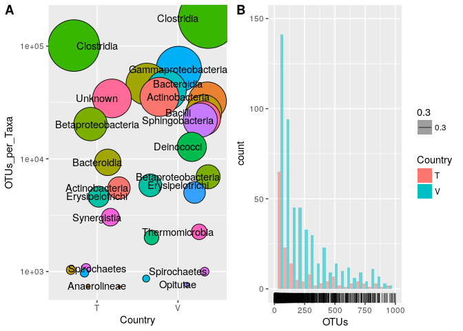<!-- -->

While our grid areas are the same size, our plot backgrounds are not. Let's adjust the legend so that it is in the top right corner of the plot, and remove the white background. We do not need the alpha legend. Do you remember how to get rid of it?


```r
hist <- ggplot(dat[dat$OTU >=2,], aes(x=OTUs, fill=Country, alpha=0.3)) + 
	geom_histogram(binwidth = 50, position = "dodge") +
  xlim(0,1000) +
  ylim(0,150) +
  geom_rug() +
  guides(alpha = FALSE) +
  theme(legend.justification=c(1,1), legend.position=c(1,1), legend.background = element_blank())

ggarrange(bub, hist, 
          labels = c("A", "B"),
          ncol = 2, nrow = 1)
```

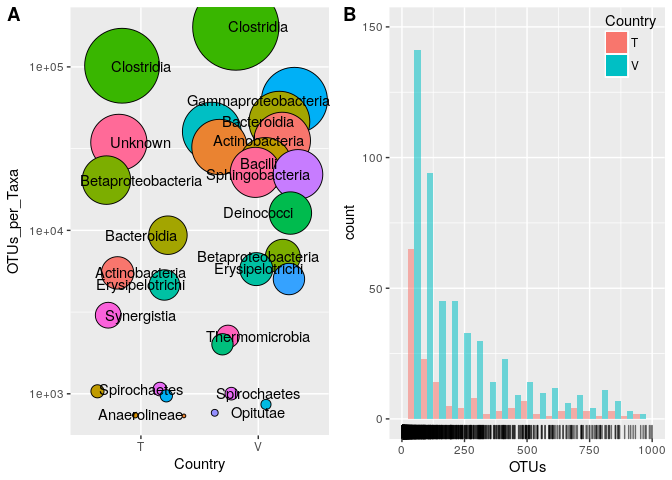<!-- -->

Next we will add in the boxplot. Imagine a square with 4 boxes. We are going to put our boxplot in the left top and bottom boxes, the histogram in the top right box, and the bubble plot in the bottom right box.  To do this, we are arranging 2 columns (one with the boxplot and one with the histogram + bubble plot, `ncol = 2`) and we are arranging 2 rows (one with the histogram and one with the bubble plot, `nrow = 2`).


```r
box <- ggplot(dat[(dat$Taxa=="Clostridia" | dat$Taxa == "Gammaproteobacteria" | dat$Taxa == "Unknown" | dat$Taxa == "Bacilli") & dat$Country == "T",] , aes(x = Taxa, y = OTUs)) + 
  geom_boxplot() + 
  geom_point() +
  theme(axis.text.x = element_text(angle=90, hjust=1)) + 
  scale_y_log10()

ggarrange(box, ggarrange(hist, bub, 
          labels = c("B", "C"),
          nrow = 2),
           ncol = 2, labels = "A")
```

<!-- -->

The y-axis lines for the histogram and bubble plot are not aligned, but this can be fixed with a call to `align="v"`.


```r
ggarrange(box, ggarrange(hist, bub, 
          labels = c("B", "C"),
          nrow = 2, align = "v"),
           ncol = 2, labels = "A")
```

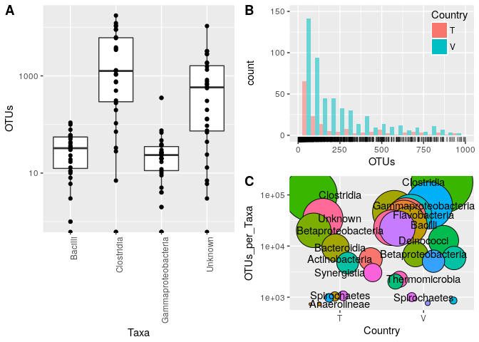<!-- -->

To make sure all axis titles are the same size (B and C look a little off to me), we can specify using `font()` which text we want changed and the size we want to change it to. I am also going to make the legend title size the same. I want to make the text inside the bubble plot a little smaller as well. Let's look at the `font()` function. Can we do that? What might be another option?


```r
bub <- ggplot(bdat, aes(x = Country, y = OTUs_per_Taxa, fill=Taxa)) +
  scale_y_log10() +
  geom_jitter(aes(size = sqrt(OTUs_per_Taxa/pi)), pch = 21, show.legend = FALSE) + 
  scale_size_continuous(range=c(1,30)) +
  geom_text(aes(label = Taxa, size=16), check_overlap = TRUE, show.legend = FALSE)


ggarrange(box + font("axis.title", size=9), ggarrange(hist + font("axis.title", size=9) + font("legend.title", size=9), bub + font("axis.title", size=9), 
          labels = c("B", "C"),
          nrow = 2, align = "v"),
           ncol = 2, labels = "A")
```

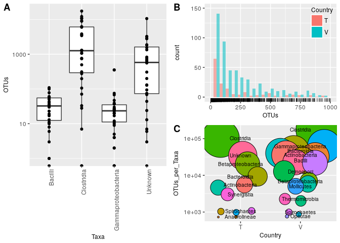<!-- -->

***
__Challenge__ 


<div style="float:left;margin:0 10px 10px 0" markdown="1">
{width=150px}

</div>

Using the code available here for a line graph we made earlier in the lesson, make a combined figure. Imagine a square with 4 boxes. We are going to put our line graph in the top right and left boxes, the histogram in the bottom left box, and the bubble plot in the bottom right box. Make sure the legend and axis titles are the same size. Change the legend text for the line graph to be smaller than the legend title. 

```
lin <- ggplot(errdat, aes(x=Temp, y=pH, colour = Country)) + 
  geom_line() + 
  geom_errorbar(aes(ymin=pH-sd_pH, ymax = pH+sd_pH), width = .2, alpha = 0.4)
```

</br>
</br>
</br>

***


###Network diagrams 
**Packages**

visNetwork (based on igraph): https://datastorm-open.github.io/visNetwork/edges.html

###Circos Plots
**Packages**

Migest: https://gjabel.wordpress.com/category/r/migest/

###Upset Plots
**Packages**

UpSetR: https://github.com/hms-dbmi/UpSetR     

Upset plots are an alternative to venn diagrams that show the intersection of sets, as well as the size of the sets. Additionally, venn diagrams can be difficult to interpret for greater than 2 or 3 sets. This is a real life figure from BMC Bioinformatics. Sure it looks pretty, but what does the number 24 represent in this picture in terms of A, B, C, D, and E?    

{width=400px} 

</br>

Let's see how UpSet plots work practically. 

*Question: For 8 Taxa, how many sites are each Taxa present at and what is the overlap between sites with other Taxa?* 

I have picked 8 different Taxa, which would make a crazy venn diagram with a lot of zeros in it since a couple of these Taxa are rare.


```r
subdat <- read.csv("data/SPE_pitlatrine.csv", stringsAsFactors = FALSE)

eight <- c("Chloroflexi", "Acidobacteria_Gp16", "Acidobacteria_Gp5", "Cyanobacteria", "Lentisphaeria", "Deinococci", "Alphaproteobacteria", "Clostridia")

#subset for the 8 taxa
subdat <- subdat[subdat$Taxa %in% eight, ]
```

The data that we have is an OTU table. For this purpose we simply want to know whether a given Taxa was present or absent in the sample, and then we can form intersections based on this information. So, for each OTU value that is *not* 0, we replace it with a 1 instead. 


```r
#this is a tidyr way of transposing our data frame so that Taxa are in columns and sites are in rows
#this format is for the upset plot only, we can do the value replacement in either format
subdat <- subdat %>% 
   gather(variable, value, -Taxa) %>% 
   spread(Taxa, value) 

#if any OTUs are present, substitute the value with a 1 (exclude the first row which is character)
#don't worry about the function syntax, we will be writing functions in lesson 6
subdat[,-1] <- apply(subdat[,-1], 2, function(x) ifelse(x!=0, 1, 0))
```

Then to use the `upset()` plotting function, we enter our data set, the number of sets we are inputting, if we want to order the results (in this case by frequency), and how many intersections we want to show.  Here, I will show 15 intersections - we know the remaining intersections would be zero since this is ordered by frequency.


```r
library(UpSetR)

upset(subdat, nsets = 8, empty.intersections = TRUE, order.by = "freq", nintersects = 15, main.bar.color = "black", sets.bar.color = "#56B4E9" )
```

<!-- -->

Let's look at our greatest Intersection Size (equal to 28). This means that 28 of our 81 samples have Clostridia, Alphaproteobacteria, and Deinococci present in the same sample WITHOUT Chloroflexi, both Acidobacteria, Cyanobacteria and Lentisphaeria. We can see from the Set Size that Clostridia and Alphaproteobacteria are present in almost all samples, and Deinococci is present in greater than 3/4 of the samples. You might expect this overlap to be higher, but remember that this is without all the other Taxa. Moving along our interesection sizes and dot matrix, we can see that other intersections include these bacteria. For example, the next bar to the right with an Intersection Size of 16, also includes Lentisphaeria. Some quick mental math shows that 63 samples have these top 3 Taxa present.  

###Geospatial Data
**Packages**

Static Maps:
- https://bhaskarvk.github.io/user2017.geodataviz/notebooks/02-Static-Maps.nb.html

Interactive Maps:
- https://bhaskarvk.github.io/user2017.geodataviz/notebooks/03-Interactive-Maps.nb.html
  
###Phylogenetics Data 
**Packages**

ggtree: 
- http://www.bioconductor.org/packages/3.7/bioc/vignettes/ggtree/inst/doc/treeAnnotation.html#annotate-clades

treeman: 
- https://bmcresnotes.biomedcentral.com/articles/10.1186/s13104-016-2340-8

metacoder: 
- https://github.com/grunwaldlab/metacoder

phyloseq:
- https://joey711.github.io/phyloseq/index.html

###Genomics Data 
**Packages**

ggbio: 
- http://www.bioconductor.org/packages/2.11/bioc/vignettes/ggbio/inst/doc/ggbio.pdf

GenVisR:
- https://bioconductor.org/packages/release/bioc/vignettes/GenVisR/inst/doc/GenVisR_intro.html

GenomeGraphs:
- https://bmcbioinformatics.biomedcentral.com/articles/10.1186/1471-2105-10-2
   
***
__Challenge__ 


<div style="float:left;margin:0 10px 10px 0" markdown="1">
{width=150px}

</div>

Install and load the gapminder package. Save the gapminder data into an object using `dat <- gapminder`. Plot the following:

    1. a qualitative variable with a quantitative variable (at least 2 ways). 
      + Facet your plot by the qualitative variable.
    2. two quantitative variables (at least 2 ways). 
      + Add a regression line to your plot.

</br>
</br>
</br>

***


__Resources:__     

Wickham, Hadley. (2010). A Layered Grammar of Graphics. Journal of Computational and Statistical Graphics.     
Wilkinson, L. (2005), The Grammar of Graphics (2nd ed.). Statistics and Computing, New York: Springer. [14, 18]  
Tufte, Edward R. The Visual Display of Quantitative Information.

<http://www.cookbook-r.com/Graphs/>          
<https://github.com/jennybc/ggplot2-tutorial>          
<http://stcorp.nl/R_course/tutorial_ggplot2.html>          
<http://ggplot2.tidyverse.org/reference/theme.html>     
<http://joeystanley.com/blog/custom-themes-in-ggplot2>     
<https://github.com/jrnold/ggthemes>     
<https://www.nceas.ucsb.edu/~frazier/RSpatialGuides/colorPaletteCheatsheet.pdf>     
<https://cran.r-project.org/web/packages/ggrepel/vignettes/ggrepel.html>      
<http://www.cookbook-r.com/Graphs/Legends_(ggplot2)/>     
<https://github.com/eclarke/ggbeeswarm>     
<https://cran.r-project.org/web/packages/ggsci/vignettes/ggsci.html>     
<http://www.sthda.com/english/rpkgs/ggpubr/>      
<https://rpubs.com/drsong/9575>          
<http://elpub.bib.uni-wuppertal.de/edocs/dokumente/fbb/wirtschaftswissenschaft/sdp/sdp15/sdp15006.pdf>          
<http://www.sthda.com/english/articles/24-ggpubr-publication-ready-plots/81-ggplot2-easy-way-to-mix-multiple-graphs-on-the-same-page/>          
<https://rdpeng.github.io/Biostat776/notes/pdf/grdevices.pdf>          

#Post-Lesson Assessment
***

Your feedback is essential to help the next cohort of trainees. Please take a minute to complete the following short survey:
<https://www.surveymonkey.com/r/VNQZ3KS>

</br>

***

</br>

Thanks for coming!!!

{width=300px}
