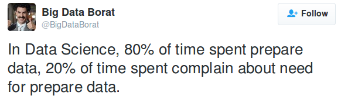
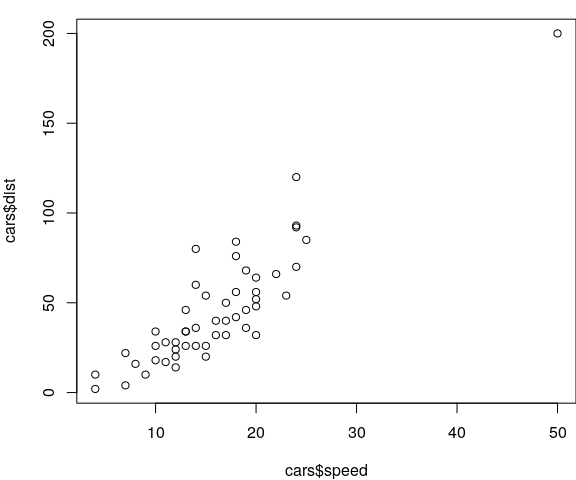

***
{width=400px} 

</br>

##A quick intro to the intro to R Lesson Series

</br>

This 'Intro to R Lesson Series' is brought to you by the Centre for the Analysis of Genome Evolution & Function's (CAGEF) bioinformatics training initiative. This course was developed based on feedback on the needs and interests of the Department of Cell & Systems Biology and the Department of Ecology and Evolutionary Biology. 


This lesson is the fourth in a 6-part series. The idea is that at the end of the series, you will be able to import and manipulate your data, make exploratory plots, perform some basic statistical tests, test a regression model, and make some even prettier plots and documents to share your results. 


</br>

How do we get there? Today we are going to be learning data cleaning and string manipulation; this is really the battleground of coding - getting your data into the format where you can analyse it. We will also be learning r markdown so that we can easily annotate our code and share it with others in reproducible documents. In the next lesson we will learn how to do t-tests and perform regression and modeling in R. And lastly, we will learn to write some functions, which really can save you time and help scale up your analyses.


</br>

The structure of the class is a code-along style. It is hands on. The lecture AND code we are going through are available on GitHub for download at https://github.com/eacton/CAGEF __(Note: repo is private until approved)__, so you can spend the time coding and not taking notes. As we go along, there will be some challenge questions and multiple choice questions on Socrative. At the end of the class if you could please fill out a post-lesson survey (https://www.surveymonkey.com/r/PVHDKDB), it will help me further develop this course and would be greatly appreciated. 

***

####Packages Used in This Lesson

The following packages are used in this lesson:

`tidyverse` (`ggplot2`, `tidyr`, `dplyr`)     
(`twitteR`)\*     
(`httr`)\*     
`tidytext`     
`viridis`     
`knitr`     
`kableExtra`     
`wordcloud`     

*Used to generate the tweet tables used in this lesson. It is not necessary for you to install this - you can work from the tables. If you want to create these files - the code is here  - [twitter scrape](https://github.com/eacton/CAGEF/blob/master/Lesson_4/twitter_scrape.R).    

Please install and load these packages for the lesson. In this document I will load each package separately, but I will not be reminding you to install the package. Remember: these packages may be from CRAN OR Bioconductor. 


***
####Highlighting

`grey background` - a package, function, code or command      
*italics* - an important term or concept     
**bold** - heading or 'grammar of graphics' term      
<span style="color:blue">blue text</span> - named or unnamed hyperlink     

***
__Objective:__ At the end of this session you will be able to use regular expressions to 'clean' your data. You will also learn R markdown and be able to render your R code into slides, a pdf, html, a word document, or a notebook.

***

####Load libraries

Since we are moving along in the world, we are now going to start loading our libraries at the start of our script. This is a 'best practice' and makes it much easier for someone to reproduce your work efficiently by knowing exactly what packages they need to run your code. We will learn how to do this with a function in Lesson 6!


```r
library("tidyverse")
library("tidytext")
library("viridis")
library("knitr")
library("kableExtra")
library("wordcloud")
```

***

##Data Cleaning or Data Munging or Data Wrangling

Why do we need to do this?

'Raw' data is seldom (never) in a useable format. Data in tutorials or demos has already been meticulously filtered, transformed and readied to showcase that specific analysis. How many people have done a tutorial only to find they can't get their own data in the format to use the tool they have just spend an hour learning about???

Data cleaning requires us to:

- get rid of inconsistencies in our data. 
- have labels that make sense. 
- check for invalid character/numeric values.
- check for incomplete data.
- remove data we do not need.
- get our data in a proper format to be analyzed by the tools we are using. 
- flag/remove data that does not make sense.

Some definitions might take this a bit farther and include normalizing data and removing outliers, but I consider data cleaning as getting data into a format where we can start actively doing 'the maths or the graphs' - whether it be statistical calculations, normalization or exploratory plots. 

Today we are going to mostly be focusing on the **data cleaning of text**. This step is crucial to taking control of your dataset and your metadata. I have included the functions I find most useful for these tasks but I encourage you to take a look at the [Strings Chapter](http://r4ds.had.co.nz/strings.html) in *R for Data Science* for an exhaustive list of functions. We have learned how to transform data into a tidy format in Lesson 2, but the prelude to transforming data is doing the grunt work of data cleaning. So let's get to it!

<div style="float:center;margin: 10px 0 10px 0" markdown="1">
{width=300px}
</div>

</br>

</br>


##Intro to regular expressions


**Regular expressions**

"A God-awful and powerful language for expressing patterns to match in text or for search-and-replace. Frequently described as 'write only', because regular expressions are easier to write than to read/understand. And they are not particularly easy to write."  - Jenny Bryan

</br>


</br>

So why do regular expressions or 'regex' get so much flak if it is so powerful for text matching?

Scary example: how to get an email in different programming languages <http://emailregex.com/>. 

Regex is definitely one of those times when it is important to annotate your code. There are many jokes related to people coming back to their code the next day and having no idea what their code means.

<div style="left;margin:0 20px 20px 0" markdown="1">
{width=400px} 
</div>

There are sites available to help you make up your regular expressions and validate them against text. These are usually not R specific, but they will get you close and the expression will only need a slight modification for R (like an extra backslash - described below).

Regex testers:

<https://regex101.com/>     
<https://regexr.com/>

What I would like to get across it that it is okay to google and use resources early on for regex, and that even experts still use these resources.  


</br>

<div style="float:left;margin:0 10px 10px 0" markdown="1">
{width=350px} 
</div>

<div style="float:right;margin:0 10px 10px 0" markdown="1">
{width=350px} 
</div>

</br>

</br>

</br>

</br>
</br>

__What does the language look like?__ 

The language is based on _meta-characters_ which have a special meaning rather than their literal meaning. For example, '$' is used to match the end of a string, and this use supercedes its use as a character in a string (ie 'Joe paid \$2.99 for chips.'). 


###Matching by position

Where is the character in the string?

<table class="table" style="width: auto !important; margin-left: auto; margin-right: auto;">
 <thead>
  <tr>
   <th style="text-align:left;"> Expression </th>
   <th style="text-align:left;"> Meaning </th>
  </tr>
 </thead>
<tbody>
  <tr>
   <td style="text-align:left;border-right:1px solid;"> ^ </td>
   <td style="text-align:left;width: 40em; font-style: italic;"> start of string </td>
  </tr>
  <tr>
   <td style="text-align:left;border-right:1px solid;"> $ </td>
   <td style="text-align:left;width: 40em; font-style: italic;"> end of string </td>
  </tr>
  <tr>
   <td style="text-align:left;border-right:1px solid;"> \\b </td>
   <td style="text-align:left;width: 40em; font-style: italic;"> empty string at either edge of a word </td>
  </tr>
  <tr>
   <td style="text-align:left;border-right:1px solid;"> \\B </td>
   <td style="text-align:left;width: 40em; font-style: italic;"> empty string that is NOT at the edge of a word </td>
  </tr>
</tbody>
</table>


###Quantifiers

How many times will a character appear?

<table class="table" style="width: auto !important; margin-left: auto; margin-right: auto;">
 <thead>
  <tr>
   <th style="text-align:left;"> Expression </th>
   <th style="text-align:left;"> Meaning </th>
  </tr>
 </thead>
<tbody>
  <tr>
   <td style="text-align:left;border-right:1px solid;"> ? </td>
   <td style="text-align:left;width: 40em; font-style: italic;"> 0 or 1 </td>
  </tr>
  <tr>
   <td style="text-align:left;border-right:1px solid;"> \* </td>
   <td style="text-align:left;width: 40em; font-style: italic;"> 0 or more </td>
  </tr>
  <tr>
   <td style="text-align:left;border-right:1px solid;"> \+ </td>
   <td style="text-align:left;width: 40em; font-style: italic;"> 1 or more </td>
  </tr>
  <tr>
   <td style="text-align:left;border-right:1px solid;"> {n} </td>
   <td style="text-align:left;width: 40em; font-style: italic;"> exactly n </td>
  </tr>
  <tr>
   <td style="text-align:left;border-right:1px solid;"> {n,} </td>
   <td style="text-align:left;width: 40em; font-style: italic;"> at least n </td>
  </tr>
  <tr>
   <td style="text-align:left;border-right:1px solid;"> {,n} </td>
   <td style="text-align:left;width: 40em; font-style: italic;"> at most n </td>
  </tr>
  <tr>
   <td style="text-align:left;border-right:1px solid;"> {n,m} </td>
   <td style="text-align:left;width: 40em; font-style: italic;"> between n and m (inclusive) </td>
  </tr>
</tbody>
</table>


###Classes

What kind of character is it?

<table class="table" style="width: auto !important; margin-left: auto; margin-right: auto;">
 <thead>
  <tr>
   <th style="text-align:left;"> Expression </th>
   <th style="text-align:left;"> Meaning </th>
  </tr>
 </thead>
<tbody>
  <tr>
   <td style="text-align:left;border-right:1px solid;"> \\w, [A-z0-9], [[:alnum:]] </td>
   <td style="text-align:left;width: 40em; font-style: italic;"> word characters (letters + digits) </td>
  </tr>
  <tr>
   <td style="text-align:left;border-right:1px solid;"> \\d, [0-9], [[:digit:]] </td>
   <td style="text-align:left;width: 40em; font-style: italic;"> digits </td>
  </tr>
  <tr>
   <td style="text-align:left;border-right:1px solid;"> [A-z], [:alpha:] </td>
   <td style="text-align:left;width: 40em; font-style: italic;"> alphabetical characters </td>
  </tr>
  <tr>
   <td style="text-align:left;border-right:1px solid;"> \\s, [[:space:]] </td>
   <td style="text-align:left;width: 40em; font-style: italic;"> space </td>
  </tr>
  <tr>
   <td style="text-align:left;border-right:1px solid;"> [[:punct:]] </td>
   <td style="text-align:left;width: 40em; font-style: italic;"> punctuation </td>
  </tr>
  <tr>
   <td style="text-align:left;border-right:1px solid;"> [[:lower:]] </td>
   <td style="text-align:left;width: 40em; font-style: italic;"> lowercase </td>
  </tr>
  <tr>
   <td style="text-align:left;border-right:1px solid;"> [[:upper:]] </td>
   <td style="text-align:left;width: 40em; font-style: italic;"> uppercase </td>
  </tr>
  <tr>
   <td style="text-align:left;border-right:1px solid;"> \\W, [^A-z0-9] </td>
   <td style="text-align:left;width: 40em; font-style: italic;"> not word characters </td>
  </tr>
  <tr>
   <td style="text-align:left;border-right:1px solid;"> \\S </td>
   <td style="text-align:left;width: 40em; font-style: italic;"> not space </td>
  </tr>
  <tr>
   <td style="text-align:left;border-right:1px solid;"> \\D, [^0-9] </td>
   <td style="text-align:left;width: 40em; font-style: italic;"> not digits </td>
  </tr>
</tbody>
</table>


###Operators

Helper actions to match your characters.

<table class="table" style="width: auto !important; margin-left: auto; margin-right: auto;">
 <thead>
  <tr>
   <th style="text-align:left;"> Expression </th>
   <th style="text-align:left;"> Meaning </th>
  </tr>
 </thead>
<tbody>
  <tr>
   <td style="text-align:left;border-right:1px solid;"> | </td>
   <td style="text-align:left;width: 40em; font-style: italic;"> or </td>
  </tr>
  <tr>
   <td style="text-align:left;border-right:1px solid;"> . </td>
   <td style="text-align:left;width: 40em; font-style: italic;"> matches any single character </td>
  </tr>
  <tr>
   <td style="text-align:left;border-right:1px solid;"> [  ] </td>
   <td style="text-align:left;width: 40em; font-style: italic;"> matches ANY of the characters inside the brackets </td>
  </tr>
  <tr>
   <td style="text-align:left;border-right:1px solid;"> [ - ] </td>
   <td style="text-align:left;width: 40em; font-style: italic;"> matches a RANGE of characters inside the brackets </td>
  </tr>
  <tr>
   <td style="text-align:left;border-right:1px solid;"> [^ ] </td>
   <td style="text-align:left;width: 40em; font-style: italic;"> matches any character EXCEPT those inside the bracket </td>
  </tr>
  <tr>
   <td style="text-align:left;border-right:1px solid;"> ( ) </td>
   <td style="text-align:left;width: 40em; font-style: italic;"> grouping - used for [backreferencing](https://www.regular-expressions.info/backref.html) </td>
  </tr>
</tbody>
</table>

###Escape characters

Sometimes a meta-character is just a character. _Escaping_ allows you to use a character 'as is' rather than its special function. In R, regex gets evaluated as a string before a regular expression, and a backslash is used to escape the string - so you really need 2 backslashes to escape, say, a '$' sign (`"\\\$"`). 

<table class="table" style="width: auto !important; margin-left: auto; margin-right: auto;">
 <thead>
  <tr>
   <th style="text-align:left;"> Expression </th>
   <th style="text-align:left;"> Meaning </th>
  </tr>
 </thead>
<tbody>
  <tr>
   <td style="text-align:left;border-right:1px solid;"> \\ </td>
   <td style="text-align:left;width: 40em; font-style: italic;"> escape for meta-characters to be used as characters (*, $, ^, ., ?, |, \\, [, ], {, }, (, )). 
              Note: the backslash is also a meta-character. </td>
  </tr>
</tbody>
</table>

Trouble-shooting with escaping meta-characters means adding backslashes until something works. 


While you can always refer back to this lesson for making your regular expressions, you can also use this [regex cheatsheet](https://www.rstudio.com/wp-content/uploads/2016/09/RegExCheatsheet.pdf).

</br>


##Data Cleaning with Base R (AKA What is Elon Musk up to anyways?)

Let's take this cacaphony of characters we've just learned about and perform some basic data cleaning tasks with an actual messy data set. I have scraped Elon Musk's latest tweets from Twitter. The code to do this is in the Lesson 4 file [twitter_scrape.R](https://github.com/eacton/CAGEF/blob/master/Lesson_4/twitter_scrape.R) if you are curious or want to creep someone on Twitter.

Let's read in the set of tweets, take a look at the structure of the data.


```r
elon_tweets_df <- read.delim("data/elon_tweets_df.txt", sep = "\t", stringsAsFactors = F)
```

```
## Warning in scan(file = file, what = what, sep = sep, quote = quote, dec =
## dec, : EOF within quoted string
```

The warning with EOF (end of file) within quoted string is possibly due to the fact that there are special characters (emojis, arrows, etc.) inside the cells. Let's take a look at how the file was parsed.


```r
str(elon_tweets_df)
```

```
## 'data.frame':	348 obs. of  16 variables:
##  $ text         : chr  "@Complex This is false" "https://t.co/UWJK1LwgKf" "@rosechehrazi Oh, it’s on …" "Most people don’t know there’s a whole box of Easter eggs with every Tesla. Just tap logo on center screen &amp; wait.… https:/ ...
##  $ favorited    : logi  FALSE FALSE FALSE FALSE FALSE FALSE ...
##  $ favoriteCount: int  18526 10579 3583 26710 2975 2132 11397 25003 2590 3625 ...
##  $ replyToSN    : chr  "Complex" "elonmusk" "rosechehrazi" NA ...
##  $ created      : chr  "2018-04-04 22:25:31" "2018-04-04 17:24:48" "2018-04-04 17:16:57" "2018-04-04 17:16:13" ...
##  $ truncated    : logi  FALSE FALSE FALSE TRUE FALSE TRUE ...
##  $ replyToSID   : num  9.82e+17 9.82e+17 9.82e+17 NA 9.81e+17 ...
##  $ id           : num  9.82e+17 9.82e+17 9.82e+17 9.82e+17 9.81e+17 ...
##  $ replyToUID   : num  1.30e+07 4.42e+07 2.39e+09 NA 1.15e+08 ...
##  $ statusSource : chr  "<a href=\\http://twitter.com/download/iphone\\ rel=\\nofollow\\>Twitter for iPhone</a>" "<a href=\\http://twitter.com/download/iphone\\ rel=\\nofollow\\>Twitter for iPhone</a>" "<a href=\\http://twitter.com/download/iphone\\ rel=\\nofollow\\>Twitter for iPhone</a>" "<a href=\\http://twitter.com/download/iphone\\ rel=\\nofollow\\>Twitter for iPhone</a>" ...
##  $ screenName   : chr  "elonmusk" "elonmusk" "elonmusk" "elonmusk" ...
##  $ retweetCount : int  2830 738 172 2103 325 186 634 2216 89 79 ...
##  $ isRetweet    : logi  FALSE FALSE FALSE FALSE FALSE FALSE ...
##  $ retweeted    : logi  FALSE FALSE FALSE FALSE FALSE FALSE ...
##  $ longitude    : logi  NA NA NA NA NA NA ...
##  $ latitude     : logi  NA NA NA NA NA NA ...
```

Our end goal is going to be to look at the top 50 words in Elon Musk's tweets and make a wordcloud. I don't want urls, hastags, or other tags. I also don't want punctuation or spaces. I just want to extract the words from tweets. It might be fun to look at the top favorite tweets while we are data cleaning, so let's use `tidyverse` functions to keep the text tweets and order them by the favorited counts.

```r
elon_tweets_df <- elon_tweets_df %>% 
  select(text, favoriteCount) %>%
  arrange(desc(favoriteCount))

elon_tweets_df$text[1:5]
```

```
## [1] "0 to 100 km/h in 1.9 sec https://t.co/xTOTDGuwQj"                                                                                            
## [2] "Apparently, some customs agencies are saying they won’t allow shipment of anything called a “Flamethrower”. To solv… https://t.co/OCtjvdXo95"
## [3] "The rumor that I’m secretly creating a zombie apocalypse to generate demand for flamethrowers is completely false"                           
## [4] "Nuclear alien UFO from North Korea https://t.co/GUIHpKkkp5"                                                                                  
## [5] "Ok, who leaked my selfie!? https://t.co/fYKXbix8jw"
```

First, I want to remove the tags from the beginning of words. I am going to save my regex expression into an object - so we can use them again later.

What this expression says is that I want to find matches for a hastag OR an asperand ('at' symbol) followed by at least one word character. `grep` is a function that allows us to match our pattern (our expression) to a character vector. It is a good idea to do a visual inspection of your result to make sure your matches or substitutions are working the way you expected.


```r
tags <- "#|@\\w+"

grep(pattern = tags, x = elon_tweets_df$text)
```

```
## Warning in grep(pattern = tags, x = elon_tweets_df$text): input string 10
## is invalid in this locale
```

```
## Warning in grep(pattern = tags, x = elon_tweets_df$text): input string 118
## is invalid in this locale
```

```
## Warning in grep(pattern = tags, x = elon_tweets_df$text): input string 156
## is invalid in this locale
```

```
## Warning in grep(pattern = tags, x = elon_tweets_df$text): input string 219
## is invalid in this locale
```

```
## Warning in grep(pattern = tags, x = elon_tweets_df$text): input string 224
## is invalid in this locale
```

```
##   [1]  27  34  45  49  56  57  58  70  73  74  81  82  87  89  93  98 103
##  [18] 117 119 122 123 129 131 132 134 135 142 147 148 151 154 158 159 160
##  [35] 164 166 169 171 172 173 174 175 177 179 181 182 183 184 185 187 188
##  [52] 189 192 193 194 196 197 198 201 202 203 204 205 206 207 208 209 210
##  [69] 211 212 213 214 215 216 217 218 220 221 222 223 225 226 227 228 229
##  [86] 230 231 232 233 234 235 236 237 238 239 240 241 242 243 244 245 246
## [103] 247 248 249 250 251 252 253 254 255 256 257 258 259 260 261 262 263
## [120] 264 265 266 267 268 269 270 271 272 273 274 275 276 277 278 279 280
## [137] 281 282 283 284 285 286 287 288 289 290 291 293 294 295 296 297 298
## [154] 299 300 301 302 303 304 305 306 307 308 309 310 311 312 313 314 315
## [171] 316 317 318 319 320 321 322 323 324 325 326 327 328 329 330 331 332
## [188] 333 334 335 336 337 338 339 340 341 342 343 344 345 346 347 348
```
We can see that `grep` returns the index of the match. We have a number of entries that include tags. We also have a number of warnings that we will return to. 

If we want to return the tweet itself instead of the index, we can use the argument `value = TRUE`.  In this case, it looks like each tweet matched does have a tag. (You will have a warning here too, I didn't print it here.)


```r
grep(tags, elon_tweets_df$text, value = TRUE) %>% head()
```

```
## [1] "@FortuneTech Do it"                                                                                                                          
## [2] "Flight profile #FalconHeavy #SpaceX https://t.co/LlfWXqUaLP"                                                                                 
## [3] "@angilly I don’t get the little ship thing. You can’t show up at Mars in something the size of a rowboat. What if t… https://t.co/Aj0zv8Lwdf"
## [4] "Launch auto-sequence initiated (aka the holy mouse-click) for 3:45 liftoff #FalconHeavy"                                                     
## [5] "@brianacton What’s Facebook?"                                                                                                                
## [6] "@VentureBeat @kharijohnson We’ve never advertised with FB. None of my companies buy advertising or pay famous peopl… https://t.co/AhG6MbsXHP"
```
We can then use `gsub` to replace that pattern (our tags) with nothing (an empty string).

```r
elon_tweets_df$text <- gsub(pattern = tags, replacement = "", elon_tweets_df$text)
```

Back to the warnings about strings being 'invalid in this locale'. Let's take a look at these strings by subsetting for the indices given.


```r
elon_tweets_df$text[c(10,118, 156, 219, 224)]
```

```
## [1] "I just realized there is a jazz hands emoji \xed\xa0\xbe\xed\xb4\x97"                                                   
## [2] "   Thanks \U3e64653c\U3e30613c\U3e64623c\U3e64653c\U3e38623c\U3e38393c"                                                 
## [3] "Great for roasting nuts \xed\xa0\xbd\xed\xb4\xa5 \xed\xa0\xbe\xed\xb5\x9c https://t.co/MGmkSJhIyx"                      
## [4] " Literally, if you type “jazz hands”, iOS shows this emoji \U3e64653c\U3e30613c\U3e65623c\U3e64653c\U3e34623c\U3e37393c"
## [5] "    Woz is a lovable, fuzzy bear \U3e64653c\U3e30613c\U3e64623c\U3e64653c\U3e30623c\U3e62623c"
```

From context, it looks like these character strings have emojis in them, which have their own character codes. Why would this give us an error? Tweets are _encoded_ in UTF-16 and converted to UTF-8 when read into R. Things that have character codes get encoded differently. Here is an example of [emoji encoding](https://raw.githubusercontent.com/today-is-a-good-day/Emoticons/master/emDict.csv). Since we are going to remove anything with special character codes (ie. an apostrophe or emoji), we are going to use the `iconv` function to substitute encoded character codes that need converting with nothing (again, an empty character string). This is not something you will have to deal with on a daily basis, but character encoding is something to be aware of, especially when scraping data from the web.  


```r
elon_tweets_df$text <- iconv(elon_tweets_df$text, "UTF-8", "ASCII", sub = "")

elon_tweets_df$text[c(10,118, 156, 219, 224)]
```

```
## [1] "I just realized there is a jazz hands emoji "             
## [2] "   Thanks "                                               
## [3] "Great for roasting nuts   https://t.co/MGmkSJhIyx"        
## [4] " Literally, if you type jazz hands, iOS shows this emoji "
## [5] "    Woz is a lovable, fuzzy bear "
```

Looking back at our problematic strings, you can see that the emojis have been removed as well as quotation marks. Our hastag and asperand would also have been encoded characters had we not already removed them.


Our next step would be to remove urls. This is a bit tricky. We could be looking for http:// or https:// followed by we don't know what (some combination of letters, numbers and forward slashes). 

We can check out which tweets have urls using `grep` as we did previously to see if we managed to match urls.

We are going to continue our pattern of using `gsub` to substitute what we don't want with an empty character string.


```r
url <- "http[s]?://[[:alnum:].\\/]+"

grep(url, elon_tweets_df$text, value = TRUE) %>% head()
```

```
## [1] "0 to 100 km/h in 1.9 sec https://t.co/xTOTDGuwQj"                                                                                        
## [2] "Apparently, some customs agencies are saying they wont allow shipment of anything called a Flamethrower. To solv https://t.co/OCtjvdXo95"
## [3] "Nuclear alien UFO from North Korea https://t.co/GUIHpKkkp5"                                                                              
## [4] "Ok, who leaked my selfie!? https://t.co/fYKXbix8jw"                                                                                      
## [5] "https://t.co/pNElNTmcKf"                                                                                                                 
## [6] "Falcon Heavy at the Cape https://t.co/hizfDVsU7X"
```

```r
elon_tweets_df$text <- gsub(pattern = "http[s]?://[[:alnum:].\\/]+", replacement = "", elon_tweets_df$text)
```

We can also use `grepl` to get a logical reponse for whether a tweet has a url or not. That way, if you wanted to grab all of the urls that Elon Musk suggests to visit, you can filter with `grepl` to select all of the tweets where it is TRUE that a url is present.


```r
grepl(url, elon_tweets_df$text) %>% head()
```

```
## [1] FALSE FALSE FALSE FALSE FALSE FALSE
```

```r
elon_urls <- elon_tweets_df %>% filter(grepl(url, elon_tweets_df$text))
```


Lastly, we are going to get rid of trailing spaces, numbers, and punctuation all at the same time. You can find trailing spaces at the very end of our tweet string from removing the urls.


```r
trail <- "[ ]+$|[0-9]*|[[:punct:]]"

grep(trail, elon_tweets_df$text, value = TRUE) %>% head()
```

```
## [1] "0 to 100 km/h in 1.9 sec "                                                                                        
## [2] "Apparently, some customs agencies are saying they wont allow shipment of anything called a Flamethrower. To solv "
## [3] "The rumor that Im secretly creating a zombie apocalypse to generate demand for flamethrowers is completely false" 
## [4] "Nuclear alien UFO from North Korea "                                                                              
## [5] "Ok, who leaked my selfie!? "                                                                                      
## [6] "\\If one day, my words are against science, choose science.\\\nMustafa Kemal Atatrk"
```
We can check to see that we are picking up strings with punctutation, numbers and trailing spaces, and then we can remove them and compare our output.


```r
elon_tweets_df$text <- gsub(pattern = trail, replacement = "", elon_tweets_df$text)

elon_tweets_df$text[1:5]
```

```
## [1] " to  kmh in  sec"                                                                                                
## [2] "Apparently some customs agencies are saying they wont allow shipment of anything called a Flamethrower To solv"  
## [3] "The rumor that Im secretly creating a zombie apocalypse to generate demand for flamethrowers is completely false"
## [4] "Nuclear alien UFO from North Korea"                                                                              
## [5] "Ok who leaked my selfie"
```

It looks like everything worked except there are extra spaces from whenever a number was removed. Let's take all of the places where there are 2 or more spaces created and substitute them with just one space. 


```r
space <- "\\s{2,}"

grep(space, elon_tweets_df$text, value = TRUE) %>% head()
```

```
## [1] " to  kmh in  sec"                                                                                                                      
## [2] "Tesla Goes Bankrupt\nPalo Alto California April    Despite intense efforts to raise money including a las"                             
## [3] "If you liked tonights launch you will really like Falcon Heavy next month  rocket cores amp X thrust  cores re"                        
## [4] "Elon was found passed out against a Tesla Model  surrounded by Teslaquilla bottles the tracks of dried tears s"                        
## [5] "Turns out joking about being a rock star because of digging tunnels through uh rock  hello is deeply underappreciated"                 
## [6] "Todays Falcon launch carries  SpaceX test satellites for global broadband If successful Starlink constellation will serve least served"
```
Again, we can check to see that we are picking up strings with extra spaces, and then replace those spaces with a single space.


```r
elon_tweets_df$text <- gsub(pattern = space, replacement = " ", elon_tweets_df$text)

elon_tweets_df$text[1:5]
```

```
## [1] " to kmh in sec"                                                                                                  
## [2] "Apparently some customs agencies are saying they wont allow shipment of anything called a Flamethrower To solv"  
## [3] "The rumor that Im secretly creating a zombie apocalypse to generate demand for flamethrowers is completely false"
## [4] "Nuclear alien UFO from North Korea"                                                                              
## [5] "Ok who leaked my selfie"
```

It worked! 

***
__Challenge__ 


<div style="float:left;margin:0 10px 10px 0" markdown="1">
{width=200px}

</div>

We also have a leading whitespace where we removed a number. How would we remove that whitespace? Can you think of more than one way to do this?


</br>
</br>
</br>
</br>

***


Onwards!! Let's break the tweets down into individual words, so we can see what the most common words used are. We can use the base R function `strsplit` to do this; in this case we want to split our tweets into words using spaces. 


```r
strsplit(elon_tweets_df$text, split = " ") %>% head()
```

```
## [[1]]
## [1] "to"  "kmh" "in"  "sec"
## 
## [[2]]
##  [1] "Apparently"   "some"         "customs"      "agencies"    
##  [5] "are"          "saying"       "they"         "wont"        
##  [9] "allow"        "shipment"     "of"           "anything"    
## [13] "called"       "a"            "Flamethrower" "To"          
## [17] "solv"        
## 
## [[3]]
##  [1] "The"           "rumor"         "that"          "Im"           
##  [5] "secretly"      "creating"      "a"             "zombie"       
##  [9] "apocalypse"    "to"            "generate"      "demand"       
## [13] "for"           "flamethrowers" "is"            "completely"   
## [17] "false"        
## 
## [[4]]
## [1] "Nuclear" "alien"   "UFO"     "from"    "North"   "Korea"  
## 
## [[5]]
## [1] "Ok"     "who"    "leaked" "my"     "selfie"
## 
## [[6]]
##  [1] "If"               "one"              "day"             
##  [4] "my"               "words"            "are"             
##  [7] "against"          "science"          "choose"          
## [10] "science\nMustafa" "Kemal"            "Atatrk"
```
Note that the output of this function is some horrible nested list object. 

Luckily there is an `unlist` function which recursively will go through lists to simplify their elements into a vector. Let's try it and check the structure of our output. We will save this to an object called 'words'.


```r
unlist(strsplit(elon_tweets_df$text, split = " ")) %>% head(20)
```

```
##  [1] "to"           "kmh"          "in"           "sec"         
##  [5] "Apparently"   "some"         "customs"      "agencies"    
##  [9] "are"          "saying"       "they"         "wont"        
## [13] "allow"        "shipment"     "of"           "anything"    
## [17] "called"       "a"            "Flamethrower" "To"
```

```r
words <- unlist(strsplit(elon_tweets_df$text, split = " "))
```

Our output is now a long character vector. This will make it much easier to count words. 


```r
str(unlist(strsplit(elon_tweets_df$text, split = " ")))
```

```
##  chr [1:5799] "to" "kmh" "in" "sec" "Apparently" "some" "customs" ...
```

Let's take a peak at the words.

```r
head(words)
```

```
## [1] "to"         "kmh"        "in"         "sec"        "Apparently"
## [6] "some"
```

```r
tail(words)
```

```
## [1] "a"                      "href"                  
## [3] "relnofollowTwitter"     "for"                   
## [5] "iPhonea\telonmusk"      "FALSE\tFALSE\tNA\tNA\n"
```


Great! But... we missed some `\n` (newline) and `\t` (tab) characters. These are not punctuation characters.


***
__Challenge__ 


<div style="float:left;margin:0 10px 10px 0" markdown="1">
{width=200px}

</div>

Newline and tab characters are separating 2 words. Split these words apart and get rid of the newline character. Convert all of our character strings to lowercase (I haven't shown you how to do this, but I believe in your google-fu). Check the first and last 50 words to see if anything else is amiss.


</br>
</br>
</br>

***


There are still a few problems with words cutoff like 'solv', or 'flamethrower' and 'flamethrowers' being the same word, or 'north' and 'korea' belonging together for context. If we were serious about this dataset we would need to resolve these issues. We also have some html and twitter-specific tags that we will deal with shortly. 

Let's move ahead and count the number of occurences of each word and order them by frequency. We do this using our `dplyr` functions (Lesson 2).


```r
data.frame(words) %>% count(factor(words)) %>% arrange(desc(n))
```

```
## # A tibble: 1,778 x 2
##    `factor(words)`        n
##    <fct>              <int>
##  1 false                438
##  2 na                   321
##  3 a                    259
##  4 for                  170
##  5 the                  154
##  6 elonmusk             129
##  7 to                   115
##  8 href                 114
##  9 iphonea              108
## 10 relnofollowtwitter   108
## # ... with 1,768 more rows
```


Wow. We have discovered people use prepositions and conjunctions. There are also words unrelated to content but that are html jargon, or things like 'na' and 'false'. 

Luckily text mining is an area of data analytics in full force and there is a list of 'stop words' that can be used to get rid of words that are unlikely to contain useful information as part of the `tidytext` package. However, we will have to add to this list.

The data that comes with the package is called `stop_words`. We can save it as an object and take a look at its structure.

```r
stop_words <- stop_words
str(stop_words)
```

```
## Classes 'tbl_df', 'tbl' and 'data.frame':	1149 obs. of  2 variables:
##  $ word   : chr  "a" "a's" "able" "about" ...
##  $ lexicon: chr  "SMART" "SMART" "SMART" "SMART" ...
```

We can then add rows to this data frame with words our own stop words.  Remember that to `bind_rows` data frames together, the column names have to match. We can make a small data frame and call our lexicon 'custom'. Note that I have written 'custom' once - it will recycle as a character vector of length 1 to the length of the data frame.


```r
add_stop <- data.frame(word = c("na", "false", "href", "rel", "nofollow", "true", "amp", "twitter", "iphonea", "relnofollowtwitter", "relnofollowinstagrama"), 
                       lexicon = "custom", stringsAsFactors = FALSE)

stop_words <- bind_rows(stop_words, add_stop)
```


To remove these stop words from our list of words from tweets, we perform an anti-join (from Lesson 3).


```r
words <- anti_join(data.frame(words), stop_words, by=c("words" = "word"))
```

Let's look at our top words by count now, and save this order.


```r
words %>% count(words) %>% arrange(desc(n))
```

```
## # A tibble: 1,421 x 2
##    words        n
##    <fct>    <int>
##  1 elonmusk   129
##  2 boring      21
##  3 falcon      21
##  4 tesla       21
##  5 rocket      16
##  6 heavy       13
##  7 hat         12
##  8 time        12
##  9 coming      11
## 10 dont        11
## # ... with 1,411 more rows
```

```r
words <- words %>% count(words) %>% arrange(desc(n))
```

'boring', 'falcon', 'tesla', 'rocket', 'launch','flamethrower', 'cars', 'spacex', 'tunnels', and 'mars' and 'ai' are a bit further down the list. There are a few words that look like they should be added to the 'stop words' list (dont, doesnt, didnt, im), but we'll work with this for now.

We can make a word cloud out of the top 50 words, which will be sized according to their frequency. I am starting with the first word after Elon Musk's twitter handle. The default color is black, but we can use our `viridis` package (Lesson 3) to have a pleasing color palette. It is okay if this code gives you a warning that not all words can be fit on the page, this can be changed by adjusting the `scale` argument.


```r
words[2:51,] %>%
    with(wordcloud(words, n, ordered.colors = TRUE, colors = viridis(50), use.r.layout = TRUE))
```

<!-- -->

***

##Data Cleaning with stringr/stringi (AKA What is Trump up to anyways?)

We are going to go through the same data cleaning process with the `stringr` package using Trump's tweets. The syntax is a little different, but it is pretty intuitive once you get started. All `stringr` functions can be found using `str_` + `Tab`. Again, we will start by loading the dataset and looking at the top 5 favorite tweets. We will remove all encoded character codes right away.


```r
trump_tweets_df <- read.delim("data/trump_tweets_df.txt", sep = "\t", stringsAsFactors = FALSE)
trump_tweets_df$text <- iconv(trump_tweets_df$text, "UTF-8", "ASCII", sub = "")

trump_tweets_df <- trump_tweets_df %>% select(text, favoriteCount) %>% arrange(desc(favoriteCount)) 
trump_tweets_df$text[1:5]
```

```
## [1] "Crazy Joe Biden is trying to act like a tough guy. Actually, he is weak, both mentally and physically, and yet he t https://t.co/4e33ZxnAw7"
## [2] "Lowest rated Oscars in HISTORY. Problem is, we dont have Stars anymore - except your President (just kidding, of course)!"                  
## [3] "HAPPY EASTER!"                                                                                                                              
## [4] "THE SECOND AMENDMENT WILL NEVER BE REPEALED! As much as Democrats would like to see this happen, and despite the wo https://t.co/JhWsWonTUw"
## [5] "I will be strongly pushing Comprehensive Background Checks with an emphasis on Mental Health. Raise age to 21 and e https://t.co/5zKlGxnVTc"
```

The first thing that we did was look for tags. The order of arguments are switched in `stringr` relative to the base functions. The first argument will be the character string we are searching, and the second argument will be the pattern we are matching. `str_extract` will return the index of the match, as well as the match. This is similar to `grep` when `value = TRUE`. Note that the match is extracted rather than the entire string.


```r
str_extract(string = trump_tweets_df$text, pattern = tags) %>% head(100)
```

```
##   [1] NA               NA               NA               NA              
##   [5] NA               NA               NA               NA              
##   [9] NA               NA               NA               NA              
##  [13] NA               NA               NA               NA              
##  [17] "@CNN"           NA               NA               NA              
##  [21] NA               NA               NA               NA              
##  [25] NA               NA               NA               NA              
##  [29] NA               NA               NA               NA              
##  [33] NA               NA               "#"              NA              
##  [37] NA               NA               NA               NA              
##  [41] NA               NA               "@Theresa_May"   NA              
##  [45] NA               "@CNN"           NA               NA              
##  [49] NA               NA               NA               NA              
##  [53] NA               NA               NA               NA              
##  [57] NA               NA               NA               NA              
##  [61] NA               NA               "#"              NA              
##  [65] NA               NA               NA               NA              
##  [69] NA               NA               NA               NA              
##  [73] NA               NA               NA               NA              
##  [77] NA               NA               NA               NA              
##  [81] NA               NA               NA               "@AmbJohnBolton"
##  [85] NA               NA               "@CNN"           NA              
##  [89] NA               NA               "#"              NA              
##  [93] NA               NA               NA               NA              
##  [97] NA               NA               NA               NA
```

`str_detect` is similar to `grepl` returning TRUE or FALSE if a match is or isn't found, respectively.


```r
str_detect(trump_tweets_df$text, tags)
```

```
##   [1] FALSE FALSE FALSE FALSE FALSE FALSE FALSE FALSE FALSE FALSE FALSE
##  [12] FALSE FALSE FALSE FALSE FALSE  TRUE FALSE FALSE FALSE FALSE FALSE
##  [23] FALSE FALSE FALSE FALSE FALSE FALSE FALSE FALSE FALSE FALSE FALSE
##  [34] FALSE  TRUE FALSE FALSE FALSE FALSE FALSE FALSE FALSE  TRUE FALSE
##  [45] FALSE  TRUE FALSE FALSE FALSE FALSE FALSE FALSE FALSE FALSE FALSE
##  [56] FALSE FALSE FALSE FALSE FALSE FALSE FALSE  TRUE FALSE FALSE FALSE
##  [67] FALSE FALSE FALSE FALSE FALSE FALSE FALSE FALSE FALSE FALSE FALSE
##  [78] FALSE FALSE FALSE FALSE FALSE FALSE  TRUE FALSE FALSE  TRUE FALSE
##  [89] FALSE FALSE  TRUE FALSE FALSE FALSE FALSE FALSE FALSE FALSE FALSE
## [100] FALSE FALSE FALSE FALSE FALSE FALSE FALSE FALSE FALSE FALSE FALSE
## [111]  TRUE FALSE FALSE FALSE FALSE FALSE FALSE FALSE FALSE FALSE  TRUE
## [122] FALSE  TRUE FALSE FALSE FALSE FALSE FALSE FALSE FALSE FALSE FALSE
## [133] FALSE FALSE FALSE FALSE FALSE  TRUE  TRUE FALSE FALSE FALSE FALSE
## [144]  TRUE FALSE FALSE FALSE FALSE FALSE FALSE FALSE FALSE FALSE  TRUE
## [155] FALSE FALSE FALSE FALSE  TRUE FALSE FALSE FALSE FALSE FALSE FALSE
## [166] FALSE FALSE  TRUE FALSE FALSE  TRUE FALSE FALSE FALSE FALSE FALSE
## [177]  TRUE FALSE FALSE FALSE FALSE  TRUE FALSE FALSE FALSE  TRUE FALSE
## [188] FALSE FALSE FALSE FALSE FALSE FALSE  TRUE FALSE FALSE FALSE FALSE
## [199]  TRUE FALSE FALSE FALSE FALSE FALSE FALSE FALSE FALSE  TRUE  TRUE
## [210] FALSE FALSE FALSE FALSE FALSE FALSE FALSE FALSE FALSE  TRUE FALSE
## [221] FALSE FALSE FALSE FALSE  TRUE FALSE FALSE FALSE FALSE  TRUE FALSE
## [232] FALSE  TRUE  TRUE FALSE FALSE FALSE  TRUE FALSE FALSE FALSE  TRUE
## [243] FALSE  TRUE FALSE FALSE FALSE  TRUE  TRUE FALSE FALSE  TRUE FALSE
## [254] FALSE  TRUE FALSE FALSE  TRUE  TRUE FALSE FALSE FALSE FALSE FALSE
## [265] FALSE FALSE FALSE FALSE  TRUE FALSE  TRUE FALSE  TRUE  TRUE  TRUE
## [276] FALSE FALSE  TRUE  TRUE FALSE FALSE  TRUE FALSE FALSE FALSE FALSE
## [287] FALSE FALSE  TRUE FALSE  TRUE  TRUE FALSE  TRUE  TRUE  TRUE FALSE
## [298]  TRUE FALSE  TRUE  TRUE  TRUE  TRUE FALSE  TRUE FALSE  TRUE  TRUE
## [309] FALSE FALSE FALSE FALSE FALSE FALSE
```
Let's remove our urls as before. With the `str_replace` function we can specify our pattern and replacement, in this case an empty character string. We can see in the result that the urls have been replaced.


```r
str_replace_all(trump_tweets_df$text[1:10], pattern = url, replacement = "")
```

```
##  [1] "Crazy Joe Biden is trying to act like a tough guy. Actually, he is weak, both mentally and physically, and yet he t "     
##  [2] "Lowest rated Oscars in HISTORY. Problem is, we dont have Stars anymore - except your President (just kidding, of course)!"
##  [3] "HAPPY EASTER!"                                                                                                            
##  [4] "THE SECOND AMENDMENT WILL NEVER BE REPEALED! As much as Democrats would like to see this happen, and despite the wo "     
##  [5] "I will be strongly pushing Comprehensive Background Checks with an emphasis on Mental Health. Raise age to 21 and e "     
##  [6] "Kim Jong Un talked about denuclearization with the South Korean Representatives, not just a freeze. Also, no missil "     
##  [7] "Andrew McCabe FIRED, a great day for the hard working men and women of the FBI - A great day for Democracy. Sanctim "     
##  [8] "THE HOUSE INTELLIGENCE COMMITTEE HAS, AFTER A 14 MONTH LONG IN-DEPTH INVESTIGATION, FOUND NO EVIDENCE OF COLLUSION "      
##  [9] "Do you think the three UCLA Basketball Players will say thank you President Trump? They were headed for 10 years in jail!"
## [10] "I am considering a VETO of the Omnibus Spending Bill based on the fact that the 800,000 plus DACA recipients have b "
```

```r
trump_tweets_df$text <- str_replace_all(trump_tweets_df$text, pattern = url, replacement = "")
```

Let's be ambitious and try to remove tags, numbers and punctuation characters and numbers all in one go. `str_remove` automatically replaces the match with an empty character string. It turns out the `@` and `#` are punctuation characters, so removing them is taken care of using `[[:punct:]]`. We are not sure if there will be a number or punctuation in a tweet, and so use the `?` to indicate that it may occur 0 or 1 times. Looking at the output, we can see that the numbers and punctuation are indeed removed.


```r
clean_all <- "[0-9]?[[:punct:]]?"

trump_tweets_df$text <- str_remove_all(trump_tweets_df$text, pattern = clean_all)

trump_tweets_df$text[1:10]
```

```
##  [1] "Crazy Joe Biden is trying to act like a tough guy Actually he is weak both mentally and physically and yet he t "     
##  [2] "Lowest rated Oscars in HISTORY Problem is we dont have Stars anymore  except your President just kidding of course"   
##  [3] "HAPPY EASTER"                                                                                                         
##  [4] "THE SECOND AMENDMENT WILL NEVER BE REPEALED As much as Democrats would like to see this happen and despite the wo "   
##  [5] "I will be strongly pushing Comprehensive Background Checks with an emphasis on Mental Health Raise age to  and e "    
##  [6] "Kim Jong Un talked about denuclearization with the South Korean Representatives not just a freeze Also no missil "    
##  [7] "Andrew McCabe FIRED a great day for the hard working men and women of the FBI  A great day for Democracy Sanctim "    
##  [8] "THE HOUSE INTELLIGENCE COMMITTEE HAS AFTER A  MONTH LONG INDEPTH INVESTIGATION FOUND NO EVIDENCE OF COLLUSION "       
##  [9] "Do you think the three UCLA Basketball Players will say thank you President Trump They were headed for  years in jail"
## [10] "I am considering a VETO of the Omnibus Spending Bill based on the fact that the  plus DACA recipients have b "
```
As expected, we still have trailing spaces. Whitespace characters are not visible, but take up space. Newline characters, tabs and spaces are a form of whitespace. `stringr` has its own function for trimming whitespace, `str_trim`, which you can use to specify whether you want leading or trailing whitespace trimmed, or both.


```r
trump_tweets_df$text <- str_trim(trump_tweets_df$text, side = "both")

trump_tweets_df$text[1:10]
```

```
##  [1] "Crazy Joe Biden is trying to act like a tough guy Actually he is weak both mentally and physically and yet he t"      
##  [2] "Lowest rated Oscars in HISTORY Problem is we dont have Stars anymore  except your President just kidding of course"   
##  [3] "HAPPY EASTER"                                                                                                         
##  [4] "THE SECOND AMENDMENT WILL NEVER BE REPEALED As much as Democrats would like to see this happen and despite the wo"    
##  [5] "I will be strongly pushing Comprehensive Background Checks with an emphasis on Mental Health Raise age to  and e"     
##  [6] "Kim Jong Un talked about denuclearization with the South Korean Representatives not just a freeze Also no missil"     
##  [7] "Andrew McCabe FIRED a great day for the hard working men and women of the FBI  A great day for Democracy Sanctim"     
##  [8] "THE HOUSE INTELLIGENCE COMMITTEE HAS AFTER A  MONTH LONG INDEPTH INVESTIGATION FOUND NO EVIDENCE OF COLLUSION"        
##  [9] "Do you think the three UCLA Basketball Players will say thank you President Trump They were headed for  years in jail"
## [10] "I am considering a VETO of the Omnibus Spending Bill based on the fact that the  plus DACA recipients have b"
```

See how we have a couple extra spaces in the middle of some of our strings? `str_squish` will take care of that for us, leaving only a single space between words.


```r
trump_tweets_df$text <- str_squish(trump_tweets_df$text)

trump_tweets_df$text[1:10]
```

```
##  [1] "Crazy Joe Biden is trying to act like a tough guy Actually he is weak both mentally and physically and yet he t"     
##  [2] "Lowest rated Oscars in HISTORY Problem is we dont have Stars anymore except your President just kidding of course"   
##  [3] "HAPPY EASTER"                                                                                                        
##  [4] "THE SECOND AMENDMENT WILL NEVER BE REPEALED As much as Democrats would like to see this happen and despite the wo"   
##  [5] "I will be strongly pushing Comprehensive Background Checks with an emphasis on Mental Health Raise age to and e"     
##  [6] "Kim Jong Un talked about denuclearization with the South Korean Representatives not just a freeze Also no missil"    
##  [7] "Andrew McCabe FIRED a great day for the hard working men and women of the FBI A great day for Democracy Sanctim"     
##  [8] "THE HOUSE INTELLIGENCE COMMITTEE HAS AFTER A MONTH LONG INDEPTH INVESTIGATION FOUND NO EVIDENCE OF COLLUSION"        
##  [9] "Do you think the three UCLA Basketball Players will say thank you President Trump They were headed for years in jail"
## [10] "I am considering a VETO of the Omnibus Spending Bill based on the fact that the plus DACA recipients have b"
```

All that's left is to convert all characters to lowercase, and then we can see the top Trump words!


```r
trump_tweets_df$text <- tolower(trump_tweets_df$text)

trump_tweets_df$text[1:10]
```

```
##  [1] "crazy joe biden is trying to act like a tough guy actually he is weak both mentally and physically and yet he t"     
##  [2] "lowest rated oscars in history problem is we dont have stars anymore except your president just kidding of course"   
##  [3] "happy easter"                                                                                                        
##  [4] "the second amendment will never be repealed as much as democrats would like to see this happen and despite the wo"   
##  [5] "i will be strongly pushing comprehensive background checks with an emphasis on mental health raise age to and e"     
##  [6] "kim jong un talked about denuclearization with the south korean representatives not just a freeze also no missil"    
##  [7] "andrew mccabe fired a great day for the hard working men and women of the fbi a great day for democracy sanctim"     
##  [8] "the house intelligence committee has after a month long indepth investigation found no evidence of collusion"        
##  [9] "do you think the three ucla basketball players will say thank you president trump they were headed for years in jail"
## [10] "i am considering a veto of the omnibus spending bill based on the fact that the plus daca recipients have b"
```

To get our tweets into a word list we use `str_split`, a similar function to `strsplit`, still splitting by the spaces between words. The argument `simplify = FALSE` returns a list of character vectors which we then unlist.


```r
words <- unlist(str_split(trump_tweets_df$text, pattern = " ", simplify = FALSE))
str(words)
```

```
##  chr [1:8778] "crazy" "joe" "biden" "is" "trying" "to" "act" "like" ...
```

We can now do our `anti_join` to remove 'stop words', and tally our remaining words and order them by descending counts.


```r
words <- anti_join(data.frame(words), stop_words, by=c("words" = "word"))

words %>% count(words) %>% arrange(desc(n)) 
```

```
## # A tibble: 1,623 x 2
##    words                    n
##    <fct>                <int>
##  1 realdonaldtrump         98
##  2 <a                      96
##  3 rel=nofollow>twitter    92
##  4 href=                   91
##  5 iphone<a>               87
##  6 president               27
##  7 people                  25
##  8 news                    23
##  9 country                 20
## 10 daca                    20
## # ... with 1,613 more rows
```

```r
words <- words %>% count(words) %>% arrange(desc(n))
```

Hmmm... it looks like we have those html tags in a different format. It's interesting to note these little variations because no matter how much you try to automate your analysis there is always going to be something from your new dataset that didn't fit with your old dataset. This is why we need these data wrangling skills. Even though some packages may have been created to help us on our way, they can't possibly cover every case. 

<div style="float:left;margin:0 10px 10px 0" markdown="1">
{width=500px}


</div>

</br>
</br>     
</br>
</br>
</br>
</br>     
</br>
</br>
</br>

</br>
</br>
</br>
</br>     
</br>
</br>


We could go back and get rid of some of characters such as `<`, however we don't want to lose sight that these are html tags and not words (the tweet was from an ipad or iphone, the 'word' isn't being mentioned). We will instead add these to our stop words list.


```r
add_stop <- data.frame(word = c("rel=nofollow>twitter", "href=", "iphone<a>", "<a","dont", "$", "href=downloadipad", "ipad<a>" ), 
                       lexicon = "custom", stringsAsFactors = FALSE)


stop_words <- bind_rows(stop_words, add_stop)
```

We then perform an `anti_join` with our new list and view the updated version. (`words` was already sorted and so we do not need to do that again.)


```r
words <- anti_join(data.frame(words), stop_words, by=c("words" = "word"))
words[1:50,]
```

```
##              words  n
## 1  realdonaldtrump 98
## 2        president 27
## 3           people 25
## 4             news 23
## 5          country 20
## 6             daca 20
## 7             fake 19
## 8             jobs 19
## 9        democrats 18
## 10           trump 18
## 11             tax 16
## 12           trade 16
## 13           obama 15
## 14          border 14
## 15             fbi 13
## 16           house 13
## 17           korea 13
## 18           honor 12
## 19          russia 12
## 20           china 11
## 21       collusion 11
## 22         america 10
## 23         billion 10
## 24        congress 10
## 25            cuts 10
## 26        election 10
## 27          mexico 10
## 28        military 10
## 29           north 10
## 30          school 10
## 31            time 10
## 32            wall 10
## 33  administration  9
## 34             bad  9
## 35      department  9
## 36         justice  9
## 37         massive  9
## 38         meeting  9
## 39         protect  9
## 40     republicans  9
## 41        american  8
## 42            bill  8
## 43        campaign  8
## 44             cnn  8
## 45             day  8
## 46           happy  8
## 47            hard  8
## 48             job  8
## 49          nation  8
## 50        national  8
```
'president', 'people', 'fake', 'news', 'daca', democrats', 'jobs', 'obama', 'border', 'fbi', 'collusion', 'russia', 'wall', 'mexico' and further down is 'crooked' and 'hillary'. 

Trump's wordcloud minus his twitter handle.

```r
words[2:51,] %>%
    with(wordcloud(words, n, ordered.colors = TRUE, c(3,.5),colors = viridis(50), use.r.layout = TRUE))
```

<!-- -->

***
__Challenge__ 


<div style="float:left;margin:0 10px 10px 0" markdown="1">
{width=200px}

</div>

Pick one of the other tweet data sets: 

  [Bill Nye](https://github.com/eacton/CAGEF/blob/master/Lesson_4/data/nye_tweets_df.txt), [Justin Trudeau](https://github.com/eacton/CAGEF/blob/master/Lesson_4/data/jt_tweets_df.txt), [The Daily Show](https://github.com/eacton/CAGEF/blob/master/Lesson_4/data/daily_tweets_df.txt), [Katy Perry](https://github.com/eacton/CAGEF/blob/master/Lesson_4/data/katy_tweets_df.txt), [Jimmy Fallon](https://github.com/eacton/CAGEF/blob/master/Lesson_4/data/jimmy_tweets_df.txt), [Stephen Colbert](https://github.com/eacton/CAGEF/blob/master/Lesson_4/data/colbert_tweets_df.txt).      


Clean it. Remove all of the stop words. Were there any other challenges compared to the previous datasets? Did you have to create new stop words or do extra regex? Make a wordcloud of the top 50 words.


</br>

***


##Rmarkdown and knitr

Markdown is a plain text formatting syntax. It allows one to easily add headings, lists, links, highlighting, bullets, images, equations, tables and text styling. R has a modified version of markdown (R markdown) where you can embed code _chunks_ into a document. Combined with the `knitr` package, this allows us to make reproducible documents. The awesomeness of this combination allows us to annotate our code while we work in a format that is immediately presentable. With the click of a button our script (or notebook) can be converted into a word document, a pdf, or a shareable html hyperlink. Other formats such as slides are also possible. This means that you only have to do your work once - you don't have to have your code, generate images, paste them into powerpoint or word - get asked to change something, rerun the code, get the figure, change your powerpoint... everything is all in one place - you make your change, knit your document and you are done - you don't have to leave RStudio.

Markdown and `knitr` can also save us time scrolling through our code - a table of contents can be added, code chunks can be named - both of which allow us to jump around and navigate our script easily. It takes a bit of discipline to get started, but I believe that you will see the benefits pretty quickly. There are even markdown templates for submitting to different journals or writing a thesis.

For this lesson I suggest going to `Tools -> Global Options -> R Markdown -> Show output preview in`: and change from 'Window' to 'Viewer Pane', then click 'Apply' and 'OK'. This will allow us to see our new document in the same window (in the Viewer) instead of switching back and forth between our code and the document in a separate window. 

###R markdown syntax

Let's start by creating a new R markdown document by going to `File -> New File -> R Markdown`. R will ask you for the Title of your document, the Author and whether you want to _render_ your markdown as html, pdf, or as a word document. There is also the option to make slides (under Presentation), a Shiny app, or use Templates for package documentation or GitHub (there is a git version of markdown that differs slightly from R markdown).  html renders faster than the other formats, so we will stick with that and click OK. R immediately puts a yaml (yet another markup language, yaml ain't markup language) header which tells you how the file is configured. 

    ---
    title: "R markdown Lesson"
    author: "EA"
    date: "April 11, 2018"
    output: html_document
    ---

As you can see, the date has been added (this is the date of script creation and does not update when the script is rendered), and the output is going to be html. Note also that your document is Untitled. We can go ahead and save that as 'Rmarkdown_Lesson' and see that the file is saved as a `.Rmd` file.

We can see that R has a little demo set up already which we are going to work with. The new element in .Rmd files are these code _chunks_ denoted by a set of 3 backticks, followed by `{r}`, some code and a closing set of 3 backticks. The keyboard shortcut for generating a code chunk is `CTRL + ALT + I`.

\`\`\`\{ r name_of_chunk,    code_options\}     

type code here

\`\`\`

These code chunks have been named 'setup', 'cars', and 'pressure', and at the bottom left the source pane (or if you go to `Code -> Jump To...` it will pop up) you can navigate between these code chunks. This is a helpful feature as your code gets a bit longer. 

You have probably also noticed that in this navigation bar the bolded items correspond to the title of the document and the text with a leading `##`. Hashtags (when outside code chunks, ie. in markdown language) denote headers. The number of hashtags denotes the level of the header as well as the size. For example, the title is a first level header, and 'R Markdown' and 'Including Plots' are second level headers, and will also be smaller than the title. Let's go ahead and _knit_ our document by clicking the Knit button. Note that you can change from your default output choice (html) to Word or pdf in the dropdown menu.

Let's look at how markdown is rendered in our html file. We can see that to **bold** text you can have two asteriks (**) or two underscores (__) on either side of the text. 

You can insert a url by typing the url inside of arrow brackets <<http://rmarkdown.rstudio.com>>. If you want the link to be named 'rmarkdown' can format it like this [rmarkdown] (http://rmarkdown.rstudio.com) without the space inbetween the name and the url. Replace the url with the named version and click knit to see the difference in the output.

The other emphasized text in this document has a grey background. This is achieved by flanking the text with \``backticks`\`. The code in the 'cars' chunk has a grey background and the evaluated output is in white. This is standard in the R community for the code to be grey and the output to be white and commented. Inline code can be written by using `{r 2+2}` and it will also have a grey background. 


*Rmarkdown*

```r
To make a bulleted list:

* you need to leave a line before 
* the text and the start of your bullets and a 
* space between the asterik (bullet) and your text.
```


*Rendered*

To make a bulleted list:

* you need to leave a line before 
* the text and the start of your bullets and a 
* space between the asterik (bullet) and your text.


*Rmarkdown + Rendered*

To make a numbered list:

1. you need to leave a line before 
2. the text and the start of your numbers and a 
3. space between the numbers and your text.


*Rmarkdown*


```r
To make a super-cool updatable numbered list:

1. you need to do the above as with numbered lists
1. but all of the numbers are numbered '1.' 
1. you can now add, remove and reorder and your numbers will update.
```


*Rendered*

To make a super-cool updatable numbered list:

1. you need to do the above for numbered lists
1. but all of the numbers are numbered '1.' 
1. you can now add, remove and reorder and your numbers will update.


*Rmarkdown*


```r
If ever your text
is clumping together
when you do not expect it to,
remember that you need 5 spaces at at the end of a line
to start a new line.
```

*Rendered*

If ever your text
is clumping together
when you do not expect it to,
remember that you need 5 spaces at at the end of a line
for a new line to start.

*Rmarkdown*


```r
    A text box can be created by indenting with Tab twice.
```

*Rendered*

    A text box can be created by indenting with Tab twice.

*Rmarkdown*

A line across the page is '***'.

*Rendered*

***

###Knitr Chunk Options

You might notice that while there are 3 code chunks in this example, there is one line of code visible in the rendered version, and 2 outputs (summary statistics and a plot). Why don't we see the code used to make the plot? Code chunks have options that can be entered to modify their output. In this case the inclusion of `echo = FALSE` prevents the code from being included, but the code is still run and so the plot is still produced. Try changing the code chunk option for the plot to `eval = FALSE`. What happened?

`{r pressure, eval = FALSE}`

```r
plot(pressure)
```

`eval = FALSE` means the code is shown, but not evaluated. 

You can specify which lines of code in a chunk get evaluated. For example if you had 5 lines of code, but only wanted to run the first and third, you could use `eval = c(1,3)`. This feature of using a vector of position to specify code is available for other chunk options such as `echo`. 

The first code chunk in this script is setting default options for all code chunks to be used in this script.  In this case `echo = TRUE` was set as a default chunk option. The option `include = FALSE` for this chunk means that the code will not be included, but the code will still be run. The difference between this command and `echo = FALSE` is that the output of the code is NOT shown. 

Let's look at what the default chunk options are - this way we will be able to see all of the options available to change.

`{r setup, echo = TRUE }`

```r
str(knitr::opts_chunk$get())
```

```
## List of 53
##  $ eval         : logi TRUE
##  $ echo         : logi TRUE
##  $ results      : chr "markup"
##  $ tidy         : logi FALSE
##  $ tidy.opts    : NULL
##  $ collapse     : logi FALSE
##  $ prompt       : logi FALSE
##  $ comment      : chr "##"
##  $ highlight    : logi TRUE
##  $ strip.white  : logi TRUE
##  $ size         : chr "normalsize"
##  $ background   : chr "#F7F7F7"
##  $ cache        : logi FALSE
##  $ cache.path   : chr "Lesson_4_cache/html/"
##  $ cache.vars   : NULL
##  $ cache.lazy   : logi TRUE
##  $ dependson    : NULL
##  $ autodep      : logi FALSE
##  $ cache.rebuild: logi FALSE
##  $ fig.keep     : chr "high"
##  $ fig.show     : chr "asis"
##  $ fig.align    : chr "default"
##  $ fig.path     : chr "Lesson_4_files/figure-html/"
##  $ dev          : chr "png"
##  $ dev.args     : NULL
##  $ dpi          : num 96
##  $ fig.ext      : NULL
##  $ fig.width    : num 7
##  $ fig.height   : num 5
##  $ fig.env      : chr "figure"
##  $ fig.cap      : NULL
##  $ fig.scap     : NULL
##  $ fig.lp       : chr "fig:"
##  $ fig.subcap   : NULL
##  $ fig.pos      : chr ""
##  $ out.width    : NULL
##  $ out.height   : NULL
##  $ out.extra    : NULL
##  $ fig.retina   : num 1
##  $ external     : logi TRUE
##  $ sanitize     : logi FALSE
##  $ interval     : num 1
##  $ aniopts      : chr "controls,loop"
##  $ warning      : logi TRUE
##  $ error        : logi FALSE
##  $ message      : logi TRUE
##  $ render       : NULL
##  $ ref.label    : NULL
##  $ child        : NULL
##  $ engine       : chr "R"
##  $ split        : logi FALSE
##  $ include      : logi TRUE
##  $ purl         : logi TRUE
```
There are a ton of options here. You can guess that some of them have to do with default figure sizes and labels, and there a bunch of options that are not specified (NULL). 

As far as setting chunk options at the beginning of a script goes, consider the following:

`{r}`

```r
library(tidyverse)
```

If we are creating a document, we may want to show what package we used, but we don't want all of the package startup messages. With `message = FALSE` the code will run and be shown but any messages generated will be suppressed.

`{r message = FALSE}`

```r
library(tidyverse)
```

I could use `include = FALSE, message = FALSE` if I wanted the library loaded but didn't want the code or its message to be seen.


If I wanted to do something silly like add 6 to every summary value (in truth each of these summary values is a character) it would generate an error. A document will not be rendered if it has an error in it. Try to knit the document with this code.

`{r error = TRUE}`

```r
summary(cars) + 6
```

```
## Error in summary(cars) + 6: non-numeric argument to binary operator
```
Adding the option `error = TRUE` allows the document to be rendered despite the error. The error message will still be shown.

***
__Challenge__ 


<div style="float:left;margin:0 10px 10px 0" markdown="1">
{width=200px}

</div>


For the code chunk containing `plot(pressure)`: How would you show just the code (not the plot) and not run the code?  How would you show just the code and have the output run but not show it? How would you change the background color to something other than gray? You can use help pages, Google, or the knitr documentation found here: <https://yihui.name/knitr/options/#chunk_options>

</br>
</br>

***

###Caching


In the 'Run' dropdown menu (found in the top right of the source pane), there are various options for running your current chunk - `CTRL+SHIFT+ENTER`, the next chunk - `CTRL+ALT+N`, all chunks above - `CTRL+ALT+P`, all chunks below, and another few options. This allows you to assess the upstream and downstream consequences of a change in your code. `knitr` also has the option to _cache_ the output of code chunks by setting the option `cache = TRUE`. A folder will be created that saves the output of your chunk in a data file. `knitr` accesses the cache and loads the result from the last time the chunk was run without recalculating values.   This can be very useful if the code in a particular chunk takes awhile to run and you are assessing changes unrelated to that code,  or changes after that code. 

For example, if your document isn't knitting because of an error at line 200 and your time intensive code runs at line 100, you can cache the line 100 chunk and troubleshoot the line 200 code without having to wait for this earlier chunk to run again. The caching caveat is that changing anything in earlier code (at line 50 in this example) that your cached chunk depends on would not be appropriately updated (ie. the code at line 100 would still not change). Therefore it is important to be conscious of what you are caching and where changes are occurring in your script. You should uncache your code chunk for the final rendering to make sure there haven't been any unforseen changes to your document. 

This is a simplified explanation of caching and more details can be found in the [knitr manual](https://www.cs.bham.ac.uk/~axj/pub/teaching/2016-7/stats/knitr-manual.pdf) and its [cache demo](https://yihui.name/knitr/demo/cache/).

__Playing with Caching__

__Note to David: These caching scenarios will partly be on Socrative. There will be multiple choice answers about the output and students vote on which is correct. This will allow me to track comprehension across the series. Therefore this text will be in the online version of the notes.__

__Scenario 1__

With our current .Rmd file, let's say the 'summary' chunk took awhile to run. Let's add `cache = TRUE` to its chunk options. Make sure `eval = FALSE` has been removed from the options in your 'plot' chunk. Knit the document and take a look. 

We are now going to change the plot chunk to depend on the cars dataset.


`{r cars}`

```r
plot(cars$speed, cars$dist)
```

We can knit the document again, and assume that we saved ourselves the time cost of running the second chunk when we are just updating a plot. 

Now let's put a chunk _before_ our cached chunk called 'new row'.  Add a point to the cars dataset using `dplyr`'s `bind_rows`. Note that I haven't loaded the entire `dplyr` package, but rather have just made a call to one specific function. Knit the document again.  

`{r new row}`

```r
cars <- dplyr::bind_rows(cars, c(speed = 50, dist = 200))
```

This point is an outlier, and the change can be seen on the output of our plot. However, our summary also depends on the cars dataset and has not been updated (ie. the maximum distance is still 120 km). If the code of the cached chunk does not change, the chunk is not rerun.

__Scenario 2__

If I change the cached chunk, say, by adding another outlier data point - what do you think will happen? Add this point and knit again.

`{r cars, message = FALSE, cache = TRUE}`

```r
cars <- dplyr::bind_rows(cars, c(speed = 100, dist = 300))
summary(cars)
```

Since the code in the cache changed, its values were recalculated and the max distance in the summary has changed to 300 km. Changes in the the cached chunk are evaluated and passed on to the next code block. The previous cache values are deleted and replaced with the current values. The plot, which depends on the cars dataset, now has a point at dist = 300 km AND dist = 200 km.


__Scenario 3__


If I change cars (with the outlier point) in the 'new row' chunk back to cars (without the outlier point) and knit the document, what do you expect to happen?

`{r new row}`

```r
cars <- cars
```

Since the code for our cached chunk doesn't change its values are loaded from the cache. This includes the cars dataset, and so the plot, downstream of our cache, does not reflect the change to the 'new row' chunk.


__Scenario 4__

What if we instead comment the outlier point in the cached chunk and keep the extra point from the first chunk? 

`{r new row}`

```r
cars <- cars
cars <- dplyr::bind_rows(cars, c(speed = 50, dist = 200))
```


`{r cars, message = FALSE, cache = TRUE}`

```r
#cars <- dplyr::bind_rows(cars, c(speed = 100, dist = 300))
summary(cars)
```

The code in the cache changed and so the summary was recalcuated using the earlier chunk. Both the summary and the plot show the 200 km distance value.

__Scenario 5__

What do you expect to happen if both outlier points are commented out and we restart the R session and knit the document? What is the max dist value in the summary table? What about the plot - does it contain the outlier?

`{r new row}`

```r
cars <- cars
#cars <- dplyr::bind_rows(cars, c(speed = 50, dist = 200))
```

`{r cars, message = FALSE, cache = TRUE}`

```r
#cars <- dplyr::bind_rows(cars, c(speed = 100, dist = 300))
summary(cars)
```

```
##      speed            dist       
##  Min.   : 4.00   Min.   :  2.00  
##  1st Qu.:12.00   1st Qu.: 26.00  
##  Median :15.00   Median : 36.00  
##  Mean   :16.08   Mean   : 46.06  
##  3rd Qu.:19.50   3rd Qu.: 58.00  
##  Max.   :50.00   Max.   :200.00
```

Since the code in the cached chunk did not changed, it accesses the summary from the cached data, which has 200 km as the maximum value. However, the plot needs to be created from scratch and uses cars from the first chunk so has a max of 120 km.

__Scenario 6__

What if we remove `cache=TRUE` from our code chunk?

`{r cars, message = FALSE}`

```r
#cars <- dplyr::bind_rows(cars, c(speed = 100, dist = 300))
summary(cars)
```

The cache is no longer accessed. The summary table and the plot reflect the original cars dataset with a max of 120 km.

__Scenario 7__

What if we add `cache=TRUE` to our code chunk again?

`{r cars, message = FALSE, cache = TRUE}`

```r
#cars <- dplyr::bind_rows(cars, c(speed = 100, dist = 300))
summary(cars)
```

The cache files are kept on the computer. The summary table reflects the previously cached value of 200 km, the plot is calculated from the first chunk and has a max of 120 km. The cache will stay this value until it is updated. To start with a fresh cache in the same directory you need to delete your cached files. 

###Tables

You can make table in markdown, but it is kind of annoying compared to using the `kable` package to make tables in `knitr`. Making tables in markdown involves using a series of pipes (|) to make columns and hypens (-) to make column headers. Here is an example of a markdown table. Here is an example of how to format markdown tables: <https://help.github.com/articles/organizing-information-with-tables/>. Go nuts. 

      
      |Summary      | Values|
      |-------------|-------|
      | correlation |   0.8920257|
      | mean km/h   |    16.0784314|
      | mean km     |    46.0588235|
     


|Summary      | Values|     
|-------------|--------|     
| correlation |   0.8920257|     
| mean km/h   |    16.0784314|     
| mean km     |    46.0588235|     
      
####Rounding Values

The value for 'correlation' in this table was really the output of 'r cor(cars\$speed, cars\$dist)' which gives the value of 0.8920257. To round values is as easy as selecting the number of significant digits using the `round` function: 'r round(cor(cars\$speed, cars\$dist), 2)' would then give 0.89 two significant digits. The `kable` tables were are going to work with have a digits argument which gets passed to the `round`  function (usage: `digits = 2`).

####Kable tables in knitr

In this lesson we are going to focus on nice looking `kable` tables, which are easily customizable throught the [kableExtra](https://cran.r-project.org/web/packages/kableExtra/vignettes/awesome_table_in_html.html#getting_started) package. The summary stats from cars is a table. However, it doesn't look very good. Here is a reminder of the default output. 


```r
summary(cars)
```

```
##      speed            dist       
##  Min.   : 4.00   Min.   :  2.00  
##  1st Qu.:12.00   1st Qu.: 26.00  
##  Median :15.00   Median : 36.00  
##  Mean   :16.08   Mean   : 46.06  
##  3rd Qu.:19.50   3rd Qu.: 58.00  
##  Max.   :50.00   Max.   :200.00
```

This summary is an odd table object. If we turn it into a data frame it will be easier to work with.


```r
dat <- data.frame(speed = summary(cars)[,1], distance = summary(cars)[,2])
```

Here, a simple call to `kable` creates a table styled similar to the above markdown. 


```r
kable(dat)
```


speed           distance       
--------------  ---------------
Min.   : 4.00   Min.   :  2.00 
1st Qu.:12.00   1st Qu.: 26.00 
Median :15.00   Median : 36.00 
Mean   :16.08   Mean   : 46.06 
3rd Qu.:19.50   3rd Qu.: 58.00 
Max.   :50.00   Max.   :200.00 

A variety of styles are offered with simple syntax. Here we have striped rows which highlight when you hover over them, the table width iis the length of the longest text and not across the whole page, and the table is left-aligned.


```r
kable(dat, "html")  %>%
  kable_styling(bootstrap_options = c("striped", "hover"), full_width = FALSE, position = "left")
```

<table class="table table-striped table-hover" style="width: auto !important; ">
 <thead>
  <tr>
   <th style="text-align:left;"> speed </th>
   <th style="text-align:left;"> distance </th>
  </tr>
 </thead>
<tbody>
  <tr>
   <td style="text-align:left;"> Min.   : 4.00 </td>
   <td style="text-align:left;"> Min.   :  2.00 </td>
  </tr>
  <tr>
   <td style="text-align:left;"> 1st Qu.:12.00 </td>
   <td style="text-align:left;"> 1st Qu.: 26.00 </td>
  </tr>
  <tr>
   <td style="text-align:left;"> Median :15.00 </td>
   <td style="text-align:left;"> Median : 36.00 </td>
  </tr>
  <tr>
   <td style="text-align:left;"> Mean   :16.08 </td>
   <td style="text-align:left;"> Mean   : 46.06 </td>
  </tr>
  <tr>
   <td style="text-align:left;"> 3rd Qu.:19.50 </td>
   <td style="text-align:left;"> 3rd Qu.: 58.00 </td>
  </tr>
  <tr>
   <td style="text-align:left;"> Max.   :50.00 </td>
   <td style="text-align:left;"> Max.   :200.00 </td>
  </tr>
</tbody>
</table>


You can also have the table move to the left or right side of your document so that text or a figure could be included beside it. In this case, having the table _float_ right allows for text or images to be formatted on the left side of the page. For example, we could change the figure size as well and have a figure and table side-by-side in our document.


```r
kable(dat, "html", escape = F)  %>%
  kable_styling(bootstrap_options = c("striped", "hover"), full_width = FALSE, position = "float_right") 
```

<table class="table table-striped table-hover" style="width: auto !important; float: right; margin-left: 10px;">
 <thead>
  <tr>
   <th style="text-align:left;"> speed </th>
   <th style="text-align:left;"> distance </th>
  </tr>
 </thead>
<tbody>
  <tr>
   <td style="text-align:left;"> Min.   : 4.00 </td>
   <td style="text-align:left;"> Min.   :  2.00 </td>
  </tr>
  <tr>
   <td style="text-align:left;"> 1st Qu.:12.00 </td>
   <td style="text-align:left;"> 1st Qu.: 26.00 </td>
  </tr>
  <tr>
   <td style="text-align:left;"> Median :15.00 </td>
   <td style="text-align:left;"> Median : 36.00 </td>
  </tr>
  <tr>
   <td style="text-align:left;"> Mean   :16.08 </td>
   <td style="text-align:left;"> Mean   : 46.06 </td>
  </tr>
  <tr>
   <td style="text-align:left;"> 3rd Qu.:19.50 </td>
   <td style="text-align:left;"> 3rd Qu.: 58.00 </td>
  </tr>
  <tr>
   <td style="text-align:left;"> Max.   :50.00 </td>
   <td style="text-align:left;"> Max.   :200.00 </td>
  </tr>
</tbody>
</table>





In this case, I shrank the plot using `out.width` and `out.height` so that it would fit beside our table.

`{r pressure,  echo = FALSE, fig.width=6, fig.height = 5, out.width='50%', out.height='50%'}`


```r
par(mar = c(4,4,1,0)) #adjusting figure margins
plot(cars$speed, cars$dist)
```


</br>


</br>

#####Customize with highlighting and borders. 

For this table black lines have been specified as column borders. A row was specified to be highlighted by a yellow background as well as to have the text emphasized in bold. `escape = FALSE` escapes specical characters. In this case it interferes with our column titles.


```r
kable(dat, "html") %>%
       kable_styling("striped", full_width = FALSE) %>%
       column_spec(1:2, border_right = TRUE, border_left = TRUE) %>%
       row_spec(3, bold = T, color = "black", background = "yellow") 
```

<table class="table table-striped" style="width: auto !important; margin-left: auto; margin-right: auto;">
 <thead>
  <tr>
   <th style="text-align:left;"> speed </th>
   <th style="text-align:left;"> distance </th>
  </tr>
 </thead>
<tbody>
  <tr>
   <td style="text-align:left;border-left:1px solid;border-right:1px solid;"> Min.   : 4.00 </td>
   <td style="text-align:left;border-left:1px solid;border-right:1px solid;"> Min.   :  2.00 </td>
  </tr>
  <tr>
   <td style="text-align:left;border-left:1px solid;border-right:1px solid;"> 1st Qu.:12.00 </td>
   <td style="text-align:left;border-left:1px solid;border-right:1px solid;"> 1st Qu.: 26.00 </td>
  </tr>
  <tr>
   <td style="text-align:left;border-left:1px solid;border-right:1px solid;font-weight: bold;color: black;background-color: yellow;"> Median :15.00 </td>
   <td style="text-align:left;border-left:1px solid;border-right:1px solid;font-weight: bold;color: black;background-color: yellow;"> Median : 36.00 </td>
  </tr>
  <tr>
   <td style="text-align:left;border-left:1px solid;border-right:1px solid;"> Mean   :16.08 </td>
   <td style="text-align:left;border-left:1px solid;border-right:1px solid;"> Mean   : 46.06 </td>
  </tr>
  <tr>
   <td style="text-align:left;border-left:1px solid;border-right:1px solid;"> 3rd Qu.:19.50 </td>
   <td style="text-align:left;border-left:1px solid;border-right:1px solid;"> 3rd Qu.: 58.00 </td>
  </tr>
  <tr>
   <td style="text-align:left;border-left:1px solid;border-right:1px solid;"> Max.   :50.00 </td>
   <td style="text-align:left;border-left:1px solid;border-right:1px solid;"> Max.   :200.00 </td>
  </tr>
</tbody>
</table>

#####Add footnotes.

Footnotes can be added to a table using symbols or alphabet markers for flags. 

This is a good time to learn more useful data cleaning functions `paste` and `paste0`. These are made to join or 'paste' string characters together. In this case we want to take a character string (the title of each column of our data frame) and add a footnote symbol to it to denote units. Can you tell what the difference is between the 2 functions by the output?

```r
colnames(dat)[1] <- paste("car_", colnames(dat)[1], footnote_marker_symbol(1))
colnames(dat)[2] <- paste0("car_", colnames(dat)[2], footnote_marker_alphabet(1))
```
Escape has been changed to FALSE so that the html encoding of our superscript is not escaped. The legend for the footnote symbol or character below the table is also added in out `kable` call.

```r
kable(dat, "html", escape = FALSE) %>%
  kable_styling("striped", full_width = F) %>%
  column_spec(1:2, border_right = TRUE, border_left = TRUE) %>%
  row_spec(3, bold = T, color = "black", background = "yellow") %>%
  footnote(symbol = "kilometers per hour", alphabet = "kilometers;") 
```

<table class="table table-striped" style="width: auto !important; margin-left: auto; margin-right: auto;">
 <thead>
  <tr>
   <th style="text-align:left;"> car_ speed <sup>*</sup> </th>
   <th style="text-align:left;"> car_distance<sup>a</sup> </th>
  </tr>
 </thead>
<tbody>
  <tr>
   <td style="text-align:left;border-left:1px solid;border-right:1px solid;"> Min.   : 4.00 </td>
   <td style="text-align:left;border-left:1px solid;border-right:1px solid;"> Min.   :  2.00 </td>
  </tr>
  <tr>
   <td style="text-align:left;border-left:1px solid;border-right:1px solid;"> 1st Qu.:12.00 </td>
   <td style="text-align:left;border-left:1px solid;border-right:1px solid;"> 1st Qu.: 26.00 </td>
  </tr>
  <tr>
   <td style="text-align:left;border-left:1px solid;border-right:1px solid;font-weight: bold;color: black;background-color: yellow;"> Median :15.00 </td>
   <td style="text-align:left;border-left:1px solid;border-right:1px solid;font-weight: bold;color: black;background-color: yellow;"> Median : 36.00 </td>
  </tr>
  <tr>
   <td style="text-align:left;border-left:1px solid;border-right:1px solid;"> Mean   :16.08 </td>
   <td style="text-align:left;border-left:1px solid;border-right:1px solid;"> Mean   : 46.06 </td>
  </tr>
  <tr>
   <td style="text-align:left;border-left:1px solid;border-right:1px solid;"> 3rd Qu.:19.50 </td>
   <td style="text-align:left;border-left:1px solid;border-right:1px solid;"> 3rd Qu.: 58.00 </td>
  </tr>
  <tr>
   <td style="text-align:left;border-left:1px solid;border-right:1px solid;"> Max.   :50.00 </td>
   <td style="text-align:left;border-left:1px solid;border-right:1px solid;"> Max.   :200.00 </td>
  </tr>
</tbody>
<tfoot>
<tr><td style="padding: 0; border: 0;" colspan="100%">
<sup>a</sup> kilometers;</td></tr>
<tr><td style="padding: 0; border: 0;" colspan="100%">
<sup>*</sup> kilometers per hour</td></tr>
</tfoot>
</table>


###Adding Images to your Document

To add pictures to your document:

   
    ! [#caption (optional)]   (#directory/file)     {#size (optional)}     
`{width=400px}`     


{width=400px}

Minimum syntax to add an image (no caption, default image size):     
``

###Table of contents

This is the yaml header including the table of contents (toc) for the lessson. It is as simple as writing `toc = TRUE` under the output for the document type you are using and then specifying what level of headers (remember our hashtags) you would like to include in the toc. I am keeping 1st, 2nd, and 3rd level headers in this example. If I had a 4th level header, it would still be larger than my text, but it will not show up in my table of contents. The toc creates a hyperlink to each section for the user to navigate the document. `CTRL+SHIFT+O` opens the document outline which allows navigation to these sections while coding.  


    ---
    title: "Lesson 4 - Of Data Cleaning and Documentation - Conquer Regular Expressions, Use R markdown and knitr to make PDFs, and Challenge yourself with a 'Real' Dataset"
    output: 
      html_document:
              keep_md: yes
              toc: TRUE
              toc_depth: 3
      html_notebook:
              toc: TRUE
              toc_depth: 3
    ---


You may have noticed the blue button that kind of looks like an eyeball in the top right corner of the Viewer Pane as well as the Source Pane with a dropdown that says 'Publish'. If you are super-proud of your work, you can post your rendered document for free, for the world to see at [Rpubs](https://rpubs.com/). It can be interesting to see what other people in the R community have been working on as well.

###Slides

Slideshows can also be made fairly simply in R markdown. Go to `File -> New File -> R Presentation` and create an .RPres file. Slides are separated by a series of equals lines (===) and the title of the slide is just above these lines.


      First Slide
      ========================================================

      For more details on authoring R presentations please visit <https://support.rstudio.com/hc/en-us/articles/200486468>.

      - Bullet 1
      - Bullet 2
      - Bullet 3

    Slide With Code
    ========================================================

    
    ```r
    summary(cars)
    ```
    
    ```
    ##      speed            dist       
    ##  Min.   : 4.00   Min.   :  2.00  
    ##  1st Qu.:12.00   1st Qu.: 26.00  
    ##  Median :15.00   Median : 36.00  
    ##  Mean   :16.08   Mean   : 46.06  
    ##  3rd Qu.:19.50   3rd Qu.: 58.00  
    ##  Max.   :50.00   Max.   :200.00
    ```

    Slide With Plot
    ========================================================

    
    ```r
    plot(cars)
    ```


If you click on 'Preview' in the Source Pane, a Presentation Tab will open in the Environment Pane with a a slideshow that you can toggle through. In that Pane under 'More' you can also 'View in Browser' or 'Save As Webpage', which is the common way these slides get presented.

I really just wanted to show you that these slides exist. Depending on what you are presenting, this could be a quick alternative to Powerpoint if you are need to present some code. Again, these are customizable <https://rmarkdown.rstudio.com/ioslides_presentation_format.html>.

If you are interested in a separate tutorial on making and customizing ioslides or the fancier [Slidify](https://www.jvcasillas.com/slidify_tutorial) slides, please leave a comment in the Lesson 4 survey (https://www.surveymonkey.com/r/PVHDKDB).


***

##A Real Messy Dataset

I looked for a messy dataset for data cleaning and found it in a blog titled:     
["Biologists: this is why bioinformaticians hate you..."](http://www.opiniomics.org/biologists-this-is-why-bioinformaticians-hate-you/) 
     
The main and common issue with this dataset is that when data entry was done there was no _structured vocabulary_; people could type whatever they wanted into free text answer boxes instead of using dropdown menus with limited options, giving an error if something is formatted incorrectly, or stipulating some rules (ie. must be all lowercase, uppercase, no numbers, spacing, etc). 

I must admit I have been guilty of messing with people who have made databases without rules. For example, giving an emergency contact, there was a line to input 'Relationship', which could easily have been a dropdown menu: 'parent, partner, friend, other'. Instead I was allowed to write in a free text box 'lifelong kindred spirit, soulmate and doggy-daddy'. I don't think anyone here was trying to be a nuisance, this messy data is just a consequence of poor data collection. 

    


__Challenge:__      

This is [Wellcome Trust APC dataset](https://github.com/eacton/CAGEF/blob/master/Lesson_4/data/University%20returns_for_figshare_FINAL.xlsx) on the costs of open access publishing by providing article processing charge (APC) data. 

https://figshare.com/articles/Wellcome_Trust_APC_spend_2012_13_data_file/963054

<div style="float:right;margin:0 10px 10px 0" markdown="1">
{width=200px}
</div>


What I want to know is: 

  1. List 3 problems with this dataset that require data cleaning.
  1. What is the mean cost of publishing for the top 3 most popular publishers? 
  1. What is the number of publications by PLOS One in dataset?                 
  1. Convert sterling to CAD. What is the median cost of publishing with Elsevier in CAD?
  1. Annotate your data cleaning efforts and answers to these questions in an .Rmd file. Knit your final answers to pdf.

The route I suggest to take in answering these question is:

* Inspect your dataset. Are the data types what you expect?
* Identify any immediate problems. (Answer Question #1)
* Clean up column names.
* Data clean the publisher column.
    - convert all entries to lowercase
    - correct typos
    - correct multiple names for a publisher to one name
    - remove newline characters and trailing whitespace
* Answer Questions #2-5


There is a [README](https://github.com/eacton/CAGEF/blob/master/Lesson_4/data/Readme_file.docx) file to go with this spreadsheet if you have questions about the data fields.  

</br>


The blogger's opinion of cleaning this dataset:

_'I now have no hair left; I’ve torn it all out.  My teeth are just stumps from excessive gnashing.  My faith in humanity has been destroyed!'_

Don't get to this point. The dataset doesn't need to be perfect. No datasets are 100% clean. Just do what you gotta do to answer these questions.  

We can talk about how this went at the beginnning of next week's lesson.

***


   
__Resources:__     
<http://stat545.com/block022_regular-expression.html>     
<http://stat545.com/block027_regular-expressions.html>     
<http://stat545.com/block028_character-data.html>     
<http://r4ds.had.co.nz/strings.html>
<http://www.gastonsanchez.com/Handling_and_Processing_Strings_in_R.pdf>     
<http://varianceexplained.org/r/trump-tweets/>     
<http://www.opiniomics.org/biologists-this-is-why-bioinformaticians-hate-you/>     
<https://figshare.com/articles/Wellcome_Trust_APC_spend_2012_13_data_file/963054>     
<http://www.datacommunitydc.org/blog/2013/08/fantastic-presentations-from-r-using-slidify-and-rcharts/>     
<https://github.com/rdpeng/cachesweave/blob/master/inst/doc/cacheSweave.Rnw>     
<http://emailregex.com/>     
<https://regex101.com/>     
<https://regexr.com/>     
<https://www.regular-expressions.info/backref.html>     
<https://www.rstudio.com/wp-content/uploads/2016/09/RegExCheatsheet.pdf>     
<https://raw.githubusercontent.com/today-is-a-good-day/Emoticons/master/emDict.csv>     
<http://rmarkdown.rstudio.com>     
<https://yihui.name/knitr/options/#chunk_options>  
<https://www.cs.bham.ac.uk/~axj/pub/teaching/2016-7/stats/knitr-manual.pdf>     
<https://yihui.name/knitr/demo/cache/>  
<https://help.github.com/articles/organizing-information-with-tables/>      
<https://cran.r-project.org/web/packages/kableExtra/vignettes/awesome_table_in_html.html#getting_started>     
<https://rmarkdown.rstudio.com/ioslides_presentation_format.html>     
<https://rpubs.com/>      
<https://www.jvcasillas.com/slidify_tutorial>     
<http://r4ds.had.co.nz/strings.html>


#Post-Lesson Assessment
***

Your feedback is essential to help the next cohort of trainees. Please take a minute to complete the following short survey:
https://www.surveymonkey.com/r/PVHDKDB

</br>

***

</br>

Thanks for coming!!!

{width=300px}


